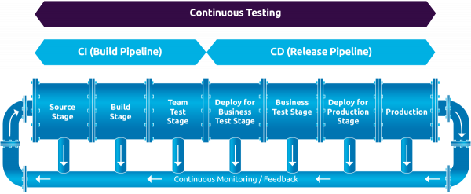
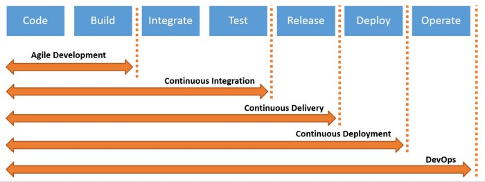

# 🅰️ CICI(ContinuousIntegration and ContinuousDelivery[Deployment])

- Continuous Integration
    - Dev
    - ApplicationTest
    - Intergration Test
- Continuous Delivery
    - Dev
    - ApplicationTest
    - Intergration Test
    - Acceptance Test
- Continuous Deployment
    - Dev
    - ApplicationTest
    - Intergration Test
    - Acceptance Test
    - Production

# 🅰️ JIRA

## 🅱️ Agile

رویکرد مدیریت توسعه‌نرم‌افزار است که برپایه اصولی ۱۲گانه استوار است(توسط گروهی توسعه‌دهنده در سال ۲۰۰۱)

1. Customer satisfaction(رضایت‌مشتری)
2. Welcome changing requirementsm(پاسخ‌به‌تغییرات)
3. Deliver working software frequently(تحویل‌مداوم)
4. Business and developers must work together
5. Build projects around motivated individuals
6. Working software is the primary measure of progress
7. Sustainable development
8. Continuous attention to technical excellence
9. Simplicity
10. The best architectures, requirements, and designs emerge from self-organizing teams
11. Regular reflection and adjustment
12. Attention to good design and technical excellence

## 🅱️ JQL(JiraQueryLanguage)

sprint in openSprints() AND assignee = currentUser() AND (status="In Progress" OR status="To Do")
[Pycharm]:assignee=currentUser() and resolution=Unresolved order by updated

## 🅱️ مفاهیم و توضیحات

- متدولوژی‌ها:
    - **Scrum**:شامل مواردی نظیر ScrumMaster و ProductOwner و [Sprint] و [2الی۳هفته و نهایتا یک ساختار جدید به پروژه]
    - **Kanban** : کار در محدوده فرآیند خاص یعنی WorkInProcess است
    - **ExtremeProgramming**-XP: تأکید بر کیفیت کد و پاسخگویی به تغییرات
        - تکنیک‌هایی مانند برنامه‌نویسی جفتی (Pair Programming)، تست خودکار و ادغام مداوم (Continuous Integration) است
        - هدف آن افزایش کیفیت نرم‌افزار و کاهش ریسک‌های پروژه
- **AgileManifest**
- **scrumban**: تیم‌ها می‌توانند تعداد کارهایی که همزمان در حال انجام هستند را محدود کنند تا از ایجاد تنگناها و هدررفت جلوگیری کنند.
    - از ساختار و نقش‌های اسکرام (مانند اسکرام مستر و مالک محصول) استفاده می‌کند، اما در عین حال از تابلوهای کانبان برای مدیریت جریان کار بهره می‌برد.
    - تیم‌ها می‌توانند از اسپرینت‌های ثابت استفاده کنند، اما همچنین می‌توانند به صورت پیوسته و بدون نیاز به اسپرینت‌های مشخص کار کنند
    - تیم‌ها از تابلو کانبان برای نمایش وضعیت کارها استفاده می‌کنند
- **Lean**: هدف آن افزایش ارزش برای مشتری با کمترین هزینه و زمان ممکن است.
- **UserStory**: ویژگی جدید سیستم که کاربر نهایی درخواست ایجاد آن را داده است
    - A user story is a short and simplified description of a feature in the system which is being developed
- **Epic**:بخش‌های بزرگ کار که قابلیت تقسیم‌بندی به کارهای کوچک‌تر در آن وجود دارد
    - به یک نوع مسئله (Issue Type) اشاره دارد که نمایانگر یک ویژگی بزرگ یا یک هدف کلی در پروژه است. اپیک‌ها معمولاً شامل مجموعه‌ای از استوری‌ها (Stories) و تسک‌ها (Tasks) هستند که به یک هدف مشترک مرتبط می‌شوند.

