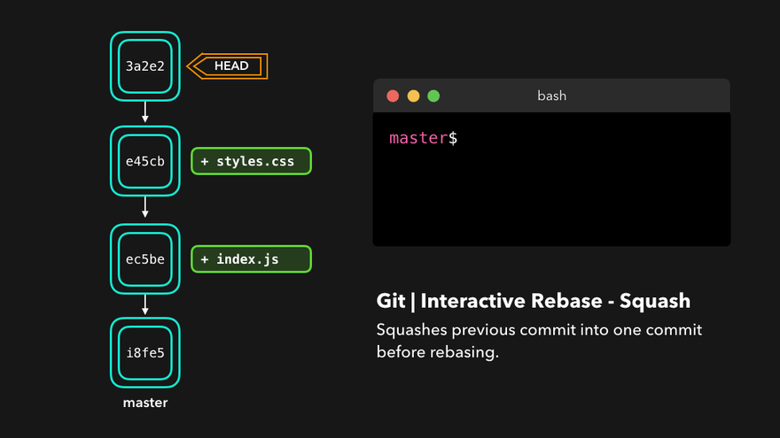
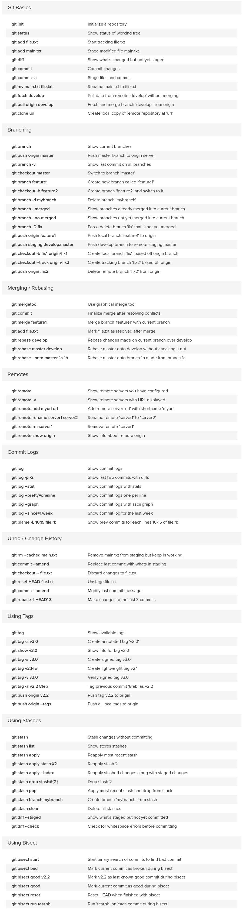

# 1. 🅰️ CICI(ContinuousIntegration and ContinuousDelivery[Deployment])

- Continuous Integration
    - Dev
    - ApplicationTest
    - Intergration Test
- Continuous Delivery
    - Dev
    - ApplicationTest
    - Intergration Test
    - Acceptance Test
- Continuous Deployment
    - Dev
    - ApplicationTest
    - Intergration Test
    - Acceptance Test
    - Production


# 2. 🅰️TaskManager

- متدولوژی‌ها:
    - **Scrum**:شامل مواردی نظیر ScrumMaster و ProductOwner و [Sprint] و [2الی۳هفته و نهایتا یک ساختار جدید به پروژه]
    - **Kanban** : کار در محدوده فرآیند خاص یعنی WorkInProcess است
    - **ExtremeProgramming**-XP: تأکید بر کیفیت کد و پاسخگویی به تغییرات
        - تکنیک‌هایی مانند برنامه‌نویسی جفتی (Pair Programming)، تست خودکار و ادغام مداوم (Continuous Integration) است
        - هدف آن افزایش کیفیت نرم‌افزار و کاهش ریسک‌های پروژه
- **AgileManifest**
- **scrumban**: تیم‌ها می‌توانند تعداد کارهایی که همزمان در حال انجام هستند را محدود کنند تا از ایجاد تنگناها و هدررفت جلوگیری کنند.
    - از ساختار و نقش‌های اسکرام (مانند اسکرام مستر و مالک محصول) استفاده می‌کند، اما در عین حال از تابلوهای کانبان برای مدیریت جریان کار بهره می‌برد.
    - تیم‌ها می‌توانند از اسپرینت‌های ثابت استفاده کنند، اما همچنین می‌توانند به صورت پیوسته و بدون نیاز به اسپرینت‌های مشخص کار کنند
    - تیم‌ها از تابلو کانبان برای نمایش وضعیت کارها استفاده می‌کنند
- **Lean**: هدف آن افزایش ارزش برای مشتری با کمترین هزینه و زمان ممکن است.
- **UserStory**: ویژگی جدید سیستم که کاربر نهایی درخواست ایجاد آن را داده است
    - A user story is a short and simplified description of a feature in the system which is being developed
- **Epic**:بخش‌های بزرگ کار که قابلیت تقسیم‌بندی به کارهای کوچک‌تر در آن وجود دارد
    - به یک نوع مسئله (Issue Type) اشاره دارد که نمایانگر یک ویژگی بزرگ یا یک هدف کلی در پروژه است. اپیک‌ها معمولاً شامل مجموعه‌ای از استوری‌ها (Stories) و تسک‌ها (Tasks) هستند که به یک هدف مشترک مرتبط می‌شوند.

## 2.1. 🅱️Agile

رویکرد مدیریت توسعه‌نرم‌افزار است که برپایه اصولی ۱۲گانه استوار است(توسط گروهی توسعه‌دهنده در سال ۲۰۰۱)

1. Customer satisfaction(رضایت‌مشتری)
2. Welcome changing requirementsm(پاسخ‌به‌تغییرات)
3. Deliver working software frequently(تحویل‌مداوم)
4. Business and developers must work together
5. Build projects around motivated individuals
6. Working software is the primary measure of progress
7. Sustainable development
8. Continuous attention to technical excellence
9. Simplicity
10. The best architectures, requirements, and designs emerge from self-organizing teams
11. Regular reflection and adjustment
12. Attention to good design and technical excellence

## 2.2. 🅱️JIRA

### 2.2.1. ✅️ JQL(JiraQueryLanguage)

sprint in openSprints() AND assignee = currentUser() AND (status="In Progress" OR status="To Do")
[Pycharm]:assignee=currentUser() and resolution=Unresolved order by updated

# 3. 🅰️ReleaseManagement

## 3.1. 🅱️Git

- **حالتUntrackیاUnstage**: گاهی اوقات پیش می‌آید که می‌خواهید گیت از بررسی برخی از فایل‌ها و یا فولدرهای پروژه صرف نظر کند و تغییرات آن‌ها را نادیده بگیرد و آن‌ها را دنبال نکند(گیت مواظب آنها نیست)
- **حالتTrackedیاStage** : وقتی توسط دستور add به گیت اضافه می‌کنیم
    - مثلا می‌توان ۳ فایل جدید ایجاد کرد و ۲تای آن را add کرد و کامیت کرد و پس از اتمام کامیت مجددا یک فایل باقی مانده را add و سپس کامیت کرد و در این صورت دو کامیت مجزا خواهیم داشت
- **HEAD**: یک پوینتر برای نمایش جایی که الآن درآن هستم
- **fork**: ایجاد یک پروژه از پروژه اصلی (دراکانت یک شخص حقیقی) در اکانت شما (بعنوان یک پروژه مستقل که هر کار دلخواه را بدون تغییر روی پروژه اصلی صاحب آن انجام دهید)
- **bisect**: به گیت می‌گوییم که الآن اوضاع بد است و در کدام کامیت اوضاع خوب بوده است و گیت میرود و از وسط آنجا به بعد را می‌آورد و ازت می‌پرسد که آیا اینجا اوضاع خوب بوده است یاخیر و اگر خوب بوده میرود و وسط بعدی را پیشنهاد می‌دهد که آیا خوب بوده است یا خیر و شما باید کامپایل کنین و ببینید اوضاع چگونه است و خوب بود یا بد را به گیت گزارش بدهید تا
  کامیتی که اوضاع شروع به بد بودن کرده یافته شود

توضیحات تکمیلی

- از کلید و امضا و gpg در گیت استفاده نکنید یا اگر استفاده می‌کنید باید همه تیم از امضا کلید استفاده نمایند
- سایت‌هایی که همانند گیت‌هاب سرویس ورژن کنترل ارائه می‌دهند: github، Bitbucket، gitlab،codeplex
- [url](https://dev.to/lydiahallie/cs-visualized-useful-git-commands-37p1)

### 3.1.1. ✅️ Add

* اگر بخواهیم یک فایل را به حالت stage شده دربیاوریم از دستور زیر استفاده می‌کنیم
* فایل های استیج شده قابلیت کامیت خواهند داشت
* همواره برای اینکه بخواهیم یک نسخه پایدار داشته باشیم باید از دستور کامیت استفاده شود و این دستور کامیت حتما باید پس از دستور add زده شود

```shell
git add File.index
git add File1 File2 ...
git add .  # → [new] + [modified]
git add -u # → [modified] + [deleted]
git add -A # → [new] + [modified] + [deleted] ⇉ Stages Everything
git -A     # ⇄ [git add .] + [git add -u]
``` 

### 3.1.2. ✅️ Blame

از بلیم برای عیب‌یابی استفاده می‌شود.(بلیم یعنی مقصر پیدا کردن=تقصیر چه کسی است)

```shell
git help blame         # نمایش توضیحات
git blame FileName -L8 # خط شماره ۸ فایل مذکور توسط چه کسانی نوشته یا تغییر یافته است
git blame fileName     # نمایش تاریخچه تغییرات فایل مورد نظر
```

**switch:**

* -L : تعیین شماره خط
    * -L8 → خط شماره ۸ را در نظر بگیر
    * -L8,10 →خط ۸تا خط شماره ۱۰ را در نظر بگیر
    * اگر شماره خط نگذاریم همه فایل را در نظر خواهد گرفت

### 3.1.3. ✅️ Branch

- **branch**: شاخه‌های گیت
- شاخه های محلی در مسیر`/git/refs/heads./.` ذخیره می شود. اجرای دستور `git branch` یک لیست از مرجع های شاخه محلی تولید می کند.
- شاخه های سرور در مسیر`/git/refs/remotes./.` ذخیره می شود.
- **master**: برنچ اصلی در بدو ساختن یک پروژه گیت[هر پروژه بصورت پیش‌فرض یک برنچ دارد که نام آن مستر است]
- **remote**: پروژه موجود در بستر شبکه رو می‌گویند
- **Origin**: می‌توان دو تا ریموت داشت یعنی اولی در سرور شرکت با نام «اُریجین» و دیگری در مثلا سرور گیت‌هاب با نام «مای اُریجین» که برای این کار باید از دستور زیر استفاده نمایید
    - **حالت اول**: پروژه در شرکت موجود است و شما آن را کلون کرده اید. پس یک ریموت داریم و باید ریموت دوم را تولید نمایید
        - git remote add myorigin https://github.com/behroozmn/project1
    - **حالت دوم**: فقط یک پروزه لوکال دارید و این پروژه اصلا در شبکه و سروری وجود ندارد پس باید در سروری اضافه نمایید
        - git remote add origin https://git.sherkat.ir/behrooz/project1
        - git remote add myorigin https://github.com/behroozmn/project1

```shell
git branch # نمایش برنچ‌های لوکال پروژه و علامت ستاره یعنی این که روی چه برنچی قرار داریم
git branch -r  # نمایش برنچ‌های ریموت پروژه
git branch BranchName #ساخت یک برنچ جدید با نام دلخواه
git branch -d BranchName #حذف یک برنچ
git checkout [branchName] #ورود به یک برنچ
```

### 3.1.4. ✅️ Checkout

```shell
git checkout BranchName # رفتن به یک برنچ جدید
git checkout TagName # رفتن به یک تگ جدید
```

اگر فایلی را خراب کرده‌اید و می‌خواهید به وضعیت قبل برگردانید

```shell
git checkout -- FileName # برگرداندن یک فایل به وضعیت آخرین کامیت آن
git checkout HEAD -- <file_path> # فایلی که به اشتباه حذف شده است(استیج شده بوده) رو از آخرین کامیت برمی‌گردانیم
```

### 3.1.5. ✅️ Clone

وقتی بخواهیم یک ریپوزیتوری که ساخته شده است(قبلا دستور init آن توسط برنامه نویس زده شده است) را به سیستم خود منتقل نموده و از آن استفاده نماییم

```shell
git clone url
```

### 3.1.6. ✅️ Commit

* پس از افزودن فایل‌ها توسط دستور add در گیت، از طریق دستور commit آن را بعنوان یک تغییر پایدار در گیت تثبیت می‌نماییم
* فایل های استیج شده قابلیت کامیت خواهند داشت
* همواره برای اینکه بخواهیم یک نسخه پایدار داشته باشیم باید از دستور کامیت استفاده شود و این دستور کامیت حتما باید پس از دستور add زده شود

```shell
git commit -m "متن دلخواه"
git commit # بازکردن یک ادیتور و نهایتا نوشتن متن دلخواه و سپس ذخیره آن
git commit -am "Message" # همزمان «اَد» کردن و سپس کامیت کردن
git commit --amend -m "New Description" #ویرایش متن یک کامیت  اگر هنوز در سرور پوش نکرده باشید ولی پوش شده باشد دیگر نمیشود
Note: amend means modify the last commit of the current branch

```

### 3.1.7. ✅️ Config

LIST

```shell
git config --list
git config --list --show-origin
git config -l
```

SET

```shell
git config --global user.name "بهروز محمدی نسب" 
git config --global user.email "behroozmn@chmail.ir"
git config credential.helper store #store user and password
git config --edit --local
git config --global alias.Behrooz "log --all --decorate --oneline --graph"
git config --global core.editor "vim"
git config --global core.autocrlf [true | input | false] #prevent auto append "^M" to end of each lines(Run in windows system. )
git config --global core.autocrlf true    #windows
git config --global core.autocrlf input  #Linux And Mac
git config --global core.autocrlf=false #disable(Default)
```

### 3.1.8. ✅️ core.autocrlf

کاراکتر انتهایی هر خط(Line Ending) در سیستم‌عامل‌ها متفاوت است پس حین ایجاد تغییر در فایل‌ها (استفاده گروهی از یک ریپوزیتوری گیت از بستر سیستم‌عامل‌های متفاوت) ممکن است آخر خط‌های این فایل‌ها بسته به سیستم‌عامل CRLF یا LF درج شده باشد

- 🅰️ ویندوز: دو کاراکتر (“n\”) Line Feed و (“r\”) Carriage Return یا همان (CR LF)
- 🅱️ لینوکس و مک: کاراکتر (“n\”) Line Feed

- **windows**
    - بصورت خودکار گیت هنگام بررسی فایل‌های متنی، LF یا همان (“n\”) را به CRLF یا همان (“r\”) تبدیل می کند.
    - بصورت خودکار گیت هنگام ارسال فایل‌های متنی، CRLF (یا همان “r\”) به LF (یا همان “n\”) تبدیل می شود.
    - هنگام check in و check out کردن، گیت به صورت خودکار (“r\”) Carriage Return را حذف و اضافه می کند.
    - گیت بین LF و CRLF تفاوت قائل نشود و این مورد رو به عنوان «تغییر در محتوای فایل» در نظر نگیره باید این گزینه رو فعال کنیم.
    - `git config --global core.autocrlf true`
- **Linux And Mac**
    - اگر به هر دلیلی (“r\”) در انتهای خطوط موجود باشد، هنگام ذخیره در ریپوزیتوری، توسط گیت حذف خواهد شد. طبیعتا لازم نیست هنگام واکشی اطلاعات از ریپوزیتوری تغییری اعمال شود پس فقط در هنگام input لازم است این تبدیل انجام شود.
    - گیت هنگام بررسی فایل های متنی هیچ تبدیلی را انجام نمی دهد.
    - هنگام ارسال فایل های متنی، CRLF (یا همان “r\”) به LF (یا همان “n\”) تبدیل می شود.
    - برخی از افراد استفاده از آن را هنگام توسعه در سیستم های یونیکس توصیه می کنند
    - `git config --global core.autocrlf input`
- **disable(Default)**
    - گیت هیچ تبدیلی را هنگام بررسی یا ارسال فایل های متنی انجام نمی دهد.
    - اگر تنظیم تعریف نشده باشد، این مقدار پیش فرض است.
    - `git config --global core.autocrlf=false`


- core.autocrlf #fix LineEnding problem [url](https://docs.github.com/en/get-started/getting-started-with-git/configuring-git-to-handle-line-endings?platform=windows)
    - git config --global core.autocrlf true #windows
    - git config --global core.autocrlf input #Linux And Mac
    - git config --global core.autocrlf=false #disable(Default)

### 3.1.9. ✅️Diff

```shell
git diff HEAD # تغییرات صورت گرفته نسبت به هِد چه مواردی و چه تغییراتی است
git diff --staged # چه چیزی از مواردی که در استیج هستن تغییر پیدا کرده است
git diff FileName
git diff --color
```

### 3.1.10. ✅️Fetch

* با این دستور هیچ تغییری در منابع لوکال به‌وجود نمیآید وتنها ریموت بروزرسانی می‌شد
* با دستور fetch صحت تغییرات مخزن آنلاین را مشاهده می‌کنیم
* تغییرات به لوکال منتقل نمی‌شود
* تمام ااطلاعات را از سرور می‌گیرد و ریپوزیتوری ریموت که در سیستم شما هست را بروزرسانی می‌کند
* بعد استفاده از دستور fetch، کدتون هیج تغییری نمیکنه(هیچ تغییری در نسخه staging area و نسخه local repository رخ نمی‌دهد)
* زمانی که از اطلاعات تغییر یافته در سرور(توسط دیگران) که می‌بایست مرج بشود اطمینان ندارید اول تغییرات راfetch کنید(تنها دریافت اطلاعات) و بعد از بررسی آن تغییرات را در شاخه مورد نظر مرج نمایید

نکته: دو دستور زیر باهم مساوی هستند

```shell
git pull origin master               # 🅰️
git fetch && git merge origin/master # 🅱️

```

```shell
git fetch origin #    تنها مشاهده تغییرات سرور آنلاین(ریموت)
git fetch <remoteName> # بروزرسانی تمام تغییرات در ریپوزیتوری ریموت موجود درسیستم لوکال
git fetch <remoteName> <branch> بروزرسانی تغییرات برنچ مورد نظر از ریپوزیتوری ریموت در سیستم لوکال
git fetch --all # تمام ریموت‌های ثبت شده و شاخه های آنها را دریافت می کند
git fetch --dry--run # فقط نمایش خروجی کاری که می‌خواهد انجام شود و هیچ کاری نمی‌کند
```

<div style="display: flex; flex-direction: column; align-items: center;">


</div>

### 3.1.11. ✅️Init

همواره برای شروع به گیت باید از دستور زیر استفاده شود. یعنی این دستور یک پوشه مخفی گیت ایجاد می‌کند و مدیریت گیت را برعهده می‌گیرد

```shell
cd <Dir>; git init
```

### 3.1.12. ✅️Log

```shell
--all
--graph
--abbrev-commit
--decorate
--date=relative
--stat

```

```shell
git log
git log --graph --all #نمایش گراف برپایه کاراکترهای اسکی
git log --graph       #نمایش گراف برپایه کاراکترهای اسکی برای برنچ فعلی که توش هستیم
git log --all --decorate --oneline --graph
git log --all --decorate --graph
git log --graph --abbrev-commit --decorate --format=format:'%C(bold blue)%h%C(reset) - %C(bold green)(%ar)%C(reset) %C(white)%s%C(reset) %C(dim white)- %an%C(reset)%C(auto)%d%C(reset)' --all
git log --graph --abbrev-commit --decorate --format=format:'%C(bold blue)%h%C(reset) - %C(bold cyan)%aD%C(reset) %C(bold green)(%ar)%C(reset)%C(auto)%d%C(reset)%n''          %C(white)%s%C(reset) %C(dim white)- %an%C(reset)'
git log --graph --pretty="%C(yellow) Hash: %h %C(blue)Date: %ad %C(green) Message: %s " --date=human --date=relative
git log --graph --pretty="%C(yellow) Hash: %h %C(blue)Date: %ad %C(green) Message: %s " --date=human
git log --all --decorate --oneline --graph --stat

```

### 3.1.13. ✅️Merge

- ابتدا باید به برنچ مستر برویم و سپس یک برنچ را مرج کنیم تا آن برنج فرعی روی مستر اعمال شود
- در هنگام تایید یک **mergeRequest** گزینه Squash commit سبب ترکیب چندین کامیت(در برنچ مد نظر) به یک کامیت در برنچ مقصد می‌شود
- در هنگام تایید یک **mergeRequest** گزینه **Approved** به معنای تایید یک درخواست است. یعنی فرد بررسی‌کننده تغییرات کد را مطالعه و ارزیابی کرده و هیچ مشکلی در آن پیدا نکرده است.در پروژه‌ها، قبل از ادغام، نیاز است که یک یا چند نفر تغییرات را بررسی و تأیید کنند که این فرآیند به عنوان "Code Review" شناخته می‌شود
- برای جلوگیری از کانفلیکت باید برای هر کار کوچک کامیت زد

merge DevBehrooz into main

```shell
git branch #فهمیدن اینکه در چه برنچی هستیم
git checkout branch1 #ورود به برنچ۱ که قصد داریم برنچ۲ را درون آن مرج نماییم
git merge branch2 # افزودن دیتای برنچ۲ به برنچ۱
git push origin
git push origin branch2
git push origin branch1
```

```shell
# fast-forward(--ff): وقتی تغییرات نداشته باشد یا کم باشد دراین صورت برای ادغام، کامیت جدید ایجاد نمیکند
# no-fast-forward(--no-ff): ایجاد کامیت جدید و قابل دسترس برای هر دو برنچ
# --abort حذف عملیات مرج در زمانی که یک کانفلیکتی رخ داده است
git merge --abort <branch-name>
git merge --no-commit <branch-name>
checkout main git merge --no-ff -m "Merge branch Develop into main" Develop # هرچند در وضعیت «فست‌فوروارد[عدم ساخت کامیت جدید بخاطر نبودن تفاوت بین دو برنچ]» هستیم، اما سیستم را ملزم به ایجاد کامیت می‌کنیم
```

<div style="display: flex; flex-direction: column; align-items: center;">


</div>

### 3.1.14. ✅️Pull

- در **مرحله اول** همانند **fetch** عمل میکند و تمام ااطلاعات را از سرور می‌گیرد و ریپوزیتوری ریموت داخل سیستم را بروزرسانی می‌کند
- **مرحله دوم**: اطلاعات نسخه **remote repository** رو با نسخه **local repository** مرج میکنه
    - به همین خاطر تغییرات سرور در سیستم شما آورده می‌شود
- **مرحله سوم:** اگر درحال تغییر در فایل هستید ممکن است **conflict** رخ دهد که باید این تعارض را مرتفع نمایید
- زمانی که از اطلاعات تغییر یافته در سرور(توسط دیگران) که می‌بایست مرج بشود اطمینان ندارید اول تغییرات راfetch کنید(تنها دریافت اطلاعات) و بعد از بررسی آن تغییرات را در شاخه مورد نظر مرج نمایید
- می‌توان چندین سرور ریموت داشته باشیم. مثلا ریموت سرور «گیت‌لب‌(شرکت)» یا «گیت‌هاب(شخصی‌برنامه‌نویس)» یا «گیت‌هاب(شرکت بستر اینترنت)» باشد

نکته: دو دستور زیر باهم مساوی هستند

```shell
git pull origin master; # ✅️
git fetch; git merge origin/master; # ✅️

```

```shell

git pull <RemoteName> <localBranch> # Fetch and Merge branch localBranch from RemoteBranch
git pull origin [master|develop|bug|...] 
# 1️⃣️:تمام تغییرات شاخه لوکال(مستر یا دِوِلُپ یا باگ یا هرچیزی دیگر) را از سرور گیت بگیر و در ریپوزیتوری ریموت(موجود در سیستم لوکال) بروزرسانی کن
# 2️⃣️:تغییرات آورده شده را در شاخه لوکال نیز اعمال کن یعنی مرج کن
# 3️⃣️:اگر تغییرات تعارض داشت پیام بده تا توسط کاربر این تعارض مرتفع گردد
git pull MyGithub DevMohammadinasab # Fetch and Merge LocalBranch DevMohammadinasab from MyGithub(ServerName)
git pull origin develop # Fetch and Merge branch develop from origin(سرور ریموت که نام آن را اوریجین گذاشته‌ایم)
```

<div style="display: flex; flex-direction: column; align-items: center;">


</div>

### 3.1.15. ✅️Push

قرار دادن دیتا به درون سرور از سیستم لوکال خودمان

```shell
git push origin master # در سرور «اُریجین» برنچ «مستر» را اضافه کن

```

### 3.1.16. ✅️Rebase

```shell
# شاخه ها
# main: A --- B --- C
# feature: D --- E

# Rebase
git checkout feature
git rebase main
# A --- B --- C  (main)
#                    \
#                      D' --- E' (feature)

# Merge
git checkout main
git merge feature
# A --- B --- C --- D' --- E' (main)

```

- Rebase
    - فرآیند انتقال یا ترکیب یک سری از «کامیت»ها از یک برنچ، به یک «کامیت» پایه جدید در برنچ دیگر
    - مبنای ایجاد کامیت جدید
    - دلیل اصلی تغییر پایه، خطی نگه داشتن تاریخچه پروژه است
    - عمل Rebase در شاخه‌های ریموت نیازمند force push است

```shell
$git checkout Feature; git rebase master # Rebase the Feature into master 
# کل شاخه «فیچر» روی شاخه مستر منتقل شود
# این کار از طریق بازنویسی سابقه پروژه با ایجاد کامیت‌های تازه برای هر کامیت در شاخه  مستر صورت می‌گیرد
```

- standard rebase:
    - هرگز نباید مرتکب «کامیت» مجدد یا همان rebase commit شوید.زیرا Rebase کاری که می‌کند این است که «کامیت» جدید را جایگزین «کامیت» های قدیمی می‌کند و به نظر می رسد که بخشی از تاریخچه ی پروژه شما، به طور ناگهانی از بین رفته است.


- Interactive rebase(تعاملی):
    - این وضعیت امکان تغییر دادن کامیت‌ها در هنگام انتقالشان به شاخه جدید را فراهم می‌کند.
    - این وضعیت قوی‌تر از rebase خودکار است، چون کنترل کاملی روی سابقه کامیت شاخه ارائه می‌کند.
    - به طور معمول از این روش برای پاکسازی یک سابقه شلوغ، پیش از ادغام شاخه feature در master استفاده می‌شود.
    - item
        - **reword**: تغییر «مسیج» کامیت
        - **edit**: Amend this commit
        - **squash**: Meld commit into the previous commit
        - **fixup**: Meld commit into the previous commit, without keeping the commit's log message
        - **exec**: Run a command on each commit we want to rebase
        - **drop**: Remove the commit

```shell
git checkout Feature; git rebase -i master # [OR] git rebase --interactive master # دستورهای فوق باعث باز شدن ویرایشگر می‌شود و همه کامیت‌هایی که باید منتقل شوند، برای اصلاحات فهرست می‌شوند
# out:replace pick with [fixup | squash | edit | pick | reword | exec | drop]
#     pick 22d6d7c Commit message#1
#     pick 44e8a9b Commit message#2
#     pick 79f1d2h Commit message#3

```

rebase: «git rebase» copies the commits from the current branch, and puts these copied commits on top of the specified branch.


<div style="display: flex; flex-direction: column; align-items: center;">





</div>

### 3.1.17. ✅️Remote

کارهای مربوطه به پروژه سرور شبکه[میتوانیم دوتا ریموت داشته باشیم یکی مثلا نام «اوریجین» در سرور شرکت و دیگری مثلا در گیت‌هاب بنام «مای اوریجین»]

```shell
git remote # تمام اطلاعات مربوط به ریموت را نمایش می‌دهد
git remote -v  # نمایش اطلاعات بیشتر 
git remote rename server1 server2
git remote origin myOrigin
git remote show <RemoteName[origin|myOrigin]>
git remote show origin # show info about remote o

# اگر پروژه تا اکنون درحال کار بصورت لوکال است وبخواهیم به سرور انتقال بدهیم به روش زیر افدام نمایید
git remote add origin https://... #یک پروژه در سرور اضافه کن و نام آن را «اریجین» بگذار و آدرس آن هم فلان است و نکته این است که قبل از پوش به سرور اضافه نخواهد شد و باید حتما پوش کنیم
git remote add coworkers_repo https://github.com/sokanacademy/coworkers_repo.git
```

### 3.1.18. ✅️Reset

برای خارج نمودن یک فایل استیج شده از دستور زیر استفاده می‌نماییم

```shell
git reset FileName # خارج نمودن فایل از استیج
git reset --hard #نادیده گرفتن تمام تغییرات لوکال
```

<div style="display: flex; flex-direction: column; align-items: center;">


</div>

### 3.1.19. ✅️Rm

```shell
git rm FileName # حذف یک فایل از گیت و همچنین از فایل‌سیستم
git rm --cached <FileNames> # حذف فایل «استیج» شده موجود در گیت
git rm --cached -r <FOLDER> # حذف فولدر «استیج» شده موجود در گیت
git checkout HEAD -- <file_path> # فایلی که به اشتباه حذف شده است(استیج شده بوده) رو از آخرین کامیت برمی‌گردانیم
```

> حذف یک فایل که به اشتباه به گیت اضافه و کامیت شده است

```shell
git rm --cached giant_file # Stage our giant file for removal, but leave it on disk
git commit --amend -CHEAD  # Amend the previous commit with your change Simply making a new commit won't work, as you need to remove the file from the unpushed history as well
git push                   # Push our rewritten, smaller commit

```

### 3.1.20. ✅️Status

نمایش وضعیت کنونی گیت

```shell
git status
git log # شماره کامیت رو هم نشان می‌دهد
git log --stat --summary #مشاهده کارهایی که کرده‌اید
git log -p # مشاهده کارهایی که کردید با تفاوت دیف‌ها
git show [CommitHashName | TagName]
```

### 3.1.21. ✅️Tag

- **tag**: برچسب زدن به روی یک کامیت و معمولا برای زمانی یک برچسب را روی کامیت میزنیم که بخواهیم راحت تر آن را پیدا کنیم یا اینکه مثلا در کامیت مورد نظر رلیز صورت گرفته است
- توسط این تگ‌ها می‌توانیم پروژه را ورژن بندی نماییم و هرگاه بخواهیم به ورژن ۲ دسترسی یابیم آنگاه به آن کامیت «چک‌اوت» نماییم و ورژن را راه‌اندازی نماییم
- در حالت عادی پوش، تگ به سرور پوش نمی‌شود یعنی با دستور git push تگ پوش نمی‌شود

```shell
git tag #نمایش تگ‌های فعلی پروژه
git tag -a <TagName> -m "<Message>" #افزودن تگ به کامیت فعلی
git tag -a v2.0 -m "Release for ..."
# [-m] پیغامی که برای یک تگ بعنوان توضیحات اضافی می‌نویسیم
# [-a] معرف «اَنوتِیت»است که نام یک تگ را مشخص می‌کند
git tag -a v1.8 <CommitHashName> # افزودن تک به یک کامیت موجود
# 6. در اینجا یک صفحه باز می‌شود و توضیحات می‌خواهد
git tag -l "v*" # هر تگی که با وی شروع می‌شود را لیست کند
git show <tagName>
git push origin <TagName> # تگ در پوش عادی به سرور اضافه نمی‌شود و باید توسط نام تگ آن را به سرور اضافه نماییم
git push origin --tags # تگ در پوش عادی به سرور اضافه نمی‌شود ، با دستور روبرو تمام تگ‌ها را به سرور اضافه می‌کنیم
```

### 3.1.22. ✅️Files

#### 3.1.22.1. 📁️ .gitignore

- تنها یک فایل از نوع gitignore در تمام پروژه خواهیم داشت(می‌شود دوتا یا چند تا باشد ولی استاندارد نیست)
- فایل مخفی gitignore فقط برای فایل‌هایی کاربرد دارد که untracked هستند یعنی هنوز با دستور git add به stage در گیت اضافه نشدند
    - اگر بخواهیم یک فایل که اضافه شده است را حذف نماییم از دستور git rm --cached NAME استفاده می‌کنیم
-

```shell
touch .gitignore #go to the root of your local Git, and create it
```

-
    * → The asterisk symbol matches zero or more characters.
- /access.log → نادیده گرفتن دقیقا این فایل در مسیر اصلی پروژه
    - access.log
- access.log → فایل که در هرکجا باشد
    - [access.log]
    - [logs/access.log]
    - [var/logs/access.log]
- *.log → #ignore any files with the .log extension[all .log files]
    - error.log
    - logs/debug.log
    - build/logs/error.log
- logs/**  → نادیده گرفتن همه مواردی که در مسیر روت پروژه در فولدر لاگ قرار دارد
- **/build → [نادیده گرفتن تمام فولدرها(بامحتویات آن) که نام آن بیلد است][files and folders in any build folder]
    - var/build
    - pub/build
    - build
- temp/ → ignore ALL files in ANY directory named temp
    - .idea/ → Ignore IDE specific files
    - .vscode/ → Ignore IDE specific files
- foo/**/bar
    - foo/bar
    - foo/a/bar
    - foo/a/b/c/bar
- access?.log
    - access0.log
    - access1.log
    - accessA.log
- foo??
    - fooab
    - foo23
    - foo0s
- *.[oa]
    - file.o
    - file.a
- *.[!oa]
    - file.s
    - file.1
    - file.0
- access.[0-2].log
    - access.0.log
    - access.1.log
    - access.2.log
- file.[a-c].out
    - file.a.out
    - file.b.out
    - file.c.out
- file.[a-cx-z].out
    - file.a.out
    - file.b.out
    - file.c.out
    - file.x.out
    - file.y.out
    - file.z.out
- access.[!0-2].log
    - access.3.log
    - access.4.log
    - access.Q.log
- [/lib/**/name] #All name folders, and files and folders in any name folder within the lib folder.
- [*.file] #All files withe .file extention
- [*name/] #All folders ending with name
- [name?.file] #? matches a single non-specific character
- [name[a-z].file] #[range] matches a single character in the specified range (in this case a character in the range of a-z, and also be numberic.)

# 4. 🅰️ Monitoring

## 4.1. 🅱️ Glance

```shell
apt install glances python-bottle
glances #standalone mode
glances -w #Web server mode
glance -s #client/server mode
glances -c <ip> #on the server side
glances --browser #display all Glances servers available on network or defined in the configuration file
```

## 4.2. 🅱️ Zabbix

## 4.3. 🅱️ Prometheus

* طراحی برای محیط‌های میکروسرویس و ابری
* زبان پرسجوی PromQL
* بیشتر در محیط‌های مدرن و میکروسرویس‌ها استفاده می‌شود و به خوبی با ابزارهایی مانند کوبرنتیز یکپارچه می‌شود
* مانیتورینگ شبیه به zabbix (زبیکس) است

<div style="display: flex; flex-direction: column; align-items: center;">



</div>

# 5. 🅰️ Email

## 5.1. 🅱️ Concepts

- ایمیل سرور در لینوکس به ۳نقش اساسی تقسیم می‌شوند(مرز آنها نزدیک‌به هم هستند و ممکن است یک برنامه کار دیگری را نیز انجام دهد)
    - [MTA]: مخفف MailTransferAgent است و کار آن ارسال ایمیل است
    - [MDA]: مخفف MailDeliveryAgent است وکار آن رساندن نامه به مقصد تحت سیاست یا policy خاص یا مسیر ذخیره سازی خاص یا فرمت ذخیره سازی خاص و غیره است
    - [MUA]: مخفف MailUserAgent است و کار آن ارتباط با کاربر است برای خواندن یک نامه
- Sieve: مکانیزمی برای ایجاد یک قانون جدید به‌طور مثال اگر یک کلمه در عنوان بود آن را به دایرکتوری خاص منتقل بنماید
- توسط دو برنامه زیر امکان ریموت زدن از کلاینت به سرور و دیدن ایمیل‌های موجود در سرور توسط imap و pop3 مهیا می‌شود
    - ۱-Courier: خیلی بزرگ هست و معمولا در استفاده محدود میکنند به ریموت زدن به ایمیل سرور و دریافت داده ها از سرور
    - ۲-Dovecot: اصولا برای استفاده در پروتکل imap استفاده می‌شود ولی می‌تواند برای pop3 نیز مورد استفاده قرار گیرد
- معروف‌ترین MDA ها
    - [Binmail]: استفاده از فایل var/spool//mail همچنین می‌توان تنظیم کرد تا از دایرکتوری Home/mail$ نیز استفاده نماید و برنامه mail یعنی خط فرمان دستور mail تایپ کنیم را بعنوان ابزار توصیه میکند
    - [Procmail] قواعد قرار میدهد مثلا میگوید اگر چیزی تحت عنوان فلان دیدی آن را حذف یا به دایرکتوری فلان منتقل کن
- mbox: یک فایل متنی خیلی بزرگ که همه ایمیل‌ها در آن هست و با آمدن هر نامه به انتهای این فایل متنی اضافه می‌شود
- نحوه‌های ذخیره‌سازی نامه‌ها یعنی User MailBox به روش‌های زیر است
    - ۱-[/var/spool/mail[ files]: به این متد استفاده از mBox نیز گفته می‌شود
    - ۲-[$HOME/mail]: برای هر کاربر مسیر جداگانه با محتوی متفاوت ایجاد می‌کند
    - ۳-aildir-style mailbox directories]: به این متد استفاده از maildir گفته می‌شود و دراین روش برای Inbox و دیگر پوشه‌ها یک دایرکتوری متفاوت ایجاد میکند و قابلیت ساخت دایرکتوریهای متفاوت مهیا است
- از معروف‌ترین MTA ها
    - ۱-[sendmail]:قدیمی‌تر و کانفیگ سخت‌تر و خیلی بزرگ است. سخت است و یک برنامه بنام M4 تنظیمات را میگیرد و تبدیل میکند به فایل با فرمت cf که قابل فهم برای sendmail است که استفاده نمی‌شود
    - ۲-[postfix]: توسط یوزر postfix اجرا می‌شود. آسان‌تر و معمول‌تر می‌باشد. ماژولار است و ماژول‌ها جدای از هم کارها را انجام می دهند و بعد میایند پایین. یک برنامه core بنام master در مسیر /usr/sbin/postfix/master دارد که اجزای متفاوت را در زمان مورد نیاز run میکند
    - ۳-[exim]:
- اینترفیس کاربران برای زمانیکه می‌خواهیم از اینباکس ایمیل‌ها را بخوانیم که از مشهور‌ترین های آن موارد زیر است
    - [mail]: برنامه ساده که در ترمینال می‌توان آن را مشاهده کرد
    - [evolution]
    - [thunderbird]
- MIME: یک نامه همزمان در وضعیت html و plainText و غیره دریافت می‌شود و برنامه تعیین میکند که تحت چه وضعتی به کاربر نمایش دهد
-

```
[SMTP Server(Outgoing Messages) ]-[Non-Encrypted]-[AUTH]-[25(or 587)]
[SMTP Server(Outgoing Messages) ]-[Secure(TLS)]-[StartTLS]-[587]
[SMTP Server(Outgoing Messages) ]-[Secure(SSL)]-[SSL]-[465]
[POP3 Server(Incoming Messages)]-[Non-Encrypted]-[AUTH]-[110]
[POP3 Server(Incoming Messages)]-[Secure(SSL)]-[SSL]-[995]

[Gmail]:
[SMTP Server(Outgoing Messages)]-[smtp.gmail.com]-[SSL]-[465]
[SMTP Server(Outgoing Messages)]-[smtp.gmail.com]-[StartTLS]-[587]
[POP3 Server(Incoming Messages)]-[pop.gmail.com]-[SSL]-[995]

[Yahoo]:
[SMTP Server(Outgoing Messages)]-[smtp.mail.yahoo.com]-[SSL]-[465]
[POP3 Server(Incoming Messages)]-[pop.mail.yahoo.com]-[SSL]-[995]

```

- برای راه‌اندازی میل سرور و ارسال ایمیل باید در دی ان اس ptr ست شده باشد در غیر این صورت ایمیل های ارسالی به بسیاری از میل سرور ها قبول نمی شود.
    - ۱-برای set کردن ptr باید از isp درخواست کرد که این کار را انجام دهد و برای هر ip تنها یک PTR می توان ست کرد
    - ۲-راه حل دوم استفاده smtp autentication است برای این کار یک سرور که ptr دارد را با وصل شدن به آن ایمیل ها را از آن طریق ارسال می کنیم باید در postfix یا sendmail یا هر سرویس ایمیل دیگری ست کنیم که از سرور دیگر برای ارسال ایمیل ها استفاده کن

```shell


# Ubuntu
sudo apt-get install postfix libsasl2 ca-certificates libsasl2-modules

#Fedora
yum install cyrus-sasl postfix ca-certificates

# این ها رو هم نصبشون اختیاری هستش
dovecot system-switch-mail system-switch-mail-gnome

# حالا تنظیمات postfix رو برای افزودن تغییرات ادیت می کنیم
sudo nano /etc/postfix/main.cf

# این خط ها رو بهش اضافه می کنیم
relayhost = [smtp.gmail.com]:587
smtp_sasl_auth_enable = yes
smtp_sasl_password_maps = hash:/etc/postfix/sasl_passwd
smtp_sasl_security_options = noanonymous
smtp_tls_CAfile = /etc/postfix/cacert.pem
smtp_use_tls = yes

# حالا نام کاربری و رمز عبور اکانتی که در جیمیل ساختیم رو ست می کنیم
sudo nano /etc/postfix/sasl_passwd
[smtp.gmail.com]:587 user.name@gmail.com:password

#‌حالا sasl password رو فعال می کنیم
sudo chmod 400 /etc/postfix/sasl_passwd
sudo postmap /etc/postfix/sasl_passwd

#‌نیاز به certifcate داریم پس می سازیمشون
openssl req -new -x509 -keyout cakey.pem -out cacert.pem -days 3650
openssl req -nodes -new -x509 -keyout sendmail.pem -out sendmail.pem -days 3650

#‌می تونیم از فایل /usr/share/ssl/ca-bundle.crt هم استفاده کنیم به هر ترتیب باید این دستور رو بزنیم
cat /etc/ssl/certs/[created_cert.pem] | sudo tee -a /etc/postfix/cacert.pem

# حال postfix رو ریلود می کنیم
sudo /etc/init.d/postfix reload
systemctl reload postfix
```

## 5.2. 🅱️IMAP(Internet Message Access Protocol)

- دریافت ایمیل تحت پروتکل imap از طریق کامند‌لاین که از پورت ۱۴۳ استفاده می‌کند

```shell
rich@myhost:~$ telnet localhost 143
Trying 127.0.0.1...
Connected to localhost.
Escape character is '^]'.
* OK [CAPABILITY IMAP4rev1 UIDPLUS CHILDREN NAMESPACE THREAD=ORDEREDSUBJECT
THREAD=REFERENCES SORT QUOTA IDLE ACL ACL2=UNION] Courier-IMAP ready. Copyright
1998–2011 Double Precision, Inc. See COPYING for distribution information.
a001 LOGOUT
* BYE Courier-IMAP server shutting down
a001 OK LOGOUT completed
Connection closed
```

```shell
APPEND Appends a message to the end of a mailbox
CAPABILITY Requests a list of capabilities of the IMAP server
CHECK Creates a checkpoint for the mailbox
CLOSE Closes the open mailbox
COPY Copies messages between mailboxes
CREATE Creates a new mailbox
DELETE Deletes a mailbox
EXAMINE Opens a mailbox in read-only mode
EXPUNGE Removes all messages from a mailbox tagged for deleting
FETCH Retrieves the text of a specified message
LIST Retrieves a list of all mailboxes
LOGOUT Logs out from the current server
LSUB Retrieves a list of only active mailboxes
NOOP Performs no operation
RENAME Renames a mailbox
SEARCH Searches messages in an active mailbox that match a search string
SELECT Selects an active mailbox
STATUS Requests the status of a mailbox
STORE Alters information associated with a message
SUBSCRIBE Adds a mailbox to the list of active mailboxes (اگر میل‌باکس تغییر کرد متوجه بشویم)UID Sets message references to the UID number instead of the
sequence number
UNSUBSCRIBE Removes a mailbox from the list of active mailboxes

```

## 5.3. 🅱️POP(Post Office Protocol)

- دریافت ایمیل POP3 از طریق کامند لاین که از پورت ۱۱۰ استفاده میکند

```shell
1-
rich@myhost:~$ telnet localhost 110
Trying 127.0.0.1...
Connected to localhost.
Escape character is '^]'.
+OK Hello there.
QUIT
+OK Better luck next time.
Connection closed by foreign host.
rich@myhost:~$
```

دستورات زیر کامندهای سمت کلاینت پروتکل pop3 است

```shell
STAT Returns current status of the mailbox
LIST Returns a brief list of mailbox messages
RETR Returns a specific mailbox message
DELE Deletes a specific mailbox message
UIDL Provides a unique numeric identifier for each message
TOP Returns a brief listing of the most recent mailbox messages
NOOP Performs no operation
RSET Resets the session back to the start
QUIT Terminates the POP3 session
```

## 5.4. 🅱️SMTP(Simple Mail Transport Protocol)

- پروتکلی برای ارسال ایمیل بین کلاینت و سرور یا بین سرورهای ایمیل سرور که از پورت ۲۵ استفاده می‌کند که دستورات ابتدایی پروتکل SMTP به شرح زیر است
    - HELO: Opening greeting from client
    - MAIL: Identifies sender of message
    - RCPT: Identifies recipients
    - DATA: Identifies start of message
    - SEND: Sends message to terminal
    - SOML: Send-or-Mail
    - SAML: Send-and-Mail
    - RSET: Resets SMTP connection
    - VRFY: Verifies username on system
    - EXPN: Queries for lists and aliases
    - HELP: Requests list of commands
    - NOOP: No operation—does nothing
    - QUIT: Stops the SMTP session
    - TURN: Reverses the SMTP roles
- کدهای response پروتکل smtp به شرح زیر است:
    - 500 Error Syntax error, command not recognized
    - 501 Error Syntax error in parameters
    - 502 Error Command not implemented
    - 503 Error Bad sequence of commands
    - 504 Error Command parameter not implemented
    - 211 Informational System status or system help
    - 214 Informational Help message
    - 220 Service ready
    - 221 Service closing transmission channel
    - 421 Service not available
    - 250 Action Requested mail action OK, completed
    - 251 Action User not local, will forward to <forward-path>
    - 354 Action Start mail input: end with <CRLF>.<CRLF>
    - 450 Action Requested mail action not taken: mailbox unavailable
    - 451 Action Requested action aborted: error in processing
    - 452 Action Requested action not taken: insufficient system storage
    - 550 Action Requested action not taken: mailbox unavailable
    - 551 Action User not local: please try <forward-path>
    - 552 Action Requested mail action aborted: exceeded storage allocation
    - 553 Action Requested action not taken: mailbox name not allowed
    - 554 Action Transaction failed

مثال۱ از استفاده از پروتکل «اس‌ام‌تی‌پی»

```shell
$ telnet localhost 25
Trying 127.0.0.1...
Connected to localhost.
Escape character is '^]'.
220 myhost ESMTP Postfix (Ubuntu)
QUIT
221 Bye
Connection closed by foreign host.
$
```

مثال دوم از ارسال ایمیل

```shell
rich@myhost:~$ telnet localhost 25
Trying 127.0.0.1...
Connected to localhost.
Escape character is '^]'.
220 myhost ESMTP Postfix (Ubuntu)
HELO localhost
250 myhost
MAIL FROM:rich@localhost
250 2.1.0 Ok
RCPT TO:rich
250 2.1.5 Ok
DATA
354 End data with <CR><LF>.<CR><LF>
This is a short test of the SMTP email system.
.
250 2.0.0 Ok: queued as E67A820C0E
QUIT
221 2.0.0 Bye
Connection closed by foreign host.
```

دریافت ایمیل ارسال شده در مثال شماره ۳ توسط یک برنامه که در لوکال‌هاست کامپیوتر فعلی موجود است

```shell
rich@myhost:~$ mail
"/var/mail/rich": 1 message 1 new
>N
1 rich@localhost
Wed Mar 16 23:21 11/408
? 1
Return-Path: <rich@localhost>
X-Original-To: rich
Delivered-To: rich@myhost
Received: from localhost (localhost [127.0.0.1])
by mthost (Postfix) with SMTP id E67A820C0E
for <rich>; Wed, 16 Mar 2016 23:20:41 -0400 (EDT)
Message-Id: <20160317032053.E67A820C0E@myhost>
Date: Wed, 16 Mar 2016 23:20:41 -0400 (EDT)
From: rich@localhost
This is a short test of the SMTP email system.
? x
rich@myhost:~$
```

[Link](https://www.arclab.com/en/kb/email/list-of-smtp-and-pop3-servers-mailserver-list.html)