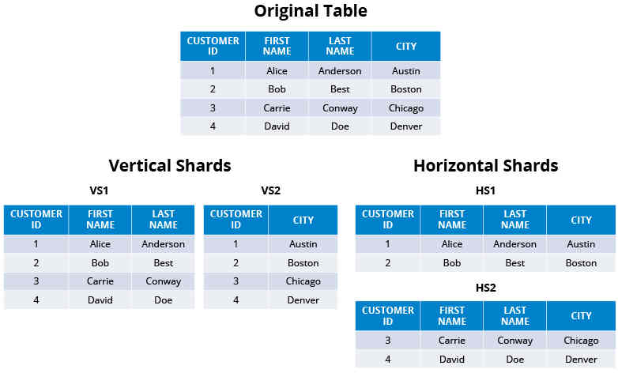
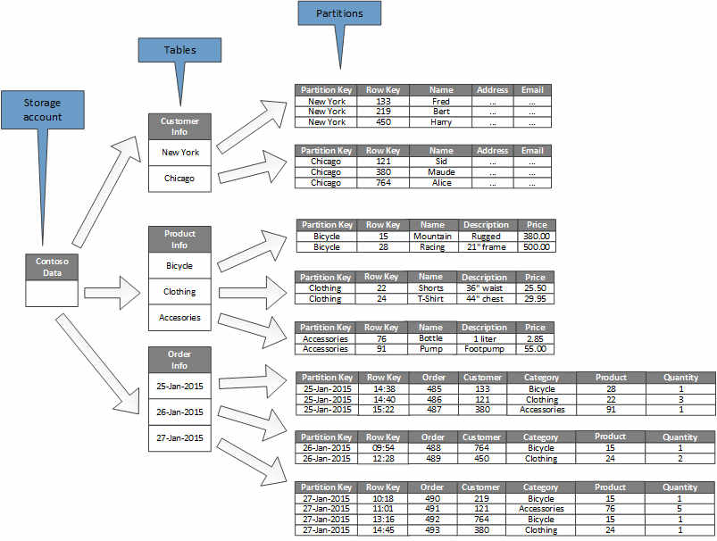

# تعریف 

# 1.Database

**دیتابیس** : پایگاه‌داده فیزیکی که شامل تمام داده‌ها و فایل‌های مرتبط آن است
> یک دیتابیس می‌تواند شامل چندین Schema باشد

# 2.Schema(اسکیما)

**اسکیما**: اسکیما(Schema): نحوه مدیریت و سازمان‌دهی(نظام منطقیِ ساختاریافته) داده‌ها در دیتابیس
> هر اسکیما می‌تواند شامل چندین جدول‌ودیگر اشیاءپایگاه‌داده باشد

## کارهای اسکیما

1. طراحی منطقی ساختار جداول(Tables)و ستون‌های‌آن(Columns) و نوع داده‌ی هر ستون(Data Types)\
   بطورمثال: جدول users شامل ستون‌های id (عددی)، name (رشته‌ای) و email (رشته‌ای) باشد.
2. طراحی منطقی روابط بین جداول(Relationships) که مثلا رابطه‌ی «یک‌به‌چند» یا «چندبه‌چند» باشند\
   بطور مثال: جدول orders ممکن است به جدول users از طریق کلید خارجی (user_id) مرتبط باشد
3. قیدها(Constraints)
4. تعیین قوانین و محدودیت‌ها : شامل قیدهایی مثل PRIMARY KEY، FOREIGN KEY، NOT NULL، UNIQUE و غیره

## اسکیما در انواع دیتابیس

* در پایگاه‌داده PostgreSQL : اسکیما به‌طور گسترده استفاده می‌شود و می‌توانید چندین Schema در یک پایگاه‌داده داشته باشید.
* در پایگاه‌داده MySQL: اسکیما و Database تقریباً معادل هستند. به عبارت دیگر، ایجاد یک Schema معادل با ایجاد یک Database است.
* در پایگاه‌داده SQLserver :Schema یک لایه‌ی منطقی در داخل یک Database است.

# 3.Sharding

> خرد کردن دیتا(از بزرگ به کوچک)

**database Sharding**: optimizing database management systems by separating the rows or columns of a larger database table into multiple smaller tables

# 4.Partition

> خرد کردن دیتا(از بزرگ به کوچک)

**Database partition**: division of a logical database into distinct independent parts

