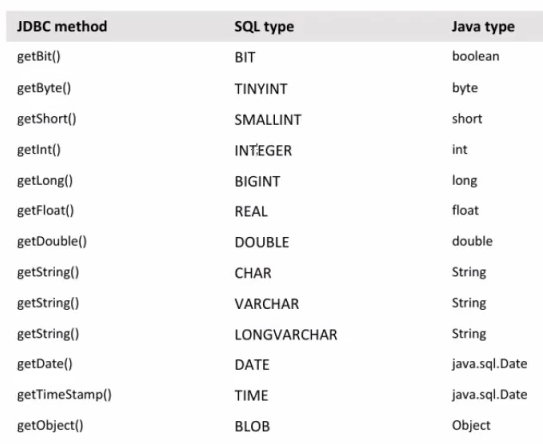

# 1. 🅰️ مفاهیم و نکات

* **دیتابیس** : پایگاه‌داده فیزیکی که شامل تمام داده‌ها و فایل‌های مرتبط آن است
    * یک دیتابیس می‌تواند شامل چندین Schema باشد
* **DBMC(DataBaseManagementSystem)**: نرم‌افزارهایی که کار آن نگهداری و ساماندهی دیتا می‌باشد
* **DBA(DataBaseAdmin)**: شخصی که مسئول مدیریت یک DBMS می‌باشد
* **Schema(اسکیما)**: نحوه مدیریت و سازمان‌دهی(نظام منطقیِ ساختاریافته) داده‌ها در دیتابیس
    * هر اسکیما می‌تواند شامل چندین جدول‌ودیگر اشیاءپایگاه‌داده باشد
    * اگر یک سیستم اداری متمرکز دارای چندین بخش باشد[مثلا بانک: مشتریان، کارمندان، تراکنش‌ها،کارت‌ها،سپرده‌ها] برای تمییز بین جداول بخش‌ها، از نوعی دسته‌بندی تحت عنوان اسکیما استفاده می‌شود. اسکیما شامل: Table، View، Function، Store Procedure و غیره است
    * کارهای اسکیما
        1. طراحی منطقی ساختار جداول(Tables)و ستون‌های‌آن(Columns) و نوع داده‌ی هر ستون(Data Types)
            - بطورمثال: جدول users شامل ستون‌های id (عددی)، name (رشته‌ای) و email (رشته‌ای) باشد.
        2. طراحی منطقی روابط بین جداول(Relationships) که مثلا رابطه‌ی «یک‌به‌چند» یا «چندبه‌چند» باشند
            - بطور مثال: جدول orders ممکن است به جدول users از طریق کلید خارجی (user_id) مرتبط باشد
        3. قیدها(Constraints)
        4. تعیین قوانین و محدودیت‌ها : شامل قیدهایی مثل PRIMARY KEY، FOREIGN KEY، NOT NULL، UNIQUE و غیره
    * اسکیما در انواع دیتابیس
        * در پایگاه‌داده PostgreSQL : اسکیما به‌طور گسترده استفاده می‌شود و می‌توانید چندین Schema در یک پایگاه‌داده داشته باشید.
        * در پایگاه‌داده MySQL: اسکیما و Database تقریباً معادل هستند. به عبارت دیگر، ایجاد یک Schema معادل با ایجاد یک Database است.
        * در پایگاه‌داده SQLserver :Schema یک لایه‌ی منطقی در داخل یک Database است.
* **Catalog**: جهت دسته‌بندی یا گروه‌بندی، می‌توان چند اسکیما را در داخل یک کاتالوگ قرار داد[استاندارد اس کیو ال ۹۲]
* **table**: در برنامه DBMS برای هر پروژه یک دیتابیس ایجاد می‌کنیم و هر موجودیت برنامه خود را داخل یک جدول که حاوی سطر و ستون است، قرار می‌دهیم
* **database Sharding**:خرد کردن دیتا(از بزرگ به کوچک)
    * optimizing database management systems by separating the rows or columns of a larger database table into multiple smaller tables
* **Database partition**:خرد کردن دیتا(از بزرگ به کوچک)
    * division of a logical database into distinct independent parts
* **statementها**: از نوع ریسورس هستند و هنگامی که باز می‌شوند حتما باید بسته شوند

## 1.1. 🅱️ Database Categories

* **Relational Database**
    * دیتابیس‌های رابطه‌ای که بر پایه جدول بنا شده‌اند
    * همانند دیتابیس‌های(نرم‌افزارهای) MySQL، Oracle، PostgreSQL، MariaDB
* **NoSQL** : بر پایه متن دیتا ذخیره می‌کنند(کالکشن)
    * برپایه key و value هستند(همانند دیکشنری‌های پایتون اما با تفاوت عدم استفاده از دابل کوتیشن)
    * تقریباً تمام دیتابیس‌های از این نوع عنوان Transaction را حذف کردند
    * دیتابیس‌های(نرم‌افزارهای) معروف: مونگو و کاساندرا و ...
* **Embded**: حالت سروری نداشته و خیلی سبک است بطوری که اطلاعات روی فایل نگهداری می‌شود ولی همان حالت سروری را در ظاهر حفظ کرده است مثل SQLLight مثل برنامه کروم و فایرفاکس که از آن استفاده می‌کند
    * Java Embeded Database: 1-Derbi 2-JavaDB 3-H2
* **FileBase**: دیتابیس در فایل ذخیره می‌شود همانند SQLLight
* **(Bound Robin Database)RRD**: برپایه خلاصه‌سازی (Sumarize) که مثلاً در برنامه Netdata استفاده شده است
* **MemoryBase**: دیتابیس در روی حافظه موقت ذخیره می‌شود همانند H2 یا Hypersonic Database یا derby که برای جاوا است

## 1.2. 🅱️ DBMS

* **MySQL** : درابتدا برای شرکت سان بود که وقتی اوراکل آن را خرید، مقداری پولی شد و جامعه اپن سورس یک نسخه دیگر بنام MariaDB راه‌اندازی کرد که کاملا اپن سورس است
* **SQLServer** : دیتابیس ماکروسافت که زبان ساختاریافته خود را TSQL نامگذاری کرده‌است
* **MongoDB** : نحوه نگهداری داده‌ها Collection است که براساس Document Base یعنی Json است[نیاز اساسی به حافظه رم]
* **SQLLight** : دیتابیس بر پایه فایل است.برنامه Db Browser یک برنامه برای SQLLight است که کارهای آن را می‌توان انجام داد.
* **Oracle** :
    * دارای زبان مختص خود بنام PLSQL که باید همانند یک برنامه نصب شود
    * نگهداری سخت و حتما یک دیتابیس ادمین می‌خواهد که ماینتورینگ داشته باشد و بررسی شود
    * نسخه Educational که تحت عنوانSE از آن نام برده می‌شود(مثلا نسخه 11g)
    * نسخه Enterprise که محیط کاملا واقعی مثل ایرانسل و بیمه‌ایران دارد از آن استفاده می‌کند
    * TableSpace: یک جدول به لحاظ حجم فیزیکی چقدر قابلیت استفاده از هارد را داشته باشد
    * در اوراکل یوزر همان اسکیما است و جداول و غیره زیرمجموعه یوزر یا همان اسکیما است
    * نکته: درهنگام نصب نرم‌افزار PLSQL اوراکل آن را به هیچ عنوان در مسیر ProgramFile X86 نصب نکنید زیرا عمل نمیکند


# 2. 🅰️ JDBC(JavaDatabaseConnectivity)

* یکی از مکانیز‌های اتصال به پایگاه داده در زبان جاوا است
* JDBC: یک API برای اتصال از طریق جاوا به دیتابیس فارغ از نوع سیستم عامل
    * یک تکنولوژی فراگیر در جاوا برای اتصال به پایگاه‌های داده از نوع Relational است
    * نحوه اتصال توسط API ها تعیین شده است(API های آماده شده توسط شرکت‌های DBMS که دراختیار برنامه‌نویس‌ها قرار گرفته است)
    * API شامل موارد: ۱-اتصال به پایگاه‌داده ۲-واکشی اطلاعات ۳-بروزرسانی اطلاعات ۴-فراخوانی توابع و Procedureها ۵-استفاده از ODBC برای اتصال
    * روش اتصال به هرنوع دیتابیس یکسان است ولی تمام ملاحظات توسط ماژول از پیش تعیین شده کنترل می‌شود.
    * برای هر نوع دیتابیس[اوراکل یا مای‌اس‌کیو‌ال و غیره] باید یک jar همراه داشته باشیم که باید بعنوان driver آن پایگاه داده در سیستم نصب شود
* مراحل اتصال به پایگاه داده با جاوا
    * بارگزاری درایور
    * ایجاد یک اتصال(Connection): یک یو‌آر‌ال شامل نام و آی پی و پورت نام کاربری و پسورد
    * DML که می‌تواند یکی از مواردSelect یا Update یا Delete باشد
        * ارسال دستور واکشی اطلاعات و بازیابی اطلاعات
        * ارسال دستورات تغییر(ایجاد، حذف، بروزرسانی)
        * فراخوانی دستورات و خواند خروجی آن‌ها

## 2.1. 🅱️ AutoCommit

* بطور پیش‌فرض نوع ایجاد کانکشن‌ها در هنگام اتصال از طریق JDBC ، از نوع auto Commit است. یعنی به ازای هر DML بصورت خودکار آن را در دیتابیس کامیت می‌کند
* برای غیرفعال‌سازی از عبارت زیر را به بلاک تعریف Connection اضافه نمایید

```
connection.setAutoCommit(false)
```

* اگر خط بالا را به بلاک تعریف کانکشن اضافه نمایید، آنگاه باید به ازای هر عملیات از نوع Delete یا Update حتما کامیت یا رول‌بک انجام بگیرد وگرنه در دیتابیس منظور نخواهد شد.

```
dbconnection.getConnection().commit()
dbconnection.getConnection().rolBack()
```

## 2.2. 🅱️ Drivers

* پیرو ODBC که مخففOpenDataBaseConnectivity است و امکان اتصال به پایگاه دادهای مختلف را فراهم می‌کرد و هدف آن استقلال اتصال فارغ از نوع سیستم عامل بود(وتوسط ماکروسافت ارائه شده بود) JDBC نیز همانند آن است و مخفف JavaDatabaseConnectivity است با این تفاوت که منحصرا برای زبان برنامه نویسی جاوا است
* باتوجه به توضیحات قبل هرگاه بخواهیم به یک دیتابیس از نوع Relational متصل شویم باید فایل متفاوت JAR آن نوع دیتابیس را به پروژه بیافزاییم.

```
Class.forName[DRIVER_NAME]
MicrosoftODBC:
    DriverClass: sun.jdbc.odbc.jdbcOdbcDriver
    URL: jdbc:odbc:
IDB:
    DriverClass: jdbc.idbDriver
    URL: jdbc:idb:
Oracle:
    DriverClass: oracle.jdbc.Driver.OracleDriver
    URL: jdbc:oracle:thin:@Server:Port:/dbname
    Example1:
        Class.forName("oracle.jdbc.Driver.OracleDriver");
        String url="jdbc:oracle:thin:@10.0.20.88:1521/XE"
        Connection conn=DriverManager.getConnection(url,"UserName","Password");
Postgre:
    DriverClass: postgresql.Driver
    URL: jdbc:postgres://host/database
H2:
    DriverClass: org.h2.Driver
    URL: jdbc:h2:mem:<DB Name>
Mysql:
    DriverClass: com.mysql.jdbc.Driver
    URL: jdbc:mysql://host/database
```

## 2.3. 🅱️ JDBC Methods



## 2.4. 🅱️ Prepared Statement

عنوان SQL Injection یکی از انواع باگهایی است که در مبحث پایگاه داده مطرح است و شرکتهای پشتیبان برای جلوگیری از این اتفاق Prepared Statement را معرفی کردند. در این روش دیتای متغیر در یک Query بطور مثال نام کاربری که قرار است در دیتابیس ذخیره شود،‌ توسط API به Query اضافه می‌شود و درنتیجه نفوذپذیری پایگاه داده کاهش می‌یابد. در این روش هر مکانی در رشته کوئری که نیاز به تکمیل توسط دیتای متغیر باشد توسط یک علامت سؤال نگارش می‌شود و در انتهای کد، یک به یک علامت سوال‌ها توسط توابع دراختیار قرار داده شده برای برنامه نویسان تکمیل خواهد شد.

در زیر یک نمونه از این کد در حالتی که نوع کوئری از جنس update است را خواهید دید:

```java
java.sql.connection connection=driverManaager.getConnection("jdbc:mysql://host:3306/database","USERNAME","PASWORD");
PreparedStatement statement=connection.prepareStatement("update table set email = ? where id= ?");
statement.setString(1,"behroozmn@chmail.ir");
statement.setLong(2,100L);
```

اگر کوئری از نوع Select ساده باشد از دستور executeUpdate استفاده می‌کنیم

```java
ResultSet resultSet=statement.executeUpdate("select * from TABLE");
```

و در انتها کانکشن را ایجاد می‌کنیم

```java
private static DBConnection dbConnection=new DBConnection();
```

## 3.1. 🅱️ MYSQL

اگر بخواهیم توسط زبان جاوا با Mysql DBMS ارتباط بگیریم از روش زیر استفاده شود
```java
java.sql.connection connection=driverManager.getConnection ("jdbc:mysql://host:3306/database","USERNAME","PASSWORD");
Statement statement=connection.createStatement();
ResultSet resultSet=statement.executeQuery("select * from TABLE");
while
    (resultSet.next())
    {
        System.Out.Println(resultSet.getString("FirstName"));
        // همچنین می‌شود از ایندکس استفاده کرد با شمارشگر شروع شونده یک یعنی بجای فیرست‌نِیم از عدد یک استفاده کرد
        System.Out.Println(resultSet.getString("LastName"));
        System.Out.Println(resultSet.getString("StudentID"));
    }
private static DBConnection dbConnection=new DBConnection();
```

همچنین

```java
// execute
statement.executeQuery("select from ..."); # → For SELECT
statement.executeUpdate("update table set ..."); # → For UPDATE or INSERT
        # → مقدار اینتیجر یعنی تعداد سطرهایی که در دیتابیس تاثیرپذیرفته‌اند را برمی‌گرداند
// get
resultSet.getInt("ستونی که مقدار اینتیجر برمیگرداند");
resultSet.getFloat("ستونی که مقدار اعشار برمی‌گرداند");
resultSet.getLong("ستونی که مقدار لانگ برمی‌گرداند");
resultSet.getDate("ستونی که مقدار زمان‌تاریخ برمی‌گرداند");
resultSet.getTimeStamp("ستونی که مقدار زمان‌ساعت برمی‌گرداند");
```

# 3. 🅰️ SQL(StructuredQueryLanguage)

* SQL: یک زبان ارتباط با دیتای ذخیره شده در نرم‌افزار DBMS است
* ذاتاً بدلیل افزایش Performance خیلی سبک است. شامل مواردی نظیر if و دیگر موارد کلیدی نیست
    * به همین دلیل شرکت‌هایی که DBMS ارائه دادند ماژول Custom شده خود را برای افزایش امکانات بیشتر ارائه دادند
        * Microsoft: TSQL
        * Oracle: PLSQL

## 3.1. 🅱️ select

* GROUP BY: گروه‌بندی اطلاعات
    * برای گروه‌بندی کردن (سورت) کوئری استفاده می‌شود اما به نحوی که از توابع ۱-کانت ۲-ماکس ۳-مین ۴-سام استفاده شود
* **HAVING**: همواره با گروپ‌بای می‌آید
* ORDER BY: مرتب‌سازی اطلاعات

```shell
SELECT column_1, column_2 FROM tableName;
SELECT * FROM tableName;
SELECT * FROM tableName limit 2; #فقط نمایش دو رکورد اول
SELECT * from tableName \G;  #نمایش خروجی به شکل مطلوب

#Where/Like
SELECT * FROM tableName WHERE column = value;
SELECT * FROM tableName WHERE column LIKE 'val%' ;    #(%) represent zero or more unknown characters
SELECT * FROM tableName WHERE column LIKE '%max%';
SELECT * FROM tableName WHERE column LIKE value;    #(_) represent a single unknown character

#GROUP BY
SELECT COUNT(column_1), column_2 FROM tableName GROUP BY column_2; # تعداد متغیرهای موجود در ستون‌دوم و دسته‌بندی آن‌ها بصورت صعودی

#ORDER BY
SELECT column_1, column_2 FROM table ORDER BY column_1      #ترتیب صعودی
SELECT column_1, column_2 FROM table ORDER BY column_1 DESC # ترتیب نزولی

```

> UNION

```shell
SELECT column FROM tableName1 UNION SELECT column FROM tableName2; #ترکیب خروجی دو یا چند سِلِکت  از جدول (حتی جداول‌ متفاوت)
```

## 3.2. 🅱️ INSERT

```shell
INSERT INTO tableName VALUES ( 'data_A', 'data_B', 'data_C' );
INSERT INTO tableName ( column_A, column_B, column_C ) VALUES ( 'data_1A', 'data_1B', 'data_1C' ), ( 'data_2A', 'data_2B', 'data_2C' ), ( 'data_3A', 'data_3B', 'data_3C' );
INSERT INTO tableName ( column_A, column_B, column_C ) VALUES ( 'data_A', 'data_B', 'data_C' );
```

## 3.3. 🅱️ UPDATE

```shell
UPDATE tableName SET column_1 = value_1, column_2 = value_2 WHERE column_A=value;

```

## 3.4. 🅱️ DELETE

```shell
DELETE FROM tableName WHERE column='value';
DELETE FORM tableName WHERE column=’value’ limit 1; #حذف رکورد از جدول [حذف تنها یک مورد درصورت وجود چندین رکورد]
```

## 3.5. 🅱️ REPLACE

```shell
REPLACE INTO tableName (primaryKey, column1, column2) VALUES ('abc', 1, 2); #اگر رکورد وجود داشت تغییر میکند ودرغیر اینصورت به جدول اضافه می‌شود
Replace Into configuration(`Group`,`Name`,`Value`) Values('sadr','debug','Dashboard'); #اگر رکورد وجود داشت تغییر میکند ودرغیر اینصورت به جدول اضافه می‌شود
```

## 3.6. 🅱️ Operator

| Operator      | What it does                                                          |
|---------------|-----------------------------------------------------------------------|
| `=`           | tests for equality                                                    |
| `!=`          | tests for inequality                                                  |
| `<`           | tests for less-than                                                   |
| `>`           | tests for greater-than                                                |
| `<=`          | tests for less-than or equal-to                                       |
| `>=`          | tests for greater-than or equal-to                                    |
| `BETWEEN`     | tests whether a value lies within a given range                       |
| `IN`          | tests whether a row's value is contained in a set of specified values |
| `EXISTS`      | tests whether rows exist, given the specified conditions              |
| `LIKE`        | tests whether a value matches a specified string                      |
| `IS NULL`     | tests for NULL values                                                 |
| `IS NOT NULL` | tests for all values other than NULL                                  |

## 3.7. 🅱️ Functions

| نام تابع         | توضیحات                                                           | مثال                                        |
|------------------|-------------------------------------------------------------------|---------------------------------------------|
| `COUNT()`        | تعداد رکوردهای مورد نظر را برمی‌گرداند                            | `SELECT COUNT(name) FROM employees;`        |
| `AVG()`          | میانگین مقادیر یک ستون عددی را محاسبه می‌کند                      | `SELECT AVG(salary) FROM employees;`        |
| `SUM()`          | مجموع مقادیر یک ستون عددی را برمی‌گرداند                          | `SELECT SUM(quantity) FROM orders;`         |
| `MAX()`          | بزرگترین مقدار یک ستون را برمی‌گرداند                             | `SELECT MAX(price) FROM products;`          |
| `MIN()`          | کوچکترین مقدار یک ستون را برمی‌گرداند                             | `SELECT MIN(age) FROM users;`               |
| `GROUP_CONCAT()` | مقادیر یک ستون را در یک گروه به صورت رشته‌ای ادغام می‌کند (MySQL) | `SELECT GROUP_CONCAT(name) FROM employees;` |
| `FIRST()`        | اولین مقدار یک ستون را برمی‌گرداند                                | `SELECT FIRST(order_date) FROM orders;`     |
| `LAST()`         | آخرین مقدار یک ستون را برمی‌گرداند                                | `SELECT LAST(login_time) FROM users;`       |
| `STDDEV()`       | انحراف معیار مقادیر یک ستون عددی را محاسبه می‌کند                 | `SELECT STDDEV(score) FROM results;`        |
| `VARIANCE()`     | واریانس مقادیر یک ستون عددی را محاسبه می‌کند                      | `SELECT VARIANCE(age) FROM patients;`       |

**نکته‌ها**:

* برخی از توابع مثل GROUP_CONCAT() فقط در پایگاه‌های خاصی مثل MySQL موجود هستند.
* توابع FIRST() و LAST() در تمام سیستم‌های SQL وجود ندارند و بیشتر در MS Access استفاده می‌شوند. در MySQL و PostgreSQL از LIMIT یا DISTINCT ON استفاده می‌شود.
* این توابع زمانی قدرتمندتر می‌شوند که با دستوراتی مانند GROUP BY و WHERE ترکیب شوند.

# 4. 🅰️ MYSQL

## 4.1. 🅱️ Install

```shell
sudo apt install mysql- server #Installation
sudo mysql_secure_installation #ایجاد تنظیمات اولیه
```

## 4.2. 🅱️ Login

```shell

sudo mysql
mysql -u <USER> -p PASSWORD # [OR] mysql -u <USER> -p → then !EnterPassword
mysql -u <USER> -p <DataBaseName> # → then !EnterPassword
mysql> quite #خروج
```

## 4.3. 🅱️ DataBase

```shell
mysql> CREATE DATABASE <database_name>;
mysql> CREATE DATABASE <database_name> CHARACTER SET character_set COLLATE collation;
mysql> SHOW DATABASES;
mysql> USE database;
mysql> DROP DATABASE IF EXISTS database;
mysql> DROP DATABASE <db_name>;
```

## 4.4. 🅱️ user

```shell
#create
mysql> CREATE USER username IDENTIFIED BY 'password';
mysql> CREATE USER 'newuser'@'localhost' IDENTIFIED BY 'password';

#List or Show
mysql > select * from mysql.user
mysql > desc mysql.user
mysql > select host, user, password from mysql.user

#Delete:
mysql> DROP USER 'jeffrey'@'localhost';
mysql> DROP USER IF EXISTS username;
```

### 4.4.1. ✅️ Permision

**typeOfPermission**

* **ALL PRIVILEGES**: allow a MySQL user all access to a designated database (or if no database is selected, across the system)
* **CREATE**: allows them to create new tables or databases
* **DROP**: allows them to them to delete tables or databases
* **DELETE**: allows them to delete rows from tables
* **INSERT**: allows them to insert rows into tables
* **SELECT**: allows them to use the Select command to read through databases
* **UPDATE**: allow them to update table rows
* **GRANT OPTION**: allows them to grant or remove other users' privileges

### 4.4.2. ✅️ Assigne permission

```shell
mysql> GRANT [typeOfPermission] ON [databaseName].[tableName] TO '[username]'@'localhost’;
mysql> GRANT ALL PRIVILEGES ON *.* TO 'newusername'@'localhost' IDENTIFIED BY 'password';
mysql> GRANT ALL PRIVILEGES ON *.* TO 'newusername'@'localhost';
mysql> GRANT ALL PRIVILEGES ON *.* TO 'newusername'@'localhost' WITH GRANT OPTION;
```

### 4.4.3. ✅️ Revoke permission

```shell
mysql > REVOKE [typeOfPermission] ON [databaseName].[tableName] FROM '[username]'@'localhost’;
mysql> REVOKE ALL ON [database name].[table name] FROM '[username]'@'localhost'
```

## 4.5. 🅱️ Table

```shell
#Create:
mysql> CREATE TABLE table ( column_1 column_1_data_type, column_2 column_2_data_taype );

#Show:
mysql> SHOW TABLES;
mysql> SHOW TABLES FROM DBName;

#Edit:
mysql> ALTER TABLE table ADD COLUMN column data_type; #افزودن ستون جدید به جدول

#Delete
mysql> ALTER TABLE table DROP COLUMN column; #حذف ستون از جدول
mysql> DROP TABLE IF EXISTS table #حذف یک جدول
```

# 5. 🅰️ PostgreSQL

* ایمیج pgBouncer در داکر کار connectionPool را انجام میدهد

# 5. 🅰️ Reddis

* دیتا را بصورت Key-Value ذخیره می‌کند
* حافظه InMemoryCache است یعنی تمام دیتا را در حافظه نگه‌داری می‌کند، پس  سریع است
* البته یک فایل هم برای دیتای داخل رم میسازد که قابل مسیردهی است
* حتی می‌تواند بعنوان کش‌سرور استفاده شود
* هرنوع Data از هر نوع Structure را ذخیره می‌کند
* می‌توان بعنوان صف از آن استفاده کرد که دیتا به او بدهیم و آن به دیگران بدهد