<div dir="rtl">

# Concepts

* journaling: استفاده شونده در ext4 بدین صورت که هرگاه میخواهیم چیزی در دیسک بنویسیم اول درون ژورنال میگوییم که در حال نوشتن فلان مطلب هستم. وقتی کار تمام شد در ژورنال می‌گوییم کار تمام شد. اگر وسط کار برق رفت می‌فهمیم که کدام فایل‌ها درگیر بوده و باید ریکاوری شود.
* Copy On Write یعنی هرگاه خواستیم فایلی تغییر بدهیم اول یک کپی می‌گیریم و اصلاحات را در آن انجام می‌دهیم و سپس آن قبلی را پاک میکنیم که اگر برق رفت فایل اول سالم بماند و نیاز به fsck نباشد
* دستور mount تمام موارد mount شده را با جزئیات نحوه mount شدن به نمایش در خواهد آورد

```shell
man filesystems #اطلاعات زیادی راجع به انواع فایل‌سیستم
man fstab # توضیحاتی راجع به پارامترهای موجود در این فایل
fuser #پروسس‌هایی که دارد از یک فایل استفاده میکنند
uuidgen #ایجاد یک یو یو آی دی جدید
blkid #نمایش یو یو آی دی

tune2fs # کارهای زیادی در باره فایل‌سیستم انجام می‌دهد
tune2fs /dev/sdb1 -U <NewUUID> #تغییر آی‌دی

resize2fs #تغییر اندازه یک فایل سیستم
btrfs-convert #تغییر یک هارد از نوع ای ایکس۴ به بی تی آر اف اس

cat /proc/filesystems #تمام فایل‌سیستم‌هایی که کرنل می‌فهمد
```

# RAID(RedundantArrayOfIndependentDisks)

* strip(نوار): نوار کردن هارد و دیتا روی نوار نوارهای موجود ریخته می‌شود تا با کوچک کردن و همزمان خواندن از چندین دیسک سرعت بالا برود
* parity(برابری): پریتی در لغت نشانگر برابری(مقایسه زوج بودن صفر و یک) است ولی در مفهوم علوم کامپیوتر به استفاده از یک بیت(یا مجموعه‌ای از بیت‌ها) برای تشخیص و اصلاح خطا در ذخیره‌سازی یا انتقال داده‌ها اشاره دارد
* spare(یدک): در هر نوع مدل Raid اگر یک دیسک خراب شود آنگاه دیسک Spare جایگزین دیسک خراب شده می‌شود و به سیستم می‌گوید من دیسک spare ندارم
* نکته: برای اینکه دو پارتیشن با هم Raid شوند باید از نظر اندازه پارتیشن برابر باشند
* نکته: هر نوع رید که دارای پریتی باشد موجب می‌شود که write کمتری داشته باشند
* نکته: کرنل‌های ۲.۶ به بعد امکان Raid کردن دارند(قبلی‌ها ماژول کرنل را ندارند)
* نام دیوایس‌های Raid معمولا با md0 شروع می‌شود که در مسیر dev سیستم‌عامل قرار دارند
* هر پارتیشن Raid باید از نوع fd یعنی 0xfd باشد همانند لینوکس که شماره ۸۳ و swap که شماره ۸۲ است
* نمی‌توانیم مسقیما یک هارد را از رید حذف کنیم و باید اول آن را fail کرده و سپس حذف کنیم

```shell
mdadm #این دستور برای «رِید» کردن در لینوکس کاربرد دارد
mdadm -l : #رید چند بودن توسط این پارامتر تعیین میشود
mdadm -C #ایجاد کن
mdadm -C /dev/md0 -l -n 3 /dev/sda1 /dev/sdb3 /dev/sdc2mkfs.ext4 /dev/md0 #ساختن فایل سیستم در پارتیشن از نوع رید
mdadm -n #چند نود قراره داده شود
mdadm --misc --detail /dev/md0 #نمایش جزئیات یک رید
mdadm --verbose --detail --scan /dev/md0 #نمایش جزئیات یک رید که خوب است این دیتا را جایی ذخیره نمایید
mdadm --monitor1-mdadm --fail /dev/md0 /dev/sdb1mdadm --remove /dev/md0 /dev/sdb12-mdadm --add /dev/md0 /dev/sdb13-mdadm --stop /dev/md0mdadm --remove /dev/md0mdadm --zero-superblock /dev/sdbmdadm --zero-superblock /dev/sdc
```

* Raid0:
    * حداقل تعداد هارد: ۲هارد
    * تحمل‌خرابی: با خراب شدن هارد دیتا از بین می‌رود
    * خواندن: سرعت به تعداد هارد افزایش می‌یابد
    * نوشتن: سرعت به تعداد هارد افزایش می‌یابد
    * مزیت۱: سرعت خیلی زیاد
    * مزیت۲: Strip کردن
    * عیب۱: گرینه مناسبی برای ذخیره دیتای مطمئن بحساب نمی‌آید
    * نکته۱: استفاده کش سرورها
* RAID1
    * حداقل تعداد هارد: ۲ هارد
    * خواندن: بسرعت به تعداد هارد افزایش می‌یابد
    * نوشتن: همانند نوشتن روی یک دیسک است
    * مزیت۱: ساده‌ترین شکل Raid
    * عیب۱: گران‌قیمت
    * نکته۱:استفاده بعنوان بک‌آپ مطمئن زیرا دیتا همزمان در دو هارد قرار دارد
* RAID10 : ترکیب Raid صفر و یکحداقل ۴ هارد نیاز دارد
* RAID5:
    * حداقل تعداد هارد: حداقل ۳ هارد
    * تحمل‌خرابی: ۱ هارد
    * سرعت خواندن: بیشتر از raid1 و کمتراز raid0
    * سرعت نوشتن: بیشتر از raid1 و کمتراز raid0
    * مزیت۱: strip کردن(به‌طور مثال مثلا از پریتی به روش xor استفاده کرده و از پریتی و یکی میتواند دیگری را بسازد)
    * نکته۱: استفاده از پریتی
    * مشکل۱: موضوع writeHole وجود دارد. وقتی دیتا در هارد اصلی نوشته و هنوز در پریتی بنابر دلایلی(مثلا برق برود) نگارش نشده باشد یعنی ممکن است که داده‌ها و اطلاعات پریتی به‌طور همزمان به دیسک‌ها نوشته نشوند
* RAID50: ترکیب رید‌های ۵ و ۰
* RAID6
    * حداقل تعداد هارد: ۴هارد ولی کارایی از ۵هارد شروع می‌شود
    * تحمل‌خرابی: ۲هارد
    * مزیت۱: دو بار پریتی را محاسبه و در دوجای متفاوت ذخیره میکند
    * نکته۱: استفاده از پریتی
* RaidZ: تکنولوژی raid در فایل‌سیستم ZFS(بخشی از فایل سیستم zfs) است
    * استفاده از پریتی

<div style="display: flex; flex-direction: column; align-items: center;">

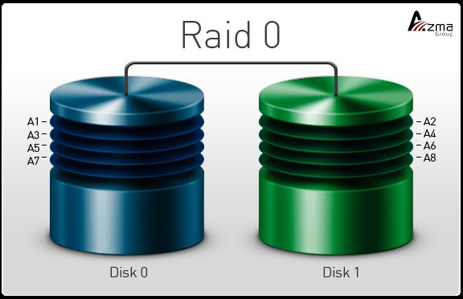
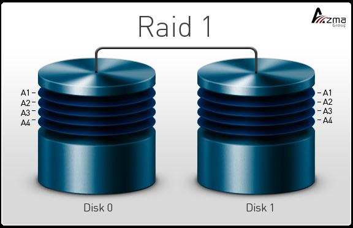
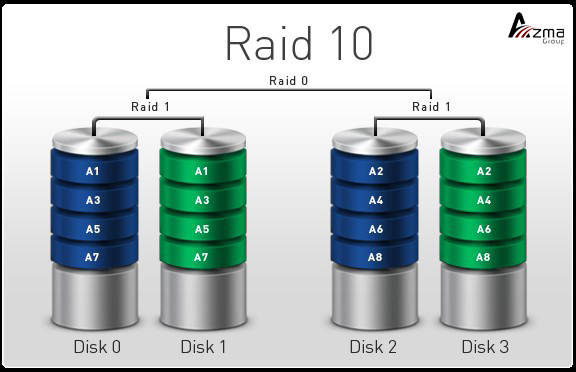
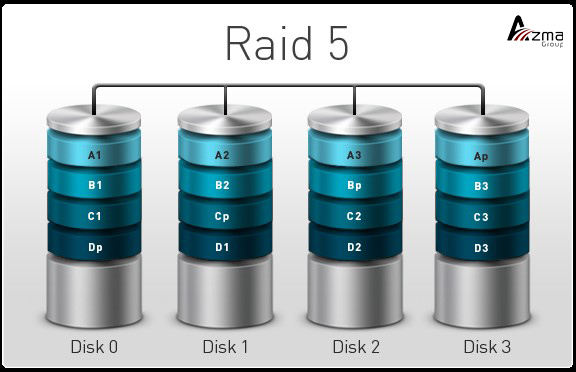
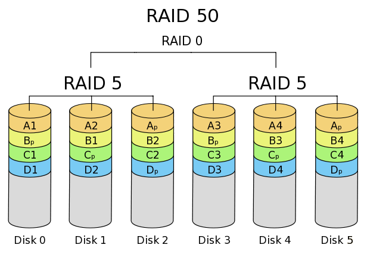

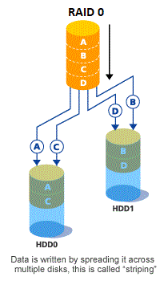

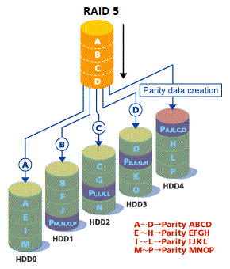
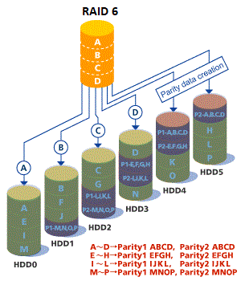
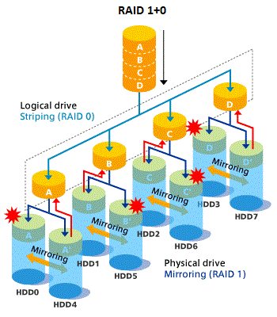


</div>

# Filesystem

## BlockStorage

استفاده از بلاک سایز برای ذخیره دیتا در دیسک

**مزایا**

* مناسب برای ذخیره دیتا در دیتابیس‌های معمولی

**معایب**

* هر استوریج در هر زمانی فقط به یک سرور مرتبط است

### EXT[2|3|4]

```shell
mkfs.ext4 -F -O ^64bit -L '' '/dev/sdb #NewFilesystem
e2label /dev/sdb1 <Lable> #قرار دادن یک نام برای یک حافظه #lable
debugfs /dev/sdb1 #دیباگ کردن هارد دوم از دیسک دوم #Debug
```

### NTFS

```shell
mkntfs -Q -v -F -L '' '/dev/sdb'                      #NewFilesystem
ntfslabel --force '/dev/sdb' '09191671085-BesmeAllah' #Set file system label
ntfsresize -i -f -v /dev/sdc1 #check file sysyem on /dev/sdc1 errors and (if possible) fix them
ntfsresize --force --force /dev/sdc1 #grow file system to fill the partition
ntfsresize --force --force --no-action /dev/sdc1 #دستور بالا را شبیه‌سازی میکند و درصورت وجود مشکل آن را اعلام میکند
```

### BTRFS

* قابلیت پشتیبانی از COW
* قابلیت پشتیبانی از Raid
* قابلیت پشتیبانی از اسنپ‌شات
* قابلیت ایجاد فایل خیلی بزرگ را می‌دهد
* برای دیسک‌های کوچک نظیر فلش خوب نیست و بهتر است برای دیسک‌های حجم بالا استفاده شود

```shell
mkfs.btrfs -f /dev/sdb1 /dev/sdb2 #دو پارتیشن را باهم یک فایل سیستم قرار بده
btrfs filesystem show
btrfs subvolume create <Name> #ساختن یک ساب والیوم در مسیر کنونی-یعنی یک دایرکتوری که دایرکتوری نیست و والیوم است
btrfs subvolume list <Directory> #تمام ساب‌‌والیوم‌های موجود در یک دایرکتوری را به ما نمایش می‌داد
mount -o subvolume=<nameOfSubvolume> <DeviceSuchAs /dev/sdb> <DirectoryMountPoint> # مانت کردن یک ساب‌والیوم
btrfs subvolume snapshot <From> <Directory>
```

### [ZFS](https://parsdev.com/blog/what-is-zfs)

* نوعی فایل سیستم بر پایه «Block storage»
* اگر بخواهیم یک پول از چندین دیسک(حتی در سیستم‌های متفاوت یعنی jBod بسازیم) باید تنها روی یک سیستم عامل zfs نصب شود(اصطلاحا دو تا zfs همدیگر را نمی‌فهمند)Reliablity بالا
* در zfs مکانیزم active/active پشتیبانی نمی‌شود
* به ازای هر داده جدید یک checksum جدید ایجاد کرده و هنگام خواندن دیتا هش آن دیتا بررسی می‌شود و درصورت عدم تطابق checksum آنگاه ZFS تشخیص خطا داده و سعی در تصحیح خطا می‌نماید
* قابلیت مدیریت RaidZ بدون نیاز به نرم‌افزار و سخت‌افزار

```shell
sudo zpool create -f -d -m none -o ashift=12 -O atime=off -o feature@lz4_compress=enabled backup /dev/xvdf1
[-f]:اجبار برای ایجاد یک استخر جدید
[-d]:دیسکاوری دیوایس اتوماتیک را غیر فعال می‌کند
[-m none]:از «میرور» برای محافظت از استخر استفاده نمی‌کند زیرا من یک دیسک در اینجا دارم
[-o ashift=12]: مقدار  alignment shift را روی 12 تنظیم می‌کند که عملکرد فایل‌های بزرگ را بهبود بدهد
[-O atime=off]: ردیابی زمان دسترسی را غیرفعال میکند که عملکرد را بهبود بخشد
[-o feature@lz4_compress=enabled]:فشرده‌سازی LZ4 را برای استخر فعال می‌کند تا در مصرف فضای دیسک صرفه‌جویی شود
[/dev/xvdf1]:دستگاه ذخیره سازی بلوک برای استفاده برای استخر
```

```shell
zfs list
# refer: دیتای واقعی که اشغال شده است
# avail: میزان حجمی که می‌توانیم دیتاست را زیاد کنیم
# used:[thin: هم اندازه ریفِر می‌شود][thick: میزان حجمی که هنگام ساخته شدن می‌دهیم]
zfs get refer # value: حجمی که هنگام ساخته شدن داده شده است را نشان می‌دهد
zfs get volsize
zfs get volsize -o property,value v1/v1
zfs get name -t [volume | filesystem | snapshot | bookmark]
zfs get all -t [volume | filesystem | snapshot | bookmark]

```

## ObjectStorage

* امکان ذخیره متادیتای کمتر نسبت به آبجکت‌استوریج
* ذخیره دیتا به‌صورت شیء(با پارامتر زیر)
    * ۱-آی‌دی: شناسه منحصربفردبرای دسترسی به فایل
    * ۲-متادیتا(متادیتای جامعی را به فایل اضافه میکند)
    * ۳-محتویات فایل(Unstructured)
* بلاک سایز ندارد
    * پِرتی سکتور ندارد
    * مناسب داده با هرنوع ساختار
* استفاده از فضای آدرس‌دهی مسطح(flat)
    * استفاده از Storage Pool
    * حذف ساختار آدرس‌دهی سلسله مراتبی(حذف ساختار فولدرهای تودرتو و مشاهده آن در FileBrowser)
        * نامناسب برای نصب سیستم عامل بر روی آن
* سیستم عامل نمی تواند با Object Store به صورت یک دیسک معمولی رفتار کند.
    * ابزارهای واسطی وجود دارند که این مشکل را حل می کنند
* Read|Write
    * سرعت Read بیشتر، بدلیل استفاده از آی‌دی (ایندکس‌شدن)
    * نوشتن دیتا و خواندن دیتا در قالب Rest API
        * استفاده از Requestهای HTTP، نظیر PUT Request(ذخیره) و Get Request(بازخوانی)
        * رفع مشکل برنامه‌نویسان هنگام ذخیره‌دیتا(ارتباط با اپلیکیشن‌ها)
    * درهنگام خواندن و نوشتن یک آبجکت به صورت کامل بارگزاری می‌شود(تغییراعمال می‌شود و مجدد ذخیره می‌گردد)
        * عدم امکان تغییر بخشی از دیتا
            * نامناسب برای لاگ فایل(Append یک خط لاگ)
        * نامناسب برای فایل‌هایی با rate تغییر زیاد(نظیر لاگ فایل،افزودن یک خط به انتها)
* ویژگی
    * مناسب برای شبکه‌های اجتماعی(وجود هر نوع دیتا و ساختار)
    * مناسب برای ذخیره اطلاعات ثابت(هرگونه تغییر در فایل ذخیره شده، سبب می‌شود تا نسخه‌ای جدید از کل فایل ایجاد و ذخیره شود)
    * مناسب برای BigData

### CEPH protocol

* درواقع base آن بر Object storage می‌باشد.
* مقیاس‌پذیر است یعنی scalability دارد
* هر چند سیستم عامل که ceph داشته‌باشند میتوانند با هم تعامل برقرار نمایند
* پشتیبانی از مکانیزم active/active
* مکانیزم CephCluster قابلیت پشتیبانی از file و object و block دارد

### REFS(Resilient File System)

* عدم پشتیبانی از فشرده‌سازی و رمزگذاری و پشتیبانی از فایل‌های سخت‌افزاری(پایه درایور)
* استفاده از ساختار متادیتا تحت عنوان BPlusTree[b+Tree] برای بهینه‌سازی جستجو و دسترسی به دیتاIntegrityStrem که شناسایی و اصلاح خطا با checksum برای هر بلوک داده را انجام می‌دهد
* مدیریت حجم بزرگ تا ۳۵ پتابایت
* پشتیبانی از فرمت دیسک‌های مجازی Virtual Hard Disk (هایپروی)
* کلون و اسنپشات

## Virtual Filesystem

یک مفهوم گسترده‌تر که شامل انواع فایل‌سیستم‌های مجازی است که ممکن است داده‌ها در حافظه، در فایل، یا حتی از طریق شبکه مدیریت شوند

- **In-memory Filesystem** : داده‌ها در RAM هستند (سریع و  **غیردائمی** و با ریستارت از بین می‌روند).
- **Virtual Filesystem**: یک لایه نرم‌افزاری که **به کاربر و برنامه‌ها شبیه یک فایل‌سیستم عملی می‌کند** ولی لزوماً داده‌ها را روی دیسک ذخیره نمی‌کند.
- **Temporary Filesystem**: داده‌ها فقط موقت هستند (با خاموشی یا ری‌استارت از بین می‌روند).

| فایل‌سیستم / توضیح      | In-memory | Virtual | Temporary | روی دیسک | توضیحات                                                                    |
|-------------------------|-----------|---------|-----------|----------|----------------------------------------------------------------------------|
| **`tmpfs`**             | ✅         | ✅       | ✅         | ❌        | فایل‌سیستم موقت در حافظه (RAM)، استفاده در BSD و لینوکس.                   |
| **`ramfs`**             | ✅         | ❌       | ✅         | ❌        | شبیه `tmpfs` ولی بدون مدیریت صفحه‌بندی. خطر OOM وجود دارد.                 |
| **`/proc`**             | ✅         | ✅       | ✅         | ❌        | فقط در زمان اجرا وجود دارد. داده‌ها در RAM ساخته می‌شوند.                  |
| **`/sys`**              | ✅         | ✅       | ✅         | ❌        | نمایش اطلاعات سخت‌افزاری. فقط در زمان اجرا.                                |
| **`/dev`**              | ✅         | ✅       | ✅         | ❌        | شامل فایل‌های دستگاه. عمدتاً توسط `devtmpfs` یا `tmpfs` پیاده‌سازی می‌شود. |
| **`devtmpfs`**          | ✅         | ✅       | ✅         | ❌        | مشابه `tmpfs` برای `/dev`. توسط کرنل در RAM ساخته می‌شود.                  |
| **`devpts`**            | ❌         | ✅       | ✅         | ❌        | نقاط TTY مجازی (terminal). معمولا با devtmpfs یا tmpfs کار می‌کند.         |
| **`FUSE`**              | ❌         | ✅       | ❌         | ❌        | امکان ایجاد فایل‌سیستم در فضای کاربری. پایه برای SSHFS و غیره.             |
| **`SSHFS`**             | ❌         | ✅       | ❌         | ❌        | دسترسی به فایل‌های دور از طریق SSH و FUSE.                                 |
| **`overlayfs`**         | ❌         | ✅       | ❌         | ❌        | برای containerها (مثل Docker) — ترکیب دو فایل‌سیستم.                       |
| **`unionfs`**           | ❌         | ✅       | ❌         | ❌        | قدیمی‌تر از overlayfs. ترکیب چند لایه فایل‌سیستم.                          |
| **`cifs/smb`**          | ❌         | ✅       | ❌         | ❌        | دسترسی به فایل‌های سرور ویندوز از طریق شبکه.                               |
| **`NFS`**               | ❌         | ✅       | ❌         | ❌        | دسترسی به فایل‌های سرور لینوکس/یونیکس از طریق شبکه.                        |
| **`9P`**                | ❌         | ✅       | ❌         | ❌        | فایل‌سیستم شبکه‌ای Plan 9 — در QEMU و Virtio-fs استفاده می‌شود.            |
| **`squashfs`**          | ❌         | ✅       | ❌         | ✅        | فایل‌سیستم فشرده و فقط خواندنی — در LiveCDها و containerها.                |
| **`ROMFS`**             | ❌         | ✅       | ❌         | ✅        | فقط خواندنی، برای سیستم‌های توکار.                                         |
| **`initramfs`**         | ✅         | ✅       | ✅         | ❌        | تصویر ramfs/tmpfs قبل از mount کردن root فایل‌سیستم.                       |
| **`RAM Disk` (ویندوز)** | ✅         | ✅       | ✅         | ❌        | دیسک مجازی در RAM — مثلاً ImDisk، SoftPerfect RAM Disk.                    |

---

```shell
sudo mount -t tmpfs tmpfs <MountPoint>
sudo mount -t tmpfs -o size=12M,mode=700 <MountPoint>
```

📌 نکات مهم:

* فایل‌سیستم Temporary Filesystem ممکن است **In-memory** باشد یا **فایل‌های موقت روی دیسک**، ولی مهم این است که داده‌ها **پاک می‌شوند**.
* فایل سیستم tmpfs توسط هسته (Linux kernel) پشتیبانی می‌شود

## NetworkFilySystem

* بعنوان مثال موارد CIFS یا SMB یا NFS جزو این موارد هستند
* داده‌ها به صورت فایل منتقل می‌شوند، نه بلاک یا آبجکت
* تحت عنوان File-Based Network File System نیز گفته می‌شوند

### CIFS

پروتکل CIFS (Common Internet File System) یکی از پروتکل‌های شبکه است که برای دسترسی به فایل‌ها از راه دور استفاده می‌شود. این پروتکل در واقع یک نمونه از فایل سیستم توزیع‌شده (Distributed File System) است و نوع خاصی از Network File System محسوب می‌شود.

## OTHERs

* فایل سیستم فایل سیستم **`XFS`** : High-performance برای سیستم‌های بزرگ.
* فایل سیستم فایل سیستم **`NTFS`** : فایل‌سیستم ویندوز — قابل خواندن/نوشتن در لینوکس با ntfs-3g.
* فایل سیستم **`FAT32`** : فایل‌سیستم قدیمی با سازگاری بالا ولی محدودیت‌هایی (حداکثر 4GB فایل).
* فایل سیستم **`exFAT`** : برای حمل‌و‌نقل بین سیستم‌ها. پشتیبانی محدود در لینوکس.
* فایل سیستم **`ISO9660`** : CD-ROM — Read-only یا محدود.
* فایل سیستم **`UDF`** : DVD/Blu-ray — جایگزین ISO9660.
* فایل سیستم **`JFFS2|YAFFS|LogFS`** : Flash Memory برای سیستم‌های توکار.
* فایل سیستم **`minix`** : قدیمی‌ترین فایل‌سیستم لینوکس — فقط برای تست.
* فایل سیستم **`ecryptfs`** : فایل‌سیستم رمزگذاری‌کننده (Encrypted Filesystem).

<div style="display: flex; flex-direction: column; align-items: center;">


</div>

# partition

* PartitionTable: اطلاعات پارتیشن‌های موجود در دیسک(ذخیره درGPTیاMBR) جهت ارائه به کرنل
* GPT یا GUID Partition Table
    * می‌تواند تا ۱۲۸ پارتیشن را پشتیبانی کند
    * در دو مکان دیسک ذخیره می‌شود:
        * ۱-ابتدای دیسک(Sector اول): شامل یک هدر GPT است که اطلاعاتی درباره تعداد و اندازه پارتیشن‌ها را ذخیره می‌کند
        * ۲-انتهای دیسک: یک نسخه پشتیبان از هدر GPT و جدول پارتیشن‌ها در انتهای دیسک نیز ذخیره می‌شود. این مکان به عنوان "Backup GPT Header" شناخته می‌شود
    * هر پارتیشن می‌تواند اطلاعات بیشتری نسبت به MBR داشته باشد
    * از شناسه‌های GUID برای شناسایی پارتیشن‌ها استفاده می‌کند
* MBR یا Master Boot Record
    * بوت لودر در MBR قرار دارد
    * در اولین Sector دیسک ذخیره می‌شود0
    * شامل اطلاعات مربوط به حداکثر ۴ پارتیشن اصلی است.
    * هر ورودی شامل اطلاعاتی درباره نوع پارتیشن، آدرس شروع، اندازه و شناسه پارتیشن است.
* دستوراتی نظیر parted و fdisk و غیره سبب تغییرات در جدول پارتیشن‌ها می‌شوند
* دستور partprobe: این دستور در سطح کرنل اطلاعات جدول پارتیشن‌ها را بارگذاری مجدد کند.
    * پس از تغییر در پارتیشن‌ها(partitionTable) باید کرنل را متوجه اعمال تغییرات در پارتیشن‌های دیسک نماییم. پس به کرنل سیگنال می‌فرستیم که مجددا جدول پارتیشن‌های دیسک را بررسی کن

```shell
wipefs -a /dev/disk/by-id/<wwn-...> #برای حذف یک پارتیشن از دستور زیر می‌توانیم استفاده نماییم
partprobe #بررسی مجدد تمامی جداول پارتیشن برای همه دیسک‌ها
[-s|--silent]:#محدود نمودن خروجی و تنها اکتفا به خطاها
[-d|--device]: کدام دیسک برای بررسی مجدد جدول پارتیشن‌ها مورد استفاده قرار بگیرد
sudo blockdev --rereadpt /dev/sdX
echo 1 > /sys/class/block/sdX/device/rescan # خیلی توصیه نمی‌شود
echo 1 | sudo tee /sys/class/block/sdX/device/rescan
```

<div style="display: flex; flex-direction: column; align-items: center;">

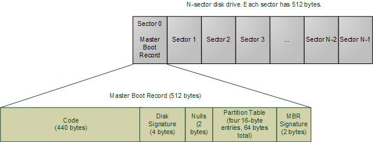
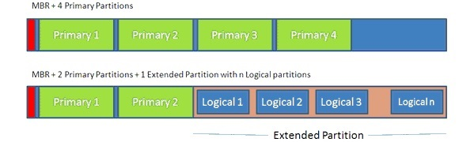
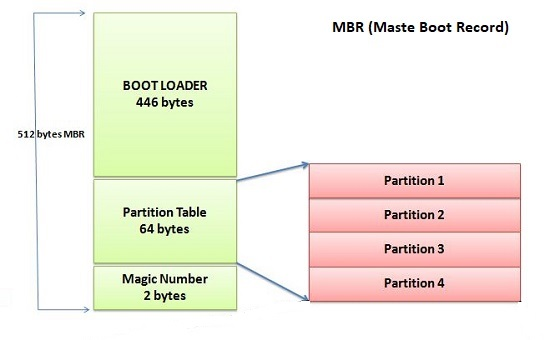
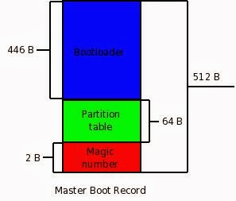

</div>

# SCSI

* SCSI یا [small computer system interface]: پروتکلی برای افزایش سرعت بین دیوایس‌ها که می تواند بروی پرینتر و اسکنر و هاردها استفاده شود
* ISCSI یا Internet SCSI: اجازه استفاده از SCSI بر روی اینترنت. یعنی دیوایس‌های پشت شبکه بعنوان دیسک دیده بشود.
* ISCSI Node: به هر سیستم موجود در اتصال iscsi گفته ‌می‌شود
* ISCSI Target: سیستم ارائه دهنده هارد در بستر شبکه
* ISCSI Initiator: سیستم دریافت کننده سرویس هارد در شبکه
* ISCSIName: هر ISCSINode یک ISCSIName دارند تا شناسایی شوند که با نام IP یا DNS متفاوت است
* ISCSIAddress: دونوع نام گذاری برای نودهای ISCSI داریم:
    * الف-IQN یعنی iSCSI Qualified Name که فرمت آن iqn.yyyy‐mm.com.xyz.aabbccddeeffgghh است.[iqn همواره اول آن می‌آید] و [yyyy‐mm] اشاره دارد به زمانی که ایجاد شده است و[aabbccddeeffgghh] شناسه دیوایس که می‌تواند wwn یا نام سیستم یا هر چیزی دیگر باشد
    * ب-EUI یعمی IEEE Naming convention : که فرمت آن eui.64‐bit WWN می‌باشد و [eui] همواره در ابتدا می‌آید و بقیه می‌تواند نام wwn باشد
* گفته می‌شود که حداکثر سرعت تا 640MB/s می‌دهد ولی این پروتکل در حال تکمیل و افزایش سرعت است

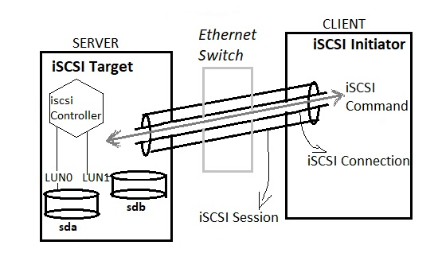

# SCST

* IP: وقتی در سرویس از آی پی صحبت می‌کنیم منظور پرتال است یعنی از چند کارت شبکه که روی سیستم نصب است دیتا از کدام پرزنت گردد


* Device: یک Path که به یک دیوایس اختصاص داده می‌شود و سرویس آن دیوایس را با آن نام می‌فهمد
* Handler: تعیین کننده نحوه رفتار scst (آن دیوایس چگونه توسط سرویس دیده شود)
    * در پروژه ما تنها از VDISK_BLOCKIO کار میکنیم
* Driver:
* Target:
    * برای هر تارگت گروه‌های متفاوت داریم
* Group:
    * برای تارگت گروه ساخته می‌شود(گروه ذیل تارگت ساخته می‌شود)
    * هنگام تعریف و حذف گروه باید نام تارگت داده شود.
* Lun: در هر گروه می‌توان lun متفاوت که از صفر شروع شود داشت
* Initiator: «آی‌کیو‌اِن» منحصربفرد کلاینت که باید در پرزنت لحاظ شود

# LVM(Logical Volume Management)

* Physical Volume یا PV : دیسک‌های فیزیکی یعنی هارد دیسک‌های موجود در سیستم عامل که چند pv را عضو یک vg می‌نماییم
* Volume Group یا VG: گروهی از دیسک‌های فیزیکی(pv) که می‌توان گفت pool می‌باشد
* Logical Volume یا LV : یک دیسکی که به کاربر ارائه می‌شود تا روی آن فایل سیستم نصب کند
* PE: کوچکترین بلاکی موجود در physical Volume که قابلیت اختصاص به یک vg دارد
* مکانیزم LVM قابلیت اسنپ‌شات براساس روش COW می‌دهد.

```shell
lvmcreate
    [-L]:سایز مثلا ۱گیگ
    [-n]:نام اسنپ‌شات
    [-v]:verbose
pvcreate /dev/sdb[1-3] #Create physical volumepvscan #بررسی والیوم‌های فیزیکی سیستم
pvdisplay /dev/sdb2 #نمایش اطلاعات
vgcreate <Name(such as vg00)> /dev/sdb1 /dev/sdb2 /dev/sdb 3vgdisplay #نمایش والبوم گروه
lvcreate -L 3.5G vg00 #Create new lvlvdisplay #نمایش اطلاعات
lvremove /dev/<VG>/<LV>mkfs.ext4 /dev/<VG>/<LV>mount /dev/<vg>/<LV> /mnt/dir1-
vgextend <VG> <new partition[/dev/sdc4]> # add partion to volume group
lvextend -L g 5G /dev/<vg>/LVNameresize2fs /dev/<vg>/LVName #اضافه کردن حجم فایل سیستم2-
lvmcreate -L 100m -s -n <Name> /dev/VG>/<LV>lvscan #اسنپ‌شات باید در این دستور بیاید # 
3-lvremove /dev/<VG>/<SnapShotName> # حذف یکی اسنپ‌شات
```

<div style="display: flex; flex-direction: column; align-items: center;">

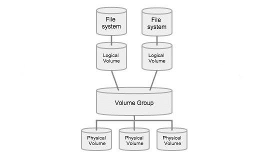
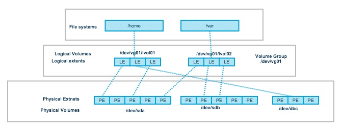


</div>


</div>

