<div dir="rtl">

# 🅰️Concepts

* فایل: مجموعه‌ای از سری داده که به‌صورت یک واحد ذخیره‌سازی(در حافظه اصلی یا جانبی یا حافظه موقت) شوند
  *RawData:
    * «داده‌خام» پردازش و قالب‌بندى نشده
    * اطلاعاتى كه جمع‌آورى شده‌اند، اما بررسى نشده‌اند.
    * متادیتا: ارائه توضیحات خلاصه راجع به فایل
    * استفاده از متادیتا، کارایی را افزایش داده و طبقه‌بندی را آسان می‌کنند.ـ متادیتا‌ها در متغیرهایی قابل تغییر و حذف یا اضافه‌شدن، ذخیره می‌شوند.
* Inode:
    * در سافت لینک آی نود عوض می‌شود ولی در هارد لینک آی نود عوض نمی‌شود
    * دستورات زیر آی نود یک فایل را به ما می‌دهد
    * `ls -i File` or `stat File`
* Link
    * HardLink
        * مقدار آی‌نود مشابه است. هارد لینک روی دایرکتوری ها قابل اجرا نیست
        * تنها در یک پارتیشن(فایل سیستم) قابل اجرا است
        * توسط دستور زیر می‌توان آی‌نود را مشاهده کرد [ls -i file.txt; stat file.txt]
        * بهتر است جستجوی هاردلینک توسط شماره آی نود جستجو شود `find . -inum 89`
    * SoftLink
        * در سافت لینک آی نود متفاوت است
        * امکان ساخت سافت لینک برای دایرکتوری وجود دارد ولی برای هارد لینک امکان ساخت دایرکتوری وجود ندارد
        * توسط دستور زیر می‌توان آی‌نود را مشاهده کرد `ls -i file.txt; stat file.txt`
    * FileDescriptor
        * در لینوکس همه چیز حتی دایرکتوری‌ها و سخت‌افزارها فایل هستند. هر فایل نیز یک عدد مخصوص به خود را دارد که file descriptor یا FD نامیده می شود.
        * سیستم عامل این FD را زمانی اختصاص می دهد که فایل باز شده باشد.
        * مثلا اگر یک برنامه خروجی خود را به FD مربوط به پرینتر ارسال کند آنگاه خروجی مورد نظر پرینت گرفته می شود.
    * Access Control
        * DAC یا Discretionary Access Control
            * لینوکس بصوتر یش فرض از این روش استفاده می‌کند
            * در این روش owner یک ریسورس(فایل یا دایرکتوری یا هرچیزی که از طریق شبکه به آن دسترسی داشت) کنترل کاملی بر روی آن دارد بصورتی که می تواند به سایرین دسترسی های مختلف بدهد و یا حتی مالک آن را تغییر دهد
            * روش کنترل دسترسی بسیار راحت و انعطاف پذیر است ولی در عین حال خیلی ایمن نیست.
        * MAC یا Mandatory Access Control
            * دسترسی‌ها بجای تعیین شدن توسط owner توسط سیستم تعیین می‌شود
            * تمامی user ها و resource ها دارای یک label خواهند بود که سطح اعتماد را تعیین می‌کند.
            * برای دسترسی به یک resource، کاربر باید در سطحی مساوی و یا بالاتر از سطح آن resource باشد.
            * عموما سیستم هایی که دارای دیتای بسیار مهمی هستند مانند سیستم های دولتی و نظامی، از روش MAC استفاده می کنند که از طریق [SELinux](https://actobit.com/actomag/1399/selinux/) پیاده‌سازی می شود.

```shell
rename "s/jpeg$/jpg/" *.jpeg  # convert all jpeg to jpg
```

<div style="display: flex; flex-direction: column; align-items: center;">


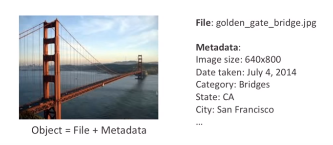
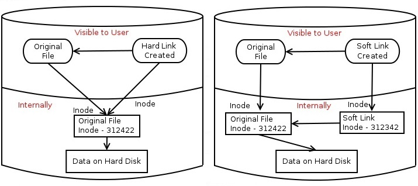

</div>

# 🅰️ Accessibility

- در نسخه لینوکس‌های کوچک دستور adduser وجود دارد(توزیع لینوکس alpine) و دستور useradd دستور بزرگتری و با ابزارهای بیشتری است.

```shell
who #Current Login Users
who -a #نمایش تمامی اطلاعات
who -b #زمان بوت شدن سیستم
who -r #نمایش ران لول فعلی
who -q #تعداد کاربران لاگین و نام آنها

/sbin/usermod -s /sbin/nologin Behrooz #change user to nonlogin user
```

## 🅱️ Sudo

```shell
sudo
sudo -u <USER> whoami #اجرای دستور با کاربر خاص
sudo -- bash -c 'pwd; hostname; whoami' #Execute Multiple command
sudo cat /etc/sudoers.d/Behrooz
    user    ALL=NOPASSWD: /usr/bin/nmap 
    user    ALL=NOPASSWD: /usr/bin/apt 
    user    ALL=NOPASSWD: /usr/bin/sudo 
    user    ALL=NOPASSWD: /usr/bin/chmod 
    user    ALL=NOPASSWD: /usr/bin/chown 
    user    ALL=NOPASSWD: /usr/bin/vim 
    user    ALL=NOPASSWD: /usr/bin/systemctl 
    user    ALL=NOPASSWD: /usr/bin/updatedb 
    user    ALL=NOPASSWD: /usr/bin/dpkg 
    user    ALL=NOPASSWD: /usr/sbin/shutdown 
    user    ALL=NOPASSWD: /usr/bin/killall 
    user    ALL=NOPASSWD: /usr/bin/kill 
    behrooz ALL=(ALL) NOPASSWD: ALL # Run sudo command without password
```

# 🅰️SpecialAttributes

* a: تنها در حالت اضافه شدن(الحاقی) قابلیت تغییر خواهد داشت.یعنی فایل کم نمی‌شود ولی زیاد می‌شود
* c: اجازه فشرده‌سازی و بازکردن خودکار یک فایل را به کرنل می‌دهد
* d: در این حالت در هنگام اجرای ابزار سیستمی دامپ یا نسخه پشتیبان در پارتیشن‌های «ای‌ایکس‌تی۳» از فایل مورد نظر پشتیبان تهیه نخواهد شد
* i: حتی توسط کاربر روت قابلیت تغییر نخواهد داشت
* s: امن بودن در برابر حذف شدن
* S: تغییرات در فایل همزمان برروی دیسک ذخیره خواهد شد
* u: اجازه بازیابی محتویات یک فایل حتی اگرکه کنسل شده باشد را می‌دهد

```shell
lsattr: show Special attributes in directory
chattr [+|-]<attributes> file.txt
chattr +a file.txt
chattr -a file.txt
```

# 🅰️Permission

```shell
# r → Read
# w → Write
# x → Execute
# u → USER
# g → GROUP
# o → OTHER
# a → ALL
```

## 🅱️ SUID

اگر فایلی این دسترسی را داشته باشد یعنی استفاده از این فایل با دسترسی مشابه روت صورت خواهد گرفت

What’s the benefit? The passwd command needs to edit files like /etc/passwd, /etc/shadow to change the password. These files are owned by root and can only be modified by root. But thanks to the setuid flag (SUID bit), a regular user will also be able to modify these files (that are owned by root) and change his/her password.

```shell
$ ls -l /usr/bin/passwd
-rwsr-xr-x 1 root root 59640 Mar 22 2019 /usr/bin/passwd
```

<div style="display: flex; flex-direction: column; align-items: center;">


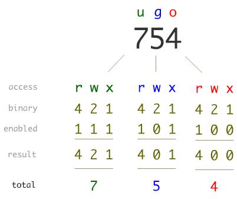
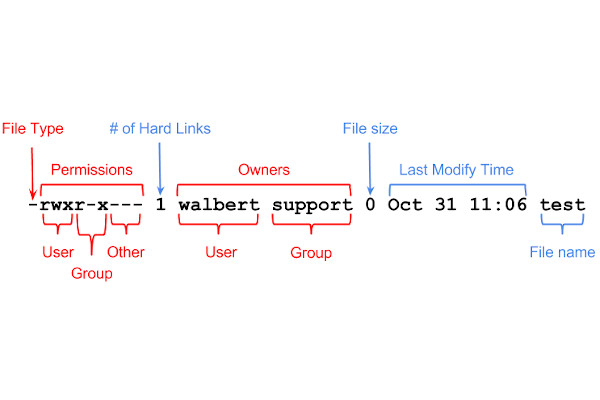
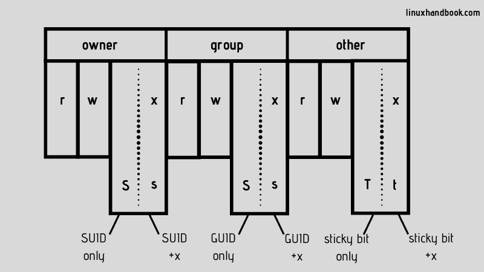
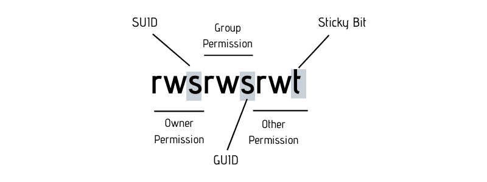


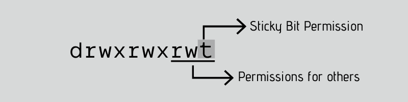


</div>

```shell
chmod o-w File.txt → Remove write from OTHER group
chmode u=rw,g=rwx,o=r file.txt
chmod u+x file.txt → add EXECUTE to USER group
```

# 🅰️Backup

* برای بک‌آپ گرفتن مهم است که دیتای خود را دسته‌بندی کرده باشید
* انواع بک‌آپ گیری
    * fullBackup: همه دیتارا بکاپ می‌گیرد
    * Incremental: نسبت به fullBackupآخری هر جی اضافه دارد را بک‌آپ می‌گیرد
    * Differential: نسبت به یک نسخه خاص هرچی تفاوت دارد را بک‌آپ می‌گیرد
    * snapshot: همانند differential است

## 🅱️ Apps

* backula یک برنامه فوق‌العاده قوی برای بک آپ از هر چیزی است که هم کامند و هم دسکتاپ و هم وب ارائه داده است

```shell
cp /Path/FileName{,.Backup} #CreateBackup
```

---

### ✅️rsync

سوییج‌های دستور آرسینک

* a : تکراری کپی نشود و فقط جدید کپی شود
* h: خوانا برای انسان
* v: توضیحات زیاد داده شود

```shell
cp /Path/FileName{,.Backup} #CreateBackup
rsync -avh /home/behrooz/dire /tmp
rsync -avh /home/behrooz/dire behrooz@192.168.10.88:/home/SecondCopy
```

## 🅱️ Archive and Compressing

```shell
tar -czvf Directory.tar.gz Directory --remove-files
tar tf File.tar.gz #فقط نمایش محتویات
tar j #bzip2
tar Uf File.tar Dir #آپدیت کن از فایل‌های جدید

```

# 🅰️Tape

* برای ذخیره‌سازی بک‌آپ از نوار استفاده می‌شود
* opration در دستور mt موارد زیر را شامل می‌شود:
    * status: نمایش وضعیت
    * load: لود نمودن نوار(به تازگی خودشان لود می‌شوند)
    * fsf: به تعداد عددی که وارد میشود برو جلو یعنی fsf3 یعنی اشاره‌گر را سه فایل ببر جلو
    * bsf: به تعداد عددی که وارد میشود برو عقب یعنی bsf3 یعنی اشاره‌گر را سه فایل ببر عقب
    * erase: پاک کردن کل نوار
    * tell: بگو اشاره‌گر کجاست
    * eof: یعنی End Of current Data یعنی اگر اشاره‌گر وسط یک فایل بود اشاره‌گر را به انتهای آن اشاره‌گر ببر
    * rewind: اشاره‌گر را به اول منتقل کن
    * eject: بیرون بردن دیوایس
    * offline: آفلاین کردن دیوایس

```shell
ls /dev/st* #show device
ls /dev/nst* #show device
mt -f /dev/st0 <opration>
```

سناریوی زیر را مشاهده نمایید

```shell
mt -f /dev/st0 load
mt -f /dev/st0 erase
mt -f /dev/st0 rewind
tar cf /dev/st0 <DirectoryOfData> #شروع به گرفتن بک‌آپ کرده و در فایل اول نوار وارد میکند و اشاره‌گر میرود به انتهای فایل اول
sleep <یک ماه>
mt -f /dev/st0 rewind # برور به اول نوار
mt -f /dev/st0 fsf1 #یک فایل برو جلو
tar xf /dev/st0 /home/restorMyData #بازیابی بک‌آپ از نوار

```

<div style="display: flex; flex-direction: column; align-items: center;">

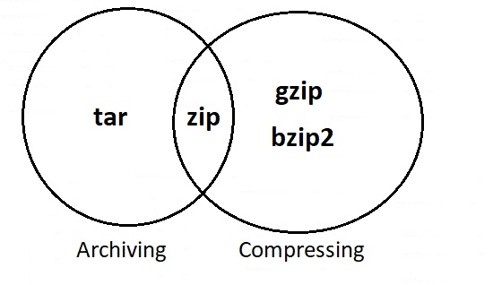
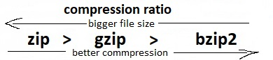
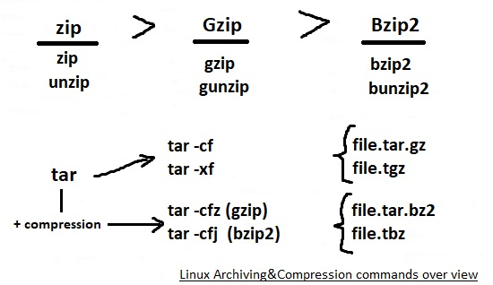
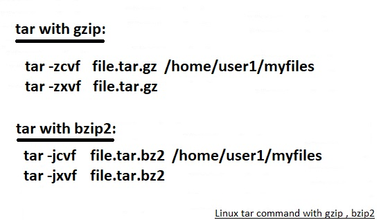

</div>

# 🅰️ExtensionType OR FileType

* [*.so]: فایل‌های کتابخانه‌ای داینامیک در لینوکس
    * فایل‌های SharedObject در لینوکس dynamic library می‌باشند که معادل DLL در ویندوز هستند
    * فایل تجمیع‌شده از چندین «آبجکت‌کد» «کامپایل شده» باهم برای ایجاد فایل Library جهت انتقال و استفاده در محل دیگر
    * فایل .so یک کتابخانه داینامیک (dynamic library)  است که شامل توابع قابل اجرا هست که برنامه‌ها می‌تونن به صورت پویا (در زمان اجرا) ازشون استفاده کنن.
    * معمولا در مسیرهای `/usr/lib/` یا `/usr/local/lib/` یا `/lib/` قرار دارند
    * استفاده مشترک توابع بین برنامه‌ها
* [*.DLL]:  فایل‌های کتابخانه‌ای داینامیک در ویندوز
    * عبارت DLL مخفف Dynamic Link Library مب‌باشد
    * معادل *.so در لینوکس است
    * استفاده مشترک توابع بین برنامه‌ها

</div>

# 🅰️ FileNames

## 📁️ /sbin/init

* اولین برنامه ایکه برای اجرای دیگر پردازه‌ها به اجرا درمی‌آید
* اول می‌رود سراغ /sbin/init اگرنبود می‌رود سراغ /etc/init و اگر نبود میرود سراغ /bin/sh
* سه برنامه برای initiate کردن پردزه ‌ها وجود دارد:۱-sysV که سیستم۵ هم نامیده می‌شود ۲-systemdجدید است۳-upstart برای اوبونتو بود که استفبال نشد

## 📁️ /proc

تمام محتویات مسیر آن توسط کرنل[kernel] پر می‌شود

* /proc/cmdline: Arguments passed to the Linux kernel at boot time
    * OOT_IMAGE=/boot/vmlinuz-5.10.0-20-amd64 root=UUID=4bfb45d2-d701-44c7-8941-9d52d2f6f227 ro quiet
* /proc/net/dev: All about Network
    * cat /proc/net/dev | column -t
* /proc/cpuinfo
* /proc/filesystems: A text listing of the filesystems which are supported by the kernel
* /proc/meminfo
* /proc/modules: A text list of the modules that have been loaded by the system
* /proc/mounts: list of all the filesystems currently mounted on the system
* /proc/net/arp: This holds an ASCII readable dump of the kernel ARP table
* /proc/swaps: Swap areas in use
* /proc/sys/kernel/hostname]
* /proc/sys/kernel/pty/nr: This read-only file indicates how many pseudoterminals are currently in use #نمایش تعداد ترمینال‌های باز
* /proc/sys/kernel/pid_max: ماکزیمم تعداد پردازه قابل استفاده در لینوکس توسط این فایل معین شده است که نباید از آن فراتر رود
* /proc/interrupts: show interrupt request on system
* /proc/version]
* /proc/<PID>/fd
    * ls -la /proc/<PID>/fd #لیست فایل‌های باز یک پردازه
    * ls -l /proc/<PID>/fd | wc -l
* /proc/<PID>/limits: مشاهده محدودیت‌های یک پردازه
* /proc/sys/fs/file-max: # مشاهده محدودیت مجموع فایل‌های باز در سیستم یعنی حداکثر تعداد فایل‌هایی است که می‌توانند به طور همزمان در سیستم باز باشند

# 🅰️Command

## 🅱️ fio

```shell
fio --name=Rand_RW_100_8K --rw=randrw --direct=1 --rwmixwrite=100  --ioengine=windowsaio --time_based  --runtime=1800  --size=30tib --blocksize=8k  --numjobs=8 --filesize=4tib --thread --group_reporting --filename="\\.\PhysicalDrive2"  --output="c:\1403-08-29-TestRand100Write-T2.txt"
```

## 🅱️ tree

نمایش فایل‌های بصورت درختی

```shell
tree -fi #نمایش تنها لیست فایل‌ها بصورت نام کامل
```

## 🅱️ ulimit

get and set user limits

```shell
ulimit --help
ulimit -n #مشاهده محدودیت تعداد فایل‌های باز برای هر پردازه
ulimit -n <new_limit> #Temprory #the maximum number of open file
vim /etc/security/limits.conf # اگر بخواهیم بصورت دائمی باشد
```

# 🅰️ Hash

* هش همواره یک طرفه است و مانند کدینگ نیست که امکان دیکد داشته باشد


```shell
echo -n <STRING>|md5sum # linux
certutil -hashfile <file> MD5 # MicrosoftWindows
# [Server1: find ./backup -type f -print0 | xargs -0 md5sum > /checksums_backup.md5] && [Server2: md5sum -c checksums_backup.md5] → checksum
```

## 🅱️ 


## 🅱️ 


## 🅱️ 