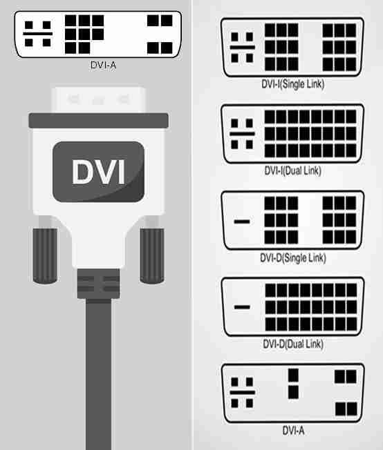
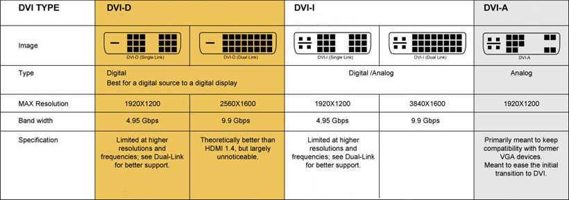

* Display(Resolution)
    * FHD    [1920*1080]
    * 2K(QHD)[2560x1440] Quad
    * 4K(UHD)[3840*2160] 
    * 4K     [5120*2880]
    * 8K     [7680*4320]
*

# 🅰️ wayland

<div dir="rtl">

* تصویر
    * ادوبی ilustrator
    * ادوبی فوتوشاپ
* تصویر و نمایش ساختار شیء
    * ۲بعدی: autoCad
    * ۳بعدی: 3Dmax
* تصویر (کتاب و صفحه آرایی و کارهای کتاب)
    * adobe indesign
* ویدئو:
    * primier: شرکت ادوبی
    * davinchi: شرکت دیگر
* موشن گرافی
    * afterEffect: تیزرهای تبلیغاتی مثلا ابتدای تیزر استورکس که آقای جدی انجام داده بود
* ضبط ویدئو(رکورد)
    * TechSmit snagit recorder [محمد اردوخانی با این دوره‌های پایتون و غیره را ضبط کرده است]

</div>


در نسخه دبیان۱۱ وقتی یک برنامه بالا نمی‌آید از روش زیر عمل می‌کنیم

```shell
sudo apt install qtwayland5
vim /etc/profile.d/behrooz
export QT_QPA_PLATFORM=wayland
export XDG_SESSION_TYPE=wayland
export ANKI_WAYLAND=1
export QT_QPA_PLATFORMTHEME=qt5ct
```

Ignoring XDG_SESSION_TYPE=wayland on Gnome. Use QT_QPA_PLATFORM=wayland to run on Wayland anyway.


# 🅰️ Connector


## 🅱️ DVI(Digital Visual Interface)

- دی وی آی سیگنال های آنالوگ را به سیگنال های دیجیتال تبدیل میکند
- در درگاه DVI-A حرف A مخفف Analog است و برای انتقال داده های آنالوگ طراحی شده است
- در درگاه DVI-D حرف D مخفف Digital است و برای انتقال داده های دیجیتال طراحی شده است
- در درگاه DVI-I حرف i مخفف Integrated است و برای انتقال داده های دیجیتال و آنالوگ به صورت همزمان طراحی شده است




