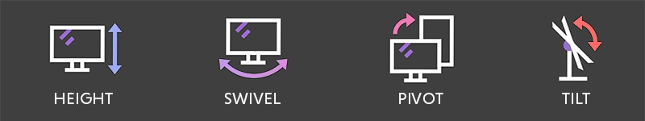

<div dir="rtl">

# 🅰️ مفاهیم

* GPU(Graphics Processing Unit): واحد پردازش گرافیکی(چیپ) که برای رندر تصاویر، ویدیوها و محاسبات موازی طراحی شده است
* CudaCore(انحصاریNVIDIA):باید روی سخت‌افزار NVIDIA باشد
    * یک API و معماری سخت‌افزاری پردازش موازی انحصاری NVIDIA برای استفاده از GPU در محاسبات عمومی(GPGPU) و AI/Deep Learning است
        * CUDA:ComputeUnifiedDeviceArchitecture
    * AMD از CUDA پشتیبانی نمی‌کند و در سخت‌افزار و درایورهای AMD پیاده‌سازی نشده(مالک آن NVIDIA است)
    * معادل StreamProcessor در شرکت AMD
* TesnsorCore(انحصاریNVIDIA):باید روی سخت‌افزار NVIDIA باشد
    * واحد سخت‌افزاری تخصصی برای انجام عملیات ماتریسی(در هوش مصنوعی، یادگیری عمیق و DLSS ) است
    * هسته‌ای پردازش در GPUهای RTX برای محاسبه ماتریسی(معماری قدیم‌تر)
    * TensorRT: کتابخانه NVIDIA برای استنتاج AI
    * معادل MatrixCore در معماری CDNA در شرکت AMD

* RayTracing(RT)(غیرانحصاری): تکنیک رندرینگ
    * یک تکنیک ریاضی/گرافیکی در صنعت فیلم و گرافیک کامپیوتری باهدف شبیه‌سازی واقع‌گرایانه نور(محاسبه مسیر پرتوهای نور)
    * یک استاندارد گرافیکی است
* NVIDIA: شرکت آمریکایی از سال ۱۹۹۳ که تولیدکننده اصلی GPUهای GeForce، Quadro، Tesla و...
    * GeForce: برند کارت‌های گرافیک شرکت NVIDIA که بصورت خلاصه نام کلی برند NVIDIA است(از ۱۹۹۹ تا امروز)
        * GeForceGTX: سری قدیمی کارتهای گرافیک شرکت NVIDIA
            * بدون RTCore و TensorCore
        * GeForceRTX: نسل جدید کارت‌های گرافیک NVIDIA با قابلیت RayTracing و TensorCore.
            * اولین نسل از RTX ها در سال ۲۰۱۸ معرفی شدند
            * زیرمجموعه‌ای از GeForce که از Ray Tracing و DLSS پشتیبانی می‌کند (از ۲۰۱۸ به بعد)
    * Quadro: توفق تولید از سال ۲۰۲۰ و جاگزین و ادامه با سری RTX A-series یعنی RTX Axxxx (مثل RTX A5000)
        * سری کارت گرافیک برای رندرینگ و CAD و شبیه‌سازی
    * Tesla(سروری):
    * نکات
        * RTX فقط مربوط به NVIDIA است
* AMD(Advanced Micro Devices):شرکت آمریکایی رقیب Nvidia
    * Radeon = برند کارت‌های گرافیک AMD(معادل GeForce از NVIDIA)
        * RX(RadeonX): سری جدید کارت گرافیک شرکت AMD
            * RX580(توقف تولید): مبتنی بر معماری Polaris
    * Ryzen
    * نکات
        * StreamProcessor:معماری پردازش موازی شرکت AMD معماری
            * معادل CUDA در شرکتNVIDIA
* XFX:شرکت تولید کننده کارت گرافیک(نه طراح و تولیدکننده تراشه مثل AMD یا NVIDIA) همانند شرکت گیگابایت و MSI و غیره که کارت گرافیک تولید میکنند
    * عمدتاً کارت‌های AMD Radeon (گاهی NVIDIA) را با خنک‌کننده و طراحی اختصاصی می‌سازد.

## 🅱️ Resolution

* Display(Resolution)
    * FHD    [1920*1080]
    * 2K(QHD)[2560x1440] Quad
    * 4K(UHD)[3840*2160]
    * 4K     [5120*2880]
    * 8K     [7680*4320]




# 🅰️ wayland

<div dir="rtl">

* تصویر
    * ادوبی ilustrator
    * ادوبی فوتوشاپ
* تصویر و نمایش ساختار شیء
    * ۲بعدی: autoCad
    * ۳بعدی: 3Dmax
* تصویر (کتاب و صفحه آرایی و کارهای کتاب)
    * adobe indesign
* ویدئو:
    * primier: شرکت ادوبی
    * davinchi: شرکت دیگر
* موشن گرافی
    * afterEffect: تیزرهای تبلیغاتی مثلا ابتدای تیزر استورکس که آقای جدی انجام داده بود
* ضبط ویدئو(رکورد)
    * TechSmit snagit recorder [محمد اردوخانی با این دوره‌های پایتون و غیره را ضبط کرده است]

</div>


در نسخه دبیان۱۱ وقتی یک برنامه بالا نمی‌آید از روش زیر عمل می‌کنیم

```shell
sudo apt install qtwayland5
vim /etc/profile.d/behrooz
export QT_QPA_PLATFORM=wayland
export XDG_SESSION_TYPE=wayland
export ANKI_WAYLAND=1
export QT_QPA_PLATFORMTHEME=qt5ct
```

Ignoring XDG_SESSION_TYPE=wayland on Gnome. Use QT_QPA_PLATFORM=wayland to run on Wayland anyway.

# 🅰️ Connector

## 🅱️ DVI(Digital Visual Interface)

- دی وی آی سیگنال های آنالوگ را به سیگنال های دیجیتال تبدیل میکند
- در درگاه DVI-A حرف A مخفف Analog است و برای انتقال داده های آنالوگ طراحی شده است
- در درگاه DVI-D حرف D مخفف Digital است و برای انتقال داده های دیجیتال طراحی شده است
- در درگاه DVI-I حرف i مخفف Integrated است و برای انتقال داده های دیجیتال و آنالوگ به صورت همزمان طراحی شده است


</div>