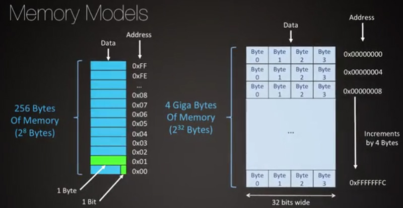
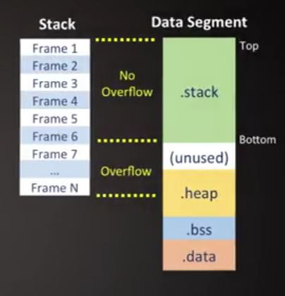
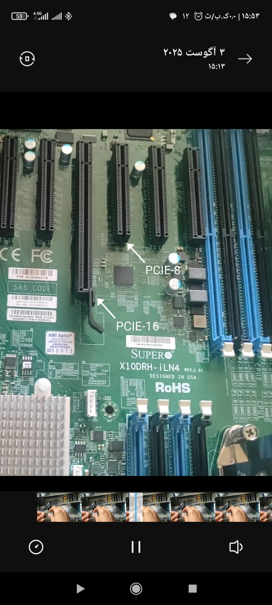

<div dir="rtl">

# 1. 🅰️ General

* دیوایس‌های شبکه‌ای در آینده از نوع SDN یعنی software define network خواهند بود که بتوانند برحسب نیازمندی‌های شبکه برنامه ریزی شوند

## 1.1. 🅱️ Commands

```shell
#Get UUID
dmidecode -s system-uuid

#Data And Information
sudo lspci #show all pci card
sudo lspci -tv
sudo lspci -v
sudo lspci -vvvvvvvv
sudo lsusb -tv

sudo dmidecode -q

lsusb #show all usb
udevadm # monitoring kernel udevd events
```

## 1.2. 🅱️ Benchmark

* GraphicCard: [URL](http://gpuboss.com)
* Monitor: [URL](* Monitor: https://www.displayspecifications.com/en/comparison/97f830fe5c)
* CPU: [URL](http://cpuboss.com)

## 1.3. 🅱️ Test Health

بررسی سلامت قطعه سخت‌افزار

* WindowsApp
    * Disk
        * hard disk sentinel(GUI): برنامه تست هارد دیسک
        * HDD Regenerator(سال2024): هارد دیسک را تست میکند و ریپیر میکند
    * General
        * MemTest86: برنامه ویندوزی برای تست «سی‌پی‌یو» و رم
* Command
* LinuxApp
    * Disk
        * `sudo smartctl -A /dev/sda` #Power_On_Hours نمایش میزان ساعت کارکرد

# 2. 🅰️ MEMORY|Ram

* «DMA» یا «DirectAccessMemory»: اجازه دسترسی خواندن و نوشتن مستقیما روی رَم بدون دخالت «سی‌پی‌یو» یعنی بخشی از هارد را به مموری انتقال دادن

```shell
lsmem

/proc/meminfo

#free
free -m #نمایش بر حسب مگابایت
        # [total]:Total installed memory (MemTotal and SwapTotal in /proc/meminfo)
        # [used]:Used or unavailable memory (calculated as total - available)
        # [free]:Unused memory (MemFree and SwapFree in /proc/meminfo)
        # [shared]:Memory used (mostly) by tmpfs (Shmem in /proc/meminfo)
        # [buff/cache]:Sum of buffers and cache
        # [buffers]:Memory used by kernel buffers (Buffers in /proc/meminfo)
        # [cache]:Memory used by the page cache and slabs (Cached and SReclaimable in /proc/meminfo)
        # [available]:Estimation of how much memory is available for starting new applications, without swapping(MemAvailable in /proc/meminfo)

#vmwtat
vmstat -s #نمایش در یک ستون و زیرهم
vmstat -d #اطلاعات پیرامون ورودی و خروجی دیسک
pmap <id of process> #دقیقا از چه مموری‌هایی درحال استفاده است

sudo ipcs #نمایش قطعات رم که برنامه‌ها به صورت اشتراکی از آن استفاده می‌کنند
```




# 3. 🅰️ Battery

* CMD(Windows)
    * `powercfg/batteryreport` #get all information about battery in microsoft surface

</div>


