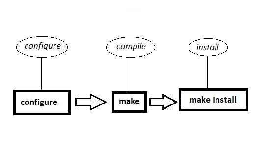
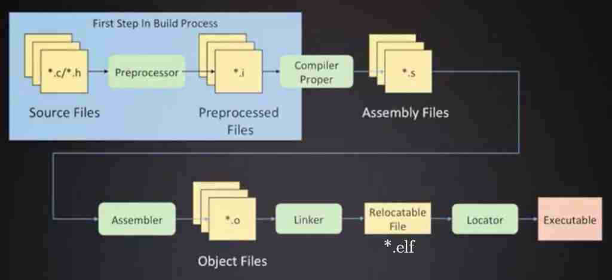

# COMPILE

## Compile Proces steps

برنامه GCC یک برنامه نوشته شده به زبان C یا C++ را در ۴ مرحله اجرا می کند به عنوان مثال، `gcc -o hello.exe hello.c` به صورت زیر انجام می شود

## 1️⃣️:PreProcessing[پیش‌پردازش]

* فایل‌های پیش‌پردازش شده دارای پسوند “i.” هستند.
* مشمول کلیه خطوط در زبان C است که با علامت # شروع می‌شوند.
    * شامل [defineها که تعریف مقادیر ثابت است] و [Headerها]
* در فایل خروجی پیش‌پردازنده برای کامنت‌گذاری از علامت # همراه با یک عدد استفاده می‌شود
* در این مرحله مجموعه دستورات پیش‌پردازنده با مقادیر واقعی‌شان جایگزین می‌شوند.
    * فایلی که با پسوند i می‌باشد حاوی هیچ «include» یا «define» نیست و بجای هرکدام از «include»‌ یا «define» مقادیر محتوی آنها قرار گرفته است
    * دستورات پیش‌پردازنده با محتوایشان جایگزین شده‌اند و خود این دستورات یا کامنت شده یا حذف شده‌اند.
    * در این مرحله، عملکرد کامپایلر به‌صورت بازگشتی است.
        * یعنی ابتدا کتابخانه‌هایی که سورس کد به آنها نیاز دارد را می‌یابد، سپس کتابخانه‌هایی که کتابخانه‌های سورس کد به آنها نیاز دارد را می‌یابد
        * این کار را تا جایی ادامه می‌دهد که کتابخانه‌ای موردنیاز کتابخانه دیگر نباشد.
        * پس از یافتن آنها، از همان نقطه شروع ، اقدام به جایگزینی کتابخانه‌ها با محتوای آنها در کد می‌کند
* برای مقداردهی به ثابت‌های کد، می‌توان در هنگام کامپایل این مقادیر داده شود.[در قطعه کد FORM1 بجای تعریف مقدار A تحت عنوان «define» آن را در هنگام کامپایل مقدار دهید]

gcc -E [Name of Source Code] -o [Name of Output File]

* `gcc -E metech2.c -o PreProcessed.i`
* `cpp file.c > PreProcessedFile.i` #via the GNU C Preprocessor (cpp.exe)

```shell
//metech3.c Source Code
#include <stdio.h>
int main(){
printf("5 * 2 = %d", A);
}
```

`gcc -DA=100 metech3.c -o output`

## 2️⃣️:Compilling[کامپایل]

* در این مرحله کد پیش‌پردازش شده کامپایل می‌شود یعنی کد زبان C به یک کد اسمبلی تبدیل می‌شود
* زبان اسمبلی: یکی از زبان‌های سطح پایین محسوب می‌شود که در آن ما معمولاً مستقیماً با رجیسترهای پردازنده درگیر هستیم(عملیات ریاضی و منطقی از طریق کار روی رجیسترها)
* معمولاً فایل‌های تبدیل شده به فایل اسمبلی دارای پسوند “s.” هستند.


* gcc -S [Name of Source Code] -o [Name of Output file]

`gcc -S metech2.c -o assembled.s` # as -o hello.o hello.s → The assembler (as.exe) converts the assembly code into machine code

## 3️⃣️:CreatingObjectFile[تبدیل کداسمبلی به زبان‌ماشین]

* Object fileها:
    * کدهای صفر و یک هستند که توسط پردازنده قابل‌فهم و اجراست.(دستورالعمل اجرایی پردازنده)
    * فایل object نتیجه کامپایل یک فایل منبع (مانند main.c) است بدون اینکه لینک شده باشد
    * معمولاً Object File ها دارای پسوند “o.” هستند.
    * نمی‌توان به‌صورت یک فایل متنی باز کرد
    * برای دیدن محتوای Object file از دستور objdump استفاده نمایید
    * داخل آن مجموعه سری کد به فرمت هگز می‌باشد
* یکی از راه‌های Close source کردن کد ، تبدیل آن به یک Object file است که عملاً قابلیت تغییر ندارد
* در این مرحله کد اسمبلی به کد زبان ماشین(Object file) تبدیل می‌شود

### Commands

`gcc -c [Name of Source Code] -o [Name of Output file]`
`gcc -c metech2.c -o ObjectFile.o`

برای دیس‌اسمبل کردن (Disassemble) یک فایل اُبجِکت (Object File)
`objdump [Option] [File] `

* [-D]:  تبدیل کد ماشین به اسمبلی
    * تمام بخش‌های قابل اجرا و داده‌های کد ماشین را دیس‌اسمبل کند
    * `objdump -D ObjectFile.o`

```shell
make install  #کپی فایل‌های کامپایل شده در مسیرهای درست
nm ObjectFile.so # مشاهده توابع داخل یک آبجکت فایل
```

### Create ObjectFile.so

**مرحله اول:** یک فایل با پسوند سی ایجاد نمایید که حاوی کد زبان سی باشد

cat `libhello.c`

```c
#include <stdio.h>

void say_hello() {
    printf("Hello from .so file!\n");
}
```

**مرحله‌دوم:** تبدیل به آبحکت‌فایل

```shell
gcc -shared -fPIC -o libhello.so libhello.c
```

**مرحله‌سوم:** استفاده در برنامه

```shell
gcc main.c -o app -L. -lhello
```

**مرحله‌چهارم:**

```shell
./app
# output: Hello from .so file!
```

## 4️⃣️:Linker[لینک‌کردن]

* لینک کردن فرآیند ترکیب چندین فایل object و کتابخانه‌ها (libraries) برای ایجاد یک فایل اجرایی (executable)، کتابخانه به اشتراک گذاری شده (shared library) یا کتابخانه استاتیک (static library) است.
* دو نوع لینک کردن داریم:
    * ۱-نوع Static Linking: تمام کُد (از جمله کتابخانه‌ها) در زمان لینک به فایل executable اضافه می‌شود. فایل بزرگ‌تر ولی مستقل
    * ۲-نوع Dynamic Linking: کتابخانه‌ها در زمان اجرا بارگذاری می‌شوند. فایل کوچک‌تر و به اشتراک‌گذاری کتابخانه‌ها ممکن است
* تجمیع فایل‌های مستقل کنار هم که بعضا با هم ارتباط دارند(همانند includeهایی که در کد سبب فراخوانی یک فایل دیگر می‌شود)
* لینکر یک مرحله ضروری در کامپایل است و فایل object تنها نیمی از کار است و بدون لینک کردن با کتابخانه‌ها،نمی‌توان یک برنامه کامل و اجراپذیر ساخت.

### Commands

در عمل، مردم اغلب مستقیماً از gcc برای لینک کردن استفاده می‌کنند، چون gcc خودش می‌داند چه کتابخانه‌ها و فایل‌های اولیه‌سازی را باید به ld بدهد و نیاز نیست مانند دستور ld آن را مستقیمان وارد نماییم

`ld -o hello.exe hello.o ...libraries...` #the linker (ld or ld.exe) links the object code with the library code to produce an executable file hello.exe

* این برنامه `ld` است که فایل‌های object (مثل hello.o) و کتابخانه‌ها (مثل libc.a) را با هم ترکیب می‌کند و یک فایل اجرایی می‌سازد.
* عبارت `libraries`  را باید وارد نماییم یعنی کتابخانه‌های لازم (مانند libc.a یا libm.so) را هم به لینکر بدهیم.

### example1

فرض کنید شما یک فایل C دارید به نام hello.c:

```c
#include <stdio.h>

int main() {
    printf("Hello, world!\n");
    return 0;
}
```

* دو دستور زیر یکسان‌هستند و دستور gcc خودش کارهای ld را نیز انجام می‌دهد

```shell
gcc -o hello.exe hello.o
```

```shell
gcc -c hello.c -o hello.o # کامپایل بدون لینک (فقط تولید فایل آبجکت)
ld -o hello.exe hello.o /usr/lib/x86_64-linux-gnu/crt0.o -lc # لینک کردن با کتابخانه‌ها
./hello.exe # اجرای برنامه
# output: Hello, world!
```

نکته‌ها:

* بخش /usr/lib/.../crt0.o: فایل اولیه‌سازی برنامه
* بخش -lc: کتابخانه استاندارد C (libc.a)

### example2

فرض کنید دو فایل داریم:فایل‌اول `main.c` که شامل تابع main و فایل‌دوم `helper.c`که شامل تابع addاست

Filename: `main.c`

```c
#include <stdio.h>

int add(int a, int b); // تعریف در helper.c

int main() {
    printf("Sum: %d\n", add(5, 7));
    return 0;
}
```

Filename: `helper.c`

```c
int add(int a, int b) {
    return a + b;
}
```

```shell
# کامپایل هر فایل به صورت جداگانه
gcc -c main.c -o main.o
gcc -c helper.c -o helper.o
```

```shell
gcc main.o helper.o -o program # لینک کردن آبجکت‌فایل‌ها
```

```shell
./program # اجرای برنامه
# output: Sum: 12
```

## Images


<br>

<br>

<br>


# LIBRARY

## Library

* معمولا نام فایل های کتابخانه با پیشوند lib شروع می شوند و با پسوند .a یا so تمام می شوند. این موضوع در مورد تمام کتابخانه های استاندارد سی حتمی است
* درزمان کامپایل(دربرنامه) هنگام لینک دادن به کتابخانه پسوند و پیشوند آورده نمی شود و خود کامپایلر میداند که باید آنها را اضافه کند

## Static Library

* بیشتر با پسوند a دیده‌می‌شوند
* یک بخش از برنامه هستند و به برنامه لینک شده است

## Dynamic Library

* بیشتر با پسوند *.so دیده‌می‌شوند که مخفف SharedObject می‌باشند
* کتابخانه های اشتراکی در برنامه اجرایی ادغام نمی شوند اما به برنامه اجرایی متصل هستند.
* به دوحالت مورد استفاده قرار می‌گیرند
    * **حالت‌اول:** در زمان شروع اجرا به برنامه وصل می شوند(برنامه از قبل مکان و وجود آنها آگاهی دارد) یعنی در زمان استفاده(کامپایل و زمان لینک شدن) باید وجود داشته باشند.
    * **حالت‌دوم:**کتابخانه های پویا در حین اجرا لود و به برنامه اجرایی متصل می شوند.
        * مثلا یک پلاگین مرورگر این کار با استفاده از توابع لود لینک سیستم انجام می پذیرد.

معمولا نام فایل های کتابخانه با پیشوند lib شروع می شوند و با پسوند .a یا so تمام می شوند. این موضوع در مورد تمام کتابخانه های استاندارد سی حتمی است.
درزمان کامپایل(دربرنامه) هنگام لینک دادن به کتابخانه پسوند و پیشوند آورده نمی شود و خود کامپایلر میداند که باید آنها را اضافه کند

## Commands

```shell
nm ObjectFile.so # مشاهده توابع داخل یک آبجکت فایل
```

# MAKEFILE

## 1️⃣️.Concept

استفاده از روش ماژولار(Modular) بهترین گزینه در کدنویسی و کامپایل پروژه‌هاست بگونه‌ای که بخش‌های مختلف پروژه به صورت ماژول‌های مجزا کامپایل شوند. این موضوع سبب بروز پیچیدگی خواهد شد که بدین جهت ابزار Make برای تسهیل این مراحل و خودکارسازی این فرایند مورد استفاده قرار می‌گیرد. روند کامپایل این ماژول‌ها در فایلی به‌نام Makefile تعریف می‌شوند.

وقتی شما دستور make را در خط فرمان می‌نویسید، برنامهٔ Make در دایرکتوری فعلی‌ای که در آن قرار دارید فایلی به‌نام Makefile را می‌خواند و شروع به پردازش اولین هدف موجود در آن می‌کند (Default Goal). اما قبل از اینکه دستورات موجود در این هدف اجرا شوند، Make باید تمام پیش‌نیازهای مربوط به آن هدف را پردازش کند. هر یک از این پیش‌نیازها نیز برای خود Rule
دارند که برای ساخت آن‌ها پردازش خواهد شد.

## 2️⃣️.makefile Structure and Syntax

```makefile
Target: PreRequirments
     Commands # تو رفتگی حتما باید با تب باشد و اسپیس نباید استفاده شود
```

* **تارگت(Target):** به فایلی(هایی) که باید ساخته شوند هدف یا arget) گفته می‌شود
    * نام خروجی نهایی
    * مثل فایل object, executable, library
        * نام فایلی(هایی‌)که قرار است توسط یک برنامه ایجاد شود و با یک فاصله (space) از هم تفکیک‌شده اند.
        * حتی می‌تواند نام کاری باشد که قرار است اجرا شود. مثل تمیز کردن یک پروژه (Clean)
        * اولین target نوشته شده در فایل makefile را default Target می‌نامند
* **پیش‌نیازها(Dependencies یا PreRequirment):** نام فایلی(هایی‌) که تارگت به آنها وابستگی دارد
    * باید حتماً قبل از اجرای دستور مورد بررسی قرار بگیرند.
    * هرکدام از PreRequirment ها خودشان یک تارگت هستند
    * در صورت تغییر در هر یک از این پیش‌نیازها، تارگت باید دوباره ساخته شود.
    * کدهای تغییر کرده source پروژه را بصورت اتوماتیک تشخیص می‌دهد. این امکان زمانی مفید خواهد بود که تعداد کدهای source یک برنامه زیاد است
    * در صورت تعدد پیشنیاز توسط یک فاصله (space) این پیش‌نیازها از هم تفکیک می‌شوند
    * البته تارگت‌هایی هم هستند که نیاز به پیش‌نیازی ندارند
    * مثلا تارگت Clean که باید بعضی از فایل‌ها را پاک کند.
* **دستور یا Commands:** گام‌هایی که Make برای ساخت Targer انجام خواهد داد
    * برای ساخت یک Targer ممکن است چندین دستور نیاز باشد که باید در خطوط جداگانه نوشته شوند
    * نکته📌️ بسیار مهم: حتماً باید در ابتدای دستورات یک کارکتر تب (TAB) قرار دهید
    * لزومی به وارد کردن کامند نیست و می‌توان rule نوشت که کامندی نداشته باشد. `output.o: defs.h`

**توضیحات‌تکمیلی**

* برای ادامه خط‌ها در خط بعد از “\” استفاده می‌شود
* برای کامپایل makefile.in باید برنامه make در سیستم‌عامل کامپایل‌کننده نصب شده باشد
* امکان include نمودن مجموعه makefile های دیگر در داخل Makefile اصلی
* استفاده از # برای نوشتن کامنت ها
* فقط برای کامپایل برنامه‌ها استفاده نمی‌شود بلکه هر کاری اعم از بروزرسانی(فایل‌ها) و تغییر یا حذف نیز مورد استفاده قرار می‌گیرد
* بدلیل نوشته‌شدن جزئیات در Makefile ، امکان کامپایل و نصب را برای کاربر ساده (بدون اطلاعات فنی) فراهم می‌آورد
* دستورات فایل makefile در shell اجرا می‌شوند تا سبب ایجاد فایل اجرایی پروژه گردند
* استفاده از Make وابسته به زبان برنامه‌نویسی خاصی نیست.
* برنامه ldd در لینوکس لایبرری‌های اشتراکی یک برنامه اجرایی را لیست می‌کند

## 3️⃣️.Rules

قوانین  (Rules) به دو دسته کلی تقسیم می‌شوند:

**دسته اول-قوانین صریح (Explicit Rules):** خودمان بصورت مستقیم نام دقیق target، dependencies و دستورات build را مشخص کنی

* انعطاف‌پذیری بیشتر
* خوانایی واضح‌تر
* مثال: فرض کنید یک برنامه C دارید با نام `main.c` و می‌خواهید آن را به یک اجرایی به نام `myprogram` کامپایل کنید.

```makefile
myprogram: main.c
  gcc -o myprogram main.c
```

**دسته دوم-قوانین غیرصریح (Implicit Rules):** برنامه Make خودش تشخیص دهد چگونه یک فایل را بسازد، بدون اینکه شما جزئیات دستورات را بنویسید. این قوانین پیش‌فرض هستند و بر اساس پسوندهای فایل‌ها عمل می‌کنند.

* انعطاف‌پذیری کمتر (اما کاربرد عمومی دارد)
* خوانانی کوتاه‌تر اما گاهی گیج‌کننده برای تازه‌کارها
* مثال:اگر فایل `main.c` موجود باشد و یک target به نام `main.o` تعیین کنید، Make به صورت خودکار و ضمنی می‌داند که باید `main.c` را با gcc کامپایل کند.
    * یعنی می‌توانید فقط قطعه کد زیر را بعنوان قانون غیر صریح(Implicit Rules) بنویسید

```makefile
main.o:
```

* در موضوع قوانین غیرصریح (Implicit Rules) دو قطعه کد زیر مشابه هستند. موارد تعریف شده در بخش دوم بصورت ضمنی توسط برنامه Make خودش قانون ضمنی (implicit) را به کار می‌برد.

```makefile
#1️⃣️ Explicit Rule یا غیرصریح
main.o:

#2️⃣️:Implicit Rule یا صریح
main.o: main.c
  gcc -c main.c -o main.o

```

## 4️⃣️.Variables

متغیرها برای ساده‌سازی مورد استفاده قرار می‌گیرند(دو نمونه زیر یکسان هستند)

```makefile
edit : main.o kbd.o command.o display.o insert.o search.o files.o utils.o
cc -o edit main.o kbd.o command.o display.o insert.o search.o files.o utils.o
```

```makefile
objects = main.o kbd.o command.o display.o insert.o search.o files.o utils.o

edit : $(objects)
cc -o edit $(objects)
```

* با کاراکتر دالر شروع می‌شود
* متغیرهای باید درون پرانتز یا آکولاد قرار بگیرند
* تقریباً تمام Makefileها متغیری با نامی شبیه به objects یا OBJECTS یا objs یا OBJS یا obj یا OBJ دارند که فهرستی از نام تمام آبجکت‌های مورد نیاز در پروژه را در خود نگه داشته‌است
* متغیر می‌تواند شامل کاراکتر فاصله باشد. یعنی موارد را توسط فاصله از هم جدا نماید

### 4.1.GeneralVariable

<div style="direction: rtl">

جدول کامل متغیرهای رایج در Makefile

| نام متغیر       | نوع      | توضیح کامل                                                  | مثال استفاده                                                |
|-----------------|----------|-------------------------------------------------------------|-------------------------------------------------------------|
| `CC`            | کامپایلر | مشخص کننده کامپایلر C (مانند `gcc`, `clang`)                | `CC = gcc`                                                  |
| `CXX`           | کامپایلر | مشخص کننده کامپایلر C++ (مانند `g++`, `clang++`)            | `CXX = g++`                                                 |
| `CPP`           | کامپایلر | پیش‌پردازنده C/C++                                          | `CPP = cpp`                                                 |
| `FC`            | کامپایلر | کامپایلر زبان Fortran                                       | `FC = gfortran`                                             |
| `PC`            | کامپایلر | کامپایلر Pascal (مانند `fpc`)                               | `PC = fpc`                                                  |
| `CFLAGS`        | گزینه‌ها | گزینه‌های کامپایلر برای زبان C                              | `CFLAGS = -Wall -Wextra -O2`<br>`CFLAGS = -Wall -Wextra -g` |
| `CXXFLAGS`      | گزینه‌ها | گزینه‌های کامپایلر برای زبان C++                            | `CXXFLAGS = -std=c++17 -g`                                  |
| `FFLAGS`        | گزینه‌ها | گزینه‌های کامپایلر Fortran                                  | `FFLAGS = -O3 -m64`                                         |
| `PFLAGS`        | گزینه‌ها | گزینه‌های کامپایلر Pascal                                   | `PFLAGS = -Mobjfpc -Criot`                                  |
| `CPPFLAGS`      | گزینه‌ها | گزینه‌های پیش‌پردازنده C/C++ (مثل `-I`, `-D`)               | `CPPFLAGS = -Iinclude -DNDEBUG`                             |
| `LDFLAGS`       | گزینه‌ها | گزینه‌های لینکر (مانند `-L`, `-rpath`)                      | `LDFLAGS = -L/usr/local/lib`                                |
| `LDLIBS`        | لینکاژ   | لیبری‌هایی که باید لینک شوند                                | `LDLIBS = -lm -lpthread`                                    |
| `AR`            | کارولیب  | کارولیب (archive tool) برای ساخت static library             | `AR = ar`                                                   |
| `ARFLAGS`       | گزینه‌ها | گزینه‌های `ar` (مانند `rcs`)                                | `ARFLAGS = rcs`                                             |
| `RANLIB`        | کارولیب  | ابزاری برای ایجاد فهرست نمادهای قابل لینک در static library | `RANLIB = ranlib`                                           |
| `RM`            | سیستمی   | دستور حذف فایل (معمولاً `rm -f`)                            | `RM = rm -f`                                                |
| `INSTALL`       | سیستمی   | دستور نصب فایل‌ها در سیستم                                  | `INSTALL = install`                                         |
| `prefix`        | مسیر     | پیشوند مسیر اصلی برای نصب (معمولا `/usr/local`)             | `prefix = /usr/local`                                       |
| `exec_prefix`   | مسیر     | پیشوند مسیر اجرایی (معمولا `$(prefix)`)                     | `exec_prefix = $(prefix)`                                   |
| `bindir`        | مسیر     | مسیر نصب اجرایی‌ها                                          | `bindir = $(exec_prefix)/bin`                               |
| `includedir`    | مسیر     | مسیر نصب header فایل‌ها                                     | `includedir = $(prefix)/include`                            |
| `libdir`        | مسیر     | مسیر نصب لیبری‌ها                                           | `libdir = $(exec_prefix)/lib`                               |
| `datadir`       | مسیر     | مسیر نصب داده‌های مشترک                                     | `datadir = $(prefix)/share`                                 |
| `mandir`        | مسیر     | مسیر نصب فایل‌های راهنما (man pages)                        | `mandir = $(datadir)/man`                                   |
| `SRCS`          | منبع     | لیست فایل‌های منبع (مانند `.c`, `.cpp`, `.f90`)             | `SRCS = main.c utils.c`                                     |
| `OBJS`          | object   | لیست فایل‌های object (مانند `.o`)                           | `OBJS = main.o utils.o`                                     |
| `HDRS`          | منبع     | لیست header فایل‌ها (مانند `.h`)                            | `HDRS = utils.h`                                            |
| `TARGET`        | خروجی    | نام برنامه یا لیبری نهایی                                   | `TARGET = myprogram`                                        |
| `PROGS`         | خروجی    | لیست تمام برنامه‌هایی که build می‌شوند                      | `PROGS = app1 app2`                                         |
| `LIBS`          | خروجی    | لیست لیبری‌هایی که build می‌شوند                            | `LIBS = libmylib.a`                                         |
| `TESTS`         | تست      | لیست تست‌های واحد یا تست‌کیس‌ها                             | `TESTS = test_math test_utils`                              |
| `DOCS`          | مستندات  | فایل‌های مستندات تولیدی (مانند HTML, PDF)                   | `DOCS = docs/html/index.html`                               |
| `TAGS`          | ابزار    | فایل‌های تگ (برای vim/emacs)                                | `TAGS = tags`                                               |
| `MAKEDEPEND`    | ابزار    | ابزاری برای تولید وابستگی‌های include                       | `MAKEDEPEND = makedepend`                                   |
| `YACC`          | ابزار    | parser generator (مانند `bison`)                            | `YACC = bison`                                              |
| `LEX`           | ابزار    | lexer generator (مانند `flex`)                              | `LEX = flex`                                                |
| `FLEX`          | ابزار    | flex lexer generator                                        | `FLEX = flex`                                               |
| `BISON`         | ابزار    | Bison parser generator                                      | `BISON = bison`                                             |
| `MOC`           | Qt       | Meta-Object Compiler for Qt                                 | `MOC = moc`                                                 |
| `UIC`           | Qt       | UI compiler for Qt                                          | `UIC = uic`                                                 |
| `QMAKE`         | Qt       | QMake utility                                               | `QMAKE = qmake`                                             |
| `JAVAC`         | Java     | کامپایلر زبان Java                                          | `JAVAC = javac`                                             |
| `JFLAGS`        | گزینه‌ها | گزینه‌های کامپایلر Java                                     | `JFLAGS = -g`                                               |
| `PYTHON`        | Python   | مفسر یا کامپایلر Python                                     | `PYTHON = python3`                                          |
| `SWIG`          | ابزار    | ابزار تولید wrapper بین زبان‌های مختلف                      | `SWIG = swig`                                               |
| `SWIGFLAGS`     | گزینه‌ها | گزینه‌های SWIG                                              | `SWIGFLAGS = -python`                                       |
| `SED`           | سیستمی   | جستجو و جایگزینی الگو در فایل‌ها                            | `SED = sed`                                                 |
| `AWK`           | سیستمی   | پردازش الگو و داده در فایل‌ها                               | `AWK = awk`                                                 |
| `GREP`          | سیستمی   | جستجو در فایل‌ها                                            | `GREP = grep`                                               |
| `CP`            | سیستمی   | کپی کردن فایل‌ها                                            | `CP = cp`                                                   |
| `MV`            | سیستمی   | تغییر نام یا انتقال فایل                                    | `MV = mv`                                                   |
| `MKDIR`         | سیستمی   | ایجاد پوشه                                                  | `MKDIR = mkdir -p`                                          |
| `TAR`           | سیستمی   | ابزار tar برای فشرده‌سازی                                   | `TAR = tar`                                                 |
| `ZIP`           | سیستمی   | ابزار zip برای فشرده‌سازی                                   | `ZIP = zip`                                                 |
| `UNZIP`         | سیستمی   | ابزار unzip برای باز کردن فایل‌های zip                      | `UNZIP = unzip`                                             |
| `GIT`           | ابزار    | مدیریت نسخه‌ها                                              | `GIT = git`                                                 |
| `VALGRIND`      | تست      | ابزار تست حافظه                                             | `VALGRIND = valgrind`                                       |
| `GCOV`          | تست      | ابزار code coverage برای GCC                                | `GCOV = gcov`                                               |
| `PERL`          | سیستمی   | مفسر Perl                                                   | `PERL = perl`                                               |
| `PHP`           | سیستمی   | مفسر PHP                                                    | `PHP = php`                                                 |
| `SHELL`         | سیستمی   | shell استفاده شده در Makefile (معمولاً `/bin/sh`)           | `SHELL = /bin/bash`                                         |
| `MAKE`          | ابزار    | خود دستور `make`                                            | `MAKE = make`                                               |
| `DESTDIR`       | مسیر     | مسیر موقت برای نصب (قبل از root)                            | `DESTDIR = /tmp/install`                                    |
| `PREFIX`        | مسیر     | معادل `prefix`، برای سازگاری با بعضی پروژه‌ها               | `PREFIX = /opt/myapp`                                       |
| `VERSION`       | عمومی    | نسخه نرم‌افزار                                              | `VERSION = 1.0.0`                                           |
| `DEBUG`         | گزینه‌ها | فلگ برای enable کردن debug                                  | `DEBUG = -g`                                                |
| `OPTIMIZE`      | گزینه‌ها | فلگ بهینه‌سازی                                              | `OPTIMIZE = -O3`                                            |
| `PROFILE`       | گزینه‌ها | فلگ برای profiling                                          | `PROFILE = -pg`                                             |
| `STATIC`        | گزینه‌ها | فلگ برای build static                                       | `STATIC = -static`                                          |
| `SHARED`        | گزینه‌ها | فلگ برای build shared library                               | `SHARED = -shared`                                          |
| `PIC`           | گزینه‌ها | Position Independent Code برای لیبری‌های shared             | `PIC = -fPIC`                                               |
| `THREADS`       | گزینه‌ها | فلگ برای پشتیبانی از multi-threading                        | `THREADS = -pthread`                                        |
| `VERBOSE`       | گزینه‌ها | فلگ برای نمایش جزئیات build                                 | `VERBOSE = 1`                                               |
| `CONFIG`        | عمومی    | تنظیمات پیکربندی                                            | `CONFIG = release`                                          |
| `OS`            | عمومی    | سیستم عامل هدف                                              | `OS = Linux`                                                |
| `ARCH`          | عمومی    | معماری CPU هدف                                              | `ARCH = x86_64`                                             |
| `EXEEXT`        | خروجی    | پسوند فایل اجرایی (در ویندوز `.exe`)                        | `EXEEXT = .exe`                                             |
| `OBJEXT`        | object   | پسوند فایل object                                           | `OBJEXT = .o`                                               |
| `LIBEXT`        | خروجی    | پسوند فایل لیبری (`.a`, `.so`, `.dll`)                      | `LIBEXT = .a`                                               |
| `DOCSDIR`       | مسیر     | مسیر ذخیره مستندات                                          | `DOCSDIR = $(prefix)/doc/$(PROJECT)`                        |
| `ETCDIR`        | مسیر     | مسیر فایل‌های config                                        | `ETCDIR = $(prefix)/etc`                                    |
| `DATADIR`       | مسیر     | مسیر داده‌های برنامه                                        | `DATADIR = $(prefix)/data`                                  |
| `LOCALEDIR`     | مسیر     | مسیر فایل‌های ترجمه                                         | `LOCALEDIR = $(DATADIR)/locale`                             |
| `SYSCONFDIR`    | مسیر     | مسیر فایل‌های پیکربندی سیستمی                               | `SYSCONFDIR = /etc`                                         |
| `LOCALSTATEDIR` | مسیر     | مسیر داده‌های محلی سیستم (مانند log, run)                   | `LOCALSTATEDIR = /var`                                      |
| `INFODIR`       | مسیر     | مسیر info manuals                                           | `INFODIR = $(prefix)/info`                                  |
| `HTMLDIR`       | مسیر     | مسیر مستندات HTML                                           | `HTMLDIR = $(DOCSDIR)/html`                                 |
| `PDFDIR`        | مسیر     | مسیر مستندات PDF                                            | `PDFDIR = $(DOCSDIR)/pdf`                                   |
| `MANDIR`        | مسیر     | مسیر فایل‌های man page                                      | `MANDIR = $(DATADIR)/man`                                   |
| `XSLTPROC`      | ابزار    | XSLT processor                                              | `XSLTPROC = xsltproc`                                       |
| `DOXYGEN`       | ابزار    | ابزار تولید مستندات Doxygen                                 | `DOXYGEN = doxygen`                                         |
| `SPHINXBUILD`   | ابزار    | ابزار ساخت مستندات Sphinx                                   | `SPHINXBUILD = sphinx-build`                                |
| `CTEST`         | تست      | تست runner برای CMake                                       | `CTEST = ctest`                                             |
| `AUTOMAKE`      | ابزار    | ابزار Automake                                              | `AUTOMAKE = automake`                                       |
| `AUTOCONF`      | ابزار    | ابزار Autoconf                                              | `AUTOCONF = autoconf`                                       |
| `LIBTOOL`       | ابزار    | ابزار Libtool                                               | `LIBTOOL = libtool`                                         |
| `PKG_CONFIG`    | ابزار    | ابزار pkg-config برای یافتن لیبری‌ها                        | `PKG_CONFIG = pkg-config`                                   |
| `WGET`          | سیستمی   | دانلود فایل از طریق HTTP                                    | `WGET = wget`                                               |
| `CURL`          | سیستمی   | دانلود/آپلود داده از طریق شبکه                              | `CURL = curl`                                               |
| `SSH`           | سیستمی   | اتصال به روت Remote                                         | `SSH = ssh`                                                 |
| `SCP`           | سیستمی   | کپی فایل روی SSH                                            | `SCP = scp`                                                 |
| `RSYNC`         | سیستمی   | سنکرون کردن فایل‌ها                                         | `RSYNC = rsync`                                             |
| `DATE`          | سیستمی   | نمایش یا تبدیل تاریخ                                        | `DATE = date`                                               |
| `UUIDGEN`       | سیستمی   | تولید UUID                                                  | `UUIDGEN = uuidgen`                                         |
| `BASENAME`      | سیستمی   | نمایش نام فایل بدون مسیر                                    | `BASENAME = basename`                                       |
| `DIRNAME`       | سیستمی   | نمایش مسیر فایل بدون نام فایل                               | `DIRNAME = dirname`                                         |
| `REALPATH`      | سیستمی   | نمایش مسیر واقعی فایل                                       | `REALPATH = realpath`                                       |
| `HOSTNAME`      | سیستمی   | نمایش نام هاست                                              | `HOSTNAME = hostname`                                       |
| `UNAME`         | سیستمی   | نمایش اطلاعات سیستم                                         | `UNAME = uname`                                             |
| `ID`            | سیستمی   | نمایش شناسه کاربر                                           | `ID = id`                                                   |
| `WHOAMI`        | سیستمی   | نمایش نام کاربر فعلی                                        | `WHOAMI = whoami`                                           |

</div>

* با وجود makefile زیر با زدن دستور `make` باید main.c را با دستور `gcc -Wall -Wextra -g -o main main.c` کامپایل کند

```makefile
CC = gcc
CFLAGS = -Wall -Wextra -g

main: main.c
```

* با وجود makefile زیر با زدن دستور `make` باید دستور `gcc -Wall -Wextra -g   -c -o main.o main.c` اجرا شود
    * اگر فایل main.c وجود نداشته باشد، make نمی‌تواند main.o را بسازد و خطا می‌دهد.

```makefile
CC = gcc
CFLAGS = -Wall -Wextra -g

all: main.o

main.o:
```

### 4.2.Automatic variables[متغیرهای خودکار]

متغیرهایی هستند که توسط make به صورت خودکار وقتی یک قاعده(rule) با یک هدف(target) و وابستگی‌های(prerequisites) آن مطابقت پیدا می‌کند ، تنظیم می‌شوند
این متغیرها بسیار مفید هستند زیرا به شما اجازه می‌دهند بدون نوشتن دوباره مسیرها و نام فایل‌ها، در دستورات build استفاده کنید.

* متغیرهای خودکار پس از مطابقت یک قاعده توسط make تنظیم می‌شوند
    * $@: این متغیر حاوی مقدار تارگت است(دقیقا عبارت تارگت)
    * $*: این متغیر حاوی فقط نام تارگت است(بدون پسوند)
    * $<: نام اولین پیشنیاز
    * $^: تمام پیشنیازها(**بدون** تکرار)
        * اگر بیشتر از یک مورد باشند توسط خط فاصله از هم جدا خواهند شد
    * $+: تمام پیشنیازها(**با** تکرار)
        * اگر بیشتر از یک مورد باشند توسط خط فاصله از هم جدا خواهند شد
    * $?: نام تمام وابستگی‌ها(پیش‌نیازها) که جدیدتر از هدف(تارگت) هستند
        * اگر بیشتر از یک مورد باشند توسط خط فاصله از هم جدا خواهند شد
        * وقتی make یک قاعده(rule)را پردازش می‌کند، زمان آخرین تغییر هر فایل را بررسی می‌کند.اگر یکی از وابستگی‌ها بعد از ساختن تارگت تغییر کرده باشد، آن وابستگی "جدیدتر" محسوب می‌شود.

برای فهم بهتر $? به توضیحات زیر توجه نمایید

```makefile
main.o: main.c defs.h
    $(CC) -c $< -o $@
```

* فرض شود که
    * فایل `main.c` آخرین بار ۱۰ دقیقه قبل تغییر کرده‌باشد
    * فایل `defs.h` آخرین بار ۲ ساعت قبل تغییر کرده‌باشد
    * فایل `main.o` آخرین بار ۳ ساعت قبل تغییر کرده‌باشد
* آنگاه
    * فایل main.c جدیدتر از main.o است. پس یعنی باید در $? باشد
    * فایل defs.h قدیمی‌تر از main.o است. پس یعنی بایددر $? نباشد
* بنابراین
    * $? = main.c

### 4.3.Examples

**Example1️⃣️:**

```makefile
main.o: main.c utils.h
    $(CC) -c $< -o $@
```

* $@ → `main.o`
* $< → `main.c`
* $^ → `main.c` `utils.h`
* $* → `main`
* $+ → `main.c` `utils.h`
* $? → Only the dependencies that are newer than `main.o`
    * فقط وابستگی‌هایی که جدیدتر از main.o هستند
    * مثلاً اگر utils.h تغییر کرده باشد، $? برابر main.c utils.h می‌شود

**Example2️⃣️:**

```makefile
all: program
program: main.o utils.o
    $(CC) $^ -o $@
main.o: main.c defs.h
    $(CC) -c $< -o $@
utils.o: utils.c defs.h
    $(CC) -c $< -o $@
```

* for `main.o`
    * $@ = main.o → TargetName
    * $< = main.c → First Dependency
    * $^ = main.c defs.h → All dependences, discard duplicates.
    * $* = main → 'TargetName' without extension
    * $?
        * فقط فایل‌هایی که جدیدتر از main.o هستند (مثلاً main.c)
    * $+ = main.c defs.h → All dependences
        * در این حالت تکراری نداریم
* for `utils.o`
    * $@ = utils.o
    * $< = utils.c
    * $^ = utils.c defs.h
    * $* = utils
    * $?
        * فایل‌هایی که جدیدتر از utils.o هستند (مثلاً utils.c)
    * $+ = utils.c defs.h
    * =
* for `program`
    * $@ = program
    * $^ = main.o utils.o → All dependences, discard duplicates.
    * $< = main.o → First Dependency
    * $* = program → 'TargetName' without extension
    * $?
        * فایل‌هایی که جدیدتر از program هستند (مثلاً main.o)
    * $+ = main.o utils.o

**Example3️⃣️:**

در قطعه‌کد زیر شکل عادی و شکل توأم با متغیر را مشاهده می‌کنید(هر دو یکسان هستند ولی با نگارش متفاوت)

  ```shell
  all: hello.exe
  hello.exe: hello.o
       gcc -o hello.exe hello.o
  hello.o: hello.c
       gcc -c hello.c
  clean:
       rm hello.o hello.exe
  ```

  ```shell
  # Ussing variables(استفاده از مدل متغیرگونه)
  all: hello.exe
  # $@ matches the target; $< matches the first dependent
  hello.exe: hello.o
      gcc -o $@ $<
  hello.o: hello.c
      gcc -c $<
  clean:
      rm hello.o hello.exe
  ```

## 5️⃣️.VirtualPath

**وی‌پَت با حروف کوچک یا VPATH**: تعیین دایرکتوری جهت جستجوی وابستگی‌ها(Dependencies) و فایل‌های تارگت

* For example: Search for dependencies and targets from "src" and "include" directories.The directories are separated by space

```shell
VPATH = src include
```

**وی‌پَت با حروف بزرگ یا vpath**: برای دقت بیشتر پیرامون نوع فایل و مسیر جستجوی فایل

* For example: Search for .c files in "src" directory; .h files in "include" directory, The pattern matching character '%' matches filename without the extension

```
vpath %.c src
vpath %.h include
```

## 6️⃣️.Functions

* همه انواع داده از نوع رشته است و عدد هم رشته محسوب می‌شود
* باعلامت `$(n)` به آرگومان‌ها دسترسی امکان پذیر می‌شود
* خود تابع خروجی ندارد؛ فقط یک رشته جایگزین می‌شود جایی که فراخوانی شده.

**Create Function Syntax:**

```makefile
define function_name
    # Function body
    # Use $(1), $(2) for parameters
endef
```

```makefile
# Create custome function
say_hello = Hello, $(1)! You are $(2) years old.
```

**Call Function Syntax:**

```makefile
result = $(call myFunctionName argument1,argument2,...)
result = $(call myFunctionName,Ali,25)  # فراخوانی تابع یک‌خطی
$(call myFunctionName,Ali,25) # فراخوانی تابع چندخطی
```

**استفاده از تابع:**: برای چاپ یا استفاده از خروجی تابع، باید آن را درون یک دستور shell قرار دهید (مثل echo)

### 6.1.BuiltIn Functions

لیست کامل توابع `GNU Make`

| نام تابع     | توضیح فارسی                           | کاربرد                                 | نحوه استفاده                           | مثال                                                              | خروجی مثال                                                      | نکته مهم                                          |
|--------------|---------------------------------------|----------------------------------------|----------------------------------------|-------------------------------------------------------------------|-----------------------------------------------------------------|---------------------------------------------------|
| `subst`      | جایگزینی رشته                         | جایگزین تمام وقوع‌ها                   | `$(subst from,to,text)`                | `$(subst ee,EE,feet on the street)`                               | `fEEt on thE strEEt`                                            | تمام وقوع‌ها جایگزین می‌شوند.                     |
| `patsubst`   | جایگزینی الگویی                       | جایگزینی عناصرمطابق الگو               | `$(patsubst pattern,replacement,text)` | `$(patsubst %.c,%.o,main.c utils.c)`                              | `main.o utils.o`                                                | برای تبدیل اسم فایل‌ها کاربرد دارد.               |
| `filter`     | فیلتر کردن                            | فیلتر عناصر مطابق الگو                 | `$(filter pattern...,text)`            | `$(filter a% b%,apple banana cherry)`                             | `apple banana`                                                  | فقط عناصر مطابق با الگو را برمی‌گرداند.           |
| `filter-out` | حذف عناصر                             | حذف عناصر مطابق                        | `$(filter-out pattern...,text)`        | `$(filter-out a% b%,apple banana cherry)`                         | `cherry`                                                        | عناصر مطابق با الگو را حذف می‌کند.                |
| `addprefix`  | اضافه کردن پیشوند                     | افزودن پیشوند به‌همه‌عناصر             | `$(addprefix prefix,text)`             | `$(addprefix obj/,a.o b.o)`                                       | `obj/a.o obj/b.o`                                               | مناسب برای مسیرهای build.                         |
| `addsuffix`  | اضافه کردن پسوند                      | افزودن پسوندبه‌همه‌عناصر               | `$(addsuffix suffix,text)`             | `$(addsuffix .c,main utils)`                                      | `main.c utils.c`                                                | برای تولید اسم فایل‌ها استفاده می‌شود.            |
| `join`       | الحاق دو لیست                         | الحاق دو لیست به صورت عنصربه‌عنصر      | `$(join list1,list2)`                  | `$(join a b c,d e f)`                                             | `ad be cf`                                                      | طول خروجی به کوتاه‌ترین لیست بستگی دارد.          |
| `wildcard`   | یافتن فایل                            | یافتن فایل‌هاباالگوی مشخص              | `$(wildcard pattern)`                  | `$(wildcard *.c)`<br>`$(wildcard src/*.c)`                        | `main.c` `utils.c`<br><hr>`src/main.c` `src/sum.c` `src/mine.c` | از فایل‌های واقعی روی دیسک استفاده می‌کند.        |
| `shell`      | اجرای دستور shell                     | اجرای دستوراتshellوبازگرداندن‌خروجی    | `$(shell command)`                     | `$(shell echo Hello World)`                                       | `Hello World`                                                   | ممکن است عملکرد `make` را کند کند.                |
| `foreach`    | حلقه روی لیست                         | اجرای یک دستور برای هرعنصر ازیک لیست   | `$(foreach var,list,text)`             | `$(foreach x,$(list),$(x)_done )`                                 | `a_done b_done c_done`                                          | برای تولید لیست‌های پویا کاربرد دارد.             |
| `origin`     | تعریف متغیر درکجا<br>سورس‌متغیر کجاست | تشخیصsourceیک‌متغیر                    | `$(origin variable)`                   | `$(origin CC)`<hr>bash:`make CFLAGS=-Wall`<hr>makefile:`CC = gcc` | default<hr>CommandLine<hr>Makefile                              | برای بررسی وضعیت متغیرهای سیستمی.                 |
| `error`      | ایجاد خطا                             | متوقف کردن`make`با یک پیام خطا         | `$(error message)`                     | `$(error This is an error message)`                               | `Makefile:xx: *** This is an error message. Stop.`              | برای اعتبارسنجی شرایط ضروری.                      |
| `warning`    | نمایش هشدار                           | نمایش یک هشدار ولی ادامه اجرای`make`   | `$(warning message)`                   | `$(warning This is a warning)`                                    | `Makefile:xx: This is a warning`                                | برای اخطارهای غیرمرگبار.                          |
| `value`      | مقدار بدون expand                     | بازگرداندن مقدار یک متغیربدونxpandکردن | `$(value variable)`                    | `$(value VAR)`                                                    | `$(CC)`                                                         | وقتی می‌خواهید مقدار raw بگیرید.                  |
| `eval`       | ارزیابی دستورات                       | ارزیابی دستوراتMakefileدر زمان اجرا    | `$(eval text)`                         | `$(eval $(call build-target,app))`                                | -                                                               | برای تعریف پویا از قوی‌ترین توابع است.            |
| `if`         | شرط‌گذاری                             | اجرای شرطی بخشی از کد                  | `$(if condition,then-part,else-part)`  | `$(if $(CC),@echo Using $(CC),@echo NocompilerFound)`             | `UsingCompiler gcc`                                             | شرط‌های ساده و کاربردی.                           |
| `call`       | فراخوانی تابع                         | فراخوانی توابع شخصی با آرگومان‌ها      | `$(call function,arg1,arg2,...)`       | `$(call myfunc,Hello,World)`                                      | `First: Hello, Second: World`                                   | پایه توابع کاربری در Makefile.                    |
| `dir`        | استخراج مسیر                          | استخراج مسیرپوشه از یک مسیر فایل       | `$(dir path)`                          | `$(dir /home/user/file.txt)`                                      | `/home/user/`                                                   | برای جدا کردن مسیر فایل.                          |
| `notdir`     | استخراج اسم فایل                      | استخراج فقط اسم فایل ازیک مسیر         | `$(notdir path)`                       | `$(notdir /home/user/file.txt)`                                   | `file.txt`                                                      | فقط اسم فایل را برمی‌گرداند.                      |
| `basename`   | حذف پسوند                             | حذف پسوندفایل                          | `$(basename path)`                     | `$(basename file.txt)`                                            | `file`                                                          | اگرپسوندوجودنداشته‌باشد،همان‌ورودی‌رابرمی‌گرداند. |
| `suffix`     | گرفتن پسوند                           | بازگرداندن پسوند فایل                  | `$(suffix path)`                       | `$(suffix file.txt)`                                              | `.txt`                                                          | اگر پسوند نباشد، خالی برمی‌گرداند.                |
| `firstword`  | اولین کلمه                            | بازگرداندن اولین کلمه ازیک لیست        | `$(firstword word1 word2 ...)`         | `$(firstword one two three)`                                      | `one`                                                           | فقط اولین کلمه را برمی‌گرداند.                    |
| `lastword`   | آخرین کلمه                            | بازگرداندن آخرین کلمه ازیک لیست        | `$(lastword word1 word2 ...)`          | `$(lastword one two three)`                                       | `three`                                                         | فقط آخرین کلمه را برمی‌گرداند.                    |
| `words`      | شمارش کلمات                           | شمارش تعداد کلمات دریک لیست            | `$(words text)`                        | `$(words one two three)`                                          | `3`                                                             | برای اعتبارسنجی تعداد ورودی‌ها.                   |
| `word`       | گرفتن کلمه nام                        | بازگرداندن کلمهnام ازیک لیست           | `$(word n,text)`                       | `$(word 2,one two three)`                                         | `two`                                                           | شماره کلمه از ۱ شروع می‌شود.                      |

### 6.2.Conditional Functions

**$(if condition,then-part,else-part)****

```makefile
RESULT = $(if $(CONDITION), "True", "False")
```

**Example:**

```makefile
LOG_LEVEL = verbose
LOG = $(if $(filter verbose,$(LOG_LEVEL)), @echo "Debug: $1", @true)
```

### 6.3.Examples:

**Example1️⃣️: Simple Function**

```makefile
# Define a function
define greet
    @echo "Hello, $(1)!"
endef

# Call the function
all:
    $(call greet,World)
```

---
**Example2️⃣️: Simple Function**

```makefile
# Create custome function
say_hello = Hello, $(1)! You are $(2) years old.

# call function with two args
message := $(call say_hello,Ali,25) 

#target goal is show message
test:
    @echo "$(message)"
```

```shell
make test
# output:
         Hello, Ali! You are 25 years old.
```

* قسمت `say_hello = ...` : تعریف یک تابع شخصی
* قسمت `$(1)` و `$(2)` : اولین و دومین آرگومانی هستند که به تابع می‌دهیم.
* قسمت `$(call say_hello,Ali,25)` : نحوه فراخوانی تابع با دو آرگومان.
* قسمت `message := ...` : متغیر message را با نتیجه فراخوانی تابع مقداردهی می‌کنیم.
* در هدف test، محتوای متغیر message چاپ می‌شود.

---
**Example3️⃣️: Function with Multiple Parameters**

```makefile
define create_file
    @echo "Creating $(1)..." # پیام ایجاد فایل را چاپ می‌کند
    @touch $(1) # فایل با اسم داده‌شده ایجاد می‌کند (اگر وجود نداشته باشد)
    @echo "Contents: $(2)" > $(1) # محتوا را درون فایل می‌نویسد
endef

all:
    $(call create_file,example.txt,This is some text) # فراخوانی تابع به همراه دو آرگومان ورودی آن
```

خروجی: وقتی دستور `make` را بزنیم خروجی 'Creating example.txt...' چاپ می‌شود و همچنین فایل `example.txt` با محتوی 'Contents: This is some text' نیز ایجاد می‌شود

---
**Example4️⃣️:  Function Returning a Value**

```makefile
define get_filename # finctionName is 'get_filename'
    $(notdir $(1)) # notdir is BuiltIn function that give Filename of PATH in fullFileName
endef

all:
    @echo "Filename is: $(call get_filename,/path/to/file.txt)"
```

خروجی: وقتی دستور `make` را بزنیم خروجی 'Filename is: file.txt' چاپ می‌شود
نکته: تابع notdir اسم فایل را از مسیر فایل خارچ می‌کند
---
**Example5️⃣️: Using Built-in Functions Inside Custom Functions**

این تابع لیستی از فایل‌ها را میگیرد و اسم آن را چاپ می‌کند و یک بک‌آپ از آن با پیشوند آندرلاین بک‌آپ م‌گیرد

```makefile
define process_files
    $(foreach file,$(1),\
        @echo "Processing $(file)";\
        cp $(file) $(addprefix backup_,$(notdir $(file)));\
    )
endef

all:
    $(call process_files,file1.txt file2.txt file3.txt)
```

---
**Advanced Example6️⃣️: Conditional Logic in Functions**

تشخیص دهد فایل داده‌شده یک فایل .c (زبان C) است یا خیر. اگر فایل .c باشد، آن را با gcc کامپایل می‌کند؛ در غیر این صورت پیامی درباره نوع ناشناخته فایل چاپ می‌کند.

```makefile
define compile
    $(if $(filter %.c,$(1)),\
        @echo "Compiling C file: $(1)";\
        gcc -c $(1),\
        @echo "Unknown file type: $(1)"\
    )
endef

all:
    $(call compile,source.c)
    $(call compile,source.cpp)
```

* تابع filter تمام عناصری از $(1) را برمی‌گرداند که باالگوی %.c مطابقت داشته باشند.

## 7️⃣️.Conditions

### 7.1.ifeq | ifneq

Equality Conditions

```makefile
ifeq ($(VARIABLE), value)
    # Code to execute if equal
else
    # Code to execute if not equal
endif

ifneq ($(VARIABLE), value)
    # Code to execute if not equal
endif
```

**Example:**

```makefile
DEBUG = 1

ifeq ($(DEBUG), 1)
    CFLAGS = -g -O0
else
    CFLAGS = -O2
endif
```

### 7.2.ifdef | ifndef

Variable Definition Checks

```makefile
ifdef VARIABLE
    # Code if variable is defined
endif

ifndef VARIABLE
    # Code if variable is not defined
endif
```

**Example:**

```makefile
ifdef USE_CLANG
    CC = clang
else
    CC = gcc
endif
```

### 7.3.Pattern Matching

**$(filter pattern...,text)**

```makefile
SOURCES = main.c util.c helper.cpp

%.o: %.c
    $(if $(filter %.c,$<), \
        $(CC) -c $< -o $@, \
        @echo "Skipping non-C file: $<")
```

### 7.4.Conditional Variable Assignment

* = → Immediate value Assignment
    * از = وقتی نیاز دارید متغیرها دینامیک باشند
* ?= → Assign only if not already set
    * فقط اگر متغیر قبلاً تعریف نشده باشد مقداردهی می‌کند
    * کاربرد: برای تنظیم مقادیر پیش‌فرض
    * توجه: اگر متغیر خالی باشد باز هم مقداردهی می‌کند
    * PREFIX ?= /usr/local # اگر کاربر پریفیکس را تنظیم نکرده باشد
    * از ?= برای مقادیر پیش‌فرض استفاده کنید
* += → Append conditionally
    * مقدار جدید را به انتهای مقدار موجود اضافه می‌کند
    * از += برای اضافه کردن به مقادیر موجود با توجه به نوع تعریف اولیه
* := → Evaluates the right-hand side immediately (only once)
    * NOW := $(shell date)  # تاریخ فقط یکبار هنگام خواندن «میک‌فایل» گرفته می‌شود
    * FILE_LIST := $(wildcard *.c)  # لیست فایل‌ها یکبار ایجاد می‌شود
    * از := برای مقادیر ثابت و دستورات سنگین استفاده کنید
* != → ShellCommand output
    * رفتار: خروجی دستور shell را در متغیر ذخیره می‌کند
    * available after GNU Make 3.82
    * جایگزین: می‌توان از `$(shell ...)` با := استفاده کرد
        * $(shell ...)
    * از != برای ساده‌نویسی دستورات shell استفاده کنید (اگر نسخه Make پشتیبانی می‌کند)

دو بخش زیر معادل هستند

```makefile
GIT_HASH != git rev-parse --short HEAD  # معادل:
GIT_HASH := $(shell git rev-parse --short HEAD)
```

## 8️⃣️.Examples

### 1️⃣️.Hello World

```shell
// hello.c
#include <stdio.h>
int main() {
    printf("Hello, world!\n");
    return 0;
}


//makefile
all: hello.exe
hello.exe: hello.o
	 gcc -o hello.exe hello.o
hello.o: hello.c
	 gcc -c hello.c
clean:
	 rm hello.o hello.exe
```

**توضیحات**

* فایل makeFile را باید در مسیر جاری پروژه قرار دهیم
* بخش all بصورت پیش‌فرض اجرا می‌شود
* اگر پس از اجرای دستور ALL مجدد این دستور را اجرا نماییم با دستور زیر مواجه می‌شویم
    * `make: Nothing to be done for 'all'`
* ترتیب اجرای خط به خط
    * ابتدا سراغ تارگت `all` رفته و درمیابد که پیش‌نیاز آن `hello.exe` است
    * میرود سراغ تارگت `hello.exe` و مشاهده میکند که پیش نیاز آن فایل `hello.o` است
    * میرود سراغ تارگت `hello.o` و مشاهده میکند که پیش‌نیاز آن فایل hello.c است که متوجه می‌شود که این فایل در مسیر جاری وجود دارد
    * در ادامه این فایل را میخواند
    * در ادامه دستورات این تارگت(که فایل پیش‌نیاز آن را پیدا کرده است یعنی دستورات تارگت `hello.o`) را اجرا میکند یعنی دستور زیر
    ```shell
    gcc -c hello.c
    ```
    * حال که بادستور بالا فایل `hello.o` ایجاد شد در ادامه دستور تارگت hello.exe را اجرا میکند یعنی دستور زیر
    ```shell
    `gcc -o hello.exe hello.o`
    ```

### 2️⃣️.makefile sample

```makefile
CC      = gcc
CFLAGS  = -Wall -Wextra -g
CPPFLAGS= -Iinclude
LDFLAGS =
LDLIBS  = -lm

SRCS    = main.c utils.c
OBJS    = $(SRCS:.c=.o)
TARGET  = myprogram

all: $(TARGET)

$(TARGET): $(OBJS)
    $(CC) $(LDFLAGS) $(OBJS) -o $@ $(LDLIBS)

%.o: %.c
    $(CC) $(CFLAGS) $(CPPFLAGS) -c $< -o $@

clean:
    rm -f $(OBJS) $(TARGET)
```

توضیح کوتاه برخی قسمت‌ها:

* مورد $(CC) و $(CFLAGS) و غیره: متغیرها را فراخوانی می‌کنند.
* مورد $(SRCS:.c=.o): تمام .cها را به .o تبدیل می‌کند (مانند main.c → main.o).
* مورد $@: اسم هدف (target) فعلی است (مانند myprogram).
* مورد $<: اولین وابستگی (dependency) است (مانند main.c در حین کامپایل main.o).
     
