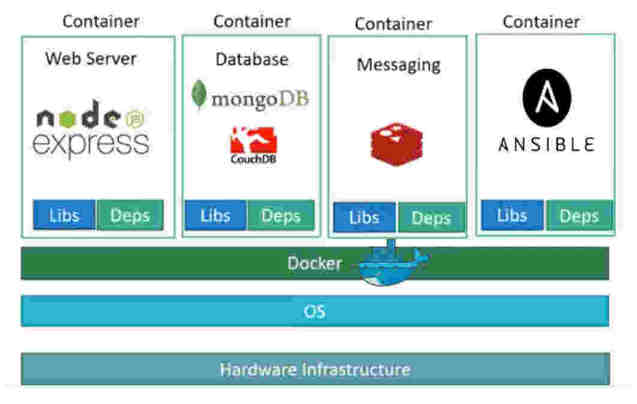
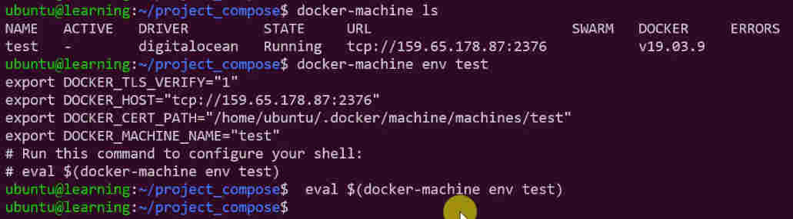
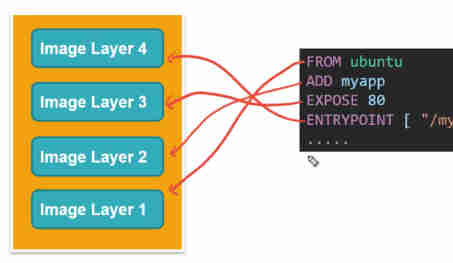
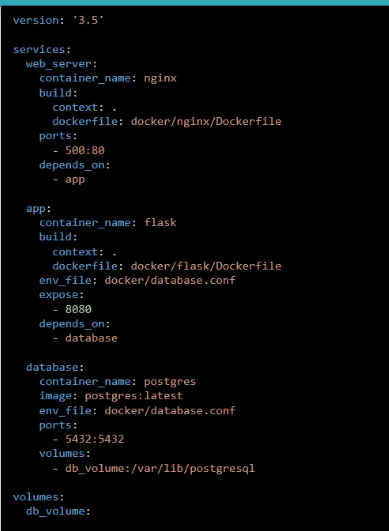

<div dir="rtl">

# 1.Concept

**ایمیج**:

* نسخه برنامه یا سرویس یا سیستم‌عامل یا هرچیزی که برپایه داکر ارائه شده است و کانتینرها بر پایه آن به اجرا درخواهند آمد
* شامل تمامی مواردی که یک اپلیکیشن برای اجرا نیاز دارد شامل :[PieceOfOS] [ThirdPartyLibraries] [ApplicationsFiles] [EnvironmentsVariables]

**کانتینر**:

* یک پردازه از اجرای یک دستور بر پایه یک ایمیج است که هرگاه دستور تمام شود آنگاه کانتینر ازبین می‌رود
* محیط‌های ایزوله که برنامه ها و پردازه‌های مستقل بخود را دارند و همه ازیک کرنل و سیستم عامل برای اجرا استفاده می‌کنند
* از نگاه سیستم عامل کانتینر یک پروسس هست
* وقتی یک ایمیج آماده باشد می‌توانیم کانتینر را روی آن اجرا نماییم


* EnginDocker:سروری که در روی آن داکر نصب شده است
    * DockerDaemon: پروسه‌اصلی داکر که در بک گراند کار می‌کند و مدیریت شبکه داکر و کانتینرها و ایمیج‌ها و غیره
    * REST API: قابلیت ارتباط برنامه‌ها با کانتینرها در بستر این سکو میسر است
    * Docker CLI: رابط فط فرمان

* cgroup یا ControlGroup: إعمال محدودیت برای کانتینرها جهت استفاده از منابع(گروهی برای محدود کردن منابع)
    * docker run--cpu=1.5 ImageName
    * docker run --memory=100m imageName

**نکات:**

* داکرهاست: همان سیستم عامل خودمان است که برنامه داکر در آن نصب شده است
* داکرهاب: مسیر hub.docker.com در مرورگر که درآنجا official image های زیادی وجود دارد و می‌توان آن را دانلود کرد و استفاده کرد
* اجاره میدهد تا نرم‌افزارهای بر پایه معماری Micro Service ایجاد نماییم و هر کدام از ماژول‌ها مستقل عمل کرده و توسط داکر راه‌اندازی شوند
* قابلیت اجرای ایمیج یک سیستم‌عامل با کرنل متفاوت(ویندوز و مک) بر روی سیستم لوکال(داکرهاست) لینوکسی وجود ندارد(در سیستم‌عامل لینوکس نمی‌توان ایمیج ویندوزی اجرا کرد)
* برنامه kitematics رابط گرافیکی داکر است که در ویندوز نصب می‌شود
* نام hostname های کانتینرهای داکر همان DockerId است
* داکر با زبان go نوشته شده است



# 2.Network

آی پی در کانتیرها تفاوت می‌کند و هربار آی پی ممکن است تغییر کند پس اگر بخواهیم با یک کانتینر ارتباط بگیریم توصیه می‌شود که از نام استفاده نماییم تغییرات آی پی سبب بروز اشکال نشود

* Bridge:  پورت باز بصورت مجازی به کانتینر اختصاص داشته و برای هاست اصلی و دیگر کانتینرها اعمال نمی‌شود
    * docker run myImage
* None
    * docker run myImage --network=none
* Host: پورت باز دقیقا روی هاست فیزیکی باز می‌شود و در سرور فیزیکی درحال لیستِن می باشد
    * docker run myImage --network=host

<div dir="ltr">

* [ls]: List networks
    * docker network ls
* [connect]: Connect a container to a network
* [create]: Create a network
    * docker network create --driver bridge --subnet X.Y.W.Z/16 custom-isolated-network # Change subnet for some container
* [disconnect]: Disconnect a container from a network
* [inspect]: Display detailed information on one or more networks
    * docker network inspect bridge
* [prune]: Remove all unused networks
* [rm]: Remove one or more networks

</div>

# 3.Repository

نکته: عمل ارسال به ریپوزیتوری(پوش کردن) لایه لایه انجام می‌شود یعنی اگر تنها یک لایه تغییر نماید آنگاه تنها یک لایه ارسال می‌شود

* [login] #در خط فرمان به آی‌دی از قبل ساخته شده خودمان در سایت داکر هاب لاگین می‌کنیم
    * docker login #enter user and password
* [push]: ارسال ایمیج به داکرهاب
    * docker tag imagNameOrID [IdOnDockerHub]/[NewNameForVisibleOnDockerHub]
    * docker push [id]/[name]
* [pull]: دریافت ایمیج از داکر هاب
    * docker pull [NameOfImageOnDockerHub] #دانلود یک ایمیج داکر از روی داکرهاب
    * docker pull docker/whalesay #دانلود ایمیج مدنظر با حجم تقریبا۷۰مگابایت
        * docker run docker/whalesay cowsay salam # ایجاد یک کانتینر از ایمیج موردنظر و اجرای دستور و پس از اتمام دستور کانتینر از بین می‌رود

# 4.Deployment:

* مجموعه فرآیند و اقداماتی که سبب استقرار ماشین‌های داکر می‌شود و در دو حالت استقرار تکی و کلاستر(اورکستریشن) صورت می‌پذیرد
* در دو حالت استقرار بصورت تکی و بصورت کلاستر می‌باشد
* در حالت استقرار کلاستر(Orchestration) شامل ابزارهایی نظیر **dockerSwarm** یا **Kubernetes** می‌باشد
    * Docker Orchestration:فرآیند مدیریت و ایجاد هماهنگی چندین کانتینر داکر
    * فرآیند شامل استقرار، مقیاس‌گذاری، و مدیریت چرخه عمر کانتینرها در یک محیط توزیع‌شده و ...
* در حالت استقرار تکی(SingleHost) نیز شامل ابزارهایی نظیر **Terraform** یا **dockerMachine** یا **ApacheMesos** می‌باشد

## 4.1.✅ dockerMachine

* یکی ابزارهای نصب و مدیریت داکر درهاست‌های مجازی ریموت[می‌تواند لوکال باشد یا ریموت یا کلود]
* ابزارهای دیگر نظیر terraform هم هست که این کار را می‌کند
* با دستور docker-machine می‌توان در سرور ریموت کارهایی نظیر استارت و استاپ و بررسی سرویس بروزرسانی سرویس و تنظیمات داکر را انجام داد
* قابلیت اجرای دستور docker در هاست‌های ریموت می‌دهد
* در بستر اینترنت شرکت یا سایت digitalOcean و AWS که مخفف Amazon Web Services است ماشین مجازی ارائه می‌دهند
* در digitalOcean به ماشین مجازی droplet می‌گویند که حاوی رم و سی پی یو و جزییات دیگر است که هنگام ساخته شدن باید تعریف شود
* برای ارتباط گرفتن با شرکت های ارائه دهنده خدمات کلود(مثلا ماشین مجازی) توسط کامندلاین باید در چهار چوب API ارائه شده توسط این سایت‌ها اقدام نماییم و برای ارتباط حتما باید token ایجاد نماییم و توسط آن توکن دستورات را به شرکت میزبان ارائه دهنده ماشین مجازی کلود بدهیم(معمولا در منوی API دنبال ایجاد توکن ساختن بگردید)
* توسط دستور docker-machine می‌توان یک ماشین مجازی توسط کامند لاین در سایت دیجیتال اوشن ساخت که به اصطلاح می‌گویند ماشین مجازی provision می‌کنیم

<div dir="ltr">

* docker-machine --version #Current version is 19.03.9
* docker-machine rm machineName -f #حذف یک ماشین ساخته شده
* docker-machine create --driver digitalocean --digitalocean-access-token TokenID --digitalocean-image ubuntu-18-04-x64 --engine-install-url "https://release.rancher.com/install-docker/19.03.9.sh" ServerName
* docker-machine ls
* docker-machine ssh MachineName #اتصال به یوزر روت ماشین مجازی کلود موجود در دیجیتال اوشن
* docker-machine env MachineName #نمایش متغیرهای محلی ماشین مدنظر که اگر بخواهید به آن ماشین متصل بشوید باید آن را در سیستم خودتان تنظیم نمایید
    * با تنظیم متغیردستور داکر را اگر بزنید آن دستور گویی در سرور ریموت دارد انجام می‌شود
        * eval $(docker-machine env machineName) #بجای تنظیم تک تک متغیرها با دستورمقابل همه موارد خودکار لحاظ می‌شود ازین پس هر دستور بزنیم(مثلا دستور داکر ایمیج) در ریموت اجرا می‌شود
        * docker-compose -f docker-compose1.yaml build -d # مثلا بعد از زدن دستور بالا دستور جاری درریموت اجرا خواهد شد



</div>

## 4.2.✅ terraform

* ابزار متن‌باز برای مدیریت زیرساخت به عنوان کد.
* ابزارهای دیگر نظیر DockerMachine هم هست که این کار را می‌کند
* توسط HashiCorp توسعه یافته است
* این ابزار به کاربران اجازه می‌دهد تا زیرساخت‌های خود را با استفاده از یک زبان پیکربندی(declarative)تعریف کنند
* ابزاری برای automate کردن ریسورسها و زیرساخت‌ها
* ساپورت IAC که مخفف Infrastructure as Code است
* Terraform به عنوان یک ابزار IAC عمل می‌کند.
* با استفاده از Terraform، کاربران می‌توانند زیرساخت‌های خود را به صورت کد تعریف کرده و آن‌ها را به صورت خودکار مدیریت کنند.
* از زبان HCL (HashiCorp Configuration Language) برای تعریف زیرساخت‌ها استفاده می‌کند
* می‌تواند با ارائه‌دهندگان مختلف ابری (مانند AWS، Azure، Google Cloud) و همچنین منابع محلی کار کند.

## 4.3.✅ dockerSwarm

* فراهم سازی امکان مدیریت و استقرار کلاستر
* شرکت داکر برای استقرار این نسخه را توصیه می‌نماید زیرا ابزار Orchestration شرکت داکر است

## 4.4.✅ Kubernetes

* پیاده سازی شده توسط شرکت گوگل
* متن‌باز یا همان OpenSource
* استفاده گسترده‌ در صنعتIT
* امکانات پیشرفته‌تر نسبت به Docker Swarm

# 5.Dockerfile

* یک فایل متنی بر پایه سینتکس خاص که در آن دستورالعمل می‌نویسیم
* نام پیش‌فرض داکر فایل Dockerfile است که اگر فایل را به این نام ساختیم و اگر در آن مسیر باشیم خودکار این فایل شناخته می‌شود
* همواره برای داکرفایل یک دایرکتوری مستقل به خود قرار دهید
* همواره از داکر ایمیج های استیبل و Base اقدام به ساخت ایمیج جدید نمایید
* هر خط از داکر فایل بعنوان یک لایه ReadOnly روی ایمیج پایه قرار می‌گیرد و پس از اجرای دستور نمی‌توان آن دستور را دستکاری کرد
* پس از اتمام اجرای خط به خط دستورات داکر فایل و بالا آمدن کانتینر یک لایه Read/Write روی کانتینر بوجود می‌آید تا بتوانیم از این کانتینر استفاده کنیم و دستور بزنیم(البته اگر بخواهیم بش بگیریم)
* بهینه‌گی در داکرفایل:
    * هنگام بیلد مجدد یک ایمیج دستورات(لایه‌ها) cache می‌شوند تا نوبت بعدی زمان صرف نشود(مگر در بیلد مجدد دستور تغییرکند) پس حتی‌المقدور دستوراتی که ثابت است را در ابتدای داکرفایل بگذارید تا تغییر نکند
    * دستور کپی همواره سبب تغییر در لایه‌ها و مانع کش نمودن است پس حتی‌المقدور کپی را در لایه‌های انتهایی داکرفایل قرار دهید تا لایه‌های قبل بتواند از کش بهره‌مند گردد



## 5.1.🔎️Contents

یک داکر فایل شامل موارد زیر است

<div dir="ltr">

* FROM:تعیین ایمیج پایه که قرار است دستورات بر روی آن اجرا شود و باید اولین خط در داکرفایل باشد
    * FROM baseImage
    * FROM baseImage:tag
* WORKDIR[optional]: تغییر یک دایرکتوری که ازین به بعد در این مسیر قرار داشته باش
    * WORKDIR /Behrooz/salam
* RUN: Execute command inside shell(When build the image)
    * نکته۱:اجرای دستور جهت ایجاد یک ایمیج جدید(حین بیلد تا ایمیج پایه مد نظر تولید شود)
    * نکته۲:هر دستور مستقل از دیگری است و مسیر «پی‌دبلیو دی» هر دستور / است مگر اینکه توسط دستور «وُرک‌دایر» مسیررا تغییر بدهیم
    * نکته۳:دستور «سی‌اِم‌دی» برای زمانی است که ساخت ایمیج پایان یافته و قصد داریم دستور را در کانتینر ران شده اجرا می‌کنیم
    * RUN apt-get update && apt-get install -y curl
    * RUN mkdir -p /behrooz/salam
* CMD: Execute command in container
    * نکته۱:هنگامیکه ساخت ایمیج پایان یافته است سپس قصد اجرای دستور در ایمیج ساخته شده داریم تا هربار هنگام ران گرفتن کانتینر جدید(از ایمیج ساخته شده)، دستور موردنظر به اجرا درآید و در خط فرمان آن را ندهیم
        * دو دستور زیر یکسان هستند
            * docker run [imageName] npm start
            * docker run [imageName] #اگر «اِن‌پی‌اِم‌استارت» توسط دستور «سی‌‌اِم‌دی» در انتهای داکرفایل قرار داده شود
    * نکته۲: تنها یک دستور «سی‌اِم‌دی» می‌توان در هر داکرفایل اجرا کرد(معمولا لایه‌های آخر[دستورآخر] از داکر فایل) و اگر چندین «سی‌اِم‌دی» داشته باشیم تنها آخرین آن به اجرا درخواهد آمد
    * نکته۳یادآوری: کامند «ران»: دستوراتی بود برای ایجاد یک ایمیج جدید
    * Exec Form ► CMD [ "Command", "parameter", ... ] #از همان شل استفاده می‌کند و شل جدی ایجاد نمی‌کند و معمولا توصیه می‌شود که از این سینتکس استفاده شود
        * CMD [ "npm", "start" ]
    * shell form ► CMD Command parameter # در این حالت یک شل جدید اجرا در می‌آید و کامند داخل آن اجرا می‌گردد
        * CMD npm start ⇄ /bin/sh npm start
* ENTRYPOINT [ "executable" ]:  Configure the container to be run as an executable
    * similar to CMD Command
* COPY: کپی دیتا از سیستم اصلی لینوکس به یک کانتینر
    * اگر دایرکتوری مقصد موجود نباشد داکر خودش آن مسیر را می‌سازد
    * COPY [LocalMachine] [ContainerDir]
    * COPY /tmp/salam2 /salam2
    * COPY *package* /[DirectoryInDockerImages]
    * COPY . /[DirectoryInDockerImages]
    * COPY /home/FIles/Data/salam.txt /[DirectoryInDockerImages]
* ADD:
    * همانند کپی است با برخی ویژگی‌ها
    * مثلا از یک «یوآراِل»استفاده شود
    * یا فایل زیپ استفاده کنیم که خودکار آنزیپ کند
* \# : قرار دادن کامنت
* ENV: Create a new EnviromnebtVariable
    * ENV Key=Value
    * ENV API_URL=https://myapi.api.com/
    * ENV APP_PORT=8000
* [EXPOSE port]: Define the network port[s] that this container will listen on at runtime
    * تقریبا بابت داکیومنت کردن این رو می‌گذاریم که بگوییم این کانینترروی پورت فلان باید لیسن کند ولی باید هنگام ران کردن عمل مپ کردن پورت صورت بگیرد
    * اگر از داکر کامپوز استفاده شود این خط کاربرد دارد
    * EXPOSE 8080
    * EXPOSE 80 443 22
    * EXPOSE 7000-8000
* USER: The user name to use درداخل کانتینر از این خط به بعد دستورات توسط کدام یوزر انجام شود
    * یوزر پیش‌فرض روت است
    * USER user #منوط به این است که نام یوزر در کانتینر موجود باشد
        * RUN addgroup user && adduser -S -G user user # ایجاد یوزر اگر یوزر موجود نبود
* MAINTAINER: نام سازنده و اطلاعات
    * MAINTAINER "behroozmn@chmail.ir"

## 5.2.💡️Example

```dockerfile
1-CreateDockerFile
   FROM python:3.9-alpine3.13
   RUN pip install flask
   CMD [ "python" , "app2.py" ]
   COPY app2.py /app2.py
2.BuildImage
   sudo docker image build -t <NewNameForNewImage> .
3.Run
   sudo docker run -p 5001:5000 <name>
```

</div>

# 6.DockerCompose

* اگر بخواهیم چندین سرویس همزمان در یک ایمیج قرار داده شود تا این سرویس‌ها یکدیگر را ببینند
* باید docker-compose جداگانه نصب شود و پس از نصب می‌توان دستور docker-compose --version از صحت نصب مطلع شویم
* برای اجرای داکر کامپوز باید به مسیری برویم که فایل YML در آن موجود است
* فایل داکر کامپوز :‌همه کارها را به داکر کامپوز میدهیم و خودکار همه چیز بالا می‌آید و کاربر نقشی نخواهد داشت
* فایل باید با پسوند yml یا yaml باشد و حروف کوچک باشد
* برای هر سرویس باید داکر فایل مستقل داشت(ایمیج مستقل که در داکر فایل مختص همان سرویس مورد استفاده قرار بگیرد. یعنی دانلود کنیم یا خود داکر توسط کامپوزر دانلود نماید)
*

<div dir="ltr">


**docker-compos COMMAND**

* [up]: create and start containers اگر ایمیج نباشد میرود و دانلود میکند و اگر موجود باشد آن را استارت و دستورات را اجرا میکند
    * docker-compose up
* [--build]: Build images before starting containers
* [-d]: اجرا کردن در وضعیت بک گراند
* [down]: Stop and remove containers
* [build]: Build or rebuild services
* [--no-cache]: Do not use cache when building the image
    * docker-compose build --no-cache
* [--pull]: Always attempt to pull a newer version of the image
* [-f]:‌تعیین فایل داکرکامپوز
    * docker-compose -f docker-compose1.yaml build -d
    * docker-compose -f docker-compose1.yaml up -d --build
* [ps]: List containers
    * docker-compose ps

</div>

## 6.1.🔎️Contents

یک داکر کامپوز شامل موارد زیر است

* اولین خط همواره باید ورژن باشد و عدد آن باید مطابق با ورژن «Docker Engine» باشد که مثلا در ورژن‌های داکر بالاتر از 19.03 می‌توان ورژن را ۳.۸ قرار داد
* هرکدام از سرویس‌ها یک سرور با آی‌پی مستقل خواهند بود یعنی اگر داخل هرکدام دیگری را پینگ کنیم پاسخ را خواهیم گرفت(دستور پینگ و نام هاست را نام سرویس می‌گذاریم یعین ping web)

<div dir="ltr">

* version: # اولین خط همیشه باید تعیین ورژن باشد
    * ورژن رو باید با توجه به نسخه داکر هاست تعیین کنین که در سایت داکر نیز آمده است
* services: هرکدام از سرویس‌های دلخواه که بخواهیم بالا بیاوریم
* serviceName: هر نام دلخواه می‌توان قرار داد
    * در مثال زیر کلمه دلخواه «وِب» برای «فرانت‌اِند» انتخاب کردیم و «اِی‌پی‌آی» برای «بَک‌اِند» و کلمه دلخواه «دی‌بی» برای دیتابیس است
* build: تعیین مسیر داکرفایل مختص سرویس برای بیلد کردن
* context:‌وقتی بخواهیم در بیلد یک داکر فایل خاص استفاده نماییم باید مسیر را توسط این عبارت به همراه کلیدواژه «داکرفایل»با مقدار «نام فایل» مشخص نماییم
* image: استفاده از ایمیج خاص و عدم بیلد کردن و استفاده از کانتینر
* environment #تعریف متغیرهای محلی در ایمیج
*
    - DB_URL=mongodb://db/mydb #هردو شکل صحیح است
* DB_URL: mongodb://db/mydb
* volumes #اتصال مسیر خاصی از سیستم لینوکس اصلی به کانتینر
* `- ./DireName:/app` #در مسیر کنونی با نام خاص را به مسیر «اَپ» در درون کانتینر متصل می‌کند
* command: اجرای یک دستور در کانتینر
    * میتوان همه کارها را درون یک شل ایجاد کرد و فقط به دستور بگوییم آن شل را اجرا بکند
* restart #وقتی یک کانتینر کرش می‌کند چه اتفاقی رخ دهد
    * always: همواره هنگام کرش کردن ریست کند
    * no: هنگام کرش کردن ریست نکند
    * unless-stopped: ریست هنگام استاپ کردن سرویس

## 6.2.💡️Example

```dockerfile
[docker composer-yaml]
version: "3.8"
services:
    web:
        build:
            context: ./frontend
            dockerfile: Dockerfile.prod
        ports:a
            - 3000:3001
    api:
        build:./backend
        ports:
            -  3001:3001
        environment:
            - DB_URL2=mongodb://db/mydb
        volumes:
            - ./DireName:/app
        command: ./MyScript.sh
    db:
        image: mongo:4.0-xenial
        ports:
            - 27017:27017
        volumes:
            - mydb:/data/db
volumes:
    mydb:
```


</div>

# 7.dockerignore

* فایل sockerignore که شروع آن با یک نقطه است(برای شناساندن به سیستم‌عامل‌ها که این فایل از نوع مخفی است) برای نادیده گرفتن فایل‌ها و دایرکتوری‌ها می‌باشد.
* مثال: هنگام کپی تمام محتوی یک دایرکتوری که ذیل آن یک دایرکتوری ignore شده وجود دارد، دراین حالت پوشه ignore شده کپی نمی‌شود

```shell
Diretory/ #نادیده گرفتن یک دایرکتوری
```

# 8.COMMANDs

## 📍️docker run

* اجرای یک دستور بر پایه یک ایمیج که سبب تولید یک کانتینر می‌شود و هرگاه دستور تمام شود آنگاه کانتینر ازبین می‌رود
* نکته۱:کانتینرها درواقع پروسس هستند که در قالب ایمیج ایجاد می‌شوند و پس از اجرا تمام و از بین می‌روند
* نکته۲: هر ایمیج که توسط دستور run سبب ایجاد یک کانتینر می‌شود یک کاری را باید انجام دهد. هنگامی که دستور مورد نظر برای آن ایمیج تمام شد بصورت خودکار از بین می‌روند
* نکته۳: اگر دستور ران شده سبب باز کردن پورت و ارائه سرویس باشد آنگاه آن کانتینر همچنان دردسترس است و در دستور docker ps آن ایمیج نمایش داده می‌شود که در حال ران است. اگر سرویس مد نظر crash کند آنگاه کانتینر از بین می‌رود
* نکته۴: وظیفه کانتینرها این نیست که بیایند و یک سیستم عامل بر پایه ایمیج ایجاد نمایند
* نکته۵(خیلی‌مهم): وظیفه‌ی کانتینرها اجرای «دستور» یا «جاب» یا «محاسبه» یا ا«جرای‌یک‌پردازه» و از این قبیل است و هنگامی که پردازش آنها تمام شد، بطور خودکار از بین می‌شوند
* نکته۶: به ازای هر کانتینر که برای اجرای یک دستور خاص توسط «داکر ران» ایجاد می‌شود یک محیط ایزوله و مستقل است و درصورت اجرای مجدد همان دستور یک کانتینر در محیط ایزوله و مستقل و با آی‌دی دیگر برایش ایجاد خواهد شد
* HotFix: همزمان که در سیستم خودتان درحال اصلاح کد هستید این تغییرات در داخل کانتینر هم لحاظ بشود. اگر چه این فایل‌ها در لایه readonlyداکر فایل(در وضعیت غیرقابل تغییر) قرار گرفته باشد

<div dir="ltr">

* [docker run]: Run a command in a new container
    * Docker run [ImageName] [Commands]#
    * docker run ubuntu # ایمیج اوبونتو مورد استفاده قرار می‌گیرد تا یک دستور را اجرا نماید و چون در این دستور آرگومانی که کامند را مشخص کند ندادیم پس کاری انجام نمی‌دهد و خودکار بسته می‌شود
    * docker run ubuntu sleep ۱۰ #به کانتینر اوبونتو می‌گوید که دستور توقف زمانی۱۰ثانه را در بش اجرا کن و پس ازاتمام کانتینر را از بین ببر یعنی اگر در مدت ۱۰ثانیه در ترمینال دیگر دستور «داکر پی‌‌اِس» را بزنیم کانتینر را خواهیم دید
    * docker run mongodb #جستجو در ایمیح‌های داکرهاست(سیستم‌لوکال) و درصورت عدم وجود، جستجو در ریپوزیتوری پیش‌فرض(داکرهاب) و سپس دانلود و نهایتا استفاده از آن
    * docker run -it node:16.5.0-alpine3.14 #ورود به کنسول ریَکت
    * docker run -it node:16.5.0-alpine3.14 sh #ورود به شل ایمیج
* [-it]: abbrivationOf Interactive اجازه استفاده مستقیم به ایمیج می‌دهد
    * docker run -it ubuntu bash #خط فرمان بش داخل ایمیج را در بصورت اینتراکتیو در اختیار کاربر قرار میدهد و صفحه ترمینال سیستم‌عامل لوکال به بش داخل ایمیج تغییر می‌کند
* [-p <portOnLocalHost>:<portOnImage>] #مَپ کردن پورت داخلی یک ایمیج روی سیستم لوکال
    * docker run -p 5001:5000  [نام‌ایمیج] #پورت۵۰۰۱ سرور اصلی(فیزیکی) را به ۵۰۰۰ ایمیج(کانتینر) وصل می‌کند
    * نکته(بهروز باید بعدا بررسی کند): این سوییچ باید بعد از دستور سوییچ دی اجرا شود
* [-d]: اجرای ایمیج در بک‌گراند
    * docker run -d [Image]   # یک کانینر را در بک‌گراند بالا می‌آورد و هش آن را نمایش می‌دهد
    * docker run -d --name نام‌برای‌کانتینر ImageName
* [-e]: define a new EnvironmentVariable
* [-H]:ریموت روی سرور داکر در آی‌پی خاص و اجرای دستور
    * Docker -H=RemoteIP:2222 Command
    * docker -H=10.10.0.10:2222 run ImageName
* [-u userName]: تعیین نام یوزر برای اجرای دستور
    * docker run -it -u root face4 sh
* [--name NAME]: دادن نام خاص به کانتینر
* [-v VolumeName:DirectoryOnContainer]
    * docker rin -d -p 3001:3000 -v myShareVolume:/Dire1/subdir imageName
    * نکته:اگر از قبل توسط دستور داکر والیوم ایجاد نکرده باشیم، به محض قرار دادن نام جدید بعنوان والیوم آن را میسازد
    * نکته۲:مسیر داده شده در کانتینر که قرار است به والیوم متصل شود خودکار ایجاد می‌شود ونیاز به از قبل ساخته شدن نیست
* HotFix[توجه به توضیحات]
    * docker run ... -v DirOnLocal:DirOnContainer imageName
    * مثال۱: docker run -d -p 3001:3000 -v $(pwd):/app imageName

</div>

```shell
docker run -i -t Repo:Tag #run and go to bash of OS
docker run -i -t --name <NAME> <Repo:Tag> #run and go to bash of OS 
docker run -d --name <N> -v <VolumeName>:Path <Image>
docker run ---name  <N> -v BehroozData:/data/db -p 28001:27017 -d <Image>
docker run -d --name <N> -e APP_PORT=7070 -p 8081:7070 <Image>
docker  run --rm ..........  # run after kill after delete
```

## 📍️docker stop

```shell
docker stop Name #استاپ کردن یک کانتینر
docker stop [Hash | Name] # نکته۱: کانتینر رو از بین نمی‌برد بلکه استاپ میکند و بعدا با دستور استارت می‌توانیم از وضعیت استاپ خارج نماییم
docker container prune #  اگر کانتینرهای استاپ شده زیاد داریم با این دستور می‌توانیم آنها را از بین ببریم

```

## 📍️docker save

ذخیره یک ایمیج

```shell
docker save -o <Name>.tar.gz Repository:Tag
```

## 📍️docker exec

اجرای یک دستور جدید در یک کانتینر موجود که هم‌اکنون درحال اجرای دستور است

```shell
docker exec -it <NameContiner> <Commnads>
docker exec -it <NameContiner> /bin/bash
```

## 📍️docker cp

کپی اطلاعات کانتینر درحال اجرا برروی سیستم فیزیکی ولوکال خودمان و برعکس

```shell
docker cp <ContainerID>:fullFileName <localHostSystem> #کپی از کانتینر به سیستم
docker cp f39a65:/app/My_file.txt /home/user/Document
docker cp <localHostSystem> <ContainerID>:fullFileName #کپی از سیستم به کانتینر
```

## 📍️docker commit

ذخیره اطلاعات یک کانتینر و تبدیل به یک ایمیج

```shell
docker commit <ContainerID> <repository:[Tag]>
```

## 📍️docker volume

MountPoint:‌مسیری که در دستورinspect نمایش داده می‌شود و نشان می‌دهد که والیوم در کدام مسیر لینوکس اصلی قرار دارد

<div dir="ltr">

* docker volume COMMAND
* create: Create a volume
    * docker volume create myShareVolume #ایجاد یک والیوم جدید
* inspect: Display detailed information on one or more volumes
    * docker volume inspec myShareVolume #نمایش جزییات والیوم ساخته شده از قبل
* ls: List volumes
* prune: Remove unused local volumes
* rm: Remove one or more volumes
    * docker volume rm volumeName
* update: Update a volume (cluster volumes only)

</div>

## 📍️docker load

دریافت ورودی و یک ایمیج را در ایمیج های داکر لود میکند

```shell
docker load -i <PATH.tar.gz>
```

## 📍️docker rmi

```shell
docker rmi [<Container ID>|<NAME>]
```

## 📍️docekr ps

* نمایش کانینرهای درحال اجرای دستور در سیستم عامل کنونی را نشان می‌دهد که درحال اجرای چه دستوری است
* نکته۱:کانتینرها درواقع پروسس هستند که در قالب ایمیج اجرا می‌شوند و پس از اجرا تمام و از بین می‌روند

<div dir="ltr">

* [-a]: تاریخچه دستورات و وضعیت کانتینرهای فعال و غیرفعال
    * doccker ps -a
* [-q]
    * docker ps -a -q #show ContainerID of all containers

</div>

## 📍️docker build

* برای build کردن نیاز به یک داکرفایل است
* تمام Step های ران شده در build یک ایمج کش می‌شود تا در نوبت بعدی از این استفاده شود
* پس از اتمام بیلد بعنوان گزارش پارامتر Build context یک معیار خوب برای فهم کارایی ایمیج هست که حجم آن چقدر شده است
* در محیط عملیاتی هنگامی که بخواهیم یک ایمیج را ورژن بدهیم از تگ استفاده می‌کنیم که معمولاً عدد استفاده می‌شود(مدیریت نسخه‌ها) و برای اینکار باید در سوییچ«تی» که نام ایمیج را مشخص می‌کنیم سپس دو نقطه بگذاریم و شماره نسخه را بدهیم
*

<div dir="ltr">

* [-t]: تعیین نام برای ایمیج جدید حاصله از داکر فایل
    * نکته: اگر اسم داکرفایل را پیشفرض بگذاریم نیاز به تعیین نام نیست و نام پیش‌فرض Dockerfile است
    * docker build -t <ImageName> <Dir>
* [--no-cache=true|false]
    * docker build --no-cache=true -t <TagName> <Dir>

</div>

## 📍️docker Container

نکته: در توزیع لینوکس alpine دستور apt نداریم بلکه معادل آن apk است

<div dir="ltr">

* [ls] #مشاهده لیست کانیتنرهای درحال اجرا
* [-a]: تاریخچه اجرای دستورات در کانتینرها را میدهد
    * docker container ls -a
* [exec] : اجرای دستور در یک کانتینر موجود
    * docker container exec -it <ExistContainerID> bash
* [stop]: از بین بردن کانتینر در حال اجرا
    * docker container stop <ExistContainerID>
* [prune]: حذف کانتینرهای اضافی که مثلا لایه‌های آنها کش شده است
    * docker container prune #همواره ابتدا کانتینر رو هرس کنید و سپس ایمیج‌ها را هرس کنید
*

</div>

## 📍️docker docker-machin

```shell
docker-machine ls
docker-machine ssh default <Command>
docker-machine ip <ContainerName>
```

## 📍️docker volume

```shell
docker volume create --name Behrooz
docker volume ls
docker volume inspect behrooz
```

## 📍️docker history

```shell
docker history [ImageName] #نمایش تاریخچه دستورات
```

## 📍️docker inspect|info

```shell
docker info # show environments
docker inspect <CoutainerID|Name>
```

## 📍️docker logs

<div dir="ltr">

```shell
docker logs [ContainerID | NAME] #Fetch the logs of a container منظور خطوط خروجی دستورات داکر است اگر در حالت بک‌گراند اجرا بگیریم
```

* [--details] #Show extra details provided to logs
* [-f] or [--follow] : # Follow log output یعنی ته فایل رو باز می‌گذارد که خروجی جدید مشاهده شود
* [-n] or [--tail string] #Number of lines to show from the end of the logs (default "all")
    * docker logs ContainerName -n 5 #نمایش تعدا خط خروجی
* [-t]: نمایش تایم برای هر خط
    * docker logs -t -n 100 ImageName # نمایش صد خط از خروجی دستورات داکر به همراه نمایش تایم آن دستورات که به اجرا درآمده است

</div>

## 📍️docker image

* برای تولید یک ایمیج Custom باید ابتدا یک DockerFile ایجاد کنیم و دستورالعمل‌هایمان را داخل آن قرار دهیم. سپس داکر فایل را بیلد نماییم یعنی داکر فایل خط به خط خوانده شود و پس از اتمام آن خروجی حاصله را توسط دستور build به یک ایمیج تبدیل کنیم
* نکته: توزیع alpine یک توزیع بسیار سبک از لینوکس است که بجای دانلود ایمیج لینوکس با حجم زیاد بهتر است این را استفاده نمایید
* نکته۲: نمونه ایمیج‌های مفید و stable را می‌توان از مسیر URL استخراج کرد که ایمیج هر برنامه بصورت تفکیک شده موجود است
* نکته۳: وقتی یک ایمیج رو اکسپورت می‌کنیم و سپس در سیستم دوم ایمپورت می‌کنیم باید آی دی تغییر نکرده باشد

<div dir="ltr">

* [docker images]: نمایش ایمیج‌ها
    * docker images
* [ls]: list images [نمایش لیست ایمیج‌های داکرهاست(سیستم‌لوکال)خود]
* [build]
    * [-f] تعیین نام داکرفایل
    * [-t] نام ایمیج جدیدی که قرار است ساخته شود
        * docker image build -t [NewName] .
            * اگر دستور داکر ایمج رو بزنیم نام جدید را در ستور ریپوزیتوری مشاهده خواهیم کرد
* [rm]: حذف یک ایمیج و به تَبَع آن تمام کانتینرهای آن نیز پاک خواهند شد
    * [-f]: تمام کانتینرهای مشتق شده از ایمیج(مثلا در ریپوزیتوری) را نیز پاک کن
    * docker image rm <ImageID> #آی‌دی ایمیج را توسط دستر «داکر ایمیج» می‌توان استخراج کرد
* [prune]: (Remove unused images) هرس و حذف اضافات یا اصطلاحاً «کلین‌آپ» کردن
    * هرس کردن و حذف ایمیج‌های که با ایمیج اصلی ارتباط ندارند و اضافی یا خطرناک هستند مثل لایه‌های کش شده
    * مثلا مواردی که در دستور «لیست ایمیج‌ها»ستون ریپوزیتوری یا ستون تگ در آن عبارت «نان» درج شده است
    * docker image prune
* [rm]|[remove] : Remove one or more images
    * docker images rm
    * [-f]: اگر وابستگی بین ایمیج‌ها باشد خطا میدهد و باید از این سوییچ استفاده شود
* [tag]: Create a tag TARGET_IMAGE that refers to SOURCE_IMAGE
    * docker image tag ExistName:ExistTag newName:NewTag #ایجاد یک ایمیج جدید با نام و تگ جدید اما با هش کد مشابه
    * نکته: اگر نام موجود باشد «اُوِررایت» می‌شود
* [save]: ذخیره ایمیج در قالب فایل برای انتقال به سیستم دوم جهت استفاده مجدد
    * docker image save -o [outputFile] [imageName]
* [load]: Load an image from a tar archive or STDIN اگر بخواهیم دستی یه ایمیج رو به سیستم خود اضافه کنیم
    * docker image load -i [imageFile]

</div>
</div>


