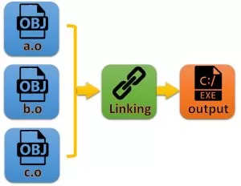
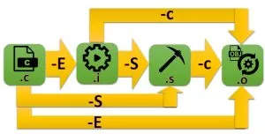

# Compile Proces steps

برنامه GCC یک برنامه نوشته شده به زبان C یا C++ را در ۴ مرحله اجرا می کند به عنوان مثال، `gcc -o hello.exe hello.c` به صورت زیر انجام می شود

# 1️⃣️:PreProcessing[پیش‌پردازش]

* فایل‌های پیش‌پردازش شده دارای پسوند “i.” هستند.
* مشمول کلیه خطوط در زبان C است که با علامت # شروع می‌شوند.
    * شامل [defineها که تعریف مقادیر ثابت است] و [Headerها]
* در فایل خروجی پیش‌پردازنده برای کامنت‌گذاری از علامت # همراه با یک عدد استفاده می‌شود
* در این مرحله مجموعه دستورات پیش‌پردازنده با مقادیر واقعی‌شان جایگزین می‌شوند.
    * فایلی که با پسوند i می‌باشد حاوی هیچ «include» یا «define» نیست و بجای هرکدام از «include»‌ یا «define» مقادیر محتوی آنها قرار گرفته است
    * دستورات پیش‌پردازنده با محتوایشان جایگزین شده‌اند و خود این دستورات یا کامنت شده یا حذف شده‌اند.
    * در این مرحله، عملکرد کامپایلر به‌صورت بازگشتی است.
        * یعنی ابتدا کتابخانه‌هایی که سورس کد به آنها نیاز دارد را می‌یابد، سپس کتابخانه‌هایی که کتابخانه‌های سورس کد به آنها نیاز دارد را می‌یابد
        * این کار را تا جایی ادامه می‌دهد که کتابخانه‌ای موردنیاز کتابخانه دیگر نباشد.
        * پس از یافتن آنها، از همان نقطه شروع ، اقدام به جایگزینی کتابخانه‌ها با محتوای آنها در کد می‌کند
* برای مقداردهی به ثابت‌های کد، می‌توان در هنگام کامپایل این مقادیر داده شود.[در قطعه کد FORM1 بجای تعریف مقدار A تحت عنوان «define» آن را در هنگام کامپایل مقدار دهید]

gcc -E [Name of Source Code] -o [Name of Output File]

* `gcc -E metech2.c -o PreProcessed.i`
* `cpp file.c > PreProcessedFile.i` #via the GNU C Preprocessor (cpp.exe)

```shell
//metech3.c Source Code
#include <stdio.h>
int main(){
printf("5 * 2 = %d", A);
}
```

`gcc -DA=100 metech3.c -o output`

# 2️⃣️:Compilling[کامپایل]

* در این مرحله کد پیش‌پردازش شده کامپایل می‌شود یعنی کد زبان C به یک کد اسمبلی تبدیل می‌شود
* زبان اسمبلی: یکی از زبان‌های سطح پایین محسوب می‌شود که در آن ما معمولاً مستقیماً با رجیسترهای پردازنده درگیر هستیم(عملیات ریاضی و منطقی از طریق کار روی رجیسترها)
* معمولاً فایل‌های تبدیل شده به فایل اسمبلی دارای پسوند “s.” هستند.


* gcc -S [Name of Source Code] -o [Name of Output file]

`gcc -S metech2.c -o assembled.s` # as -o hello.o hello.s → The assembler (as.exe) converts the assembly code into machine code

# 3️⃣️:CreatingObjectFile[تبدیل کداسمبلی به زبان‌ماشین]

# 4️⃣️:Linker[لینک‌کردن]


`ld -o hello.exe hello.o ...libraries...` #the linker (ld.exe) links the object code with the library code to produce an executable file hello.exe


# Commands

```shell
make install  #کپی فایل‌های کامپایل شده در مسیرهای درست
nm ObjectFile.so # مشاهده توابع داخل یک آبجکت فایل
```

# Images


<br>

<br>

<br>

<br>

<br>


