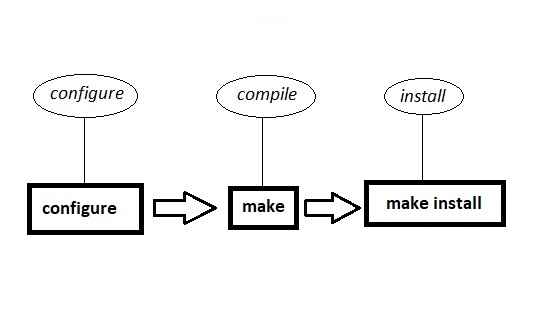

# Compile Proces steps


# 1️⃣️:PreProcessing[پیش‌پردازش]

# 2️⃣️:Compilling[کامپایل]


# 3️⃣️:CreatingObjectFile[تبدیل کداسمبلی به زبان‌ماشین]

# 4️⃣️:Linker[لینک‌کردن]


# Commands

```shell
make install  #کپی فایل‌های کامپایل شده در مسیرهای درست
nm ObjectFile.so # مشاهده توابع داخل یک آبجکت فایل
```


# Images


<br>

<br>

<br>

<br>

<br>


