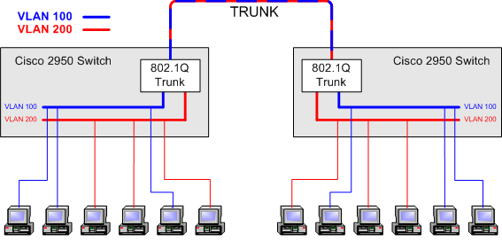
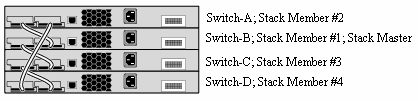
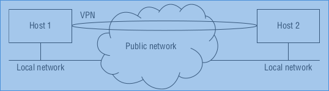
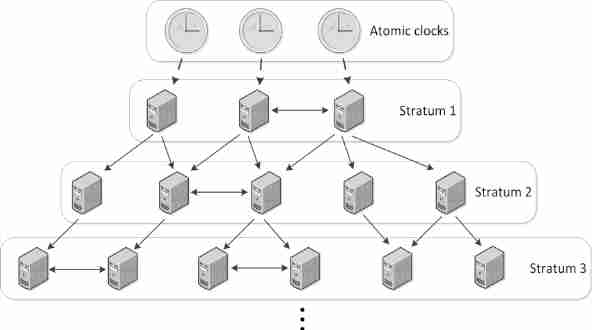
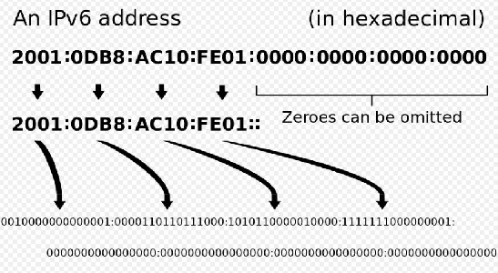

<div dir="rtl">

# 1. 🅰️ ConceptsAndProtocol

* شبکه تحویل محتوا یا CDN[ContentDeliveryNetwork]: بهینه‌سازی شبکه‌ جهت کاهش زمان تحویل محتوا به مصرف‌کننده علی رغم توزیع سرورها در نقاط جغرافیایی گوناگون
    * highly-distributed platform of servers that helps minimize delays in loading web page content by reducing the physical distance between the server and the user. This helps users around the world view the same high-quality content without slow loading times
* Delay: زمان سپری شده برای شروع(قبل از شروع عمل)
* Latency: زمان سپری شده جهت دریافت بازخورد یک بسته ارسال شده و به مقصد رسیده (پس از عمل)
    * در ذخیره‌ساز عدد ۱۰ میلی‌ثانیه مرز است و اگر بیشتر باشد کند و اگر کمتر باشد مطلوب است
* TTL(TimeToLeave)
    * یکی از پارامترهای پینگ که وقتی از هر روتر عبور کند یک عدد از ttl کاهش پیدا خواهد کرد
    * معمولا روترها از ۳۰ تا هاب بیشتر که ttl کم شود بسته شبکه را drop می‌کنندمقدار ttl در دیوایس‌ها متفاوت است:۱-دیوایس‌های اپن‌سورس 64 ۲-دیوایس‌های ماکروسافتی128 ۳-دیوایس‌های بر پایه سیسکو ۲۵۵ می‌باشند
* در لینوکس سوکت‌ها هم نوعی فایل هستند(در لینوکس همه چی فایل است)
* **Transparency**: استقلال مکان کاربر و مکان قرارگیری منابع، سرویس مورد نظر
    * کاربران از مکان‌های مختلف، به یک پوشه دسترسی داشته باشد در حالی که داده‌های موجود در پوشه در مکان های فیزیکی مجزا بر روی هارددیسک کامپیوترهای متفاوت بر روی شبکه قرار دارند و برای کاربران(هر مکانی) قابل لمس نمی‌باشد
    * The main benefit of location transparency is that it no longer matters where the resource is located.Depending on how the network is set, the user may be able to obtain files that reside on another computer connected to the particular network
* مفهوم Scale-Up(Vertical Scaling):افزودن منابع سخت‌افزاری قوی‌تر مثل رم یا پردازنده(خرید سرور جدید وقوی)
* مفهوم Scale-Out (Horizontal Scaling): افزودن سرورهای جدید به یک خوشه و افزایش ظرفیت Cluster از طریق شبکه
* NOC مخفف Network Opration Center است

# 2. 🅰️ARP

## 2.1. 🅱️ Commands

### 2.1.1. ✅️arp

* پروتکل arp: چه مک‌آدرس به چه آی‌پی متصل است
* بسته‌های پروتکل ARP از روتر عبور نمی‌کنند


* [-e]: display (all) hosts in default (Linux) style
    * `sudo arp -e`
* [-n|--numeric]:don't resolve names
    * `sudo arp -n`

### 2.1.2. ✅️arp-scan

```shell
arp-scan -I enp4s0 10.0.20.0/24
arp-scan --interface enp4s0 10.0.20.0/24
arp-scan --interface enp4s0 --localnet
```

# 3. 🅰️IP

* RG45
    * در بعضی از مدل‌های ارتقاءیافته آن سرعت 10Gb هم ارائه می‌دهد

## 3.1. 🅱️Bonding

* این قابلیت امکان مجتمع شدن چند کارت شبکه و استفاده از آنها به صورت یک کارت شبکه را فراهم می کند. نام دیگر آن NIC Teaming و Link Aggregate است. این روش دارای مدهای مختلفی است که عبارتند از:
* mode=0(balance-rr) – mode=1(active-backup) – mode=2(balance-xor) – mode=3(broadcast) – mode=4(802.3ad) – mode=5(balance-tlb) – mode=6(balance-alb)
* در مدهای ۰ و ۲ و ۳ و ۴ تمامی پورت ها یک گروه می بایست به یک logical switch متصل شوند اما در مدهای ۱ و ۵ و ۶ پورت های یک گروه می توانند به سوئیچ های مختلف متصل شوند. هر چند که می توان با aggregate کردن چند سوئیچ فیزیکال همه آنها را به یک logical switch تبدیل کرد.
* تمامی مدهای بالا در سه دسته کلی قرار می گیرند:
    * FailOver Only: تنها مد active-backup در این دسته قرار می گیرد. وقتی لینک اصلی fail شد لینک دوم جایگزین آن می شود.
    * Require Switch Support: مدهای balance-rr و ۸۰۲.۳ad و balance-xor هستند که باید سوئیچ نیز از آنها پشتیبانی نماید.
    * Generic Modes: در مد broadcast تمامی ترافیک از تمامی پورتهای عضو گروه خارج می شوند. در مد balance-tlb ترافیک خروجی load balance می شود اما ترافیک ورودی فقط از یک لینک می آید. در مد balance-alb نیز تمامی ترافیک ارسالی و دریافتی load balance می شود و از روش change MAC address استفاده می گردد.
* سخن آخر اینکه اگر شما در محیطی کار می کنید که سوئیچ ها از ۸۰۲.۳ad یا همان LACP پشتیبانی می کنند، بهترین روش همین مد است. اما اگر ساپورت سوئیچی ندارید و هم می خواهید load balance داشته باشید و هم fault tolerance بهترین روش balance-alb است. در نهایت اگر می خواهید فقط بین دو سرور replication داشته باشید، مد balance-rr برای شما بهتر است.

## 3.2. 🅱️Fiber Ethernet

همان سازوکار RG45 که به فیبر تبدیل شده است و با IP کارمیکند

* Fiber Ethernet Card
    * دو عدد چراغ LED دارد
    * ساپورت کننده پروتکل اترنت و نه «پروتکل اف‌سی»
    * Speed: 10G or 40G or 100G or 200G
    * Uniq Identify: IP
    * ماژول‌های SFP به کارت متصل و کابل به این ماژول‌ها متصل خواهند شد
    * کامندهایی که این مورد را پوشش می‌دهند
        * iftop
        * iptraf-ng
        * nload
        * tcpflow

## 3.3. 🅱️Commands

### 3.3.1. ✅️iperf

```shell
node1: iperf -s
node2: iperf -c <HOST>

#FromSobhanSadatNejad:
node1: iperf3 -s -i 1
node2: iperf3 -u -c 10.10.12.10 -w 1M -i 10 -t 60       
```

# 4. 🅰️ICMP

## 4.1. 🅱️Commands

### 4.1.1. ✅️fping

`fping -g 192.168.10.1 192.168.10.5 #alive hosts`

# 5. 🅰️DNS

## 5.1. 🅱️Command

### 5.1.1. ✅️dig

```shell
dig <name>
dig +short <Name>  #اطلاعات اضافه نشان نده و فقط آی‌پی را نمایش بده
```

### 5.1.2. ✅️nslookup

```shell
nslookup -querytype=mx domain.ir #پیدا کردن ایمیل‌سرور یک دامین
nslookup <name>
```

## 5.2. 🅱️Bind

Bind

- Top Level Domain یا TLD : سطح com یا ir یا net یا org در DNS
- First Level Domain یا FLD : نام itsee در دامنه itsee.ir
- ICANN: سازمانی که نام‌های DNS یعنی TLD یا FLD را مدیریت می‌کند
- DNSSec : پاسخ که از سرور میآید را sign میکند و من مطمئن میشوم که دقیقا از سرور مقصد آمده
- دستور named-checkzone یا named-checkconf : بررسی صحت اطلاعات موجود در فایل تنظیمات
- دیتا پس از resolve شدن کش می‌شود و نوبت بعدی خیلی سریع‌تر resolve پاسخ داده خواهد شد
- DNS Master: سروری که ادعا میکند صاحب یک زون است(یعنی خودم جواب را بلدم) و همچنین مواردی که بلد نیست را از Forward می‌پرسد
- در DNS در فایل zone مقدار TTL برحسب ثانیه است و میگوید این رکورد تا فلان ثانیه معتبر است
- در DNS در فایل zone در هر زون باید حداقل یک SOA یعنی Start Of Authority داشته باشند که معرفی اطلاعات است
- در DNS در فایل zone علامت @ به نام زون اشاره دارد که نمی‌خواهد هردفعه نام آن را تکرار کند- در DNS در فایل zone عبارت یعد از SOA نام دامنه و عبارت بعدی آدرس ایمیل به شکل بدون @ آورده می‌شود که یجای نقطه علامت @ می‌گذاریم
- در DNS در فایل zone هر بار که این فایل را تغییر بدهیم باید عدد serial را یک عدد بالاتر ببریم تا DNS آن را لود نماید
- در DNS در فایل zone کلمه cname یک alias است که موضوع www زدن یا نزدن را handle میکند


# 6. 🅰️Switch

* سوییچ لایه۲هست(مفاهیم مک و جدولarp)
* با گذر ایام، سوییچ در لایه۳ورود کرد(مفاهیم روتینگ) و آی‌پی
* VLAN: در VLAN گویی یک سوییچ‌کامل را دو تکه می‌کنیم
* TrunkPort
    * پورت ترانک بین دو سوییچ معنی پیدا می‌کند
    * پورتی که وظیفه انتقال ترافیک بین VLAN ها در سوییچ را دارد
    * در دو سوییچ‌کامل‌ از وسط شکسته شده(۴تکه شبکه مجزا) این تکه شبکه‌ها از طریق پورت ترانکیت به هم وصل می‌شوند
* StackableSwitch:
* Port Group: یک مفهوم در مجازی‌سازی شبکه است که به مجموعه‌ای از پورت‌های شبکه مجازی اشاره دارد. این گروه به ماشین‌های مجازی (VMs) اجازه می‌دهد تا به یکدیگر و به شبکه‌های خارجی متصل شوند.



> StackableSwitch


# 7. 🅰️Router

* **RoutingTable**: اگر یک لینوکس روتر شد و تعدا کارت‌شبکه زیاد باشد پس لینوکس باید در خاطر خودش نگهداری نماید که برای ارسال بسته به هاست از چه اینترفیسی استفاده کرده است. بنابراین نیاز به یک routing table دارد تا نشان دهد که از کدام اینترفیس برای ارسال بسته به هاست استفاده کرده است
* **RIP(Router Information Protocol)**: لینوکس برای ساپورت کردن RoutingTable این پروتکل را ایجاد کرده است تا کارهای روت را انجام دهد. زمانی که یک بسته RIP رسید آنگاه لینوکس RoutingTable را بروزرسانی می‌کند. لینوکس از برنامه routed برای Listen کردن بسته‌های RIP و بروزرسانی جدول استفاده می‌کند

## 7.1. 🅱️LinuxRouter

* اگر پارامتر کرنلی System.Net.Route و net.ipv6.conf.all.forwarding برابر ۱ باشند و در iptables در chain بنام FORWARD قانون اضافه کردیم آنگاه لینوکس قابلیت روتر شدن پیدا خواهد کرد یعنی بسته‌ها را از یک اینترفیس به اینترفیس دیگر انتقال دهد
*

## 7.2. 🅱️COMMANDS

### 7.2.1. ✅️mtr

```shell
mtr google.com
mtr -n --report IP
```

### 7.2.2. ✅️traceroute

```shell
traceroute google.com
```

# 8. 🅰️Proxy

* سایت‌های زیر برای تست پروکسی مفید است
    * ifconfig.me
    * ping.eu

## 8.1. 🅱️OpenVPN

* یکی از روش‌های وی‌پی‌ان زدن است که باید اول بسته آن را نصب نماییم و پس از نصب دو فال در مسیر های etc/openvpn/server.conf و etc/openvpn/client.conf ایجاد می‌نماید که تنظیمات اصلی این فایل‌ها به شرح زیر است:[config]: استفاده از فایل برای نگهداری تنظیمات
    * [dev]: نام دیوایس مجازی که در دستور ifconfig نمایش داده خواهد شد
    * [nobind]: ساخت تونل بدون local network address یا پورت
    * [ifconfig]: تنظیم آی‌پی به مبدا و مقصد
    * [secret]: فایلی از تنظیمات رمزنگاری که در دو حالت می‌تواند باشد:
        1. Static key encryption: هم سرور و هم کلاینت از یک کلید رمزنگاری مشابه استفاده می‌کنند
        2. Public key encryption: هم سرور و هم کلاینت برای خودشان کلید عمومی و خصوصی تولید میکنند و از آن طریق متصل می‌شوند
* استفاده از روش Static key encryption در openVPN:
  ```shell
  openvpn—genkey—secret secret.key #run on server
  openvpn—genkey—secret secret.key #run on client
  
  vim server.conf
  dev tun
  ifconfig 192.168.1.10 10.0.1.1
  keepalive 10 60
  ping-timer-rem
  persist-tun
  persist-key
  secret secret.key
  
  sudo openvpn server.confsudo openvpn client.conf
  ```



## 8.2. 🅱️Tor

* از موارد مشابه تور می‌توان به proxychains4 و privoxy اشاره کرد که همانند torsocks در ابتدای دستورات قرار می‌دهیم.
* پورت پیش‌فرض تور 9050 است
* مسیر لاگ تور
    * `/etc/tor/torrc` تنظیمات تولید لاگ را از کامنت خارج نمایید
    * /var/log/tor/notices.log
    * /var/log/tor/debug.log
* [PythonCode: change Ip periodicatly](https://github.com/FDX100/Auto_Tor_IP_changer)
    * cd Auto_Tor_IP_changer
    * sudo apt-get install tor
    * sudo apt-get install privoxy
    * python3 autoTOR.py
* [url](https://pentestcore.com/tor-ip-change/)

```shell
kill -HUP `pidof tor` دریافت آی‌پی جدید برای تور
export http_proxy="socks4://localhost:9050" #اگر بخواهیم در یک شل که در سیستم tor نصب است تمام موارد را پروکسی کنیم
torsocks curl https://showip.net # Test Ip Adderess
```


## 8.3. 🅱️V2Ray

* پروتکل VPN است
* Header این پروتکل از نوع WebSocket است


# 9. 🅰️DHCP

* هنگامی که برنامه dhclient لیست سرورهای NTP را از DHCP می‌گیرد به‌صورت خودکار در فایل ntp.conf قرار میدهد. برای جلوگیری ازاین موضوع عبارت PEERNTP=no را در فایل /etc/sysconfig/network قرار دهید

# 10. 🅰️Samba

Directory Services

* LDAP، OpenLDAP و Active Directory همگی مربوط به سرویس‌های دایرکتوری (Directory Services) در شبکه هستند

## 10.1. 🅱️Concept

* Samba: سرویس لینوکسی و openSource برای پروتکل SMB که قابلیت هماهنگی سرورهای لینوکسی را با ویندوزی میسر می‌سازد تا این دو سرور متفاوت بتوانند از share یکدیگر استفاده نمایند
* به‌صورت سنتی از سه بخش اصلی(تحت عنوان daemon) تشکیل شده است۱-nmbd برای مدیریت NetBIOS ۲-smbd برای اشتراک فایل۳-webbindd برای authentication کاربران که مثلا بتواند بین اکتیو دایرکتوری و کاربران لینوکس ارتباط برقرار نماید
* توصیه میشود که ساعت سرور توسط سرویس ntp دقیق تنظیم شود تا با دیگر سرورها نظیر DomainController ها همسان باشد
* پروتکل SMB دارای سرویس smbd است که موجب اشتراک فایل می‌شود که تنظیمات آن در مسیر smb.conf موجود در مسیر etc/samba قرار دارد
* در فایل smb.conf حساسیت به حروف بزرگ و کوچک وجود ندارد و هرچیزی بعد از سمیکالون و علامت هشتک بعنوان کامنت تلقی خواهد شد
* قابلیت بررسی صحت تنظیمات فایل‌های تنظیماتی ازطریق دستور testparm وجود دارد
* بررسی صحت تنظیمات داخل smb.conf توسط دستور testparm صورت می‌گیرد
* CIFS مخفف CommonInternetFileSystem:پروتکلی که شرکت ماکروسافت در سال ۱۹۹۰ برای کار در نرم‌افزارهای خودش ایچاد کرد
* SMB: پروتکل پیشرفته شده CIFS هست
* SMB: ServiceMessageBlock
*

## 10.2. 🅱️Ports

* 53 [TCP,UDP]: Internal DNS only
* 88 [TCP,UDP]: Kerberos
* 135 [TCP]: End point resolution514
* 137 [TCP,UDP]: NetBIOS name service
* 138 [TCP,UDP]: NetBIOS datagram service
* 139 [TCP,UDP]: NetBIOS session service
* 389 [TCP,UDP]: Lightweight Directory Access Protocol(LDAP)
* 445 [TCP]: SMB over TCP
* 464 [TCP,UDP]: Kerberos kpasswd
* 636 TCP LDAP over SSL (LDAPS)
* 901 [TCP,UDP]: Samba Web Administration Tool (SWAT)
* 1024-5000 [TCP]: Dynamic RPC service ports
* 3268 [TCP]: Microsoft Global catalog
* 3269 [TCP]: Microsoft Global catalog over SSL
* 5353 [TCP,UDP]:Multicast DNS

```shell
systemctl status smb | grep PID # فهمیدن پورت‌های باز از طریق pid
ss -utlpn | grep <PIDnumber>    # فهمیدن پورت‌های باز از طریق pid
pdbedit -Lv #مشاهده جزئیات از یک یوزر در سامبا و درصورت نیاز می‌توان بخشی از تنظیمات آن را تغییر داد

#عمل mount کردن یک مسیر از سرور به یک مسیر از کلاینت(دستور زیر در کلاینت زده می‌شود). نکته کرنل باید cifs را بفهمد
mount -o username=<username>,noperm //192.168.56.102/<path> <mountPoint such as /mnt>
mount -t cifs -o username=<username>,noperm //192.168.56.102/<path> <mountPoint such as /mnt>
mount.cifs -o username=<username>,noperm //192.168.56.102/<path> <mountPoint such as /mnt>

# اتصال همیشگی یک مسیر از سرور به یک مسیر از کلاینت
/etc/fstab: //192.168.56.102/ssharea /home/Malcolm/csharea cifs credentials=/etc/samba/<Name such as behrooz>,noperm,uid=<User UUID with command: [pdbedit -L]> 0 0
cat /etc/samba/behrooz
username=<username>
password=<password>
```

* برای اشتراک فایل و کارهای ازین قبیل دستوراتی وجود دارد که شرح آن در زیر آورده شده است
    * [mount.cifs]: کار mount نمودن یک دیتای اشتراکی را در سمت کلاینت برعهده دارد
    * [net]: همانند دستور net در ویندوز کار مدیریت یک سرور سامبا(همچنین سرور ریموت) را برعهده دارد
    * [nmblookup]: جستجوی اطلاعات NetBIOS نظیر نام workgroup یا آی‌پی و دیگر موارد
    * [pdbedit]: مدیریت دیتابیس کاربران(هر کاربری) شامل ldapsam و smbpasswd و tdbsam
    * [rpcclient]: تعریف انگلیسی آن یعنی Executes Samba client Microsoft Remote Procedure Call functions
    * [smbcacls]: نمایش یا اصلاحaccessControlList فایل‌های به‌اشتراک گذاشته شده سامبا
    * [smbclient]: اتصال یا نمایش لیست فایل‌های به اشتراک گذاشته شده که وقتی به یک فولدر از سروری متصل می‌شویم آنگاه با دستورات همانند FTP می‌توانیم با فایل‌ها کارکنیم
    * [smbcontrol]: مدیریت دیمن(daemon) یا سرویس smbd
    * [smbmount]: اقدام mount یک دیتای اشتراکی سامبا بر روی کلاینت که جایگزین mount.cifs شده است
    * [smbpasswd]: مدیریت دیتابیس‌های smbpasswd یا tdbsam
    * [smbspool]: ارسال فایل به یک پرینتر اشتراکی سامبا
    * [smbstatus]: نمایش وضعیت اتصال سامبا سرور
    * [smbtar]: ایجاد یک بکاپ از استراک فایل‌های سامبا در یک regularFile یا tapeDevice همچنین عمل ریستور نمودن آن ها
    * [testparm]: بررسی سینکس فایل smb.conf
    * [wbinfo]: نمایش اظلاعات سرویس (دیمن) winbindd از سامبا

## 10.3. 🅱️PasswordSet

```shell
#می‌توانیم برای یک یوزر سیستمی (که خود صاحب پسورد سیستمی است) یک پسورد از نوع سامبا هم بدهیم پس یک کاربر جدید ایجاد می‌کنیم
adduser behrooz
passwd behrooz

#برای آن پسورد قرار می‌دهیم: [سوییچ a]: موجب می‌شود تا یوزر باید به فایلsmbpasswd هم اضافه بشود
smbpasswd -a behrooz # با این کار فایل /var/lib/samba/account_policy.tdb بصورت خودبخود آپدیت خواهد شد
pdbedit -Lv          #مشاهده جزئیات از یک یوزر در سامبا و درصورت نیاز می‌توان بخشی از تنظیمات آن را تغییر داد

```

## 10.4. 🅱️SecurityLevelMode

* این ویژگی توسط پارامتر security موجود در بخش global تنظیم می‌شود که نحوه authenticate نمودن کلاینت‌ها را تعیین می‌نماید که شامل موارد زیر می‌شود
    * ads:به سرور سامبا اجازه می‌دهد که به اکتیودایرکتوری متصل شود و authentication را از طریق Kerberos انجام دهد. در این حالت الزاما باید realm و password server در بخش [global] تنظیم شوند. وقتی تعداد کاربران بیشتر از ۲۵۰ باشد توصیه میشود
    * domain: همانند حالت user است با این تفاوت که authentication توسط یک domainController با پروتکل‌های قبل از ویندوز NT صورت می‌گیرد
    * server: همانند حالت user است با این تفاوت که authentication توسط سرور ریموت(سامبا سرور دیگر یا یک ویندوز NT سرور)انجام شود
    * share(منسوخ شده وکسی استفاده نمی‌کند): برای هر کدام از share ها پسورد جداگانه قرار دهیم
    * user: پسورد و نام کاربری در لاگین به سامبا سرور و هنگام استفاده از سرویس نیاز می‌باشد و این اطلاعات در دیتابیس tdbsam در سرور موجود است. (در ورژن‌های قبلی smbpasswd) زمانی توصیه می‌شود که کاربران بیشتر از ۲۵۰ نفر باشند

## 10.5. 🅱️UsernameMap

* این امکان وجود دارد که در یک سرور لینوکسی بگوییم اگر کاربری با نام x آمد آن را معادل کاربر y قرار بده

```shell
username map = </path/map-file-name such as [/etc/samba/username.map]> #برای اینکار باید خط زیر را در بخش global از فایل smb.conf قرار دهیم و آن را به یک فایل وصل میکنیم
server_username = client_username #به فرمت زیر باید فایل را کامل کنیم
cat /etc/samba/username.map #محتویات فایل را کامل میکنیم
[...]
rblum = RichardBlum
cbresnahan = ChristineBresnahan
kryan = "Kevin E Ryan"
gschwartz = GarySchwartz
[...]
```

## 10.6. 📁️ /etc/smb.conf

* خش‌های متفاوتی در smb.conf قابل تنظیم است از جمله:
* [global]:این بخش از فایل smb.conf شامل کانفگ‌های کلی و کاربردی در سطح سرویس smbd است
    * [workgroup] : تعریف workgroup یا Samba group که سرور به چه گروهی متعلق است و باید در کامپیوترهای هر دامنه یکسان باشد. این نام یک نام FQDN نیست
        * workgroup = FIREFLYGROUP
    * [server string]: توضیحات این سرور سامبا و قابلیت استفاده از برخی متغیرها(یعنی variable substitutions) وجود دارد
        * server string = Samba Server Version %v
    * [netbios name]: تعریف نام NetBIOS سرور samba. در یک شبکه مختلط از سیستم‌های ویندوزی و لینوکسی(mixed network environment) معمولا اگر شامل ویندوز نسخه قدیمی باشد لازم به تعریف می‌باشد
    * [realm]: تعیین محدوده قلمرو Kerberos که در آن محدوده سرور ActiveDirectory و SambaServer باهم مشارکت دارند
    * ۵-[interfaces]: سرویس در کدام کارت شبکه باشد. اگر تعریف نشود همه کارت‌های شبکه مورد استفاده قرار می‌گیرند
        * interfaces = enp0s*
    * [hosts allow]: سیستم‌هایی که می‌توانند به این سرویس دسترسی داشته باشند. می‌توان IP (جداسازی با ویرگول یا خط فاصله یا تب)یا subnet یا hostname تعیین کرد
        * hosts allow = 192.168.56.0/24
    * [hosts deny]: سیستم‌هایی که نمی‌توانند به این سرویس دسترسی داشته باشند. می‌توان IP (جداسازی با ویرگول یا خط فاصله یا تب)یا subnet یا hostname تعیین کرد
    * [disable netbios]: قابلیت پشتیبانی از NetBIOS به‌صورت پیش‌فرض no تعیین شده است. در صورت لزوم می توانید آن را روی بله تنظیم کنید تا پشتیبانی NetBIOS غیرفعال شود تا۱-دربرخی ازتوزیع‌ها از راه اندازی daemon nmbd جلوگیری شود۲-پنهان شدن قابلیت browse سرور سامبا در سیستم‌های ویندوزی
    * [smb ports]: سرور سامبا در چه پورت‌هایی برای ترافیک SMB اقدام به listen نماید
    * [wins support]: قابلیت استفاده از WINS یا Windows Internet Name Service در سامبا سرور که بصورت پیش‌فرض no تنظیم شده است
    * [log file]: قابلیت استفاده از برخی متغیرها(یعنی variable substitutions) در آن وجود دارد. قابلیت ایجاد logFile مجزا برای هر sambaClient وجود دارد
        * log file = /var/log/samba/log.%m
    * [log level]: سطح ایجاد لاگ را تعیین می‌کند که بصورت پیش‌فرض عدد 0 می‌باشد یعنی ایجاد لاگ خاموش باشد. برای استفاده می‌توانید ازعدد ۱ (خلاصه) تا ۱۰(مفصل) استفاده نمایید. معمولا آن را روی ۲ یا ۳ تنظیم می‌نمایند. همچین می‌توان برای هر سطح جداگانه تعیین نمود یعنی smb:3 یا auth:7
    * [max log size]: مقدار حداکثر لاگ برحسب کیلوبایت که بصورت پیش‌فرض عدد صفر به معنی بدون محدودیت قرار داده شده است
        * max log size = 50
    * [security]: تعیین SecurityLevelMode برای نحوه authenticate نمودن کلاینت‌ها که می‌تواند شامل این موارد باشد: user یا share(منسوخ شده وکسی استفاده نمی‌کند) یا server یا domain یا ads
        * security = user
    * [passdb backend]: تعیین دیتابیس اطلاعاتaccountها که بصورت پیش‌فرض مقدار آن روی tdbsam قرار داد شده است ولی مقادیر smbpasswd یا ldapsam هم می‌تواند باشد
    * passdb backend = tdbsam
    * [smb encrypt]: استفاده از رمزنگاری را مشخص می‌کند. مقادیر auto یا mandatory یا disabled می‌تواند باشد. می‌توان آن را بجای استفاده در بخش [global] در بخش [share-name] استفاده کرد
* [share-name]: مواردی که می‌خواهیم در سامبا به اشتراک گذاشته شود و شامل فایل یا فولدری است که می‌خواهیم آن را به اشتراک بگذاریم
    * عبارت داخل کروشه که در ابتدای تعریف هر مسیر وجود دارد را باید تغییر دهیم
    * [comment]: توضیحاتی پیرامون دیتای به اشتراک گذاشته شده که برای کلاینت در زمانی که می‌خواهد ببیند چه چیزی به اشتراک گذاشته شده است قابل رویت خواهد بود
    * [browseable]: (پیشفرض yes) دیتای اشتراک گذاشته شده در لیست نمایش داده شود یا اینکه فقط باید نام کامل را بداند و از طریق نام کامل دسترسی داشته باشد
    * [valid users]: تعیین کاربران یا گروه‌های مجاز برای دسترسی به سرویس. درصورت عدم تعیین شدن این پارامتر همه کاربران قابلیت دسترسی خواهند داشت.کاربران یا گروه‌ها با ویرگول جدا می‌شوند. نام گروه باید با کاراکتر @ شروع شود
    * [invalid users]: تعیین کاربران یا گروه‌های نامجاز برای دسترسی به سرویس. درصورت عدم تعیین شدن این پارامتر همه کاربران قابلیت دسترسی خواهند داشت.کاربران یا گروه‌ها با ویرگول جدا می‌شوند. نام گروه باید با کاراکتر @ شروع شود
    * [path]: محل دقیق دیتای به اشتراک گذاشته شده
    * [public]: (پیشفرض no یعنی نیاز به پسورد وجود دارد). تعیین پسورد برای دسترسی به دیتای به اشتراگ گذاشته شده.
    * [guest ok]: مترادف مورد [public] یا [guest only] می‌باشد
    * [guest only]: پیشفرضnoاست یعنی کاربران مهمان و دیگر اتصال‌ها مجاز هستند.تعیین می‌کند که آیا کاربران مهمان (guest) مجاز به اتصال می‌باشند یا خیر. نکته: اگر مورد public = no باشد نباید از guest only استفاده نماییم.
    * [group]: تعیین یک گروه پیش‌فرض برای اتصال کاربران که معمولا برای استفاده در اهداف پروژه‌ای مورد استفاده قرار می‌گیرد.
    * [force group] : مترادف مورد [group] می‌باشد۱۰-[writable]: اعطای دسترسی write به محتوی به اشتراک گذاشته شده که بصورت پیش‌فرض مقدار آن no است یعنی مجوز write بصورت پیش‌فرض داده نمی‌شود
    * [read only]: متضاد اعظای مجوز writable می‌باشد
    * [write list]: تعیین کاربران یا گروه‌هایی که مجوز read و write در دیتای به اشتراک‌گذاشته شده را دارند. بدون توجه به [writable]، به این کاربران اجازه نوشتن داده می شود و سینتکس نیز همانند [valid users] می‌باشد
* [homes]:
* [netlogin]: تنظیمات ضروری سرور سامبا وقتی که نقش domainController دارد (پاسخ به درخواست‌های auth)[printers]: اشتراک گذاری پرینتر
* [profiles]: تنظیمات roaming user profiles که یک کاربر تنظیمات خود را فارغ از اینکه در کجا لاگین میکند دریافت نماید(هرکجا لاگین نماید تنظیمات خود را حاضر داشته باشد
*

```shell
#============= Global Settings ===========================
#
[global]
workgroup = FIREFLYGROUP
server string = Samba Server Version %v
interfaces = enp0s*
hosts allow = 192.168.56.0/24
#
#----------------- Logging Options -----------------
#
log file = /var/log/samba/log.%m
max log size = 50
#
#------------- Standalone Server Options -------------
#
security = user
passdb backend = tdbsam
#
# [...]

#================== Share Definitions ====================
#
[ssharea]
comment = Server Share A
browseable = yes
path = /srv/ssharea
public = no
writable = yes
[...]
#
```

## 10.7. 🅱️smbclient

اتصال یا نمایش لیست فایل‌های به اشتراک گذاشته شده که وقتی به یک فولدر از سروری متصل می‌شویم آنگاه با دستورات همانند FTP می‌توانیم با فایل‌ها کارکنیم

* [-L]:لیست کردن داده‌های اشتراک گذاشته شده

```shell
smbclient -L //localhost -U <user> #مشاهده موارد به اشتراک گذاشته شده از یک سرور
smbclient //localhost/<PATH> -U <user> # اتصال به دیتای اشتراک گذاشته شده(share) و ادامه کار با فایل‌ها(دریافت وآپلود و غیره) همانند دستور اف تی پی خواهد بود
```

# 11. 🅰️SSH

## 11.1. 🅱️concepts

* نرم‌افزار termius نرم‌افزار ssh و scp و sftp و tunnel است که هم نسخه موبایلی و هم نسخه لینوکسی دارد و تخصصی در بحث ssh کار کرده است

```shell
ssh -t user@IP 'cd /usr/local/sbin; bash --login' # Login and execute command[such as cd]
scp [Server1Username]@[Server1_ip]:[Server1_Path] [Server2Username]@[Server2_ip]:[Server2_Path]
ssh -o StrictHostKeyChecking=no -l root ${peer}

```

## 11.2. 🅱️options

* -D: forward all traffic of service
* -f: fork
* -N: Non login
* -o: اعمال تنظیمات داخل فایل کانفیگ بعنوان آپشن در لحظه اتصال
    * ssh -o StrictHostKeyChecking=no user@10.10.10.10

## 11.3. 🅱️files

* sshd_config: فایل تنظیماتی سرویس «اس‌اس‌اچ» سرور(یعنی سرویس «اس‌اس‌اچ» سرور چه تنظماتی داشته باشد)
* ssh_config: فایل تنظیماتی کلاینتی «اس‌اس‌اچ»(یعنی در هنگام «اس‌اس‌اچ» به سرورهای متفاوت چه تنظیماتی داشته باشد)
* ~/.ssh/known_hosts: Contains a list of host keys for all hosts the user has logged into that are not already in the systemwide list of known host keys(fingerprint).
* ~/.ssh/authorized_keys: اگر کلید عمومی کسی رو در این فایل قرار بدهیم دیگر از او پسورد نمی‌گیرد و مستقیما لاگین می‌نماید
    * هر سروری که کلید عمومی آن در فایل authorized_keys موجود باشد می‌تواند بدون وارد کردن پسورد در سرور لاگین نماید
    * این فایل تنها باید توسط مالک خود قایلیت خواندن و نوشتن داشته باشد و نه دیگران
* /home/user/.ssh/id_rsa : حاوی کلید خصوصی است
* /home/user/.ssh/id_rsa.pub: حاوی کلید عمومی است

### 11.3.1. ✅️configuration

* PubkeyAuthentication: آیا احراز هویت با استفاده از کلید عمومی (Public Key Authentication) مجاز است یا خیر
    * yes: احراز هویت با کلید عمومی مجاز و سرور به کلیدهای عمومی کلاینت‌ها توجه می‌کند
    * no: احراز هویت با کلید عمومی غیرفعال می‌شود و کلاینت‌ها نمی‌توانند از روش احراز هویت با استفاده از کلید عمومی برای احراز هویت استفاده کنند
* ClientAliveCountMax: تعیین حداکثر تعداد پیام‌های alive با قابلیت بدون پاسخ ماندن از کلاینت و در غیر اینصورت قطع اتصال
* ClientAliveInterval(برحسب ثانیه):
    * تعیین مقدار زمان ارسال پیامalive به کلاینت و اگر کلاینت به این پیام‌ها پاسخ ندهد و زمان تعریف شده (که باClientAliveCountMaxتعیین می‌شود) بگذرد، سرور اتصال را قطع می‌کند
    * اگر ClientAliveIntervalبرابر60ثانیه وClientAliveCountMaxبرابر3باشد،سرور هر۶۰ثانیه یک بار پیام "alive" ارسال می‌کند و اگر کلاینت به 3 پیام متوالی پاسخ ندهد، سرور اتصال را قطع خواهد کرد
* ListenAddress: اگر چند کارت شبکه داشته باشیم با این مولفه تعیین می‌کنیم که از کدام آی پی (تنظیم شده روی کارت شبکه) «اس‌اس‌اچ» پذیفته شود
* PasswordAuthentication[sshd_config]:
    * no : فقط کسانی که کلید دارند می‌توانند لاگین نمایند
* AllowUsers: کاربران مجاز برای لاگین
* DenyUsers: کاربران غیر مجاز برای لاگین
* AllowGroups: گروه‌های مجاز لاگین
* DenyGroups: گروه‌های غیر غیرمجاز برای لاگین
* PermitRootLogin: آیا یوزر روت بتواند لاگین نماید یا خیر
* X11Forwarding: آیا رابط کاربری بتواند فوروارد شود
* AllowTcpForwarding: سرور بتواند پروتکل‌های تونل را بپذیرد
* LoginGraceTime: تعیین مدت زمان برای لاگین و احراز هویت یک کاربر به سیستم
    * defaults:2min
    * recommended:30s or 1m

## 11.4. 🅱️KEY

<div dir="rtl">

### 11.4.1. ✅️CreateKey(GolobalAndPrivate)

```shell
1-sudo apt-get install openssh-client
2-ssh-keygen -t rsa # ایجاد کلید عمومی و خصوصی برای اتصال بین سرورهایهس
  Enter file in which to save the key (/home/user/.ssh/id_rsa)
  Enter passphrase (empty for no passphrase) # can donot use passphrass
  Enter same passphrase again
3-check :
  Public Key: /home/user/.ssh/id_rsa.pub
  Private Key: /home/user/.ssh/id_rsa    
4-ssh-copy-id user@YourServerIPAddress
```

### 11.4.2. ✅️copy publicKey

* دستور زیر سبب افزودن محتوی فایل rsa_key.pub سیستم خویش در انتهای فایل authorized_keys سرور مقصد می‌شود و نیاز به کپی دستی نخواهد بود
* نکته مهم: اگر سوییچ StrictHostKeyChecking=no را همراه -o ‌قرار دهید اگر کلید میزبان ناشناخته باشد، SSH به طور خودکار آن را به فایل known_hosts اضافه می‌کند و اتصال برقرار می‌شود.

```shell
# روش اول
ssh-copy-id user@10.0.20.2 # [OR] ssh-copy-id  -i ~/.ssh/id_rsa.pub user@10.0.20.2
ssh -o StrictHostKeyChecking=no user@10.0.20.2 # [OR] ssh -o StrictHostKeyChecking=no -l user 10.0.20.2

# روش دوم
cat ~/.ssh/id_rsa.pub | ssh User@YourServerIPAddress "mkdir -p ~/.ssh && cat >> ~/.ssh/authorized_keys"
# [OR] scp /home/user/.ssh/id_rsa.pub user@YourServerIPAddress:/home/user/.ssh
```

</div>

## 11.5. 🅱️proxy

```shell
ssh -D <localPort> behrooz@<serverWithNet> #بَش مقصد نمایش داده میشود
ssh -D -N <localPort> behrooz@<serverWithNet> # بش مبدا همواره باز میماند و نمیتوان دستوری وارد کرد
ssh -f -D -N <localPort> behrooz@<serverWithNet> #بَش مبدا همچنان باقی است و دستورات درحالت فورک اجرا درآمده‌اند
```

### 11.5.1. ✅️[Trick1](https://serverfault.com/questions/456960/how-to-force-all-packets-go-through-ssh-tunnel)

* client network: 10.0.50.0/24
* remote network10.0.99.0/24
* Check sshd_config configuration option PermitTunnel controls whether the server supports this
* from 10.1.1.1 to 10.1.1.2, provided that the SSH server running on the gateway to the remote network, at 192.168.1.15, allows it.

```shell
#On the client:
ssh -f -w 0:1 192.168.1.15 true
ifconfig tun0 10.1.1.1 10.1.1.2 netmask 255.255.255.252
route add 10.0.99.0/24 10.1.1.2
#On the server:
ifconfig tun1 10.1.1.2 10.1.1.1 netmask 255.255.255.252
route add 10.0.50.0/24 10.1.1.1
```

### 11.5.2. ✅️Trick2-apt

در سیستم دارای اینترنت دستور زیر را بزنید

```shell
echo 'Acquire::http::proxy "socks5h://127.0.0.1:XXXX"; ' >> /etc/apt/apt.conf.d/behrooz
```

در سیستم بدون اینترنت دستور زیر را بزنید

```shell
[ssh -f -N -D XXXX behrooz@systemWithInternet] # or [ssh -N -D XXXX behrooz@systemWithInternet]
```

#### 11.5.2.1. ❇️Alternative

در سیستم بدون اینترنت دستور زیر را بزنید و در سیستم دارای اینترنت نیاز به زدن دستوری نیست

```shell
[ssh -f -N -D XXXX behrooz@systemWithInternet] # or [ssh -N -D XXXX behrooz@systemWithInternet]
[apt --option Acquire::HTTP::Proxy="socks5h://127.0.0.1:XXXX" update
```

### 11.5.3. ✅️Trick3-yum

در سیستم دارای اینترنت دستور زیر را بزنید

```shell
echo "proxy=socks5h://localhost:xxxx" >> /etc/yum.conf
```

در سیستم بدون اینترنت دستور زیر را بزنید

```shell
[ssh -f -N -D XXXX behrooz@systemWithInternet] # or [ssh -N -D XXXX behrooz@systemWithInternet]
```

## 11.6. 🅱️PortForward

### 11.6.1. ✅️PortForwarding-tunnel(Local)

* AllowTcpForwarding yes
* Gatewayports yes


### 11.6.2. ✅️PortForwarding-tunnel(Remote)

* AllowTcpForwarding yes
* Gatewayports yes


---


# 11. 🅰️SNMP

* برای تنظیم اطلاعات community باید فایل snmpd.conf اصلاح شود[فایل snmp.conf را دستکاری نکنید]
*

```shell
# 12. on server 10.0.20.7 set this config:
apt install snmp snmpd
sudo apt install snmp-mibs-downloader
sudo download-mibs
sudo vim /etc/snmp/snmpd.conf
# 13. add: agentaddress  10.0.20.7:161
systemctl restart snmpd
```

```shell
net-snmp-config --version
snmpd -V
```

* rocommunity public default -V systemonly #سبب محدود شدن تعداد رکوردهای مانیتور شده از حدود ۷هزارتا به ۳۰ عدد از موارد خیلی عمومی

# 12. 🅰️NFS(NetworkFileSystem)

* این نوع فایل سیستم مخصوص لینوکس هست
* ورژن۴: پسورد را ساپورت می‌کند


1. دایرکتوری‌های به اشتراک گذاری در این فایل نوشته می‌شود که فرمت آن به شکل زیر است
   ```shell
   cat /etc/export
   export_directory client-designation (directives)
   ```
    * export_directory: مسیر به‌اشتراک‌گذاری
    * client-designation: کاربران
    * directives: تنظیمات مثلا write یا read
2. همه daemonهای سرویس NFS یک نام alias دیگر دارند که قبل از نام هر قسمت rpc شروع می‌شود مثلا rpc.mountd که کارهای مونت را انجام می‌دهد
3. اگر بخواهیم در etc/hosts.allow یک سرور را همواره valid کنیم
   ```shell
   vi /etc/hosts.allow
   rpcbind: 192.168.56.101,192.168.56.106
   ```
4. برای استفاده از /etc/hosts.allow و etc/hosts.deny ابتدا باید ببینیم که سرویس rpcbindاز ماژول libwrap استفاده می‌کند یا خیر
   ```shell
   ldd /sbin/rpcbind | grep libwrap
   libwrap.so.0 => /lib64/libwrap.so.
   ```

* سمت سرور
    1. `systemctl start nfs rpcbind`
    2. `mkdir /srv/nfs_share_temp`
    3. `echo "Hello World" >> /srv/nfs_share_temp/file.dat`
    4. `exportfs 192.168.56.101:/srv/nfs_share_temp` #ایجاد یک اشتراک جدید
    5. `showmount -e` نمایش لیست export شده
       ```shell
       Export list for localhost.localdomain:
       /srv/nfs_share_temp 192.168.56.101
       ```
    6. -نمایش لیست export شده و منابع اشتراکی برای یک آی‌پی خاص
       ```shell
       showmount -e 127.0.0.1
       Export list for 127.0.0.1:
       /srv/nfs_share_temp 192.168.56.101
       ```
    7. نمایش لیست export شده با توضیحات اضافی
       ```shell
       exportfs -v
       /srv/nfs_share_temp 192.168.56.101(ro,wdelay,root_squash,no_subtree_check,sec=sys,ro,secure,root_squash,no_all_squash)
       ```
    8. `cat /var/lib/nfs/etab`
    9. کلاینت‌هایی که به صورت ریموت به سرور وصل شده‌اند
        * `cat /var/lib/nfs/rmtab`
    10. از اشتراک خارج کردن یک منبع به اشتراک گذاشته شده در سرور
        * `exportfs -u 192.168.56.101:/srv/nfs_share_temp`
* سمت کلاینت
    1. `mkdir /home/christine/NFSTemp`
    2. `showmount -e <ClientIP>`
        * چه دایرکتوری‌هایی برای آی‌پی کلاینت دسترس است(exportList برای یک آی‌پی خاص)
    3. `sudo mount.nfs -o vers=3 192.168.56.102:/srv/nfs_share_temp NFSTemp`
        * اجبار برای استفاده از ورژن۳
    4. `sudo umount.nfs NFSTemp`
        * با زدن این دستور درکلاینت منبع به اشتراک گذاشته شده سرور از مونت(در سیستم کلاینت) خارج می‌شود

## 12.1. 🅱️Debian8

```shell
1- sudo apt-get install nfs-kernel-server nfs-common (server & client)
2- sudo vim /etc/exports (server)
# 14. add :
/mnt/share <ip client>(rw,sync,no_subtree_check,no_root_squash)

3- sudo exportfs -ra (server)
4- sudo /etc/init.d/nfs-kernel-server restart (server)
5- sudo ufw allow from <ip client> to any port nfs (server)
6- sudo ufw allow from <ip server> to any port nfs (client)
7- sudo showmount -e <ip server> (client)
8- sudo mkdir /mnt/share (client)
9- sudo chown user:user /mnt/share (client)
10- sudo vim /etc/fstab (client)

# 15. add:
<ip server>:/mnt/share   /mnt/share      nfs     defaults        0       0

11- sudo /etc/init.d/nfs-common restart (client)
12- sudo /etc/init.d/nfs-kernel-server restart (client)
13- sudo mount -a
14- df -h
```

* برخی از تنظیمات بخش دوم دایرکتوری‌های فایل export موجود در etc تحت عناوین زیر می‌توانند باشند
    * [Single Host]: یک آی‌پی یا FQDN یا Hostname
    * [Netgroups]: نام یک گروه مثل group_name@
    * [Multiple systems]: مدل های wildcard نظیر * یا ? مثلا هر کسی از itsee.ir بیاید بتواند itsee.ir*
    * [IP networks]
* دستوراتی که در سرویس NFS به کار می‌آیند
    * [exportfs]: مدیریت و نمایش اطلاعات منابع اشتراک گذاشته شده و میتواند توسط دستور یک منبع جدید به فایل export اضافه نماید تا منبع اشتراک جدید ایجاد شود.[سوییچa: تمام کانفیگ‌های اشتراکی را به فایل etc/export قرار می‌دهد] و [سوییچi: نادیده گرفتن فایل و تنظیمات موجود در etc/export و استفاده از آپشن‌های commandLine برای منابع به اشتراک گذاشته شده] و [سوییچ: ] و [سوییچr: یعنی reExport کردن و مجدد ساختن کانفیگ‌ها فایل etc/export برحسب فایلetc/lib/nfs/xtab در زمانی که فایل export را خراب کاری کرده باشیم ]
    * [mount.nfs]: زمان mount کردن می‌توانیم از این دستور بجای دستور mount خالی استفاده نماییم
    * [umount.nfs]: زمان umount کردن می‌توانیم از این دستور بجای دستور umount خالی استفاده نماییم
    * [mountstats]: از فایل /proc/self/mountstats به ارائه آمار کلی می‌پردازد
    * [nfsiostat]: از فایل /proc/self/mountstats به ارائه آمار IO می‌پردازد
    * [nfsstat]: توسط فایل‌های /proc/net/ و rpc/nfsd و /proc/net/rpc/nfs و /proc/mounts گزارشی از عملکرد سرور و کلاینت ‌های NFS ارائه می‌دهد
    * [rpcinfo]: اطلاعات RemoteProcedureCall سرویس
    * [showmount]: نمایش موارد مونت شده از nfs که می تواند بصورت ریموت استفاده شود
* برحی از تنظیمات بخش سوم دایرکتوری‌های فایل export موجود در etc تحت عناوین زیر می‌توانند باشند
    * [ro]: فقط خواندنی
    * [rw]: هم خواندن و هم نوشتن
    * [async]: بررسی نشود که آیا دیتای کش در دیسک نوشته شده است یا خیر
    * [sync]: درهربار نوشتن اول بافر در دیسک نوشته شود و پس از نوشته شدن به سراغ نوشته شدن بعدی برویم
    * [all_squash]: همه کلاینت‌ها با هر یوزری که به سرور nfs وصل شود، با دسترسی سطح anonymous یا nfsnobody وصل شوند .
    * [no_root_squash]: اگر یک کلاینت با username روت به سرور nfs وصل شود دسترسی به nfs Export با سطح دسترسی superUser داشته باشد
    * [root_squash]: یوزر روت هرکلاینتی اگر به سرور nfs وصل شود، با دسترسی سطح anonymous یا nfsnobody وصل شوند .
    * [anongid]: اختصاص یک GID به همه گروه‌های کلاینت‌های anonymous و زمانی استفاده می‌شود که بخواهیم همه کلاینت‌ها تحت عنوان یک گروه شناسایی شود
    * [anonuid]: اختصاص یک UID به همه کاربران anonymous و زمانی استفاده می‌شود که بخواهیم همه کلاینت‌ها تحت عنوان یک گروه شناسایی شود

# 8. 🅰️[NTP(Network Time Protocol)](https://docs.redhat.com/En/Documentation/Red_Hat_Enterprise_Linux/7/Html/System_Administrators_Guide/Ch-Configuring_Ntp_Using_Ntpd#S2-Ntpd_Useful-Websites)

* UTC(Coordinated Universal Time): زمان‌جهانی‌هماهنگ
* TSC(Time Stamp Counter) یک رجیستر ۶۴بیتی که از نسل پنتیوم به بعد درهمه «سی‌پی‌یو‌»های نسل «ایکس‌۸۶» قرار داده شده است. شمارش تعداد سیکل پردازنده را نگهداری‌میکند
* DTS: Daylight Saving Time #ساعت تابستانی
    * File `/etc/localtime` is a copy or symlink to, a zone information file from  `/usr/share/zoneinfo/Asia/Tehran`
    * `cp /usr/share/zoneinfo/Asia/Tehran /etc/localtime`
* GMT(Greenwich Mean Time): منطقه صفر زمانی که ساعت صفر را نشان می‌دهدکه تحت عنوان گرینویچ شناخته شده است
* RTC(RealTimeClock or Hardware Clock)
    * stores year,month,day,hour,minute,second. not able to store the UTC or DST or localTime
    * «hwclock» command is tool for manage the RTC
    * in opration system RTC may be in localtime or in UTC, as specified by the 3rd line of «/etc/adjtime» --> [LOCAL] or [UTC]
      ```shell
      cat /etc/adjtime:
      0.000000 1711454945 0.000000
      1711454945
      UTC
      ```


* ان تی پی در پورت ۱۲۳ تحت پروتکل udp کار میکند
* هنگامی که برنامه dhclient لیست سرورهای NTP را از DHCP می‌گیرد بصورت خودکار در فایل ntp.conf قرار میدهد. برای جلوگیری ازاین موضوع عبارت PEERNTP=no را در فایل /etc/sysconfig/network قرار دهید
* Stratum: سرورهای «ان‌تی‌پی» براساس فاصله همگام‌سازی آنها با ساعت‌های اتمی که منبع سرورهای «ان‌تی‌پی» هستند در ۱۵ لایه طبقه‌بندی می‌شوند
    * لایه‌بندی: هرچه این عدد کمتر باشد آن سرور مورد اعتمادتر است.
        * Stratum0: شمارش‌گر مختص ساعت‌های اتمی که هیچ بسته‌ای در اینترنت با شمارشگر صفر ارسال نمی‌شود.
            * سیگنال آن توسط gps یا سیگنال رادیویی یا گیرنده موبایل منتشر می‌شود. دریافت آن نیاز به دستگاه اختصاصی دارد
        * Stratum1: شمارشگر اولین لایه‌ که مخصوص سرورهای «ان‌تی‌پی» مرتبط با ساعت‌های اتمی است
            * هر کامپیوتری که به ساعت «رادیویی» یا ساعت «جی‌پی‌اس» یا ساعت «اتمی» مجهز باشد
        * Stratum2: هر سیستمی که از Stratum1 دیتا گرفته باشد
        * Stratum3: هر سیستمی که از Stratum2 دیتا گرفته باشد
        * ...
        * Stratum15: هر سیستمی که از Stratum14 دیتا گرفته باشد و پایین ترین سطح لایه‌بندی است.
        * Stratum16: یک اصطلاح رایج است به معنی این که سرور هم‌اکنون با یک سرور مورد اعتماد همگام سازی نشده است
* Drift File(فایل انحراف‌مقدار): ذخیره تفاوت فرکانس «ساعت سیستم» و «مورد نیاز برای هماهنگی با UTC»
    * استفاده ازاین فایل زمان مورد نیاز برای رسیدن به زمان پایدار را کاهش می‌دهد
    * هنگام روشن‌شدن سیستم در صورت وجود مقدار مغایرت، از فایل خوانده و محاسبه می‌شود و هر یک‌ساعت یکبار توسط سرویس عدد آن در فایل بروزرسانی می‌شود
* سرویس ntpdate(منسوخ شده): هدف از این سرویس تنظیم ساعت هنگام بوت شدن سیستم است تا دیگر برنامه‌ها با ساعت صحیح کار کنند
* همواره در نظر داشته باشید که روش کلاینت سرور دقت بالاتری از حالت broadCast دارد
    * در حالت broadCast کلاینت نمی داند چه مدت یک بسته قبل از دریافت بسته در شبکه در حال حرکت بوده است، بنابراین تأخیر انتشار را نمی توان به طور قابل اعتماد جبران کرد.
* نکته‌مهم: تغییر در تنظیمات سرویس «NTP» سبب بروزرسانی لحظه‌ای دستور فوق نمی‌گردد پس باید توسط دستور زیر سرویس را ریست نمایید
    * `systemctl restart systemd-timedated.service`

```shell
/etc/sysconfig/network #فایل تنظیماتی شبکه
# 16. add [PEERNTP=no] for not change NTP config from dhclient program(with dhcp server data)
```

## 8.2. 📁️ /etc/ntp.conf

* driftfile /var/lib/ntp/drift
* [pool | server]: عملکرد مشابه ولی استفاده از دستور پول ترجیح بر استفاده ازدستور سرور دارد
    * server 0.pool.ntp.org iburst
        * فقط یک بار در هنگام راه اندازی «دی‌ان‌اس» فعال شده و «آی‌پی» استخراج می‌گردد و همیشه این آی‌پی ملاک خواهد بود
        * سرور غیرقابل‌دسترس شده نیز همچنان ملاک قرار می‌گیرد
* pool pool.ntp.org iburst
    * سرورها را از منبع(استخر) مشخص شده به صورت پویا دریافت کند
    * هنگامی که سرورها غیرقابل دسترس می شوند، دور انداخته می شوند و سرور جدید به سرعت اضافه می‌شود
    * تنها زمان راه‌اندازی نام به آی‌پی تبدیل نمی‌شود و این عملکرد مستمر انجام می‌گیرد
* restrict IpAddress [mask Subnetmask] Options
    * restrict default nomodify notrap nopeer noquery
    * توضیحات
        * nomodify: جلوگیری از تغییر در پیکربندی
        * notrap: prevents ntpdc control message protocol traps.
        * nopeer: prevents a peer association being formed.
        * noquery: prevents ntpq and ntpdc queries, but not time queries, from being answered
            * کوئری‌های این دو دستور می‌توانند سبب هک و حمله گردند پس حتما این گزینه را در تنظیمات قرار دهید
        * ignore: All packets will be ignored, including ntpq and ntpdc queries.
        * kod: a "Kiss-o'-death" packet is to be sent to reduce unwanted queries.
        * lowpriotrap — traps set by matching hosts to be low priority.
        * noserve — deny all packets except ntpq and ntpdc queries.
        * notrust — deny packets that are not cryptographically authenticated.
        * ntpport — modify the match algorithm to only apply the restriction if the source port is the standard NTP UDP port 123.
        * version — deny packets that do not match the current NTP version
        * limited — do not respond to time service requests if the packet violates the rate limit default values or those specified by the discard command.
            * ntpq and ntpdc queries are not affected
    * توسط خط بالا تمام هاست‌های شبکه داخلی محدود می‌شوند و اگر بخواهیم هاستی را مجاز کنیم باید مشابه زیر اقدام نماییم
        * restrict 192.0.2.0 mask 255.255.255.0 nomodify notrap nopeer #تنها اجازه به محدوده آی‌پی خاص برای دریافت زمان و آمار‌های جانبی
        * restrict 192.0.2.250 #اجازه دسترسی نامحدود یک هاست خاص
        * restrict 192.0.2.250/32 #اجازه دسترسی نامحدو به محدوده آی پی
* peer address:
    * برای اضافه کردن سرور «ان‌تی‌پی» یکسان از لحاظ استراتوم
    * آدرس سیستم باید فقط بعنوان عضوی از همان لایه استراتوم شناخته شود
    * همه سرورهای همتا باید حداقل یک منبع زمانی داشته باشند که با یکدیگر متفاوت باشد
    * آدرس می‌تواند از نوع نام «دی‌اِن‌اِس» باشد
* server address
    * برای اضافه کردن سرور «ان‌تی‌پی» بالادستی از لحاظ استراتوم
    * آدرس سرور مرجع از راه دور یا ساعت مرجع محلی که بسته ها باید از آن دریافت شوند
    * آدرس می‌تواند از نوع نام «دی‌اِن‌اِس» باشد
* burst: بهبود کیفیت متوسط محاسبات زمان افست
    * server IP burst
    * از این گزینه در سرورهای «ان‌تی‌پی» عمومی استفاده نکنید(فقط برنامه‌‌های کاربردی درون‌سازمانی)
    * در هربار رجوع به سرور، هنگامیکه سرور پاسخ می‌دهد، سیستم به جای یک بسته معمول، حداکثر هشت بسته را ارسال می‌کند
* iburst: بهبود زمان صرف شده برای همگام سازی اولیه
    * server IP iburst
    * ارسال ۸ بسته بجای ارسال ۱ بسته معمولی در هنگام غیرقابل دسترس بودن سرور
    * بصورت پیش‌فرض در فایل تنظیماتی وجود دارد
* prefer : ترجیح اولیت برای یک سرور خاص نسبت به دیگر سرورها(
    * [server|peer] ip prefer #به انتهای این دو دستور باید اضافه گردد
* TTL: time to live
    * ttl value #تعیین مقدار پیش‌فرض برای این مولفه
    * معمولا مقدار پیش‌فرض آن عدد۱۲۷ می‌باشد
* logfile
    * logfile /var/log/ntp.log
    * logconfig =all #‌فاصله قبل علامت مساوی حتما باید وجود داشته باشد

[URL](https://docs.redhat.com/En/Documentation/Red_Hat_Enterprise_Linux/7/Html/System_Administrators_Guide/Ch-Configuring_Ntp_Using_Ntpd#s1-Understanding_the_ntpd_Configuration_File)



## 8.3. 🅱️ Commands

### 8.3.1. ✅️ ntpstat

```shell
user@GeneralServer:~$ ntpstat
synchronised to NTP server (194.225.150.25) at stratum 3
   time correct to within 96 ms
   polling server every 64 s
```

### 8.3.2. ✅️ ntpd

````shell
/usr/sbin/ntpd -n -q -N -p 10.10.10.2
# 17. در سرور استورکس با دستور زیر این سرور تایم را تنظیم میکرد
````

### 8.3.3. ✅️ ntpdc

```shell
ntpdc -c kerninfo #check the synchronization of the software clock with the hardware clock
```

### 8.3.4. ✅️ ntpq

```shell
ntpq [-p | --peer]
ntpq -pn
ntpq -c as
ntpq -c rv
ntpq -c 'rv 0 offset'
ntpq -c "rv 0" URL
ntpq -c "rv &1" #عدد یک اینجا به رکورد شماره اول در دستور «اِن‌تی‌پی‌کیو» با سوییچ «پی» اشاره دارد 
ntpq -c "cv &1"
ntpq -c as
```

* `ntpq -c as`
    * '*' : سیستم مورد نظر بعنوان مرجع سینک مد نظر قرار می‌گیرد
    * '+' : سیستم مورد نظر در تلورانس است و مقدار ارائه شده آن در الگوریتم ترکیب استفاده می‌شود. درصورت ازدست دادن سرور اصلی این سرور ممکن است جایگزن گردد
    * **Remote**: آدرس سرور
    * **Refid**: سرور مذکور از کجا دیتای خود را کسب کرده است
        * برای لایه استراتوم۱ معمولا «جی‌پی‌اس» یا «جی‌اِن‌اِس‌اِس» است
        * برای لایه‌های دیگر است آدرس سرور قید می‌شود
    * **stratum**:  فاصله همگام‌سازی آنها با ساعت‌های اتمی که منبع سرورهای «ان‌تی‌پی» هستند
        * Stratum0: شمارش‌گر مختص ساعت‌های اتمی که هیچ بسته‌ای در اینترنت با شمارشگر صفر ارسال نمی‌شود.
            * سیگنال آن توسط gps یا سیگنال رادیویی یا گیرنده موبایل منتشر می‌شود. دریافت آن نیاز به دستگاه اختصاصی دارد
        * Stratum1: شمارشگر اولین لایه‌ که مخصوص سرورهای «ان‌تی‌پی» مرتبط با ساعت‌های اتمی است
            * هر کامپیوتری که به ساعت «رادیویی» یا ساعت «جی‌پی‌اس» یا ساعت «اتمی» مجهز باشد
        * Stratum2: هر سیستمی که از Stratum1 دیتا گرفته باشد
        * Stratum3: هر سیستمی که از Stratum2 دیتا گرفته باشد
        * ...
        * Stratum15: هر سیستمی که از Stratum14 دیتا گرفته باشد و پایین ترین سطح لایه‌بندی است.
        * Stratum16: یک اصطلاح رایج است به معنی این که سرور هم‌اکنون با یک سرور مورد اعتماد همگام سازی نشده است
    * **Type**: نوع دسترسی به مرجع
        * [local] or [unicast] or [multicast] or [broadcast]
        * معمولا در وضعیت «یونیکست» می‌باشند
    * **When**: آخرین بسته برحسب ثانیه در چه زمانی رسیده است
        * وقتی مقدار به عدد ستون «پول» رسید آنگاه مجدد از سرور پرسش می‌کند
    * **Poll** – هر چند وقت یکبار از سرور برای زمان مورد نظر، پرسجو می شود.
        * به طور معمول، بین ۶۴ ثانیه تا 1024 ثانیه است
        * مقدار از توان ۲ می‌باشد و حداقل 16 ثانیه تا حداکثر 36 ساعت
    * **Reach**: میزان موفقیت و شکست برقراری ارتباط با سرور راه دور را نشان می دهد
        * (از راست به چپ)یک مقدار هشت بیتی شیفت به چپ
        * یعنی با هر بار موفقیت یا شکست عدد بعدی صفر یا یک قرار داده شود
        * بعد از هر پرسش موفق ۱، ۳، ۷، ۱۷، ۳۷, ۷۷, ۱۷۷, ۳۷۷ افزایش می یابد عدد ۳۷۷ بالاترین مقدار است
            * این اعداد در مبنای اُکتال می‌باشند
        * ABCDEFGH
            * A:اولین پرسش که می‌تواند یک(پرسش موفق) یا صفر(پرسش ناموفق) باشد
            * B:دومین پرسش که می‌تواند یک(پرسش موفق) یا صفر(پرسش ناموفق) باشد
            * C:سومین پرسش که می‌تواند یک(پرسش موفق) یا صفر(پرسش ناموفق) باشد
            * D:چهارمین پرسش که می‌تواند یک(پرسش موفق) یا صفر(پرسش ناموفق) باشد
            * E:پنجمین پرسش که می‌تواند یک(پرسش موفق) یا صفر(پرسش ناموفق) باشد
            * F:ششمین پرسش که می‌تواند یک(پرسش موفق) یا صفر(پرسش ناموفق) باشد
            * G:هفتمین پرسش که می‌تواند یک(پرسش موفق) یا صفر(پرسش ناموفق) باشد
            * H:هشتمین پرسش که می‌تواند یک(پرسش موفق) یا صفر(پرسش ناموفق) باشد
        * 11011101
            * یعنی همواره پرسش از سرور موفق بوده مگر در پرسش سوم وهفتم که عدد آن در اکتال می‌شود ۳۳۵
    * **Delay**: میانگین تاخیر بسته برحسب میلی‌ثانیه
        * این میانگین زمان لازم برای ارسال درخواست خواندن به منبع زمانی و دریافت پاسخ از آن منبع است
        * RTT همان مفهوم متناظر
    * **Offset**: ساعت شما چقدر از زمان گزارش شده‌ای که سرور به شما داده است فاصله دارد
        * برحسب میلی‌ثانیه و مقدار آن می‌تواند مثبت یا منفی باشد
    * **Jitter**: واریانس بسته‌های زمان‌بندی سرور که عدد کمتر نشان‌دهنده ساعت با کیفیت بالاتر است
        * برحسب میلی‌ثانیه و همواره مثبت
        * ریشه میانگین مجذور انحراف آفست‌ها

## 8.4. 🅱️ Client Commands

### 8.4.1. ✅️ timedatectl

```shell
# 18. set-ntp
timedatectl set-ntp [False|NO|Off] or [True|On|Yes]

# 19. vim /etc/systemd/timesyncd.conf
sudo systemctl restart systemd-timesyncd.service
sudo systemctl restart systemd-timedated.service

timedatectl list-timezones
timedatectl list-timezones | grep Tehran
timedatectl set-timezone Asia/Tehran

timedatectl set-local-rtc boolean

# 20. set-time
timedatectl set-time HH:MM:SS -----> 23:26:00
timedatectl set-time YYYY-MM-DD----> 2017-06-02
timedatectl set-time "2017-06-02 23:26:00"

# 21. ❗️ برای ثبت تغییرات از این دستور استفاده نمایید
sudo systemctl restart systemd-timedated.service 
```

### 8.4.2. ✅️ date

```shell
date --utc
date +%Y%m%d-%H:%M:%S.%N

date [--set|-s] HH:MM:SS
date [--set|-s] YYYY-MM-DD
date --set HH:MM:SS [--utc|-u]
# 22. در دستور «دِیت» بصورت پیش‌فرض ساعت بر مبنای محلی تنظیم می‌شود ولی اگر بخواهید این ساعت را بر مبنای «یو‌تی‌سی»تنظیم نمایید از دستور فوق استفاده نمایید
date --set "2017-06-02 23:26:00"
date -u -d '2021-08-05 15:41:00' +%s ⇄ echo $EPOCHREALTIME #دریافت اپوخ‌تایم
date -u -d @1628178060 #تبدیل اپوخ‌تایم به زمان استاندارد

```

### 8.4.3. ✅️ hwclock

```shell
[hwclock]
hwclock --utc #تعیین کردن ذخیره ساعت بر مبنای یوتی‌سی
hwclock --set --date "21 Oct 2016 21:17" --utc
```

* `hwclock --systohc --utc` ⇄ `timedatectl set-local-rtc false`
    * Sync «OS time» to «HardwareClock» And keep the hardware clock in UTC

```shell
hwclock --hctosys --utc #Sync «HardwareClock» to «OS time» And keep the hardware clock in UTC
hwclock --localtime #تعیین ذخیره ساعت بر مبنای ساعت محلی
hwclock --set --date "21 Oct 2016 21:17" --localtime
```

* `hwclock --systohc --localtime` ⇄ `timedatectl set-local-rtc true`
    * Sync «OS time» to «HardwareClock» And keep the hardware clock in local time

```shell
hwclock --hctosys --localtime #Sync «HardwareClock»  to «OS time» And keep the hardware clock in local time
hwclock [ -s | --hctosys] #Synchronizing DateAndTime of HardwareClock to OS
hwclock [-w | --systohc] #Synchronizing DateAndTime of OS to HardwareClock
hwclock [ -r | --show] #Show Hardware time
```

* نکته: دستور `hwclock --utc` و `hwclock --local` تغییری در فایل `etc/adjtime` ایجاد نمی‌کند

### 8.4.4. ✅️ Example

* آقای احمدپور در NTPServer به آدرس 10.0.20.2 دستورات زیر را زده بود تا این سرور بدون داشتن اینترنت در دسترس باشد و ساعت را از خودش بخواند

```shell
server 127.127.1.0 prefer
fudge  127.127.1.0 stratum 10
```

که در این صورت دستور زیر خروجی زیر را خواهد داشت

```shell
user@GeneralServer:~$ ntpq -p
     remote           refid      st t when poll reach   delay   offset  jitter
==============================================================================
*LOCAL(0)        .LOCL.          10 l   29   64  377    0.000    0.000   0.000
```

# 13. 🅰️FTP

* مخفف FileTransferProtocol است
* توصیه می‌شود که همیشه ftp را خاموش کنید و وقتی می‌خواهید استفاده نمایید آن را روشن نمایید
* روی پورت ۲۰ دستورات را گوش می‌دهد
* روی پورت ۲۱ دیتا را انتقال میدهد
* وقتی در شبکه nat استفاده شود نمی‌تواند از پورت ۲۰ به مقصد وصل شود بنابراین حالت active و passive بوجود آمد که وقتی از nat استفاده نماییم باید از وضعیت passive استفاده شود
* دو اف‌تی‌پی سرور اصلی داریم با نام‌های vsftpd و Pure-FTPd که معمولا vsftpd نصب می‌شود


# 14. 🅰️ Commands

## 14.1. 🅱️ ethtool

```shell
sudo ethtool enp5s0 # اطلاعات فوق‌العاده زیاد بابت کارت شبکه

```

## 14.2. 🅱️ host

```shell
host -la domain.local # نمایش تمام رکوردهای یک دامنه
host <name[google.com]>
```

## 14.3. 🅱️ hostname

* [-I] or [--all-ip-addresses] → All IP addresses for the host

```shell
hostname -I # show all ip address
```

## 14.4. 🅱️ iwlist|iwconfig

wifi|wireless|وای‌فای

```shell
iwlist <nic> scan #بررسی وایرلس‌های اطراف سیستم که بخواهیم به آن وصل شویم
iwconfig wlp4s0 essid "<Name>" key s:<Pass> #اتصال به یک وایرلس
```

## 14.5. 🅱️ ip

Usage: ip OPTIONS OBJECT COMMAND

**نکته:** به جهت سهولت اگر بخشی از کلمه دستور نگارش شود به منزله‌آن است که همه کلمه به نگارش درآمده است

**OBJECTS**:

* address
    * ip a[|ad|add|addr|addre|addres|address] [s|sh|sho|show] [dev] eth0
    * ip a sh
    * ip ad sho
    * ip add s
    * ip -4 addre sho
* addrlabel
* amt
* fou
* help
* ila
* ioam
* l2tp
* link: network device
* macsec
* maddress: multicast address
* monitor: watch for netlink messages
* mptcp
* mroute
* mrule
* neigh
* neighbor
* neighbour
* netconf
* netns
* nexthop
* ntable
* ntbl
* route: routing table entry
* rule: rule in routing policy database
* sr
* stats: manage and show interface statistics
* tap
* tcp_metrics
* token
* tunnel: tunnel over IP
* tuntap
* vrf
* xfrm

**Options:**

* -c[olor]: نمایش رنگی دستورات
    * ip -c address show
* -d[etails]: نمایش جزییات
    * ip -d address
* -s[tatistics]
    * ip -s link
* -4: ip version4
* -6: ip version6

* ip -s link #network statistics
* link
    * ip link set <NIC> up|down
    * ip link #show information for all interfaces
    * ip link show dev eth0 #Display information only for device eth0
    * ip link set eth0 promisc on #Enable promiscuous mode for eth0
    * ip link ls up #Only show running interfaces
    * ip -s link #Display interface statistics
    * ip -s link ls eth0 #get information about a particular network interface
* add
    * ip addr add x.x.x.x/Y dev <NIC> → Add IP
* remove
    * ip addr del x.x.x.x/Y dev <NIC> → del IP
    * ip link del <nic> down → up/down NIC

### 14.5.1. ✅️ [Gateway|Routr] Commands

* show
    * ip route
    * ip route show #default gateway information
* add
    * ip route add default via 192.168.200.1/24 #assign a default gateway
* remove
    * ip route del 192.168.0.150/24 #Removing a static route

## 14.6. 🅱️ ifconfig

```shell
ifconfig eth0:0 xxx.xxx.xxx.xxx #set [Additional ip] or [VirtualIp]
ifconfig eth0 hw ether AA:BB:CC:DD:EE:FF #MacSpoofing or تغییر مک آدرس
```

## 14.7. 🅱️ lsof

### 14.7.1. ✅️ Concept

* COMMAND: The command name
* PID: Process ID (PID) of the process
* USER: Owner of the process
* FD: is the File Descriptor number of the file or
    * cwd: current working directory
    * rtd: root directory
    * txt: program text (code and data)
    * mem: memory-mapped file
    * Lnn: library references (AIX);
    * err: FD information error (see NAME column)
    * jld: jail directory (FreeBSD)
    * ltx: shared library text (code and data)
    * Mxx: hex memory-mapped type number xx
    * m86: DOS Merge mapped file
    * mmap: memory-mapped device
    * pd: parent directory
    * tr: kernel trace file (OpenBSD)
    * v86: VP/ix mapped file;
    * others:
        * r: for read access
        * w: for write access
        * u: for read and write access
* TYPE: Type of file descriptor[type of the node associated with the file]
    * DIR: Directory
    * REG: Regular file
    * CHR: Character special file.
    * FIFO: First In First Out
    * IPv4: IPv4 socket
    * IPv6: for an open IPv6 network file - even if its address is IPv4, mapped in an IPv6 address
    * inet: for an Internet domain socket
* DEVICE: Device number or, in the case of a block device, character or other
* SIZE/OFF: Dimension(بُعد) or size of the file or offset (the suffix 0t is the offset)
* NODE: Node description of the local file; this could be the number of the local file, TCP, UDP, or STR (stream)
* NAME: The name of the mount point where the file resides

### 14.7.2. ✅️ Switch

* [-i] → List all network connecttion
    * tcp|udp:
        * lsof -i tcp
        * lsof -i udp
    * PORT
        * lsof -i :22 #open Ports on ssh
        * lsof -i :ssh
        * lsof -i TCP:22
        * lsof -i UDP:514
        * lsof -i tcp
    * PORT Range
        * lsof -i TCP:1-1024
    * 4|6 → ipv4 or ipv6
        * lsof -i 4
        * lsof -i 6
    * IP
        * lsof -i @127.0.0.1
        * lsof -i @192.168.200.2
        * lsof -i tcp@127.0.0.1
        * lsof -i tcp@192.168.200.2
        * lsof -i udp@127.0.0.1
        * lsof -i udp@127.0.0.1
* [-u] All network connecttion List User Specific Opened Files
    * lsof -u behrooz
    * ^ : Exclude User with ‘^’ Character → عدم نمایش یک یوزر خاص
        * lsof -i -u^root
* [-p] → PID
    * lsof -p 1 → Pid=1
* [/<dir>] → Display Files of a Specific Filesystem
    * lsof / sys/
    * [+d]: جلوگیری از گردشی شدن یعنی نمایش تمام زیر مسیرها
    * lsof +d /proc
* TerminalFiles →
    * lsof /dev/tty*
* [-c] → Display Files Used by a Process Name
    * lsof -c ssh
    * lsof -c firefox
* [-R] → Add Parent pid(PPID) at output as a new column
* [-d] → فیلتر بر حسب ستون اِف‌دی یعنی ستون چهارم
    * lsof -d mem → All memory map files
    * lsof -d cwd

### 14.7.3. ✅️ Appendix

* [+L1] → سوکت‌های فعلی سرور که به هیچ فایلی از هارد وصل نشده است - پردازه‌های موجود در رم که ممکن است ویروس باشند
    * lsof +L1
* deletedFiles
    * sudo lsof [path] | grep deleted

## 14.8. 🅱️ netstat

* [خالی و بدون پارامتر ورودی] → By default, netstat displays a list of open sockets.
* [-i] or [--interfaces,] → Display a table of all network interfaces
* [-s] or [--statistics] → Display summary statistics for each protocol
* [-r] or [--route,] ⇄ [route -e] → Display the kernel routing tables
* [-g] or [--groups,] → Display multicast group membership information for IPv4 and IPv6
* [-t] or [--tcp]→ display TCP sockets
* [-u] or [--udp] → display UDP sockets
* [-l] → display only listening sockets
* [-n] → display the socket’s port number

## 14.9. 🅱️ nmap

* تعریف NullScan: بسته هیچ پرچمی(TCP، UDP، Sync، Http، ICMP و غیره) به خود نمی‌گیرد.
    * اگر یک سرور هیچ پاسخی نداد شما می‌توانید نوع اسکن را در وضعیت Null Scan قرار دهید که در آن صورت حتما بسته عبور می‌کند و حداقل می‌توان فهمید که سرور alive هست یا پایین است
* تعریف Zombi Attach: همزمان به چندین سیستم زامبی‌شده(قربانی‌های بستر اینترنت) می‌گوییم که به یک سرور وصل شوند و کاری انجام دهند و گزارش خروجی حمله را در اختیارمان قرار دهند و ما ناشناخته خواهیم ماند

### 14.9.1. ✅️ Ping

* nmap -Pn [target] #Dont ping
* nmap -sP [target] #perform a Ping Only Scan
* nmap -PS [target] #TCP SYN Ping
* nmap -PA [target] #TCP ACK Ping
* nmap -PU [target] #UDP Ping
* nmap -PY [target] #SCTP INIT Ping
* nmap -PE [target] #ICMP Echo Ping
* nmap -PP [target] #ICMP Timestamp Ping
* nmap -PM [target] #CMP Address Mask Ping
* nmap -PO [target] #IP Protocol Ping

### 14.9.2. ✅️ Trace

* nmap –traceroute     [target] #Traceroute
* nmap --packet-trace [target] #Trace package

### 14.9.3. ✅️ DNS

* nmap -R [target] #Force Reverse DNS Resolution
* nmap -n [target] #Disable Reverse DNS Resolution
* nmap –system-dns [target] #Alternative DNS Lookup
* nmap –dns-servers [servers] [target] #Manually Specify DNS Server(s)
* nmap -sL [targets] #Create a Host List

### 14.9.4. ✅️ Advanced Scanning Options

* nmap -sS [target] #TCP SYN Scan
* nmap -sT [target] #TCP Connect Scan
* nmap -sU [target] #UDP Scan
* nmap -sN [target] #TCP NULL Scan
* nmap -sF [target] #TCP FIN Scan
* nmap -sX [target] #Xmas Scan
* nmap -sA [target] #TCP ACK Scan
* nmap –scanflags [flags] [target] #Custom TCP Scan
    * nmap –scanflags SYNFIN 192.168.0.1
* nmap -sO [target] #IP Protocol Scan
* nmap –send-eth [target] #Send Raw Ethernet Packets
* nmap –send-ip [target] #Send IP Packets

### 14.9.5. ✅️ Port Scan

* nmap -sV -n [target] سرویس‌های درحال اجرا
* nmap -F [target] #Perform a Fast Scan
* nmap -p [port(s)] [target] #Scan Specific Ports
      * nmap -p 21-25,80,139,8080 192.168.1.1
* nmap -p [portName(s)] [target] #Scan Ports by Name
      * nmap -p ftp,http* 192.168.0.1
* nmap -sU -sT -p U: [ports],T:[ports] [target] #Scan Ports by Protocol
      * nmap -sU -sT -p U:53,111,137,T:21- 25,80,139,8080 192.168.0.1
* nmap -p ‘*’ [target] #Scan All Ports
* nmap –top-ports [number] [target] #Scan Top Ports
* nmap -r [target] #Perform a Sequential Port Scan

### 14.9.6. ✅️ Version Detection

* nmap -O [target] #Operating System Detection
* nmap -O –osscan guess [target] #Attempt to Guess an Unknown OS
* nmap -sV [target] #Service Version Detection
* nmap -sV –version trace [target] #Troubleshooting Version Scans
* nmap -sR [target] #Perform a RPC Scan

### 14.9.7. ✅️ Firewall Evasion Techniques

* nmap -f [target] #augment Packets
* nmap –mtu [MTU] [target] #pacify a Specific MTU
    * nmap –mtu 32 192.168.0.1
* nmap -D RND:[number] [target] #Use a Decoy
* nmap -D RND:10 192.168.0.1
* nmap -sI [zombie] [target] #Zombie Scan
* nmap –source-port [port] [target] #Manually Specify a Source Port
* nmap –data-length [size] [target] #Append Random Data
    * nmap –data-length 2 192.168.0.1
* nmap –randomize-hosts [target] #Randomize Target Scan Order
    * nmap –randomize-ho 192.168.0.1-20
* nmap –spoof-mac [MAC|0|vendor] [target] #Spoof MAC Address
    * nmap –spoof-mac Cis 192.168.0.1
* nmap –badsum [target] #Send Bad Checksums

### 14.9.8. ✅️ Troubleshooting And Debugging

* nmap -h #Getting Help
* nmap -V #Display nmap Version
* nmap -v [target] #Verbose Output
* nmap -d [target] #Debugging
* nmap –reason [target] #Display Port State Reason
* nmap –open [target] #Only Display Open Ports
* nmap –packet-trace [target] #Trace Packets
* nmap –iflist #Display Host Networking
* nmap -e [interface] [target] #Specify a Network Interface
    * nmap -e eth0 192.168.0.1

### 14.9.9. ✅️ nmap Scripting Engine

* nmap –script [script.nse] [target] #Execute Individual Scripts
* nmap –script [expression] [target] #Execute Multiple Scripts
    * nmap –script ‘http-*’ 192.168.0.1
* nmap –script [category] [target] #Execute Scripts by Category
    * Script Categories: all, auth, default, discovery, external, intrusive, malware, safe, vuln
    * nmap –script ‘not intrusive’ 192.168.0.1
* nmap –script [category1,category2,etc] #Execute Multiple Script Categories
    * nmap –script ‘default or safe’ 192.168.0.1
* nmap –script [script] –script trace [target] #Troubleshoot Scripts
    * nmap –script banner.nse –script-trace 192.168.0.1
* nmap –script-updatedb #Update the Script Database

## 14.10. 🅱️ nmcli

```shell
nmcli connection show
nmcli connection show -a #only the active connections
nmcli connection [down|up] <Name> #[Up|Down] connections (By connections name) 
nmcli device status
nmcli device show
nmcli device show enp3s0
nmcli device [connect|disconnect] <NCname> #enabling|disconnect] an interface
nmcli device wifi list
nmcli general status
nmcli general #status is default action
nmcli general hostname #نمایش نام هاست
nmcli general hostname <NewName>
nmcli general permission #Show caller permissions for authenticated operations
nmcli general permission #Listing NetworkManager polkit permissions 
nmcli general logging
nmcli general logging level INFO
nmcli general logging domains ETHER
nmcli general logging domains WIFI
nmcli general logging domains ALL
nmcli general logging level INFO domains ALL
```

## 14.11. 🅱️ tcpdump

دستور لینوکس برای گوش کردن به شبکه- سوییچ‌ها

### 14.11.1. ✅️ Switch

* [-c] → Capture Only N Number of Packets
    * sudo tcpdump -c 5
* [-i] → Capture Packets from Specific Interface
    * sudo tcpdump -i eth0
    * sudo tcpdump -i any
* [-A] → Print Captured Packets in ASCII
    * sudo tcpdump -A
* [-w] → Capture and Save Packets in a File
    * sudo tcpdump -w /tmp/0001.pcap
* [-r] → Read Captured Packets File
    * sudo tcpdump -r 0001.pcap
* [tcp] → Capture only TCP Packets
    * sudo tcpdump tcp
* [port n] → Capture Packet from Specific Port
    * sudo tcpdump port 22
* [src] → Capture Packets from source IP
    * sudo tcpdump src 192.168.0.2
* [dst] → Capture Packets from destination IP
    * sudo tcpdump dst 50.116.66.139
* [-D] → Display available interfaces
    * sudo tcpdump -D
        1. enp3s0 [Up, Running, Connected]
        2. any (Pseudo-device that captures on all interfaces) [Up, Running]
        3. lo [Up, Running, Loopback]
        4. bluetooth-monitor (Bluetooth Linux Monitor) [Wireless]
        5. nflog (Linux netfilter log (NFLOG) interface) [none]
        6. nfqueue (Linux netfilter queue (NFQUEUE) interface) [none]
        7. dbus-system (D-Bus system bus) [none]
        8. dbus-session (D-Bus session bus) [none]
* [-n] → show IP address replace name (disable name resolution)(Only IP address packets)
    * tcpdump -n
* [-nn] → show port address replace name (disable port resolution with -nn)
* [-XX] → Display Captured Packets in HEX
* [--number] → show packet numbers in output
* [-t] → omit timestamp info from tcpdump outpu
* [-v] → show detailed output
* [icmp] → capture ICMP packets only
* [host ip] → only packets related to a specific host
    * tcpdump host 10.0.20.150
* [broadcast] → capture broadcasts
    * tcpdump broadcast
* [multicast] → capture multicast
    * tcpdump multicast
* [] →
* [] →

### 14.11.2. ✅️ Examples

* tcpdump src NUMBER && dst port NUMBER
* tcpdump dst ff:ff:ff:ff:ff:ff
* tcpdump broadcast and multicast
* tcpdump broadcast && multicast
* tcpdump tcp and host 169.144.0.1 or host 169.144.0.20
    * tcp packages between 2 hosts
* ✅ tcpdump src 169.144.0.1 and port 22 and dst 169.144.0.20 and port 22
    * Only ssh packages between 2 hosts
* tcpdump -i any -c5 -nn src 192.168.122.98 and port 80 → #filter packets from source IP address 192.168.122.98 and
  service HTTP only
* tcpdump -i any -c5 -nn "port 80 and (src 192.168.122.98 or src 54.204.39.132)" → #filtering packets for HTTP service
  only (port 80) and source IP addresses 192.168.122.98 or 54.204.39.132

## 14.12. 🅱️ Hosname

```shell
# 23. show
hostnamectl #Show change config
hostname
hostname -s #displayed the computer short name
hostname -f #displays the computer FQDN in the network
cat /etc/hostname

# 24. Change
روش اول:#
hostnamectl set-hostname NAME

روش دوم:#
vim /etc/hosts #Add new hostname
vim /etc/hostname 
vim /etc/sysconfig/network
hostname XXXXX
/etc/init.d/hostname.sh start
```

# 15. 🅰️Production

## 15.1. 🅱️CISCO

PacketTracer: نرم‌افزار سیسکو برای شبیه سازی محیط واقعی شبکه

## 15.2. 🅱️Openwrt

* ازلحاظ ساختاری همانند میکروتیک (MicroTik) می‌باشد ولی مقدار ریسورس بیشتری می‌خواهد نسبت به میکروتیک
* برپایه Debian است و بسته‌ها با پسوند deb می‌باشد
* این محصول OpenSource است


## 15.2. 🅱️Microtik

* رم زیاد نمی‌خواهد
* نسبت به openWrt ریسورس کمتری اشغال میکند


</div>




