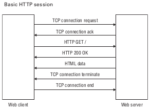

<div dir="rtl">

# 📍️ Concepts

* شبکه تحویل محتوا یا CDN[ContentDeliveryNetwork]: بهینه‌سازی شبکه‌ جهت کاهش زمان تحویل محتوا به مصرف‌کننده علی رغم توزیع سرورها در نقاط جغرافیایی گوناگون
    * highly-distributed platform of servers that helps minimize delays in loading web page content by reducing the physical distance between the server and the user. This helps users around the world view the same high-quality content without slow loading times


```shell
iftop
iptraf-ng
nload
tcpflow

```


# 📍️ WEB




# 📍️ CISCO

PacketTracer: نرم‌افزار سیسکو برای شبیه سازی محیط واقعی شبکه

# 📍️ Switch


* سوییچ لایه۲هست(مفاهیم مک و جدولarp)
* با گذر ایام، سوییچ در لایه۳ورود کرد(مفاهیم روتینگ) و آی‌پی
* VLAN: در VLAN گویی یک سوییچ‌کامل را دو تکه می‌کنیم
* TrunkPort
    * پورت ترانک بین دو سوییچ معنی پیدا می‌کند
    * پورتی که وظیفه انتقال ترافیک بین VLAN ها در سوییچ را دارد
    * در دو سوییچ‌کامل‌ از وسط شکسته شده(۴تکه شبکه مجزا) این تکه شبکه‌ها از طریق پورت ترانکیت به هم وصل می‌شوند
* StackableSwitch:
* Port Group: یک مفهوم در مجازی‌سازی شبکه است که به مجموعه‌ای از پورت‌های شبکه مجازی اشاره دارد. این گروه به ماشین‌های مجازی (VMs) اجازه می‌دهد تا به یکدیگر و به شبکه‌های خارجی متصل شوند.


> StackableSwitch


# 📍️ Proxy

* سایت‌های زیر برای تست پروکسی مفید است
    * ifconfig.me
    * ping.eu

## Tor

* از موارد مشابه تور می‌توان به proxychains4 و privoxy اشاره کرد که همانند torsocks در ابتدای دستورات قرار می‌دهیم.
* پورت پیش‌فرض تور 9050 است
* مسیر لاگ تور
    * `/etc/tor/torrc` تنظیمات تولید لاگ را از کامنت خارج نمایید
    * /var/log/tor/notices.log
    * /var/log/tor/debug.log
* [PythonCode: change Ip periodicatly](https://github.com/FDX100/Auto_Tor_IP_changer)
    * cd Auto_Tor_IP_changer
    * sudo apt-get install tor
    * sudo apt-get install privoxy
    * python3 autoTOR.py
* [url](https://pentestcore.com/tor-ip-change/)

```shell
kill -HUP `pidof tor` دریافت آی‌پی جدید برای تور
export http_proxy="socks4://localhost:9050" #اگر بخواهیم در یک شل که در سیستم tor نصب است تمام موارد را پروکسی کنیم
torsocks curl https://showip.net # Test Ip Adderess


```

# 📍️ Commands

## ✅️ arp

* پروتکل arp: چه مک‌آدرس به چه آی‌پی متصل است
* بسته‌های پروتکل ARP از روتر عبور نمی‌کنند


* [-e]: display (all) hosts in default (Linux) style
    * `sudo arp -e`
* [-n|--numeric]:don't resolve names
    * `sudo arp -n`

## ✅️curl

دستورات یا مرورگر‌های مشابه متنی ترمینال: links و links2 و lynx(دستور www-browser)

```shell
curl -I itsee.ir #نمایش هدرهای یک سایت
curl -u username:password -T file.tar.gz ftp://ftp_server
```

## ✅️ ethtool

```shell
dig <name>
dig +short <Name>  #اطلاعات اضافه نشان نده و فقط آی‌پی را نمایش بده
```

## ✅️ ethtool

```shell
sudo ethtool enp5s0 # اطلاعات فوق‌العاده زیاد بابت کارت شبکه

```

## ✅️ fping

`fping -g 192.168.10.1 192.168.10.5 #alive hosts`

## ✅️ host

```shell
host -la domain.local # نمایش تمام رکوردهای یک دامنه
host <name[google.com]>
```

## ✅️ hostname

* [-I] or [--all-ip-addresses] → All IP addresses for the host

```shell
hostname -I # show all ip address
```

## ✅️ iwlist|iwconfig

wifi|wireless|وای‌فای

```shell
iwlist <nic> scan #بررسی وایرلس‌های اطراف سیستم که بخواهیم به آن وصل شویم
iwconfig wlp4s0 essid "<Name>" key s:<Pass> #اتصال به یک وایرلس
```

## ✅️ ip

Usage: ip OPTIONS OBJECT COMMAND

**نکته:** به جهت سهولت اگر بخشی از کلمه دستور نگارش شود به منزله‌آن است که همه کلمه به نگارش درآمده است

**OBJECTS**:

* address
    * ip a[|ad|add|addr|addre|addres|address] [s|sh|sho|show] [dev] eth0
    * ip a sh
    * ip ad sho
    * ip add s
    * ip -4 addre sho
* addrlabel
* amt
* fou
* help
* ila
* ioam
* l2tp
* link: network device
* macsec
* maddress: multicast address
* monitor: watch for netlink messages
* mptcp
* mroute
* mrule
* neigh
* neighbor
* neighbour
* netconf
* netns
* nexthop
* ntable
* ntbl
* route: routing table entry
* rule: rule in routing policy database
* sr
* stats: manage and show interface statistics
* tap
* tcp_metrics
* token
* tunnel: tunnel over IP
* tuntap
* vrf
* xfrm

**Options:**

* -c[olor]: نمایش رنگی دستورات
    * ip -c address show
* -d[etails]: نمایش جزییات
    * ip -d address
* -s[tatistics]
    * ip -s link
* -4: ip version4
* -6: ip version6

* ip -s link #network statistics
* link
    * ip link set <NIC> up|down
    * ip link #show information for all interfaces
    * ip link show dev eth0 #Display information only for device eth0
    * ip link set eth0 promisc on #Enable promiscuous mode for eth0
    * ip link ls up #Only show running interfaces
    * ip -s link #Display interface statistics
    * ip -s link ls eth0 #get information about a particular network interface
* add
    * ip addr add x.x.x.x/Y dev <NIC> → Add IP
* remove
    * ip addr del x.x.x.x/Y dev <NIC> → del IP
    * ip link del <nic> down → up/down NIC

### [Gateway|Routr] Commands

* show
    * ip route
    * ip route show #default gateway information
* add
    * ip route add default via 192.168.200.1/24 #assign a default gateway
* remove
    * ip route del 192.168.0.150/24 #Removing a static route

## ✅️ ifconfig

```shell
ifconfig eth0:0 xxx.xxx.xxx.xxx #set [Additional ip] or [VirtualIp]
ifconfig eth0 hw ether AA:BB:CC:DD:EE:FF #MacSpoofing or تغییر مک آدرس
```

## ✅️ lsof

### Concept

* COMMAND: The command name
* PID: Process ID (PID) of the process
* USER: Owner of the process
* FD: is the File Descriptor number of the file or
    * cwd: current working directory
    * rtd: root directory
    * txt: program text (code and data)
    * mem: memory-mapped file
    * Lnn: library references (AIX);
    * err: FD information error (see NAME column)
    * jld: jail directory (FreeBSD)
    * ltx: shared library text (code and data)
    * Mxx: hex memory-mapped type number xx
    * m86: DOS Merge mapped file
    * mmap: memory-mapped device
    * pd: parent directory
    * tr: kernel trace file (OpenBSD)
    * v86: VP/ix mapped file;
    * others:
        * r: for read access
        * w: for write access
        * u: for read and write access
* TYPE: Type of file descriptor[type of the node associated with the file]
    * DIR: Directory
    * REG: Regular file
    * CHR: Character special file.
    * FIFO: First In First Out
    * IPv4: IPv4 socket
    * IPv6: for an open IPv6 network file - even if its address is IPv4, mapped in an IPv6 address
    * inet: for an Internet domain socket
* DEVICE: Device number or, in the case of a block device, character or other
* SIZE/OFF: Dimension(بُعد) or size of the file or offset (the suffix 0t is the offset)
* NODE: Node description of the local file; this could be the number of the local file, TCP, UDP, or STR (stream)
* NAME: The name of the mount point where the file resides

### Switch

* [-i] → List all network connecttion
    * tcp|udp:
        * lsof -i tcp
        * lsof -i udp
    * PORT
        * lsof -i :22 #open Ports on ssh
        * lsof -i :ssh
        * lsof -i TCP:22
        * lsof -i UDP:514
        * lsof -i tcp
    * PORT Range
        * lsof -i TCP:1-1024
    * 4|6 → ipv4 or ipv6
        * lsof -i 4
        * lsof -i 6
    * IP
        * lsof -i @127.0.0.1
        * lsof -i @192.168.200.2
        * lsof -i tcp@127.0.0.1
        * lsof -i tcp@192.168.200.2
        * lsof -i udp@127.0.0.1
        * lsof -i udp@127.0.0.1
* [-u] All network connecttion List User Specific Opened Files
    * lsof -u behrooz
    * ^ : Exclude User with ‘^’ Character → عدم نمایش یک یوزر خاص
        * lsof -i -u^root
* [-p] → PID
    * lsof -p 1 → Pid=1
* [/<dir>] → Display Files of a Specific Filesystem
    * lsof / sys/
    * [+d]: جلوگیری از گردشی شدن یعنی نمایش تمام زیر مسیرها
    * lsof +d /proc
* TerminalFiles →
    * lsof /dev/tty*
* [-c] → Display Files Used by a Process Name
    * lsof -c ssh
    * lsof -c firefox
* [-R] → Add Parent pid(PPID) at output as a new column
* [-d] → فیلتر بر حسب ستون اِف‌دی یعنی ستون چهارم
    * lsof -d mem → All memory map files
    * lsof -d cwd

### Appendix

* [+L1] → سوکت‌های فعلی سرور که به هیچ فایلی از هارد وصل نشده است - پردازه‌های موجود در رم که ممکن است ویروس باشند
    * lsof +L1
* deletedFiles
    * sudo lsof [path] | grep deleted

## ✅️ mtr

```shell
mtr google.com
mtr -n --report IP
```

## ✅️ netstat

* [خالی و بدون پارامتر ورودی] → By default, netstat displays a list of open sockets.
* [-i] or [--interfaces,] → Display a table of all network interfaces
* [-s] or [--statistics] → Display summary statistics for each protocol
* [-r] or [--route,] ⇄ [route -e] → Display the kernel routing tables
* [-g] or [--groups,] → Display multicast group membership information for IPv4 and IPv6
* [-t] or [--tcp]→ display TCP sockets
* [-u] or [--udp] → display UDP sockets
* [-l] → display only listening sockets
* [-n] → display the socket’s port number

## ✅️ nmapt

* تعریف NullScan: بسته هیچ پرچمی(TCP، UDP، Sync، Http، ICMP و غیره) به خود نمی‌گیرد.
    * اگر یک سرور هیچ پاسخی نداد شما می‌توانید نوع اسکن را در وضعیت Null Scan قرار دهید که در آن صورت حتما بسته عبور می‌کند و حداقل می‌توان فهمید که سرور alive هست یا پایین است
* تعریف Zombi Attach: همزمان به چندین سیستم زامبی‌شده(قربانی‌های بستر اینترنت) می‌گوییم که به یک سرور وصل شوند و کاری انجام دهند و گزارش خروجی حمله را در اختیارمان قرار دهند و ما ناشناخته خواهیم ماند

### Ping

* nmap -Pn [target] #Dont ping
* nmap -sP [target] #perform a Ping Only Scan
* nmap -PS [target] #TCP SYN Ping
* nmap -PA [target] #TCP ACK Ping
* nmap -PU [target] #UDP Ping
* nmap -PY [target] #SCTP INIT Ping
* nmap -PE [target] #ICMP Echo Ping
* nmap -PP [target] #ICMP Timestamp Ping
* nmap -PM [target] #CMP Address Mask Ping
* nmap -PO [target] #IP Protocol Ping

### Trace

* nmap –traceroute     [target] #Traceroute
* nmap --packet-trace [target] #Trace package

### DNS

* nmap -R [target] #Force Reverse DNS Resolution
* nmap -n [target] #Disable Reverse DNS Resolution
* nmap –system-dns [target] #Alternative DNS Lookup
* nmap –dns-servers [servers] [target] #Manually Specify DNS Server(s)
* nmap -sL [targets] #Create a Host List

### Advanced Scanning Options

* nmap -sS [target] #TCP SYN Scan
* nmap -sT [target] #TCP Connect Scan
* nmap -sU [target] #UDP Scan
* nmap -sN [target] #TCP NULL Scan
* nmap -sF [target] #TCP FIN Scan
* nmap -sX [target] #Xmas Scan
* nmap -sA [target] #TCP ACK Scan
* nmap –scanflags [flags] [target] #Custom TCP Scan
    * nmap –scanflags SYNFIN 192.168.0.1
* nmap -sO [target] #IP Protocol Scan
* nmap –send-eth [target] #Send Raw Ethernet Packets
* nmap –send-ip [target] #Send IP Packets

### Port Scan

* nmap -F [target] #Perform a Fast Scan
* nmap -p [port(s)] [target] #Scan Specific Ports
    * nmap -p 21-25,80,139,8080 192.168.1.1
* nmap -p [portName(s)] [target] #Scan Ports by Name
    * nmap -p ftp,http* 192.168.0.1
* nmap -sU -sT -p U: [ports],T:[ports] [target] #Scan Ports by Protocol
    * nmap -sU -sT -p U:53,111,137,T:21- 25,80,139,8080 192.168.0.1
* nmap -p ‘*’ [target] #Scan All Ports
* nmap –top-ports [number] [target] #Scan Top Ports
* nmap -r [target] #Perform a Sequential Port Scan

### Version Detection

* nmap -O [target] #Operating System Detection
* nmap -O –osscan guess [target] #Attempt to Guess an Unknown OS
* nmap -sV [target] #Service Version Detection
* nmap -sV –version trace [target] #Troubleshooting Version Scans
* nmap -sR [target] #Perform a RPC Scan

### Firewall Evasion Techniques

* nmap -f [target] #augment Packets
* nmap –mtu [MTU] [target] #pacify a Specific MTU
    * nmap –mtu 32 192.168.0.1
* nmap -D RND:[number] [target] #Use a Decoy
* nmap -D RND:10 192.168.0.1
* nmap -sI [zombie] [target] #Zombie Scan
* nmap –source-port [port] [target] #Manually Specify a Source Port
* nmap –data-length [size] [target] #Append Random Data
    * nmap –data-length 2 192.168.0.1
* nmap –randomize-hosts [target] #Randomize Target Scan Order
    * nmap –randomize-ho 192.168.0.1-20
* nmap –spoof-mac [MAC|0|vendor] [target] #Spoof MAC Address
    * nmap –spoof-mac Cis 192.168.0.1
* nmap –badsum [target] #Send Bad Checksums

### Troubleshooting And Debugging

* nmap -h #Getting Help
* nmap -V #Display nmap Version
* nmap -v [target] #Verbose Output
* nmap -d [target] #Debugging
* nmap –reason [target] #Display Port State Reason
* nmap –open [target] #Only Display Open Ports
* nmap –packet-trace [target] #Trace Packets
* nmap –iflist #Display Host Networking
* nmap -e [interface] [target] #Specify a Network Interface
    * nmap -e eth0 192.168.0.1

### nmap Scripting Engine

* nmap –script [script.nse] [target] #Execute Individual Scripts
* nmap –script [expression] [target] #Execute Multiple Scripts
    * nmap –script ‘http-*’ 192.168.0.1
* nmap –script [category] [target] #Execute Scripts by Category
    * Script Categories: all, auth, default, discovery, external, intrusive, malware, safe, vuln
    * nmap –script ‘not intrusive’ 192.168.0.1
* nmap –script [category1,category2,etc] #Execute Multiple Script Categories
    * nmap –script ‘default or safe’ 192.168.0.1
* nmap –script [script] –script trace [target] #Troubleshoot Scripts
    * nmap –script banner.nse –script-trace 192.168.0.1
* nmap –script-updatedb #Update the Script Database

## ✅️ nmcli

```shell
nmcli connection show
nmcli connection show -a #only the active connections
nmcli connection [down|up] <Name> #[Up|Down] connections (By connections name) 
nmcli device status
nmcli device show
nmcli device show enp3s0
nmcli device [connect|disconnect] <NCname> #enabling|disconnect] an interface
nmcli device wifi list
nmcli general status
nmcli general #status is default action
nmcli general hostname #نمایش نام هاست
nmcli general hostname <NewName>
nmcli general permission #Show caller permissions for authenticated operations
nmcli general permission #Listing NetworkManager polkit permissions 
nmcli general logging
nmcli general logging level INFO
nmcli general logging domains ETHER
nmcli general logging domains WIFI
nmcli general logging domains ALL
nmcli general logging level INFO domains ALL
```

## ✅️ nslookup

```shell
nslookup -querytype=mx domain.ir #پیدا کردن ایمیل‌سرور یک دامین
nslookup <name>
```

## ✅️ tcpdump

دستور لینوکس برای گوش کردن به شبکه- سوییچ‌ها

### Switch

* [-c] → Capture Only N Number of Packets
    * sudo tcpdump -c 5
* [-i] → Capture Packets from Specific Interface
    * sudo tcpdump -i eth0
    * sudo tcpdump -i any
* [-A] → Print Captured Packets in ASCII
    * sudo tcpdump -A
* [-w] → Capture and Save Packets in a File
    * sudo tcpdump -w /tmp/0001.pcap
* [-r] → Read Captured Packets File
    * sudo tcpdump -r 0001.pcap
* [tcp] → Capture only TCP Packets
    * sudo tcpdump tcp
* [port n] → Capture Packet from Specific Port
    * sudo tcpdump port 22
* [src] → Capture Packets from source IP
    * sudo tcpdump src 192.168.0.2
* [dst] → Capture Packets from destination IP
    * sudo tcpdump dst 50.116.66.139
* [-D] → Display available interfaces
    * sudo tcpdump -D
        1. enp3s0 [Up, Running, Connected]
        2. any (Pseudo-device that captures on all interfaces) [Up, Running]
        3. lo [Up, Running, Loopback]
        4. bluetooth-monitor (Bluetooth Linux Monitor) [Wireless]
        5. nflog (Linux netfilter log (NFLOG) interface) [none]
        6. nfqueue (Linux netfilter queue (NFQUEUE) interface) [none]
        7. dbus-system (D-Bus system bus) [none]
        8. dbus-session (D-Bus session bus) [none]
* [-n] → show IP address replace name (disable name resolution)(Only IP address packets)
    * tcpdump -n
* [-nn] → show port address replace name (disable port resolution with -nn)
* [-XX] → Display Captured Packets in HEX
* [--number] → show packet numbers in output
* [-t] → omit timestamp info from tcpdump outpu
* [-v] → show detailed output
* [icmp] → capture ICMP packets only
* [host ip] → only packets related to a specific host
    * tcpdump host 10.0.20.150
* [broadcast] → capture broadcasts
    * tcpdump broadcast
* [multicast] → capture multicast
    * tcpdump multicast
* [] →
* [] →

### Examples

* tcpdump src NUMBER && dst port NUMBER
* tcpdump dst ff:ff:ff:ff:ff:ff
* tcpdump broadcast and multicast
* tcpdump broadcast && multicast
* tcpdump tcp and host 169.144.0.1 or host 169.144.0.20
    * tcp packages between 2 hosts
* ✅ tcpdump src 169.144.0.1 and port 22 and dst 169.144.0.20 and port 22
    * Only ssh packages between 2 hosts
* tcpdump -i any -c5 -nn src 192.168.122.98 and port 80 → #filter packets from source IP address 192.168.122.98 and
  service HTTP only
* tcpdump -i any -c5 -nn "port 80 and (src 192.168.122.98 or src 54.204.39.132)" → #filtering packets for HTTP service
  only (port 80) and source IP addresses 192.168.122.98 or 54.204.39.132

## ✅️ traceroute

```shell
traceroute google.com
```

## ✅️ wget

- [-b] → قرار دادن پروسه دانلود در بک‌گراند و عدم نمایش و این معمولا برای فایل‌های بزرگ کاربرد دارد
- [-c] → اگر دانلود متوقف شد مجددا ادامه دانلود را از سر گیرد
- [-f]: ایجاد یک فایل برای لاگ شدن وضعیت پیشرفت دانلود
- [-i] → ذخیره چندین یو‌آر‌ال در فایل و سپس دانلود لینک‌ها از فایل
    - wget -i ./FileName.txt
- [-l]: سطح بازگشت را تعیین میکند
    - اِل است و نه آی
- [-np] or [--no-parent] عدم رجوع به مسیر بالاتر
- [-O] Name → انتخاب نام جدید به فایل دانلود شده
- [-o ./download.log] → ذخیره لاگ در یک فایل بجای نمایش در ترمینال
- [-P]: قرار دادن در یک فولدر دیگر
    - [-P /documents/websites]:تمام محتوا به فهرست مشخص شده ما می رود
- [-Q5m] → پایان دانلود وقتی سایز دانلود شده از مقدار ۵مگابایت فراتر برود
- [-r] or [--recursive] دانلود به صورت بازگشتی
- [-R] or [--reject] → عدم دانلود یک نوع فایل معین ، در هنگام دانلود
    - wget -P documents/archives/ https://wordpress.org/latest.zip
- [--limit-rate=200k] → تعیین سرعت دانلود
- [--user-agent] → برخی سایت‌ها با تشخیص اینکه شما از مرورگر برای دانلود استفاده نمی‌کنید،می‌تونن اجازه دانلود به شما ندهند و شما توسط این گزینه نقاب می‌زنید و تحت عنوان مثلا فایرفاکس متصل می‌شوید
    - wget --user-agent="Mozilla/5.0 (X11; U; Linux i686; en-US; rv:1.9.0.3) Gecko/2008092416 Firefox/3.0.3" <URL>
- [--tries] → تعداد پیش‌فرض تلاش مجدد برای دانلود عدد۲۰ است و می‌تونیم آنرا تغییر دهیم
    - wget --tries=75 URL
- [--spider]: قراردادن در وضعیت اسپایدر
- [-mirror]: دانلود را بازگشتی می کند
- [-convert-links]: همه لینک‌ها برای استفاده آفلاین مناسب تبدیل خواهند شد
- [-page-requisites]: موارد زیر شامل تمام فایل‌های ضروری مانند «سی‌اِس‌اِس» و «جِی‌اِس» و تصاویر می شود
- [-no-parent]:تضمین می‌کند که دایرکتوری‌های بالای سلسله مراتب دانلود نمی‌شوند


- `wget --ftp-user=USERNAME --ftp-password=PASSWORD DOWNLOAD-URL`
- `wget --spider --force-html -r -l5 htp://dl.folan.net/Movie/ 2>&1 | grep '^--' | awk '{ print $3 }' | grep -v '\.css\|js\|png\|gif\|jpg$' | grep -v '\/$'`
- `wget --mirror --convert-links --page-requisites --no-parent -P documents/websites/ URL` #می توان از دستور wget برای دانلود محتوای کل سایت استفاده کرد
- `wget -r -np -R "index.html*" https://shop.hemat-elec.ir/wp-content/themes/irankala/assets/fonts` # Note: دانلود فایل های مشخص شده
    - wget -r -A.pdf
