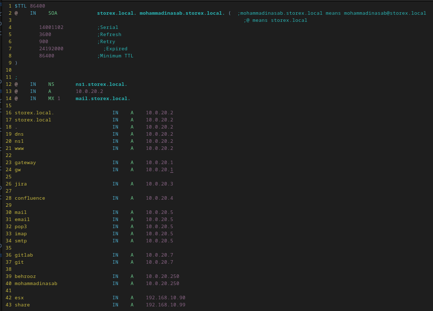
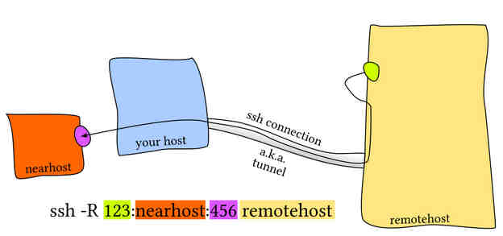
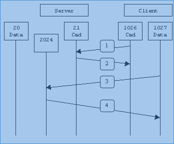

<div dir="rtl">

# 1. 🅰️ ConceptsAndProtocol

* شبکه تحویل محتوا یا CDN[ContentDeliveryNetwork]: بهینه‌سازی شبکه‌ جهت کاهش زمان تحویل محتوا به مصرف‌کننده علی رغم توزیع سرورها در نقاط جغرافیایی گوناگون
    * highly-distributed platform of servers that helps minimize delays in loading web page content by reducing the physical distance between the server and the user. This helps users around the world view the same high-quality content without slow loading times
* Delay: زمان سپری شده برای شروع(قبل از شروع عمل)
* Latency: زمان سپری شده جهت دریافت بازخورد یک بسته ارسال شده و به مقصد رسیده (پس از عمل)
    * در ذخیره‌ساز عدد ۱۰ میلی‌ثانیه مرز است و اگر بیشتر باشد کند و اگر کمتر باشد مطلوب است
* TTL(TimeToLeave)
    * یکی از پارامترهای پینگ که وقتی از هر روتر عبور کند یک عدد از ttl کاهش پیدا خواهد کرد
    * معمولا روترها از ۳۰ تا هاب بیشتر که ttl کم شود بسته شبکه را drop می‌کنندمقدار ttl در دیوایس‌ها متفاوت است:۱-دیوایس‌های اپن‌سورس 64 ۲-دیوایس‌های ماکروسافتی128 ۳-دیوایس‌های بر پایه سیسکو ۲۵۵ می‌باشند
* در لینوکس سوکت‌ها هم نوعی فایل هستند(در لینوکس همه چی فایل است)
* **Transparency**: استقلال مکان کاربر و مکان قرارگیری منابع، سرویس مورد نظر
    * کاربران از مکان‌های مختلف، به یک پوشه دسترسی داشته باشد در حالی که داده‌های موجود در پوشه در مکان های فیزیکی مجزا بر روی هارددیسک کامپیوترهای متفاوت بر روی شبکه قرار دارند و برای کاربران(هر مکانی) قابل لمس نمی‌باشد
    * The main benefit of location transparency is that it no longer matters where the resource is located.Depending on how the network is set, the user may be able to obtain files that reside on another computer connected to the particular network
* مفهوم Scale-Up(Vertical Scaling):افزودن منابع سخت‌افزاری قوی‌تر مثل رم یا پردازنده(خرید سرور جدید وقوی)
* مفهوم Scale-Out (Horizontal Scaling): افزودن سرورهای جدید به یک خوشه و افزایش ظرفیت Cluster از طریق شبکه
* NOC مخفف Network Opration Center است

# 2. 🅰️ARP

## 2.1. 🅱️ Commands

### 2.1.1. ✅️arp

* پروتکل arp: چه مک‌آدرس به چه آی‌پی متصل است
* بسته‌های پروتکل ARP از روتر عبور نمی‌کنند


* [-e]: display (all) hosts in default (Linux) style
    * `sudo arp -e`
* [-n|--numeric]:don't resolve names
    * `sudo arp -n`

### 2.1.2. ✅️arp-scan

```shell
arp-scan -I enp4s0 10.0.20.0/24
arp-scan --interface enp4s0 10.0.20.0/24
arp-scan --interface enp4s0 --localnet
```

# 3. 🅰️IP

* RG45
    * در بعضی از مدل‌های ارتقاءیافته آن سرعت 10Gb هم ارائه می‌دهد

## 3.1. 🅱️Bonding

* این قابلیت امکان مجتمع شدن چند کارت شبکه و استفاده از آنها به صورت یک کارت شبکه را فراهم می کند. نام دیگر آن NIC Teaming و Link Aggregate است. این روش دارای مدهای مختلفی است که عبارتند از:
* mode=0(balance-rr) – mode=1(active-backup) – mode=2(balance-xor) – mode=3(broadcast) – mode=4(802.3ad) – mode=5(balance-tlb) – mode=6(balance-alb)
* در مدهای ۰ و ۲ و ۳ و ۴ تمامی پورت ها یک گروه می بایست به یک logical switch متصل شوند اما در مدهای ۱ و ۵ و ۶ پورت های یک گروه می توانند به سوئیچ های مختلف متصل شوند. هر چند که می توان با aggregate کردن چند سوئیچ فیزیکال همه آنها را به یک logical switch تبدیل کرد.
* تمامی مدهای بالا در سه دسته کلی قرار می گیرند:
    * FailOver Only: تنها مد active-backup در این دسته قرار می گیرد. وقتی لینک اصلی fail شد لینک دوم جایگزین آن می شود.
    * Require Switch Support: مدهای balance-rr و ۸۰۲.۳ad و balance-xor هستند که باید سوئیچ نیز از آنها پشتیبانی نماید.
    * Generic Modes: در مد broadcast تمامی ترافیک از تمامی پورتهای عضو گروه خارج می شوند. در مد balance-tlb ترافیک خروجی load balance می شود اما ترافیک ورودی فقط از یک لینک می آید. در مد balance-alb نیز تمامی ترافیک ارسالی و دریافتی load balance می شود و از روش change MAC address استفاده می گردد.
* سخن آخر اینکه اگر شما در محیطی کار می کنید که سوئیچ ها از ۸۰۲.۳ad یا همان LACP پشتیبانی می کنند، بهترین روش همین مد است. اما اگر ساپورت سوئیچی ندارید و هم می خواهید load balance داشته باشید و هم fault tolerance بهترین روش balance-alb است. در نهایت اگر می خواهید فقط بین دو سرور replication داشته باشید، مد balance-rr برای شما بهتر است.

## 3.2. 🅱️Fiber Ethernet

همان سازوکار RG45 که به فیبر تبدیل شده است و با IP کارمیکند

* Fiber Ethernet Card
    * دو عدد چراغ LED دارد
    * ساپورت کننده پروتکل اترنت و نه «پروتکل اف‌سی»
    * Speed: 10G or 40G or 100G or 200G
    * Uniq Identify: IP
    * ماژول‌های SFP به کارت متصل و کابل به این ماژول‌ها متصل خواهند شد
    * کامندهایی که این مورد را پوشش می‌دهند
        * iftop
        * iptraf-ng
        * nload
        * tcpflow

## 3.3. 🅱️Commands

### 3.3.1. ✅️iperf

```shell
node1: iperf -s
node2: iperf -c <HOST>

#FromSobhanSadatNejad:
node1: iperf3 -s -i 1
node2: iperf3 -u -c 10.10.12.10 -w 1M -i 10 -t 60       
```

# 4. 🅰️ICMP

## 4.1. 🅱️Commands

### 4.1.1. ✅️fping

`fping -g 192.168.10.1 192.168.10.5 #alive hosts`

# 5. 🅰️DNS

## 5.1. 🅱️Command

### 5.1.1. ✅️dig

```shell
dig <name>
dig +short <Name>  #اطلاعات اضافه نشان نده و فقط آی‌پی را نمایش بده
```

### 5.1.2. ✅️nslookup

```shell
nslookup -querytype=mx domain.ir #پیدا کردن ایمیل‌سرور یک دامین
nslookup <name>
```

## 5.2. 🅱️Bind

Bind

- Top Level Domain یا TLD : سطح com یا ir یا net یا org در DNS
- First Level Domain یا FLD : نام itsee در دامنه itsee.ir
- ICANN: سازمانی که نام‌های DNS یعنی TLD یا FLD را مدیریت می‌کند
- DNSSec : پاسخ که از سرور میآید را sign میکند و من مطمئن میشوم که دقیقا از سرور مقصد آمده
- دستور named-checkzone یا named-checkconf : بررسی صحت اطلاعات موجود در فایل تنظیمات
- دیتا پس از resolve شدن کش می‌شود و نوبت بعدی خیلی سریع‌تر resolve پاسخ داده خواهد شد
- DNS Master: سروری که ادعا میکند صاحب یک زون است(یعنی خودم جواب را بلدم) و همچنین مواردی که بلد نیست را از Forward می‌پرسد
- در DNS در فایل zone مقدار TTL برحسب ثانیه است و میگوید این رکورد تا فلان ثانیه معتبر است
- در DNS در فایل zone در هر زون باید حداقل یک SOA یعنی Start Of Authority داشته باشند که معرفی اطلاعات است
- در DNS در فایل zone علامت @ به نام زون اشاره دارد که نمی‌خواهد هردفعه نام آن را تکرار کند- در DNS در فایل zone عبارت یعد از SOA نام دامنه و عبارت بعدی آدرس ایمیل به شکل بدون @ آورده می‌شود که یجای نقطه علامت @ می‌گذاریم
- در DNS در فایل zone هر بار که این فایل را تغییر بدهیم باید عدد serial را یک عدد بالاتر ببریم تا DNS آن را لود نماید
- در DNS در فایل zone کلمه cname یک alias است که موضوع www زدن یا نزدن را handle میکند




# 6. 🅰️Switch

* سوییچ لایه۲هست(مفاهیم مک و جدولarp)
* با گذر ایام، سوییچ در لایه۳ورود کرد(مفاهیم روتینگ) و آی‌پی
* VLAN: در VLAN گویی یک سوییچ‌کامل را دو تکه می‌کنیم
* TrunkPort
    * پورت ترانک بین دو سوییچ معنی پیدا می‌کند
    * پورتی که وظیفه انتقال ترافیک بین VLAN ها در سوییچ را دارد
    * در دو سوییچ‌کامل‌ از وسط شکسته شده(۴تکه شبکه مجزا) این تکه شبکه‌ها از طریق پورت ترانکیت به هم وصل می‌شوند
* StackableSwitch:
* Port Group: یک مفهوم در مجازی‌سازی شبکه است که به مجموعه‌ای از پورت‌های شبکه مجازی اشاره دارد. این گروه به ماشین‌های مجازی (VMs) اجازه می‌دهد تا به یکدیگر و به شبکه‌های خارجی متصل شوند.


> StackableSwitch


# 7. 🅰️Router

* **RoutingTable**: اگر یک لینوکس روتر شد و تعدا کارت‌شبکه زیاد باشد پس لینوکس باید در خاطر خودش نگهداری نماید که برای ارسال بسته به هاست از چه اینترفیسی استفاده کرده است. بنابراین نیاز به یک routing table دارد تا نشان دهد که از کدام اینترفیس برای ارسال بسته به هاست استفاده کرده است
* **RIP(Router Information Protocol)**: لینوکس برای ساپورت کردن RoutingTable این پروتکل را ایجاد کرده است تا کارهای روت را انجام دهد. زمانی که یک بسته RIP رسید آنگاه لینوکس RoutingTable را بروزرسانی می‌کند. لینوکس از برنامه routed برای Listen کردن بسته‌های RIP و بروزرسانی جدول استفاده می‌کند

## 7.1. 🅱️LinuxRouter

* اگر پارامتر کرنلی System.Net.Route و net.ipv6.conf.all.forwarding برابر ۱ باشند و در iptables در chain بنام FORWARD قانون اضافه کردیم آنگاه لینوکس قابلیت روتر شدن پیدا خواهد کرد یعنی بسته‌ها را از یک اینترفیس به اینترفیس دیگر انتقال دهد
*

## 7.2. 🅱️COMMANDS

### 7.2.1. ✅️mtr

```shell
mtr google.com
mtr -n --report IP
```

### 7.2.2. ✅️traceroute

```shell
traceroute google.com
```

# 8. 🅰️Proxy

* سایت‌های زیر برای تست پروکسی مفید است
    * ifconfig.me
    * ping.eu

## 8.1. 🅱️OpenVPN

* یکی از روش‌های وی‌پی‌ان زدن است که باید اول بسته آن را نصب نماییم و پس از نصب دو فال در مسیر های etc/openvpn/server.conf و etc/openvpn/client.conf ایجاد می‌نماید که تنظیمات اصلی این فایل‌ها به شرح زیر است:[config]: استفاده از فایل برای نگهداری تنظیمات
    * [dev]: نام دیوایس مجازی که در دستور ifconfig نمایش داده خواهد شد
    * [nobind]: ساخت تونل بدون local network address یا پورت
    * [ifconfig]: تنظیم آی‌پی به مبدا و مقصد
    * [secret]: فایلی از تنظیمات رمزنگاری که در دو حالت می‌تواند باشد:
        1. Static key encryption: هم سرور و هم کلاینت از یک کلید رمزنگاری مشابه استفاده می‌کنند
        2. Public key encryption: هم سرور و هم کلاینت برای خودشان کلید عمومی و خصوصی تولید میکنند و از آن طریق متصل می‌شوند
* استفاده از روش Static key encryption در openVPN:
  ```shell
  openvpn—genkey—secret secret.key #run on server
  openvpn—genkey—secret secret.key #run on client
  
  vim server.conf
  dev tun
  ifconfig 192.168.1.10 10.0.1.1
  keepalive 10 60
  ping-timer-rem
  persist-tun
  persist-key
  secret secret.key
  
  sudo openvpn server.confsudo openvpn client.conf
  ```


## 8.2. 🅱️Tor

* از موارد مشابه تور می‌توان به proxychains4 و privoxy اشاره کرد که همانند torsocks در ابتدای دستورات قرار می‌دهیم.
* پورت پیش‌فرض تور 9050 است
* مسیر لاگ تور
    * `/etc/tor/torrc` تنظیمات تولید لاگ را از کامنت خارج نمایید
    * /var/log/tor/notices.log
    * /var/log/tor/debug.log
* [PythonCode: change Ip periodicatly](https://github.com/FDX100/Auto_Tor_IP_changer)
    * cd Auto_Tor_IP_changer
    * sudo apt-get install tor
    * sudo apt-get install privoxy
    * python3 autoTOR.py
* [url](https://pentestcore.com/tor-ip-change/)

```shell
kill -HUP `pidof tor` دریافت آی‌پی جدید برای تور
export http_proxy="socks4://localhost:9050" #اگر بخواهیم در یک شل که در سیستم tor نصب است تمام موارد را پروکسی کنیم
torsocks curl https://showip.net # Test Ip Adderess


```

# 9. 🅰️DHCP

* هنگامی که برنامه dhclient لیست سرورهای NTP را از DHCP می‌گیرد به‌صورت خودکار در فایل ntp.conf قرار میدهد. برای جلوگیری ازاین موضوع عبارت PEERNTP=no را در فایل /etc/sysconfig/network قرار دهید

# 10. 🅰️SSH

## 10.1. 🅱️concepts

* نرم‌افزار termius نرم‌افزار ssh و scp و sftp و tunnel است که هم نسخه موبایلی و هم نسخه لینوکسی دارد و تخصصی در بحث ssh کار کرده است

```shell
ssh -t user@IP 'cd /usr/local/sbin; bash --login' # Login and execute command[such as cd]
scp [Server1Username]@[Server1_ip]:[Server1_Path] [Server2Username]@[Server2_ip]:[Server2_Path]
ssh -o StrictHostKeyChecking=no -l root ${peer}

```

## 10.2. 🅱️options

* -D: forward all traffic of service
* -f: fork
* -N: Non login
* -o: اعمال تنظیمات داخل فایل کانفیگ بعنوان آپشن در لحظه اتصال
    * ssh -o StrictHostKeyChecking=no user@10.10.10.10

## 10.3. 🅱️files

* sshd_config: فایل تنظیماتی سرویس «اس‌اس‌اچ» سرور(یعنی سرویس «اس‌اس‌اچ» سرور چه تنظماتی داشته باشد)
* ssh_config: فایل تنظیماتی کلاینتی «اس‌اس‌اچ»(یعنی در هنگام «اس‌اس‌اچ» به سرورهای متفاوت چه تنظیماتی داشته باشد)
* ~/.ssh/known_hosts: Contains a list of host keys for all hosts the user has logged into that are not already in the systemwide list of known host keys(fingerprint).
* ~/.ssh/authorized_keys: اگر کلید عمومی کسی رو در این فایل قرار بدهیم دیگر از او پسورد نمی‌گیرد و مستقیما لاگین می‌نماید
    * هر سروری که کلید عمومی آن در فایل authorized_keys موجود باشد می‌تواند بدون وارد کردن پسورد در سرور لاگین نماید
    * این فایل تنها باید توسط مالک خود قایلیت خواندن و نوشتن داشته باشد و نه دیگران
* /home/user/.ssh/id_rsa : حاوی کلید خصوصی است
* /home/user/.ssh/id_rsa.pub: حاوی کلید عمومی است

### 10.3.1. ✅️configuration

* PubkeyAuthentication: آیا احراز هویت با استفاده از کلید عمومی (Public Key Authentication) مجاز است یا خیر
    * yes: احراز هویت با کلید عمومی مجاز و سرور به کلیدهای عمومی کلاینت‌ها توجه می‌کند
    * no: احراز هویت با کلید عمومی غیرفعال می‌شود و کلاینت‌ها نمی‌توانند از روش احراز هویت با استفاده از کلید عمومی برای احراز هویت استفاده کنند
* ClientAliveCountMax: تعیین حداکثر تعداد پیام‌های alive با قابلیت بدون پاسخ ماندن از کلاینت و در غیر اینصورت قطع اتصال
* ClientAliveInterval(برحسب ثانیه):
    * تعیین مقدار زمان ارسال پیامalive به کلاینت و اگر کلاینت به این پیام‌ها پاسخ ندهد و زمان تعریف شده (که باClientAliveCountMaxتعیین می‌شود) بگذرد، سرور اتصال را قطع می‌کند
    * اگر ClientAliveIntervalبرابر60ثانیه وClientAliveCountMaxبرابر3باشد،سرور هر۶۰ثانیه یک بار پیام "alive" ارسال می‌کند و اگر کلاینت به 3 پیام متوالی پاسخ ندهد، سرور اتصال را قطع خواهد کرد
* ListenAddress: اگر چند کارت شبکه داشته باشیم با این مولفه تعیین می‌کنیم که از کدام آی پی (تنظیم شده روی کارت شبکه) «اس‌اس‌اچ» پذیفته شود
* PasswordAuthentication[sshd_config]:
    * no : فقط کسانی که کلید دارند می‌توانند لاگین نمایند
* AllowUsers: کاربران مجاز برای لاگین
* DenyUsers: کاربران غیر مجاز برای لاگین
* AllowGroups: گروه‌های مجاز لاگین
* DenyGroups: گروه‌های غیر غیرمجاز برای لاگین
* PermitRootLogin: آیا یوزر روت بتواند لاگین نماید یا خیر
* X11Forwarding: آیا رابط کاربری بتواند فوروارد شود
* AllowTcpForwarding: سرور بتواند پروتکل‌های تونل را بپذیرد
* LoginGraceTime: تعیین مدت زمان برای لاگین و احراز هویت یک کاربر به سیستم
    * defaults:2min
    * recommended:30s or 1m

## 10.4. 🅱️KEY

<div dir="rtl">

### 10.4.1. ✅️CreateKey(GolobalAndPrivate)

```shell
1-sudo apt-get install openssh-client
2-ssh-keygen -t rsa # ایجاد کلید عمومی و خصوصی برای اتصال بین سرورهایهس
  Enter file in which to save the key (/home/user/.ssh/id_rsa)
  Enter passphrase (empty for no passphrase) # can donot use passphrass
  Enter same passphrase again
3-check :
  Public Key: /home/user/.ssh/id_rsa.pub
  Private Key: /home/user/.ssh/id_rsa    
4-ssh-copy-id user@YourServerIPAddress
```

### 10.4.2. ✅️copy publicKey

* دستور زیر سبب افزودن محتوی فایل rsa_key.pub سیستم خویش در انتهای فایل authorized_keys سرور مقصد می‌شود و نیاز به کپی دستی نخواهد بود
* نکته مهم: اگر سوییچ StrictHostKeyChecking=no را همراه -o ‌قرار دهید اگر کلید میزبان ناشناخته باشد، SSH به طور خودکار آن را به فایل known_hosts اضافه می‌کند و اتصال برقرار می‌شود.

```shell
# روش اول
ssh-copy-id user@10.0.20.2 # [OR] ssh-copy-id  -i ~/.ssh/id_rsa.pub user@10.0.20.2
ssh -o StrictHostKeyChecking=no user@10.0.20.2 # [OR] ssh -o StrictHostKeyChecking=no -l user 10.0.20.2

# روش دوم
cat ~/.ssh/id_rsa.pub | ssh User@YourServerIPAddress "mkdir -p ~/.ssh && cat >> ~/.ssh/authorized_keys"
# [OR] scp /home/user/.ssh/id_rsa.pub user@YourServerIPAddress:/home/user/.ssh
```

</div>

## 10.5. 🅱️proxy

```shell
ssh -D <localPort> behrooz@<serverWithNet> #بَش مقصد نمایش داده میشود
ssh -D -N <localPort> behrooz@<serverWithNet> # بش مبدا همواره باز میماند و نمیتوان دستوری وارد کرد
ssh -f -D -N <localPort> behrooz@<serverWithNet> #بَش مبدا همچنان باقی است و دستورات درحالت فورک اجرا درآمده‌اند
```

### 10.5.1. ✅️[Trick1](https://serverfault.com/questions/456960/how-to-force-all-packets-go-through-ssh-tunnel)

* client network: 10.0.50.0/24
* remote network10.0.99.0/24
* Check sshd_config configuration option PermitTunnel controls whether the server supports this
* from 10.1.1.1 to 10.1.1.2, provided that the SSH server running on the gateway to the remote network, at 192.168.1.15, allows it.

```shell
#On the client:
ssh -f -w 0:1 192.168.1.15 true
ifconfig tun0 10.1.1.1 10.1.1.2 netmask 255.255.255.252
route add 10.0.99.0/24 10.1.1.2
#On the server:
ifconfig tun1 10.1.1.2 10.1.1.1 netmask 255.255.255.252
route add 10.0.50.0/24 10.1.1.1
```

### 10.5.2. ✅️Trick2-apt

در سیستم دارای اینترنت دستور زیر را بزنید

```shell
echo 'Acquire::http::proxy "socks5h://127.0.0.1:XXXX"; ' >> /etc/apt/apt.conf.d/behrooz
```

در سیستم بدون اینترنت دستور زیر را بزنید

```shell
[ssh -f -N -D XXXX behrooz@systemWithInternet] # or [ssh -N -D XXXX behrooz@systemWithInternet]
```

#### 10.5.2.1. ❇️Alternative

در سیستم بدون اینترنت دستور زیر را بزنید و در سیستم دارای اینترنت نیاز به زدن دستوری نیست

```shell
[ssh -f -N -D XXXX behrooz@systemWithInternet] # or [ssh -N -D XXXX behrooz@systemWithInternet]
[apt --option Acquire::HTTP::Proxy="socks5h://127.0.0.1:XXXX" update
```

### 10.5.3. ✅️Trick3-yum

در سیستم دارای اینترنت دستور زیر را بزنید

```shell
echo "proxy=socks5h://localhost:xxxx" >> /etc/yum.conf
```

در سیستم بدون اینترنت دستور زیر را بزنید

```shell
[ssh -f -N -D XXXX behrooz@systemWithInternet] # or [ssh -N -D XXXX behrooz@systemWithInternet]
```

## 10.6. 🅱️PortForward

### 10.6.1. ✅️PortForwarding-tunnel(Local)

* AllowTcpForwarding yes
* Gatewayports yes


### 10.6.2. ✅️PortForwarding-tunnel(Remote)

* AllowTcpForwarding yes
* Gatewayports yes




---


# 11. 🅰️SNMP

* برای تنظیم اطلاعات community باید فایل snmpd.conf اصلاح شود[فایل snmp.conf را دستکاری نکنید]
*

```shell
# 11. on server 10.0.20.7 set this config:
apt install snmp snmpd
sudo apt install snmp-mibs-downloader
sudo download-mibs
sudo vim /etc/snmp/snmpd.conf
# 12. add: agentaddress  10.0.20.7:161
systemctl restart snmpd
```

```shell
net-snmp-config --version
snmpd -V
```

* rocommunity public default -V systemonly #سبب محدود شدن تعداد رکوردهای مانیتور شده از حدود ۷هزارتا به ۳۰ عدد از موارد خیلی عمومی

# 12. 🅰️NFS(NetworkFileSystem)

* این نوع فایل سیستم مخصوص لینوکس هست
* ورژن۴: پسورد را ساپورت می‌کند


1. دایرکتوری‌های به اشتراک گذاری در این فایل نوشته می‌شود که فرمت آن به شکل زیر است
   ```shell
   cat /etc/export
   export_directory client-designation (directives)
   ```
    * export_directory: مسیر به‌اشتراک‌گذاری
    * client-designation: کاربران
    * directives: تنظیمات مثلا write یا read
2. همه daemonهای سرویس NFS یک نام alias دیگر دارند که قبل از نام هر قسمت rpc شروع می‌شود مثلا rpc.mountd که کارهای مونت را انجام می‌دهد
3. اگر بخواهیم در etc/hosts.allow یک سرور را همواره valid کنیم
   ```shell
   vi /etc/hosts.allow
   rpcbind: 192.168.56.101,192.168.56.106
   ```
4. برای استفاده از /etc/hosts.allow و etc/hosts.deny ابتدا باید ببینیم که سرویس rpcbindاز ماژول libwrap استفاده می‌کند یا خیر
   ```shell
   ldd /sbin/rpcbind | grep libwrap
   libwrap.so.0 => /lib64/libwrap.so.
   ```

* سمت سرور
    1. `systemctl start nfs rpcbind`
    2. `mkdir /srv/nfs_share_temp`
    3. `echo "Hello World" >> /srv/nfs_share_temp/file.dat`
    4. `exportfs 192.168.56.101:/srv/nfs_share_temp` #ایجاد یک اشتراک جدید
    5. `showmount -e` نمایش لیست export شده
       ```shell
       Export list for localhost.localdomain:
       /srv/nfs_share_temp 192.168.56.101
       ```
    6. -نمایش لیست export شده و منابع اشتراکی برای یک آی‌پی خاص
       ```shell
       showmount -e 127.0.0.1
       Export list for 127.0.0.1:
       /srv/nfs_share_temp 192.168.56.101
       ```
    7. نمایش لیست export شده با توضیحات اضافی
       ```shell
       exportfs -v
       /srv/nfs_share_temp 192.168.56.101(ro,wdelay,root_squash,no_subtree_check,sec=sys,ro,secure,root_squash,no_all_squash)
       ```
    8. `cat /var/lib/nfs/etab`
    9. کلاینت‌هایی که به صورت ریموت به سرور وصل شده‌اند
        * `cat /var/lib/nfs/rmtab`
    10. از اشتراک خارج کردن یک منبع به اشتراک گذاشته شده در سرور
        * `exportfs -u 192.168.56.101:/srv/nfs_share_temp`
* سمت کلاینت
    1. `mkdir /home/christine/NFSTemp`
    2. `showmount -e <ClientIP>`
        * چه دایرکتوری‌هایی برای آی‌پی کلاینت دسترس است(exportList برای یک آی‌پی خاص)
    3. `sudo mount.nfs -o vers=3 192.168.56.102:/srv/nfs_share_temp NFSTemp`
        * اجبار برای استفاده از ورژن۳
    4. `sudo umount.nfs NFSTemp`
        * با زدن این دستور درکلاینت منبع به اشتراک گذاشته شده سرور از مونت(در سیستم کلاینت) خارج می‌شود

## 12.1. 🅱️Debian8

```shell
1- sudo apt-get install nfs-kernel-server nfs-common (server & client)
2- sudo vim /etc/exports (server)
# 13. add :
/mnt/share <ip client>(rw,sync,no_subtree_check,no_root_squash)

3- sudo exportfs -ra (server)
4- sudo /etc/init.d/nfs-kernel-server restart (server)
5- sudo ufw allow from <ip client> to any port nfs (server)
6- sudo ufw allow from <ip server> to any port nfs (client)
7- sudo showmount -e <ip server> (client)
8- sudo mkdir /mnt/share (client)
9- sudo chown user:user /mnt/share (client)
10- sudo vim /etc/fstab (client)

# 14. add:
<ip server>:/mnt/share   /mnt/share      nfs     defaults        0       0

11- sudo /etc/init.d/nfs-common restart (client)
12- sudo /etc/init.d/nfs-kernel-server restart (client)
13- sudo mount -a
14- df -h
```

* برخی از تنظیمات بخش دوم دایرکتوری‌های فایل export موجود در etc تحت عناوین زیر می‌توانند باشند
    * [Single Host]: یک آی‌پی یا FQDN یا Hostname
    * [Netgroups]: نام یک گروه مثل group_name@
    * [Multiple systems]: مدل های wildcard نظیر * یا ? مثلا هر کسی از itsee.ir بیاید بتواند itsee.ir*
    * [IP networks]
* دستوراتی که در سرویس NFS به کار می‌آیند
    * [exportfs]: مدیریت و نمایش اطلاعات منابع اشتراک گذاشته شده و میتواند توسط دستور یک منبع جدید به فایل export اضافه نماید تا منبع اشتراک جدید ایجاد شود.[سوییچa: تمام کانفیگ‌های اشتراکی را به فایل etc/export قرار می‌دهد] و [سوییچi: نادیده گرفتن فایل و تنظیمات موجود در etc/export و استفاده از آپشن‌های commandLine برای منابع به اشتراک گذاشته شده] و [سوییچ: ] و [سوییچr: یعنی reExport کردن و مجدد ساختن کانفیگ‌ها فایل etc/export برحسب فایلetc/lib/nfs/xtab در زمانی که فایل export را خراب کاری کرده باشیم ]
    * [mount.nfs]: زمان mount کردن می‌توانیم از این دستور بجای دستور mount خالی استفاده نماییم
    * [umount.nfs]: زمان umount کردن می‌توانیم از این دستور بجای دستور umount خالی استفاده نماییم
    * [mountstats]: از فایل /proc/self/mountstats به ارائه آمار کلی می‌پردازد
    * [nfsiostat]: از فایل /proc/self/mountstats به ارائه آمار IO می‌پردازد
    * [nfsstat]: توسط فایل‌های /proc/net/ و rpc/nfsd و /proc/net/rpc/nfs و /proc/mounts گزارشی از عملکرد سرور و کلاینت ‌های NFS ارائه می‌دهد
    * [rpcinfo]: اطلاعات RemoteProcedureCall سرویس
    * [showmount]: نمایش موارد مونت شده از nfs که می تواند بصورت ریموت استفاده شود
* برحی از تنظیمات بخش سوم دایرکتوری‌های فایل export موجود در etc تحت عناوین زیر می‌توانند باشند
    * [ro]: فقط خواندنی
    * [rw]: هم خواندن و هم نوشتن
    * [async]: بررسی نشود که آیا دیتای کش در دیسک نوشته شده است یا خیر
    * [sync]: درهربار نوشتن اول بافر در دیسک نوشته شود و پس از نوشته شدن به سراغ نوشته شدن بعدی برویم
    * [all_squash]: همه کلاینت‌ها با هر یوزری که به سرور nfs وصل شود، با دسترسی سطح anonymous یا nfsnobody وصل شوند .
    * [no_root_squash]: اگر یک کلاینت با username روت به سرور nfs وصل شود دسترسی به nfs Export با سطح دسترسی superUser داشته باشد
    * [root_squash]: یوزر روت هرکلاینتی اگر به سرور nfs وصل شود، با دسترسی سطح anonymous یا nfsnobody وصل شوند .
    * [anongid]: اختصاص یک GID به همه گروه‌های کلاینت‌های anonymous و زمانی استفاده می‌شود که بخواهیم همه کلاینت‌ها تحت عنوان یک گروه شناسایی شود
    * [anonuid]: اختصاص یک UID به همه کاربران anonymous و زمانی استفاده می‌شود که بخواهیم همه کلاینت‌ها تحت عنوان یک گروه شناسایی شود

# 13. 🅰️FTP

* مخفف FileTransferProtocol است
* توصیه می‌شود که همیشه ftp را خاموش کنید و وقتی می‌خواهید استفاده نمایید آن را روشن نمایید
* روی پورت ۲۰ دستورات را گوش می‌دهد
* روی پورت ۲۱ دیتا را انتقال میدهد
* وقتی در شبکه nat استفاده شود نمی‌تواند از پورت ۲۰ به مقصد وصل شود بنابراین حالت active و passive بوجود آمد که وقتی از nat استفاده نماییم باید از وضعیت passive استفاده شود
* دو اف‌تی‌پی سرور اصلی داریم با نام‌های vsftpd و Pure-FTPd که معمولا vsftpd نصب می‌شود




# 14. 🅰️ Commands

## 14.1. 🅱️ ethtool

```shell
sudo ethtool enp5s0 # اطلاعات فوق‌العاده زیاد بابت کارت شبکه

```

## 14.2. 🅱️ host

```shell
host -la domain.local # نمایش تمام رکوردهای یک دامنه
host <name[google.com]>
```

## 14.3. 🅱️ hostname

* [-I] or [--all-ip-addresses] → All IP addresses for the host

```shell
hostname -I # show all ip address
```

## 14.4. 🅱️ iwlist|iwconfig

wifi|wireless|وای‌فای

```shell
iwlist <nic> scan #بررسی وایرلس‌های اطراف سیستم که بخواهیم به آن وصل شویم
iwconfig wlp4s0 essid "<Name>" key s:<Pass> #اتصال به یک وایرلس
```

## 14.5. 🅱️ ip

Usage: ip OPTIONS OBJECT COMMAND

**نکته:** به جهت سهولت اگر بخشی از کلمه دستور نگارش شود به منزله‌آن است که همه کلمه به نگارش درآمده است

**OBJECTS**:

* address
    * ip a[|ad|add|addr|addre|addres|address] [s|sh|sho|show] [dev] eth0
    * ip a sh
    * ip ad sho
    * ip add s
    * ip -4 addre sho
* addrlabel
* amt
* fou
* help
* ila
* ioam
* l2tp
* link: network device
* macsec
* maddress: multicast address
* monitor: watch for netlink messages
* mptcp
* mroute
* mrule
* neigh
* neighbor
* neighbour
* netconf
* netns
* nexthop
* ntable
* ntbl
* route: routing table entry
* rule: rule in routing policy database
* sr
* stats: manage and show interface statistics
* tap
* tcp_metrics
* token
* tunnel: tunnel over IP
* tuntap
* vrf
* xfrm

**Options:**

* -c[olor]: نمایش رنگی دستورات
    * ip -c address show
* -d[etails]: نمایش جزییات
    * ip -d address
* -s[tatistics]
    * ip -s link
* -4: ip version4
* -6: ip version6

* ip -s link #network statistics
* link
    * ip link set <NIC> up|down
    * ip link #show information for all interfaces
    * ip link show dev eth0 #Display information only for device eth0
    * ip link set eth0 promisc on #Enable promiscuous mode for eth0
    * ip link ls up #Only show running interfaces
    * ip -s link #Display interface statistics
    * ip -s link ls eth0 #get information about a particular network interface
* add
    * ip addr add x.x.x.x/Y dev <NIC> → Add IP
* remove
    * ip addr del x.x.x.x/Y dev <NIC> → del IP
    * ip link del <nic> down → up/down NIC

### 14.5.1. ✅️ [Gateway|Routr] Commands

* show
    * ip route
    * ip route show #default gateway information
* add
    * ip route add default via 192.168.200.1/24 #assign a default gateway
* remove
    * ip route del 192.168.0.150/24 #Removing a static route

## 14.6. 🅱️ ifconfig

```shell
ifconfig eth0:0 xxx.xxx.xxx.xxx #set [Additional ip] or [VirtualIp]
ifconfig eth0 hw ether AA:BB:CC:DD:EE:FF #MacSpoofing or تغییر مک آدرس
```

## 14.7. 🅱️ lsof

### 14.7.1. ✅️ Concept

* COMMAND: The command name
* PID: Process ID (PID) of the process
* USER: Owner of the process
* FD: is the File Descriptor number of the file or
    * cwd: current working directory
    * rtd: root directory
    * txt: program text (code and data)
    * mem: memory-mapped file
    * Lnn: library references (AIX);
    * err: FD information error (see NAME column)
    * jld: jail directory (FreeBSD)
    * ltx: shared library text (code and data)
    * Mxx: hex memory-mapped type number xx
    * m86: DOS Merge mapped file
    * mmap: memory-mapped device
    * pd: parent directory
    * tr: kernel trace file (OpenBSD)
    * v86: VP/ix mapped file;
    * others:
        * r: for read access
        * w: for write access
        * u: for read and write access
* TYPE: Type of file descriptor[type of the node associated with the file]
    * DIR: Directory
    * REG: Regular file
    * CHR: Character special file.
    * FIFO: First In First Out
    * IPv4: IPv4 socket
    * IPv6: for an open IPv6 network file - even if its address is IPv4, mapped in an IPv6 address
    * inet: for an Internet domain socket
* DEVICE: Device number or, in the case of a block device, character or other
* SIZE/OFF: Dimension(بُعد) or size of the file or offset (the suffix 0t is the offset)
* NODE: Node description of the local file; this could be the number of the local file, TCP, UDP, or STR (stream)
* NAME: The name of the mount point where the file resides

### 14.7.2. ✅️ Switch

* [-i] → List all network connecttion
    * tcp|udp:
        * lsof -i tcp
        * lsof -i udp
    * PORT
        * lsof -i :22 #open Ports on ssh
        * lsof -i :ssh
        * lsof -i TCP:22
        * lsof -i UDP:514
        * lsof -i tcp
    * PORT Range
        * lsof -i TCP:1-1024
    * 4|6 → ipv4 or ipv6
        * lsof -i 4
        * lsof -i 6
    * IP
        * lsof -i @127.0.0.1
        * lsof -i @192.168.200.2
        * lsof -i tcp@127.0.0.1
        * lsof -i tcp@192.168.200.2
        * lsof -i udp@127.0.0.1
        * lsof -i udp@127.0.0.1
* [-u] All network connecttion List User Specific Opened Files
    * lsof -u behrooz
    * ^ : Exclude User with ‘^’ Character → عدم نمایش یک یوزر خاص
        * lsof -i -u^root
* [-p] → PID
    * lsof -p 1 → Pid=1
* [/<dir>] → Display Files of a Specific Filesystem
    * lsof / sys/
    * [+d]: جلوگیری از گردشی شدن یعنی نمایش تمام زیر مسیرها
    * lsof +d /proc
* TerminalFiles →
    * lsof /dev/tty*
* [-c] → Display Files Used by a Process Name
    * lsof -c ssh
    * lsof -c firefox
* [-R] → Add Parent pid(PPID) at output as a new column
* [-d] → فیلتر بر حسب ستون اِف‌دی یعنی ستون چهارم
    * lsof -d mem → All memory map files
    * lsof -d cwd

### 14.7.3. ✅️ Appendix

* [+L1] → سوکت‌های فعلی سرور که به هیچ فایلی از هارد وصل نشده است - پردازه‌های موجود در رم که ممکن است ویروس باشند
    * lsof +L1
* deletedFiles
    * sudo lsof [path] | grep deleted

## 14.8. 🅱️ netstat

* [خالی و بدون پارامتر ورودی] → By default, netstat displays a list of open sockets.
* [-i] or [--interfaces,] → Display a table of all network interfaces
* [-s] or [--statistics] → Display summary statistics for each protocol
* [-r] or [--route,] ⇄ [route -e] → Display the kernel routing tables
* [-g] or [--groups,] → Display multicast group membership information for IPv4 and IPv6
* [-t] or [--tcp]→ display TCP sockets
* [-u] or [--udp] → display UDP sockets
* [-l] → display only listening sockets
* [-n] → display the socket’s port number

## 14.9. 🅱️ nmap

* تعریف NullScan: بسته هیچ پرچمی(TCP، UDP، Sync، Http، ICMP و غیره) به خود نمی‌گیرد.
    * اگر یک سرور هیچ پاسخی نداد شما می‌توانید نوع اسکن را در وضعیت Null Scan قرار دهید که در آن صورت حتما بسته عبور می‌کند و حداقل می‌توان فهمید که سرور alive هست یا پایین است
* تعریف Zombi Attach: همزمان به چندین سیستم زامبی‌شده(قربانی‌های بستر اینترنت) می‌گوییم که به یک سرور وصل شوند و کاری انجام دهند و گزارش خروجی حمله را در اختیارمان قرار دهند و ما ناشناخته خواهیم ماند

### 14.9.1. ✅️ Ping

* nmap -Pn [target] #Dont ping
* nmap -sP [target] #perform a Ping Only Scan
* nmap -PS [target] #TCP SYN Ping
* nmap -PA [target] #TCP ACK Ping
* nmap -PU [target] #UDP Ping
* nmap -PY [target] #SCTP INIT Ping
* nmap -PE [target] #ICMP Echo Ping
* nmap -PP [target] #ICMP Timestamp Ping
* nmap -PM [target] #CMP Address Mask Ping
* nmap -PO [target] #IP Protocol Ping

### 14.9.2. ✅️ Trace

* nmap –traceroute     [target] #Traceroute
* nmap --packet-trace [target] #Trace package

### 14.9.3. ✅️ DNS

* nmap -R [target] #Force Reverse DNS Resolution
* nmap -n [target] #Disable Reverse DNS Resolution
* nmap –system-dns [target] #Alternative DNS Lookup
* nmap –dns-servers [servers] [target] #Manually Specify DNS Server(s)
* nmap -sL [targets] #Create a Host List

### 14.9.4. ✅️ Advanced Scanning Options

* nmap -sS [target] #TCP SYN Scan
* nmap -sT [target] #TCP Connect Scan
* nmap -sU [target] #UDP Scan
* nmap -sN [target] #TCP NULL Scan
* nmap -sF [target] #TCP FIN Scan
* nmap -sX [target] #Xmas Scan
* nmap -sA [target] #TCP ACK Scan
* nmap –scanflags [flags] [target] #Custom TCP Scan
    * nmap –scanflags SYNFIN 192.168.0.1
* nmap -sO [target] #IP Protocol Scan
* nmap –send-eth [target] #Send Raw Ethernet Packets
* nmap –send-ip [target] #Send IP Packets

### 14.9.5. ✅️ Port Scan

* nmap -F [target] #Perform a Fast Scan
* nmap -p [port(s)] [target] #Scan Specific Ports
    * nmap -p 21-25,80,139,8080 192.168.1.1
* nmap -p [portName(s)] [target] #Scan Ports by Name
    * nmap -p ftp,http* 192.168.0.1
* nmap -sU -sT -p U: [ports],T:[ports] [target] #Scan Ports by Protocol
    * nmap -sU -sT -p U:53,111,137,T:21- 25,80,139,8080 192.168.0.1
* nmap -p ‘*’ [target] #Scan All Ports
* nmap –top-ports [number] [target] #Scan Top Ports
* nmap -r [target] #Perform a Sequential Port Scan

### 14.9.6. ✅️ Version Detection

* nmap -O [target] #Operating System Detection
* nmap -O –osscan guess [target] #Attempt to Guess an Unknown OS
* nmap -sV [target] #Service Version Detection
* nmap -sV –version trace [target] #Troubleshooting Version Scans
* nmap -sR [target] #Perform a RPC Scan

### 14.9.7. ✅️ Firewall Evasion Techniques

* nmap -f [target] #augment Packets
* nmap –mtu [MTU] [target] #pacify a Specific MTU
    * nmap –mtu 32 192.168.0.1
* nmap -D RND:[number] [target] #Use a Decoy
* nmap -D RND:10 192.168.0.1
* nmap -sI [zombie] [target] #Zombie Scan
* nmap –source-port [port] [target] #Manually Specify a Source Port
* nmap –data-length [size] [target] #Append Random Data
    * nmap –data-length 2 192.168.0.1
* nmap –randomize-hosts [target] #Randomize Target Scan Order
    * nmap –randomize-ho 192.168.0.1-20
* nmap –spoof-mac [MAC|0|vendor] [target] #Spoof MAC Address
    * nmap –spoof-mac Cis 192.168.0.1
* nmap –badsum [target] #Send Bad Checksums

### 14.9.8. ✅️ Troubleshooting And Debugging

* nmap -h #Getting Help
* nmap -V #Display nmap Version
* nmap -v [target] #Verbose Output
* nmap -d [target] #Debugging
* nmap –reason [target] #Display Port State Reason
* nmap –open [target] #Only Display Open Ports
* nmap –packet-trace [target] #Trace Packets
* nmap –iflist #Display Host Networking
* nmap -e [interface] [target] #Specify a Network Interface
    * nmap -e eth0 192.168.0.1

### 14.9.9. ✅️ nmap Scripting Engine

* nmap –script [script.nse] [target] #Execute Individual Scripts
* nmap –script [expression] [target] #Execute Multiple Scripts
    * nmap –script ‘http-*’ 192.168.0.1
* nmap –script [category] [target] #Execute Scripts by Category
    * Script Categories: all, auth, default, discovery, external, intrusive, malware, safe, vuln
    * nmap –script ‘not intrusive’ 192.168.0.1
* nmap –script [category1,category2,etc] #Execute Multiple Script Categories
    * nmap –script ‘default or safe’ 192.168.0.1
* nmap –script [script] –script trace [target] #Troubleshoot Scripts
    * nmap –script banner.nse –script-trace 192.168.0.1
* nmap –script-updatedb #Update the Script Database

## 14.10. 🅱️ nmcli

```shell
nmcli connection show
nmcli connection show -a #only the active connections
nmcli connection [down|up] <Name> #[Up|Down] connections (By connections name) 
nmcli device status
nmcli device show
nmcli device show enp3s0
nmcli device [connect|disconnect] <NCname> #enabling|disconnect] an interface
nmcli device wifi list
nmcli general status
nmcli general #status is default action
nmcli general hostname #نمایش نام هاست
nmcli general hostname <NewName>
nmcli general permission #Show caller permissions for authenticated operations
nmcli general permission #Listing NetworkManager polkit permissions 
nmcli general logging
nmcli general logging level INFO
nmcli general logging domains ETHER
nmcli general logging domains WIFI
nmcli general logging domains ALL
nmcli general logging level INFO domains ALL
```

## 14.11. 🅱️ tcpdump

دستور لینوکس برای گوش کردن به شبکه- سوییچ‌ها

### 14.11.1. ✅️ Switch

* [-c] → Capture Only N Number of Packets
    * sudo tcpdump -c 5
* [-i] → Capture Packets from Specific Interface
    * sudo tcpdump -i eth0
    * sudo tcpdump -i any
* [-A] → Print Captured Packets in ASCII
    * sudo tcpdump -A
* [-w] → Capture and Save Packets in a File
    * sudo tcpdump -w /tmp/0001.pcap
* [-r] → Read Captured Packets File
    * sudo tcpdump -r 0001.pcap
* [tcp] → Capture only TCP Packets
    * sudo tcpdump tcp
* [port n] → Capture Packet from Specific Port
    * sudo tcpdump port 22
* [src] → Capture Packets from source IP
    * sudo tcpdump src 192.168.0.2
* [dst] → Capture Packets from destination IP
    * sudo tcpdump dst 50.116.66.139
* [-D] → Display available interfaces
    * sudo tcpdump -D
        1. enp3s0 [Up, Running, Connected]
        2. any (Pseudo-device that captures on all interfaces) [Up, Running]
        3. lo [Up, Running, Loopback]
        4. bluetooth-monitor (Bluetooth Linux Monitor) [Wireless]
        5. nflog (Linux netfilter log (NFLOG) interface) [none]
        6. nfqueue (Linux netfilter queue (NFQUEUE) interface) [none]
        7. dbus-system (D-Bus system bus) [none]
        8. dbus-session (D-Bus session bus) [none]
* [-n] → show IP address replace name (disable name resolution)(Only IP address packets)
    * tcpdump -n
* [-nn] → show port address replace name (disable port resolution with -nn)
* [-XX] → Display Captured Packets in HEX
* [--number] → show packet numbers in output
* [-t] → omit timestamp info from tcpdump outpu
* [-v] → show detailed output
* [icmp] → capture ICMP packets only
* [host ip] → only packets related to a specific host
    * tcpdump host 10.0.20.150
* [broadcast] → capture broadcasts
    * tcpdump broadcast
* [multicast] → capture multicast
    * tcpdump multicast
* [] →
* [] →

### 14.11.2. ✅️ Examples

* tcpdump src NUMBER && dst port NUMBER
* tcpdump dst ff:ff:ff:ff:ff:ff
* tcpdump broadcast and multicast
* tcpdump broadcast && multicast
* tcpdump tcp and host 169.144.0.1 or host 169.144.0.20
    * tcp packages between 2 hosts
* ✅ tcpdump src 169.144.0.1 and port 22 and dst 169.144.0.20 and port 22
    * Only ssh packages between 2 hosts
* tcpdump -i any -c5 -nn src 192.168.122.98 and port 80 → #filter packets from source IP address 192.168.122.98 and
  service HTTP only
* tcpdump -i any -c5 -nn "port 80 and (src 192.168.122.98 or src 54.204.39.132)" → #filtering packets for HTTP service
  only (port 80) and source IP addresses 192.168.122.98 or 54.204.39.132

## 14.12. 🅱️ Hosname

```shell
# 15. show
hostnamectl #Show change config
hostname
hostname -s #displayed the computer short name
hostname -f #displays the computer FQDN in the network
cat /etc/hostname

# 16. Change
روش اول:#
hostnamectl set-hostname NAME

روش دوم:#
vim /etc/hosts #Add new hostname
vim /etc/hostname 
vim /etc/sysconfig/network
hostname XXXXX
/etc/init.d/hostname.sh start
```

# 15. 🅰️Production

## 15.1. 🅱️CISCO

PacketTracer: نرم‌افزار سیسکو برای شبیه سازی محیط واقعی شبکه

## 15.2. 🅱️Openwrt

* ازلحاظ ساختاری همانند میکروتیک (MicroTik) می‌باشد
* برپایه Debian است و بسته‌ها با پسوند deb می‌باشد
* این محصول OpenSource است

## 15.3. 🅱️Prometeos

* مانیتورینگ شبیه به zabbix (زبیکس) است

</div>


