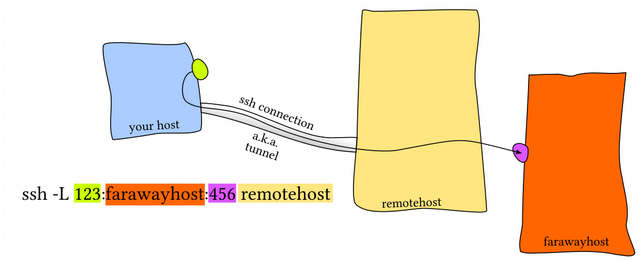
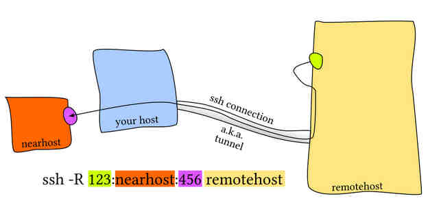

<div dir="rtl">

# 1.concepts

* نرم‌افزار termius نرم‌افزار ssh و scp و sftp و tunnel است که هم نسخه موبایلی و هم نسخه لینوکسی دارد و تخصصی در بحث ssh کار کرده است

```shell
ssh -t user@IP 'cd /usr/local/sbin; bash --login' # Login and execute command[such as cd]
scp [Server1Username]@[Server1_ip]:[Server1_Path] [Server2Username]@[Server2_ip]:[Server2_Path]
ssh -o StrictHostKeyChecking=no -l root ${peer}

```

</div>

# 2.files

* sshd_config: فایل تنظیماتی سرویس «اس‌اس‌اچ» سرور(یعنی سرویس «اس‌اس‌اچ» سرور چه تنظماتی داشته باشد)
* ssh_config: فایل تنظیماتی کلاینتی «اس‌اس‌اچ»(یعنی در هنگام «اس‌اس‌اچ» به سرورهای متفاوت چه تنظیماتی داشته باشد)
* ~/.ssh/known_hosts: Contains a list of host keys for all hosts the user has logged into that are not already in the systemwide list of known host keys(fingerprint).
* ~/.ssh/authorized_keys: اگر کلید عمومی کسی رو در این فایل قرار بدهیم دیگر از او پسورد نمی‌گیرد و مستقیما لاگین می‌نماید
    * هر سروری که کلید عمومی آن در فایل authorized_keys موجود باشد می‌تواند بدون وارد کردن پسورد در سرور لاگین نماید
    * این فایل تنها باید توسط مالک خود قایلیت خواندن و نوشتن داشته باشد و نه دیگران
* /home/user/.ssh/id_rsa : حاوی کلید خصوصی است
* /home/user/.ssh/id_rsa.pub: حاوی کلید عمومی است

## configuration

* PubkeyAuthentication: آیا احراز هویت با استفاده از کلید عمومی (Public Key Authentication) مجاز است یا خیر
    * yes: احراز هویت با کلید عمومی مجاز و سرور به کلیدهای عمومی کلاینت‌ها توجه می‌کند
    * no: احراز هویت با کلید عمومی غیرفعال می‌شود و کلاینت‌ها نمی‌توانند از روش احراز هویت با استفاده از کلید عمومی برای احراز هویت استفاده کنند
* ClientAliveCountMax: تعیین حداکثر تعداد پیام‌های alive با قابلیت بدون پاسخ ماندن از کلاینت و در غیر اینصورت قطع اتصال
* ClientAliveInterval(برحسب ثانیه):
    * تعیین مقدار زمان ارسال پیامalive به کلاینت و اگر کلاینت به این پیام‌ها پاسخ ندهد و زمان تعریف شده (که باClientAliveCountMaxتعیین می‌شود) بگذرد، سرور اتصال را قطع می‌کند
    * اگر ClientAliveIntervalبرابر60ثانیه وClientAliveCountMaxبرابر3باشد،سرور هر۶۰ثانیه یک بار پیام "alive" ارسال می‌کند و اگر کلاینت به 3 پیام متوالی پاسخ ندهد، سرور اتصال را قطع خواهد کرد
* ListenAddress: اگر چند کارت شبکه داشته باشیم با این مولفه تعیین می‌کنیم که از کدام آی پی (تنظیم شده روی کارت شبکه) «اس‌اس‌اچ» پذیفته شود
* PasswordAuthentication[sshd_config]:
    * no : فقط کسانی که کلید دارند می‌توانند لاگین نمایند
* AllowUsers: کاربران مجاز برای لاگین
* DenyUsers: کاربران غیر مجاز برای لاگین
* AllowGroups: گروه‌های مجاز لاگین
* DenyGroups: گروه‌های غیر غیرمجاز برای لاگین
* PermitRootLogin: آیا یوزر روت بتواند لاگین نماید یا خیر
* X11Forwarding: آیا رابط کاربری بتواند فوروارد شود
* AllowTcpForwarding: سرور بتواند پروتکل‌های تونل را بپذیرد
* LoginGraceTime: تعیین مدت زمان برای لاگین و احراز هویت یک کاربر به سیستم
    * defaults:2min
    * recommended:30s or 1m

# 3.options

* -D: forward all traffic of service
* -f: fork
* -N: Non login
* -o: اعمال تنظیمات داخل فایل کانفیگ بعنوان آپشن در لحظه اتصال
    * ssh -o StrictHostKeyChecking=no user@10.10.10.10

# 4.KEY

<div dir="rtl">

## ایحاد کلید عمومی و خصوصی

```shell
1-sudo apt-get install openssh-client
2-ssh-keygen -t rsa # ایجاد کلید عمومی و خصوصی برای اتصال بین سرورهایهس
  Enter file in which to save the key (/home/user/.ssh/id_rsa)
  Enter passphrase (empty for no passphrase) # can donot use passphrass
  Enter same passphrase again
3-check :
  Public Key: /home/user/.ssh/id_rsa.pub
  Private Key: /home/user/.ssh/id_rsa    
4-ssh-copy-id user@YourServerIPAddress
```

## copy publicKey

* دستور زیر سبب افزودن محتوی فایل rsa_key.pub سیستم خویش در انتهای فایل authorized_keys سرور مقصد می‌شود و نیاز به کپی دستی نخواهد بود
* نکته مهم: اگر سوییچ StrictHostKeyChecking=no را همراه -o ‌قرار دهید اگر کلید میزبان ناشناخته باشد، SSH به طور خودکار آن را به فایل known_hosts اضافه می‌کند و اتصال برقرار می‌شود.

```shell
# روش اول
ssh-copy-id user@10.0.20.2 # [OR] ssh-copy-id  -i ~/.ssh/id_rsa.pub user@10.0.20.2
ssh -o StrictHostKeyChecking=no user@10.0.20.2 # [OR] ssh -o StrictHostKeyChecking=no -l user 10.0.20.2

# روش دوم
cat ~/.ssh/id_rsa.pub | ssh User@YourServerIPAddress "mkdir -p ~/.ssh && cat >> ~/.ssh/authorized_keys"
# [OR] scp /home/user/.ssh/id_rsa.pub user@YourServerIPAddress:/home/user/.ssh
```

</div>

# 5.proxy

```shell
ssh -D <localPort> behrooz@<serverWithNet> #بَش مقصد نمایش داده میشود
ssh -D -N <localPort> behrooz@<serverWithNet> # بش مبدا همواره باز میماند و نمیتوان دستوری وارد کرد
ssh -f -D -N <localPort> behrooz@<serverWithNet> #بَش مبدا همچنان باقی است و دستورات درحالت فورک اجرا درآمده‌اند
```

## [Trick1](https://serverfault.com/questions/456960/how-to-force-all-packets-go-through-ssh-tunnel)

* client network: 10.0.50.0/24
* remote network10.0.99.0/24
* Check sshd_config configuration option PermitTunnel controls whether the server supports this
* from 10.1.1.1 to 10.1.1.2, provided that the SSH server running on the gateway to the remote network, at 192.168.1.15, allows it.

```shell
#On the client:
ssh -f -w 0:1 192.168.1.15 true
ifconfig tun0 10.1.1.1 10.1.1.2 netmask 255.255.255.252
route add 10.0.99.0/24 10.1.1.2
#On the server:
ifconfig tun1 10.1.1.2 10.1.1.1 netmask 255.255.255.252
route add 10.0.50.0/24 10.1.1.1
```

## Trick2-apt

در سیستم دارای اینترنت دستور زیر را بزنید

```shell
echo 'Acquire::http::proxy "socks5h://127.0.0.1:XXXX"; ' >> /etc/apt/apt.conf.d/behrooz
```

در سیستم بدون اینترنت دستور زیر را بزنید

```shell
[ssh -f -N -D XXXX behrooz@systemWithInternet] # or [ssh -N -D XXXX behrooz@systemWithInternet]
```

### روش جایگزین

در سیستم بدون اینترنت دستور زیر را بزنید و در سیستم دارای اینترنت نیاز به زدن دستوری نیست

```shell
[ssh -f -N -D XXXX behrooz@systemWithInternet] # or [ssh -N -D XXXX behrooz@systemWithInternet]
[apt --option Acquire::HTTP::Proxy="socks5h://127.0.0.1:XXXX" update
```

## Trick3-yum

در سیستم دارای اینترنت دستور زیر را بزنید

```shell
echo "proxy=socks5h://localhost:xxxx" >> /etc/yum.conf
```

در سیستم بدون اینترنت دستور زیر را بزنید

```shell
[ssh -f -N -D XXXX behrooz@systemWithInternet] # or [ssh -N -D XXXX behrooz@systemWithInternet]
```

# 6.PortForwarding-tunnel(Local)

* AllowTcpForwarding yes
* Gatewayports yes



# 7.PortForwarding-tunnel(Remote)

* AllowTcpForwarding yes
* Gatewayports yes

