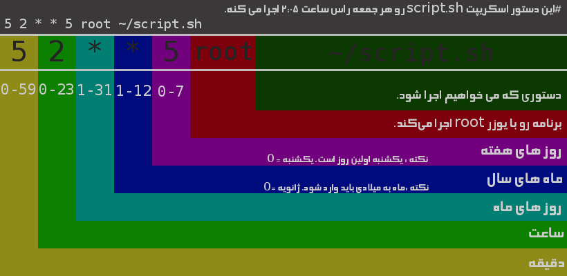

<div dir="rtl">

# 1. 🅰️ Init


## 1.1. 🅱️ SingleUserMode(Rescue)

* این مد که با نام Maintenance Mode نیز شناخته می شود در runlevel1 در SysVinit و rescue.target در Systemd اجرا می شود.
* زمانی از آن استفاده می کنیم که سیستم عامل قادر به انجام عملیات عادی خود نیست، مثلا وقتی که پارتیشنی دچار آسیب شده است، ریست کردن پسورد root و یا اصلاح خطاهای فایل fstab.
* سرویس هایی که در این سطح اجرا می شوند در نسخه های مختلف، متفاوت است اما بطور کلی هیچ سرویسی مربوط به شبکه در این سطح اجرا نمی شود.
* برای ورود به این مد در CentOS در پروسه بالا آمدن سیستم و پس از ورود به grub باید روی نسخه کرنل خود ایستاده و دکمه e را بزنید، سپس بدنبال خط کرنل گشته و قسمت ro را به‌شکل زیر تغییر داده و F10 را می زنیم:
* `rw init=/sysroot/bin/sh`
* در نهایت بعد از بالا آمدن single mode با استفاده از دستور /chroot /sysroot فایل سیستم را mount کرده و هر تغییری که می خواهیم، در سیستم عامل انجام داده و در آخر آنرا reboot می کنیم.
* در نهایت بعد از بالا آمدن single mode با استفاده از دستور /chroot /sysroot فایل سیستم را mount کرده و هر تغییری که می خواهیم، در سیستم عامل انجام داده و در آخر آنرا reboot می کنیم.

## 1.2. 🅱️ Systemd

* در مکانیزم systemd دو مفهوم unit و target وجود دارد.
* در SysVinit بصورت پیش فرض Runlevel 5 که بصورت چندکاربره، مد گرافیکی و همراه با شبکه است، فعال است اما در سیستم جدید Systemd نام معادل آن Runlevel5.target یا Graphical.target است.

</div>

* journalctl #لاگ‌های سیستم‌دی در این دستور نهفته است
    * journalctl #نمایش هرچه لاگ در سیستم دی وجود دارد
    * journalctl -b #نمایش تمام لاگ‌ها از زمان بوت سیستم تا اکنون
    * journalctl --since=today | nl | less
    * journalctl --since "1 hour ago"
    * journalctl --since "2024-02-05 14:08:01" #نمایش از یک زمان خاص
    * journalctl --until "2024-02-05 15:46:01" #نمایش تا یک زمان خاص
    * journalctl -f #باز گذاشتن فایل برای لاگ‌های جدید
    * journalctl -k #فقط نمایش پیام های کرنل
    * journalctl -u apache.service #فقط سرویس خاص
    * journalctl -p err #فیلتر بر اساس اولویت‌بندی
    * journalctl -r #خروجی را معکوس کن، ابتدا جدیدترین ورودی‌ها را نشان بده
    * journalctl -n 20 #تعداد خطوط نشان داده شده را محدود کن
    * journalctl --no-pager -n 1000 #در همین خروجی ترمینال نشان بده و وارد محیطی جدید مثل دستور لِس نشود
* systemctl
    * daemon-reload #لود مجدد تمامی سرویس‌ها درصورتی که سرویسی را پاک کردید و هنوز سیستم نفهمیده است
    * list-units #مشاهده واحد‌های فعال و غیر فعال
        * --all #نمایش همه اعم از فعال و غیرفعال
        * --type=[service | socket | target | mount | automount | swap | timer | path | slice | scope | generator ]
            * دستور بالا فقط فعال ها را نمایش میدهد و اگر بخواهید غیر فعال را نمایش دهد باید سوییچ «آل» را استفاده نمایید
            * service: مدیریت daemon ها
            * socket: مدیریت SocketActivation
            * target: به گروه‌بندی واحدهای دیگر کمک می‌کنند و معمولاً برای مدیریت وابستگی‌ها و ترتیب بارگذاری استفاده می‌شوند
            * mount: نقاط اتصال (mount points)
            * automount:
            * swap: مدیریت فضای سوآپ
            * timer: به زمان‌بندی اجرای سرویس‌ها کمک می‌کنند
            * path: واحدهایی که به نظارت بر تغییرات در سیستم فایل مربوط می‌شوند و می‌توانند سرویس‌ها را فعال کنند
            * slice: گروه‌بندی فرآیندها و مدیریت منابع مربوط می‌شوند
            * scope:
            * generator: به طور خودکار توسط «سیستم‌دی» ایجاد می‌شوند و معمولاً برای پیکربندی‌های خاص یا موقتی استفاده می‌شوند
        * --state=[running | enabled | disabled | failed | inactive | active | activating | deactivating | reloading | masked | unmasked]
            * masked: واحدهایی که به طور کامل غیرفعال شده‌اند و نمی‌توانند به هیچ شکلی اجرا شوند. این وضعیت معمولاً برای جلوگیری از راه‌اندازی یک واحد استفاده می‌شود
            * unmasked: واحدهایی که به حالت غیرفعال یعنی «مَسکِد» درآمده‌اند و اکنون می‌توانند دوباره فعال شوند.
    * list-unit-files تمام واحدهای موجود
    * is-enabled: output may be[enabled|disabled|static|masked]
        * static:‌سرویس بصورت استاتیک پیکربندی شده یعنی نمی‌توان بصورت مستقیم فعال یا غیرفعال کرد. معمولاً برای سرویس‌هایی است که به دیگر واحدها وابسته هستند و به طور خودکار توسط آن‌ها فعال می‌شوند
        * masked: سرویس بطور کامل غیرفعال شده و نمی‌تواند به هیچ شکلی اجرا شود. معمولاً برای جلوگیری از راه‌اندازی یک واحد استفاده می‌شود
        * `sudo systemctl is-enabled ssh.service`
    * --failed: such as [systemctl --state=failed]
    * get-default: show current run level
        * `sudo systemctl get-default` ----> graphical.target
    * [status|stop|start|enable|disable|condrestart] ServiceOrUnitName
        * --now #فعال کردن درعین حال استارت کردن
            * systemctl enable MyService --now
        * condrestart: اگر سرویس در حال اجرا باشد آن را متوقف کرده و سپس دوباره راه‌اندازی می‌کند و اگر در حال حاضر خاموش باشد این دستور هیچ کاری نکرده و هیچ خطایی تولید نمیکند
        * `systemctl status ssh.socket` #نمایش وضعیت سوکت
            * هنگام استفاده از تکنولوژی Socket Activation


* Socket Activation: به سرویس‌ها اجازه می‌دهد تا تنها در زمان نیاز و با استفاده از سوکت‌ها (sockets) راه‌اندازی شوند و همواره سرویس بالا نباشد تا ریسورس بگیرد.
    * برای این‌کار باید دو یونیت داشته باشیم مثلا[/etc/systemd/system/ssh.socket] و [/etc/systemd/system/ssh.service]
    * فرض شود که هردو غیر فعال است. هنگام فعال سازی سوکت، یونیت سرویس همچنان غیر فعال است تا زمانی که مثلا یک «اس‌اس‌اچ» ورودی داشته باشیم پس آنگاه سرویس به وضعیت فعال در می‌آید
* [Path]
    * /lib/systemd/system #همه یونیت‌ها اینجا تعریف می‌شوند. حتی ران لول‌ها هم اینجا تعریف می‌شوند.مثلا سرویس «اس‌اس‌اچ»
* [Syntax]
    * <after>: network.target #یعنی برای اینکه یونیت «اس‌اس‌اچ» بالا بیاید باید حتما سرویس نتورک فعال باشد
    * <wants>: XYZ #سرویس «اس‌اس‌اچ» برای بالا آمدن نیاز به داشتن این موارد است

```shell
sudo systemctl suspend #StandBy
```

<div dir="rtl">

### 1.2.1. ✅️ units

* اگر در بخش بلاک`[Service]` یک یونیت مثلا با نام  `Salam.service` از دو کانفیگ `StandardOutput=journal` و `StandardError=journal` استفاده کنید آنگاه با دستور زیر می‌توان لاگ‌های آن سرویس را مشاهده نمایید
    * `sudo journalctl -u Salam.service -f`

### 1.2.2. ✅️ sysctl

* عامل کنترلی سرویس Systemd دستور sysctl است
* دستور sysctl برای اصلاح تنظیمات کرنلی موجود در proc

```shell
sysctl -a #view all current kernel parameters
sysctl -n net.ipv4.ip_forward #print only values and do nothing
sysctl -w net.ipv4.ip_forward=1 #temporary until reboot, enable IPv4 packet forwardingecho 1 > /proc/sys/net/ipv4/ip_forward #(same above) enable IPv4 packet forwarding
sysctl -p #reload all configure even new custom configure /etc/sysctl.conf
sysctl –w net.ipv4.ip_forward=1 || echo 1> /proc/sys/net/ipv4/ip_forward #ایجاد قابلیت فوروارد نمودن یک بسته به یک ریموت هاست
sysctl -w net.ipv6.conf.all.forwarding=1 || echo 1 > /proc/sys/net/ipv6/conf/all/forwarding #ایجاد قابلیت فوروارد نمودن یک بسته به یک ریموت هاست
```

### 1.2.3. 📁️ /etc/sysctl.conf

`fs.file-max = <new_limit> #حداکثر تعداد فایل‌هایی است که می‌توانند به طور همزمان در سیستم باز باشند`

## 1.3. 🅱️ SysV

* سیستم۵ هم گفته می‌شود
* در SysVinit بصورت پیش فرض Runlevel 5 که بصورت چندکاربره، مد گرافیکی و همراه با شبکه است، فعال است اما در سیستم جدید Systemd نام معادل آن Runlevel5.target یا Graphical.target است.

```
/etc/inittab: #syntax is "<Id>:<Runlevel>:<Action>:<Process>"
/etc/init.d/rc[0-6] #runlevel process
/etc/init.d/rc[0-6].d #runlevel process

```

```shell
chkconfig # نمایش وضعیت ران‌لِوِل‌ها
chkconfig --level 123 network on # روشن کردن شبکه در ران لول ۱ و ۲ و ۳
```

## 1.4. 🅱️ Upstart

- همانند SystemD می‌باشد که توسط کنونیکال ارائه و استقبال نشد
- قابلیت اجرای کاری پس از وصل شده دیوایس به سیستم را دارا بود

```shell
start <service>
stop <service>
```

# 2. 🅰️ LOG

## 2.1. 🅱️ rSyslog

### 2.1.1. ✅️ Options

Facility.[priority|severity] action

- **Facility**: Facilities are simply categories
    - kern: Kernel messages
    - user: User-level messages
    - mail: Mail system
    - daemon: System daemons
    - auth: Security/authentication messages
    - syslog: Messages generated internally by syslogd
    - lpr: Line printer subsystem
    - news: Network news subsystem
    - uucp: UUCP subsystem
    - cron: Cron subsystem
    - authpriv: Security/authentication messages
    - ftp: FTP daemon
    - ntp: NTP subsystem
    - security: Log audit
    - console: Log alert
    - solaris-cron: Scheduling daemon
    - local0 – local7: Locally used facilities[local defined application message]
- **Severity or priority level**
    - emerg: System is unusable[A panic condition]
    - alert: Action must be taken immediately[A condition that should be corrected immediately, such as a corrupted system database]
    - crit: Critical conditions[Hard device errors]
    - err: Error conditions
    - warning: Warning conditions
    - notice: Normal but significant conditions[Conditions that are not error conditions, but that may require special handling]
    - info: Informational messages[Confirmation that the program is working as expected]
    - debug: Debug-level messages[Messages that contain information normally of use only when debugging a program]
- prefixes with priorities
    - *.notice (no prefix) → any event with priority of `notice' or higher
    - *.!notice → no event with priority of `notice' or higher
    - *.=notice → only events with priority `notice'
    - *.!=notice → no events with priority of `notice'
- Example:
    - kern.info = kernel logs with info priority and higher.
    - kern.=info = only kernel messages with info priority.
    - kern.info;kern.!err = only kernel messages with info, notice, and warning priorities.
    - kern.debug;kern.!=warning = all kernel priorities except warning.
    - kern.* = all kernel priorities messages.
    - kern.none = don’t log any related kernel facility messages regardless of the priority.
- **Action**:
    - /some/file → Log to specified file
    - -/some/file → Log to specified file but don't sync afterwards
    - /some/pipe → Log to specified pipe
    - /dev/some/tty_or_console → Log to specified console
    - @remote.hostname.or.IP → Log to specified remote host
    - username1, username2, etc → Log to these users' screens
    - \* → Log to all users' screens

### 2.1.2. 📁️ /etc/rsyslog.conf

```shell
sudo vim /etc/rsyslog.conf
*.* @@192.168.100.10:514 
#@@: TCP
# @: UDP
sudo systemctl restart rsyslog

```

```shell
vim /etc/rsyslog.conf:
:syslogtag, isequal, "salamm:" /var/log/behroooz.log #tag
auth.info /var/log/beh_auth_info.log
user.=warn /var/log/beh_user_warn.log
```

1. Verify Rsyslog Installation

  ```shell
  rpm -q | grep rsyslog
  rsyslogd -v
  # if not exist[yum install rsyslog7]
  ```

2. Edit:`sudo vim /etc/rsyslog.conf`
   ```shell
   $template RemoteLogs,"/var/log/%HOSTNAME%/%PROGRAMNAME%.log"
     *.* ?RemoteLogs
     & stop

     #################
     #### MODULES ####
     #################
     module(load="imuxsock") # provides support for local system logging
     module(load="imklog")   # provides kernel logging support
     #module(load="immark")  # provides --MARK-- message capability

     # provides UDP syslog reception
     module(load="imudp")
     input(type="imudp" port="514")
     
     # provides TCP syslog reception
     module(load="imtcp")
     input(type="imtcp" port="514")
   ```
3. `sudo systemctl restart rsyslog`
4. `sudo ss -tulnp | grep "rsyslog"`
   ```shell
    udp   UNCONN 0      0              0.0.0.0:514        0.0.0.0:*    users:(("rsyslogd",pid=9727,fd=6))                                                                         
    udp   UNCONN 0      0                 [::]:514           [::]:*    users:(("rsyslogd",pid=9727,fd=7))                                                                         
    tcp   LISTEN 0      25             0.0.0.0:514        0.0.0.0:*    users:(("rsyslogd",pid=9727,fd=8))                                                                         
    tcp   LISTEN 0      25                [::]:514           [::]:*    users:(("rsyslogd",pid=9727,fd=9))
   ```

5. Manage SELinux
   ```shell
   sudo semanage -a -t syslogd_port_t -p udp 514
   sudo semanage -a -t syslogd_port_t -p tcp 514 
   ```
6. Manage Firewall
   ```shell
   ------------- On CentOS ------------- 
   sudo firewall-cmd --permanent --add-port=514/udp
   sudo firewall-cmd --permanent --add-port=514/tcp
   sudo firewall-cmd --reload

   ------------- On Ubuntu -------------
   sudo ufw allow 514/udp
   sudo ufw allow 514/tcp
   sudo ufw reload 
   ```

## 2.2. 🅱️ LogRotate

* هنگامی که در یک سرور لاگ به تعداد زیاد تولید م‌شود ممکن است یک فایل لاگ حجیم شده و سبب کندی سرور گردد. به همین جهت لاگ‌های قدیمی تر را برحسب سفارشی سازی از فایل اصلی لاگ جدا می‌نماییم

```shell
logrotate [--force] [--debug] [--state file] [--skip-state-lock] [--verbose] [--log file] [--mail command] config_file [config_file2 ...]
#OPTIONS:
#   [-f,--force]:   Tells logrotate to force the rotation, even if it doesn't think this is necessary
#   [-v,--verbose]: Turns on verbose mode, for example to display messages during rotation
```

### 2.2.1. ✅️ Options

`- FullFileName { # مسیر کامل فایل لاگ که قرار است آن را روتیت کنیم

- [hourly | daily | weekly | monthly | yearly] # عملیات روزانه یا هفتگی یا ماهانه صورت بگیرد
- [rotate n] # چه تعداد از فایل‌های آرشیو شده نگهداری شود
- [compress | nocompress] # فشرده سازی
- [delaycompress] # فایل آرشیوی یکی مانده به آخر را زیپ نکن
- [missingok] # If the log file is missing, go on to the next one without issuing an error message
- [notifempty] # Do not rotate the log if it is empty (this overrides the ifempty option)
- [create 0755 <user> <group>] # فایل با چه سطح دسترسی ذخیره شود
- [postrotate] # دستوراتی که مایل هستیم پس از روتیتی کردن انجام شود
- [prerotate] # دستوراتی که مایل هستیم پیش از روتیتی کردن انجام شود
- [endscript] # اتمام دستورات دلخواه
- [size <size>] #انتخاب سایز فایل‌ها
- Log files are rotated only if they grow bigger than size bytes
- k → kilobytes
- M → megabytes
- G → gigabytes

- }`

```shell


vim /etc/logrotate.d/apache2

/var/log/apache2/*.log {
    daily
    missingok
    rotate 14
    compress
    delaycompress
    notifempty
    create 640 root adm
    sharedscripts
    prerotate
	if [ -d /etc/logrotate.d/httpd-prerotate ]; then
	    run-parts /etc/logrotate.d/httpd-prerotate
	fi
    endscript
    postrotate
	if pgrep -f ^/usr/sbin/apache2 > /dev/null; then
	    invoke-rc.d apache2 reload 2>&1 | logger -t apache2.logrotate
	fi
    endscript
}
```

### 2.2.2. ✅️ [server](https://access.redhat.com/documentation/en-us/red_hat_enterprise_linux/6/html/deployment_guide/s1-basic_configuration_of_rsyslog)

```
$template RemoteLogs,"/var/log/%fromhost-ip%_%HOSTNAME%/%PROGRAMNAME%.log"
*.* ?RemoteLogs →  برای همه سطوح از لایه‌ها تنظیمات مربوط به تمپلیت ریموت لاگ را درنظر بگیر
& STOP
```

### 2.2.3. ✅️ tag

```
1-add end of [/etc/rsyslog.conf]: # ریختن تمام لاگ‌ها که تگ آن سلام باشد به درون یک فایل خاص
 :syslogtag, isequal, "salamm:"      /var/log/behroooz.log
2- COMMAND | logger -t salamm 
3-tail -f /var/log/behroooz.log
```

### 2.2.4. ✅️ Template

* [MessageProperties](https://www.rsyslog.com/doc/v8-stable/configuration/properties.html)
    * [msg]: the MSG part of the message (aka “the message” ;))
    * [rawmsg]: the message “as is”. Should be useful for debugging and also if a message should be forwarded totally unaltered. Please notice EscapecontrolCharactersOnReceive is enabled by default, so it may be different from what was received in the socket.
    * [rawmsg-after-pri]: Almost the same as rawmsg, but the syslog PRI is removed. If no PRI was present, rawmsg-after-pri is identical to rawmsg. Note that the syslog PRI is header field that contains information on syslog facility and severity. It is enclosed in greater-than and less-than characters, e.g. “<191>”. This field is often not written
      to log files, but usually needs to be present for the receiver to properly classify the message. There are some rare cases where one wants the raw message, but not the PRI. You can use this property to obtain that. In general, you should know that you need this format, otherwise stay away from the property.
    * [hostname]: hostname from the message
    * [source]: alias for HOSTNAME
    * [fromhost]: hostname of the system the message was received from (in a relay chain, this is the system immediately in front of us and not necessarily the original sender). This is a DNS-resolved name, except if that is not possible or DNS resolution has been disabled.
    * [fromhost-ip]: The same as fromhost, but always as an IP address. Local inputs (like imklog) use 127.0.0.1 in this property.
    * [syslogtag]: TAG from the message
    * [programname]: the “static” part of the tag, as defined by BSD syslogd. For example, when TAG is “named[12345]”, programname is “named”.
    * [pri]: PRI part of the message - undecoded (single value)
    * [pri-text]: the PRI part of the message in a textual form with the numerical PRI appended in brackets (e.g. “local0.err<133>”)
    * [iut]: the monitorware InfoUnitType - used when talking to a MonitorWare backend (also for Adiscon LogAnalyzer)
    * [syslogfacility]: the facility from the message - in numerical form
    * [syslogfacility-text]: the facility from the message - in text form
    * [syslogseverity]: severity from the message - in numerical form
    * [syslogseverity-text]: severity from the message - in text form
    * [syslogpriority]: an alias for syslogseverity - included for historical reasons (be careful: it still is the severity, not PRI!)
    * [syslogpriority-text]: an alias for syslogseverity-text
    * [timegenerated]: timestamp when the message was RECEIVED. Always in high resolution
    * [timereported]: timestamp from the message. Resolution depends on what was provided in the message (in most cases, only seconds)
    * [timestamp]: alias for timereported
    * [protocol-version]: The contents of the PROTOCOL-VERSION field from IETF draft draft-ietf-syslog-protocol
    * [structured-data]: The contents of the STRUCTURED-DATA field from IETF draft draft-ietf-syslog-protocol
    * [app-name]: The contents of the APP-NAME field from IETF draft draft-ietf-syslog-protocol
    * [procid]: The contents of the PROCID field from IETF draft draft-ietf-syslog-protocol
    * [msgid]: The contents of the MSGID field from IETF draft draft-ietf-syslog-protocol
    * [inputname]: The name of the input module that generated the message (e.g. “imuxsock”, “imudp”).
        * Note that not all modules necessarily provide this property. If not provided, it is an empty string.
    * [jsonmesg]
* SystemProperties
    * [timereported]: contains the timestamp that is contained within the message header.
        * Ideally, it resembles the time when the message was created at the original sender
        * Depending on how long the message was in the relay chain, this can be quite old.
    * [timegenerated]: contains the timestamp when the message was received by the local system.
        * Here “received” actually means the point in time when the message was handed over from the OS to rsyslog’s reception buffers, but before any actual processing takes place.
        * This also means a message is “received” before it is placed into any queue. Note that depending on the input, some minimal processing like extraction of the actual message content from the receive buffer can happen.
        * If multiple messages are received via the same receive buffer (a common scenario for example with TCP-based syslog), they bear the same timegenerated stamp because they actually were received at the same time.
    * [$now]: is not from the message. It is the system time when the message is being processed.
        * There is always a small difference between timegenerated and $now because processing always happens after reception.
        * If the message is sitting inside a queue on the local system, the time difference between the two can be some seconds up to several hours in extreme cases where a message is sitting inside a disk queue (e.g. due to a database outage).
        * The timereported property is usually older than timegenerated, but may be totally different due to differences in time and time zone configuration between systems
    * [$bom]: The UTF-8 encoded Unicode byte-order mask (BOM). This may be useful in templates for RFC5424 support, when the character set is know to be Unicode.
    * [$myhostname]: The name of the current host as it knows itself (probably useful for filtering in a generic way)


# 3. 🅰️ Hosting

* نرم‌افزارهای زیر سرویس هاستینگ ارائه می‌دهند
    * VirtualMin:
        * _OpenSource_
    * DirectAdmin: کاربری ساده
        * نیازمند لایسنتس
    * CPanel: کاربری ساده
        * نیازمند لایسنتس
    * aaPanel: کاربری پیچیده و پیشرفته
        * _OpenSource_
    * CyberPanel: کاربری پیچیده و پیشرفته
        * _OpenSource_
* نکات
    * نکته: برای لینک ارائه سرویس خدمات هاستینگ بهترین گزینه فیبر است: سرعت دانلود و آپلود یکسان(متقارن) مید‌هد
    * نکته: لینک tdlte لینک اشتراکی ارائه می‌دهد ولی تضمین می‌کند از یه مقدار کف سرعت پایین‌تر نمی‌رود ولی لینک سرعت دانلود و آپلود متقارن نیست

# 4. 🅰️ Automations

## 4.1. 🅱️ Cron

```shell
30 20 * * * export DISPLAY=:0.0 && xeyes
@reboot  #→ Run once,at startup
@yearly  #→ Run once a year,"0 0 1 1 *"
annually #→ (same as @yearly)
@monthly #→ Run once a month, "0 0 1 * *"
@weekly  #→ Run once a week, "0 0 * * 0"
@daily   #→  Run once a day, "0 0 * * *"
midnight #→ (same as daily)
@hourly  #→  Run once an hour, "0 * * * *"

```

* crontab
    * `/var/spool/cron/username`
    * `/etc/crontab`
    * `/etc/cron.d/`
    * `/etc/cron.hourly`
    * `/etc/cron.daily`
    * `/etc/cron.weekly`
    * `/etc/cron.monthly`
    * `/etc/cron.allow`
    * `/etc/cron.deny`
    * export DISKPLAY=:0 && COMMAND
    * export DISKPLAY=:0.0&& COMMAND



## 4.2. 🅱️ At

* این برنامه برای اجرای دستور تنها یکبار مورد استفاده قرار میگیرد
* در هر خط یک دستور
* خروج:  ctrl+d
* دستورات در شل بنام sh اجرا خواهند شدیعنی bin/sh/

```shell
at now + 1 min #برنامه‌ریزی یک دستور در یک دقیقه بعد
at tomorrow #برنامه‌ریزی یک دستور در روز بعد در زمان اکنون
atq #مشاهده تمام کارهای موجود در صف انتظار
atrm 3 #حذف یک کار موجود در صف انتظار برحسب شماره آن
at 21:30 2014-07-1
```

</div>