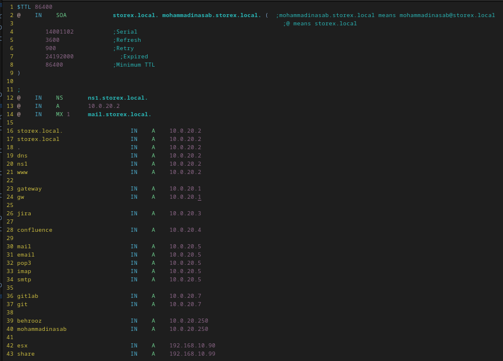
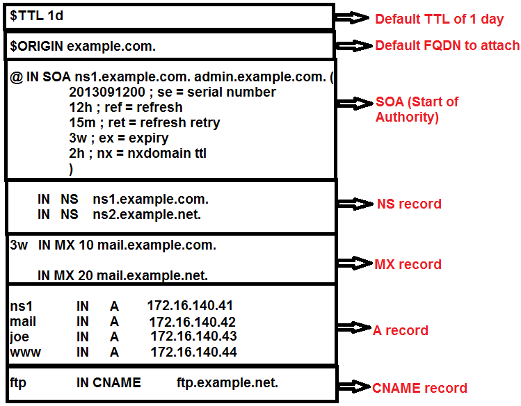
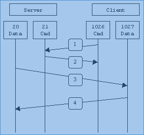
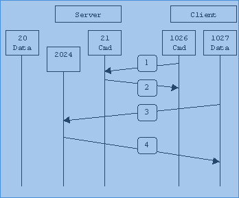

<div dir="rtl">

# 📍️ Bind|DNS

- Top Level Domain یا TLD : سطح com یا ir یا net یا org در DNS
- First Level Domain یا FLD : نام itsee در دامنه itsee.ir
- ICANN: سازمانی که نام‌های DNS یعنی TLD یا FLD را مدیریت می‌کند
- DNSSec : پاسخ که از سرور میآید را sign میکند و من مطمئن میشوم که دقیقا از سرور مقصد آمده
- دستور named-checkzone یا named-checkconf : بررسی صحت اطلاعات موجود در فایل تنظیمات
- دیتا پس از resolve شدن کش می‌شود و نوبت بعدی خیلی سریع‌تر resolve پاسخ داده خواهد شد
- DNS Master: سروری که ادعا میکند صاحب یک زون است(یعنی خودم جواب را بلدم) و همچنین مواردی که بلد نیست را از Forward می‌پرسد
- در DNS در فایل zone مقدار TTL برحسب ثانیه است و میگوید این رکورد تا فلان ثانیه معتبر است
- در DNS در فایل zone در هر زون باید حداقل یک SOA یعنی Start Of Authority داشته باشند که معرفی اطلاعات است
- در DNS در فایل zone علامت @ به نام زون اشاره دارد که نمی‌خواهد هردفعه نام آن را تکرار کند- در DNS در فایل zone عبارت یعد از SOA نام دامنه و عبارت بعدی آدرس ایمیل به شکل بدون @ آورده می‌شود که یجای نقطه علامت @ می‌گذاریم
- در DNS در فایل zone هر بار که این فایل را تغییر بدهیم باید عدد serial را یک عدد بالاتر ببریم تا DNS آن را لود نماید
- در DNS در فایل zone کلمه cname یک alias است که موضوع www زدن یا نزدن را handle میکند




# 📍️ Email

## Concepts

- ایمیل سرور در لینوکس به ۳نقش اساسی تقسیم می‌شوند(مرز آنها نزدیک‌به هم هستند و ممکن است یک برنامه کار دیگری را نیز انجام دهد)
    - [MTA]: مخفف MailTransferAgent است و کار آن ارسال ایمیل است
    - [MDA]: مخفف MailDeliveryAgent است وکار آن رساندن نامه به مقصد تحت سیاست یا policy خاص یا مسیر ذخیره سازی خاص یا فرمت ذخیره سازی خاص و غیره است
    - [MUA]: مخفف MailUserAgent است و کار آن ارتباط با کاربر است برای خواندن یک نامه
- Sieve: مکانیزمی برای ایجاد یک قانون جدید به‌طور مثال اگر یک کلمه در عنوان بود آن را به دایرکتوری خاص منتقل بنماید
- توسط دو برنامه زیر امکان ریموت زدن از کلاینت به سرور و دیدن ایمیل‌های موجود در سرور توسط imap و pop3 مهیا می‌شود
    - ۱-Courier: خیلی بزرگ هست و معمولا در استفاده محدود میکنند به ریموت زدن به ایمیل سرور و دریافت داده ها از سرور
    - ۲-Dovecot: اصولا برای استفاده در پروتکل imap استفاده می‌شود ولی می‌تواند برای pop3 نیز مورد استفاده قرار گیرد
- معروف‌ترین MDA ها
    - [Binmail]: استفاده از فایل var/spool//mail همچنین می‌توان تنظیم کرد تا از دایرکتوری Home/mail$ نیز استفاده نماید و برنامه mail یعنی خط فرمان دستور mail تایپ کنیم را بعنوان ابزار توصیه میکند
    - [Procmail] قواعد قرار میدهد مثلا میگوید اگر چیزی تحت عنوان فلان دیدی آن را حذف یا به دایرکتوری فلان منتقل کن
- mbox: یک فایل متنی خیلی بزرگ که همه ایمیل‌ها در آن هست و با آمدن هر نامه به انتهای این فایل متنی اضافه می‌شود
- نحوه‌های ذخیره‌سازی نامه‌ها یعنی User MailBox به روش‌های زیر است
    - ۱-[/var/spool/mail[ files]: به این متد استفاده از mBox نیز گفته می‌شود
    - ۲-[$HOME/mail]: برای هر کاربر مسیر جداگانه با محتوی متفاوت ایجاد می‌کند
    - ۳-aildir-style mailbox directories]: به این متد استفاده از maildir گفته می‌شود و دراین روش برای Inbox و دیگر پوشه‌ها یک دایرکتوری متفاوت ایجاد میکند و قابلیت ساخت دایرکتوریهای متفاوت مهیا است
- از معروف‌ترین MTA ها
    - ۱-[sendmail]:قدیمی‌تر و کانفیگ سخت‌تر و خیلی بزرگ است. سخت است و یک برنامه بنام M4 تنظیمات را میگیرد و تبدیل میکند به فایل با فرمت cf که قابل فهم برای sendmail است که استفاده نمی‌شود
    - ۲-[postfix]: توسط یوزر postfix اجرا می‌شود. آسان‌تر و معمول‌تر می‌باشد. ماژولار است و ماژول‌ها جدای از هم کارها را انجام می دهند و بعد میایند پایین. یک برنامه core بنام master در مسیر /usr/sbin/postfix/master دارد که اجزای متفاوت را در زمان مورد نیاز run میکند
    - ۳-[exim]:
- اینترفیس کاربران برای زمانیکه می‌خواهیم از اینباکس ایمیل‌ها را بخوانیم که از مشهور‌ترین های آن موارد زیر است
    - [mail]: برنامه ساده که در ترمینال می‌توان آن را مشاهده کرد
    - [evolution]
    - [thunderbird]
- MIME: یک نامه همزمان در وضعیت html و plainText و غیره دریافت می‌شود و برنامه تعیین میکند که تحت چه وضعتی به کاربر نمایش دهد
-

```
[SMTP Server(Outgoing Messages) ]-[Non-Encrypted]-[AUTH]-[25(or 587)]
[SMTP Server(Outgoing Messages) ]-[Secure(TLS)]-[StartTLS]-[587]
[SMTP Server(Outgoing Messages) ]-[Secure(SSL)]-[SSL]-[465]
[POP3 Server(Incoming Messages)]-[Non-Encrypted]-[AUTH]-[110]
[POP3 Server(Incoming Messages)]-[Secure(SSL)]-[SSL]-[995]

[Gmail]:
[SMTP Server(Outgoing Messages)]-[smtp.gmail.com]-[SSL]-[465]
[SMTP Server(Outgoing Messages)]-[smtp.gmail.com]-[StartTLS]-[587]
[POP3 Server(Incoming Messages)]-[pop.gmail.com]-[SSL]-[995]

[Yahoo]:
[SMTP Server(Outgoing Messages)]-[smtp.mail.yahoo.com]-[SSL]-[465]
[POP3 Server(Incoming Messages)]-[pop.mail.yahoo.com]-[SSL]-[995]

```

- برای راه‌اندازی میل سرور و ارسال ایمیل باید در دی ان اس ptr ست شده باشد در غیر این صورت ایمیل های ارسالی به بسیاری از میل سرور ها قبول نمی شود.
    - ۱-برای set کردن ptr باید از isp درخواست کرد که این کار را انجام دهد و برای هر ip تنها یک PTR می توان ست کرد
    - ۲-راه حل دوم استفاده smtp autentication است برای این کار یک سرور که ptr دارد را با وصل شدن به آن ایمیل ها را از آن طریق ارسال می کنیم باید در postfix یا sendmail یا هر سرویس ایمیل دیگری ست کنیم که از سرور دیگر برای ارسال ایمیل ها استفاده کن

```shell


# Ubuntu
sudo apt-get install postfix libsasl2 ca-certificates libsasl2-modules

#Fedora
yum install cyrus-sasl postfix ca-certificates

# این ها رو هم نصبشون اختیاری هستش
dovecot system-switch-mail system-switch-mail-gnome

# حالا تنظیمات postfix رو برای افزودن تغییرات ادیت می کنیم
sudo nano /etc/postfix/main.cf

# این خط ها رو بهش اضافه می کنیم
relayhost = [smtp.gmail.com]:587
smtp_sasl_auth_enable = yes
smtp_sasl_password_maps = hash:/etc/postfix/sasl_passwd
smtp_sasl_security_options = noanonymous
smtp_tls_CAfile = /etc/postfix/cacert.pem
smtp_use_tls = yes

# حالا نام کاربری و رمز عبور اکانتی که در جیمیل ساختیم رو ست می کنیم
sudo nano /etc/postfix/sasl_passwd
[smtp.gmail.com]:587 user.name@gmail.com:password

#‌حالا sasl password رو فعال می کنیم
sudo chmod 400 /etc/postfix/sasl_passwd
sudo postmap /etc/postfix/sasl_passwd

#‌نیاز به certifcate داریم پس می سازیمشون
openssl req -new -x509 -keyout cakey.pem -out cacert.pem -days 3650
openssl req -nodes -new -x509 -keyout sendmail.pem -out sendmail.pem -days 3650

#‌می تونیم از فایل /usr/share/ssl/ca-bundle.crt هم استفاده کنیم به هر ترتیب باید این دستور رو بزنیم
cat /etc/ssl/certs/[created_cert.pem] | sudo tee -a /etc/postfix/cacert.pem

# حال postfix رو ریلود می کنیم
sudo /etc/init.d/postfix reload
systemctl reload postfix
```

## IMAP(Internet Message Access Protocol)

- دریافت ایمیل تحت پروتکل imap از طریق کامند‌لاین که از پورت ۱۴۳ استفاده می‌کند

```shell
rich@myhost:~$ telnet localhost 143
Trying 127.0.0.1...
Connected to localhost.
Escape character is '^]'.
* OK [CAPABILITY IMAP4rev1 UIDPLUS CHILDREN NAMESPACE THREAD=ORDEREDSUBJECT
THREAD=REFERENCES SORT QUOTA IDLE ACL ACL2=UNION] Courier-IMAP ready. Copyright
1998–2011 Double Precision, Inc. See COPYING for distribution information.
a001 LOGOUT
* BYE Courier-IMAP server shutting down
a001 OK LOGOUT completed
Connection closed
```

```shell
APPEND Appends a message to the end of a mailbox
CAPABILITY Requests a list of capabilities of the IMAP server
CHECK Creates a checkpoint for the mailbox
CLOSE Closes the open mailbox
COPY Copies messages between mailboxes
CREATE Creates a new mailbox
DELETE Deletes a mailbox
EXAMINE Opens a mailbox in read-only mode
EXPUNGE Removes all messages from a mailbox tagged for deleting
FETCH Retrieves the text of a specified message
LIST Retrieves a list of all mailboxes
LOGOUT Logs out from the current server
LSUB Retrieves a list of only active mailboxes
NOOP Performs no operation
RENAME Renames a mailbox
SEARCH Searches messages in an active mailbox that match a search string
SELECT Selects an active mailbox
STATUS Requests the status of a mailbox
STORE Alters information associated with a message
SUBSCRIBE Adds a mailbox to the list of active mailboxes (اگر میل‌باکس تغییر کرد متوجه بشویم)UID Sets message references to the UID number instead of the
sequence number
UNSUBSCRIBE Removes a mailbox from the list of active mailboxes

```

## POP(Post Office Protocol)

- دریافت ایمیل POP3 از طریق کامند لاین که از پورت ۱۱۰ استفاده میکند

```shell
1-
rich@myhost:~$ telnet localhost 110
Trying 127.0.0.1...
Connected to localhost.
Escape character is '^]'.
+OK Hello there.
QUIT
+OK Better luck next time.
Connection closed by foreign host.
rich@myhost:~$
```

دستورات زیر کامندهای سمت کلاینت پروتکل pop3 است

```shell
STAT Returns current status of the mailbox
LIST Returns a brief list of mailbox messages
RETR Returns a specific mailbox message
DELE Deletes a specific mailbox message
UIDL Provides a unique numeric identifier for each message
TOP Returns a brief listing of the most recent mailbox messages
NOOP Performs no operation
RSET Resets the session back to the start
QUIT Terminates the POP3 session
```

## SMTP(Simple Mail Transport Protocol)

- پروتکلی برای ارسال ایمیل بین کلاینت و سرور یا بین سرورهای ایمیل سرور که از پورت ۲۵ استفاده می‌کند که دستورات ابتدایی پروتکل SMTP به شرح زیر است
    - HELO: Opening greeting from client
    - MAIL: Identifies sender of message
    - RCPT: Identifies recipients
    - DATA: Identifies start of message
    - SEND: Sends message to terminal
    - SOML: Send-or-Mail
    - SAML: Send-and-Mail
    - RSET: Resets SMTP connection
    - VRFY: Verifies username on system
    - EXPN: Queries for lists and aliases
    - HELP: Requests list of commands
    - NOOP: No operation—does nothing
    - QUIT: Stops the SMTP session
    - TURN: Reverses the SMTP roles
- کدهای response پروتکل smtp به شرح زیر است:
    - 500 Error Syntax error, command not recognized
    - 501 Error Syntax error in parameters
    - 502 Error Command not implemented
    - 503 Error Bad sequence of commands
    - 504 Error Command parameter not implemented
    - 211 Informational System status or system help
    - 214 Informational Help message
    - 220 Service ready
    - 221 Service closing transmission channel
    - 421 Service not available
    - 250 Action Requested mail action OK, completed
    - 251 Action User not local, will forward to <forward-path>
    - 354 Action Start mail input: end with <CRLF>.<CRLF>
    - 450 Action Requested mail action not taken: mailbox unavailable
    - 451 Action Requested action aborted: error in processing
    - 452 Action Requested action not taken: insufficient system storage
    - 550 Action Requested action not taken: mailbox unavailable
    - 551 Action User not local: please try <forward-path>
    - 552 Action Requested mail action aborted: exceeded storage allocation
    - 553 Action Requested action not taken: mailbox name not allowed
    - 554 Action Transaction failed

مثال۱ از استفاده از پروتکل «اس‌ام‌تی‌پی»

```shell
$ telnet localhost 25
Trying 127.0.0.1...
Connected to localhost.
Escape character is '^]'.
220 myhost ESMTP Postfix (Ubuntu)
QUIT
221 Bye
Connection closed by foreign host.
$
```

مثال دوم از ارسال ایمیل

```shell
rich@myhost:~$ telnet localhost 25
Trying 127.0.0.1...
Connected to localhost.
Escape character is '^]'.
220 myhost ESMTP Postfix (Ubuntu)
HELO localhost
250 myhost
MAIL FROM:rich@localhost
250 2.1.0 Ok
RCPT TO:rich
250 2.1.5 Ok
DATA
354 End data with <CR><LF>.<CR><LF>
This is a short test of the SMTP email system.
.
250 2.0.0 Ok: queued as E67A820C0E
QUIT
221 2.0.0 Bye
Connection closed by foreign host.
```

دریافت ایمیل ارسال شده در مثال شماره ۳ توسط یک برنامه که در لوکال‌هاست کامپیوتر فعلی موجود است

```shell
rich@myhost:~$ mail
"/var/mail/rich": 1 message 1 new
>N
1 rich@localhost
Wed Mar 16 23:21 11/408
? 1
Return-Path: <rich@localhost>
X-Original-To: rich
Delivered-To: rich@myhost
Received: from localhost (localhost [127.0.0.1])
by mthost (Postfix) with SMTP id E67A820C0E
for <rich>; Wed, 16 Mar 2016 23:20:41 -0400 (EDT)
Message-Id: <20160317032053.E67A820C0E@myhost>
Date: Wed, 16 Mar 2016 23:20:41 -0400 (EDT)
From: rich@localhost
This is a short test of the SMTP email system.
? x
rich@myhost:~$
```

[Link](https://www.arclab.com/en/kb/email/list-of-smtp-and-pop3-servers-mailserver-list.html)

# 📍️ Samba

## Concept

* Samba: سرویس لینوکسی و openSource برای پروتکل SMB که قابلیت هماهنگی سرورهای لینوکسی را با ویندوزی میسر می‌سازد تا این دو سرور متفاوت بتوانند از share یکدیگر استفاده نمایند
* به‌صورت سنتی از سه بخش اصلی(تحت عنوان daemon) تشکیل شده است۱-nmbd برای مدیریت NetBIOS ۲-smbd برای اشتراک فایل۳-webbindd برای authentication کاربران که مثلا بتواند بین اکتیو دایرکتوری و کاربران لینوکس ارتباط برقرار نماید
* توصیه میشود که ساعت سرور توسط سرویس ntp دقیق تنظیم شود تا با دیگر سرورها نظیر DomainController ها همسان باشد
* پروتکل SMB دارای سرویس smbd است که موجب اشتراک فایل می‌شود که تنظیمات آن در مسیر smb.conf موجود در مسیر etc/samba قرار دارد
* در فایل smb.conf حساسیت به حروف بزرگ و کوچک وجود ندارد و هرچیزی بعد از سمیکالون و علامت هشتک بعنوان کامنت تلقی خواهد شد
* قابلیت بررسی صحت تنظیمات فایل‌های تنظیماتی ازطریق دستور testparm وجود دارد
* بررسی صحت تنظیمات داخل smb.conf توسط دستور testparm صورت می‌گیرد
* CIFS مخفف CommonInternetFileSystem:پروتکلی که شرکت ماکروسافت در سال ۱۹۹۰ برای کار در نرم‌افزارهای خودش ایچاد کرد
* SMB: پروتکل پیشرفته شده CIFS هست
* SMB: ServiceMessageBlock
*

## Ports

* 53 [TCP,UDP]: Internal DNS only
* 88 [TCP,UDP]: Kerberos
* 135 [TCP]: End point resolution514
* 137 [TCP,UDP]: NetBIOS name service
* 138 [TCP,UDP]: NetBIOS datagram service
* 139 [TCP,UDP]: NetBIOS session service
* 389 [TCP,UDP]: Lightweight Directory Access Protocol(LDAP)
* 445 [TCP]: SMB over TCP
* 464 [TCP,UDP]: Kerberos kpasswd
* 636 TCP LDAP over SSL (LDAPS)
* 901 [TCP,UDP]: Samba Web Administration Tool (SWAT)
* 1024-5000 [TCP]: Dynamic RPC service ports
* 3268 [TCP]: Microsoft Global catalog
* 3269 [TCP]: Microsoft Global catalog over SSL
* 5353 [TCP,UDP]:Multicast DNS

```shell
systemctl status smb | grep PID # فهمیدن پورت‌های باز از طریق pid
ss -utlpn | grep <PIDnumber>    # فهمیدن پورت‌های باز از طریق pid
pdbedit -Lv #مشاهده جزئیات از یک یوزر در سامبا و درصورت نیاز می‌توان بخشی از تنظیمات آن را تغییر داد

#عمل mount کردن یک مسیر از سرور به یک مسیر از کلاینت(دستور زیر در کلاینت زده می‌شود). نکته کرنل باید cifs را بفهمد
mount -o username=<username>,noperm //192.168.56.102/<path> <mountPoint such as /mnt>
mount -t cifs -o username=<username>,noperm //192.168.56.102/<path> <mountPoint such as /mnt>
mount.cifs -o username=<username>,noperm //192.168.56.102/<path> <mountPoint such as /mnt>

# اتصال همیشگی یک مسیر از سرور به یک مسیر از کلاینت
/etc/fstab: //192.168.56.102/ssharea /home/Malcolm/csharea cifs credentials=/etc/samba/<Name such as behrooz>,noperm,uid=<User UUID with command: [pdbedit -L]> 0 0
cat /etc/samba/behrooz
username=<username>
password=<password>
```

* برای اشتراک فایل و کارهای ازین قبیل دستوراتی وجود دارد که شرح آن در زیر آورده شده است
    * [mount.cifs]: کار mount نمودن یک دیتای اشتراکی را در سمت کلاینت برعهده دارد
    * [net]: همانند دستور net در ویندوز کار مدیریت یک سرور سامبا(همچنین سرور ریموت) را برعهده دارد
    * [nmblookup]: جستجوی اطلاعات NetBIOS نظیر نام workgroup یا آی‌پی و دیگر موارد
    * [pdbedit]: مدیریت دیتابیس کاربران(هر کاربری) شامل ldapsam و smbpasswd و tdbsam
    * [rpcclient]: تعریف انگلیسی آن یعنی Executes Samba client Microsoft Remote Procedure Call functions
    * [smbcacls]: نمایش یا اصلاحaccessControlList فایل‌های به‌اشتراک گذاشته شده سامبا
    * [smbclient]: اتصال یا نمایش لیست فایل‌های به اشتراک گذاشته شده که وقتی به یک فولدر از سروری متصل می‌شویم آنگاه با دستورات همانند FTP می‌توانیم با فایل‌ها کارکنیم
    * [smbcontrol]: مدیریت دیمن(daemon) یا سرویس smbd
    * [smbmount]: اقدام mount یک دیتای اشتراکی سامبا بر روی کلاینت که جایگزین mount.cifs شده است
    * [smbpasswd]: مدیریت دیتابیس‌های smbpasswd یا tdbsam
    * [smbspool]: ارسال فایل به یک پرینتر اشتراکی سامبا
    * [smbstatus]: نمایش وضعیت اتصال سامبا سرور
    * [smbtar]: ایجاد یک بکاپ از استراک فایل‌های سامبا در یک regularFile یا tapeDevice همچنین عمل ریستور نمودن آن ها
    * [testparm]: بررسی سینکس فایل smb.conf
    * [wbinfo]: نمایش اظلاعات سرویس (دیمن) winbindd از سامبا

## PasswordSet

```shell
#می‌توانیم برای یک یوزر سیستمی (که خود صاحب پسورد سیستمی است) یک پسورد از نوع سامبا هم بدهیم پس یک کاربر جدید ایجاد می‌کنیم
adduser behrooz
passwd behrooz

#برای آن پسورد قرار می‌دهیم: [سوییچ a]: موجب می‌شود تا یوزر باید به فایلsmbpasswd هم اضافه بشود
smbpasswd -a behrooz # با این کار فایل /var/lib/samba/account_policy.tdb بصورت خودبخود آپدیت خواهد شد
pdbedit -Lv          #مشاهده جزئیات از یک یوزر در سامبا و درصورت نیاز می‌توان بخشی از تنظیمات آن را تغییر داد

```

## SecurityLevelMode

* این ویژگی توسط پارامتر security موجود در بخش global تنظیم می‌شود که نحوه authenticate نمودن کلاینت‌ها را تعیین می‌نماید که شامل موارد زیر می‌شود
    * ads:به سرور سامبا اجازه می‌دهد که به اکتیودایرکتوری متصل شود و authentication را از طریق Kerberos انجام دهد. در این حالت الزاما باید realm و password server در بخش [global] تنظیم شوند. وقتی تعداد کاربران بیشتر از ۲۵۰ باشد توصیه میشود
    * domain: همانند حالت user است با این تفاوت که authentication توسط یک domainController با پروتکل‌های قبل از ویندوز NT صورت می‌گیرد
    * server: همانند حالت user است با این تفاوت که authentication توسط سرور ریموت(سامبا سرور دیگر یا یک ویندوز NT سرور)انجام شود
    * share(منسوخ شده وکسی استفاده نمی‌کند): برای هر کدام از share ها پسورد جداگانه قرار دهیم
    * user: پسورد و نام کاربری در لاگین به سامبا سرور و هنگام استفاده از سرویس نیاز می‌باشد و این اطلاعات در دیتابیس tdbsam در سرور موجود است. (در ورژن‌های قبلی smbpasswd) زمانی توصیه می‌شود که کاربران بیشتر از ۲۵۰ نفر باشند

## UsernameMap

* این امکان وجود دارد که در یک سرور لینوکسی بگوییم اگر کاربری با نام x آمد آن را معادل کاربر y قرار بده

```shell
username map = </path/map-file-name such as [/etc/samba/username.map]> #برای اینکار باید خط زیر را در بخش global از فایل smb.conf قرار دهیم و آن را به یک فایل وصل میکنیم
server_username = client_username #به فرمت زیر باید فایل را کامل کنیم
cat /etc/samba/username.map #محتویات فایل را کامل میکنیم
[...]
rblum = RichardBlum
cbresnahan = ChristineBresnahan
kryan = "Kevin E Ryan"
gschwartz = GarySchwartz
[...]
```

## 📌️ /etc/smb.conf

* خش‌های متفاوتی در smb.conf قابل تنظیم است از جمله:
* [global]:این بخش از فایل smb.conf شامل کانفگ‌های کلی و کاربردی در سطح سرویس smbd است
    * [workgroup] : تعریف workgroup یا Samba group که سرور به چه گروهی متعلق است و باید در کامپیوترهای هر دامنه یکسان باشد. این نام یک نام FQDN نیست
        * workgroup = FIREFLYGROUP
    * [server string]: توضیحات این سرور سامبا و قابلیت استفاده از برخی متغیرها(یعنی variable substitutions) وجود دارد
        * server string = Samba Server Version %v
    * [netbios name]: تعریف نام NetBIOS سرور samba. در یک شبکه مختلط از سیستم‌های ویندوزی و لینوکسی(mixed network environment) معمولا اگر شامل ویندوز نسخه قدیمی باشد لازم به تعریف می‌باشد
    * [realm]: تعیین محدوده قلمرو Kerberos که در آن محدوده سرور ActiveDirectory و SambaServer باهم مشارکت دارند
    * ۵-[interfaces]: سرویس در کدام کارت شبکه باشد. اگر تعریف نشود همه کارت‌های شبکه مورد استفاده قرار می‌گیرند
        * interfaces = enp0s*
    * [hosts allow]: سیستم‌هایی که می‌توانند به این سرویس دسترسی داشته باشند. می‌توان IP (جداسازی با ویرگول یا خط فاصله یا تب)یا subnet یا hostname تعیین کرد
        * hosts allow = 192.168.56.0/24
    * [hosts deny]: سیستم‌هایی که نمی‌توانند به این سرویس دسترسی داشته باشند. می‌توان IP (جداسازی با ویرگول یا خط فاصله یا تب)یا subnet یا hostname تعیین کرد
    * [disable netbios]: قابلیت پشتیبانی از NetBIOS به‌صورت پیش‌فرض no تعیین شده است. در صورت لزوم می توانید آن را روی بله تنظیم کنید تا پشتیبانی NetBIOS غیرفعال شود تا۱-دربرخی ازتوزیع‌ها از راه اندازی daemon nmbd جلوگیری شود۲-پنهان شدن قابلیت browse سرور سامبا در سیستم‌های ویندوزی
    * [smb ports]: سرور سامبا در چه پورت‌هایی برای ترافیک SMB اقدام به listen نماید
    * [wins support]: قابلیت استفاده از WINS یا Windows Internet Name Service در سامبا سرور که بصورت پیش‌فرض no تنظیم شده است
    * [log file]: قابلیت استفاده از برخی متغیرها(یعنی variable substitutions) در آن وجود دارد. قابلیت ایجاد logFile مجزا برای هر sambaClient وجود دارد
        * log file = /var/log/samba/log.%m
    * [log level]: سطح ایجاد لاگ را تعیین می‌کند که بصورت پیش‌فرض عدد 0 می‌باشد یعنی ایجاد لاگ خاموش باشد. برای استفاده می‌توانید ازعدد ۱ (خلاصه) تا ۱۰(مفصل) استفاده نمایید. معمولا آن را روی ۲ یا ۳ تنظیم می‌نمایند. همچین می‌توان برای هر سطح جداگانه تعیین نمود یعنی smb:3 یا auth:7
    * [max log size]: مقدار حداکثر لاگ برحسب کیلوبایت که بصورت پیش‌فرض عدد صفر به معنی بدون محدودیت قرار داده شده است
        * max log size = 50
    * [security]: تعیین SecurityLevelMode برای نحوه authenticate نمودن کلاینت‌ها که می‌تواند شامل این موارد باشد: user یا share(منسوخ شده وکسی استفاده نمی‌کند) یا server یا domain یا ads
        * security = user
    * [passdb backend]: تعیین دیتابیس اطلاعاتaccountها که بصورت پیش‌فرض مقدار آن روی tdbsam قرار داد شده است ولی مقادیر smbpasswd یا ldapsam هم می‌تواند باشد
    * passdb backend = tdbsam
    * [smb encrypt]: استفاده از رمزنگاری را مشخص می‌کند. مقادیر auto یا mandatory یا disabled می‌تواند باشد. می‌توان آن را بجای استفاده در بخش [global] در بخش [share-name] استفاده کرد
* [share-name]: مواردی که می‌خواهیم در سامبا به اشتراک گذاشته شود و شامل فایل یا فولدری است که می‌خواهیم آن را به اشتراک بگذاریم
    * عبارت داخل کروشه که در ابتدای تعریف هر مسیر وجود دارد را باید تغییر دهیم
    * [comment]: توضیحاتی پیرامون دیتای به اشتراک گذاشته شده که برای کلاینت در زمانی که می‌خواهد ببیند چه چیزی به اشتراک گذاشته شده است قابل رویت خواهد بود
    * [browseable]: (پیشفرض yes) دیتای اشتراک گذاشته شده در لیست نمایش داده شود یا اینکه فقط باید نام کامل را بداند و از طریق نام کامل دسترسی داشته باشد
    * [valid users]: تعیین کاربران یا گروه‌های مجاز برای دسترسی به سرویس. درصورت عدم تعیین شدن این پارامتر همه کاربران قابلیت دسترسی خواهند داشت.کاربران یا گروه‌ها با ویرگول جدا می‌شوند. نام گروه باید با کاراکتر @ شروع شود
    * [invalid users]: تعیین کاربران یا گروه‌های نامجاز برای دسترسی به سرویس. درصورت عدم تعیین شدن این پارامتر همه کاربران قابلیت دسترسی خواهند داشت.کاربران یا گروه‌ها با ویرگول جدا می‌شوند. نام گروه باید با کاراکتر @ شروع شود
    * [path]: محل دقیق دیتای به اشتراک گذاشته شده
    * [public]: (پیشفرض no یعنی نیاز به پسورد وجود دارد). تعیین پسورد برای دسترسی به دیتای به اشتراگ گذاشته شده.
    * [guest ok]: مترادف مورد [public] یا [guest only] می‌باشد
    * [guest only]: پیشفرضnoاست یعنی کاربران مهمان و دیگر اتصال‌ها مجاز هستند.تعیین می‌کند که آیا کاربران مهمان (guest) مجاز به اتصال می‌باشند یا خیر. نکته: اگر مورد public = no باشد نباید از guest only استفاده نماییم.
    * [group]: تعیین یک گروه پیش‌فرض برای اتصال کاربران که معمولا برای استفاده در اهداف پروژه‌ای مورد استفاده قرار می‌گیرد.
    * [force group] : مترادف مورد [group] می‌باشد۱۰-[writable]: اعطای دسترسی write به محتوی به اشتراک گذاشته شده که بصورت پیش‌فرض مقدار آن no است یعنی مجوز write بصورت پیش‌فرض داده نمی‌شود
    * [read only]: متضاد اعظای مجوز writable می‌باشد
    * [write list]: تعیین کاربران یا گروه‌هایی که مجوز read و write در دیتای به اشتراک‌گذاشته شده را دارند. بدون توجه به [writable]، به این کاربران اجازه نوشتن داده می شود و سینتکس نیز همانند [valid users] می‌باشد
* [homes]:
* [netlogin]: تنظیمات ضروری سرور سامبا وقتی که نقش domainController دارد (پاسخ به درخواست‌های auth)[printers]: اشتراک گذاری پرینتر
* [profiles]: تنظیمات roaming user profiles که یک کاربر تنظیمات خود را فارغ از اینکه در کجا لاگین میکند دریافت نماید(هرکجا لاگین نماید تنظیمات خود را حاضر داشته باشد
*

```shell
#============= Global Settings ===========================
#
[global]
workgroup = FIREFLYGROUP
server string = Samba Server Version %v
interfaces = enp0s*
hosts allow = 192.168.56.0/24
#
#----------------- Logging Options -----------------
#
log file = /var/log/samba/log.%m
max log size = 50
#
#------------- Standalone Server Options -------------
#
security = user
passdb backend = tdbsam
#
# [...]

#================== Share Definitions ====================
#
[ssharea]
comment = Server Share A
browseable = yes
path = /srv/ssharea
public = no
writable = yes
[...]
#
```

## ✅️ smbclient

اتصال یا نمایش لیست فایل‌های به اشتراک گذاشته شده که وقتی به یک فولدر از سروری متصل می‌شویم آنگاه با دستورات همانند FTP می‌توانیم با فایل‌ها کارکنیم

* [-L]:لیست کردن داده‌های اشتراک گذاشته شده

```shell
smbclient -L //localhost -U <user> #مشاهده موارد به اشتراک گذاشته شده از یک سرور
smbclient //localhost/<PATH> -U <user> # اتصال به دیتای اشتراک گذاشته شده(share) و ادامه کار با فایل‌ها(دریافت وآپلود و غیره) همانند دستور اف تی پی خواهد بود
```

# 📍️ FTP

* مخفف FileTransferProtocol است
* توصیه می‌شود که همیشه ftp را خاموش کنید و وقتی می‌خواهید استفاده نمایید آن را روشن نمایید
* روی پورت ۲۰ دستورات را گوش می‌دهد
* روی پورت ۲۱ دیتا را انتقال میدهد
* وقتی در شبکه nat استفاده شود نمی‌تواند از پورت ۲۰ به مقصد وصل شود بنابراین حالت active و passive بوجود آمد که وقتی از nat استفاده نماییم باید از وضعیت passive استفاده شود
* دو اف‌تی‌پی سرور اصلی داریم با نام‌های vsftpd و Pure-FTPd که معمولا vsftpd نصب می‌شود




# 📍️ Apache

* آبلود فایل با سایز بزرگ: در تنظیمات Apache داخل فایل php.ini مقادیر post_max_size و upload_max_filesize را افزایش دهید.(دقت شود که مقدار post_max_size بیشتر ازupload_max_filesize باشد)
* این سرویس در دبیان بانام apache2 و در ردهت httpd (درنهایت همان آپاچی است)شناخته می‌شود
* دستور apache2ctl کار کنترلی سرویس آپاچی را بر عهده دارد

```shell
apache2ctl status #نمایش اطلاعات سرور
apache2ctl fullstatus #نمایش اطلاعات جامع از سرور
apache2ctl graceful #Restarts the Apache server, but existing connections are not terminated #ریستارت و عدم قطع شدن کانکشن‌های موجود
apache2ctl graceful-stop # Stops the Apache server, but existing connections are not terminated #پایین آوردن سرویس و عدم قطع شدن کانکشن‌های موجود
apache2ctl configtest #بررسی اینکه کانفیگ صحیح است یا خیر
sudo apachectl start       [Start Apache web server]
sudo apachectl stop        [Stop Apache web server]
sudo apachectl restart     [Restart Apache web server]
sudo apachectl graceful    [Gracefully Restart Apache web server]
sudo apachectl configtest  [Check Apache Configuration]
sudo apachectl -V          [Check Apache Version]
sudo apachectl status      [Check Apache Status]
```

## ConfigFile

```
AllowOverride None #افزودن این پارامتر موجب سلب مجوز استفاده از فایل مخفی htaccess می‌شود.
ServerAdmin behroozmn@chmail.ir #آدرس ایمیل ادمین
AuthName MESSAGE # اگر برای ورود محدودیت نام کاربری و پسورد گذاشته باشم، توسط این پارامتر یک پیام به ایشان می‌دهیم

```

```
<Directory /var/www/>
Options Indexes FollowSymLinks  #ListFileInBrowser 
AllowOverride None
Require all granted
</Directory> 

```

## AccessRestriction.mod_access(IPBase)

* در این محدودیت برحسب آی‌پی کلاینت اعمال می‌شود و در آن از گزینه Allow و Deny استفاده می‌شود

گزینه Order مشخص می‌کنداول ملاحظات خط Deny و سپس ملاحظات خط Allow اعمال گردد

```
<Directory /var/www/html>
Order Deny,Allow
Deny from All
Allow from 192.168.1.0/255.255.255.0
DocumentRoot /var/www/html
</Directory>
```

## AccessRestriction.mod_auth(user Pass)

- دسترسی به سایت نیاز به وارد کردن نام کاربری و پسورد باشد
- نیازبه یک فایل پسورد با محتوی هش وجود دارد

گام اول: توسط دستور زیر یک فایل برای نگهداری هش‌ها ایجاد می‌کنیم و همزمان یک کاربر و پسورد ایجاد می‌کنیم

```shell
htpasswd -c /var/www/html/passwords behrooz
New password:
Re-type new password:
Adding password for user behrooz
```

گام دوم: بررسی در فایل کانفیگ

```shell
Require all granted #این خط نباید وجود داشته باشد زیرا در آن صورت به همه اجازه دسترسی خواهد داد
```

گام سوم: قرار دادن این دستورات در فایل کانفیگ

```
<Directory /var/www/html>
Options Indexes FollowSymLinks
AllowOverride None
AuthName "Lotfan Password ra vared konid"
AuthType Basic
AuthUserFile /var/www/html/passwords
Require valid-user
</Directory>
```

گام چهارم: ریست آپاچی

## htaccess

* فایل مخفی «اِچ‌تی‌اکسس» سبب اعمال برخی تنظیمات در برخی مسیر‌ها و دایرکتوری‌ها می‌شود
* خطوط زیر در فایل htaccess قرار داده شود

```
Options +Indexes #اجازه نمایش لیست دایرکتوری
IndexIgnore * #اجازه نمایش لیست دایرکتوری
Options -Indexes #جلوگیری از دسترسی دایرکتوری
IndexOptions +FancyIndexing #نمایش جزییات
IndexIgnore *.zip *.txt   #نادیده گرفتن پسوند خاص
DirectoryIndex Home.html #تعیین نوع پرونده پیش‌فرض
```

## LimitForUpload

افزایش مقادیر پارامتر post_max_size و upload_max_filesize در فایل php.ini (دقت شود که مقدار post_max_size بیشتر از upload_max_filesize باشد)

```
sudo vim /etc/php5/apache2/php.ini 
post_max_size=
upload_max_filesize=
--> post_max_size > upload_max_filesize 
sudo service apache2 restart 
```

## VirtualHost.IPBase

- ارائه چندین وب‌سرور روی یک سرور از این طریق صورت می‌گیرد.هر نام در DNS به یک آی‌پی متفاوت خواهد رسید و هرگاه نام مربوطه به وب‌سرور داده شده تنظیمات مربوط به آن سایت را نمایش خواهد داد


1. تنظیمات آورده شده بالا را در آپاچی قرار می‌دهیم
   ```
   Listen 192.168.1.77:80
   Listen 192.168.1.78:80
   <VirtualHost www.myhost1.com>
   Servername www.myhost1.com
   DocumentRoot /var/www/html/myhost1
   </VirtualHost>
   <VirtualHost www.myhost2.com>
   Servername www.myhost2.com
   DocumentRoot /var/www/html/myhost2
   </VirtualHost>
   ```
2. باید مسیر تعریف شده در عبارت DocumentRoot موجود باشد
3. دایرکتوری قید شده را به آپاچی می‌شناسانیم
   ```
   <Directory /var/www/html/myhost1>Options Indexes FollowSymLinksAllowOverride NoneRequire all granted
   </Directory /var/www/html/myhost1>
   ```
4. توسط دستور apache2ctl configtestتنظیمات را چک می‌کنیم
5. این نام باید در DNS یا فایل hosts موجود باشد

## VirtualHost.NameBase

سبب می‌شود تا در یک آی‌پی چندین دامنه را به مسیرهای متفاوت(سایت‌های متفاوت) وصل کنیم

1. تنظیمات زیر را در فایل لحاظ نمایید
   ```
   NameVirtualHost 192.168.1.77
   <VirtualHost 192.168.1.77>
   ServerName www.myhost1.com
   DocumentRoot /var/www/html/host1
   </VirtualHost>
   
   <VirtualHost 192.168.1.77>
   ServerName www.myhost2.com
   DocumentRoot /var/www/html/host2
   </VirtualHost>
   ```
2. باید مسیر تعریف شده در عبارت DocumentRoot موجود باشد
3. دایرکتوری قید شده را به آپاچی می‌شناسانیم
   ```
   <Directory /var/www/html/myhost1>
   Options Indexes FollowSymLinks
   AllowOverride None
   Require all granted
   </Directory /var/www/html/myhost1>
   ```
4. توسط دستور apache2ctl configtestتنظیمات را چک می‌کنیم
5. -این نام باید در DNS یا فایل hosts موجود باشد

# 📍️ NginX

- معمولا بعنوان ReverseProxyServer استفاده می‌شود و LoadBalance ایجاد نماید
- سرویس NginX یک ReverseProxy خیلی ساده است
- ۱-توسط این قطعه یک دامنه را مدیریت می‌کنیم

```
server {
listen 80;
server_name example.com;
location \ {
proxy_pass http://lxer.com/;
include /etc/nginx/proxy_params;
}
}
```

- ۲-توسط proxy_pass درخواست ها را به یک آدرس هدایت می‌کنیم
- مسیر پیش‌فرض /usr/share/nginx/html است

# 📍️ Squid

یک وب سرور است که معمولا بعنوان پروکسی در مرورگرها تنظیم می‌شود و همه از طریق او به اینترنت وصل می‌شوند و میتواند صفحات را کش نماید.(از دردسرهای کش سرور رهایی یابیم)

# 📍️ rSyslog

## Options

Facility.[priority|severity] action

- **Facility**: Facilities are simply categories
    - kern: Kernel messages
    - user: User-level messages
    - mail: Mail system
    - daemon: System daemons
    - auth: Security/authentication messages
    - syslog: Messages generated internally by syslogd
    - lpr: Line printer subsystem
    - news: Network news subsystem
    - uucp: UUCP subsystem
    - cron: Cron subsystem
    - authpriv: Security/authentication messages
    - ftp: FTP daemon
    - ntp: NTP subsystem
    - security: Log audit
    - console: Log alert
    - solaris-cron: Scheduling daemon
    - local0 – local7: Locally used facilities[local defined application message]
- **Severity or priority level**
    - emerg: System is unusable[A panic condition]
    - alert: Action must be taken immediately[A condition that should be corrected immediately, such as a corrupted system database]
    - crit: Critical conditions[Hard device errors]
    - err: Error conditions
    - warning: Warning conditions
    - notice: Normal but significant conditions[Conditions that are not error conditions, but that may require special handling]
    - info: Informational messages[Confirmation that the program is working as expected]
    - debug: Debug-level messages[Messages that contain information normally of use only when debugging a program]
- prefixes with priorities
    - *.notice (no prefix) → any event with priority of `notice' or higher
    - *.!notice → no event with priority of `notice' or higher
    - *.=notice → only events with priority `notice'
    - *.!=notice → no events with priority of `notice'
- Example:
    - kern.info = kernel logs with info priority and higher.
    - kern.=info = only kernel messages with info priority.
    - kern.info;kern.!err = only kernel messages with info, notice, and warning priorities.
    - kern.debug;kern.!=warning = all kernel priorities except warning.
    - kern.* = all kernel priorities messages.
    - kern.none = don’t log any related kernel facility messages regardless of the priority.
- **Action**:
    - /some/file → Log to specified file
    - -/some/file → Log to specified file but don't sync afterwards
    - /some/pipe → Log to specified pipe
    - /dev/some/tty_or_console → Log to specified console
    - @remote.hostname.or.IP → Log to specified remote host
    - username1, username2, etc → Log to these users' screens
    - \* → Log to all users' screens

## 📌️ /etc/rsyslog.conf

```shell
sudo vim /etc/rsyslog.conf
*.* @@192.168.100.10:514 
#@@: TCP
# @: UDP
sudo systemctl restart rsyslog

```

```shell
vim /etc/rsyslog.conf:
:syslogtag, isequal, "salamm:" /var/log/behroooz.log #tag
auth.info /var/log/beh_auth_info.log
user.=warn /var/log/beh_user_warn.log
```

1. Verify Rsyslog Installation

  ```shell
  rpm -q | grep rsyslog
  rsyslogd -v
  # if not exist[yum install rsyslog7]
  ```

2. Edit:`sudo vim /etc/rsyslog.conf`
   ```shell
   $template RemoteLogs,"/var/log/%HOSTNAME%/%PROGRAMNAME%.log"
     *.* ?RemoteLogs
     & stop

     #################
     #### MODULES ####
     #################
     module(load="imuxsock") # provides support for local system logging
     module(load="imklog")   # provides kernel logging support
     #module(load="immark")  # provides --MARK-- message capability

     # provides UDP syslog reception
     module(load="imudp")
     input(type="imudp" port="514")
     
     # provides TCP syslog reception
     module(load="imtcp")
     input(type="imtcp" port="514")
   ```
3. `sudo systemctl restart rsyslog`
4. `sudo ss -tulnp | grep "rsyslog"`
   ```shell
    udp   UNCONN 0      0              0.0.0.0:514        0.0.0.0:*    users:(("rsyslogd",pid=9727,fd=6))                                                                         
    udp   UNCONN 0      0                 [::]:514           [::]:*    users:(("rsyslogd",pid=9727,fd=7))                                                                         
    tcp   LISTEN 0      25             0.0.0.0:514        0.0.0.0:*    users:(("rsyslogd",pid=9727,fd=8))                                                                         
    tcp   LISTEN 0      25                [::]:514           [::]:*    users:(("rsyslogd",pid=9727,fd=9))
   ```

5. Manage SELinux
   ```shell
   sudo semanage -a -t syslogd_port_t -p udp 514
   sudo semanage -a -t syslogd_port_t -p tcp 514 
   ```
6. Manage Firewall
   ```shell
   ------------- On CentOS ------------- 
   sudo firewall-cmd --permanent --add-port=514/udp
   sudo firewall-cmd --permanent --add-port=514/tcp
   sudo firewall-cmd --reload

   ------------- On Ubuntu -------------
   sudo ufw allow 514/udp
   sudo ufw allow 514/tcp
   sudo ufw reload 
   ```

# 📍️ LogRotate

* هنگامی که در یک سرور لاگ به تعداد زیاد تولید م‌شود ممکن است یک فایل لاگ حجیم شده و سبب کندی سرور گردد. به همین جهت لاگ‌های قدیمی تر را برحسب سفارشی سازی از فایل اصلی لاگ جدا می‌نماییم

```shell
logrotate [--force] [--debug] [--state file] [--skip-state-lock] [--verbose] [--log file] [--mail command] config_file [config_file2 ...]
#OPTIONS:
#   [-f,--force]:   Tells logrotate to force the rotation, even if it doesn't think this is necessary
#   [-v,--verbose]: Turns on verbose mode, for example to display messages during rotation
```

## Options

`- FullFileName { # مسیر کامل فایل لاگ که قرار است آن را روتیت کنیم

- [hourly | daily | weekly | monthly | yearly] # عملیات روزانه یا هفتگی یا ماهانه صورت بگیرد
- [rotate n] # چه تعداد از فایل‌های آرشیو شده نگهداری شود
- [compress | nocompress] # فشرده سازی
- [delaycompress] # فایل آرشیوی یکی مانده به آخر را زیپ نکن
- [missingok] # If the log file is missing, go on to the next one without issuing an error message
- [notifempty] # Do not rotate the log if it is empty (this overrides the ifempty option)
- [create 0755 <user> <group>] # فایل با چه سطح دسترسی ذخیره شود
- [postrotate] # دستوراتی که مایل هستیم پس از روتیتی کردن انجام شود
- [prerotate] # دستوراتی که مایل هستیم پیش از روتیتی کردن انجام شود
- [endscript] # اتمام دستورات دلخواه
- [size <size>] #انتخاب سایز فایل‌ها
- Log files are rotated only if they grow bigger than size bytes
- k → kilobytes
- M → megabytes
- G → gigabytes

- }`

```shell


vim /etc/logrotate.d/apache2

/var/log/apache2/*.log {
    daily
    missingok
    rotate 14
    compress
    delaycompress
    notifempty
    create 640 root adm
    sharedscripts
    prerotate
	if [ -d /etc/logrotate.d/httpd-prerotate ]; then
	    run-parts /etc/logrotate.d/httpd-prerotate
	fi
    endscript
    postrotate
	if pgrep -f ^/usr/sbin/apache2 > /dev/null; then
	    invoke-rc.d apache2 reload 2>&1 | logger -t apache2.logrotate
	fi
    endscript
}
```

## [server](https://access.redhat.com/documentation/en-us/red_hat_enterprise_linux/6/html/deployment_guide/s1-basic_configuration_of_rsyslog)

```
$template RemoteLogs,"/var/log/%fromhost-ip%_%HOSTNAME%/%PROGRAMNAME%.log"
*.* ?RemoteLogs →  برای همه سطوح از لایه‌ها تنظیمات مربوط به تمپلیت ریموت لاگ را درنظر بگیر
& STOP
```

## tag

```
1-add end of [/etc/rsyslog.conf]: # ریختن تمام لاگ‌ها که تگ آن سلام باشد به درون یک فایل خاص
 :syslogtag, isequal, "salamm:"      /var/log/behroooz.log
2- COMMAND | logger -t salamm 
3-tail -f /var/log/behroooz.log
```

## Template

* [MessageProperties](https://www.rsyslog.com/doc/v8-stable/configuration/properties.html)
    * [msg]: the MSG part of the message (aka “the message” ;))
    * [rawmsg]: the message “as is”. Should be useful for debugging and also if a message should be forwarded totally unaltered. Please notice EscapecontrolCharactersOnReceive is enabled by default, so it may be different from what was received in the socket.
    * [rawmsg-after-pri]: Almost the same as rawmsg, but the syslog PRI is removed. If no PRI was present, rawmsg-after-pri is identical to rawmsg. Note that the syslog PRI is header field that contains information on syslog facility and severity. It is enclosed in greater-than and less-than characters, e.g. “<191>”. This field is often not written
      to log files, but usually needs to be present for the receiver to properly classify the message. There are some rare cases where one wants the raw message, but not the PRI. You can use this property to obtain that. In general, you should know that you need this format, otherwise stay away from the property.
    * [hostname]: hostname from the message
    * [source]: alias for HOSTNAME
    * [fromhost]: hostname of the system the message was received from (in a relay chain, this is the system immediately in front of us and not necessarily the original sender). This is a DNS-resolved name, except if that is not possible or DNS resolution has been disabled.
    * [fromhost-ip]: The same as fromhost, but always as an IP address. Local inputs (like imklog) use 127.0.0.1 in this property.
    * [syslogtag]: TAG from the message
    * [programname]: the “static” part of the tag, as defined by BSD syslogd. For example, when TAG is “named[12345]”, programname is “named”.
    * [pri]: PRI part of the message - undecoded (single value)
    * [pri-text]: the PRI part of the message in a textual form with the numerical PRI appended in brackets (e.g. “local0.err<133>”)
    * [iut]: the monitorware InfoUnitType - used when talking to a MonitorWare backend (also for Adiscon LogAnalyzer)
    * [syslogfacility]: the facility from the message - in numerical form
    * [syslogfacility-text]: the facility from the message - in text form
    * [syslogseverity]: severity from the message - in numerical form
    * [syslogseverity-text]: severity from the message - in text form
    * [syslogpriority]: an alias for syslogseverity - included for historical reasons (be careful: it still is the severity, not PRI!)
    * [syslogpriority-text]: an alias for syslogseverity-text
    * [timegenerated]: timestamp when the message was RECEIVED. Always in high resolution
    * [timereported]: timestamp from the message. Resolution depends on what was provided in the message (in most cases, only seconds)
    * [timestamp]: alias for timereported
    * [protocol-version]: The contents of the PROTOCOL-VERSION field from IETF draft draft-ietf-syslog-protocol
    * [structured-data]: The contents of the STRUCTURED-DATA field from IETF draft draft-ietf-syslog-protocol
    * [app-name]: The contents of the APP-NAME field from IETF draft draft-ietf-syslog-protocol
    * [procid]: The contents of the PROCID field from IETF draft draft-ietf-syslog-protocol
    * [msgid]: The contents of the MSGID field from IETF draft draft-ietf-syslog-protocol
    * [inputname]: The name of the input module that generated the message (e.g. “imuxsock”, “imudp”).
        * Note that not all modules necessarily provide this property. If not provided, it is an empty string.
    * [jsonmesg]
* SystemProperties
    * [timereported]: contains the timestamp that is contained within the message header.
        * Ideally, it resembles the time when the message was created at the original sender
        * Depending on how long the message was in the relay chain, this can be quite old.
    * [timegenerated]: contains the timestamp when the message was received by the local system.
        * Here “received” actually means the point in time when the message was handed over from the OS to rsyslog’s reception buffers, but before any actual processing takes place.
        * This also means a message is “received” before it is placed into any queue. Note that depending on the input, some minimal processing like extraction of the actual message content from the receive buffer can happen.
        * If multiple messages are received via the same receive buffer (a common scenario for example with TCP-based syslog), they bear the same timegenerated stamp because they actually were received at the same time.
    * [$now]: is not from the message. It is the system time when the message is being processed.
        * There is always a small difference between timegenerated and $now because processing always happens after reception.
        * If the message is sitting inside a queue on the local system, the time difference between the two can be some seconds up to several hours in extreme cases where a message is sitting inside a disk queue (e.g. due to a database outage).
        * The timereported property is usually older than timegenerated, but may be totally different due to differences in time and time zone configuration between systems
    * [$bom]: The UTF-8 encoded Unicode byte-order mask (BOM). This may be useful in templates for RFC5424 support, when the character set is know to be Unicode.
    * [$myhostname]: The name of the current host as it knows itself (probably useful for filtering in a generic way)

</div>


