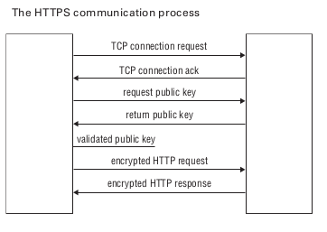

<div dir="rtl">


# 1. 🅰️HTTP(Hypertext Transfer Protocol)

* Port:80
* پروتکل http بهترین ابزار دسترسی فایل بدون داشتن دسترسی public برای عموم است
* مرورگرها قابلیت اتصال به سرور تحت پروتکل http/https دارد
* وب‌سایت: یک سایت نمایش است با ملاحظات خود
* وب اپلیکیشن: یک برنامه سازمانی است که درقالب وب به نمایش درمی‌آید
*

## 1.1. 🅱️ Methods

| متد HTTP   | نام رایج         | کاربرد اصلی                 | نحوه ارسال داده                       |
|------------|------------------|-----------------------------|---------------------------------------|
| **GET**    | خواندن           | دریافت منبع (resource)      | فقط در **URL** (query params یا path) |
| **POST**   | ایجاد            | ایجاد منبع جدید             | در **body** (معمولاً JSON)            |
| **PUT**    | جایگزینی کامل    | جایگزینی کامل یک منبع موجود | در **body** (تمام فیلدها)             |
| **PATCH**  | به‌روزرسانی جزئی | به‌روزرسانی بخشی از منبع    | در **body** (فقط فیلدهای تغییریافته)  |
| **DELETE** | حذف              | حذف یک منبع                 | معمولاً **بدون body** (شناسه در URL)  |

## 1.2. 🅱️Data Request/Response

### 1.2.1. ✅️Request

#### 1.2.1.1. ❇️Path Parameters

- Such as:`GET /api/users/123`
- Type: string
- Syntax: `<int:user_id>` or `{id}`
- کاربرد
    - موارد استفاده: ثابت‌ها و داده‌های ضروری
    - نباید برای فیلتر یا جستجو استفاده شود.

#### 1.2.1.2. ❇️Query Parameters

- position: after `?` in URL
- مثال: `GET /api/users?role=admin&limit=10&sort=name`
- کاربرد استاندارد:
    - فیلتر کردن (?status=active)
    - جستجو (?q=ali)
    - صفحه‌بندی (?page=2&size=20)
    - مرتب‌سازی (?sort=-created_at)
    - انتخاب فیلدها (?fields=id,name,email)
- محدودیت‌ها:
    - طول URL محدود است (معمولاً ~2000 کاراکتر).
    - داده‌های حساس (مثل رمز عبور) نباید اینجا بیایند (چون در لاگ‌ها ذخیره می‌شوند).
    - Type: String(list as string)
        - ?tags=python&tags=django
        - ?["python", "django"]

#### 1.2.1.3. ❇️Request Body

- جایگاه: بعد از هدرها
- کاربرد استاندارد:
    - ارسال داده‌های پیچیده یا حجیم (مثل JSON، فرم، فایل).
    - فقط در متدهای غیر Safe نظیر `POST`, `PUT`, `PATCH`, `DELETE`
- البته `DELETE` معمولاً body ندارد
- مزایا:
    - بدون محدودیت طول (نسبت به URL).
    - امن‌تر برای داده‌های حساس (با HTTPS).
    - پشتیبانی از ساختارهای پیچیده (آبجکت، آرایه، تودرتو).

فرمت‌های رایج

| `Content-Type`                      | کاربرد                             |
|-------------------------------------|------------------------------------|
| `application/json`                  | APIهای مدرن (داده‌های ساختاریافته) |
| `application/x-www-form-urlencoded` | فرم‌های HTML ساده                  |
| `multipart/form-data`               | آپلود فایل + داده                  |
| `text/plain`                        | متن ساده (نادر)                    |

```json
POST /api/users
Content-Type: application/json

{
"name": "Ali",
"email": "ali@example.com"
}
```

#### 1.2.1.4. ❇️HTTP Request Headers

بعنوان متادیتا لحاظ می‌شوند و نه دیتای اصلی کسب و کار. یعنی نباید دیتای اصلی را توسط آن ارسال کرد(مگر در موارد خاص مثل `X-Request-ID`)

* accept: کلاینت چه مواردی را انتظار دارد
    * `accept: text/html`
    * `accept: application/xhtml+xml`
    * `accept: application/xml;q=0.9`
    * `accept: image/avif`
    * `accept: image/webp`
    * `accept: */*;q=0.8`
* user-agent: مرورگر چه چیزی است
    * `user-agent: Mozilla/5.0 (X11; Linux x86_64; rv:102.0) Gecko/20100101 Firefox/102.0`
* Accept-Encoding: برای تسهیل مشخص می‌شود که این مرورگر قابلیت فهم چه نوع فشرده‌سازی را دارد
    * `Accept-Encoding: gzip`
    * `Accept-Encoding: deflate`
* Accept-Language
    * `Accept-Language: en-US`
    * `Accept-Language: fa-IR`
* Connection
    * `Connection: keep-alive`
* Content-Type
    * `Content-Type: application/json`
* Authorization
    * `Authorization: Bearer <token>` For JWT Authentication
    * `Authorization: Token <token>` For TokenBase Authentication

#### 1.2.1.5. ❇️Cookies

- position: on header
    - `Cookie: name=value; sessionid=abc123`
- ذخیره تنظیمات کلاینت نظیر زبان کلاینت
- با Flag های HttpOnly, Secure, SameSite محافظت شوند.
- در APIهای مدرن (Token-based) کمتر استفاده می‌شوند.

### 1.2.2. ✅️Response

#### 1.2.2.1. ❇️Response Body

- بازگرداندن داده‌های درخواستی (JSON, XML, HTML, فایل و ...)

```json
HTTP/1.1 200 OK
Content-Type: application/json

{
"id": 123,
"name": "Ali",
"email": "ali@example.com"
}
```

استاندارد پاسخ خطا

````json
{
  "error": {
    "code": "invalid_email",
    "message": "آدرس ایمیل نامعتبر است.",
    "field": "email"
  }
}
````

#### 1.2.2.2. ❇️Response Headers

* Content-Type
    * `Content-Type: application/json`
* Location
    * `Location: /api/users/123`


#### 1.2.2.3. ❇️Status Code

انتقال وضعیت عملیات بدون نیاز به بدنه

- 2xx
- 3xx
- 4xx
- 5xx
-

# 2. 🅰️HTTPS(Secure Hypertext Transfer Protocol)

* Port: 443
* پروتکل http که با ssl امنیت آن افزایش یافته است



# 3. 🅰️CGI(Common Gateway Interface)

* CGI یا Common Gateway Interface: استانداردی برای تولید صفحات پویای وب توسط سرور که حاوی مشکلاتی بود:
* تاخیر در تعداد کلاینت زیاد
* هر درخواست یک پردازه جدید یعنی بار افزوده برای سرور بود
* محدود برای برخی زبان‌ها(زبان‌های محدود به پلتفرم)
* باید قابلیت CGI را در وب‌سرور فعال نمایید
* قابلیت Get و Post وجود دارد
* دارای برخی CGI Environment Variables

```shell
#!/usr/bin/python

print "Content-type:text/html\r\n\r\n"
print '<html>'
print '<head>'
print '<title>Hello World - First CGI Program</title>'
print '</head>'
print '<body>'
print '<h2>Hello World! This is my first CGI program</h2>'
print '</body>'
print '</html>'
# OUTPUT: 
# Hello World! This is my first CGI program
```

[Link](http://www.test.com/cgi-bin/hello_get.py?first_name=ZARA&last_name=ALI)

```shell

#!/usr/bin/python

# Import modules for CGI handling 
import cgi, cgitb 

# Create instance of FieldStorage 
form = cgi.FieldStorage() 

# Get data from fields
first_name = form.getvalue('first_name')
last_name  = form.getvalue('last_name')

print "Content-type:text/html\r\n\r\n"
print "<html>"
print "<head>"
print "<title>Hello - Second CGI Program</title>"
print "</head>"
print "<body>"
print "<h2>Hello %s %s</h2>" % (first_name, last_name)
print "</body>"
print "</html>"
OUTPUT:
Hello ZARA ALI
```

[URL](http://localhost/cgi-bin/env.sh?namex=valuex&namey=valuey&namez=valuez)

```shell
#Shellscript CGI
#!/bin/bash
echo "Content-type: text/html"
echo ""
echo '&lt;html&gt;'
echo '&lt;head&gt;'
echo '&lt;meta http-equiv="Content-Type" content="text/html; charset=UTF-8"&gt;'
echo '&lt;title&gt;Environment Variables&lt;/title&gt;'
echo '&lt;/head&gt;'
echo '&lt;body&gt;'
echo 'Environment Variables:'
echo '&lt;pre&gt;'
/usr/bin/env
echo '&lt;/pre&gt;'

echo '&lt;/body&gt;'
echo '&lt;/html&gt;'

exit 0

```

> تصویر نمایی از حالت قدیمی را نمایش میدهد


# 4. 🅰️Commands

## 4.1. 🅱️curl

دستورات یا مرورگر‌های مشابه متنی ترمینال: links و links2 و lynx(دستور www-browser)

```shell
curl -I itsee.ir #نمایش هدرهای یک سایت
curl -u username:password -T file.tar.gz ftp://ftp_server
```

## 4.2. 🅱️wget

- [-b] → قرار دادن پروسه دانلود در بک‌گراند و عدم نمایش و این معمولا برای فایل‌های بزرگ کاربرد دارد
- [-c] → اگر دانلود متوقف شد مجددا ادامه دانلود را از سر گیرد
- [-f]: ایجاد یک فایل برای لاگ شدن وضعیت پیشرفت دانلود
- [-i] → ذخیره چندین یو‌آر‌ال در فایل و سپس دانلود لینک‌ها از فایل
    - wget -i ./FileName.txt
- [-l]: سطح بازگشت را تعیین میکند
    - اِل است و نه آی
- [-np] or [--no-parent] عدم رجوع به مسیر بالاتر
- [-O] Name → انتخاب نام جدید به فایل دانلود شده
- [-o ./download.log] → ذخیره لاگ در یک فایل بجای نمایش در ترمینال
- [-P]: قرار دادن در یک فولدر دیگر
    - [-P /documents/websites]:تمام محتوا به فهرست مشخص شده ما می رود
- [-Q5m] → پایان دانلود وقتی سایز دانلود شده از مقدار ۵مگابایت فراتر برود
- [-r] or [--recursive] دانلود به صورت بازگشتی
- [-R] or [--reject] → عدم دانلود یک نوع فایل معین ، در هنگام دانلود
    - wget -P documents/archives/ https://wordpress.org/latest.zip
- [--limit-rate=200k] → تعیین سرعت دانلود
- [--user-agent] → برخی سایت‌ها با تشخیص اینکه شما از مرورگر برای دانلود استفاده نمی‌کنید،می‌تونن اجازه دانلود به شما ندهند و شما توسط این گزینه نقاب می‌زنید و تحت عنوان مثلا فایرفاکس متصل می‌شوید
    - wget --user-agent="Mozilla/5.0 (X11; U; Linux i686; en-US; rv:1.9.0.3) Gecko/2008092416 Firefox/3.0.3" <URL>
- [--tries] → تعداد پیش‌فرض تلاش مجدد برای دانلود عدد۲۰ است و می‌تونیم آنرا تغییر دهیم
    - wget --tries=75 URL
- [--spider]: قراردادن در وضعیت اسپایدر
- [-mirror]: دانلود را بازگشتی می کند
- [-convert-links]: همه لینک‌ها برای استفاده آفلاین مناسب تبدیل خواهند شد
- [-page-requisites]: موارد زیر شامل تمام فایل‌های ضروری مانند «سی‌اِس‌اِس» و «جِی‌اِس» و تصاویر می شود
- [-no-parent]:تضمین می‌کند که دایرکتوری‌های بالای سلسله مراتب دانلود نمی‌شوند


- `wget --ftp-user=USERNAME --ftp-password=PASSWORD DOWNLOAD-URL`
- `wget --spider --force-html -r -l5 htp://dl.folan.net/Movie/ 2>&1 | grep '^--' | awk '{ print $3 }' | grep -v '\.css\|js\|png\|gif\|jpg$' | grep -v '\/$'`
- `wget --mirror --convert-links --page-requisites --no-parent -P documents/websites/ URL` #می توان از دستور wget برای دانلود محتوای کل سایت استفاده کرد
- `wget -r -np -R "index.html*" https://shop.hemat-elec.ir/wp-content/themes/irankala/assets/fonts` # Note: دانلود فایل های مشخص شده
    - wget -r -A.pdf

# 5. 🅰️ WebServer

## 5.1. 🅱️ Apache

* آبلود فایل با سایز بزرگ: در تنظیمات Apache داخل فایل php.ini مقادیر post_max_size و upload_max_filesize را افزایش دهید.(دقت شود که مقدار post_max_size بیشتر ازupload_max_filesize باشد)
* این سرویس در دبیان بانام apache2 و در ردهت httpd (درنهایت همان آپاچی است)شناخته می‌شود
* دستور apache2ctl کار کنترلی سرویس آپاچی را بر عهده دارد

```shell
apache2ctl status #نمایش اطلاعات سرور
apache2ctl fullstatus #نمایش اطلاعات جامع از سرور
apache2ctl graceful #Restarts the Apache server, but existing connections are not terminated #ریستارت و عدم قطع شدن کانکشن‌های موجود
apache2ctl graceful-stop # Stops the Apache server, but existing connections are not terminated #پایین آوردن سرویس و عدم قطع شدن کانکشن‌های موجود
apache2ctl configtest #بررسی اینکه کانفیگ صحیح است یا خیر
sudo apachectl start       [Start Apache web server]
sudo apachectl stop        [Stop Apache web server]
sudo apachectl restart     [Restart Apache web server]
sudo apachectl graceful    [Gracefully Restart Apache web server]
sudo apachectl configtest  [Check Apache Configuration]
sudo apachectl -V          [Check Apache Version]
sudo apachectl status      [Check Apache Status]
```

### 5.1.1. ✅️ConfigFile

```
AllowOverride None #افزودن این پارامتر موجب سلب مجوز استفاده از فایل مخفی htaccess می‌شود.
ServerAdmin behroozmn@chmail.ir #آدرس ایمیل ادمین
AuthName MESSAGE # اگر برای ورود محدودیت نام کاربری و پسورد گذاشته باشم، توسط این پارامتر یک پیام به ایشان می‌دهیم

```

```
<Directory /var/www/>
Options Indexes FollowSymLinks  #ListFileInBrowser 
AllowOverride None
Require all granted
</Directory> 

```

### 5.1.2. ✅️ AccessRestriction.mod_access(IPBase)

* در این محدودیت برحسب آی‌پی کلاینت اعمال می‌شود و در آن از گزینه Allow و Deny استفاده می‌شود

گزینه Order مشخص می‌کنداول ملاحظات خط Deny و سپس ملاحظات خط Allow اعمال گردد

```
<Directory /var/www/html>
Order Deny,Allow
Deny from All
Allow from 192.168.1.0/255.255.255.0
DocumentRoot /var/www/html
</Directory>
```

### 5.1.3. ✅️ AccessRestriction.mod_auth(user Pass)

- دسترسی به سایت نیاز به وارد کردن نام کاربری و پسورد باشد
- نیازبه یک فایل پسورد با محتوی هش وجود دارد

گام اول: توسط دستور زیر یک فایل برای نگهداری هش‌ها ایجاد می‌کنیم و همزمان یک کاربر و پسورد ایجاد می‌کنیم

```shell
htpasswd -c /var/www/html/passwords behrooz
New password:
Re-type new password:
Adding password for user behrooz
```

گام دوم: بررسی در فایل کانفیگ

```shell
Require all granted #این خط نباید وجود داشته باشد زیرا در آن صورت به همه اجازه دسترسی خواهد داد
```

گام سوم: قرار دادن این دستورات در فایل کانفیگ

```
<Directory /var/www/html>
Options Indexes FollowSymLinks
AllowOverride None
AuthName "Lotfan Password ra vared konid"
AuthType Basic
AuthUserFile /var/www/html/passwords
Require valid-user
</Directory>
```

گام چهارم: ریست آپاچی

### 5.1.4. ✅️ htaccess

* فایل مخفی «اِچ‌تی‌اکسس» سبب اعمال برخی تنظیمات در برخی مسیر‌ها و دایرکتوری‌ها می‌شود
* خطوط زیر در فایل htaccess قرار داده شود

```
Options +Indexes #اجازه نمایش لیست دایرکتوری
IndexIgnore * #اجازه نمایش لیست دایرکتوری
Options -Indexes #جلوگیری از دسترسی دایرکتوری
IndexOptions +FancyIndexing #نمایش جزییات
IndexIgnore *.zip *.txt   #نادیده گرفتن پسوند خاص
DirectoryIndex Home.html #تعیین نوع پرونده پیش‌فرض
```

### 5.1.5. ✅️ LimitForUpload

افزایش مقادیر پارامتر post_max_size و upload_max_filesize در فایل php.ini (دقت شود که مقدار post_max_size بیشتر از upload_max_filesize باشد)

```
sudo vim /etc/php5/apache2/php.ini 
post_max_size=
upload_max_filesize=
--> post_max_size > upload_max_filesize 
sudo service apache2 restart 
```

### 5.1.6. ✅️ VirtualHost.IPBase

- ارائه چندین وب‌سرور روی یک سرور از این طریق صورت می‌گیرد.هر نام در DNS به یک آی‌پی متفاوت خواهد رسید و هرگاه نام مربوطه به وب‌سرور داده شده تنظیمات مربوط به آن سایت را نمایش خواهد داد


1. تنظیمات آورده شده بالا را در آپاچی قرار می‌دهیم
   ```
   Listen 192.168.1.77:80
   Listen 192.168.1.78:80
   <VirtualHost www.myhost1.com>
   Servername www.myhost1.com
   DocumentRoot /var/www/html/myhost1
   </VirtualHost>
   <VirtualHost www.myhost2.com>
   Servername www.myhost2.com
   DocumentRoot /var/www/html/myhost2
   </VirtualHost>
   ```
2. باید مسیر تعریف شده در عبارت DocumentRoot موجود باشد
3. دایرکتوری قید شده را به آپاچی می‌شناسانیم
   ```
   <Directory /var/www/html/myhost1>Options Indexes FollowSymLinksAllowOverride NoneRequire all granted
   </Directory /var/www/html/myhost1>
   ```
4. توسط دستور apache2ctl configtestتنظیمات را چک می‌کنیم
5. این نام باید در DNS یا فایل hosts موجود باشد

### 5.1.7. ✅️VirtualHost.NameBase

سبب می‌شود تا در یک آی‌پی چندین دامنه را به مسیرهای متفاوت(سایت‌های متفاوت) وصل کنیم

1. تنظیمات زیر را در فایل لحاظ نمایید
   ```
   NameVirtualHost 192.168.1.77
   <VirtualHost 192.168.1.77>
   ServerName www.myhost1.com
   DocumentRoot /var/www/html/host1
   </VirtualHost>
   
   <VirtualHost 192.168.1.77>
   ServerName www.myhost2.com
   DocumentRoot /var/www/html/host2
   </VirtualHost>
   ```
2. باید مسیر تعریف شده در عبارت DocumentRoot موجود باشد
3. دایرکتوری قید شده را به آپاچی می‌شناسانیم
   ```
   <Directory /var/www/html/myhost1>
   Options Indexes FollowSymLinks
   AllowOverride None
   Require all granted
   </Directory /var/www/html/myhost1>
   ```
4. توسط دستور apache2ctl configtestتنظیمات را چک می‌کنیم
5. -این نام باید در DNS یا فایل hosts موجود باشد

## 5.2. 🅱️ NginX

- معمولا بعنوان ReverseProxyServer استفاده می‌شود و LoadBalance ایجاد نماید
- سرویس NginX یک ReverseProxy خیلی ساده است
- ۱-توسط این قطعه یک دامنه را مدیریت می‌کنیم

```
server {
listen 80;
server_name example.com;
location \ {
proxy_pass http://lxer.com/;
include /etc/nginx/proxy_params;
}
}
```

- ۲-توسط proxy_pass درخواست ها را به یک آدرس هدایت می‌کنیم
- مسیر پیش‌فرض /usr/share/nginx/html است

## 5.3. 🅱️ Squid

یک وب سرور است که معمولا بعنوان پروکسی در مرورگرها تنظیم می‌شود و همه از طریق او به اینترنت وصل می‌شوند و میتواند صفحات را کش نماید.(از دردسرهای کش سرور رهایی یابیم)

</div>