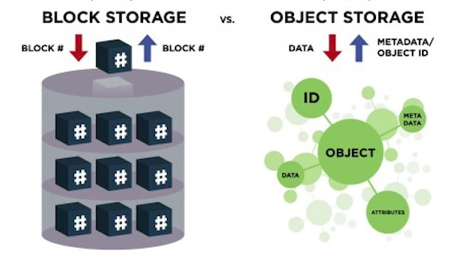

<div dir="rtl">


# 1.Concepts


* journaling: استفاده شونده در ext4 بدین صورت که هرگاه میخواهیم چیزی در دیسک بنویسیم اول درون ژورنال میگوییم که در حال نوشتن فلان مطلب هستم. وقتی کار تمام شد در ژورنال می‌گوییم کار تمام شد. اگر وسط کار برق رفت می‌فهمیم که کدام فایل‌ها درگیر بوده و باید ریکاوری شود.
* Copy On Write یعنی هرگاه خواستیم فایلی تغییر بدهیم اول یک کپی می‌گیریم و اصلاحات را در آن انجام می‌دهیم و سپس آن قبلی را پاک میکنیم که اگر برق رفت فایل اول سالم بماند و نیاز به fsck نباشد
* دستور mount تمام موارد mount شده را با جزئیات نحوه mount شدن به نمایش در خواهد آورد

```shell
man filesystems #اطلاعات زیادی راجع به انواع فایل‌سیستم
man fstab # توضیحاتی راجع به پارامترهای موجود در این فایل
fuser #پروسس‌هایی که دارد از یک فایل استفاده میکنند
uuidgen #ایجاد یک یو یو آی دی جدید
blkid #نمایش یو یو آی دی

tune2fs # کارهای زیادی در باره فایل‌سیستم انجام می‌دهد
tune2fs /dev/sdb1 -U <NewUUID> #تغییر آی‌دی

resize2fs #تغییر اندازه یک فایل سیستم
btrfs-convert #تغییر یک هارد از نوع ای ایکس۴ به بی تی آر اف اس

cat /proc/filesystems #تمام فایل‌سیستم‌هایی که کرنل می‌فهمد
```

# 2.BlockStorage

استفاده از بلاک سایز برای ذخیره دیتا در دیسک

**مزایا**

* مناسب برای ذخیره دیتا در دیتابیس‌های معمولی

**معایب**

* هر استوریج در هر زمانی فقط به یک سرور مرتبط است

## EXT[2|3|4]

```shell
mkfs.ext4 -F -O ^64bit -L '' '/dev/sdb #NewFilesystem
e2label /dev/sdb1 <Lable> #قرار دادن یک نام برای یک حافظه #lable
debugfs /dev/sdb1 #دیباگ کردن هارد دوم از دیسک دوم #Debug
```

## NTFS

```shell
mkntfs -Q -v -F -L '' '/dev/sdb'                      #NewFilesystem
ntfslabel --force '/dev/sdb' '09191671085-BesmeAllah' #Set file system label
ntfsresize -i -f -v /dev/sdc1 #check file sysyem on /dev/sdc1 errors and (if possible) fix them
ntfsresize --force --force /dev/sdc1 #grow file system to fill the partition
ntfsresize --force --force --no-action /dev/sdc1 #دستور بالا را شبیه‌سازی میکند و درصورت وجود مشکل آن را اعلام میکند
```

## BTRFS

* قابلیت پشتیبانی از COW
* قابلیت پشتیبانی از Raid
* قابلیت پشتیبانی از اسنپ‌شات
* قابلیت ایجاد فایل خیلی بزرگ را می‌دهد
* برای دیسک‌های کوچک نظیر فلش خوب نیست و بهتر است برای دیسک‌های حجم بالا استفاده شود

```shell
mkfs.btrfs -f /dev/sdb1 /dev/sdb2 #دو پارتیشن را باهم یک فایل سیستم قرار بده
btrfs filesystem show
btrfs subvolume create <Name> #ساختن یک ساب والیوم در مسیر کنونی-یعنی یک دایرکتوری که دایرکتوری نیست و والیوم است
btrfs subvolume list <Directory> #تمام ساب‌‌والیوم‌های موجود در یک دایرکتوری را به ما نمایش می‌داد
mount -o subvolume=<nameOfSubvolume> <DeviceSuchAs /dev/sdb> <DirectoryMountPoint> # مانت کردن یک ساب‌والیوم
btrfs subvolume snapshot <From> <Directory>
```

# 3.ObjectStorage

* امکان ذخیره متادیتای کمتر نسبت به آبجکت‌استوریج
* ذخیره دیتا به‌صورت شیء(با پارامتر زیر)
    * ۱-آی‌دی: شناسه منحصربفردبرای دسترسی به فایل
    * ۲-متادیتا(متادیتای جامعی را به فایل اضافه میکند)
    * ۳-محتویات فایل(Unstructured)
* بلاک سایز ندارد
    * پِرتی سکتور ندارد
    * مناسب داده با هرنوع ساختار
* استفاده از فضای آدرس‌دهی مسطح(flat)
    * استفاده از Storage Pool
    * حذف ساختار آدرس‌دهی سلسله مراتبی(حذف ساختار فولدرهای تودرتو و مشاهده آن در FileBrowser)
        * نامناسب برای نصب سیستم عامل بر روی آن
* سیستم عامل نمی تواند با Object Store به صورت یک دیسک معمولی رفتار کند.
    * ابزارهای واسطی وجود دارند که این مشکل را حل می کنند
* Read|Write
    * سرعت Read بیشتر، بدلیل استفاده از آی‌دی (ایندکس‌شدن)
    * نوشتن دیتا و خواندن دیتا در قالب Rest API
        * استفاده از Requestهای HTTP، نظیر PUT Request(ذخیره) و Get Request(بازخوانی)
        * رفع مشکل برنامه‌نویسان هنگام ذخیره‌دیتا(ارتباط با اپلیکیشن‌ها)
    * درهنگام خواندن و نوشتن یک آبجکت به صورت کامل بارگزاری می‌شود(تغییراعمال می‌شود و مجدد ذخیره می‌گردد)
        * عدم امکان تغییر بخشی از دیتا
            * نامناسب برای لاگ فایل(Append یک خط لاگ)
        * نامناسب برای فایل‌هایی با rate تغییر زیاد(نظیر لاگ فایل،افزودن یک خط به انتها)
* ویژگی
    * مناسب برای شبکه‌های اجتماعی(وجود هر نوع دیتا و ساختار)
    * مناسب برای ذخیره اطلاعات ثابت(هرگونه تغییر در فایل ذخیره شده، سبب می‌شود تا نسخه‌ای جدید از کل فایل ایجاد و ذخیره شود)
    * مناسب برای BigData

## CEPH protocol

* درواقع base آن بر Object storage می‌باشد.
* مقیاس‌پذیر است یعنی scalability دارد
* هر چند سیستم عامل که ceph داشته‌باشند میتوانند با هم تعامل برقرار نمایند
* پشتیبانی از مکانیزم active/active
* مکانیزم CephCluster قابلیت پشتیبانی از file و object و block دارد

## REFS(Resilient File System)

* عدم پشتیبانی از فشرده‌سازی و رمزگذاری و پشتیبانی از فایل‌های سخت‌افزاری(پایه درایور)
* استفاده از ساختار متادیتا تحت عنوان BPlusTree[b+Tree] برای بهینه‌سازی جستجو و دسترسی به دیتاIntegrityStrem که شناسایی و اصلاح خطا با checksum برای هر بلوک داده را انجام می‌دهد
* مدیریت حجم بزرگ تا ۳۵ پتابایت
* پشتیبانی از فرمت دیسک‌های مجازی Virtual Hard Disk (هایپروی)
* کلون و اسنپشات

# 4.Virtual Filesystem

یک مفهوم گسترده‌تر که شامل انواع فایل‌سیستم‌های مجازی است که ممکن است داده‌ها در حافظه، در فایل، یا حتی از طریق شبکه مدیریت شوند

- **In-memory Filesystem** : داده‌ها در RAM هستند (سریع و  **غیردائمی** و با ریستارت از بین می‌روند).
- **Virtual Filesystem**: یک لایه نرم‌افزاری که **به کاربر و برنامه‌ها شبیه یک فایل‌سیستم عملی می‌کند** ولی لزوماً داده‌ها را روی دیسک ذخیره نمی‌کند.
- **Temporary Filesystem**: داده‌ها فقط موقت هستند (با خاموشی یا ری‌استارت از بین می‌روند).

| فایل‌سیستم / توضیح      | In-memory | Virtual | Temporary | روی دیسک | توضیحات                                                                    |
|-------------------------|-----------|---------|-----------|----------|----------------------------------------------------------------------------|
| **`tmpfs`**             | ✅         | ✅       | ✅         | ❌        | فایل‌سیستم موقت در حافظه (RAM)، استفاده در BSD و لینوکس.                   |
| **`ramfs`**             | ✅         | ❌       | ✅         | ❌        | شبیه `tmpfs` ولی بدون مدیریت صفحه‌بندی. خطر OOM وجود دارد.                 |
| **`/proc`**             | ✅         | ✅       | ✅         | ❌        | فقط در زمان اجرا وجود دارد. داده‌ها در RAM ساخته می‌شوند.                  |
| **`/sys`**              | ✅         | ✅       | ✅         | ❌        | نمایش اطلاعات سخت‌افزاری. فقط در زمان اجرا.                                |
| **`/dev`**              | ✅         | ✅       | ✅         | ❌        | شامل فایل‌های دستگاه. عمدتاً توسط `devtmpfs` یا `tmpfs` پیاده‌سازی می‌شود. |
| **`devtmpfs`**          | ✅         | ✅       | ✅         | ❌        | مشابه `tmpfs` برای `/dev`. توسط کرنل در RAM ساخته می‌شود.                  |
| **`devpts`**            | ❌         | ✅       | ✅         | ❌        | نقاط TTY مجازی (terminal). معمولا با devtmpfs یا tmpfs کار می‌کند.         |
| **`FUSE`**              | ❌         | ✅       | ❌         | ❌        | امکان ایجاد فایل‌سیستم در فضای کاربری. پایه برای SSHFS و غیره.             |
| **`SSHFS`**             | ❌         | ✅       | ❌         | ❌        | دسترسی به فایل‌های دور از طریق SSH و FUSE.                                 |
| **`overlayfs`**         | ❌         | ✅       | ❌         | ❌        | برای containerها (مثل Docker) — ترکیب دو فایل‌سیستم.                       |
| **`unionfs`**           | ❌         | ✅       | ❌         | ❌        | قدیمی‌تر از overlayfs. ترکیب چند لایه فایل‌سیستم.                          |
| **`cifs/smb`**          | ❌         | ✅       | ❌         | ❌        | دسترسی به فایل‌های سرور ویندوز از طریق شبکه.                               |
| **`NFS`**               | ❌         | ✅       | ❌         | ❌        | دسترسی به فایل‌های سرور لینوکس/یونیکس از طریق شبکه.                        |
| **`9P`**                | ❌         | ✅       | ❌         | ❌        | فایل‌سیستم شبکه‌ای Plan 9 — در QEMU و Virtio-fs استفاده می‌شود.            |
| **`squashfs`**          | ❌         | ✅       | ❌         | ✅        | فایل‌سیستم فشرده و فقط خواندنی — در LiveCDها و containerها.                |
| **`ROMFS`**             | ❌         | ✅       | ❌         | ✅        | فقط خواندنی، برای سیستم‌های توکار.                                         |
| **`initramfs`**         | ✅         | ✅       | ✅         | ❌        | تصویر ramfs/tmpfs قبل از mount کردن root فایل‌سیستم.                       |
| **`RAM Disk` (ویندوز)** | ✅         | ✅       | ✅         | ❌        | دیسک مجازی در RAM — مثلاً ImDisk، SoftPerfect RAM Disk.                    |

---

### 📌 نکات مهم:

* فایل‌سیستم Temporary Filesystem ممکن است **In-memory** باشد یا **فایل‌های موقت روی دیسک**، ولی مهم این است که داده‌ها **پاک می‌شوند**.
* فایل سیستم tmpfs توسط هسته (Linux kernel) پشتیبانی می‌شود

# 5.NetworkFilySystem

* بعنوان مثال موارد CIFS یا SMB یا NFS جزو این موارد هستند
* داده‌ها به صورت فایل منتقل می‌شوند، نه بلاک یا آبجکت
* تحت عنوان File-Based Network File System نیز گفته می‌شوند

## CIFS

پروتکل CIFS  (Common Internet File System) یکی از پروتکل‌های شبکه است که برای دسترسی به فایل‌ها از راه دور استفاده می‌شود. این پروتکل در واقع یک نمونه از فایل سیستم توزیع‌شده (Distributed File System)  است و نوع خاصی از Network File System محسوب می‌شود.

# 6.OTHERs

* فایل سیستم فایل سیستم **`XFS`** : High-performance برای سیستم‌های بزرگ.
* فایل سیستم فایل سیستم **`NTFS`** : فایل‌سیستم ویندوز — قابل خواندن/نوشتن در لینوکس با ntfs-3g.
* فایل سیستم **`FAT32`** : فایل‌سیستم قدیمی با سازگاری بالا ولی محدودیت‌هایی (حداکثر 4GB فایل).
* فایل سیستم **`exFAT`** : برای حمل‌و‌نقل بین سیستم‌ها. پشتیبانی محدود در لینوکس.
* فایل سیستم **`ISO9660`** : CD-ROM — Read-only یا محدود.
* فایل سیستم **`UDF`** : DVD/Blu-ray — جایگزین ISO9660.
* فایل سیستم **`JFFS2|YAFFS|LogFS`** : Flash Memory برای سیستم‌های توکار.
* فایل سیستم **`minix`** : قدیمی‌ترین فایل‌سیستم لینوکس — فقط برای تست.
* فایل سیستم **`ecryptfs`** : فایل‌سیستم رمزگذاری‌کننده (Encrypted Filesystem).

</div>



