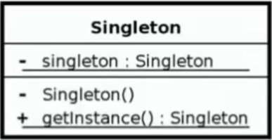
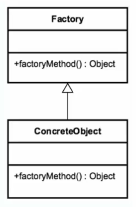
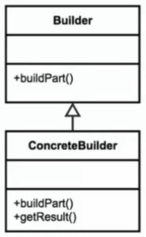

The Design Patterns are descriptions of communicating objects and class that are customized to solve a general design problem in a particular context.

<div dir="rtl">

مبحث DesignPattern به توضیحات پیرامون برقراری ارتباط با اشیاء و کلاس‌ها می‌پردازد که توسط آن این نحو ارتباط را برای رفع یک مشکل،‌ خاص منظوره می‌کند

* برخی از استانداردها با توجه به مشکل مدّنظر برای تنظیم روابط بین کلاس‌ها و آبجکت‌ها طراحی می‌شود تا سبب اقزایش بهنگی در کدنویسی گردد
* در یک پروژه همگان ملزم به تبعیت از آن الگو حواهند بود
* مبحث «الگوهای طراحی» یا Design Pattern، پیرو عنوان Object Oriented می‌باشد.
* بدلیل عدم وجود مشکل خاص در برخی «زبان‌های برنامه‌نویسی» گاهی یک «الگوهای طراحی» در آن زبان بدون کاربرد خواهد بود
* گاهی توسط شیوه کدنویسی یا Aspect Oriented مشکل برطرف می‌گردد و نیاز به استفاده از یک «الگوی طراحی» خاص نیست
* باید توجه داشت که ممکن است گاهی اتخاذ یک الگوی طراحی به اشتباه صورت گیرد و سبب گره در کدنویسی گردد


* Categories
    * Creational Patterns: الگوهای طراحی برمبنای ایجاد و ساخت «آبجکت»
        * Singleton: تنهای یک شیء از یک کلاس ساخته بشود و هربار شیء ساخته شده را مورد استفاده قرار دهد
        * FactoryMethod: پنهان‌سازی پیچیدگی‌های ساخت شیء برپایه وراثت( البته نیاز به نوشتن کد بیشتری دارد)
        * AbstractFactory: همانند FactoryMethodpattern بگونه Factory والد و Factory فرزند(داینامیک‌سازی کلاس فرزند) پیچیدگی زیاد کلاس‌ها را هنگام ایجاد شیء تسهیل می‌دهد. مناسب FrameWork نویسی زیرا پیچیدگی‌ها مرتفع می‌گردد
        * BuilderPattern: هنگام تولید آبجکت با تعددا پارامتر زیاد کاربرد دارد تا کارها و اقدام‌ها کاهش یابد
        * Prototype: اشیاء جدید توسط کپی از شیء موجود[بجای ایجاد شیء جدید از طریق توابع سازنده (Constructor)]
    * Structural Patterns: الگوهای طراحی بر مبنای «تنظیم روابط آبجکت‌ها» از نوع **ترکیب‌سازی** آبجکت‌ها با یکدیگر
        * Adapter:
        * Bridge:
        * Composite:
        * Decorator:
        * Facade:
        * Flyweight:
        * Proxy:
    * Behavioral Patterns: الگوهای‌طراحی برمبنای «تنظیم روابط‌آبجکت‌ها» از نوع استفاده یک آبجکت در آبجکت دیگر(رفع پیچیدگی)
        * Chain of responsibility:
        * Command:
        * Interpreter:
        * Iterator:
        * Mediator:
        * Memento:
        * Observer:
        * State:
        * Strategy:
        * template:
        * Visitor:

# 1. 🅰️Singleton

*
* **ساخت تنها و تنها یک نمونه از یک شیء**: در این روش هرگاه از یک کلاس یک شیء جدید می‌سازیم آنگاه فقط وفقط یک شیء ساخته‌می‌شود(همان شیء ساخته شده که برای اولین بار از این کلاس ساخته شده است)
* **تضمین کنترل منابع**: زمانی که محدودیت منابع(مثل:دیتابیس یا پرینتر یا فایل)وجود داشته باشد و بخواهیم تضیمن شود که ارتباط فقط باید از یک کلاس خاص صورت پذیرد
* این مدل طراحی دارای قاعده ثابت است(عدم انعطاف‌پذیر)
* تنها با یک آبجکت راه‌اندازی می‌شود و نیاز به چندین آبجکت برای پیاده‌سازی ندارد.
* نکته: هرگاه به این تفکر برخوردید که نیاز به Stateهای متفاوت و Dataهای متفاوت است باید فکر سینگلتون را از ذهن خارج کرد
* مثال‌ها:
    * وجود تنها یک پرینتر
    * کانکشن به دیتابیس

## 1.1. 🅱️Implement

کلاسی که قرار است تحت الگوی طراحی Singleton باشد باید از قواعد زیر پیروی کند

* درون کلاس یک آبجکت(Instance) از خود کلاس می‌سازیم
* دسترسی به این آبجکت را از درون کلاس میسر می‌نماییم
* تعریف متغیرهااز نوع private (برای محدودسازی دسترسی از بیرون)بدلیل عدم تغییر مستقیم در پارامترهای کلاس
* تک آبجکت را از نوع Static قرار می‌دهیم
* جهت جلوگیری از ساخت شیء جدید به ازای ساخته شدن شیء
    * قرار دادن متد Constructor در حالت private تا فقط از درون شیء بشود آبجکت جدید ساخته شود
    * یک متد public با نام getInstance برای دسترسی عمومی برای همه از بیرون ایجاد میکنیم تا هربار هنگام ساخت شیء این شیء مورد استفاده قرار بگیرد

## 1.2. 🅱️java

* نمونه‌های رایج در جاوا: Runtime ، Logger
* Spring Beans:در اسپرینگ تمامیBean هایی که ساخته می‌شوند بصورت پیش‌فرض از نوع سینگلتون است
* دارای تابع Constructor بدون پارامتر است



قطعه کد زیر یک نمونه از اتصال دیتابیس از نوع سینگلتون است:

```java
public class DBConnection {
   // متغیر از نوع Static است زیرا باید از کلاس یک نمونه شیء بیشتر ساخته نشود و هرکس خواست از این نمونه استفاده نماید
   // متغیر از نوع private است زیرا کسی نتواند این مقدار رو تغییر و مستقیماً از آن استفاده نماید
   private static DBConnection dbconnection = new DBConnection();
   
   // متد Constructor این کلاس ساخته شده و private تعریف شده است تا هیچ‌کس خارج کلاس نتواند از این تابع سازنده استفاده نماید. بعبارتی تابع سازنده آن قابل فراخوانی نیست و چون این کلاس تنها یک تابع سازنده دارد پس کسی نمی‌تواند از روی آن شی جدید بسازد
   private DBConnection(){}
   
   // متد getInstance تا هرکسی بخواهد نمونه‌ای از کلاس رو بگیرد شیء که یکبار ساخته شده است را فراخوانی نماید. خروجی بازگشتی از نوع singleton است
   public static DBConnection getInstance(){
      return dbConnection;
   }
}
```

```java
Singleton s = Singleton.getInstance(); // در صورت استفاده از سینگلتون باید اینگونه شیء تولید کرد
Singleton s = new Singleton(); //❌️ در صورت استفاده از Singleton این خط خواهد بود
```

در قطعه کد زیر اگر هش‌کد دو نمونه مساوی باشند آنگاه در خروجی تصریح خواهد شد

```java
Runtime firstInstance = Runtime.getRuntime();
firstinstance.gc(); //Garbage Collector //این موضوع فقط نمایش است وگرنه بصورت پیش‌فرض توسط جاوا اجرا می‌شود
System.out.println(firstInstance);

Runtime anotherInstance = Runtime.getRuntime();
System.out.println(anotherInstance);

if (firstInstance == anotherInstance){
    System.out.println("Two instance are equal");
}
```

### 1.2.1. ✅️LazySingletonClass

طبق قاعده جاوا(در بحث Class Loading ) اولین Touch از یک کلاس(حتی Import در Junit ) سبب Instantiate از تمامی مقادیر استاتیک آن کلاس می‌شود. پس کلاس سینگلتون حتماً دارای یک نمونه آبجکت می‌باشد.حالا اگر برنامه بصورت سینگلتون باشد و حتی یک ارتباط با دیتابیس نداشته باشد آنگاه اتقلاف منابع خواهیم داشت(این مثال در برخی منابع ممکن است دارای Cost زیاد باشد) پس می‌توان قطعه کد بالا بصورت Lazy نگارش شود یعنی هرگاه به شیء نیاز شد آنگاه آبجکت تولید گردد

```java
public class DBConnection {
   private static DBConnection dbconnection = null;
   private DBConnection(){}
   public static DBConnection getInstance(){
      if(dbconnection == null){
         dbconnection = new DBConnection();
      }
      return dbConnection;
   }
}
```

### 1.2.2. ✅️ThreadSafeSingletonClass

این شرایط وجود دارد که کلاس را بعداً Thread safe نماییم: یعنی اگر برنامه در محیط Concurrent اجرا می‌شودوچندین Thread همزمان چندین کلاس را Instance نمایند آنگاه سبب بروز مشکل خواهد شد

روش 1️⃣️:

```java
public class DBConnection {
   private static DBConnection dbconnection = null();
   private DBConnection(){}
   public synchronized static DBConnection getInstance(){
      if(dbconnection == null){
         dbconnection = new DBConnection();
      }
      return dbConnection;
   }
}
```

روش 2️⃣️:

```java
public class DBConnection {
   private static DBConnection dbconnection = null();
   private DBConnection(){}
   public static DBConnection getInstance(){
      if(dbconnection == null)
         synchronized (DBConnection.class){
            if(dbconnection == null){
               dbconnection = new DBConnection();
            }
         }
     }
     return dbConnection;
   }
}
```

توضیحات: اگر یک thread داخل محدوده بلوک Synchronized قرار داشته باشد آنگاه اگر thread دوم به این بلاک برسد، صبر می‌کند تا thread اول از این بلاک عبور کند و سپس Thread دوم وارد این بلاک می‌شود.(پردازه برای دومی قفل می‌شود و با خروج اولی قفل آن باز می‌شود)

# 2. 🅰️ Factory

* **هدف‌ایجاد**:پنهان‌سازی پیچیدگی‌های ساخت شیء(برنامه‌نویس درگیر پیچیدگی‌های آبجکت‌ها نشود و به سهولت نمونه بسازد)
* این الگوی طراحی برپایه اصل وراثت بنا نهاده شده(Inheritance)
* یک از کاربردهای این الگوی طراحی برای زمانی است که از سیستم cache استفاده می‌شود.خصوصا زمانی که تولید نمونه‌ها پرهزینه خواهد بود(ارتباط با دیتابیس، پرینتر، اسکنر،‌دیوایس‌های External وغیره). در این هنگام می‌توان نمونه‌ها را در فضای استاتیک نگهداری کرد و در هربار فراخوانی فقط از آن استفاده نمود.
* الگوی طراحی Factory method نقطه مقابل Singleton می‌باشدپیچیدگی ساخت زیرکلاس‌ها را رفع می‌کند
* پیاده‌سازی آن منوط به نوشتن کد بیشتری است(پیچیدگی همراه می‌آورد ولی در نگاه کلی سبب سهولت است)

مثال

* تبدیل فرمت عکس به فرمت‌های گوناگون(JPG , PNG , GIF , SVG , غیره) که در اینصورت هر فرمت صاحب کلاس مستقل به‌همراه پارامترهای منحصر به خود است که ممکن است در فرمت دیگری به چنین پارامتری نیاز نباشد. یعنی کلاس‌های متفاوت برای هر نوع فرمت تصویر با ورودی‌های متفاوت به همراه پیچیدگی‌های آن‌ها
* Number Format: نوع اعداد فارسی یا عربی یا فرمت انگلیسی باشد
* Resource Bundle: ایجاد نمونه متفاوت برحسب تنظیمات
* Calendar: نوع تقویم جلالی یا میلادی یا هجری‌قمری یا عبری یا پهلوی یا غیره باشد(قطعه‌کد زیر که برحسب منطقه خاص می‌تواند Locale بپذیرد)

```java
import java.util.Calendar;
Calendar x = Calendar.getInstance(Locale.English); #getInstance is Factory
System.out.println(x);
System.out.println(x.get(Calendar.SECOND));
```

این الگوی طراحی به کد قابلیت گسترش می‌دهد(در مثال تغییر فرمت تصاویر به یکدیگر می‌توانیم به سهولت یک فرمت جدید بیافزاییم)



## 2.1. 🅱️ Design manual

* اصل‌اول: «مخفی‌سازی منطق ساخت اشیاء»
    * عدم ارتباط کاربر با Subclass ها
    * ایجاد یک کلاس جدید بنام «Factory» و پیاده‌سازی تمام تعاملات کاربر در این کلاس[معمولا انتهای آن کلمه Factory قرار می‌دهند. ممکن است به دلخواه برنامه‌نویس این کلمه آورده نشود]
* اصل‌دوم: ساماندهی و بهینه‌سازی ارتباطات «FactoryClass» با «کلاس‌های فرزند»
    * پایه‌گذاری پیچیدگی‌های برنامه در قالب کلاس‌های متفاوت
    * مبنای ارتباطات، برپایه شیوه «ارث‌بری»
    * تمرکز پیچیدگی‌های «کلاس‌های فرزند» در کلاس «FactoryClass»
* اصل‌سوم: «share Interface» برای استاندارد سازی ارتباطات
    * استفاده از یک اینترفیس مشترک برای مدیریت «کلاس‌های فرزند» با «FactoryClass»
    * متدهای مهم در در «اینترفیس‌مشترک»پایه‌گذاری می‌شود و تمامی «کلاس‌های فرزند» موظف به پیاده‌سازی آن متدها خواهند بود
    * مثال: در مسأله تبدیل فرمت‌تصاویر یک اینترفیس بنام «ImageConvertor» خواهیم داشت که همه «کلاس‌های فرزند» با این اینترفیس تعامل برقرار خواهند کرد و این اینترفیس یک متد بنام Convert خواهد داشت که اطلاعات را میگیرد و خروجی را برمی‌گرداند

## 2.2. 🅱️ Example

* مثال: در مسأله تبدیل فرمت‌تصاویر یک اینترفیس بنام «ImageConvertor» خواهیم داشت که همه «کلاس‌های فرزند» با این اینترفیس تعامل برقرار خواهند کرد و این اینترفیس یک متد بنام Convert خواهد داشت که اطلاعات را میگیرد و خروجی را برمی‌گرداند

به کلاس زیر و نیز پیاده‌سازی‌های آن توجه نمایید

```java
public abstract class Calculation {
    protected int amountPerMonth;
    protected int taxPercent;
    protected string product;

    public Calculation(int amountPerMonth, int taxPercent, string product) {
        this.amountPerMonth =  amountPerMonth;
        this.taxPercent = taxPercent;
        this.product= product;
    }

    public abstract int calculate();
}
```

پیاده‌سازی از نوع Calculation1 :

```java
public class Calculation1 extends Calculation {
    public Calculation1(int amountPerMonth, int taxPercent, string product) {
        super(amountPerMonth, taxPercent, product);
    }
    @Override
    public abstract int calculate() {
        return amountPerMonth * taxPercent + 200;
    }
}
```

پیاده‌سازی از نوع Calculation2 :

```java
public class Calculation2 extends Calculation {
    public Calculation2(int amountPerMonth, int taxPercent, string product) {
        super(amountPerMonth, taxPercent, product);
    }
    @Override
    public abstract int calculate() {
        return amountPerMonth * taxPercent;
    }
}
```

پیاده‌سازی FactoryClass :

```java
public class CalculationFactory {
    public Calculation createCalculation(int amountPerMonth, int taxPercent, string product, boolean flag) {
        if (flag) {
            return new Calculation1(amountPerMonth, taxPercent, product);
        } else {
            return new Calculation2(amountPerMonth, taxPercent, product);
        }
    }
}
```

# 3. 🅰️ Abstract Factory

* کارخانه‌ای که خودش کارخانه تولید می‌کند. یعنی Factory والد و Factory فرزند که این به خودی خود دارای پیچیدگی خواهد شد.
* کاربرد در سیستم‌های بزرگ و آبجکت‌های سنگین که بخواهند ساخت کلاس فرزند را dynamic کنند.
* وجود interfaceهای مشترک از 2 گروه الف: به ازای هر Factory ب:به ازای هر کلاس‌هایی که داخل Factory است
* مثال کلاس Document Builder: برای Parse کردن فایلXML که یک آبجکت Node بصورت درختی برمی‌گرداند که می‌توان به تمامی المنت‌هایxml مورد نظر دسترسی پیدا کرد

## 3.1. 🅱️ Design manual

* گروهی از factory ها دارای interface مشترک خواهند بودو با هم استفاده می‌شوند
* abstract Factory ‌ها گروهی از Factory ها هستند که همواره برای ساخته شدن آن‌ها باید ابتدا از یک Factory شروع کرد و سپس به abstractFactory رسید.
* پیچیدگی در پیاده‌سازی
* نیاز به abstraction های زیاد
* الگویی مناسب برای framework ها محسوب می‌شود.(Framework نویس‌ها)

## 3.2. 🅱️ Examples

مثال اول DocumentBuilderFactory:

```java
DocumentBuilderFactory abstractFactory = DocumentBuilderFActory.newInstance();
DocumentBuilder documentBuilder = abstractFactory.newDocumentBuilder();
Document document = documentBuilder.pars(new ByteArrayInputStream("<person><firstName>Behrooz</firstName><lastName>MohammadiNasab</lastName></person>".getBytes(“UTF-8”)));
document.normalizeDocument();
System.out.println(documentBuilder.getClass());
System.out.println(document.getClass());
```

مثال دوم MediaConverterFactory

```java
MediaConverterFactory abstraactFactory =
          MediaConverterAbstractFactory.createFactory(Converter.Type.IMAGE);
try{
      Converter converter = abstractFactory.createConverter(new File(“/FileName/Directions/pic1.bmp”),Converter.CodeTypes.JPG);
      System.out.println(abstractFactory.getClass());
      System.out.println(converter.getClass());
      byte[] bytes = converter.doConvert();
} catch (FileNotFountExeption | ConvertionExeption e) { e.printStachTrace(); }

public interface MediaConverterAbstractFactory {
   static MediaConverterFactory createFactory(Converter.Type type) {
      switch (type) {
         case AUDIO:
            return new MusicConverterFactory();
         case VIDEO:
            return new VideoConverterFactory();
         case Image:
            return new ImageConverterFactory();
      }
      throw new OllegalArgumentsException(“Wrong Converter Type”);
   }
}

public class ImageConverterFactory implements MediaConverterFactory {
   public Converter createConverter(File file, Converter.CodecTypes toImageType)
      throws FileNotFoundException {
         String name = file.getName().toLowerCase();
         if (name.endWith(“.bmp”)){ 
            switch (toImageType){
               case JPG:
                  return new BmpToJpgConverter(file);
               // AND MORE
            }
         }
         throw new IllegalArgumentException(“No Converter Found”);
   }
}
```

که کار آن این است که در حالت‌های موسیقی و ویدئو و عکس بتواند فرمت‌های متفاوت را تبدیل نماید.

# 4. 🅰️ Builder

* این «الگوی‌طراحی» هنگام **تولید آبجکت با تعددا پارامتر زیاد** کاربرد دارد. همچنین ساخت آبجکت cost زیاد دارد
* **هدف‌ایجاد**: تسهیل مقداردهی پارامترهای زیاد هنگام ساخت کلاس بصورت یکجا
* مثال: هنگام ایجاد یک کلاس QueryBuilder برای SQL که نیازمند تعدا پارامترهای زیاد نظیر موارد زیر می‌باشد:
    * تعداد اجزای Selection
    * دریافت تک تک عبارت‌های شرطی که بعنوان where استفاده خواهد شد یا همانWhere clause ها
    * GroupBy ها
    * OrderBy ها و …
* در این حالت تعداد پارامترهای زیاد را می‌توان به روش سازنده کلاس یا Constructor دریافت نماییم یا به‌ازای هرپارامتر new کرده و در ادامه آن مقدار دهی نماییم.
* در جاوا کلاس‌هایی از جمله DocumentBuilder وStringBuilder و Locale.Builder یا JsonBuilder وجود دارد که در آن از این شیوه استفاده شده است

## 4.1. 🅱️ design manual

* انعطاف‌پذیری در مقابل constructor ها
* استفاده از innerclass ها
* متدهایی برای جایگزینی Setter ها
* ایجاد کلاس برای Build کردن
* متدهایی تحت عناوین مثلاً build یا getResult ایجاد نماییم تا بعنوان ارائه دهنده خروجی نهایی یا آبجکت نهایی عمل نماید
* معمولاً اسم Builder را به انتهای کلاس می‌افزایند
* پیشنهاد می‌شود کلاس اصلی را بصورت innerClass درون کلاس Builder تعریف نمود تا پیچیدگی کاهش یابد

* 

## 4.2. 🅱️ Examples java

### 4.2.1. ✅️ StringBuilder

کلاس StringBuilder (موجود در Java.lang ) قابلیت افزودن دیتا به یک رشته را به گونه‌ای دارد که بعنوان رشته اصلی عمل کرده و هر بار دیتای جدید مستقیماً با آن اضافه می‌شود و نیازبه ساخت شیء string جدید بعنوان subString نیست تا آن شیء را به رشته اصلی(شیء اصلی) append نماییم

```java
StringBuilder builder = new StringBuilder();
string result = builder.append("Hello, I am").append(33).append("years old").toString();
```

### 4.2.2. ✅️ H264PropertiesBuilder

#### 4.2.2.1. ❇️ without Builder

فرض کنید کلاس decoder فرمت H262 را بخواهیم پیاده‌سازی نماییم آنگاه بدلیل وجود پارامترهای زیاد، در حالت بدون Builder به شکل زیر می‌باشد(۱-کلاس سازنده با پارامتر زیاد ۲-getter برای هرکدام ۳-setter برای هرکدام)

```java
public class H263Properties{
    int keyInt;
    int minKeyInt;
    int sceneCut;
    int bFrames
    int bAdabt
    int qp
    int bitrate
    boolean bFrameBias
    int crf
    int qpstep
    int pbRatio
    int chromaOffset
    float rateTol
    byte pass
    boolean state
    int direct
    int meRange
    boolean weightB
    boolean noFastPSkip

    #تابع سازنده
    public  H263Properties(int keyInt, int minKeyInt, int sceneCut,int bFrames,int bAdabt, int qp, int bitrate, boolean bFrameBias, int crf, int qpstep, int pbRatio, int chromaOffset, float rateTol, byte pass, boolean state, int direct, int meRange, boolean weightB, boolean noFastPSkip){}

    #ایجاد کلاس سِتِر برای همه پارامترهای این کلاس
    public void setMinKeyInt(int minKeyInt){
        this.minKeyInt = minKeyInt;
        return this.minKeyInt = minKeyInt;
    }

    #ایجاد کلاس گِتِر برای همه پارامترهای این کلاس
    public int getMinKeyInt(){
        return minKeyInt;
    }
    
}
```

کلاس main شیوه بدون Builder به شکل زیر خواهد شد

```java
public class Main {
    public static void main(String[] args){
        H263Properties  decoder – new  H263Properties();
        decoder.setbAdapt(12) ;
        decoder.setbweghtB(yes) ;
        decoder.setrateTol (1.5) ;
        …
        تعداد بسیار زیاد باید تنظیم نماید
    }
}
```

#### 4.2.2.2. ❇️ with Builder

باید کلاسH264Properties بدون Builder را همانند بخش قبل داشته باشیم و همراه آن کلاس در وضعیت Builder نیز به شکل زیر تولید شود

```java
public class H263Properties‌Builder{
    int keyInt;
    int minKeyInt;
    int sceneCut;
    int bFrames
    int bAdabt
    int qp
    int bitrate
    boolean bFrameBias
    int crf
    int qpstep
    int pbRatio
    int chromaOffset
    float rateTol
    byte pass
    boolean state
    int direct
    int meRange
    boolean weightB
    boolean noFastPSkip

    #نوشت تابع مشابه سِتِر اما بدون کلمه سِتِر برای همه پارامترهای این کلاس به شکل زیر
    public  H263PropertiesBuilder MinKeyInt(int minKeyInt){ #نکته: کلمه سِت از نام تابع حذف شده است
        this.minKeyInt = minKeyInt;
        return this;
    }
    
    public H263Properties build() {
        H263Properties decoder = new  H263Properties();
        decoder.setbAdapt(badapt) ;
        decoder.setbweghtB(weightB) ;
        decoder.setrateTol (rateTol) ;
        ...
        //یک بار برای تک تک پارامترها مقدارها را قرار می‌دهیم
    }
}
```

کلاس main شیوه Builder به شکل زیر خواهد شد

```java
public class Main {
    public static void main(String[] args){
        H263Properties decoderBuilder = new  H263PropertiesBuilder();
        H263Properties decoder = builderDecoder.frame(12).KeyInt(17).rateTol(1.5).minKeyInt(2).sceneCut(9)……….build() ;
    }
}
```

* **نکته‌ها**
    * در کلاس Builder مقدار بازگشتی تابع Setter هرکدام از پارامترها باید بجای نوع(مثلا int یا string یا …) به نام کلاس تغییر پیدا کند
    * در کلاس Builder کلمه set از نام تابع بازگشتی حذف می‌شود
    * در کلاس Builder توابع getter همانند وضعیت بدون Builder خواهند بود
    * در کلاس Builder تابع build را ایجاد نماییم که قرار است خروجی نهایی رو برگرداند

# 5. 🅰️ Prototype

در برنامه‌نویسی و طراحی نرم‌افزار، الگوی Prototype (پروتوتایپ) یکی از الگوهای طراحی (Design Patterns) است که به شما اجازه می‌دهد تا اشیاء را با کپی کردن از یک شیء موجود به جای ایجاد یک شیء جدید از طریق سازنده (Constructor) ایجاد کنید. این الگو به ویژه در مواقعی مفید است که ایجاد یک شیء جدید از طریق سازنده هزینه‌بر یا پیچیده باشد.

هنگامی‌که ساخت شیء با Cost زیاد همراه باشد(متدهای زیادیcall می‌شوند و دیتای زیادی در کلاس موجود است که باید تک تک آن‌ها در حافظه بارگزاری و مقداردهی شوند) آنگاه،‌ بجای ساخت شیء جدید، نمونه شیء قبل از کلاس را Clone کنیم. یعنی بخشی از حافظه را duplicate نماییم تا نیاز به بارگزاری تک تک اجزا در حافظه نباشد

* توسط متد clone می‌توان یک آبجکت را کاملاً کپی کرد
* جلوگیری از تولید اشیاء پر هزینه توسط new[عدم استفاه از کلیدواژه new]
* توابع سازنده با «Constructor» ها فراخوانی نمی‌شوند، پس ممکن است در صورت وابستگی به توابع سازنده آنگاه منطق برنامه گاهی دچار اختلال شود(مواردی که تابع سازنده با منابعی مستقل و بیرون از کلاس کارداشته باشند تا هر زمان وضعیت جدیدی ممکن است وقوع پیوندد)
* هر نمونه ایجاد شده یک instance مستقل و منحصر بفرد است
* گاهی اوقات از یک interface استفاده می‌کند که مثلاً اسم آن را cloneble قرار بدهند
* معمولا همراه با «الگوی طراحی» Registry استفاده می‌شود
* تضمین اشیاء یک شکل
* نمونه‌ها: تابع clone که در java.lang.Object موجود است

## 5.1. 🅱️ انواع کپی کردن شیء

### 5.1.1. ✅️ Shallow Copy (کم عمق)

* فقط خود شیء کپی می‌شود، اما مراجع به اشیاء داخلی (اگر وجود داشته باشند) به همان مراجع قبلی اشاره می‌کنند.
* اگر شیء کپی شده دارای مراجع به اشیاء دیگر باشد، این مراجع در کپی جدید به همان اشیاء اشاره خواهند کرد.
* فقط خود شیء کپی می‌شود و مراجع به اشیاء داخلی به همان اشیاء اشاره می‌کنند.
* متد clone موجود در کلاس object از این نوع است.

مثال برای shallow copy:

```java
class Person {
    String name;
    Address address; // Address یک شیء دیگر است
    Person(String name, Address address) {
        this.name = name;
        this.address = address;
    }
}
class Address {
    String city;
    Address(String city) {
        this.city = city;
    }
}
Person original = new Person("Alice", new Address("New York"));
Person shallowCopy = original;
```

### 5.1.2. ✅️ Deep copy

* کپی کردن شیء به گونه‌ای که نه تنها خود شیء کپی می‌شود، بلکه تمام اشیاء داخلی آن نیز به طور مستقل کپی می‌شوند.
* به این ترتیب، تغییرات در کپی جدید بر روی اشیاء داخلی تأثیری بر روی شیء اصلی نخواهد داشت.
* خود شیء و تمام اشیاء داخلی به طور مستقل کپی می‌شوند.

مثال برای deep copy:

```java
class Person {
    String name;
    Address address;
    Person(String name, Address address) {
        this.name = name;
        this.address = address;
    }
    // متد برای دیپ کپی
    Person deepCopy() {
        return new Person(this.name, new Address(this.address.city));
    }
}
Person original = new Person("Alice", new Address("New York"));
Person deepCopy = original.deepCopy(); // این یک دیپ کپی است
```

### 5.1.3. ✅️ استفاده از روش serialize کردن Object ها

* کلاس‌هایی که serializable باشند قابلیت تبدیل به بایت شدن دارند. که این بایت‌ها قابلیت نگهداری در داخل پایگاه داده یا فایل دارند
* برای این کلاس‌ها object writer تعریف می‌شود
* به این ترتیب که شیء را serialize می‌کنند در داخل مموری می‌ریزند و همان آرایه رو مجددا به شیء تبدیل می‌کنند. که این روش مقداری Cost زیاد دارد

## 5.2. 🅱️ Examples

مثال 1️⃣️:

```java
interface Prototype {
    Prototype clone();
}

class ConcretePrototype implements Prototype {
    private String name;

    public ConcretePrototype(String name) {//سازنده
        this.name = name;
    }

    @Override
    public Prototype clone() { // پیاده‌سازی متد کلون
        return new ConcretePrototype(this.name);
    }

    @Override
    public String toString() {
        return "ConcretePrototype{name='" + name + "'}";
    }
}

public class PrototypePatternExample { // کلاس اصلی
    public static void main(String[] args) {
        ConcretePrototype original = new ConcretePrototype("Original"); // ایجاد یک شیء اصلی
        ConcretePrototype cloned = (ConcretePrototype) original.clone();// کپی کردن شیء اصلی

        // نمایش اشیاء
        System.out.println(original);
        System.out.println(cloned);
    }
}
```

مثال 2️⃣️:

```java
Statement statement = new Statement()
statement.setRecord(new Record());
statement.setProjection(“select firesName , lastName”);
statement.setForm(“from Employee”);
statement.setWhere(“where id = 12”);

System.out.println(statement.hashCode());//326573597
System.out.println(statement.getRecord().hashCode());//1735600054

Statement clone = statement.clone();
System.out.println(clone.hashCode());//21685669
System.out.println(clone.getRecord().hashCode());//1735600054
```

یک نمونه

```java
public class Registry {
    private static Map<String, Item> cacheData =new HashMap<>();
    static {
        cacheData.put(“1” , “First  Item” , “IT1” , “http://ad.com/IT1”));
        cacheData.put(“2” , “Second Item” , “IT2” , “http://ad.com/IT2”));
    }
    public static Item getItem(String code) {
        if (cacheFata.containKey(code)) {
            Item item = cacheData.get(code);
            return item.clone();
        } else {
            return null;
        }
    }
}
```

## 5.3. 🅱️

## 5.4. 🅱️

</div>

* DAO(DataAccessObject):  یک Design Pattern است. می‌گوید متدهای ادیت در دیتابیس را از یک کلاس اصلی جدا کرده و یک کلاس همنام با افزونه DAO بسازید و وظیفه واکشی و ثبت اطلاعات پیرامون کلاس اصلی را به آن بسپارید