The Design Patterns are descriptions of communicating objects and class that are customized to solve a general design problem in a particular context.

<div dir="rtl">

مبحث DesignPattern به توضیحات پیرامون برقراری ارتباط با اشیاء و کلاس‌ها می‌پردازد که توسط آن این نحو ارتباط را برای رفع یک مشکل، خاص منظوره می‌کند

* برخی از استانداردها با توجه به مشکل مدّنظر برای تنظیم روابط بین کلاس‌ها و آبجکت‌ها طراحی می‌شود تا سبب اقزایش بهنگی در کدنویسی گردد
* در یک پروژه همگان ملزم به تبعیت از آن الگو حواهند بود
* مبحث «الگوهای طراحی» یا Design Pattern، پیرو عنوان Object Oriented می‌باشد.
* بدلیل عدم وجود مشکل خاص در برخی «زبان‌های برنامه‌نویسی» گاهی یک «الگوهای طراحی» در آن زبان بدون کاربرد خواهد بود
* گاهی توسط شیوه کدنویسی یا Aspect Oriented مشکل برطرف می‌گردد و نیاز به استفاده از یک «الگوی طراحی» خاص نیست
* باید توجه داشت که ممکن است گاهی اتخاذ یک الگوی طراحی به اشتباه صورت گیرد و سبب گره در کدنویسی گردد


* Categories
    * Creational Patterns: الگوهای طراحی برمبنای ایجاد و ساخت «آبجکت»
        * **Singleton**: تنهای یک شیء از یک کلاس ساخته بشود و هربار شیء ساخته شده را مورد استفاده قرار دهد
        * **FactoryMethod**: پنهان‌سازی پیچیدگی‌های ساخت شیء برپایه وراثت(البته نیاز به نوشتن کد بیشتری دارد)
        * **AbstractFactory**: همانند FactoryMethod-pattern بگونه Factory والد و Factory فرزند(داینامیک‌سازی کلاس فرزند) پیچیدگی زیاد کلاس‌ها را هنگام ایجاد شیء تسهیل می‌دهد. مناسب FrameWork نویسی زیرا پیچیدگی‌ها مرتفع می‌گردد
        * **Builder**: هنگام تولید آبجکت با تعداد پارامتر زیاد کاربرد دارد تا کارها و اقدام‌ها کاهش یابد
        * **Prototype**: به جای ایجاد شیء جدید از طریق توابع سازنده، اشیاء جدید توسط کپی از شیء موجود ایجاد شوند
    * Structural Patterns: ساماندهی آبجکت‌ها برپایه نحوه ترکیب‌سازی کلاس‌ها باهم که وقتی پروژه بزرگ شود قابلیت توسعه وجود داشته باشد و دچار به هم ریختگی نشود
        * **Adapter**: زمانی استفاده می‌شود که یک دو آبجکت با هم سازگاری ندارند و یک کلاس واسط طراحی میکنی که توسط آن با هم آداپته یا سازگار گردند
        * **Bridge**: جداسازی یک انتزاع (abstraction) از پیاده‌سازی (implementation) آن، تا هر دو بتوانند مستقل از هم تغییر کنند.
        * **Composite**: ترکیب اشیاء به‌صورت ساختار درختی برای نمایش سلسله‌مراتب "کل-جزء"، به‌گونه‌ای که کلاینت یکسان با اجزای تکی و گروهی رفتار کند.
        * **Decorator**: افزودن مسئولیت‌های جدید به یک شیء به‌صورت پویا (بدون تغییر کد یا ارث‌بری)، با پیچیدن آن در یک شیء دکوراتور.
        * **Facade**: فراهم‌کردن یک رابط ساده و یکپارچه برای مجموعه‌ای از رابط‌های پیچیده یک زیرسیستم.
        * **Flyweight**: استفاده‌ی بهینه از حافظه با به‌اشتراک‌گذاری بخش‌های مشترک حالت اشیاء بین تعداد زیادی از آن‌ها.
        * **Proxy**: کنترل دسترسی به یک شیء با استفاده از یک جایگزین (نماینده) که همان رابط را پیاده‌سازی می‌کند (مثلاً برای lazy loading، امنیت، یا لاگ‌گیری).
    * Behavioral Patterns: «تنظیم روابط‌آبجکت‌ها» برپایه استفاده یک آبجکت در آبجکت دیگر(رفع پیچیدگی)
        * **Chain of Responsibility**: انتقال درخواست در یک زنجیره از گیرنده‌ها تا زمانی که یکی از آن‌ها آن را پردازش کند.
        * **Command**: کپسوله‌سازی یک درخواست به‌صورت یک شیء فرمان، برای پارامترسازی کلاینت‌ها با درخواست‌های مختلف یا پیاده‌سازی `undo` یا `redo`.
        * **Interpreter**: تعریف گرامر یک زبان ساده و یک مفسر برای آن زبان با استفاده از بازنمایی سلسله‌مراتبی از عبارات.
        * **Iterator**: دسترسی متوالی به عناصر یک مجموعه بدون افشای نمایش داخلی آن.
        * **Mediator**: کاهش وابستگی‌های پیچیده بین اشیاء با انتقال ارتباطات به یک شیء واسط (مدیریت تعاملات مرکزی).
        * **Memento**: ذخیره و بازیابی حالت داخلی یک شیء بدون نقض انکپسوله‌سازی — معمولاً برای پیاده‌سازی `undo`.
        * **Observer**: تعریف یک وابستگی یک‌به‌چند بین اشیاء به‌گونه‌ای که هنگام تغییر وضعیت یک شیء، همه وابسته‌ها به‌طور خودکار به‌روز شوند.
        * **State**: اجازه دادن به یک شیء که رفتارش را با تغییر حالت داخلی‌اش تغییر دهد، گویی کلاس آن تغییر کرده است.
        * **Strategy**: تعریف خانواده‌ای از الگوریتم‌ها، کپسوله‌سازی هرکدام و جایگزینی آن‌ها به‌صورت قابل تعویض در زمان اجرا.
        * **Template Method**: تعریف الگوریتمی در یک متد که برخی مراحل آن به زیرکلاس‌ها واگذار شده است — ساختار کلی ثابت است، ولی جزئیات توسط زیرکلاس‌ها پیاده‌سازی می‌شوند.
        * **Visitor**: (موارد خاص کاربرد دارد) افزودن عملکردهای جدید به مجموعه‌ای از کلاس‌ها بدون تغییر کد آن‌ها، با تعریف یک کلاس "بازدیدکننده" که بر روی آن‌ها عمل می‌کند.

# 1. 🅰️Creational.Singleton(تنها تولید یک شیءبه ازای هربار ساخت شیء جدید)

* **ساخت تنها و تنها یک نمونه از یک شیء**: در این روش هرگاه از یک کلاس یک شیء جدید می‌سازیم آنگاه فقط وفقط یک شیء ساخته‌می‌شود(همان شیء ساخته شده که برای اولین بار از این کلاس ساخته شده است)
* **تضمین کنترل منابع**: زمانی که محدودیت منابع(مثل:دیتابیس یا پرینتر یا فایل)وجود داشته باشد و بخواهیم تضیمن شود که ارتباط فقط باید از یک کلاس خاص صورت پذیرد
* این مدل طراحی دارای قاعده ثابت است(عدم انعطاف‌پذیر)
* تنها با یک آبجکت راه‌اندازی می‌شود و نیاز به چندین آبجکت برای پیاده‌سازی ندارد.
* نکته: هرگاه به این تفکر برخوردید که نیاز به Stateهای متفاوت و Dataهای متفاوت است باید فکر سینگلتون را از ذهن خارج کرد
* مثال‌ها:
    * وجود تنها یک پرینتر
    * کانکشن به دیتابیس

<div style="display: flex; flex-direction: column; align-items: center;">


</div>

## 1.1. 🅱️Implement

کلاسی که قرار است تحت الگوی طراحی Singleton باشد باید از قواعد زیر پیروی کند

* درون کلاس یک آبجکت(Instance) از خود کلاس می‌سازیم
* دسترسی به این آبجکت را از درون کلاس میسر می‌نماییم
* تعریف متغیرهااز نوع private (برای محدودسازی دسترسی از بیرون)بدلیل عدم تغییر مستقیم در پارامترهای کلاس
* تک آبجکت را از نوع Static قرار می‌دهیم
* جهت جلوگیری از ساخت شیء جدید به ازای ساخته شدن شیء
    * قرار دادن متد Constructor در حالت private تا فقط از درون شیء بشود آبجکت جدید ساخته شود
    * یک متد public با نام getInstance برای دسترسی عمومی برای همه از بیرون ایجاد میکنیم تا هربار هنگام ساخت شیء این شیء مورد استفاده قرار بگیرد

## 1.2. 🅱️ python

```python
# ╔════════╗
# ║ Simple ║ پشتبانی از آرگومان ورودی ندارد و نمی‌توان به تابع سازنده چیزی بفرستید
# ╚════════╝
# گر بخواهید هنگام ساختن شیء مقداری بفرستید (مثلاً Singleton("config"))، کار نمی‌کند یا خطا می‌دهد.
class Singleton:
    _instance = None

    def __new__(cls):
        if cls._instance is None:
            cls._instance = super().__new__(cls)
        return cls._instance
```

```python
# ╔════════════╗
# ║ Singleton1 ║ # ❌️ Old_Version: super(Singleton, cls) -----> ✅️New_Version: super()
# ╚════════════╝
class Singleton:
    _instance = None

    def __new__(cls, *args, **kwargs):
        if not Singleton._instance:
            Singleton._instance = super(Singleton, cls).__new__(cls, *args, **kwargs)
        return Singleton._instance

```

```python
# ╔════════════╗
# ║ Singleton2 ║
# ╚════════════╝
class Singleton:
    _instances = {}

    def __new__(cls, *args, **kwargs):
        if cls not in cls._instances:
            cls._instances[cls] = super().__new__(cls)
        return cls._instances[cls]
```

مثال1️⃣️: ConnectionPool ساده برای اتصال به دیتابیس

```python
import sqlite3


class DatabaseConnectionPool:
    _instance = None

    def __new__(cls, *args, **kwargs):
        if not cls._instance:
            cls._instance = super(DatabaseConnectionPool, cls).__new__(cls, *args, **kwargs)
            cls._instance._initialize_pool()

        return cls._instance

    def _initialize_pool(self):
        self.connections = []

        for _ in range(5):
            conn = sqlite3.connect(':memory:')
            self.connections.append(conn)

    def get_connection(self):
        if not self.connections:
            raise Exception('There is no connection in the pool')

        return self.connections.pop()

    def release_connection(self, conn):
        self.connections.append(conn)


pool_1 = DatabaseConnectionPool()
pool_2 = DatabaseConnectionPool()

conn_1 = pool_1.get_connection()
cursor_1 = conn_1.cursor()
cursor_1.execute("CREATE TABLE products (id INTEGER PRIMARY KEY, name TEXT)")
cursor_1.execute("INSERT INTO products (name) VALUES ('Iphone')")
cursor_1.execute("INSERT INTO products (name) VALUES ('Samsung')")
conn_1.commit()

pool_1.release_connection(conn_1)

conn_2 = pool_2.get_connection()
cursor_2 = conn_2.cursor()
cursor_2.execute("SELECT * FROM products")
print(cursor_2.fetchall())
pool_2.release_connection(conn_2)
```

## 1.3. 🅱️java

* نمونه‌های رایج در جاوا: Runtime ، Logger
* Spring Beans:در اسپرینگ تمامیBean هایی که ساخته می‌شوند به‌صورت پیش‌فرض از نوع سینگلتون است
* دارای تابع Constructor بدون پارامتر است

قطعه کد زیر یک نمونه از اتصال دیتابیس از نوع سینگلتون است:

```java
public class DBConnection {
   // متغیر از نوع Static است زیرا باید از کلاس یک نمونه شیء بیشتر ساخته نشود و هرکس خواست از این نمونه استفاده نماید
   // متغیر از نوع private است زیرا کسی نتواند این مقدار رو تغییر و مستقیماً از آن استفاده نماید
   private static DBConnection dbconnection = new DBConnection();
   
   // متد Constructor این کلاس ساخته شده و private تعریف شده است تا هیچ‌کس خارج کلاس نتواند از این تابع سازنده استفاده نماید. بعبارتی تابع سازنده آن قابل فراخوانی نیست و چون این کلاس تنها یک تابع سازنده دارد پس کسی نمی‌تواند از روی آن شی جدید بسازد
   private DBConnection(){}
   
   // متد getInstance تا هرکسی بخواهد نمونه‌ای از کلاس رو بگیرد شیء که یکبار ساخته شده است را فراخوانی نماید. خروجی بازگشتی از نوع singleton است
   public static DBConnection getInstance(){
      return dbConnection;
   }
}
```

```java
Singleton s = Singleton.getInstance(); // در صورت استفاده از سینگلتون باید اینگونه شیء تولید کرد
Singleton s = new Singleton(); //❌️ در صورت استفاده از Singleton این خط خواهد بود
```

در قطعه کد زیر اگر هش‌کد دو نمونه مساوی باشند آنگاه در خروجی تصریح خواهد شد

```java
Runtime firstInstance = Runtime.getRuntime();
firstinstance.gc(); //Garbage Collector //این موضوع فقط نمایش است وگرنه بصورت پیش‌فرض توسط جاوا اجرا می‌شود
System.out.println(firstInstance);

Runtime anotherInstance = Runtime.getRuntime();
System.out.println(anotherInstance);

if (firstInstance == anotherInstance){
    System.out.println("Two instance are equal");
}
```

### 1.3.1. ✅️LazySingletonClass

طبق قاعده جاوا(در بحث Class Loading ) اولین Touch از یک کلاس(حتی Import در Junit ) سبب Instantiate از تمامی مقادیر استاتیک آن کلاس می‌شود. پس کلاس سینگلتون حتماً دارای یک نمونه آبجکت می‌باشد.حالا اگر برنامه به‌صورت سینگلتون باشد و حتی یک ارتباط با دیتابیس نداشته باشد آنگاه اتقلاف منابع خواهیم داشت(این مثال در برخی منابع ممکن است دارای Cost زیاد
باشد) پس می‌توان قطعه کد بالا به‌صورت Lazy نگارش شود یعنی هرگاه به شیء نیاز شد آنگاه آبجکت تولید گردد

```java
public class DBConnection {
   private static DBConnection dbconnection = null;
   private DBConnection(){}
   public static DBConnection getInstance(){
      if(dbconnection == null){
         dbconnection = new DBConnection();
      }
      return dbConnection;
   }
}
```

### 1.3.2. ✅️ThreadSafeSingletonClass

این شرایط وجود دارد که کلاس را بعداً Thread safe نماییم: یعنی اگر برنامه در محیط Concurrent اجرا می‌شودوچندین Thread همزمان چندین کلاس را Instance نمایند آنگاه سبب بروز مشکل خواهد شد

روش 1️⃣️:

```java
public class DBConnection {
   private static DBConnection dbconnection = null();
   private DBConnection(){}
   public synchronized static DBConnection getInstance(){
      if(dbconnection == null){
         dbconnection = new DBConnection();
      }
      return dbConnection;
   }
}
```

روش 2️⃣️:

```java
public class DBConnection {
   private static DBConnection dbconnection = null();
   private DBConnection(){}
   public static DBConnection getInstance(){
      if(dbconnection == null)
         synchronized (DBConnection.class){
            if(dbconnection == null){
               dbconnection = new DBConnection();
            }
         }
     }
     return dbConnection;
   }
}
```

توضیحات: اگر یک thread داخل محدوده بلوک Synchronized قرار داشته باشد آنگاه اگر thread دوم به این بلاک برسد، صبر می‌کند تا thread اول از این بلاک عبور کند و سپس Thread دوم وارد این بلاک می‌شود.(پردازه برای دومی قفل می‌شود و با خروج اولی قفل آن باز می‌شود)

# 2. 🅰️Creational.Builder(مدیریت هزینه‌ها و منابع‌ها در هنگام تولید آبجکت با تعداد پارامتر زیاد)

هنگامی که شرایط زیر برقرار باشد می‌توان از این «الگوی‌طراحی» استفاده نمود

<div style="display: flex; flex-direction: column; align-items: center;">

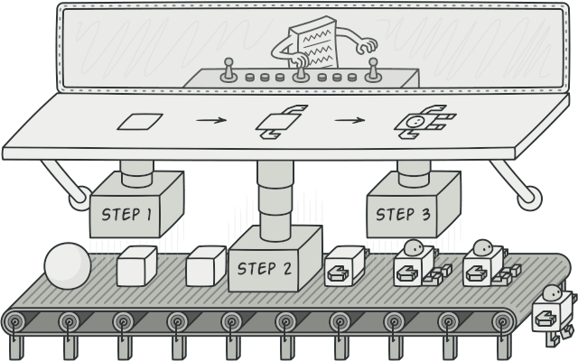

</div>

* هنگام **تولید آبجکت با تعداد پارامتر زیاد**
* هنگامی‌که ساخت آبجکت Cost زیاد دارد(مثل کوئری دیتابیس مثلا QuerySet در جنگو)
* هنگامی‌که نمونه‌های قابل تولید از کلاس(باتوجه به مقادیر) می‌تواند رفتار متفاوت داشته باشند
* **هدف‌ایجاد**: تسهیل مقداردهی پارامترهای زیاد هنگام ساخت کلاس به‌صورت یکجا
    * فراهم کردن یک رابط برای ساخت شیء پیچیده به‌صورت تدریجی و مرحله‌ای
* اجزا
    * **Product**:(محصول) شیء نهایی است که توسط Builder ساخته می‌شود.
    * **Builder**: یک رابط یا کلاس انتزاعی که مسئول ایجاد و عملیات ساخت بخش‌های مختلف شیء است.
    * **ConcreteBuilder**: پیاده‌سازی واقعی کلاس Builder است که جزئیات ساخت را انجام می‌دهد(کمک می‌کند تا فرآیند ساخت طبق دستورالعمل‌های مشخص پیش برود)
    * **Director**: مسئول هدایت فرآیند ساخت است (گاهی اوقات اختیاری است).
        * وقتی ترتیب توابع مهم باشد و الگوی خاصی مد نظر باشد از این ساختار استفاده می‌کنیم
        * اگر فرآیند ساخت پیچیده باشد، می‌توانیم از Director استفاده کنیم تا فرآیند ساخت تحت کنترل باشد.
        * اگر ساده باشد، می‌توانیم از Builder به‌طور مستقیم استفاده کنیم.
    * **Client**: مسئول درخواست از Builder برای ساخت شیء است.
* مثال: هنگام ایجاد یک کلاس QueryBuilder برای SQL که نیازمند تعداد پارامترهای زیاد نظیر موارد زیر می‌باشد:
    * تعداد اجزای Selection
    * دریافت تک به تک عبارت‌های شرطی که بعنوان where استفاده خواهد شد یا همانWhere clause ها
    * GroupBy ها
    * OrderBy ها و …
* نکات
    * استفاده از inner class ها دراین الگوی طراحی توصیه می‌شود
        * پیشنهاد می‌شود کلاس اصلی را به‌صورت innerClass درون کلاس Builder تعریف نمود تا پیچیدگی کاهش یابد
    * معمولاً اسم Builder را به انتهای کلاس می‌افزایند
    * متدهایی تحت عناوین مثلاً build یا getResult ایجاد نماییم تا بعنوان ارائه دهنده خروجی نهایی یا آبجکت نهایی عمل نماید

## 2.1. 🅱️ Python

```python
# ╔═════════╗
# ║ Product ║
# ╚═════════╝
class Computer:
    def __init__(self, processor, memory, storage, graphics):
        self.processor = processor
        self.memory = memory
        self.storage = storage
        self.graphics = graphics

    def __str__(self):
        return f"Computer with {self.processor} CPU, {self.memory}GB RAM, {self.storage}GB Storage, {self.graphics} Graphics."


# ╔═════════╗
# ║ Builder ║ # سازنده
# ╚═════════╝
from abc import ABC, abstractmethod


class ComputerBuilder(ABC):  # یک رابط است که تمامی متدهایی را که برای ساخت یک کامپیوتر نیاز داریم (مثلاً تنظیم پردازنده، حافظه، ذخیره‌سازی و گرافیک) را تعریف می‌کند.

    @abstractmethod
    def set_processor(self, processor: str):
        pass

    @abstractmethod
    def set_memory(self, memory: int):
        pass

    @abstractmethod
    def set_storage(self, storage: int):
        pass

    @abstractmethod
    def set_graphics(self, graphics: str):
        pass

    @abstractmethod
    def build(self) -> Computer:
        pass


# ╔═════════════════╗
# ║ ConcreteBuilder ║ # پیاده‌سازی واقعی سازنده
# ╚═════════════════╝
class GamingComputerBuilder(ComputerBuilder):

    def __init__(self):
        self.computer = Computer(None, None, None, None)

    def set_processor(self, processor: str):
        self.computer.processor = processor

    def set_memory(self, memory: int):
        self.computer.memory = memory

    def set_storage(self, storage: int):
        self.computer.storage = storage

    def set_graphics(self, graphics: str):
        self.computer.graphics = graphics

    def build(self) -> Computer:
        return self.computer


# ╔══════════╗
# ║ Director ║ # مسئول ساخت
# ╚══════════╝
class Director:  # فرآیند ساخت کامپیوترهای خاص را مدیریت می‌کند

    def __init__(self, builder: ComputerBuilder):
        self.builder = builder

    def construct_gaming_computer(self):
        self.builder.set_processor("Intel i9")
        self.builder.set_memory(32)
        self.builder.set_storage(1024)
        self.builder.set_graphics("NVIDIA RTX 3080")

    def construct_office_computer(self):
        self.builder.set_processor("Intel i5")
        self.builder.set_memory(16)
        self.builder.set_storage(512)
        self.builder.set_graphics("Integrated")


# ╔════════╗
# ║ Client ║
# ╚════════╝
if __name__ == "__main__":  # استفاده از Director

    gaming_computer_builder = GamingComputerBuilder()
    director = Director(gaming_computer_builder)
    director.construct_gaming_computer()

    gaming_computer = gaming_computer_builder.build()
    print(gaming_computer)

    # استفاده از Director برای ساخت یک کامپیوتر اداری
    office_computer_builder = GamingComputerBuilder()  # می‌توان از همان کلاس برای ساخت نوع دیگری از کامپیوتر استفاده کرد
    director = Director(office_computer_builder)
    director.construct_office_computer()

    office_computer = office_computer_builder.build()
    print(office_computer)

###### output:
# Computer with Intel i9 CPU, 32GB RAM, 1024GB Storage, NVIDIA RTX 3080 Graphics.
# Computer with Intel i5 CPU, 16GB RAM, 512GB Storage, Integrated Graphics.
```

## 2.2. 🅱️ Java

* در جاوا کلاس‌هایی از جمله DocumentBuilder وStringBuilder و Locale.Builder یا JsonBuilder وجود دارد که در آن از این شیوه استفاده شده است

### 2.2.1. ✅️ StringBuilder

کلاس StringBuilder (موجود در Java.lang) قابلیت افزودن دیتا به یک رشته را به گونه‌ای دارد که بعنوان رشته اصلی عمل کرده و هر بار دیتای جدید مستقیماً با آن اضافه می‌شود و نیازبه ساخت شیء string جدید بعنوان subString نیست تا آن شیء را به رشته اصلی(شیء اصلی) append نماییم

```java
StringBuilder builder = new StringBuilder();
string result = builder.append("Hello, I am").append(33).append("years old").toString();
```

### 2.2.2. ✅️ H264PropertiesBuilder

#### 2.2.2.1. ❇️ without Builder

فرض کنید کلاس decoder فرمت H262 را بخواهیم پیاده‌سازی نماییم آنگاه بدلیل وجود پارامترهای زیاد، در حالت بدون Builder به شکل زیر می‌باشد(۱-کلاس سازنده با پارامتر زیاد ۲-getter برای هرکدام ۳-setter برای هرکدام)

```java
public class H263Properties{
    int keyInt;
    int minKeyInt;
    int sceneCut;
    int bFrames
    int bAdabt
    int qp
    int bitrate
    boolean bFrameBias
    int crf
    int qpstep
    int pbRatio
    int chromaOffset
    float rateTol
    byte pass
    boolean state
    int direct
    int meRange
    boolean weightB
    boolean noFastPSkip

    #تابع سازنده
    public  H263Properties(int keyInt, int minKeyInt, int sceneCut,int bFrames,int bAdabt, int qp, int bitrate, boolean bFrameBias, int crf, int qpstep, int pbRatio, int chromaOffset, float rateTol, byte pass, boolean state, int direct, int meRange, boolean weightB, boolean noFastPSkip){}

    #ایجاد کلاس سِتِر برای همه پارامترهای این کلاس
    public void setMinKeyInt(int minKeyInt){
        this.minKeyInt = minKeyInt;
        return this.minKeyInt = minKeyInt;
    }

    #ایجاد کلاس گِتِر برای همه پارامترهای این کلاس
    public int getMinKeyInt(){
        return minKeyInt;
    }
    
}
```

کلاس main شیوه بدون Builder به شکل زیر خواهد شد

```java
public class Main {
    public static void main(String[] args){
        H263Properties  decoder – new  H263Properties();
        decoder.setbAdapt(12) ;
        decoder.setbweghtB(yes) ;
        decoder.setrateTol (1.5) ;
        …
        تعداد بسیار زیاد باید تنظیم نماید
    }
}
```

#### 2.2.2.2. ❇️ with Builder

باید کلاسH264Properties بدون Builder را همانند بخش قبل داشته باشیم و همراه آن کلاس در وضعیت Builder نیز به شکل زیر تولید شود

```java
public class H263Properties‌Builder{
    int keyInt;
    int minKeyInt;
    int sceneCut;
    int bFrames
    int bAdabt
    int qp
    int bitrate
    boolean bFrameBias
    int crf
    int qpstep
    int pbRatio
    int chromaOffset
    float rateTol
    byte pass
    boolean state
    int direct
    int meRange
    boolean weightB
    boolean noFastPSkip

    #نوشت تابع مشابه سِتِر اما بدون کلمه سِتِر برای همه پارامترهای این کلاس به شکل زیر
    public  H263PropertiesBuilder MinKeyInt(int minKeyInt){ #نکته: کلمه سِت از نام تابع حذف شده است
        this.minKeyInt = minKeyInt;
        return this;
    }
    
    public H263Properties build() {
        H263Properties decoder = new  H263Properties();
        decoder.setbAdapt(badapt) ;
        decoder.setbweghtB(weightB) ;
        decoder.setrateTol (rateTol) ;
        ...
        //یک بار برای تک تک پارامترها مقدارها را قرار می‌دهیم
    }
}
```

کلاس main شیوه Builder به شکل زیر خواهد شد

```java
public class Main {
    public static void main(String[] args){
        H263Properties decoderBuilder = new  H263PropertiesBuilder();
        H263Properties decoder = builderDecoder.frame(12).KeyInt(17).rateTol(1.5).minKeyInt(2).sceneCut(9)……….build() ;
    }
}
```

* **نکته‌ها**
    * در کلاس Builder مقدار بازگشتی تابع Setter هرکدام از پارامترها باید به‌جای نوع(مثلا int یا string یا …) به نام کلاس تغییر پیدا کند
    * در کلاس Builder کلمه set از نام تابع بازگشتی حذف می‌شود
    * در کلاس Builder توابع getter همانند وضعیت بدون Builder خواهند بود
    * در کلاس Builder تابع build را ایجاد نماییم که قرار است خروجی نهایی رو برگرداند

# 3. 🅰️Creational.Prototype(به جای ایجاد شیء جدید از طریق توابع سازنده، اشیاء جدید توسط کپی از شیء موجود ایجاد شوند)

این امکان را می‌دهد که یک شیء جدید را از طریق کپی کردن شیء موجود و اعمال تغییرات بر روی نسخه‌های جدید، ایجاد کنید

<div style="display: flex; flex-direction: column; align-items: center;">


</div>

* اغلب در موقعیت‌هایی استفاده می‌شود که نیاز به ایجاد نسخه‌های مشابه از یک شیء با تنظیمات خاص نیاز باشد
* **هدف**: جلوگیری از ساختن مکرر اشیاء مشابه است
    * زمانی که ایجاد اشیاء پیچیده هزینه‌بر است
    * زمانی که نیاز به ایجاد نسخه‌های مشابه با تفاوت‌های جزئی داریم
    * زمانی که تغییرات زیادی روی شیء انجام نمی‌دهید
    * زمانی که می‌خواهید تاریخچه از اشیاء ایجاد شده داشته باشید
* **Shallow Copy(کپی سطحی)**: یک کپی سطحی از شیء اصلی ایجاد می‌شود.
    * به این معنی که شیء جدید به شیء اصلی اشاره می‌کند (درواقع، به آن ارجاع داده می‌شود) در حالی که مقادیر اولیه (مثل لیست‌ها) به صورت مشترک بین شیء اصلی و کپی استفاده می‌شوند.
* **Deep Copy**: در این حالت، یک کپی کامل از شیء اصلی و تمام مقادیر داخلی آن ایجاد می‌شود. در این حالت، حتی شیء‌های داخلی (مثل لیست‌ها) نیز به طور کامل کپی می‌شوند و از شیء اصلی جدا می‌شوند.

## 3.1. 🅱️Python

```python
import copy


class Prototype:
    def __init__(self, name, data):
        self.name = name
        self.data = data  # یک لیست به عنوان داده

    def __str__(self):
        return f"Prototype(Name: {self.name}, Data: {self.data})"

    def clone_shallow(self):  # کپی سطحی (Shallow Copy)
        return copy.copy(self)

    def clone_deep(self):  # کپی عمیق (Deep Copy)
        return copy.deepcopy(self)


original_prototype = Prototype("Original", [1, 2, 3])
shallow_copy = original_prototype.clone_shallow()
deep_copy = original_prototype.clone_deep()

shallow_copy.data[0] = 100  # تغییر اولین عنصر در لیست کپی سطحی
deep_copy.data[1] = 200  # تغییر دومین عنصر در لیست کپی عمیق

# نمایش نتایج
print("Original Prototype:", original_prototype)
print("Shallow Copy:", shallow_copy)
print("Deep Copy:", deep_copy)

# بررسی حافظه
print("\nMemory Address of original prototype data:", id(original_prototype.data))
print("Memory Address of shallow copy data:", id(shallow_copy.data))
print("Memory Address of deep copy data:", id(deep_copy.data))

# output:
## -----> Original Prototype: Prototype(Name: Original, Data: [100, 2, 3])
## -----> Shallow Copy: Prototype(Name: Original, Data: [100, 2, 3])
## -----> Deep Copy: Prototype(Name: Original, Data: [1, 200, 3])
## -----> 
## -----> Memory Address of original prototype data: 140324630499072
## -----> Memory Address of shallow  copy      data: 140324630499072
## -----> Memory Address of deep     copy      data: 140324630507968

```

* DAO(DataAccessObject):  یک Design Pattern است. می‌گوید متدهای ادیت در دیتابیس را از یک کلاس اصلی جدا کرده و یک کلاس همنام با افزونه DAO بسازید و وظیفه واکشی و ثبت اطلاعات پیرامون کلاس اصلی را به آن بسپارید

# 4. 🅰️Creational.FactoryMethod(پنهان‌سازی پیچیدگی‌های ساخت شیء برپایه وراثت)

در این الگوی طراحی مسئولیت انتخاب نوع شیء و چگونگی پیاده‌سازی را به زیرکلاس‌ها واگذار می‌کند، در حالی که کلاس پایه الگوریتم کلی کار را حفظ می‌کند. به عبارتی در کلاس پایه(والد) می‌دانیم که چه کاری قرار است انجام شود ولی چگونگی انجام کار و پیاده‌سازی و اعمال پیچیدگی‌ها در زیرکلاس انجام خواهد شد

<div style="display: flex; flex-direction: column; align-items: center;">


</div>

* **هدف‌ایجاد**:پنهان‌سازی پیچیدگی‌های ساخت شیء(برنامه‌نویس درگیر پیچیدگی‌های آبجکت‌ها نشود و به سهولت نمونه بسازد)
* این الگوی طراحی برپایه اصل وراثت بنا نهاده شده(Inheritance).نوع دقیق شیء توسط زیرکلاس‌ها مشخص می‌شود
* موارد کاربرد
    * زمانی که از سیستم cache استفاده می‌شود
    * .خصوصا زمانی که تولید نمونه‌ها پرهزینه خواهد بود(ارتباط با دیتابیس، پرینتر، اسکنر،دیوایس‌های External وغیره)
        * یک راه دیگر این است که می‌توان نمونه‌ها را در فضای استاتیک نگهداری کرد و در ه‍ربار فراخوانی فقط از آن استفاده نمود
* مثال
    * کلاسی برای تبدیل فرمت عکس به فرمت‌های گوناگون(JPG, PNG, GIF, SVG, غیره) که در آن «ساختارکلاس» و پارامترهای هر فرمت نسبت به دیگری منحصربه‌فرد خواهد بود
    * Number Format: نوع اعداد فارسی یا عربی یا فرمت انگلیسی باشد
    * Resource Bundle: ایجاد نمونه متفاوت برحسب تنظیمات
    * Calendar: نوع تقویم جلالی یا میلادی یا هجری‌قمری یا عبری یا پهلوی یا غیره باشد(قطعه‌کد زیر که برحسب منطقه خاص می‌تواند Locale بپذیرد)
* این الگوی طراحی به کد قابلیت گسترش می‌دهد(در مثال تغییر فرمت تصاویر به یکدیگر می‌توانیم به سهولت یک فرمت جدید بیافزاییم)
* برای کدنویسی در این الگوی طراحی از تایپ هینت‌های پیشرفته(نظیر استفاده از TypeVar و Generic) برای حفظ دقت نوع در سلسله مراتب کلاس استفاده نمایید
* استفاده از if-else درون FactoryMethod نشان دهنده این است که طراحی ضعیف است. هر شرط باید به یک زیرکلاس تبدیل شود.
* ساده‌ترین قانون
    * اگر نیاز دارید همیشه چند شیء خاص با هم کار کنند، از الگوی طراحی Abstract Factory استفاده کنید.
    * اگر فقط یک شیء با واریانت‌های مختلف دارید، از الگوی طراحی Factory Method استفاده کنید

## 4.1. 🅱️ PythonExample

```python
from abc import ABC, abstractmethod


# ╔════════════╗
# ║ Example1️⃣️: ║ 
# ╚════════════╝
class Animal(ABC):
    @abstractmethod
    def speak(self):
        pass


class Dog(Animal):
    def speak(self):
        return "Woof!"


class Cat(Animal):
    def speak(self):
        return "Meow!"


class AnimalFactory(ABC):
    @abstractmethod
    def create_animal(self):
        pass


class DogFactory(AnimalFactory):
    def create_animal(self):
        return Dog()


class CatFactory(AnimalFactory):
    def create_animal(self):
        return Cat()


# ✅️ ====> Alternative for Animal,AnimalFactory
# ✅️ class Animal:
# ✅️     def speak(self):
# ✅️         raise NotImplementedError
# ✅️ class AnimalFactory:
# ✅️     def create_animal(self):
# ✅️         raise NotImplementedError

# Ussing
print(DogFactory().create_animal().speak())  # Woof!
print(CatFactory().create_animal().speak())  # Meow!

# ╔════════════╗
# ║ Example2️⃣️: ║ 
# ╚════════════╝
from abc import ABC, abstractmethod


# region Vehicle Abstract class

class Vehicle(ABC):
    @abstractmethod
    def move(self):
        raise NotImplementedError


# endregion

# region Vehicles

class Car(Vehicle):
    def move(self):
        print('car is moving...')


class Truck(Vehicle):
    def move(self):
        print('truck is moving...')


class Motorcycle(Vehicle):
    def move(self):
        print('motorcycle is moving...')


# endregion

# region Vehicle Abstract Class

class VehicleFactory(ABC):
    @abstractmethod
    def create_vehicle(self) -> 'Vehicle':
        raise NotImplementedError


# endregion

# region Vehicle Factories

class CarFactory(VehicleFactory):
    def create_vehicle(self) -> 'Vehicle':
        return Car()


class TruckFactory(VehicleFactory):
    def create_vehicle(self) -> 'Vehicle':
        return Truck()


class MotorcycleFactory(VehicleFactory):
    def create_vehicle(self) -> 'Vehicle':
        return Motorcycle()


# endregion

# region Get Vehicle Factory

def get_vehicles_factory(vehicle_type: str) -> 'VehicleFactory':
    factories = {
        'car': CarFactory,
        'truck': TruckFactory,
        'motorcycle': MotorcycleFactory
    }

    if vehicle_type in factories:
        return factories[vehicle_type]()

    raise ValueError('Your desired vehicle factory not found')


# endregion

# region Client Code

if __name__ == '__main__':
    vehicle_factory = get_vehicles_factory('car')
    vehicle = vehicle_factory.create_vehicle()
    print(vehicle)
    vehicle.move()

# endregion

# ╔════════════╗
# ║ Example3️⃣️: ║ 
# ╚════════════╝
from abc import ABC, abstractmethod


# ======================
# 1. محصول انتزاعی (قرارداد رفتاری)
# ======================
class PaymentProcessor(ABC):
    """
    رابط انتزاعی برای تمام درگاه‌های پرداخت.
    تضمین می‌کند همه درگاه‌ها حداقل این دو رفتار را پیاده‌سازی کنند.
    """

    @abstractmethod
    def pay(self, amount: float) -> str:
        """دریافت مبلغ و بازگرداندن پیام تراکنش"""
        pass

    @abstractmethod
    def get_gateway_name(self) -> str:
        """بازگرداندن نام درگاه پرداخت"""
        pass


# ======================
# 2. محصولات ملموس (پیاده‌سازی‌های واقعی)
# ======================
class ZarinpalProcessor(PaymentProcessor):
    """درگاه پرداخت زرین‌پال"""

    def pay(self, amount: float) -> str:
        return f"✅ پرداخت {amount:,} تومان از طریق زرین‌پال موفقیت‌آمیز بود."

    def get_gateway_name(self) -> str:
        return "زرین‌پال"


class PayPingProcessor(PaymentProcessor):
    """درگاه پرداخت پی‌پینگ"""

    def pay(self, amount: float) -> str:
        return f"✅ پرداخت {amount:,} تومان از طریق پی‌پینگ تأیید شد."

    def get_gateway_name(self) -> str:
        return "پی‌پینگ"


# ======================
# 3. سازنده انتزاعی (منطق کلی کسب‌وکار)
# ======================
class PaymentService(ABC):
    """
    کلاس پایه‌ای که:
    - منطق اصلی پرداخت را پیاده‌سازی می‌کند (process_payment)
    - ساخت شیء را به زیرکلاس‌ها واگذار می‌کند (_create_processor)
    - به جزئیات پیاده‌سازی درگاه وابسته نیست
    """

    @abstractmethod
    def _create_processor(self) -> PaymentProcessor:
        """
        Factory Method اصلی:
        - هر زیرکلاس نوع درگاه را مشخص می‌کند
        - نام با _ نشان‌دهنده داخلی بودن و عدم استفاده مستقیم توسط کلاینت
        """
        pass

    def process_payment(self, amount: float) -> None:
        """
        منطق کسب‌وکار اصلی (یکسان برای همه درگاه‌ها):
        1. ساخت درگاه از طریق Factory Method
        2. اجرای پرداخت
        3. لاگ‌گیری یکدست
        """
        processor = self._create_processor()  # تمرکز الگو: ساخت به زیرکلاس واگذار شد
        result = processor.pay(amount)
        print(f"\n[سیستم] تراکنش از طریق {processor.get_gateway_name()}:")
        print(result)


# ======================
# 4. سازنده‌های ملموس (انتخاب نوع درگاه)
# ======================
class ZarinpalService(PaymentService):
    """سرویس پرداخت با درگاه زرین‌پال"""

    def _create_processor(self) -> PaymentProcessor:
        return ZarinpalProcessor()


class PayPingService(PaymentService):
    """سرویس پرداخت با درگاه پی‌پینگ"""

    def _create_processor(self) -> PaymentProcessor:
        return PayPingProcessor()


# ======================
# 5. استفاده در دنیای واقعی (کلاینت)
# ======================
def main():
    print("=" * 50)
    print("سیستم پرداخت فروشگاه آنلاین")
    print("=" * 50)

    # لیست سرویس‌های پرداخت (بدون نیاز به if-else برای انتخاب درگاه!)
    services = [
        ZarinpalService(),
        PayPingService()
    ]

    # پردازش پرداخت برای هر درگاه
    for service in services:
        service.process_payment(150000)  # مبلغ ثابت برای تست

    # ✨ نکته طلایی گسترش:
    # برای افزودن درگاه جدید (مثلاً آیدی‌پی):
    # 1. کلاس IdPayProcessor از PaymentProcessor بسازید
    # 2. کلاس IdPayService از PaymentService ارث ببرد و _create_processor را پیاده‌سازی کند
    # 3. در لیست services اضافه کنید
    # → هیچ خط از کد موجود تغییر نمی‌کند! (اصل Open/Closed)


if __name__ == "__main__":
    main()

# ╔════════════╗
# ║ Example4️⃣️: ║ 
# ╚════════════╝

from abc import ABC, abstractmethod
from typing import Final


# =============================================================================
# 📌 توضیح ساختار پیاده‌سازی:
# - این پیاده‌سازی **فقط** از الگوی "فکتوری متد" استفاده می‌کند.
# - **هیچ "فکتوری کلاس" (Simple Factory) در این کد وجود ندارد**.
#   (فکتوری کلاس = کلاسی با منطق شرطی داخلی مثل if/else برای انتخاب نوع شیء)
# - تمام تصمیم‌گیری‌ها از طریق ارث‌بری و پیاده‌سازی متد توسط زیرکلاس‌ها انجام می‌شود.
# =============================================================================


# ======================
# 1. محصول انتزاعی: قرارداد رفتاری برای همه درگاه‌های ارسال پیامک
# ======================
class SMSProvider(ABC):
    """رابط انتزاعی برای تمام درگاه‌های ارسال پیامک"""

    @abstractmethod
    def send(self, phone: str, message: str) -> bool:
        """ارسال پیامک به شماره مشخص با متن داده‌شده"""
        pass

    @abstractmethod
    def get_provider_name(self) -> str:
        """بازگرداندن نام درگاه ارائه‌دهنده سرویس"""
        pass


# ======================
# 2. محصولات ملموس: پیاده‌سازی‌های واقعی درگاه‌ها
# ======================
class KaveNegarProvider(SMSProvider):
    """درگاه پیامک کاوه نگار"""

    def send(self, phone: str, message: str) -> bool:
        # در پیاده‌سازی واقعی، اینجا ارتباط با API کاوه نگار برقرار می‌شود
        print(f"📡 در حال ارسال از طریق کاوه نگار به {phone}...")
        return True  # فرض موفقیت‌آمیز بودن برای مثال

    def get_provider_name(self) -> str:
        return "کاوه نگار"


class SignalProvider(SMSProvider):
    """درگاه پیامک سیگنال"""

    def send(self, phone: str, message: str) -> bool:
        # در پیاده‌سازی واقعی، اینجا ارتباط با API سیگنال برقرار می‌شود
        print(f"📡 در حال ارسال از طریق سیگنال به {phone}...")
        return True  # فرض موفقیت‌آمیز بودن برای مثال

    def get_provider_name(self) -> str:
        return "سیگنال"


# ======================
# 3. سازنده انتزاعی: تعریف چارچوب کلی ارسال پیامک
# ======================
class SMSProviderService(ABC):
    """
    کلاس پایه‌ای که:
    - منطق اصلی ارسال پیامک را پیاده‌سازی می‌کند (send_message)
    - ساخت شیء درگاه را به زیرکلاس‌ها واگذار می‌کند
    - به جزئیات پیاده‌سازی درگاه وابسته نیست
    """

    # =========================================================================
    # 🔑 این متد، همان "فکتوری متد" است!
    # - متد انتزاعی که توسط زیرکلاس‌ها پیاده‌سازی می‌شود
    # - تصمیم "کدام درگاه ساخته شود" را به زیرکلاس واگذار می‌کند
    # - هسته اصلی الگوی فکتوری متد
    # =========================================================================
    @abstractmethod
    def _create_sms_provider(self) -> SMSProvider:
        """فکتوری متد: مسئول ساخت نمونه‌ی درگاه پیامک"""
        pass

    def send_message(self, phone: str, message: str) -> None:
        """
        منطق کسب‌وکار اصلی (یکسان برای همه درگاه‌ها):
        1. ساخت درگاه از طریق فکتوری متد
        2. ارسال پیامک
        3. گزارش نتیجه
        """
        # مرحله 1: دریافت درگاه از طریق فکتوری متد (بدون دانستن نوع دقیق)
        provider: SMSProvider = self._create_sms_provider()

        # مرحله 2: ارسال پیامک با استفاده از رابط انتزاعی
        success = provider.send(phone, message)

        # مرحله 3: گزارش نتیجه
        status = "✅ موفق" if success else "❌ ناموفق"
        print(f"[سیستم] ارسال از طریق {provider.get_provider_name()} به {phone}: {status}")


# ======================
# 4. سازنده‌های ملموس: پیاده‌سازی فکتوری متد برای هر درگاه
# ======================
class KaveNegarService(SMSProviderService):
    """سرویس ارسال پیامک با درگاه کاوه نگار"""

    # =========================================================================
    # 🔑 این پیاده‌سازی، همان "فکتوری متد" برای درگاه کاوه نگار است!
    # - هر زیرکلاس نوع خاص خود را مشخص می‌کند
    # - بدون نیاز به تغییر کد کلاس پایه
    # =========================================================================
    def _create_sms_provider(self) -> SMSProvider:
        return KaveNegarProvider()


class SignalService(SMSProviderService):
    """سرویس ارسال پیامک با درگاه سیگنال"""

    # =========================================================================
    # 🔑 این پیاده‌سازی، همان "فکتوری متد" برای درگاه سیگنال است!
    # =========================================================================
    def _create_sms_provider(self) -> SMSProvider:
        return SignalProvider()


# ======================
# 5. استفاده در دنیای واقعی (کلاینت)
# ======================
def main() -> None:
    """اجرای نمونه‌ی سیستم ارسال پیامک"""
    print("=" * 60)
    print("سیستم ارسال پیامک - پیاده‌سازی استاندارد فکتوری متد")
    print("=" * 60)

    # لیست سرویس‌های پیامک (بدون هیچ شرط‌بندی برای انتخاب درگاه!)
    services: list[SMSProviderService] = [
        KaveNegarService(),
        SignalService()
    ]

    # ارسال پیامک از هر درگاه
    phone_number: Final[str] = "09123456789"
    message: Final[str] = "سلام! کد تأیید شما: 123456"

    for idx, service in enumerate(services, 1):
        print(f"\n{'─' * 58}")
        print(f"ارسال شماره {idx} با {service.__class__.__name__}")
        print(f"{'─' * 58}")
        service.send_message(phone_number, message)

    # ✨ نکته طلایی گسترش:
    # برای افزودن درگاه جدید (مثلاً فارس‌پی):
    # 1. کلاس FarapayamProvider از SMSProvider بسازید
    # 2. کلاس FarapayamService از SMSProviderService ارث ببرد
    # 3. متد _create_sms_provider را در FarapayamService پیاده‌سازی کنید
    # 4. نمونه‌ی FarapayamService را به لیست services اضافه کنید
    # → هیچ خط از کد موجود تغییر نمی‌کند! (اصل باز بودن برای گسترش، بسته بودن برای تغییر)

    # 📌 یادآوری مهم:
    # - "فکتوری متد" = متد انتزاعی _create_sms_provider و پیاده‌سازی‌های آن در زیرکلاس‌ها
    # - "فکتوری کلاس" (Simple Factory) در این پیاده‌سازی وجود ندارد.
    #   (اگر وجود داشت، یک کلاس واحد با متدی شامل if/else برای انتخاب درگاه می‌بود)


if __name__ == "__main__":
    main()
```

## 4.2. 🅱️ Example-Java

```java
import java.util.Calendar;
Calendar x = Calendar.getInstance(Locale.English); #getInstance is Factory
System.out.println(x);
System.out.println(x.get(Calendar.SECOND));
```

* مثال: در مسئله تبدیل فرمت‌تصاویر یک اینترفیس بنام «ImageConvertor» خواهیم داشت که همه «کلاس‌های فرزند» با این اینترفیس تعامل برقرار خواهند کرد و این اینترفیس یک متد بنام Convert خواهد داشت که اطلاعات را میگیرد و خروجی را برمی‌گرداند

به کلاس زیر و نیز پیاده‌سازی‌های آن توجه نمایید

```java
public abstract class Calculation {
    protected int amountPerMonth;
    protected int taxPercent;
    protected string product;

    public Calculation(int amountPerMonth, int taxPercent, string product) {
        this.amountPerMonth =  amountPerMonth;
        this.taxPercent = taxPercent;
        this.product= product;
    }

    public abstract int calculate();
}
```

پیاده‌سازی از نوع Calculation1 :

```java
public class Calculation1 extends Calculation {
    public Calculation1(int amountPerMonth, int taxPercent, string product) {
        super(amountPerMonth, taxPercent, product);
    }
    @Override
    public abstract int calculate() {
        return amountPerMonth * taxPercent + 200;
    }
}
```

پیاده‌سازی از نوع Calculation2 :

```java
public class Calculation2 extends Calculation {
    public Calculation2(int amountPerMonth, int taxPercent, string product) {
        super(amountPerMonth, taxPercent, product);
    }
    @Override
    public abstract int calculate() {
        return amountPerMonth * taxPercent;
    }
}
```

پیاده‌سازی FactoryClass :

```java
public class CalculationFactory {
    public Calculation createCalculation(int amountPerMonth, int taxPercent, string product, boolean flag) {
        if (flag) {
            return new Calculation1(amountPerMonth, taxPercent, product);
        } else {
            return new Calculation2(amountPerMonth, taxPercent, product);
        }
    }
}
```

# 5. 🅰️Creational.AbstractFactory(همانند FactoryMethod فقط هنگام پیچیدگی بیشتر)

الگوی Abstract Factory یک الگوی طراحی از نوع Creational (سازنده) است که برای ساخت خانواده‌ای از اشیای مرتبط یا وابسته به هم، بدون مشخص کردن کلاس دقیق آن‌ها استفاده می‌شود.به زبان ساده:به‌جای اینکه مستقیماً از کلاس‌ها نمونه بسازیم (new)، یک کارخانه می‌سازیم که خودش اشیای مرتبط را برای ما تولید می‌کند.

<div style="display: flex; flex-direction: column; align-items: center;">


</div>

* کارخانه‌ای که خودش کارخانه تولید می‌کند. یعنی Factory والد و Factory فرزند
* کاربرد در سیستم‌های بزرگ و آبجکت‌های سنگین که بخواهند ساخت کلاس فرزند را dynamic کنند.
* وجود interfaceهای مشترک از 2 گروه الف: به ازای هر Factory ب:به ازای هر کلاس‌هایی که داخل Factory است
* مثال کلاس Document Builder: برای Parse کردن فایلXML که یک آبجکت Node به‌صورت درختی برمی‌گرداند که می‌توان به تمامی المنت‌هایxml مورد نظر دسترسی پیدا کرد
* نکات
    * گروهی از factory ها دارای interface مشترک خواهند بودو با هم استفاده می‌شوند
    * abstract Factory ‌ها گروهی از Factory ها هستند که همواره برای ساخته شدن آن‌ها باید ابتدا از یک Factory شروع کرد و سپس به abstractFactory رسید.
    * پیچیدگی در پیاده‌سازی
    * نیاز به abstraction های زیاد
    * الگویی مناسب برای framework ها محسوب می‌شود.(Framework نویس‌ها)

## 5.1. 🅱️ PythonExamples

مثال اول:

```python
from abc import ABC, abstractmethod


# === محصولات انتزاعی (قرارداد خانواده) ===
class Button(ABC):
    @abstractmethod
    def click(self): pass


class Checkbox(ABC):
    @abstractmethod
    def check(self): pass


# === کارخانه انتزاعی (قرارداد ساخت خانواده) ===
class GUIFactory(ABC):  # همزمان دکمه و چک‌باکس می‌سازد و تضمین می‌کند هر دو از یک خانواده (ویندوز یا مک) باشند
    @abstractmethod
    def create_button(self) -> Button: pass

    @abstractmethod
    def create_checkbox(self) -> Checkbox: pass  # ← تفاوت با Factory Method: چند محصول!


# === خانواده ویندوز ===
class WindowsButton(Button):
    def click(self): return "کلیک دکمه ویندوزی"


class WindowsCheckbox(Checkbox):
    def check(self): return "تیک چک‌باکس ویندوزی"


class WindowsFactory(GUIFactory):
    def create_button(self): return WindowsButton()

    def create_checkbox(self): return WindowsCheckbox()  # ← همه محصولات یک خانواده


# === خانواده مک ===
# === خانواده ویندوز ===
class MacButton(Button):
    def click(self): return "کلیک دکمه مک"


class MacCheckbox(Checkbox):
    def check(self): return "تیک چک‌باکس مک"


class MacFactory(GUIFactory):
    def create_button(self): return MacButton()

    def create_checkbox(self): return MacCheckbox()
```

مثال دوم: سناریو: دو تم UI داریم (Light/Dark) و هر تم باید Button و Checkbox هم‌ساز خودش را تولید کند

```python
from __future__ import annotations

from dataclasses import dataclass
from typing import Protocol


# ---------- Abstract Products (Interfaces) ----------
class Button(Protocol):
    def render(self) -> str:
        ...


class Checkbox(Protocol):
    def render(self) -> str:
        ...


# ---------- Concrete Products ----------
@dataclass(frozen=True)
class LightButton:
    def render(self) -> str:
        return "LightButton"


@dataclass(frozen=True)
class DarkButton:
    def render(self) -> str:
        return "DarkButton"


@dataclass(frozen=True)
class LightCheckbox:
    def render(self) -> str:
        return "LightCheckbox"


@dataclass(frozen=True)
class DarkCheckbox:
    def render(self) -> str:
        return "DarkCheckbox"


# ---------- Abstract Factory ----------
class UIAbstractFactory(Protocol):
    # یک خانواده محصولات مرتبط را تولید می‌کند
    def create_button(self) -> Button:
        ...

    def create_checkbox(self) -> Checkbox:
        ...


# ---------- Concrete Factories ----------
class LightThemeFactory:
    def create_button(self) -> Button:
        return LightButton()

    def create_checkbox(self) -> Checkbox:
        return LightCheckbox()


class DarkThemeFactory:
    def create_button(self) -> Button:
        return DarkButton()

    def create_checkbox(self) -> Checkbox:
        return DarkCheckbox()


# ---------- Client ----------
def build_screen(factory: UIAbstractFactory) -> str:
    """
    کلاینت فقط factory انتزاعی را می‌گیرد و محصولات را می‌سازد؛
    هیچ وابستگی به کلاس‌های concrete ندارد.
    """
    btn = factory.create_button()
    cb = factory.create_checkbox()
    return f"Screen[{btn.render()} + {cb.render()}]"


if __name__ == "__main__":
    print(build_screen(LightThemeFactory()))
    print(build_screen(DarkThemeFactory()))
```

مثال سوم[کاربردی و پیشرفته‌تر]: سیستم نوتیفیکیشن چندکاناله

```python
from abc import ABC, abstractmethod
from typing import Final


# =============================================================================
# 📌 بخش ۱: محصولات انتزاعی (قرارداد برای هر کانال)
# =============================================================================
class Notifier(ABC):
    """قرارداد ارسال نوتیفیکیشن"""

    @abstractmethod
    def send(self, message: str) -> bool:   pass


class Logger(ABC):
    """قرارداد لاگ‌گیری رویدادها"""

    @abstractmethod
    def log(self, event: str) -> None:    pass


# =============================================================================
# 📌 بخش ۲: محصولات ملموس — خانواده SMS
# =============================================================================
class SMSNotifier(Notifier):
    def send(self, message: str) -> bool:
        print(f"📱 ارسال پیامک: {message}")
        return True  # در عمل: ارتباط با API


class SMSLogger(Logger):
    def log(self, event: str) -> None:
        print(f"📝 [پیامک] لاگ: {event}")


# =============================================================================
# 📌 بخش ۳: محصولات ملموس — خانواده ایمیل
# =============================================================================
class EmailNotifier(Notifier):
    def send(self, message: str) -> bool:
        print(f"✉️ ارسال ایمیل: {message}")
        return True


class EmailLogger(Logger):
    def log(self, event: str) -> None:
        print(f"📝 [ایمیل] لاگ: {event}")


# =============================================================================
# 📌 بخش ۴: کارخانه انتزاعی (هسته الگو)
# =============================================================================
class NotificationFactory(ABC):
    """
    کارخانه انتزاعی برای ساخت خانواده کامل نوتیفیکیشن.
    تضمین می‌کند که Notifier و Logger همیشه از یک خانواده باشند.
    """

    @abstractmethod
    def create_notifier(self) -> Notifier:
        """ساخت کامپوننت ارسال پیام"""
        pass

    @abstractmethod
    def create_logger(self) -> Logger:
        """ساخت کامپوننت لاگ‌گیری"""
        pass


# =============================================================================
# 📌 بخش ۵: کارخانه‌های ملموس (پیاده‌سازی خانواده‌ها)
# =============================================================================
class SMSNotificationFactory(NotificationFactory):
    """کارخانه خانواده پیامک"""

    def create_notifier(self) -> Notifier:
        return SMSNotifier()

    def create_logger(self) -> Logger:
        return SMSLogger()  # ← همیشه با هم استفاده می‌شوند


class EmailNotificationFactory(NotificationFactory):
    """کارخانه خانواده ایمیل"""

    def create_notifier(self) -> Notifier:
        return EmailNotifier()

    def create_logger(self) -> Logger:
        return EmailLogger()  # ← همیشه با هم استفاده می‌شوند


# =============================================================================
# 📌 بخش ۶: کلاینت — استفاده صحیح از خانواده‌ها
# =============================================================================
def send_notification(factory: NotificationFactory, message: str) -> None:
    """
    تابع کلاینت که:
    - به جزئیات پیاده‌سازی وابسته نیست
    - از کارخانه برای دریافت کل خانواده استفاده می‌کند
    - تضمین می‌کند کامپوننت‌ها با هم سازگار باشند
    """
    # دریافت کل خانواده از یک کارخانه
    notifier = factory.create_notifier()
    logger = factory.create_logger()

    # استفاده هماهنگ از کامپوننت‌های خانواده
    if notifier.send(message):
        logger.log(f"پیام '{message}' ارسال شد")
    else:
        logger.log(f"خطا در ارسال پیام '{message}'")


# =============================================================================
# 📌 اجرای نمونه
# =============================================================================
def main():
    print("🚀 سیستم نوتیفیکیشن چندکاناله\n")

    # ارسال از طریق خانواده پیامک
    print("─" * 50)
    print("ارسال با کانال پیامک:")
    print("─" * 50)
    sms_factory = SMSNotificationFactory()
    send_notification(sms_factory, "کد تأیید: 789012")

    # ارسال از طریق خانواده ایمیل
    print("\n" + "─" * 50)
    print("ارسال با کانال ایمیل:")
    print("─" * 50)
    email_factory = EmailNotificationFactory()
    send_notification(email_factory, "سفارش شما ثبت شد")

    # ✨ گسترش آینده:
    # برای افزودن کانال پوش‌نوتیفیکیشن:
    # 1. PushNotifier و PushLogger بسازید
    # 2. PushNotificationFactory از NotificationFactory ارث ببرد
    # 3. در تابع send_notification هیچ تغییری نیاز نیست!


if __name__ == "__main__":
    main()

# ╔═════════╗
# ║ OUTPUT: ║ 
# ╚═════════╝

# 🚀 سیستم نوتیفیکیشن چندکاناله
# 
# ──────────────────────────────────────────────────
# ارسال با کانال پیامک:
# ──────────────────────────────────────────────────
# 📱 ارسال پیامک: کد تأیید: 789012
# 📝 [پیامک] لاگ: پیام 'کد تأیید: 789012' ارسال شد
# 
# ──────────────────────────────────────────────────
# ارسال با کانال ایمیل:
# ──────────────────────────────────────────────────
# ✉️ ارسال ایمیل: سفارش شما ثبت شد
# 📝 [ایمیل] لاگ: پیام 'سفارش شما ثبت شد' ارسال شد
```

## 5.2. 🅱️ JavaExamples

مثال اول DocumentBuilderFactory:

```java
DocumentBuilderFactory abstractFactory = DocumentBuilderFActory.newInstance();
DocumentBuilder documentBuilder = abstractFactory.newDocumentBuilder();
Document document = documentBuilder.pars(new ByteArrayInputStream("<person><firstName>Behrooz</firstName><lastName>MohammadiNasab</lastName></person>".getBytes(“UTF-8”)));
document.normalizeDocument();
System.out.println(documentBuilder.getClass());
System.out.println(document.getClass());
```

مثال دوم MediaConverterFactory

```java
MediaConverterFactory abstraactFactory =
          MediaConverterAbstractFactory.createFactory(Converter.Type.IMAGE);
try{
      Converter converter = abstractFactory.createConverter(new File(“/FileName/Directions/pic1.bmp”),Converter.CodeTypes.JPG);
      System.out.println(abstractFactory.getClass());
      System.out.println(converter.getClass());
      byte[] bytes = converter.doConvert();
} catch (FileNotFountExeption | ConvertionExeption e) { e.printStachTrace(); }

public interface MediaConverterAbstractFactory {
   static MediaConverterFactory createFactory(Converter.Type type) {
      switch (type) {
         case AUDIO:
            return new MusicConverterFactory();
         case VIDEO:
            return new VideoConverterFactory();
         case Image:
            return new ImageConverterFactory();
      }
      throw new OllegalArgumentsException(“Wrong Converter Type”);
   }
}

public class ImageConverterFactory implements MediaConverterFactory {
   public Converter createConverter(File file, Converter.CodecTypes toImageType)
      throws FileNotFoundException {
         String name = file.getName().toLowerCase();
         if (name.endWith(“.bmp”)){ 
            switch (toImageType){
               case JPG:
                  return new BmpToJpgConverter(file);
               // AND MORE
            }
         }
         throw new IllegalArgumentException(“No Converter Found”);
   }
}
```

که کار آن این است که در حالت‌های موسیقی و ویدئو و عکس بتواند فرمت‌های متفاوت را تبدیل نماید.

# 6. 🅰️ Behavioral.Command(انجام عملیات تحت آبجکت مستقل)

الگویی است که یک «دستور یا درخواست یا عملیات» را به‌جای اینکه مستقیم و فوری اجرا کند ابتدا آن را بعنوان یک آبجکت مستقل درنظر می‌گیرد. آبجکتی که تمام اطلاعات لازم برای انجام دستور نظیر گیرندهٔ عملیات، پارامترها، و … را در خودش نگه می‌دارد نتیجه این است که فرستندهٔ درخواست(Invoker) از اجراکنندهٔ واقعی(Receiver) جدا می‌شود و در این خلال می‌توان علمیات
متفاوت نظیر صف‌کردن، ذخیره‌کردن، لاگ‌گرفتن، اجرای با تأخیر، و Undo یا Redo را نیز داشته باشیم و هندل نماییم

به زبان ساده: به‌جای اینکه “کلیک روی دکمه” مستقیم برود و “کد روشن‌کردن چراغ” را صدا بزند، یک آبجکت Command می‌سازید که می‌گوید «روشن‌کردن چراغ با این پارامترها»، بعد دکمه فقط execute() را صدا می‌زند.

<div style="display: flex; flex-direction: column; align-items: center;">


</div>

* معمولا در موارد زیر استفاده می‌شود
    * **کاهش وابستگی(Decoupling)**: فراخوانی کننده(Invoker) نداند دقیقاً چه کسی یا چگونه کار را انجام می‌دهد. فقط بداند «یک کامند قابل اجرا» دارد.
    * **تغییرپذیری‌رفتار درزمان‌اجرا**: بتوانید به یک دکمه یا منو یا روش روتین، فرمان‌های مختلف وصل کنید.
    * **صف‌واجرای باتأخیر**: فرمان‌ها را در Queue نگه دارید و بعداً یا در یک Worker اجرا کنید
    * ثبت‌وبازپخش (Macro یا History یا Auditing): فرمان‌ها را ذخیره کنید و دوباره اجرا کنید(مثل macro recording)
    * Undo یا Redo: با نگه‌داشتن تاریخچهٔ فرمان‌های اجراشده و پیاده‌سازی `undo()` بتوانید بازگشت انجام دهید
    * تراکنش و Rollback: چند عملیات را پشت سر هم اجرا کنید و اگر یکی شکست خورد، قبلی‌ها را برگردانید(مفهوم rollback شبیه‌تراکنش)
* اجزای اصلی این الگوی‌طراحی
    * جزء **Command**: «اینترفیس» یا «پروتکلِ‌فرمان»(مثلاً `execute()` و گاهی `undo()`).
    * جزء **ConcreteCommand**: پیاده‌سازی مشخص یک فرمان (مثل TurnOnLightCommand).
    * جزء **Receiver**: کسی که کار واقعی را انجام می‌دهد (مثل Light که متد `on()` دارد).
    * جزء **Invoker**: کسی که فرمان را اجرا می‌کند (مثل RemoteButton یا منو). معمولاً فقط `command.execute()` را صدا می‌زند.
    * جزء **Client**: کسی که همه چیز را سرِ هم می‌کند: Receiver را می‌سازد، ConcreteCommand می‌سازد و به Invoker می‌دهد
* جریان اجرا به صورت عادی:
    * Client → (Create Receiver + Command) → Connect Command to Invoker → Invoker: execute() → Do Command on Receiver
* صف یا Queue(محل نگهداری تسک‌ها یا جاب‌ها که خودش کاری نمی‌کند و فقط داده را نگه‌می‌دارد) و پروسس یا worker(پردازه که تسک را از صف برمیدارد و آن را اجرا میکند) متفاوت هستند
* به صف، Broker هم می‌گویند
* جزء کامند باید چه چیزی را در خود نگه دارد
    * حداقل باید مرجع Receiver به همراه پارامترهای لازم را نگهداری کند
    * برای Undo باید وضعیت قبل را هم ذخیره کند، یا بتواند «عمل معکوس» را انجام دهد
* برای اعمال Undo/Redo استاندارد
    * رویکرد اول **InverseOperation**: هر فرمان `undo()` دارد که اثر همان فرمان را برمی‌گرداند (مثلاً Reserve → Release).
    * رویکرد دوم **Snapshot/Memento**: قبل از `execute()` یک snapshot از حالت لازم ذخیره می‌کنید و در `undo()` آن را برمی‌گردانید (مخصوصاً وقتی برگشت‌پذیری با عملیات معکوس سخت است).
    * استفاده از History
        * `undo_stack`: بعد از اجرای موفق، فرمان را push می‌کنید.
        * `redo_stack`: وقتی undo می‌کنید، فرمان به redo می‌رود؛ وقتی redo می‌کنید دوباره برمی‌گردد
* دستورات مرکب(Composite): یک فرمان می‌توند خودش شامل چند فرمان باشد
    * `execute()` همه را به ترتیب اجرا کند
    * `undo()` همه را برعکس برگرداند
* تفاوت‌ها با دیگر الگوهای طراحی مشابه
    * Strategy: الگوی طراحی استراتژی معمولاً «الگوریتم یا سیاست» را برای یک کار انتخاب می‌کند؛ کامند بیشتر «یک درخواست/اکشن» را آبجکت می‌کند تا «زمان اجرا» یا «صف» یا «تاریخچه» یا «آندو» داشته باشد.
    * Observer/Event: الگوی طراحی آبزرو برای «خبر کردن چند شنونده» است؛ کامند برای «نمایندگی یک عمل».
    * ChainOfResponsibility: درخواست در یک زنجیره پاس می‌شود تا یکی هندل کند؛ در کامند، درخواست از قبل به شکل آبجکت فرمان ساخته شده و فراخوانی کننده آن را اجرا می‌کند.

## 6.1. 🅱️ Examples

مثال 1️⃣️:

```python
from abc import ABC, abstractmethod


# -------------------- device interface --------------------
class Device(ABC):
    @abstractmethod
    def turn_on(self, *args, **kwargs):
        raise NotImplementedError

    @abstractmethod
    def turn_off(self, *args, **kwargs):
        raise NotImplementedError


# -------------------- devices --------------------
class TV(Device):
    def turn_on(self, *args, **kwargs):
        print('TV is on')

    def turn_off(self, *args, **kwargs):
        print('TV is off')


class DVDPlayer(Device):
    def turn_on(self, *args, **kwargs):
        print('DVD Player is on')

    def turn_off(self, *args, **kwargs):
        print('DVD Player is off')


# -------------------- Command Interface --------------------
class RemoteControlCommand(ABC):
    @abstractmethod
    def execute(self):
        raise NotImplementedError


# -------------------- commands --------------------
class TurnOnCommand(RemoteControlCommand):
    def __init__(self, device: Device):
        self.device = device

    def execute(self):
        self.device.turn_on()


class TurnOffCommand(RemoteControlCommand):
    def __init__(self, device: Device):
        self.device = device

    def execute(self):
        self.device.turn_off()


# -------------------- Invoker --------------------
class RemoteControl:
    def __init__(self):
        self.commands = {}

    def add_command(self, command_name: str, command: RemoteControlCommand):
        self.commands[command_name] = command

    def execute_command(self, command_name: str):
        if command_name in self.commands:
            self.commands[command_name].execute()
        else:
            raise KeyError(f'Command {command_name} does not exist')


# -------------------- client --------------------
if __name__ == '__main__':
    remote_control = RemoteControl()
    tv = TV()
    dvd_player = DVDPlayer()
    remote_control.add_command('turn_on_tv', TurnOnCommand(tv))
    remote_control.add_command('turn_off_tv', TurnOffCommand(tv))
    remote_control.add_command('turn_on_dvd', TurnOnCommand(dvd_player))
    remote_control.add_command('turn_off_dvd', TurnOffCommand(dvd_player))
    for key, value in remote_control.commands.items():
        print(f'command name is : {key}')

    remote_control.execute_command(input('enter your command: '))
```

مثال 2️⃣️: کنترل از راه دور به همراه Undo در پیاده‌سازی

* Receiver: `Light`
* Commands: روشن یا خاموش
* Invoker:  RemoteControl که یک “دکمه” دارد و آخرین فرمان را برای undo نگه می‌دارد
* Remote(Invoker) هیچ‌وقت `light.on()` را مستقیم صدا نمی‌زند؛ فقط `command.execute()` را می‌شناسد.
* کامندها «درخواست» را آبجکت کرده‌اند و بنابراین undo هم طبیعی می‌شود

```python
from __future__ import annotations

from dataclasses import dataclass
from typing import Protocol, Optional


# -------- Command Interface --------
class Command(Protocol):
    """قرارداد فرمان: حداقل execute و (برای این مثال) undo."""

    def execute(self) -> None: ...

    def undo(self) -> None: ...


# -------- Receiver --------
@dataclass
class Light:
    """Receiver: کار واقعی اینجاست."""
    is_on: bool = False

    def on(self) -> None:
        self.is_on = True
        print("💡 Light: ON")

    def off(self) -> None:
        self.is_on = False
        print("💡 Light: OFF")


# -------- Concrete Commands --------
@dataclass(frozen=True)
class LightOnCommand:
    """فرمان روشن کردن چراغ."""
    light: Light

    def execute(self) -> None:
        self.light.on()

    def undo(self) -> None:
        # معکوسِ روشن‌کردن: خاموش‌کردن
        self.light.off()


@dataclass(frozen=True)
class LightOffCommand:
    """فرمان خاموش کردن چراغ."""
    light: Light

    def execute(self) -> None:
        self.light.off()

    def undo(self) -> None:
        # معکوسِ خاموش‌کردن: روشن‌کردن
        self.light.on()


# -------- Invoker --------
class RemoteControl:
    """
    Invoker: فقط می‌داند یک Command دارد و execute() را صدا می‌زند.
    از Light و جزئیاتش خبر ندارد.
    """

    def __init__(self) -> None:
        self._slot: Optional[Command] = None
        self._last: Optional[Command] = None  # برای Undo

    def set_command(self, command: Command) -> None:
        self._slot = command

    def press_button(self) -> None:
        if self._slot is None:
            print("Remote: no command set")
            return
        self._slot.execute()
        self._last = self._slot

    def press_undo(self) -> None:
        if self._last is None:
            print("Remote: nothing to undo")
            return
        self._last.undo()
        self._last = None


if __name__ == "__main__":
    light = Light()
    remote = RemoteControl()

    remote.set_command(LightOnCommand(light))
    remote.press_button()  # ON
    remote.press_undo()  # undo -> OFF

    remote.set_command(LightOffCommand(light))
    remote.press_button()  # OFF
    remote.press_undo()  # undo -> ON

```

مثال 3️⃣️: اجرای تراکنش سفارش به همراه Rollback به همراه History در داخل مثال

* سناریو: برای ثبت سفارش، چند عملیات پشت سر هم انجام می‌شود:
    1. رزرو موجود
    2. شارژ پرداخت
    3. ساخت ارسال یا حمل‌ونقل(یا همان Shipment)
    4. ارسال ایمیل تأیید(اختیاری/جبرانی)
* اگر هرمرحله شکست خورد، مراحل قبلی باید rollback شوند(باundo). این دقیقاً یکی از جاهایی است که Command خیلی ارزشمند می‌شود

```python
from __future__ import annotations

from dataclasses import dataclass
from typing import Protocol, List, Optional
import uuid


# -------------------- Command Protocols --------------------
class UndoableCommand(Protocol):
    """
    فرمان‌های قابل بازگشت (برای rollback و undo/redo).
    نکته: در سیستم‌های واقعی ممکن است undo "کاملاً برگشت" نباشد
    و به شکل عملیات جبرانی (compensating action) انجام شود.
    """

    def execute(self) -> None: ...

    def undo(self) -> None: ...

    def describe(self) -> str: ...


# -------------------- Receivers (Business Services) --------------------
@dataclass
class InventoryService:
    stock: dict[str, int]
    reserved: dict[str, int]

    def reserve(self, sku: str, qty: int) -> None:
        available = self.stock.get(sku, 0)
        if qty <= 0:
            raise ValueError("qty must be positive")
        if available < qty:
            raise RuntimeError(f"Not enough stock for {sku}. available={available}, need={qty}")

        self.stock[sku] = available - qty
        self.reserved[sku] = self.reserved.get(sku, 0) + qty

    def release(self, sku: str, qty: int) -> None:
        if qty <= 0:
            raise ValueError("qty must be positive")
        reserved_qty = self.reserved.get(sku, 0)
        if reserved_qty < qty:
            raise RuntimeError(f"Release exceeds reserved for {sku}. reserved={reserved_qty}, release={qty}")

        self.reserved[sku] = reserved_qty - qty
        self.stock[sku] = self.stock.get(sku, 0) + qty


@dataclass
class PaymentService:
    """
    مدل ساده‌شده پرداخت.
    در دنیای واقعی باید idempotency-key، وضعیت تراکنش، و خطاهای شبکه را مدیریت کنید.
    """
    charges: dict[str, int]  # charge_id -> amount_cents
    refunds: dict[str, int]  # refund_id -> amount_cents

    def charge(self, amount_cents: int) -> str:
        if amount_cents <= 0:
            raise ValueError("amount must be positive")
        charge_id = f"ch_{uuid.uuid4().hex[:10]}"
        self.charges[charge_id] = amount_cents
        return charge_id

    def refund(self, charge_id: str) -> str:
        if charge_id not in self.charges:
            raise RuntimeError("Cannot refund: unknown charge_id")
        refund_id = f"rf_{uuid.uuid4().hex[:10]}"
        self.refunds[refund_id] = self.charges[charge_id]
        return refund_id


@dataclass
class ShippingService:
    shipments: dict[str, str]  # shipment_id -> order_id
    canceled: set[str]

    def create_shipment(self, order_id: str) -> str:
        shipment_id = f"sh_{uuid.uuid4().hex[:10]}"
        self.shipments[shipment_id] = order_id
        return shipment_id

    def cancel_shipment(self, shipment_id: str) -> None:
        if shipment_id not in self.shipments:
            raise RuntimeError("Unknown shipment_id")
        self.canceled.add(shipment_id)


@dataclass
class EmailService:
    sent: List[str]

    def send(self, to: str, subject: str, body: str) -> None:
        # نمونه ساده: فقط ذخیره در لیست
        self.sent.append(f"to={to} subject={subject} body={body}")


# -------------------- Concrete Commands --------------------
@dataclass
class ReserveStockCommand:
    inventory: InventoryService
    sku: str
    qty: int
    _executed: bool = False  # برای جلوگیری از undo قبل از execute

    def execute(self) -> None:
        self.inventory.reserve(self.sku, self.qty)
        self._executed = True

    def undo(self) -> None:
        if self._executed:
            self.inventory.release(self.sku, self.qty)

    def describe(self) -> str:
        return f"ReserveStock(sku={self.sku}, qty={self.qty})"


@dataclass
class ChargePaymentCommand:
    payments: PaymentService
    amount_cents: int
    charge_id: Optional[str] = None

    def execute(self) -> None:
        self.charge_id = self.payments.charge(self.amount_cents)

    def undo(self) -> None:
        # عملیات جبرانی: refund
        if self.charge_id is not None:
            self.payments.refund(self.charge_id)

    def describe(self) -> str:
        return f"ChargePayment(amount_cents={self.amount_cents})"


@dataclass
class CreateShipmentCommand:
    shipping: ShippingService
    order_id: str
    shipment_id: Optional[str] = None

    def execute(self) -> None:
        self.shipment_id = self.shipping.create_shipment(self.order_id)

    def undo(self) -> None:
        if self.shipment_id is not None:
            self.shipping.cancel_shipment(self.shipment_id)

    def describe(self) -> str:
        return f"CreateShipment(order_id={self.order_id})"


@dataclass
class SendEmailCommand:
    email: EmailService
    to: str
    subject: str
    body: str
    _sent: bool = False

    def execute(self) -> None:
        self.email.send(self.to, self.subject, self.body)
        self._sent = True

    def undo(self) -> None:
        # ایمیل معمولاً قابل undo واقعی نیست.
        # در سیستم واقعی ممکن است "ایمیل اصلاحی/لغو" بفرستید یا هیچ کاری نکنید.
        pass

    def describe(self) -> str:
        return f"SendEmail(to={self.to}, subject={self.subject})"


# -------------------- Transaction Runner (Invoker-like) --------------------
class TransactionRunner:
    """
    این کلاس یک لیست از Commandها را اجرا می‌کند.
    اگر یکی شکست بخورد، فرمان‌های اجراشده را برعکس undo می‌کند (rollback).
    این دقیقاً همان کاربرد transactional/rollback در Command است. :contentReference[oaicite:13]{index=13}
    """

    def __init__(self) -> None:
        self.audit_log: List[str] = []

    def run(self, commands: List[UndoableCommand]) -> None:
        executed: List[UndoableCommand] = []
        try:
            for cmd in commands:
                self.audit_log.append(f"EXEC: {cmd.describe()}")
                cmd.execute()
                executed.append(cmd)
            self.audit_log.append("DONE: transaction committed")
        except Exception as exc:
            self.audit_log.append(f"ERROR: {type(exc).__name__}: {exc} -> rollback")
            # rollback در جهت معکوس
            for cmd in reversed(executed):
                try:
                    self.audit_log.append(f"UNDO: {cmd.describe()}")
                    cmd.undo()
                except Exception as undo_exc:
                    # در سیستم واقعی: اینجا باید alert/compensation اضافی داشته باشید
                    self.audit_log.append(f"UNDO-FAILED: {cmd.describe()} err={undo_exc}")
            raise


# -------------------- Demo --------------------
if __name__ == "__main__":
    inventory = InventoryService(stock={"SKU-1": 2}, reserved={})
    payments = PaymentService(charges={}, refunds={})
    shipping = ShippingService(shipments={}, canceled=set())
    email = EmailService(sent=[])

    order_id = "ORDER-1001"

    # یک سناریوی موفق
    tx1 = TransactionRunner()
    commands_ok: List[UndoableCommand] = [
        ReserveStockCommand(inventory, "SKU-1", 1),
        ChargePaymentCommand(payments, 5000),
        CreateShipmentCommand(shipping, order_id),
        SendEmailCommand(email, "user@example.com", "Order confirmed", f"Your order {order_id} is confirmed."),
    ]
    tx1.run(commands_ok)

    print("=== Audit (OK) ===")
    print("\n".join(tx1.audit_log))
    print("stock:", inventory.stock, "reserved:", inventory.reserved)
    print("charges:", payments.charges, "refunds:", payments.refunds)
    print("shipments:", shipping.shipments, "canceled:", shipping.canceled)
    print("emails:", email.sent)

    # یک سناریوی شکست (کمبود موجودی) که باید rollback کند
    tx2 = TransactionRunner()
    commands_fail: List[UndoableCommand] = [
        ReserveStockCommand(inventory, "SKU-1", 5),  # اینجا خطا می‌دهد
        ChargePaymentCommand(payments, 7000),
        CreateShipmentCommand(shipping, "ORDER-FAIL"),
    ]
    try:
        tx2.run(commands_fail)
    except Exception:
        pass

    print("\n=== Audit (FAIL + rollback) ===")
    print("\n".join(tx2.audit_log))
    print("stock:", inventory.stock, "reserved:", inventory.reserved)

```

* نکته‌های کلیدی این مثال
    * هر قدم کسب‌وکار یک Command جداست؛ بنابراین اضافه/حذف/تعویض قدم‌ها آسان می‌شود.
    * rollback با undo در جهت معکوس انجام می‌شود (خیلی مهم برای حفظ سازگاری).
    * بعضی عملیات‌ها undo واقعی ندارند (مثل ایمیل). اینجا مفهوم عملیات جبرانی مطرح می‌شود.
    * این سبک طراحی پایهٔ خیلی از سیستم‌های workflow، orchestration و حتی sagas (در مقیاس بزرگ‌تر) است.

# 7. 🅰️ Behavioral.Mediator(ارتباط همه کامپوننت‌ها فقط ازطریق واسط)

```text
  ┌─────────┐        ┌─────────┐         ┌─────────┐
  │  شیء A  │         │  شیء B  │        │  شیء C  │
  └────┬────┘        └────┬────┘         └────┬────┘
       │                  │                   │
       │همگان تنها با واسط(میانجی) حرف می‌زنند │
       │                  │                   │
       ▼                  ▼                   ▼
  ┌────────────────────────────────────────────────┐
  │              Mediator (میانجی)                 │
  │   می‌داند چه زمان  باید به چه شیء پیام بدهد     │
  └────────────────────────────────────────────────┘
```

* این الگوی طراحی تحت عنوان میانجی شناخته می‌شود.
* ارتباطات پیچیده و درهم‌تنیده بین اشیاء را متمرکز می‌کند. به جای اینکه اشیاء مستقیماً یکدیگر را بشناسند و صدا بزنند، همه از طریق یک شیء میانجی (Mediator) با هم ارتباط می‌گیرند
* مزایا
    * کاهش وابستگی: کامپوننت‌ها همدیگر را نمی‌شناسند
    * تغییر آسان: افزودن کامپوننت جدید = تغییر فقط میانجی
    * تست‌پذیری: هر کامپوننت جداگانه تست می‌شود
    * خوانایی: منطق ارتباط در یک جا متمرکز است
* ️ معایب
    * میانجی بزرگ: اگر مراقب نباشید، میانجی تبدیل به یک «خدای همه‌کاره» (God Object) می‌شود
    * اگر میانجی خراب شود، کل سیستم از کار می‌افتد
    * پیچیدگی پنهان: فهم جریان برنامه سخت‌تر می‌شود چون همه‌چیز از یک نقطه رد می‌شود

<div style="display: flex; flex-direction: column; align-items: center;">


</div>

## 7.1. 🅱️ Examples1

چت‌روم به عنوان Mediator عمل می‌کند. هر کاربر فقط پیامش را به چت‌روم می‌دهد و چت‌روم آن را به بقیه می‌رساند.

```python
from __future__ import annotations
from abc import ABC, abstractmethod
from typing import List


class ChatMediator(ABC):
    """رابط انتزاعی میانجی برای چت‌روم.
    هر میانجی یا mediator باید بتواند پیام یک فرستنده را به بقیه برساند."""

    @abstractmethod
    def send_message(self, message: str, sender: "User") -> None:
        """ارسال پیام از طرف یک کاربر به بقیه کاربران.

        Args:
            message: متن پیام.
            sender: کاربری که پیام را فرستاده (تا به خودش برنگردد).
        """
        pass


class ChatRoom(ChatMediator):
    """چت‌روم به عنوان میانجی مرکزی.
    تمام پیام‌ها از اینجا عبور می‌کنند.
    هیچ کاربری مستقیماً با کاربر دیگر ارتباط ندارد."""

    def __init__(self) -> None:
        self._users: List[User] = []

    def add_user(self, user: "User") -> None:
        """افزودن کاربر به چت‌روم.

        Args:
            user: کاربری که وارد چت‌روم می‌شود.
        """
        self._users.append(user)

    def send_message(self, message: str, sender: "User") -> None:
        """ارسال پیام به همه کاربران به جز فرستنده.

        Args:
            message: متن پیام.
            sender: فرستنده پیام (خودش پیام را دریافت نمی‌کند).
        """
        for user in self._users:
            if user is not sender:
                user.receive(message)


class User:
    """کاربر چت.
    هر کاربر فقط یک میانجی (چت‌روم) را می‌شناسد و هیچ اطلاعی از بقیه کاربران ندارد.
    """

    def __init__(self, name: str, mediator: ChatMediator) -> None:
        """
        Args:
            name: نام کاربر.
            mediator: چت‌رومی که کاربر در آن عضو است.
        """
        self.name = name
        self._mediator = mediator

    def send(self, message: str) -> None:
        """ارسال پیام از طریق میانجی.

        Args:
            message: متن پیام ارسالی.
        """
        print(f"[{self.name}] ارسال: {message}")
        self._mediator.send_message(message, self)

    def receive(self, message: str) -> None:
        """دریافت پیام از میانجی.
        Args:
            message: متن پیام دریافتی.
        """
        print(f"  ← [{self.name}] دریافت: {message}")


# ─── استفاده ───
if __name__ == "__main__":
    # ۱. ساخت چت‌روم (Mediator)
    room = ChatRoom()

    # ۲. ساخت کاربران (همه فقط چت‌روم را می‌شناسند)
    ali = User("علی", room)
    sara = User("سارا", room)
    reza = User("رضا", room)

    # ۳. عضویت در چت‌روم
    room.add_user(ali)
    room.add_user(sara)
    room.add_user(reza)

    # ۴. علی پیام می‌فرستد → سارا و رضا دریافت می‌کنند
    ali.send("سلام، سرور اصلی بالا اومد!")
    # خروجی:
    # [علی] ارسال: سلام، سرور اصلی بالا اومد!
    #   ← [سارا] دریافت: سلام، سرور اصلی بالا اومد!
    #   ← [رضا] دریافت: سلام، سرور اصلی بالا اومد!
```

## 7.2. 🅱️ Examples2

پیاده‌سازی مثال بالا به روش دیگر: چت‌روم به عنوان Mediator عمل می‌کند. هر کاربر فقط پیامش را به چت‌روم می‌دهد و چت‌روم آن را به بقیه می‌رساند.

```python
from abc import ABC, abstractmethod
from typing import Any, List


# region mediator interface

class Mediator(ABC):
    @abstractmethod
    def notify(self, message: str, sender: Any):
        raise NotImplementedError

    @abstractmethod
    def add_component(self, component: 'Component'):
        raise NotImplementedError


# endregion

# region components

class Component:
    def __init__(self, mediator: Mediator, name: str) -> None:
        self.name = name
        self._mediator = mediator
        # mediator.add_component(self)

    def __repr__(self):
        return f'<Component name={self.name} />'

    def __str__(self):
        return repr(self)

    def send(self, message: str) -> None:
        self._mediator.notify(message, self)

    def receive(self, message: str) -> None:
        print(f'{self} received {message}')


# endregion

# region concrete mediator

class ConcreteMediator(Mediator):
    def __init__(self):
        self._components: List[Component] = []

    def add_component(self, component: Component):
        if component not in self._components:
            self._components.append(component)

    def notify(self, message: str, sender: Any):
        for component in self._components:
            if component != sender:
                component.receive(message)


# endregion

# region client

if __name__ == '__main__':
    # mediator object
    mediator_object = ConcreteMediator()

    # components
    component_1 = Component(mediator_object, 'Component 1')
    component_2 = Component(mediator_object, 'Component 2')
    component_3 = Component(mediator_object, 'Component 3')

    # add components to mediator
    mediator_object.add_component(component_1)
    mediator_object.add_component(component_2)
    mediator_object.add_component(component_3)

    # send message
    component_1.send(message='this is component 1 message')
    print('----------')
    component_3.send(message='this is component 3 message')

# endregion

# python3 main.py 
# output: <Component name=Component 2 /> received this is component 1 message
# output: <Component name=Component 3 /> received this is component 1 message
# output: ----------
# output: <Component name=Component 1 /> received this is component 3 message
# output: <Component name=Component 2 /> received this is component 3 message

```

## 7.3. 🅱️ Examples3

سیستم هماهنگی سفارش فروشگاه آنلاین
چالش: وقتی مشتری سفارشی ثبت می‌کند، چندین ماژول باید به ترتیب فعال شوند:

1. انبار → موجودی را چک کند
2. پرداخت → پول را کسر کند
3. ارسال → بسته را بفرستد

بدون Mediator، ماژول «انبار» باید ماژول «پرداخت» را بشناسد و مستقیماً صدا بزند. ماژول «پرداخت» باید «ارسال» را بشناسد. اگر فردا ماژول «فاکتور» اضافه شود، باید کد همه ماژول‌ها را تغییر دهید.

راه‌حل: یک OrderMediator می‌سازیم که تمام هماهنگی‌ها را مدیریت کند.

```python
from __future__ import annotations
from abc import ABC, abstractmethod


class OrderMediator(ABC):
    """رابط انتزاعی Mediator یا همان میانجی برای هماهنگی فرآیند سفارش.

    هر کامپوننت (انبار، پرداخت، ارسال) رویدادهای خود را به این میانجی گزارش می‌دهد و میانجی تصمیم می‌گیرد مرحله بعدی چیست.
    """

    @abstractmethod
    def notify(self, sender: str, event: str) -> None:
        """اطلاع‌رسانی یک رویداد و تصمیم‌گیری برای مرحله بعد.

        Args:
            sender: نام کامپوننت فرستنده (مثل 'inventory').
            event: نوع رویداد (مثل 'stock_confirmed').
        """
        ...


class OrderSystem(OrderMediator):
    """میانجی یا mediator اصلی سیستم سفارش.

    این کلاس تنها جایی است که منطق ترتیب مراحل سفارش نوشته شده. هیچ کامپوننتی از مرحله بعدی خبر ندارد.
    """

    def __init__(self) -> None:
        # ساخت کامپوننت‌ها و تزریق Mediator به آن‌ها
        self.inventory = Inventory(self)
        self.payment = Payment(self)
        self.shipping = Shipping(self)
        self.notification = Notification(self)

    def notify(self, sender: str, event: str) -> None:
        """مدیریت جریان سفارش بر اساس رویدادها.

        Args:
            sender: کامپوننتی که رویداد را فرستاده.
            event: نوع رویداد رخ‌داده.
        """
        if event == "order_placed":
            print("📦 سفارش ثبت شد")
            print("   → بررسی موجودی انبار...")
            self.inventory.check_stock()

        elif event == "stock_confirmed":
            print("✅ موجودی تأیید شد")
            print("   → شروع فرآیند پرداخت...")
            self.payment.process()

        elif event == "payment_done":
            print("💳 پرداخت موفق")
            print("   → هماهنگی ارسال بسته...")
            self.shipping.dispatch()

        elif event == "shipped":
            print("🚚 بسته ارسال شد")
            print("   → ارسال پیامک به مشتری...")
            self.notification.send_sms()

        elif event == "sms_sent":
            print("📱 پیامک ارسال شد")
            print("🎉 فرآیند سفارش تکمیل!")


class Inventory:
    """ماژول انبار - فقط میانجی را می‌شناسد."""

    def __init__(self, mediator: OrderMediator) -> None:
        self._mediator = mediator

    def check_stock(self) -> None:
        """بررسی موجودی و اطلاع‌رسانی به میانجی."""
        print("      [انبار] کالا موجود است ✓")
        self._mediator.notify("inventory", "stock_confirmed")


class Payment:
    """ماژول پرداخت - فقط میانجی را می‌شناسد."""

    def __init__(self, mediator: OrderMediator) -> None:
        self._mediator = mediator

    def process(self) -> None:
        """پردازش پرداخت و اطلاع‌رسانی به Mediator."""
        print("      [پرداخت] مبلغ ۲,۵۰۰,۰۰۰ تومان کسر شد ✓")
        self._mediator.notify("payment", "payment_done")


class Shipping:
    """ماژول ارسال - فقط میانجی را می‌شناسد."""

    def __init__(self, mediator: OrderMediator) -> None:
        self._mediator = mediator

    def dispatch(self) -> None:
        """ارسال بسته و اطلاع‌رسانی به Mediator."""
        print("      [ارسال] کد رهگیری: ۱۲۳۴۵۶۷۸۹ ✓")
        self._mediator.notify("shipping", "shipped")


class Notification:
    """ماژول اطلاع‌رسانی - فقط میانجی را می‌شناسد."""

    def __init__(self, mediator: OrderMediator) -> None:
        self._mediator = mediator

    def send_sms(self) -> None:
        """ارسال پیامک و اطلاع‌رسانی به Mediator."""
        print("      [پیامک] «سفارش شما ارسال شد» ✓")
        self._mediator.notify("notification", "sms_sent")


# ─── استفاده ───
if __name__ == "__main__":
    system = OrderSystem()

    # فقط یک رویداد اولیه → بقیه مراحل خودکار طی می‌شود
    system.notify("customer", "order_placed")

    # خروجی:
    # 📦 سفارش ثبت شد
    #    → بررسی موجودی انبار...
    #       [انبار] کالا موجود است ✓
    # ✅ موجودی تأیید شد
    #    → شروع فرآیند پرداخت...
    #       [پرداخت] مبلغ ۲,۵۰۰,۰۰۰ تومان کسر شد ✓
    # 💳 پرداخت موفق
    #    → هماهنگی ارسال بسته...
    #       [ارسال] کد رهگیری: ۱۲۳۴۵۶۷۸۹ ✓
    # 🚚 بسته ارسال شد
    #    → ارسال پیامک به مشتری...
    #       [پیامک] «سفارش شما ارسال شد» ✓
    # 📱 پیامک ارسال شد
    # 🎉 فرآیند سفارش تکمیل!
```

## 7.4. 🅱️ Examples4: Event Bus for microservice architecture

چالش: در یک سیستم بزرگ (مثلاً اسنپ یا دیجی‌کالا)، ده‌ها سرویس وجود دارد: سرویس کاربران، سرویس سفارشات، سرویس ایمیل، سرویس تحلیل داده، سرویس پیامک و... .

* اگر هر سرویس بخواهد مستقیماً با بقیه API صدا بزند:
    * سرویس کاربران باید آدرس ۱۰ سرویس دیگر را بداند
    * اگر سرویس ایمیل دان شود، سرویس کاربران هم خطا می‌دهد
    * اضافه کردن سرویس جدید = تغییر کد ۱۰ سرویس قدیمی
* راه‌حل: یک Event Bus (که در واقع یک Mediator است) می‌سازیم. هر سرویس فقط رویدادهایش را در Event Bus منتشر می‌کند و هر سرویسی که علاقه‌مند است، مشترک آن رویداد می‌شود.
* نکته کلیدی: اگر فردا سرویس «پوش نوتیفیکیشن» اضافه شود، فقط یک کلاس جدید PushService می‌سازید و آن را در user.registered مشترک می‌کنید. هیچ‌کدام از ۴ سرویس قبلی تغییر نمی‌کنند.

```python
from __future__ import annotations
from abc import ABC, abstractmethod
from typing import Dict, List, Callable, Any
from collections import defaultdict


class EventMediator(ABC):
    """رابط انتزاعی Mediator برای سیستم Event Bus.

    در معماری میکروسرویس، این رابط تضمین می‌کند که سرویس‌ها
    مستقیماً با هم وابستگی نداشته باشند.
    """

    @abstractmethod
    def subscribe(self, event_type: str, handler: Callable[[Dict[str, Any]], None]) -> None:
        """ثبت‌نام برای دریافت یک نوع رویداد خاص.

        Args:
            event_type: نوع رویداد (مثل 'user.registered').
            handler: تابعی که هنگام وقوع رویداد اجرا می‌شود.
        """
        ...

    @abstractmethod
    def publish(self, event_type: str, data: Dict[str, Any]) -> None:
        """انتشار یک رویداد و اطلاع‌رسانی به تمام مشترکین.

        Args:
            event_type: نوع رویداد.
            data: داده‌های همراه رویداد.
        """
        ...


class EventBus(EventMediator):
    """Event Bus به عنوان Mediator مرکزی معماری میکروسرویس.

    این کلاس تنها نقطه ارتباطی بین تمام سرویس‌هاست.
    هر سرویس فقط این کلاس را می‌شناسد و هیچ اطلاعی
    از بقیه سرویس‌ها ندارد.

    Attributes:
        _subscribers: دیکشنری از نوع رویداد به لیست handlerها.
    """

    def __init__(self) -> None:
        self._subscribers: Dict[str, List[Callable]] = defaultdict(list)

    def subscribe(self, event_type: str, handler: Callable[[Dict[str, Any]], None]) -> None:
        """ثبت یک handler برای نوع خاصی از رویداد.

        Args:
            event_type: نوع رویداد (مثل 'user.registered').
            handler: تابع واکنش به رویداد.
        """
        self._subscribers[event_type].append(handler)
        print(f"   🔔 مشترک جدید برای [{event_type}] ثبت شد")

    def publish(self, event_type: str, data: Dict[str, Any]) -> None:
        """انتشار رویداد و اجرای handler تمام مشترکین.

        Args:
            event_type: نوع رویداد منتشرشده.
            data: داده‌های رویداد (مثل اطلاعات کاربر).
        """
        handlers = self._subscribers.get(event_type, [])
        if not handlers:
            print(f"   ⚠️ رویداد [{event_type}] مشترکی ندارد")
            return

        print(f"\n📡 رویداد [{event_type}] منتشر شد: {data}")
        for handler in handlers:
            handler(data)


# ─── سرویس‌های مستقل (هر کدام در یک فایل/پکیج جداگانه هستند) ───


class UserService:
    """سرویس مدیریت کاربران.

    مسئولیت: ثبت‌نام کاربر و انتشار رویداد.
    وابستگی: فقط EventMediator (هیچ سرویس دیگری را نمی‌شناسد).
    """

    def __init__(self, bus: EventMediator) -> None:
        self._bus = bus

    def register_user(self, username: str, email: str) -> None:
        """ثبت‌نام کاربر جدید و اطلاع‌رسانی به سیستم.

        Args:
            username: نام کاربری.
            email: ایمیل کاربر.
        """
        print(f"\n👤 ثبت‌نام کاربر: {username}")
        # ذخیره در دیتابیس (شبیه‌سازی)
        self._bus.publish("user.registered", {
            "username": username,
            "email": email,
        })


class EmailService:
    """سرویس ایمیل.

    مسئولیت: ارسال ایمیل‌های خودکار.
    وابستگی: فقط EventMediator.
    """

    def __init__(self, bus: EventMediator) -> None:
        self._bus = bus
        # اعلام علاقه‌مندی به رویداد ثبت‌نام
        self._bus.subscribe("user.registered", self._on_user_registered)

    def _on_user_registered(self, data: Dict[str, Any]) -> None:
        """واکنش به ثبت‌نام کاربر جدید.

        Args:
            data: داده‌های رویداد شامل username و email.
        """
        print(f"   📧 ایمیل خوش‌آمدگویی → {data['email']}")


class AnalyticsService:
    """سرویس تحلیل داده.

    مسئولیت: به‌روزرسانی داشبورد آماری.
    وابستگی: فقط EventMediator.
    """

    def __init__(self, bus: EventMediator) -> None:
        self._bus = bus
        self._bus.subscribe("user.registered", self._on_user_registered)

    def _on_user_registered(self, data: Dict[str, Any]) -> None:
        """ثبت آمار ثبت‌نام جدید.

        Args:
            data: داده‌های رویداد.
        """
        print(f"   📊 آمار: کاربر جدید '{data['username']}' به داشبورد اضافه شد")


class SMSService:
    """سرویس پیامک.

    مسئولیت: ارسال پیامک تأیید.
    وابستگی: فقط EventMediator.
    """

    def __init__(self, bus: EventMediator) -> None:
        self._bus = bus
        self._bus.subscribe("user.registered", self._on_user_registered)

    def _on_user_registered(self, data: Dict[str, Any]) -> None:
        """ارسال پیامک تأیید ثبت‌نام.

        Args:
            data: داده‌های رویداد.
        """
        print(f"   📱 پیامک تأیید → کاربر {data['username']}")


# ─── استفاده ───
if __name__ == "__main__":
    # ۱. ساخت Event Bus (تنها نقطه ارتباطی)
    bus = EventBus()

    # ۲. راه‌اندازی سرویس‌ها (ترتیب مهم نیست!)
    # هر سرویس خودش را در رویدادهای مورد علاقه‌اش ثبت می‌کند
    email_svc = EmailService(bus)
    analytics_svc = AnalyticsService(bus)
    sms_svc = SMSService(bus)
    user_svc = UserService(bus)

    # ۳. ثبت‌نام کاربر
    # UserService فقط یک رویداد منتشر می‌کند.
    # بقیه سرویس‌ها خودکار و بدون وابستگی واکنش نشان می‌دهند.
    user_svc.register_user("ali_dev", "ali@example.com")

    # خروجی:
    #    🔔 مشترک جدید برای [user.registered] ثبت شد
    #    🔔 مشترک جدید برای [user.registered] ثبت شد
    #    🔔 مشترک جدید برای [user.registered] ثبت شد
    #
    # 👤 ثبت‌نام کاربر: ali_dev
    # 📡 رویداد [user.registered] منتشر شد: {'username': 'ali_dev', 'email': 'ali@example.com'}
    #    📧 ایمیل خوش‌آمدگویی → ali@example.com
    #    📊 آمار: کاربر جدید 'ali_dev' به داشبورد اضافه شد
    #    📱 پیامک تأیید → کاربر ali_dev
```

# 8. 🅰️ Behavioral.Memento(ذخیره و بازیابی حالت داخلی یک شیء)

ذخیره و بازیابی حالت داخلی یک شیء بدون نقض انکپسوله‌سازی

<div style="display: flex; flex-direction: column; align-items: center;">


</div>

* معمولاً برای پیاده‌سازی `undo` بکار می‌رود
* سه رکن دارد
    1. «متغیر» یا `Originator` : شیئی که وضعیت آن تغییر می‌کند و نیاز به ذخیره/بازیابی دارد.
    2. «لحظه‌ی نشان‌شده» یا`Memento`: شیئی که وضعیت را در خود ذخیره می‌کند
    3. «نگه‌دارنده لحظه‌های نشان‌شده» یا `Caretaker`:شیئی که مسئول نگهداری از عکس‌هاست، اما حق ندارد محتویات عکس(لحظه‌نشان‌شده) را تغییر دهد(فقط آن را نگه می‌دارد و وقتی خواستید به شما پس می‌دهد)
* **Encapsulation**: چالش اصلی Memento کپسوله‌سازی (Encapsulation) است. اگر Caretaker یا «نگه‌دارنده لحظه‌های نشان‌شده» به متغیرهای داخلی «لحظه‌ی نشان‌شده» دسترسی داشته باشد، ممکن است آن‌ها را تغییر دهد که این کار اشتباه است. برای حل این مشکل Encapsulation الگوی طراحی Memento معمولاً دو رابط (Interface) دارد:
    1. رابط پهن (Wide Interface):Originator به تمام فیلدهای خصوصی Memento دسترسی دارد تا بتواند وضعیت را بخواند و بنویسد.
    2. رابط باریک (Narrow Interface): Caretaker فقط یک اشاره‌گر به Memento دارد و فقط آن را در یک لیست نگه می‌دارد. او نمی‌داند داخل Memento چه خبر است.
        * (در زبان‌هایی مثل `Java/C++` این کار با کلاس‌های داخلی یا `Friend class`ها انجام می‌شود، اما در پایتون با استفاده از `__` یا `@property` این مفهوم را شبیه‌سازی می‌کنیم).
* **MemoryManagement**: اگر وضعیت شیء شما بسیار بزرگ باشد (مثلاً یک تصویر بزرگ یا یک دیتابیس درون حافظه)، ذخیره کردن کامل آن در هر Memento باعث نشت حافظه (MemoryLeak) می‌شود. راه‌حل این است که به جای ذخیره کل وضعیت (Full State)، فقط تغییرات (Deltas / Diffs) را ذخیره کنید. یا اینکه از تکنیک Copy-on-Write استفاده کنید.
* **Lifecycle یا چرخه حیات**
    * چه کسی Memento را می‌سازد؟ Originator.
    * چه کسی آن را نابود می‌کند؟ Caretaker (وقتی از تاریخچه حذف می‌شود).
    * این تقسیم وظایف باعث می‌شود Originator نیازی نداشته باشد تاریخچه را در ذهن خود نگه دارد و Caretaker نیازی به درک منطق Originator داشته باشد.

چه زمانی از آن استفاده کنیم؟

* وقتی نیاز به پیاده‌سازی Undo/Redo دارید.
* وقتی نیاز به ذخیره Snapshot (نقاط کنترل یا Checkpoints) دارید.
* وقتی می‌خواهید وضعیت یک شیء را سریالایز (Serialize) کرده و بعداً بازیابی کنید.

## 8.1. 🅱️ Examples1: TextEditor

یک ویرایشگر متن ساده داریم که قابلیت "بازگشت به عقب" (Undo) را دارد.

1. **رابط باریک (Narrow Interface)**: Caretaker فقط این را می‌بیند. هیچ متد دسترسی (Getter) ندارد و فقط یک شیءOpaque (غیرشفاف) است.
2. **رابط پهن (Wide Interface)**: Originator این را می‌بیند و اجازه دارد تمام متغیرهای داخلی را بخواند و بنویسد.

```python
class TextEditorMemento:
    """کلاس Memento که وضعیت ویرایشگر را ذخیره می‌کند."""

    def __init__(self, text: str):
        self._text = text  # ذخیره وضعیت فعلی متن

    def get_text(self) -> str:
        """
        دریافت متن ذخیره شده.
        
        Returns:
            str: متن ذخیره شده در این یادگار.
        """
        return self._text


class TextEditor:
    """کلاس Originator که وضعیت آن تغییر می‌کند و می‌تواند وضعیت خود را ذخیره و بازیابی کند."""

    def __init__(self):
        self._text = ""

    def type_words(self, words: str) -> None:
        """
        اضافه کردن کلمات به متن.
        
        Args:
            words (str): کلماتی که باید به متن اضافه شوند.
        """
        self._text += words

    def get_text(self) -> str:
        """
        دریافت متن فعلی.
        
        Returns:
            str: متن فعلی ویرایشگر.
        """
        return self._text

    def create_memento(self) -> TextEditorMemento:
        """
        ایجاد یک «لحظه‌ی نشان‌شده» یا همان Memento از وضعیت فعلی.
        
        Returns:
            TextEditorMemento: شیئی که وضعیت فعلی را در خود دارد.
        """
        return TextEditorMemento(self._text)  # ایجاد عکس از وضعیت فعلی

    def restore(self, memento: TextEditorMemento) -> None:
        """
        بازیابی وضعیت ویرایشگر از روی یک «لحظه‌ی نشان‌شده».
        
        Args:
            memento (TextEditorMemento): «لحظه‌ی نشان‌شده» که وضعیت قبلی را دارد.
        """
        self._text = memento.get_text()  # بازگرداندن تخته وایت‌برد به حالت عکس


class History:
    """
    کلاس Caretaker که مسئول نگهداری از تاریخچه «لحظه‌های نشان‌شده» است
    """

    def __init__(self):
        self._mementos = []

    def push(self, memento: TextEditorMemento) -> None:
        """
        ذخیره یک «لحظه‌ی نشان‌شده» در تاریخچه.
        
        Args:
            memento (TextEditorMemento): «لحظه‌ی نشان‌شده» که باید ذخیره شود.
        """
        # اضافه کردن عکس به لیست عکس‌ها
        self._mementos.append(memento)

    def pop(self) -> TextEditorMemento:
        """
        دریافت آخرین «لحظه‌ی نشان‌شده» ذخیره شده.
        
        Returns:
            TextEditorMemento: آخرین «لحظه‌ی نشان‌شده» ذخیره شده.
        """
        return self._mementos.pop()  # برداشتن آخرین عکس از لیست


# 9. --- اجرای مثال ---
editor = TextEditor()
history = History()

editor.type_words("سلام ")
history.push(editor.create_memento())  # ذخیره وضعیت

editor.type_words("دنیا ")
history.push(editor.create_memento())  # ذخیره وضعیت

editor.type_words("!!")
print(f"متن فعلی: {editor.get_text()}")  # خروجی: سلام دنیا !!

# 10. بازگشت به عقب (Undo)
editor.restore(history.pop())
print(f"بعد از اولین Undo: {editor.get_text()}")  # خروجی: سلام دنیا 

editor.restore(history.pop())
print(f"بعد از دومین Undo: {editor.get_text()}")  # خروجی: سلام 
```

### 8.1.1. ✅️ شکل دوم از پیاده‌سازی

```python
from typing import List


# Memento
class Memento:
    def __init__(self, state: str):
        self._state = state

    @property
    def state(self):
        return self._state

    def __str__(self):
        return repr(self)

    def __repr__(self):
        return f'<Memento state="{self._state}" />'


# Originator
class TextEditor:
    def __init__(self):
        self._content = ''

    @property
    def content(self):
        return self._content

    def write(self, text: str):
        self._content += text

    def save(self) -> Memento:
        return Memento(self._content)

    def restore(self, memento: Memento):
        if memento:
            self._content = memento.state


# CareTaker
class CareTaker:
    def __init__(self, editor: TextEditor):
        self._editor = editor
        self._history: List[Memento] = []
        self.save_state()

    def save_state(self):
        self._history.append(self._editor.save())

    def undo(self):
        if not self._history:
            return

        self._editor.restore(self._history.pop())

    def show_history(self):
        print(self._history)


if __name__ == '__main__':
    editor_1 = TextEditor()
    caretaker = CareTaker(editor_1)

    editor_1.write('Hello ')
    caretaker.save_state()
    caretaker.show_history()
    print(f'-------- {editor_1.content} --------')

    editor_1.write('World!')
    # caretaker.save_state()
    caretaker.show_history()
    print(f'-------- {editor_1.content} --------')

    caretaker.undo()
    caretaker.show_history()
    print(f'-------- {editor_1.content} --------')

    caretaker.undo()
    caretaker.show_history()
    print(f'-------- {editor_1.content} --------')
```

## 8.2. 🅱️ Examples2: ConfigurationManager

```python
from dataclasses import dataclass
from typing import Dict, Any, List
import copy


@dataclass()
class ConfigMemento:
    settings: Dict[str, Any]
    version: str


class ConfigurationManager:
    def __init__(self):
        self._settings = {'theme': 'light',
                          'font_size': 12,
                          'auto_save': True,
                          'language': 'en'}
        self._version = '1.0.0'

    def update_settings(self, key: str, value: Any):
        if key not in self._settings:
            raise KeyError(f'Invalid settings key: {key}')  # ارور هنگامی که یک کلید را بخواهیم تنظیم نماییم که در لیست وجود ندارد

        self._settings[key] = value

    def create_memento(self) -> ConfigMemento:
        return ConfigMemento(settings=copy.deepcopy(self._settings),
                             version=self._version)

    def restore_from_memento(self, memento: ConfigMemento):
        self._settings = copy.deepcopy(memento.settings)
        self._version = memento.version

    def display_config(self):
        for key, value in self._settings.items():
            print(f'{key}: {value}')

        print('=======================================')


class ConfigHistory:
    def __init__(self):
        self._history: List[ConfigMemento] = []
        self._redo_stack: List[ConfigMemento] = []
        self._max_states = 10

    def save_state(self, memento: ConfigMemento) -> None:
        if len(self._history) >= self._max_states:
            self._history.pop(0)

        self._history.append(memento)
        self._redo_stack.clear()

    def undo(self) -> ConfigMemento:
        if not self._history:
            raise ValueError('There is no history')

        current_state = self._history.pop()
        self._redo_stack.append(current_state)

        if not self._history:
            return current_state

        return self._history[-1]

    def redo(self) -> ConfigMemento:
        if not self._redo_stack:
            raise ValueError('There is no item in redo_stack')

        next_state = self._redo_stack.pop()
        self._history.append(next_state)
        return next_state

    def get_current_state(self) -> ConfigMemento:
        if not self._history:
            raise ValueError('There is no history')

        return self._history[-1]


if __name__ == '__main__':
    config_manager = ConfigurationManager()
    history = ConfigHistory()

    # initial state
    history.save_state(config_manager.create_memento())
    config_manager.display_config()

    # change some configs
    config_manager.update_settings('theme', 'dark')
    config_manager.update_settings('font_size', 20)

    history.save_state(config_manager.create_memento())
    config_manager.display_config()

    # change other settings
    config_manager.update_settings('auto_save', False)
    config_manager.update_settings('language', 'fa')

    history.save_state(config_manager.create_memento())
    config_manager.display_config()

    # first undo operation
    print('-------- undo last operation ---------')
    config_manager.restore_from_memento(history.undo())
    config_manager.display_config()

    # second undo operation
    print('-------- undo last operation ---------')
    config_manager.restore_from_memento(history.undo())
    config_manager.display_config()

    print('-------- redo last operation ---------')
    config_manager.restore_from_memento(history.redo())
    config_manager.display_config()
```

## 8.3. 🅱️ Examples3 : فرم چند مرحله‌ای (Use Case رایج)

هدف این مثال: در این مثال می‌خواهیم نشان دهیم که Caretaker چگونه می‌تواند چندین وضعیت را مدیریت کند و ما بتوانیم نه فقط به مرحله قبل، بلکه به یک مرحله خاص در گذشته برگردیم. این الگو در فرم‌های ثبت‌نام چند مرحله‌ای (Wizard) در وب‌سایت‌ها بسیار رایج است.

```python
from typing import Dict, Any, List, Optional


# --- Memento ---
class FormStepState:
    """
    یادگاری که وضعیت فرم در یک مرحله خاص را نگه می‌دارد.
    """

    def __init__(self, step_name: str, data: Dict[str, Any]) -> None:
        self.__step_name = step_name
        self.__data = data.copy()  # کپی کردن دیکشنری برای جلوگیری از تغییرات مرجع

    def get_step_name(self) -> str:
        """دریافت نام مرحله"""
        return self.__step_name

    def get_data(self) -> Dict[str, Any]:
        """دریافت داده‌های ذخیره شده"""
        return self.__data


# --- Originator ---
class UserProfile:
    """
    پروفایل کاربر که در طول مراحل فرم پر می‌شود.
    """

    def __init__(self) -> None:
        self._data: Dict[str, Any] = {}

    def update_data(self, new_data: Dict[str, Any]) -> None:
        """
        به روز رسانی داده‌های پروفایل
        Args:
            new_data (Dict[str, Any]): داده‌های جدید برای اضافه شدن
        """
        self._data.update(new_data)
        print(f"داده‌های فعلی پروفایل: {self._data}")

    def create_memento(self, step_name: str) -> FormStepState:
        """
        ایجاد یادگار از وضعیت فعلی
        Args:
            step_name (str): نام مرحله‌ای که در آن هستیم
        Returns:
            FormStepState: یادگار ساخته شده
        """
        return FormStepState(step_name, self._data)

    def restore_from_memento(self, memento: FormStepState) -> None:
        """
        بازگرداندن پروفایل به وضعیت یک یادگار خاص
        Args:
            memento (FormStepState): یادگاری که باید بازیابی شود
        """
        self._data = memento.get_data().copy()
        print(f"پروفایل به مرحله '{memento.get_step_name()}' بازگشت. داده‌ها: {self._data}")


# --- Caretaker ---
class FormWizard:
    """
    مدیر فرم که تاریخچه مراحل را نگه می‌دارد.
    """

    def __init__(self) -> None:
        self._steps_history: List[FormStepState] = []

    def save_step(self, memento: FormStepState) -> None:
        """
        ذخیره وضعیت یک مرحله
        Args:
            memento (FormStepState): یادگار مرحله
        """
        self._steps_history.append(memento)

    def go_back_to_step(self, step_name: str) -> Optional[FormStepState]:
        """
        پیدا کردن و بازگرداندن یادگار یک مرحله خاص (برای بازگشت به عقب)
        Args:
            step_name (str): نام مرحله‌ای که می‌خواهیم به آن برگردیم
        Returns:
            Optional[FormStepState]: یادگار پیدا شده یا None
        """
        # جستجو در تاریخچه برای پیدا کردن مرحله مورد نظر
        for i in range(len(self._steps_history) - 1, -1, -1):
            if self._steps_history[i].get_step_name() == step_name:
                # حذف مراحل بعد از این مرحله از تاریخچه
                self._steps_history = self._steps_history[:i + 1]
                return self._steps_history[i]
        return None


# --- اجرای مثال ---
if __name__ == "__main__":
    profile = UserProfile()
    wizard = FormWizard()

    # مرحله ۱: اطلاعات شخصی
    profile.update_data({"name": "Ali", "age": 30})
    wizard.save_step(profile.create_memento("Personal_Info"))

    # مرحله ۲: آدرس
    profile.update_data({"city": "Tehran", "zip": "12345"})
    wizard.save_step(profile.create_memento("Address"))

    # مرحله ۳: پرداخت (کاربر منصرف می‌شود و می‌خواهد به مرحله آدرس برگردد)
    profile.update_data({"card_number": "1234-5678"})

    print("\n--- کاربر پشیمان شد و می‌خواهد به مرحله Address برگردد ---")
    # Caretaker وضعیت مرحله Address را پیدا می‌کند
    target_memento = wizard.go_back_to_step("Address")

    if target_memento:
        # Originator خود را از روی آن بازیابی می‌کند
        profile.restore_from_memento(target_memento)
```

## 8.4. 🅱️ Examples4: Industry Standard

* شرح مثال: مدیریت تراکنش‌های مالی و بانکی
* هدف این مثال: در صنعت بانکداری و سیستم‌های مالی، مفهوم Rollback حیاتی است. اگر یک تراکنش چند مرحله‌ای (مثلاً کسر از حساب A، اضافه به حساب B، ثبت در لاگ) در مرحله دوم به خطا بخورد، سیستم باید دقیقاً به حالتی برگردد که قبل از شروع تراکنش داشته است.
* این مثال نشان‌دهنده مدیریت خطا، کپسوله‌سازی دقیق و استفاده از Memento برای تضمین یکپارچگی داده‌ها(Data و Integrity)است.
* در این مثال، TransactionManager (Caretaker) هیچ درکی از منطق بانکی ندارد؛ فقط اسنپ‌شات‌ها را نگه می‌دارد.
* در مثال پایین BankAccount (Originator) به شدت از موجودی خود محافظت می‌کند و فقط از طریق متدهای withdraw و deposit تغییر می‌کند.
* استفاده از __slots__ در AccountSnapshot نشان‌دهنده توجه به مدیریت حافظه در مقیاس بزرگ است (وقتی میلیون‌ها تراکنش در ثانیه ثبت می‌شود، هر بایت حافظه مهم است).
* این الگو تضمین می‌کند که حتی در صورت بروز فاجعه (Exception)، داده‌های مالی سیستم دچار تناقض (Inconsistency) نمی‌شوند.

```python
from typing import List
import random


# --- Memento ---
class AccountSnapshot:
    """
    اسنپ‌شات (عکس فوری) از وضعیت حساب بانکی.
    در اینجا از __slots__ برای بهینه‌سازی حافظه استفاده شده است (یک تکنیک فنی در پایتون).
    """
    __slots__ = ['__balance', '__account_id']

    def __init__(self, account_id: str, balance: float) -> None:
        self.__account_id = account_id
        self.__balance = balance

    def get_balance(self) -> float:
        """دریافت موجودی ذخیره شده"""
        return self.__balance

    def get_account_id(self) -> str:
        """دریافت شناسه حساب"""
        return self.__account_id


# --- Originator ---
class BankAccount:
    """
    حساب بانکی که وضعیت مالی آن تغییر می‌کند.
    """

    def __init__(self, account_id: str, initial_balance: float) -> None:
        self.__account_id = account_id
        self.__balance = initial_balance

    def deposit(self, amount: float) -> None:
        """
        واریز به حساب
        Args:
            amount (float): مبلغ واریزی
        """
        self.__balance += amount

    def withdraw(self, amount: float) -> None:
        """
        برداشت از حساب
        Args:
            amount (float): مبلغ برداشتی
        """
        self.__balance -= amount

    def get_balance(self) -> float:
        """دریافت موجودی فعلی"""
        return self.__balance

    def create_snapshot(self) -> AccountSnapshot:
        """
        ایجاد اسنپ‌شات قبل از شروع تراکنش
        Returns:
            AccountSnapshot: وضعیت حساب قبل از تغییر
        """
        return AccountSnapshot(self.__account_id, self.__balance)

    def rollback(self, snapshot: AccountSnapshot) -> None:
        """
        بازگرداندن حساب به وضعیت اسنپ‌شات (Rollback)
        Args:
            snapshot (AccountSnapshot): اسنپ‌شاتی که باید بازیابی شود
        """
        self.__balance = snapshot.get_balance()
        print(f"[Rollback] حساب {self.__account_id} به موجودی {self.__balance} بازگشت.")


# --- Caretaker ---
class TransactionManager:
    """
    مدیر تراکنش‌ها که مسئولیت شروع، کامیت و رول‌بک تراکنش‌ها را بر عهده دارد.
    """

    def __init__(self) -> None:
        # در یک سیستم واقعی، این لیست ممکن است در یک دیتابیس لاگ شود
        self._active_snapshots: List[AccountSnapshot] = []

    def begin_transaction(self, account: BankAccount) -> AccountSnapshot:
        """
        شروع تراکنش و ذخیره وضعیت فعلی
        Args:
            account (BankAccount): حسابی که تراکنش روی آن انجام می‌شود
        Returns:
            AccountSnapshot: اسنپ‌شات اولیه برای رول‌بک احتمالی
        """
        snapshot = account.create_snapshot()
        self._active_snapshots.append(snapshot)
        return snapshot

    def commit_transaction(self, snapshot: AccountSnapshot) -> None:
        """
        تایید تراکنش و حذف اسنپ‌شات از لیست فعال (چون دیگر نیازی به رول‌بک نیست)
        Args:
            snapshot (AccountSnapshot): اسنپ‌شاتی که باید از لیست حذف شود
        """
        if snapshot in self._active_snapshots:
            self._active_snapshots.remove(snapshot)
            print("[Commit] تراکنش با موفقیت تایید شد. اسنپ‌شات حذف گردید.")

    def rollback_transaction(self, account: BankAccount, snapshot: AccountSnapshot) -> None:
        """
        لغو تراکنش و بازگرداندن وضعیت به حالت اول
        Args:
            account (BankAccount): حسابی که باید رول‌بک شود
            snapshot (AccountSnapshot): اسنپ‌شات اولیه
        """
        account.rollback(snapshot)
        if snapshot in self._active_snapshots:
            self._active_snapshots.remove(snapshot)


# --- شبیه‌سازی یک تراکنش انتقال وجه ---
def transfer_money(from_acc: BankAccount, to_acc: BankAccount, amount: float, manager: TransactionManager) -> None:
    """
    شبیه‌سازی انتقال وجه با قابلیت رول‌بک در صورت بروز خطا
    Args:
        from_acc (BankAccount): حساب مبدا
        to_acc (BankAccount): حساب مقصد
        amount (float): مبلغ انتقال
        manager (TransactionManager): مدیر تراکنش‌ها
    """
    print(f"\n--- شروع انتقال {amount} تومان از حساب {from_acc.get_balance()} به حساب مقصد ---")

    # ۱. شروع تراکنش و گرفتن اسنپ‌شات از حساب مبدا
    snapshot = manager.begin_transaction(from_acc)

    try:
        # ۲. برداشت از مبدا
        from_acc.withdraw(amount)

        # ۳. شبیه‌سازی یک خطای ناگهانی در سیستم (مثلاً قطعی شبکه یا خطای مقصد)
        if random.choice([True, False]):
            raise Exception("خطای شبکه در هنگام واریز به حساب مقصد!")

        # ۴. واریز به مقصد
        to_acc.deposit(amount)

        # ۵. تایید تراکنش
        manager.commit_transaction(snapshot)
        print(f"انتقال موفق. موجودی مبدا: {from_acc.get_balance()}")

    except Exception as e:
        # در صورت بروز خطا، رول‌بک کردن تراکنش
        print(f"[Error] {e}")
        manager.rollback_transaction(from_acc, snapshot)


# --- اجرای مثال ---
if __name__ == "__main__":
    # تنظیم seed برای اینکه در اجراهای مختلف، گاهی خطا رخ دهد و گاهی ندهد
    random.seed(42)

    account_a = BankAccount("ACC-101", 1000.0)
    account_b = BankAccount("ACC-202", 500.0)
    tx_manager = TransactionManager()

    # تلاش برای انتقال وجه (ممکن است به دلیل خطای شبیه‌سازی شده، رول‌بک شود)
    transfer_money(account_a, account_b, 200.0, tx_manager)

    print(f"\nوضعیت نهایی حساب A: {account_a.get_balance()}")
```

# 9. 🅰️ Behavioral.Observer(هنگام تغییر وضعیت یک شیء، همه وابسته‌ها به‌طور خودکار به‌روز شوند)

پیاده‌سازی مکانیزم Publish-Subscribe (انتشار-اشتراک) توسط تعریف یک رابطه "یک به چند" بین اشیاء به طوری که وقتی یک شیء (به نام Subject یا Publisher) وضعیتش تغییر می‌کند، تمام اشیاء وابسته به آن (به نام Observers یا Subscribers) به صورت خودکار مطلع شده و به‌روزرسانی می‌شوند.

<div style="display: flex; flex-direction: column; align-items: center;">

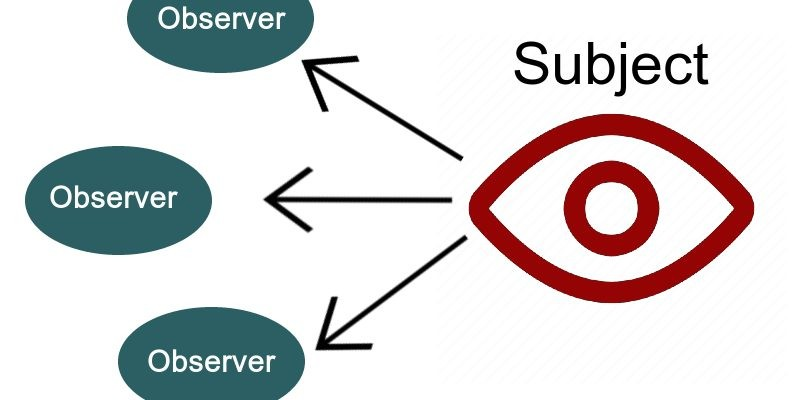

</div>

* مثال‌ها
    * یک سایت فرشگاهی که وقتی تراکنش پرداخت انجام شد به فرآینده‌های مستقل میگوید که هرکدام کارهای خودش را انجام دهد
        * ارسال پیامک
        * ارسال ایمیل
        * کم کردن از انبار
        * شروع پردازش ارسال مرسوله
        * کلیه کارهای مورد نیاز
    * اطلاع‌رسانی به نفرات دنبال کننده یک صفحه برای ارسال یک ویدیو در صفحه آپارات خود
    * ایتا همزمان که عکس بارگزاری میشود حالت دوم و سوم یعنی thumbnail آن هم ایجاد می‌شود
        * همزمان پردازش هوش مصنوعی هم برای آن عکی اجرا می‌آید تا تحلیل دیتا صورت پذیرد
    *

* ارکان اصلی
    1. Subject(موضوع/ناشر): شیئی که وضعیت آن تغییر می‌کند و لیستی از مشاهده‌گران را نگهداری می‌کند.
    2. Observer(مشاهده‌گر): شیئی که منتظر تغییرات Subject است و یک متد update دارد تا در صورت تغییر، صدا زده شود.
* django.core.signals
    * این الگوی طراحی در جنگو تحت عنوان django.core.signals در هسته خود پیاده‌سازی کرده است.
    * تابع post_save تمام وابستگی هایبین app ها را دارد و هنگام نیاز سیگنال به دیگران میدهد که کارهای نیاز رو انجام دهد
* کپسوله‌سازی و Coupling (وابستگی): بزرگترین مزیت Observer، کاهش وابستگی (Loose Coupling) است. Subject فقط می‌داند که Observerها یک رابط مشترک (update) را پیاده‌سازی کرده‌اند. او نمی‌داند آن‌ها چه کلاس‌هایی هستند، چه کار می‌کنند یا چند تا هستند. شما می‌توانید در زمان اجرا (Runtime) Observerها را اضافه یا حذف کنید بدون اینکه کد Subject را تغییر دهید
* نشت حافظه (Memory Leaks): اگر یک Observer دیگر نیازی به دریافت نوتیفیکیشن ندارد (مثلاً پنجره‌ای در UI بسته شده است) اما فراموش کنید آن را از لیست Subject حذف (detach) کنید، Subject همچنان یک Reference به آن نگه می‌دارد. این کار باعث می‌شود garbage collector نتواند آن Observer را از حافظه پاک کند و حافظه سیستم پر می‌شود.
* ترتیب اطلاع‌رسانی و وابستگی متقابل: Observerها هرگز نباید فرض کنند که به ترتیب خاصی صدا زده می‌شوند. همچنین، یک Observer نباید در متد update خود، وضعیت Subject را تغییر دهد، زیرا این کار باعث ایجاد حلقه بی‌نهایت (Infinite Loop) یا رفتارهای پیش‌بینی‌ناپذیر می‌شود.

<div style="display: flex; flex-direction: column; align-items: center;">

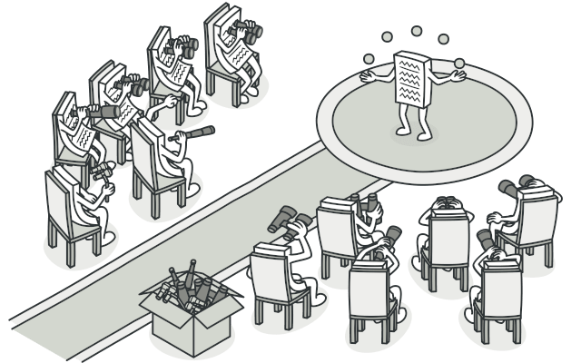

</div>

## 9.1. 🅱️ Examples1: درک پایه با یک ایستگاه هواشناسی

هدف این مثال: نشان دادن ساختار پایه الگو، یعنی نحوه ثبت‌نام (attach)، لغو اشتراک (detach) و اطلاع‌رسانی (notify). در این مثال از مدل Pull استفاده می‌کنیم؛ یعنی Subject فقط خبر می‌دهد که "تغییری رخ داد" و Observer خودش باید برود و داده جدید را از Subject بخواند.

```python
from abc import ABC, abstractmethod
from typing import List


# --- Observer Interface ---
class DisplayElement(ABC):
    """
    رابط پایه برای تمام نمایشگرها.
    """

    @abstractmethod
    def display(self) -> None:
        """نمایش اطلاعات روی صفحه"""
        pass


class Observer(ABC):
    """
    رابط مشاهده‌گر که متد به‌روزرسانی را تعریف می‌کند.
    """

    @abstractmethod
    def update(self, temperature: float, humidity: float) -> None:
        """
        به‌روزرسانی وضعیت مشاهده‌گر هنگام تغییر داده‌ها.
        
        Args:
            temperature (float): دمای جدید.
            humidity (float): رطوبت جدید.
        """
        pass


# --- Subject Interface ---
class Subject(ABC):
    """
    رابط موضوع (ناشر) برای مدیریت مشاهده‌گران.
    """

    @abstractmethod
    def register_observer(self, observer: Observer) -> None:
        """
        ثبت‌نام یک مشاهده‌گر جدید.
        
        Args:
            observer (Observer): مشاهده‌گری که باید اضافه شود.
        """
        pass

    @abstractmethod
    def remove_observer(self, observer: Observer) -> None:
        """
        حذف یک مشاهده‌گر.
        
        Args:
            observer (Observer): مشاهده‌گری که باید حذف شود.
        """
        pass

    @abstractmethod
    def notify_observers(self) -> None:
        """اطلاع‌رسانی به تمام مشاهده‌گران ثبت‌نام شده."""
        pass


# --- Concrete Subject ---
class WeatherData(Subject):
    """
    کلاس اصلی ایستگاه هواشناسی که داده‌ها را دریافت و مدیریت می‌کند.
    """

    def __init__(self) -> None:
        self._observers: List[Observer] = []  # لیست مشاهده‌گران
        self._temperature: float = 0.0
        self._humidity: float = 0.0

    def register_observer(self, observer: Observer) -> None:
        self._observers.append(observer)

    def remove_observer(self, observer: Observer) -> None:
        self._observers.remove(observer)

    def notify_observers(self) -> None:
        # صدا زدن متد update تمام مشاهده‌گران
        for observer in self._observers:
            observer.update(self._temperature, self._humidity)

    def measurements_changed(self) -> None:
        """این متد زمانی صدا زده می‌شود که داده‌های جدیدی از سنسورها برسد."""
        self.notify_observers()

    def set_measurements(self, temperature: float, humidity: float) -> None:
        """
        تنظیم داده‌های جدید هواشناسی.
        
        Args:
            temperature (float): دمای اندازه‌گیری شده.
            humidity (float): رطوبت اندازه‌گیری شده.
        """
        self._temperature = temperature
        self._humidity = humidity
        self.measurements_changed()  # اطلاع‌رسانی به مشاهده‌گران


# --- Concrete Observers ---
class CurrentConditionsDisplay(Observer, DisplayElement):
    """
    نمایشگر شرایط فعلی آب و هوا.
    """

    def __init__(self, weather_data: Subject) -> None:
        self._temperature = 0.0
        self._humidity = 0.0
        self._weather_data = weather_data
        # ثبت‌نام در ایستگاه هواشناسی
        self._weather_data.register_observer(self)

    def update(self, temperature: float, humidity: float) -> None:
        self._temperature = temperature
        self._humidity = humidity
        self.display()

    def display(self) -> None:
        print(f"نمایشگر فعلی: دما = {self._temperature}°C, رطوبت = {self._humidity}%")


# --- اجرای مثال ---
if __name__ == "__main__":
    weather_data = WeatherData()

    # ایجاد و ثبت‌نام نمایشگر
    current_display = CurrentConditionsDisplay(weather_data)

    # تغییر داده‌ها (این کار باعث notify شدن خودکار می‌شود)
    weather_data.set_measurements(25.5, 60.0)
    weather_data.set_measurements(28.0, 55.0)
```

## 9.2. 🅱️ Examples2: سیستم اطلاع‌رسانی موجودی فروشگاه

هدف این مثال: در این مثال می‌خواهیم مدل Push را پیاده‌سازی کنیم. یعنی Subject دقیقاً مشخص کند چه چیزی تغییر کرده است. همچنین نشان می‌دهیم که چگونه Observerهای مختلف می‌توانند به یک روکش واحد، واکنش‌های کاملاً متفاوتی نشان دهند. این الگو در سیستم‌های E-commerce برای اطلاع‌رسانی کاهش موجودی یا تغییر قیمت بسیار رایج است.

```python
from abc import ABC, abstractmethod
from typing import List, Dict, Any


# --- Observer Interface ---
class StockObserver(ABC):
    """
    رابط مشاهده‌گر برای سیستم موجودی.
    """

    @abstractmethod
    def update(self, product_name: str, new_stock: int, price_changed: bool) -> None:
        """
        به‌روزرسانی وضعیت بر اساس داده‌های ارسال شده (Push Model).
        
        Args:
            product_name (str): نام محصولی که تغییر کرده است.
            new_stock (int): موجودی جدید محصول.
            price_changed (bool): آیا قیمت هم تغییر کرده است؟
        """
        pass


# --- Subject ---
class ProductInventory:
    """
    کلاس مدیریت موجودی محصولات (Subject).
    """

    def __init__(self) -> None:
        self._observers: List[StockObserver] = []
        self._products: Dict[str, Dict[str, Any]] = {}  # دیکشنری برای نگهداری محصولات

    def attach(self, observer: StockObserver) -> None:
        """اضافه کردن مشاهده‌گر"""
        if observer not in self._observers:
            self._observers.append(observer)

    def detach(self, observer: StockObserver) -> None:
        """حذف مشاهده‌گر برای جلوگیری از نشت حافظه"""
        try:
            self._observers.remove(observer)
        except ValueError:
            pass

    def notify(self, product_name: str, new_stock: int, price_changed: bool) -> None:
        """
        اطلاع‌رسانی به تمام مشاهده‌گران با ارسال مستقیم داده‌ها (Push).
        
        Args:
            product_name (str): نام محصول تغییر یافته.
            new_stock (int): موجودی جدید.
            price_changed (bool): وضعیت تغییر قیمت.
        """
        for observer in self._observers:
            observer.update(product_name, new_stock, price_changed)

    def update_stock(self, product_name: str, quantity: int, new_price: float = None) -> None:
        """
        به‌روزرسانی موجودی یک محصول و اطلاع‌رسانی به سیستم.
        
        Args:
            product_name (str): نام محصول.
            quantity (int): تعداد اضافه/کم شده.
            new_price (float, optional): قیمت جدید در صورت تغییر.
        """
        if product_name not in self._products:
            self._products[product_name] = {"stock": 0, "price": 0.0}

        self._products[product_name]["stock"] += quantity
        price_changed = False
        if new_price is not None:
            self._products[product_name]["price"] = new_price
            price_changed = True

        current_stock = self._products[product_name]["stock"]
        print(f"[Inventory] موجودی {product_name} به {current_stock} تغییر یافت.")

        # فراخوانی notify با مدل Push (ارسال مستقیم داده‌ها)
        self.notify(product_name, current_stock, price_changed)


# --- Concrete Observers ---
class EmailAlertSystem(StockObserver):
    """
    سیستم اطلاع‌رسانی ایمیلی (فقط وقتی موجودی کم است ایمیل می‌زند).
    """

    def update(self, product_name: str, new_stock: int, price_changed: bool) -> None:
        # منطق فیلترینگ: فقط اگر موجودی زیر ۱۰ بود ایمیل بزن
        if new_stock < 10:
            print(f"[Email] هشدار: موجودی {product_name} کم است ({new_stock} عدد). ایمیل ارسال شد.")


class AnalyticsDashboard(StockObserver):
    """
    داشبورد تحلیلی (همه تغییرات را لاگ می‌کند).
    """

    def update(self, product_name: str, new_stock: int, price_changed: bool) -> None:
        status = "و تغییر قیمت" if price_changed else ""
        print(f"[Dashboard] لاگ سیستم: {product_name} -> موجودی: {new_stock} {status}")


# --- اجرای مثال ---
if __name__ == "__main__":
    inventory = ProductInventory()

    # ثبت‌نام سیستم‌های مختلف
    email_system = EmailAlertSystem()
    dashboard = AnalyticsDashboard()

    inventory.attach(email_system)
    inventory.attach(dashboard)

    print("--- به‌روزرسانی اولیه ---")
    inventory.update_stock("Laptop", 50)  # موجودی ۵۰ -> ایمیل زده نمی‌شود

    print("\n--- فروش و کاهش موجودی ---")
    inventory.update_stock("Laptop", -45)  # موجودی ۵ -> ایمیل زده می‌شود

    print("\n--- تغییر قیمت ---")
    inventory.update_stock("Smartphone", 20, new_price=999.0)
```

## 9.3. 🅱️ Examples3: سیستم فید داده‌های بازار مالی (Industry Standard)

هدف این مثال: این یک مثال کاملاً فنی از صنعت FinTech (فناوری مالی) است. در این سیستم، یک Market Data Feed (Subject) به صورت مداوم و با فرکانس بالا قیمت سهام را دریافت می‌کند. چندین سیستم (Observer) مثل ربات معامله‌گر، موتور نمودار و سیستم لاگ مالی به این داده‌ها نیاز دارند. در این مثال، Thread Safety برای جلوگیری از Race Condition و مدیریت دقیق
چرخه حیات Observerها پوشش داده شده است.

```python
import threading
import time
from abc import ABC, abstractmethod
from typing import List, Protocol


# --- استفاده از Protocol برای تعریف رابط (روش مدرن و Pythonic) ---
class MarketObserver(Protocol):
    """
    پروتکل مشاهده‌گر بازار مالی.
    استفاده از Protocol به جای ABC اجازه می‌دهد کلاس‌ها بدون نیاز به ارث‌بری صریح، 
    فقط با پیاده‌سازی متد update، به عنوان Observer شناخته شوند (Duck Typing با تایید استاتیک).
    """

    def update(self, symbol: str, price: float, timestamp: float) -> None:
        """
        دریافت تیک (Tick) جدید بازار.
        
        Args:
            symbol (str): نماد سهام.
            price (float): قیمت جدید.
            timestamp (float): زمان دقیق ثبت قیمت.
        """
        ...


# --- Subject ---
class MarketDataFeed:
    """
    فید داده‌های بازار مالی (Subject).
    این کلاس باید در محیطی با Threadهای متعدد (چند نخی) امن باشد.
    """

    def __init__(self) -> None:
        self._observers: List[MarketObserver] = []
        # استفاده از Lock برای تضمین Thread Safety در هنگام تغییر لیست Observerها
        self._lock = threading.Lock()

    def subscribe(self, observer: MarketObserver) -> None:
        """
        ثبت‌نام امن در محیط چند نخی.
        
        Args:
            observer (MarketObserver): مشاهده‌گری که باید اضافه شود.
        """
        with self._lock:
            if observer not in self._observers:
                self._observers.append(observer)

    def unsubscribe(self, observer: MarketObserver) -> None:
        """
        لغو اشتراک امن برای جلوگیری از نشت حافظه.
        
        Args:
            observer (MarketObserver): مشاهده‌گری که باید حذف شود.
        """
        with self._lock:
            try:
                self._observers.remove(observer)
            except ValueError:
                pass

    def broadcast_tick(self, symbol: str, price: float, timestamp: float) -> None:
        """
        ارسال تیک قیمتی به تمام مشاهده‌گران.
        نکته فنی: لیست Observerها را در یک کپی (Snapshot) می‌رییم تا اگر در حین notify
        یکی از Observerها خودش را unsubscribe کرد، حلقه با خطا مواجه نشود.
        
        Args:
            symbol (str): نماد سهام.
            price (float): قیمت لحظه‌ای.
            timestamp (float): زمان ثبت.
        """
        # کپی کردن لیست در داخل قفل برای جلوگیری از تغییر حین پیمایش
        with self._lock:
            observers_snapshot = list(self._observers)

        # صدا زدن Observerها خارج از قفل برای جلوگیری از Deadlock
        for observer in observers_snapshot:
            observer.update(symbol, price, timestamp)


# --- Concrete Observers ---
class TradingBot:
    """
    ربات معامله‌گر (فقط به تغییرات شدید قیمت واکنش نشان می‌دهد).
    """

    def __init__(self, bot_id: str) -> None:
        self.bot_id = bot_id
        self._last_price: float = 0.0

    def update(self, symbol: str, price: float, timestamp: float) -> None:
        # منطق فیلترینگ: فقط اگر نوسان بیشتر از ۲٪ بود معامله کن
        if self._last_price > 0 and abs(price - self._last_price) / self._last_price > 0.02:
            action = "BUY" if price > self._last_price else "SELL"
            print(f"[{self.bot_id}] نوسان شدید در {symbol}! قیمت: {price} -> دستور {action} ارسال شد.")
        self._last_price = price


class ChartingEngine:
    """
    موتور رسم نمودار (همه تیک‌ها را برای رسم کندل‌استیک ذخیره می‌کند).
    """

    def update(self, symbol: str, price: float, timestamp: float) -> None:
        # در سیستم واقعی، این داده‌ها در یک آرایه حلقوی (Ring Buffer) ذخیره می‌شوند
        print(f"[Chart] آپدیت نمودار {symbol}: قیمت={price}, زمان={timestamp:.2f}")


class FinancialAuditLogger:
    """
    سیستم لاگ مالی (برای ثبت تمام تیک‌ها جهت ممیزی و Compliance).
    """

    def update(self, symbol: str, price: float, timestamp: float) -> None:
        # شبیه‌سازی عملیات I/O کند (نوشتن در دیتابیس)
        # در سیستم واقعی، این Observer باید در یک Thread جداگانه یا از طریق Queue اجرا شود
        # تا سرعت broadcast را پایین نیاورد.
        pass  # print(f"[Audit] لاگ شد: {symbol} @ {price}")


# --- اجرای مثال و شبیه‌سازی محیط Real-time ---
if __name__ == "__main__":
    feed = MarketDataFeed()

    # ایجاد Observerها
    bot = TradingBot("AlphaBot")
    chart = ChartingEngine()
    logger = FinancialAuditLogger()

    # ثبت‌نام
    feed.subscribe(bot)
    feed.subscribe(chart)
    feed.subscribe(logger)

    print("--- شروع دریافت داده‌های بازار ---")

    # شبیه‌سازی دریافت تیک‌های قیمتی در یک حلقه
    # در سیستم واقعی، این داده‌ها از طریق سوکت (WebSocket) از بورس دریافت می‌شوند
    ticks = [
        ("AAPL", 150.0),
        ("AAPL", 151.0),
        ("AAPL", 155.0),  # نوسان شدید (بیش از ۲٪ نسبت به ۱۵۱) -> ربات باید BUY بزند
        ("AAPL", 148.0),  # نوسان شدید نزولی -> ربات باید SELL بزند
    ]

    for symbol, price in ticks:
        current_time = time.time()
        feed.broadcast_tick(symbol, price, current_time)
        time.sleep(0.1)  # شبیه‌سازی فاصله زمانی بین تیک‌ها

    print("\n--- پایان شبیه‌سازی ---")
```

# 10. 🅰️ Behavioral.Interpreter(پیاده‌سازی قوانین و سیاست ذیل درخت انتزاعی ABS بجای کد طولانی و شرط‌های پیچیده)

* تعریف
    * برای پیاده‌سازی یک مجموعه قوانین دلخواه(که ازقبل تعریف شده-مثلا قواعد ریاضی) به نحوی که داده های جدید(عبارت ها و گزاره‌های موجود) به این قواعد عرضه شود تا تحت این سیاست مورد بررسی و وزن‌دهی واقع گردد و نهایتا در چهارچوب تعریف شده اجرا شود(مثلا تبدیل فرمول داده شده به عملگر و عملوند)
    * در این الگو، به جای نوشتن کدهای شرطی پیچیده و تو در تو، ما گرامر (دستور زبان) را به صورت یک درخت نحو انتزاعی (AST) مدل‌سازی می‌کنیم.
    * هر گره در این درخت، نماینده یک قانون یا عملگر است و وظیفه دارد بخش مربوط به خودش را «تفسیر» و اجرا کند.
* اجزای اصلی این الگوی طراحی
    * Context: حاوی اطلاعات سراسری(قواعد) یا وضعیت‌هایی است که مفسر در حین تفسیر به آن‌ها نیاز دارد.
    * AbstractExpression: یک اینترفیس (یا کلاس انتزاعی) که متد `interpret(context)` را تعریف می‌کند. تمام گره‌های درخت باید این متد را پیاده‌سازی کنند.
    * TerminalExpression: پیاده‌سازی متد `interpret` برای نمادهای پایه (برگ‌های درخت). مثل اعداد در ریاضی، یا نام فیلدها در کوئری.
    * NonTerminalExpression: پیاده‌سازی متد `interpret` برای قواعد پیچیده (گره‌های داخلی درخت). مثل عملگرهای +، -، AND، OR. این گره‌ها معمولاً از سایر عبارات (پایانه یا غیرپایانه) در درون خود استفاده می‌کنند (الگوی Composite).
    * Client: درخت نحو انتزاعی (AST - Abstract Syntax Tree) را می‌سازد و متد `interpret` را روی گره ریشه فراخوانی می‌کند.
* کاربردها
    * در ساختار داخلی همه ORMها
    * موتورهای جستجو و کوئری (Query Engines): مثل تبدیل رشته‌های متنی جستجو در سایت‌های فروشگاهی به فیلترهای دیتابیس.
    * موتورهای قوانین تجاری (Business Rule Engines): محاسبه پویای تخفیف‌ها، شرایط وام بانکی، یا سطوح دسترسی کاربران بر اساس قوانینی که ادمین در پنل مدیریت تعریف می‌کند.
    * مفسرهای فرمول‌ساز (Formula Evaluators): مثل سلول‌های اکسل که یک رشته متنی مثل SUM(A1:B2) * 1.09 را دریافت کرده و محاسبه می‌کنند.
    * پارسرهای فایل‌های پیکربندی (Config Parsers): خواندن و تفسیر فایل‌های YAML، JSON یا فایل‌های تنظیمات اختصاصی (DSL).
    * موتورهای Regular Expression (Regex): در باطن، موتورهای رجکس از الگوی مفسر برای تفسیر الگوی متنی و تطبیق آن با رشته ورودی استفاده می‌کنند.
* چه زمانی استفاده کنیم
    * وقتی گرامر زبان ساده است و نیازی به ابزارهای سنگین Parser (مثل ANTLR یا Yacc) ندارید.
    * وقتی می‌خواهید ساختار زبان (گرامر) را به صورت کلاس‌های شیءگرا مدل‌سازی کنید تا به راحتی قابل توسعه باشد.
    * وقتی درخت AST (درخت نحو انتزاعی) به راحتی قابل ساخت است (مثلاً توسط یک Parser ساده یا به صورت دستی).
* چه زمانی استفاده نکنیم
    * گرامر پیچیده: اگر زبان شما پیچیده است (مثل SQL واقعی یا یک زبان برنامه‌نویسی)، استفاده از این الگو باعث ایجاد هزاران کلاس و پیچیدگی وحشتناک می‌شود. در این موارد از Parser Generatorها استفاده کنید.
    * کارایی (Performance): مفسرهای مبتنی بر الگوی Interpreter به دلیل استفاده از بازگشت (Recursion) و ایجاد اشیاء زیاد برای هر گره درخت، ممکن است در حلقه‌های بسیار بزرگ (مثل پردازش میلیون‌ها رکورد در ثانیه) کند عمل کنند. در این موارد باید AST را به Bytecode کامپایل کنید.
* مزایا:
    * توسعه‌پذیری: اضافه کردن قوانین یا عملگرهای جدید (مثل NOT یا >=) بسیار آسان است؛ فقط کافیست یک کلاس جدید بسازید.
    * خوانایی: کد به شدت به گرامر زبان نزدیک است و درک آن برای برنامه‌نویسان دیگر راحت است.

## 10.1. 🅱️ Examples1: ماشین حساب عبارات ریاضی

در این مثال، یک مفسر بسیار ساده می‌سازیم که می‌تواند عبارات ریاضی شامل جمع و تفریق را ارزیابی کند. هدف درک نحوه ساخت درخت (AST) و فراخوانی بازگشتی متد interpret است.

```python
from abc import ABC, abstractmethod


# ╔════════════════════╗
# ║ AbstractExpression ║
# ╚════════════════════╝
class Expression(ABC):
    """اینترفیس پایه برای تمام عبارات در درخت نحو انتزاعی (AST)."""

    @abstractmethod
    def interpret(self) -> float:
        """
        متد تفسیر که باید توسط تمام کلاس‌های فرزند پیاده‌سازی شود.
        
        Returns:
            float: نتیجه عددی تفسیر شده از این گره از درخت.
        """
        pass


# ╔══════════════════════╗
# ║ Terminal Expressions ║
# ╚══════════════════════╝
class NumberExpression(Expression):
    """عبارت پایانه که نماینده یک عدد ثابت در درخت است."""

    def __init__(self, value: float) -> None:
        self._value = value  # مقدار عددی را درون گره ذخیره می‌کنیم

    def interpret(self) -> float:
        return self._value  # برگ درخت: فقط مقدار خودش را برمی‌گرداند


# ╔══════════════════════════╗
# ║ Non-Terminal Expressions ║
# ╚══════════════════════════╝
class AddExpression(Expression):
    """عبارت غیرپایانه برای عملگر جمع که دو زیردرخت را با هم ترکیب می‌کند."""

    def __init__(self, left_expr: Expression, right_expr: Expression) -> None:  # دریافت عبارت سمت چپ و راست برای پردازش بازگشتی
        self._left = left_expr
        self._right = right_expr

    def interpret(self) -> float:
        return self._left.interpret() + self._right.interpret()  # ابتدا فرزندان تفسیر می‌شوند، سپس عمل جمع انجام می‌شود


class SubtractExpression(Expression):
    """عبارت غیرپایانه برای عملگر تفریق."""

    def __init__(self, left_expr: Expression, right_expr: Expression) -> None:
        self._left = left_expr
        self._right = right_expr

    def interpret(self) -> float:
        return self._left.interpret() - self._right.interpret()  # تفریق مقدار تفسیر شده سمت چپ از سمت راست


# ╔════════╗
# ║ Client ║ ---> ساخت درخت و اجرا
# ╚════════╝
def run_simple_math_interpreter() -> None:
    """تابع کلاینت که درخت AST را برای عبارت (۱۰ + ۵) - ۳ می‌سازد و اجرا می‌کند."""
    # ساخت برگ‌های درخت (اعداد)
    num_10 = NumberExpression(10.0)
    num_5 = NumberExpression(5.0)
    num_3 = NumberExpression(3.0)

    # ساخت گره‌های داخلی (عملگرها)
    add_node = AddExpression(num_10, num_5)  # گره جمع: (۱۰ + ۵)

    root_node = SubtractExpression(add_node, num_3)  # گره ریشه (تفریق): (۱۰ + ۵) - ۳

    final_result = root_node.interpret()  # فراخوانی مفسر از گره ریشه (اجرای بازگشتی کل درخت)

    print(f"[مثال ساده] نتیجه عبارت (10 + 5) - 3 برابر است با: {final_result}")


# اجرای مثال ساده
run_simple_math_interpreter()
```

## 10.2. 🅱️ Examples2: DbContext

```python
from abc import ABC, abstractmethod
from typing import Any, Callable


class DbContext:
    def __init__(self, data: list[dict]):
        self.data = data


class Expression(ABC):
    @abstractmethod
    def interpret(self, context: DbContext):
        raise NotImplementedError


__all__ = ['Select', 'Where', 'Query', 'Expression']


class Select(Expression):
    def __init__(self, field: str):
        self.field = field

    def interpret(self, context: DbContext):
        return [row[self.field] for row in context.data]


class Where(Expression):
    def __init__(self, condition: Callable[[Any], bool]):
        self.condition = condition

    def interpret(self, context: DbContext):
        return [row for row in context.data if self.condition(row)]


class Query(Expression):
    def __init__(self, select: Select, where: Where):
        self.select = select
        self.where = where

    def interpret(self, context: DbContext):
        filtered_data = self.where.interpret(context)
        return self.select.interpret(DbContext(filtered_data))


if __name__ == '__main__':
    data = [{'name': 'ali', 'age': 25},
            {'name': 'Mohammad', 'age': 30},
            {'name': 'sara', 'age': 28},
            {'name': 'reza', 'age': 17}, ]

    context = DbContext(data)

    query = Query(select=Select('name'),
                  where=Where(lambda row: row['age'] >= 25))
    result = query.interpret(context)
    print(result)
```

## 10.3. 🅱️ Examples3: ConfigurationManager

```python
from abc import ABC, abstractmethod
import re


class ConfigurationContext:
    def __init__(self):
        self.settings = {}

    def set(self, key, value):
        if re.fullmatch('^[+-]?([0-9]+([.][0-9]*)?|[.][0-9]+)$', value):
            self.settings[key] = float(value)
        else:
            self.settings[key] = value

    def enable(self, key):
        self.settings[key] = True

    def disable(self, key):
        self.settings[key] = False

    def __str__(self):
        return str(self.settings)


class Expression(ABC):
    @abstractmethod
    def interpret(self, context: ConfigurationContext):
        raise NotImplementedError


__all__ = ['SetCommand', 'EnableCommand', 'DisableCommand']


class SetCommand(Expression):
    def __init__(self, key, value):
        self.key = key
        self.value = value

    def interpret(self, context: ConfigurationContext):
        context.set(key=self.key, value=self.value)


class EnableCommand(Expression):
    def __init__(self, key):
        self.key = key

    def interpret(self, context: ConfigurationContext):
        context.enable(key=self.key)


class DisableCommand(Expression):
    def __init__(self, key):
        self.key = key

    def interpret(self, context: ConfigurationContext):
        context.disable(key=self.key)


def parse_configuration(configs: list[str]) -> list[Expression]:
    expressions = []

    for line in configs:
        tokens = line.split()
        command = tokens[0]

        match command:
            case 'set':
                expressions.append(SetCommand(tokens[1], tokens[2]))
            case 'enable':
                expressions.append(EnableCommand(tokens[1]))
            case 'disable':
                expressions.append(DisableCommand(tokens[1]))

    return expressions


if __name__ == '__main__':
    config_lines = ['set timeout 30',
                    'set retries 5',
                    'enable logging',
                    'disable cache',
                    'set log_level information',
                    'enable watermark']

    context = ConfigurationContext()
    expr = parse_configuration(config_lines)

    for exp in expr:
        exp.interpret(context)

    print(context)
```

# 11. 🅰️ Behavioral.State(تغییر رفتار آبجکت بر اساس تغییر وضعیت)

الگوی State یکی از الگوهای طراحی رفتاری (Behavioral) است که به یک شی اجازه می‌دهد زمانی که وضعیت داخلی (Internal State) آن تغییر می‌کند، رفتار خود را نیز تغییر دهد. این الگو در واقع پیاده‌سازی مفهوم ماشین حالت متناهی (Finite State Machine - FSM) در برنامه‌نویسی شی‌گرا است.

FSM: The State pattern is closely related to the concept of a Finite-State Machine .

<div style="display: flex; flex-direction: column; align-items: center;">


</div>

* این الگو از سه بخش اصلی تشکیل شده است:
    * Context (کانتکست): کلاسی که مرجع (Reference) به یک شی از نوع State را نگه می‌دارد. این کلاس وضعیت فعلی را مدیریت کرده و درخواست‌های کلاینت را به State فعلی Delegate (ارجاع) می‌کند.
    * State Interface (رابط وضعیت): یک اینترفیس (یا کلاس انتزاعی) که رفتارهای مشترک بین تمام وضعیت‌ها را تعریف می‌کند.
    * Concrete States (وضعیت‌های مشخص): کلاس‌هایی که رفتارهای خاص هر وضعیت را پیاده‌سازی می‌کنند. مهم‌ترین ویژگی این کلاس‌ها این است که مدیریت ترنزیشن‌ها (تغییر وضعیت به وضعیت بعدی) را بر عهده دارند.
* مزایا (Pros)
    * رعایت اصل Open/Closed: افزودن وضعیت‌های جدید نیازی به تغییر کدهای موجود (حذف if/else یا switch/caseهای غول‌پیکر) ندارد.
    * اصل Single Responsibility: منطق هر وضعیت در کلاس مخصوص خودش متمرکز می‌شود.
    * یکپارچگی ترنزیشن‌ها: تغییرات وضعیت از یک نقطه مرکزی (داخل Concrete Stateها) کنترل می‌شود و از ایجاد وضعیت‌های غیرمجاز (Invalid States) جلوگیری می‌کند.
* معایب (Cons)
    * وقوع Overhead کلاس‌ها: اگر تعداد وضعیت‌ها کم باشد و به ندرت تغییر کنند، استفاده از این الگو باعث ایجاد تعداد زیادی کلاس بیهوده می‌شود.
    * پیچیدگی در Stateهای موازی: اگر یک شی بتواند همزمان در چند وضعیت مستقل باشد (مثلاً یک کاراکتر بازی هم "در حال دویدن" باشد و هم "تیراندازی")، الگوی State کلاسیک جوابگو نیست و نیاز به Statechart یا الگوهای پیچیده‌تر دارد.
* تفاوت کلیدی State با Strategy: بسیاری این دو را اشتباه می‌گیرند. تفاوت اصلی در مالکیت ترنزیشن است
    * در Strategy، کلاینت الگوریتم (استراتژی) را انتخاب و inject می‌کند. استراتژی‌ها همدیگر را نمی‌شناسند و مستقل هستند.
    * در State، خودِ وضعیت‌ها می‌دانند که وضعیت بعدی چیست و Context را به وضعیت بعدی سوییچ می‌کنند. Stateها به Context و سایر Stateها آگاهند

<div style="display: flex; flex-direction: column; align-items: center;">


</div>

## 11.1. 🅱️ کاربردهای این  الگوی طراحی

* تجارت الکترونیک و مالی (E-Commerce & Finance)
    * چرخه حیات سفارش: پیش‌نویس ← ثبت‌شده ← پرداخت‌شده ← ارسال‌شده ← تحویل‌شده ← لغو/مرجوعی
    * پردازش پرداخت: در انتظار ← در حال پردازش ← موفق ← ناموفق ← بازگشت وجه
    * اشتراک و صورتحساب: آزمایشی ← فعال ← سررسید گذشته ← لغو شده ← منقضی
    * کیف پول دیجیتال: فعال ← مسدود ← در حال بررسی ← بسته‌شده
    * چرخه حیات فاکتور: پیش‌نویس ← صادرشده ← ارسال‌شده ← پرداخت‌شده ← باطل‌شده
* بازی‌سازی (Game Development)
    * شخصیت بازی (Character): بیکار ← در حال دویدن ← پریدن ← حمله ← دفاع ← آسیب‌دیده ← مرده
    * هوش مصنوعی دشمن (AI): گشت‌زنی ← تعقیب ← حمله ← فرار ← مرده
    * وضعیت بازی (Game Session): منوی اصلی ← در حال بازی ← مکث (Pause) ← پایان بازی ← نمایش امتیاز
    * سلاح بازی: آماده ← در حال شلیک ← در حال شارژ مجدد ← خراب‌شده
    * ماشین مسابقه: پارک ← دنده ۱ تا ۶ ← معکوس ← خاموش
* شبکه و مخابرات (Networking & Telecom)
    * اتصال TCP: CLOSED ← LISTEN ← SYN_SENT ← SYN_RECEIVED ← ESTABLISHED ← FIN_WAIT ← TIME_WAIT
    * وضعیت تماس تلفنی: بیکار ← شماره‌گیری ← زنگ خوردن ← متصل ← در انتظار (Hold) ← قطع‌شده
    * چرخه حیات درخواست HTTP: آماده ← در حال اتصال ← ارسال هدر ← ارسال بدنه ← دریافت پاسخ ← تکمیل‌شده
    * اتصال WebSocket: در حال اتصال (Connecting) ← باز (Open) ← در حال بسته‌شدن (Closing) ← بسته (Closed)
* مدیریت محتوا و اسناد (CMS & Document Workflow)
    * گردش کار مقاله/محتوا: پیش‌نویس ← در انتظار بررسی ← تأیید شده ← منتشر شده ← بایگانی شده
    * گردش کار تأیید (Approval): ارسال‌شده ← در حال بررسی مدیر ← تأیید شده ← رد شده ← نیاز به بازنگری
    * مدیریت تیکت پشتیبانی: باز ← در حال بررسی ← در انتظار پاسخ مشتری ← حل‌شده ← بسته‌شده
    * چرخه حیات قرارداد: پیش‌نویس ← در حال مذاکره ← امضا شده ← فعال ← منقضی ← فسخ‌شده
* اینترنت اشیاء و سیستم‌های نهفته (IoT & Embedded)
    * دستگاه هوشمند خانگی: خاموش ← روشن ← حالت خواب ← خطا ← در حال به‌روزرسانی
    * آسانسور: بیکار ← در حال حرکت بالا ← در حال حرکت پایین ← درب باز ← درب بسته ← اورژانس
    * چراغ راهنمایی: قرمز ← زرد ← سبز ← چشمک‌زن (خرابی)
    * دستگاه خودپرداز (ATM): بیکار ← کارت وارد شده ← رمز تایید شده ← در حال پردازش ← خطا
    * دستگاه فروش خودکار (Vending Machine): بیکار ← سکه وارد شده ← محصول انتخاب شده ← در حال تحویل ← بدون موجودی
    * سیستم آلارم/امنیت: غیرفعال ← فعال ← در حال شمارش معکوس ← آژیر ← خطا
* سیستم‌عامل و مدیریت فرآیند (OS & Process Management)
    * چرخه حیات Thread/Process: جدید ← آماده اجرا ← در حال اجرا ← در انتظار ← خاتمه‌یافته
    * تراکنش دیتابیس: فعال ← نیمه‌متعهد ← متعهد شده ← شکست‌خورده ← لغو شده
    * مدیریت اتصال (Connection Pool): آزاد ← در حال استفاده ← خراب ← در حال بازسازی
* رابط کاربری (UI/UX)
    * دکمه (Button): عادی ← هاور ← فشرده ← غیرفعال ← در حال بارگذاری
    * فرم ثبت‌نام: در حال ویرایش ← در حال اعتبارسنجی ← خطا ← در حال ارسال ← موفق
    * پخش‌کننده رسانه: متوقف ← در حال پخش ← مکث ← بافر کردن ← خطا
    * آپلود فایل: در انتظار ← در حال آپلود ← در حال پردازش ← تکمیل ← ناموفق
    * Wizard/مراحل نصب: مرحله ۱ ← مرحله ۲ ← ... ← تکمیل
* DevOps و CI/CD
    * پایپ‌لاین CI/CD: در صف ← در حال بیلد ← در حال تست ← در حال دیپلوی ← موفق ← شکست‌خورده
    * چرخه حیات کانتینر: ایجاد شده ← در حال اجرا ← متوقف ← مکث ← حذف شده
    * وضعیت سرور/نود: سالم ← در حال بررسی ← ناسالم ← در حال تعمیر ← خارج از سرویس
* حمل‌ونقل و لجستیک (Transportation & Logistics)
    * چرخه حیات مرسوله پستی: ثبت‌شده ← جمع‌آوری شده ← در حال سورت ← در حال حمل ← رسیده به مقصد ← تحویل‌شده
    * سفر تاکسی اینترنتی: درخواست ← جستجوی راننده ← راننده یافت شد ← در مسیر مسافر ← در حال سفر ← تکمیل ← لغو
    * پرواز هواپیما: برنامه‌ریزی‌شده ← در حال سوار شدن ← تأخیر ← در حال پرواز ← فرود آمده ← لغو شده
* احراز هویت و امنیت (Auth & Security)
    * نشست کاربر (Session): احراز هویت نشده ← احراز هویت شده ← منقضی ← قفل شده
    * حساب کاربری: فعال ← تعلیق شده ← در انتظار تأیید ایمیل ← قفل شده (تلاش ناموفق) ← حذف شده
    * توکن OAuth: صادر شده ← فعال ← منقضی ← ابطال شده
* کامپایلر و پردازش زبان (Compiler & NLP)
    * واحد تحلیل لغوی (Lexer): شروع ← در حال خواندن شناسه ← در حال خواندن عدد ← در رشته ← در کامنت ← خطا
    * ماشین حالت برای Regex: وضعیت‌های مختلف بر اساس الگو
    * پارسر (Parser): وضعیت‌های مختلف گرامر
* پزشکی و سلامت (Healthcare)
    * چرخه حیات بیمار در بیمارستان: پذیرش ← تریاژ ← در انتظار پزشک ← تحت درمان ← بستری ← ترخیص
    * وضعیت دستگاه پزشکی: آماده ← در حال استفاده ← کالیبراسیون ← خطا ← نگهداری

## 11.2. 🅱️ Examples1: چراغ راهنما که به صورت خودکار بین سه وضعیت (قرمز، زرد، سبز) جابه‌جا می‌شود.

1. ایجاد شیء TrafficLight
2. تنظیم وضعیت اولیه روی RedLight
3. حلقه ۳ بار تکرار می‌شود:

- 🔄 دور اول:
    - switch() فراخوانی می‌شود
    - RedLight.handle() اجرا می‌شود
    - چاپ: "Red Light: Vehicles must stop."
    - تغییر وضعیت به GreenLight
- 🔄 دور دوم:
- switch() فراخوانی می‌شود
    - GreenLight.handle() اجرا می‌شود
    - چاپ: "Green Light: Vehicles must go."
    - تغییر وضعیت به YellowLight
- 🔄 دور سوم:
- switch() فراخوانی می‌شود
    - YellowLight.handle() اجرا می‌شود
    - چاپ: "Yellow Light: Vehicles should speed down."
    - تغییر وضعیت به RedLight

```python
from abc import ABC, abstractmethod


# region state
# این بخش رابط (Interface) یا کلاس انتزاعی وضعیت را تعریف می‌کند.
# تمام وضعیت‌های مشخص (Concrete States) باید این کلاس را پیاده‌سازی کنند
# تا کانتکست بتواند بدون دانستن نوع دقیق وضعیت، با آن‌ها کار کند.

class TrafficLightState(ABC):
    @abstractmethod
    def handle(self, traffic_light: 'TrafficLight') -> None:
        """
        متد اصلی که رفتار مخصوص هر وضعیت را تعریف می‌کند.
        نکته مهم: در این الگوی، خودِ وضعیت‌ها وظیفه دارند که پس از انجام رفتار، کانتکست را به وضعیت بعدی (ترنزیشن) تغییر دهند.
        """
        raise NotImplementedError


# endregion

# region concrete states
# این بخش وضعیت‌های مشخص (Concrete States) را تعریف می‌کند.
# هر کلاس نشان‌دهنده یک وضعیت خاص از چراغ راهنمایی است و منطق مختص به خود را دارد.

class RedLight(TrafficLightState):
    def handle(self, traffic_light: 'TrafficLight') -> None:
        print('Red Light: Vehicles must stop.')
        traffic_light.state = GreenLight()  # تغییر وضعیت به سبز پس از انجام رفتار فعلی (ترنزیشن)


class GreenLight(TrafficLightState):
    def handle(self, traffic_light: 'TrafficLight') -> None:
        print('Green Light: Vehicles must go.')
        traffic_light.state = YellowLight()  # تغییر وضعیت به زرد


class YellowLight(TrafficLightState):
    def handle(self, traffic_light: 'TrafficLight') -> None:
        print('Yellow Light: Vehicles should speed down.')
        traffic_light.state = RedLight()  # تغییر وضعیت به قرمز (با این کار چرخه کامل می‌شود)


# endregion

# region context
# این بخش کانتکست (Context) را تعریف می‌کند.
# کانتکست کلاسی است که کلاینت با آن تعامل دارد. این کلاس مرجعی به شیء وضعیت فعلی
# را نگه می‌دارد و درخواست‌های کلاینت را به وضعیت فعلی Delegate (ارجاع) می‌کند.

class TrafficLight:
    def __init__(self) -> None:
        # وضعیت اولیه در اینجا None است و در کد کلاینت مقداردهی می‌شود
        self._state: TrafficLightState | None = None

    @property
    def state(self) -> TrafficLightState | None:
        return self._state
        """دریافت وضعیت فعلی چراغ راهنمایی"""

    @state.setter
    def state(self, value: TrafficLightState) -> None:
        """
        تنظیم وضعیت جدید.
        توضیح: در این Setter یک لاگ ساده چاپ می‌شود تا تغییر وضعیت‌ها قابل ردیابی باشد. این کار باعث می‌شود هر بار که Stateها کانتکست را تغییر می‌دهند، یک پیام ثبت شود.
        """
        self._state = value
        print(f'Traffic light state changed to {self._state.__class__.__name__}')

    def switch(self) -> None:
        """
        متد درخواست (Request).
        توضیح: این متد رفتار را به وضعیت فعلی (State) Delegate می‌کند.
        کلاینت فقط همین متد را فراخوانی می‌کند و نیازی به دانستن منطق داخلی ندارد.
        """
        if self.state:
            self.state.handle(self)


# endregion

# region client code
# این بخش کد کلاینت است که از الگوی طراحی استفاده می‌کند.
# مزیت اصلی اینجاست: کلاینت هیچ if/else یا switch/case‌ای برای تغییر وضعیت‌ها ندارد.

if __name__ == '__main__':
    light = TrafficLight()  # ایجاد یک شیء از کانتکست (چراغ راهنمایی)
    light.state = RedLight()  # تنظیم وضعیت اولیه روی چراغ قرمز (State اولیه توسط کلاینت تعیین می‌شود)
    # شبیه‌سازی ۳ بار تغییر وضعیت (چرخه: قرمز -> سبز -> زرد -> قرمز)
    for _ in range(3):
        light.switch()

# endregion
```

## 11.3. 🅱️ Examples2: چرخه حیات سفارش در یک سیستم فروشگاهی

* چرخه حیات سفارش در این کد:
    * در انتظار پرداخت (PendingPayment) → وضعیت اولیه
    * پرداخت شده (Paid) → پس از پرداخت موفق
    * ارسال شده (Shipped) → پس از ارسال مرسوله
    * تحویل داده شده (Delivered) → پس از تحویل به مشتری
    * لغو شده (Cancelled) → می‌تواند از وضعیت "در انتظار پرداخت" یا "پرداخت شده" رخ دهد
    * مرجوع شده (Returned) → پس از مرجوع کردن کالا توسط مشتری

```python
from abc import ABC, abstractmethod
from typing import Optional
from datetime import datetime


# region state

# این بخش رابط (Interface) وضعیت‌های سفارش را تعریف می‌کند.
# تمام وضعیت‌های مشخص (Concrete States) باید این کلاس انتزاعی را پیاده‌سازی کنند.
# این کار باعث می‌شود کانتکست (Order) بتواند بدون دانستن نوع دقیق وضعیت،
# با آن‌ها کار کند و درخواست‌ها را به وضعیت فعلی Delegate کند.

class OrderState(ABC):
    """
    کلاس انتزاعی پایه برای تمام وضعیت‌های سفارش.
    
    این کلاس یک قرارداد (Contract) تعریف می‌کند که تمام وضعیت‌های سفارش
    باید آن را پیاده‌سازی کنند. هر وضعیت رفتارهای مخصوص به خود را برای
    این عملیات‌ها پیاده‌سازی می‌کند.
    """

    @abstractmethod
    def pay(self, order: 'Order') -> None:
        """
        پردازش پرداخت سفارش.
        
        Args:
            order: شیء سفارش که وضعیت آن باید تغییر کند
        """
        pass

    @abstractmethod
    def cancel(self, order: 'Order', reason: str) -> None:
        """
        لغو سفارش.
        
        Args:
            order: شیء سفارش که وضعیت آن باید تغییر کند
            reason: دلیل لغو سفارش
        """
        pass

    @abstractmethod
    def ship(self, order: 'Order', tracking_number: str) -> None:
        """
        ارسال سفارش.
        
        Args:
            order: شیء سفارش که وضعیت آن باید تغییر کند
            tracking_number: کد رهگیری مرسوله
        """
        pass

    @abstractmethod
    def deliver(self, order: 'Order') -> None:
        """
        تحویل سفارش به مشتری.
        
        Args:
            order: شیء سفارش که وضعیت آن باید تغییر کند
        """
        pass

    @abstractmethod
    def return_items(self, order: 'Order', reason: str) -> None:
        """
        مرجوع کردن اقلام سفارش.
        
        Args:
            order: شیء سفارش که وضعیت آن باید تغییر کند
            reason: دلیل مرجوع کردن
        """
        pass

    @abstractmethod
    def get_status(self) -> str:
        """
        دریافت وضعیت فعلی سفارش به صورت متنی.
        
        Returns:
            str: نام وضعیت فعلی
        """
        pass


# endregion

# region concrete states

# این بخش وضعیت‌های مشخص (Concrete States) را تعریف می‌کند.
# هر کلاس نشان‌دهنده یک وضعیت خاص از چرخه حیات سفارش است
# و منطق تجاری (Business Logic) مخصوص به آن وضعیت را پیاده‌سازی می‌کند.

class PendingPaymentState(OrderState):
    """
    وضعیت در انتظار پرداخت.
    
    این وضعیت اولیه یک سفارش جدید است. در این وضعیت:
    - پرداخت مجاز است و سفارش را به وضعیت Paid منتقل می‌کند
    - لغو مجاز است و سفارش را به وضعیت Cancelled منتقل می‌کند
    - ارسال، تحویل و مرجوعی مجاز نیستند
    """

    def pay(self, order: 'Order') -> None:
        """پردازش پرداخت و تغییر وضعیت به PaidState"""
        print('Processing payment ...')
        order.payment_date = datetime.now()
        order.state = PaidState()  # ترنزیشن به وضعیت پرداخت شده
        print('Payment successful, order is now paid')

    def cancel(self, order: 'Order', reason: str) -> None:
        """لغو سفارش قبل از پرداخت و تغییر وضعیت به CancelledState"""
        print(f'cancelling order before payment. reason: {reason}')
        order.cancel_date = datetime.now()
        order.cancellation_reason = reason
        order.state = CancelledState()  # ترنزیشن به وضعیت لغو شده

    def ship(self, order: 'Order', tracking_number: str) -> None:
        """تلاش برای ارسال سفارش پرداخت نشده - مجاز نیست"""
        print('cannot ship order before payment')

    def deliver(self, order: 'Order') -> None:
        """تلاش برای تحویل سفارش پرداخت نشده - مجاز نیست"""
        print('cannot deliver order before payment')

    def return_items(self, order: 'Order', reason: str) -> None:
        """تلاش برای مرجوع کردن سفارش پرداخت نشده - مجاز نیست"""
        print('cannot return items before payment')

    def get_status(self) -> str:
        """برگرداندن نام وضعیت فعلی"""
        return 'Pending Payment'


class PaidState(OrderState):
    """
    وضعیت پرداخت شده.
    
    در این وضعیت سفارش پرداخت شده و منتظر ارسال است:
    - پرداخت مجدد مجاز نیست (قبلاً پرداخت شده)
    - لغو مجاز است و فرآیند بازگشت وجه آغاز می‌شود
    - ارسال مجاز است و سفارش را به وضعیت Shipped منتقل می‌کند
    - تحویل و مرجوعی مجاز نیستند (هنوز ارسال نشده)
    """

    def pay(self, order: 'Order') -> None:
        """تلاش برای پرداخت مجدد - مجاز نیست"""
        print('order is already paid')

    def cancel(self, order: 'Order', reason: str) -> None:
        """لغو سفارش پرداخت شده و آغاز فرآیند بازگشت وجه"""
        print(f'cancelling paid order. reason: {reason}')
        print('initiating refund process ...')
        order.cancellation_date = datetime.now()
        order.cancellation_reason = reason
        order.state = CancelledState()  # ترنزیشن به وضعیت لغو شده

    def ship(self, order: 'Order', tracking_number: str) -> None:
        """ارسال سفارش و تغییر وضعیت به ShippedState"""
        print(f'shipping order with tracking number: {tracking_number}')
        order.shipping_date = datetime.now()
        order.tracking_number = tracking_number
        order.state = ShippedState()  # ترنزیشن به وضعیت ارسال شده

    def deliver(self, order: 'Order') -> None:
        """تلاش برای تحویل سفارش ارسال نشده - مجاز نیست"""
        print("cannot deliver order that hasn't been shipped")

    def return_items(self, order: 'Order', reason: str) -> None:
        """تلاش برای مرجوع کردن سفارش ارسال نشده - مجاز نیست"""
        print("cannot return items from order that hasn't been shipped")

    def get_status(self) -> str:
        """برگرداندن نام وضعیت فعلی"""
        return 'Paid - awaiting shipment'


class ShippedState(OrderState):
    """
    وضعیت ارسال شده.
    
    در این وضعیت سفارش ارسال شده و در حال حمل است:
    - پرداخت مجدد مجاز نیست
    - لغو مجاز نیست (سفارش در مسیر است)
    - ارسال مجدد مجاز نیست
    - تحویل مجاز است و سفارش را به وضعیت Delivered منتقل می‌کند
    - مرجوعی مجاز نیست (هنوز تحویل داده نشده)
    """

    def pay(self, order: 'Order') -> None:
        """تلاش برای پرداخت مجدد - مجاز نیست"""
        print('order is already paid')

    def cancel(self, order: 'Order', reason: str) -> None:
        """تلاش برای لغو سفارش ارسال شده - مجاز نیست"""
        print('cannot cancel order that has already been shipped')

    def ship(self, order: 'Order', tracking_number: str) -> None:
        """تلاش برای ارسال مجدد - مجاز نیست"""
        print('order is already shipped')

    def deliver(self, order: 'Order') -> None:
        """تحویل سفارش و تغییر وضعیت به DeliveredState"""
        print('marking order as delivered')
        order.delivery_date = datetime.now()
        order.state = DeliveredState()  # ترنزیشن به وضعیت تحویل داده شده

    def return_items(self, order: 'Order', reason: str) -> None:
        """تلاش برای مرجوع کردن سفارش تحویل نشده - مجاز نیست"""
        print('cannot return order that has not been delivered')

    def get_status(self) -> str:
        """برگرداندن نام وضعیت فعلی"""
        return 'Shipped - in transit'


class DeliveredState(OrderState):
    """
    وضعیت تحویل داده شده.
    
    در این وضعیت سفارش به مشتری تحویل داده شده است:
    - پرداخت مجدد مجاز نیست
    - لغو مجاز نیست (سفارش تحویل داده شده)
    - ارسال مجدد مجاز نیست
    - تحویل مجدد مجاز نیست
    - مرجوعی مجاز است و سفارش را به وضعیت Returned منتقل می‌کند
    """

    def pay(self, order: 'Order') -> None:
        """تلاش برای پرداخت مجدد - مجاز نیست"""
        print('order is already paid')

    def cancel(self, order: 'Order', reason: str) -> None:
        """تلاش برای لغو سفارش تحویل داده شده - مجاز نیست"""
        print('cannot cancel order that has been delivered')

    def ship(self, order: 'Order', tracking_number: str) -> None:
        """تلاش برای ارسال مجدد - مجاز نیست"""
        print('order is already shipped')

    def deliver(self, order: 'Order') -> None:
        """تلاش برای تحویل مجدد - مجاز نیست"""
        print('order is already delivered')

    def return_items(self, order: 'Order', reason: str) -> None:
        """مرجوع کردن اقلام و تغییر وضعیت به ReturnedState"""
        print(f'Processing return request. reason: {reason}')
        order.return_date = datetime.now()
        order.return_reason = reason
        order.state = ReturnedState()  # ترنزیشن به وضعیت مرجوع شده

    def get_status(self) -> str:
        """برگرداندن نام وضعیت فعلی"""
        return 'Delivered'


class CancelledState(OrderState):
    """
    وضعیت لغو شده (Terminal State).
    
    این یک وضعیت نهایی است. در این وضعیت هیچ عملیاتی مجاز نیست:
    - پرداخت مجاز نیست
    - لغو مجدد مجاز نیست
    - ارسال مجاز نیست
    - تحویل مجاز نیست
    - مرجوعی مجاز نیست
    """

    def pay(self, order: 'Order') -> None:
        """تلاش برای پرداخت سفارش لغو شده - مجاز نیست"""
        print('order is already paid')

    def cancel(self, order: 'Order', reason: str) -> None:
        """تلاش برای لغو مجدد - مجاز نیست"""
        print('order is already canceled')

    def ship(self, order: 'Order', tracking_number: str) -> None:
        """تلاش برای ارسال سفارش لغو شده - مجاز نیست"""
        print('cannot ship cancelled order')

    def deliver(self, order: 'Order') -> None:
        """تلاش برای تحویل سفارش لغو شده - مجاز نیست"""
        print('cannot deliver cancelled order')

    def return_items(self, order: 'Order', reason: str) -> None:
        """تلاش برای مرجوع کردن سفارش لغو شده - مجاز نیست"""
        print('cannot return cancelled order')

    def get_status(self) -> str:
        """برگرداندن نام وضعیت فعلی"""
        return 'Cancelled'


class ReturnedState(OrderState):
    """
    وضعیت مرجوع شده (Terminal State).
    
    این یک وضعیت نهایی است. در این وضعیت هیچ عملیاتی مجاز نیست:
    - پرداخت مجاز نیست
    - لغو مجاز نیست
    - ارسال مجاز نیست
    - تحویل مجاز نیست
    - مرجوعی مجدد مجاز نیست
    """

    def pay(self, order: 'Order') -> None:
        """تلاش برای پرداخت سفارش مرجوع شده - مجاز نیست"""
        print('order is already paid')

    def cancel(self, order: 'Order', reason: str) -> None:
        """تلاش برای لغو سفارش مرجوع شده - مجاز نیست"""
        print('cannot cancel returned order')

    def ship(self, order: 'Order', tracking_number: str) -> None:
        """تلاش برای ارسال سفارش مرجوع شده - مجاز نیست"""
        print('cannot ship returned order')

    def deliver(self, order: 'Order') -> None:
        """تلاش برای تحویل سفارش مرجوع شده - مجاز نیست"""
        print('cannot deliver returned order')

    def return_items(self, order: 'Order', reason: str) -> None:
        """تلاش برای مرجوع کردن مجدد - مجاز نیست"""
        print('order is already returned')

    def get_status(self) -> str:
        """برگرداندن نام وضعیت فعلی"""
        return 'Returned'


# endregion

# region context

# این بخش کانتکست (Context) را تعریف می‌کند.
# کلاس Order کانتکست الگوی State است که:
# 1. داده‌های سفارش را نگهداری می‌کند
# 2. مرجعی به وضعیت فعلی (State) را نگه می‌دارد
# 3. درخواست‌های کلاینت را به وضعیت فعلی Delegate می‌کند

class Order:
    """
    کانتکست سفارش در الگوی State.
    
    این کلاس مسئول نگهداری داده‌های سفارش و مدیریت وضعیت فعلی است.
    تمام عملیات‌های سفارش (پرداخت، لغو، ارسال، تحویل، مرجوعی) به وضعیت
    فعلی Delegate می‌شوند و وضعیت فعلی تصمیم می‌گیرد که آیا عملیات
    مجاز است یا خیر و در صورت مجاز بودن، وضعیت را به وضعیت بعدی تغییر می‌دهد.
    
    Attributes:
        order_id: شناسه یکتای سفارش
        items: لیست اقلام سفارش
        customer: نام مشتری
        state: وضعیت فعلی سفارش (از نوع OrderState)
        payment_date: تاریخ پرداخت
        shipping_date: تاریخ ارسال
        delivery_date: تاریخ تحویل
        cancellation_date: تاریخ لغو
        return_date: تاریخ مرجوعی
        tracking_number: کد رهگیری مرسوله
        cancellation_reason: دلیل لغو سفارش
        return_reason: دلیل مرجوعی
    """

    def __init__(self, order_id: str, items: list[str], customer: str) -> None:
        """
        ایجاد یک سفارش جدید با وضعیت اولیه PendingPaymentState.
        
        Args:
            order_id: شناسه یکتای سفارش
            items: لیست اقلام سفارش
            customer: نام مشتری
        """
        self.order_id = order_id
        self.items = items
        self.customer = customer
        self.state: OrderState = PendingPaymentState()  # وضعیت اولیه

        # فیلدهای زمانی و اطلاعاتی سفارش
        self.payment_date: Optional[datetime] = None
        self.shipping_date: Optional[datetime] = None
        self.delivery_date: Optional[datetime] = None
        self.cancel_date: Optional[datetime] = None
        self.return_date: Optional[datetime] = None
        self.tracking_number: Optional[str] = None
        self.cancellation_reason: Optional[str] = None
        self.return_reason: Optional[str] = None

    def pay(self) -> None:
        """
        درخواست پرداخت سفارش.
        
        این متد عملیات پرداخت را به وضعیت فعلی Delegate می‌کند.
        وضعیت فعلی تصمیم می‌گیرد که آیا پرداخت مجاز است یا خیر.
        """
        self.state.pay(self)

    def cancel(self, reason: str) -> None:
        """
        درخواست لغو سفارش.
        
        Args:
            reason: دلیل لغو سفارش
            
        این متد عملیات لغو را به وضعیت فعلی Delegate می‌کند.
        """
        self.state.cancel(self, reason)

    def ship(self, tracking_number: str) -> None:
        """
        درخواست ارسال سفارش.
        
        Args:
            tracking_number: کد رهگیری مرسوله
            
        این متد عملیات ارسال را به وضعیت فعلی Delegate می‌کند.
        """
        self.state.ship(self, tracking_number)

    def deliver(self) -> None:
        """
        درخواست تحویل سفارش.
        
        این متد عملیات تحویل را به وضعیت فعلی Delegate می‌کند.
        """
        self.state.deliver(self)

    def return_items(self, reason: str) -> None:
        """
        درخواست مرجوع کردن اقلام سفارش.
        
        Args:
            reason: دلیل مرجوع کردن
            
        این متد عملیات مرجوعی را به وضعیت فعلی Delegate می‌کند.
        """
        self.state.return_items(self, reason)

    def get_status(self) -> None:
        """
        چاپ اطلاعات کامل سفارش و وضعیت فعلی آن.
        
        این متد تمام اطلاعات سفارش شامل وضعیت فعلی، تاریخ‌ها و دلایل
        را به صورت خوانا چاپ می‌کند.
        """
        print(f'Order #{self.order_id} status:')
        print(f'customer: {self.customer}')
        print(f'items: {",".join(self.items)}')
        print(f'current status: {self.state.get_status()}')

        # چاپ تاریخ‌ها و اطلاعات اضافی در صورت وجود
        if self.payment_date:
            print(f'paid on {self.payment_date}')
        if self.shipping_date:
            print(f'shipped on {self.shipping_date}')
            print(f'tracking number: {self.tracking_number}')
        if self.delivery_date:
            print(f'delivered on {self.delivery_date}')
        if self.cancel_date:
            print(f'cancelled on {self.cancel_date}')
            print(f'reason: {self.cancellation_reason}')
        if self.return_date:
            print(f'returned on {self.return_date}')
            print(f'return reason: {self.return_reason}')

        print('---------------------------------------------')


# endregion

# region client code

# این بخش کد کلاینت است که از الگوی طراحی استفاده می‌کند.
# مزیت اصلی الگوی State در اینجا مشخص می‌شود: کلاینت هیچ if/else یا
# switch/case‌ای برای مدیریت ترنزیشن‌های وضعیت ندارد. تمام منطق
# ترنزیشن در کلاس‌های State متمرکز شده است.

if __name__ == '__main__':
    # ایجاد یک سفارش جدید (وضعیت اولیه: PendingPayment)
    order_1 = Order(order_id='ord_0001', items=['Phone', 'T-Shirt'], customer='Mohammad')
    order_1.get_status()

    # پرداخت سفارش (ترنزیشن: PendingPayment → Paid)
    order_1.pay()
    order_1.get_status()

    # ارسال سفارش (ترنزیشن: Paid → Shipped)
    order_1.ship(tracking_number='shipping-1244523')
    order_1.get_status()

    # تحویل سفارش (ترنزیشن: Shipped → Delivered)
    order_1.deliver()
    order_1.get_status()

    # مرجوع کردن اقلام (ترنزیشن: Delivered → Returned)
    order_1.return_items('Not interested')
    order_1.get_status()

# endregion
```

## 11.4. 🅱️ Examples3:دستگاه خودپرداز - ATM

یک دستگاه خودپرداز را شبیه‌سازی می‌کنیم که ۳ وضعیت دارد: بیکار (Idle)، کارت وارد شده (CardInserted) و رمز تایید شده (PinVerified).

```python
from __future__ import annotations
from abc import ABC, abstractmethod
from typing import TYPE_CHECKING

# برای جلوگیری از ImportError در تایپ‌هینت‌ها (Circular Dependency)
if TYPE_CHECKING:
    pass


# ---------------------------------------------------------
# 1. تعریف اینترفیس وضعیت (State Interface)
# ---------------------------------------------------------
class ATMState(ABC):
    """رابط پایه برای تمام وضعیت‌های دستگاه خودپرداز"""

    @abstractmethod
    def insert_card(self) -> None:
        pass

    @abstractmethod
    def enter_pin(self, pin: str) -> None:
        pass

    @abstractmethod
    def withdraw_cash(self, amount: int) -> None:
        pass

    @abstractmethod
    def eject_card(self) -> None:
        pass


# ---------------------------------------------------------
# 2. تعریف کانتکست (Context)
# ---------------------------------------------------------
class ATMContext:
    """کانتکست دستگاه خودپرداز که وضعیت فعلی را نگه می‌دارد"""

    def __init__(self) -> None:
        # وضعیت اولیه دستگاه روی حالت بیکار تنظیم می‌شود
        self._state: ATMState = IdleState(self)
        self._card_inserted: bool = False

    def set_state(self, state: ATMState) -> None:
        """تغییر وضعیت فعلی دستگاه (فقط توسط Stateها فراخوانی می‌شود)"""
        self._state = state
        print(f"[ATM] وضعیت دستگاه تغییر کرد به: {state.__class__.__name__}")

    # متدهای زیر صرفاً برای Delegate کردن درخواست کاربر به State فعلی هستند
    def insert_card(self) -> None:
        self._state.insert_card()

    def enter_pin(self, pin: str) -> None:
        self._state.enter_pin(pin)

    def withdraw_cash(self, amount: int) -> None:
        self._state.withdraw_cash(amount)

    def eject_card(self) -> None:
        self._state.eject_card()


# ---------------------------------------------------------
# 3. وضعیت‌های مشخص (Concrete States)
# ---------------------------------------------------------
class IdleState(ATMState):
    """وضعیت بیکار: دستگاه منتظر وارد کردن کارت است"""

    def __init__(self, context: ATMContext) -> None:
        self._context = context

    def insert_card(self) -> None:
        print("[IdleState] کارت دریافت شد. لطفاً رمز عبور را وارد کنید.")
        # ترنزیشن به وضعیت بعدی
        self._context.set_state(CardInsertedState(self._context))

    def enter_pin(self, pin: str) -> None:
        print("[IdleState] خطا: ابتدا باید کارت را وارد کنید.")

    def withdraw_cash(self, amount: int) -> None:
        print("[IdleState] خطا: ابتدا باید کارت را وارد و رمز را تایید کنید.")

    def eject_card(self) -> None:
        print("[IdleState] کارتی در دستگاه وجود ندارد.")


class CardInsertedState(ATMState):
    """وضعیت کارت وارد شده: دستگاه منتظر وارد کردن رمز است"""

    def __init__(self, context: ATMContext) -> None:
        self._context = context

    def insert_card(self) -> None:
        print("[CardInsertedState] خطا: کارت از قبل وارد شده است.")

    def enter_pin(self, pin: str) -> None:
        if pin == "1234":
            print("[CardInsertedState] رمز صحیح است. دسترسی به منو باز شد.")
            self._context.set_state(PinVerifiedState(self._context))
        else:
            print("[CardInsertedState] رمز اشتباه است. کارت خارج شد.")
            self._context.set_state(IdleState(self._context))

    def withdraw_cash(self, amount: int) -> None:
        print("[CardInsertedState] خطا: ابتدا رمز عبور را وارد کنید.")

    def eject_card(self) -> None:
        print("[CardInsertedState] کارت شما خارج شد.")
        self._context.set_state(IdleState(self._context))


class PinVerifiedState(ATMState):
    """وضعیت رمز تایید شده: کاربر مجاز به برداشت وجه است"""

    def __init__(self, context: ATMContext) -> None:
        self._context = context

    def insert_card(self) -> None:
        print("[PinVerifiedState] خطا: در حال حاضر در حال استفاده از دستگاه هستید.")

    def enter_pin(self, pin: str) -> None:
        print("[PinVerifiedState] شما از قبل وارد شده‌اید.")

    def withdraw_cash(self, amount: int) -> None:
        print(f"[PinVerifiedState] مبلغ {amount} تومان در حال تحویل است...")
        print("[PinVerifiedState] عملیات موفق. کارت در حال خروج است.")
        # پس از برداشت، دستگاه به حالت بیکار برمی‌گردد
        self._context.set_state(IdleState(self._context))

    def eject_card(self) -> None:
        print("[PinVerifiedState] انصراف از عملیات. کارت شما خارج شد.")
        self._context.set_state(IdleState(self._context))


# ---------------------------------------------------------
# تست مثال ساده
# ---------------------------------------------------------
if __name__ == "__main__":
    atm = ATMContext()

    atm.withdraw_cash(500)  # خطا
    atm.insert_card()  # تغییر به CardInserted
    atm.enter_pin("9999")  # رمز اشتباه -> برگشت به Idle
    atm.insert_card()  # تغییر به CardInserted
    atm.enter_pin("1234")  # رمز صحیح -> تغییر به PinVerified
    atm.withdraw_cash(200)  # برداشت وجه -> برگشت به Idle
```

## 11.5. 🅱️ Examples4: سیستم پردازش سفارش فروشگاهی

در محیط‌های صنعتی (Enterprise)، الگوی State معمولاً با تزریق وابستگی (Dependency Injection)، لاگینگ، و سیستم‌های رویداد (Event-Driven) ترکیب می‌شود. در این مثال، چرخه حیات یک سفارش (Order) را بررسی می‌کنیم. ما از dataclass برای نگهداری داده‌ها و اینترفیس‌هایی برای Logger و EventBus استفاده می‌کنیم تا کد کاملاً Testable و ماژولار باشد.

```python
from __future__ import annotations
from abc import ABC, abstractmethod
from dataclasses import dataclass, field
from typing import Protocol, Any
from datetime import datetime


# ---------------------------------------------------------
# 1. تعریف وابستگی‌های زیرساختی (Infrastructure Dependencies)
# ---------------------------------------------------------
class LoggerProtocol(Protocol):
    """پروتکل لاگر برای رعایت اصل Dependency Inversion"""

    def info(self, message: str) -> None: ...

    def error(self, message: str) -> None: ...


class EventBusProtocol(Protocol):
    """پروتکل انتشار رویداد برای ارتباط با سایر میکروسرویس‌ها"""

    def publish(self, event_name: str, payload: dict[str, Any]) -> None: ...


# پیاده‌سازی پیش‌فرض برای تست (در محیط واقعی از Redis/RabbitMQ استفاده می‌شود)
class ConsoleLogger:
    def info(self, message: str) -> None:
        print(f"[INFO {datetime.now().strftime('%H:%M:%S')}] {message}")

    def error(self, message: str) -> None:
        print(f"[ERROR {datetime.now().strftime('%H:%M:%S')}] {message}")


class InMemoryEventBus:
    def publish(self, event_name: str, payload: dict[str, Any]) -> None:
        print(f"[EVENT BUS] انتشار رویداد '{event_name}' با داده‌های: {payload}")


# ---------------------------------------------------------
# 2. مدل داده‌ای سفارش (Order Data Model)
# ---------------------------------------------------------
@dataclass
class OrderData:
    """داده‌های خالص سفارش (جداسازی Data از Behavior)"""
    order_id: str
    customer_id: str
    total_amount: float
    items: list[str]
    created_at: datetime = field(default_factory=datetime.now)
    tracking_code: str | None = None


# ---------------------------------------------------------
# 3. اینترفیس وضعیت سفارش (Order State Interface)
# ---------------------------------------------------------
class OrderState(ABC):
    """رابط وضعیت‌های چرخه حیات سفارش"""

    @abstractmethod
    def submit(self) -> None:
        """تایید و ثبت نهایی سفارش"""
        pass

    @abstractmethod
    def pay(self) -> None:
        """پرداخت سفارش"""
        pass

    @abstractmethod
    def ship(self) -> None:
        """ارسال سفارش"""
        pass

    @abstractmethod
    def cancel(self) -> None:
        """لغو سفارش"""
        pass


# ---------------------------------------------------------
# 4. کانتکست سفارش (Order Context)
# ---------------------------------------------------------
class OrderContext:
    """
    کانتکست سفارش. 
    در معماری صنعتی، Context داده‌ها را نگه می‌دارد و Stateها رفتارها را.
    """

    def __init__(self, order_data: OrderData, logger: LoggerProtocol, event_bus: EventBusProtocol) -> None:
        self.data = order_data
        self.logger = logger
        self.event_bus = event_bus

        # وضعیت اولیه: پیش‌نویس (Draft)
        self._state: OrderState = DraftState(self)
        self.logger.info(f"سفارش {self.data.order_id} ایجاد شد.")

    @property
    def state_name(self) -> str:
        return self._state.__class__.__name__

    def transition_to(self, state: OrderState) -> None:
        """تغییر وضعیت با ثبت لاگ"""
        prev_state = self.state_name
        self._state = state
        self.logger.info(f"سفارش {self.data.order_id}: تغییر وضعیت از {prev_state} به {self.state_name}")

    # Delegate کردن متدها به State فعلی
    def submit(self) -> None: self._state.submit()

    def pay(self) -> None: self._state.pay()

    def ship(self) -> None: self._state.ship()

    def cancel(self) -> None: self._state.cancel()


# ---------------------------------------------------------
# 5. وضعیت‌های مشخص (Concrete States) - با منطق تجاری (Business Logic)
# ---------------------------------------------------------
class DraftState(OrderState):
    """وضعیت پیش‌نویس: سفارش هنوز نهایی نشده است"""

    def __init__(self, context: OrderContext) -> None:
        self._ctx = context

    def submit(self) -> None:
        self._ctx.logger.info("سفارش در حال بررسی موجودی انبار است...")
        # شبیه‌سازی بررسی انبار
        self._ctx.transition_to(SubmittedState(self._ctx))
        self._ctx.event_bus.publish("order.submitted", {"order_id": self._ctx.data.order_id})

    def pay(self) -> None:
        self._ctx.logger.error("امکان پرداخت برای سفارش پیش‌نویس وجود ندارد.")

    def ship(self) -> None:
        self._ctx.logger.error("سفارش پیش‌نویس قابل ارسال نیست.")

    def cancel(self) -> None:
        self._ctx.logger.info("سفارش پیش‌نویس حذف شد.")
        self._ctx.transition_to(CancelledState(self._ctx))


class SubmittedState(OrderState):
    """وضعیت ثبت شده: سفارش تایید و منتظر پرداخت است"""

    def __init__(self, context: OrderContext) -> None:
        self._ctx = context

    def submit(self) -> None:
        self._ctx.logger.error("سفارش از قبل ثبت شده است.")

    def pay(self) -> None:
        self._ctx.logger.info("در حال اتصال به درگاه پرداخت...")
        # شبیه‌سازی موفقیت پرداخت
        self._ctx.transition_to(PaidState(self._ctx))
        self._ctx.event_bus.publish("payment.success", {"amount": self._ctx.data.total_amount})

    def ship(self) -> None:
        self._ctx.logger.error("تا زمانی که پرداخت انجام نشده، ارسال امکان‌پذیر نیست.")

    def cancel(self) -> None:
        self._ctx.logger.info("سفارش ثبت شده لغو شد. موجودی انبار آزاد می‌شود.")
        self._ctx.transition_to(CancelledState(self._ctx))
        self._ctx.event_bus.publish("order.cancelled", {"reason": "user_request"})


class PaidState(OrderState):
    """وضعیت پرداخت شده: آماده‌سازی برای ارسال"""

    def __init__(self, context: OrderContext) -> None:
        self._ctx = context

    def submit(self) -> None:
        self._ctx.logger.error("سفارش از قبل ثبت و پرداخت شده است.")

    def pay(self) -> None:
        self._ctx.logger.error("این سفارش قبلاً پرداخت شده است.")

    def ship(self) -> None:
        self._ctx.logger.info("بسته‌بندی انجام شد. تحویل به شرکت پست...")
        self._ctx.data.tracking_code = "TRK-987654321"
        self._ctx.transition_to(ShippedState(self._ctx))
        self._ctx.event_bus.publish("order.shipped", {"tracking": self._ctx.data.tracking_code})

    def cancel(self) -> None:
        self._ctx.logger.info("درخواست لغو سفارش پرداخت شده. ارجاع به واحد مالی برای بازگشت وجه.")
        self._ctx.transition_to(CancelledState(self._ctx))


class ShippedState(OrderState):
    """وضعیت ارسال شده: سفارش در مسیر است"""

    def __init__(self, context: OrderContext) -> None:
        self._ctx = context

    def submit(self) -> None: self._ctx.logger.error("عملیات غیرمجاز.")

    def pay(self) -> None: self._ctx.logger.error("عملیات غیرمجاز.")

    def ship(self) -> None: self._ctx.logger.error("سفارش از قبل ارسال شده است.")

    def cancel(self) -> None:
        self._ctx.logger.error("امکان لغو سفارش ارسال شده وجود ندارد. باید از پروسه مرجوعی استفاده کنید.")


class CancelledState(OrderState):
    """وضعیت لغو شده: حالت نهایی (Terminal State)"""

    def __init__(self, context: OrderContext) -> None:
        self._ctx = context

    # در حالت‌های نهایی (Terminal)، تمام عملیات با خطا مواجه می‌شوند
    def submit(self) -> None: self._ctx.logger.error("سفارش لغو شده است.")

    def pay(self) -> None: self._ctx.logger.error("سفارش لغو شده است.")

    def ship(self) -> None: self._ctx.logger.error("سفارش لغو شده است.")

    def cancel(self) -> None: self._ctx.logger.error("سفارش از قبل لغو شده است.")


# ---------------------------------------------------------
# تست مثال صنعتی
# ---------------------------------------------------------
if __name__ == "__main__":
    # تزریق وابستگی‌ها (Dependency Injection)
    logger = ConsoleLogger()
    event_bus = InMemoryEventBus()

    # ایجاد داده‌های سفارش
    order_data = OrderData(order_id="ORD-1001",
                           customer_id="CUST-55",
                           total_amount=1500000.0,
                           items=["Laptop", "Mouse"])

    # ایجاد کانتکست
    order = OrderContext(order_data, logger, event_bus)

    print("\n--- سناریوی ۱: تلاش برای پرداخت قبل از ثبت ---")
    order.pay()

    print("\n--- سناریوی ۲: چرخه حیات نرمال (Submit -> Pay -> Ship) ---")
    order.submit()
    order.pay()
    order.ship()

    print("\n--- سناریوی ۳: تلاش برای لغو سفارش ارسال شده ---")
    order.cancel()

    print("\n--- سناریوی ۴: ایجاد سفارش جدید و لغو آن قبل از پرداخت ---")
    order2_data = OrderData(order_id="ORD-1002", customer_id="CUST-60", total_amount=500000.0, items=["Keyboard"])
    order2 = OrderContext(order2_data, logger, event_bus)
    order2.submit()
    order2.cancel()
```

* نکات کلیدی
    * جداسازی Data و Behavior: داده‌های سفارش در OrderData (یک dataclass) نگه‌داری می‌شوند تا Stateها فقط روی رفتار (Behavior) تمرکز کنند. این کار از آلودگی Stateها به منطق دیتابیس جلوگیری می‌کند.
    * Dependency Injection: لاگر و Event Bus از طریق Constructor به Context تزریق شده‌اند. Stateها به این وابستگی‌ها از طریق Context دسترسی دارند. این یعنی اگر بخواهیم لاگر را به فایل یا Sentry تغییر دهیم، نیازی به تغییر کدهای State نیست.
    * Event-Driven Architecture: در هر ترنزیشن مهم، یک رویداد (Event) منتشر می‌شود. این در معماری‌های میکروسرویس برای اطلاع‌رسانی به سرویس‌های دیگر (مثل سرویس ایمیل یا انبار) حیاتی است.
    * Terminal States: وضعیت CancelledState یک وضعیت نهایی است. در این وضعیت، تمام متدها با خطای منطقی

# 12. 🅰️ Behavioral.TemplateMethod(ایجاد نقشه‌راه و ساختار کلی الگوریتم در کلاس اصلی و پیاده‌سازی جزییات در زیرکلاس‌ها)

الگوی Template Method یکی از الگوهای طراحی رفتاری (Behavioral) است که اسکلت (Skeleton) یک الگوریتم را در یک کلاس پایه تعریف می‌کند، اما اجازه می‌دهد زیرکلاس‌ها (Subclasses) مراحل خاصی از آن الگوریتم را بدون تغییر در ساختار کلی الگوریتم بازنویسی (Override) کنند.

<div style="display: flex; flex-direction: column; align-items: center;">


</div>

* اجزای اصلی در این الگوی طراحی
    1. Abstract Class:
        * Template Method: متدی که مراحل الگوریتم را به ترتیب فراخوانی می‌کند. معمولاً این متد را final یا غیرقابل بازنویسی تعریف می‌کنند تا ساختار الگوریتم خراب نشود.
        * Primitive Operations (عملیات اولیه): متدهای انتزاعی (Abstract) که زیرکلاس‌ها مجبور به پیاده‌سازی آن‌ها هستند.
        * Hook Methods (متدهای قلاب): متدهایی با پیاده‌سازی پیش‌فرض (معمولاً خالی یا pass) که زیرکلاس‌ها می‌توانند (اما مجبور نیستند) آن‌ها را بازنویسی کنند تا رفتار اضافی در نقاط خاصی از الگوریتم تزریق کنند.
    2. Concrete Class:زیرکلاسی که عملیات اولیه و قلاب‌ها را پیاده‌سازی می‌کند.
* **pros**
    * اصل DRY (Don't Repeat Yourself): کد مشترک الگوریتم فقط یک بار در کلاس پایه نوشته می‌شود.
    * کنترل نقاط توسعه (Extension Points): با استفاده از Hookها، به توسعه‌دهندگان اجازه می‌دهید بدون دستکاری در منطق اصلی، رفتارهای جانبی اضافه کنند.
    * وارونگی کنترل (IoC): کلاس پایه جریان کنترل را مدیریت می‌کند و زیرکلاس‌ها فقط جزئیات را پر می‌کنند.
* معایب(Cons)
    * سلسله‌مراتب صلب (Rigid Hierarchy): وابستگی به وراثت (Inheritance) می‌تواند انعطاف‌پذیری را نسبت به ترکیب (Composition) کاهش دهد.
    * نقض اصل Liskov (LSP): اگر زیرکلاس‌ها مجبور به پیاده‌سازی متدهایی شوند که به آن‌ها نیازی ندارند، اصل جایگزینی لیسکوف نقض می‌شود (استفاده صحیح از Hookها این مشکل را کاهش می‌دهد).
    * دشواری در دیباگ: به دلیل وارونگی کنترل، ردیابی جریان اجرا (Call Stack) ممکن است برای توسعه‌دهندگان تازه‌کار گیج‌کننده باشد.
* تفاوت کلیدی با الگوی طراحیStrategy
    * Template Method از وراثت (Inheritance) استفاده می‌کند و بخش‌هایی از یک الگوریتم ثابت را تغییر می‌دهد.
    * Strategy از ترکیب (Composition) استفاده می‌کند و کل الگوریتم را به صورت یکپارچه جایگزین می‌کند.

## 12.1. 🅱️ Examples1: Data Exporter

در این مثال، یک فرآیند استاندارد صادرات داده داریم: ۱) آماده‌سازی داده، ۲) فرمت‌دهی، ۳) ذخیره‌سازی. کلاس‌های CSVExporter و JSONExporter فقط مراحل فرمت‌دهی و ذخیره‌سازی را تغییر می‌دهند.

```python
from __future__ import annotations
from abc import ABC, abstractmethod
from typing import List, Dict, Any


# ---------------------------------------------------------
# 1. کلاس انتزاعی پایه (Abstract Template)
# ---------------------------------------------------------
class DataExporterTemplate(ABC):
    """
    کلاس پایه که اسکلت الگوریتم اکسپورت داده را تعریف می‌کند.
    """

    def export(self, data: List[Dict[str, Any]]) -> None:
        """
        متد الگو (Template Method): جریان اصلی الگوریتم را مدیریت می‌کند.
        این متد نباید در زیرکلاس‌ها بازنویسی شود (در پایتون با قرارداد نام‌گذاری یا منطق کنترل می‌شود).
        """
        print("شروع فرآیند اکسپورت داده...")

        self._validate_data(data)  # مرحله ۱: اعتبارسنجی (مشترک برای همه)

        formatted_data = self._format_data(data)  # مرحله ۲: فرمت‌دهی (متغیر، پیاده‌سازی توسط زیرکلاس)

        # مرحله ۳: ذخیره‌سازی (متغیر، پیاده‌سازی توسط زیرکلاس)
        self._save_data(formatted_data)

        self._on_export_complete()  # مرحله ۴: قلاب پایان (اختیاری، پیاده‌سازی پیش‌فرض دارد)

        print("فرآیند اکسپورت با موفقیت پایان یافت.\n")

    def _validate_data(self, data: List[Dict[str, Any]]) -> None:
        """یک متد کمکی مشترک که نیازی به بازنویسی ندارد."""
        if not data:
            raise ValueError("داده‌های ورودی برای اکسپورت نمی‌تواند خالی باشد.")
        print("  -> داده‌ها با موفقیت اعتبارسنجی شدند.")

    @abstractmethod
    def _format_data(self, data: List[Dict[str, Any]]) -> str:
        """عملیات اولیه (Primitive Operation): باید توسط زیرکلاس پیاده‌سازی شود."""
        pass

    @abstractmethod
    def _save_data(self, formatted_data: str) -> None:
        """عملیات اولیه (Primitive Operation): باید توسط زیرکلاس پیاده‌سازی شود."""
        pass

    def _on_export_complete(self) -> None:
        """
        متد قلاب (Hook Method): پیاده‌سازی پیش‌فرض خالی است. زیرکلاس‌ها می‌توانند در صورت نیاز آن را بازنویسی کنند.
        """
        pass


# ---------------------------------------------------------
# 2. کلاس‌های مشخص (Concrete Classes)
# ---------------------------------------------------------
class CSVExporter(DataExporterTemplate):
    """پیاده‌سازی خاص برای اکسپورت داده به فرمت CSV"""

    def _format_data(self, data: List[Dict[str, Any]]) -> str:
        print("  -> فرمت‌دهی داده‌ها به CSV...")
        # شبیه‌سازی تبدیل به CSV
        headers = ",".join(data[0].keys())
        rows = "\n".join([",".join(str(val) for val in row.values()) for row in data])
        return f"{headers}\n{rows}"

    def _save_data(self, formatted_data: str) -> None:
        print(f"  -> ذخیره فایل CSV در دیسک. (حجم: {len(formatted_data)} بایت)")

    def _on_export_complete(self) -> None:
        """بازنویسی قلاب برای ارسال نوتیفیکیشن خاص CSV"""
        print("  -> [Hook] ایمیل اطلاع‌رسانی اکسپورت CSV ارسال شد.")


class JSONExporter(DataExporterTemplate):
    """پیاده‌سازی خاص برای اکسپورت داده به فرمت JSON"""

    def _format_data(self, data: List[Dict[str, Any]]) -> str:
        print("  -> فرمت‌دهی داده‌ها به JSON...")
        # شبیه‌سازی تبدیل به JSON
        return str(data).replace("'", '"')

    def _save_data(self, formatted_data: str) -> None:
        print(f"  -> آپلود فایل JSON به فضای ابری. (حجم: {len(formatted_data)} بایت)")
        # در اینجا قلاب _on_export_complete بازنویسی نشده و از حالت پیش‌فرض (خالی) استفاده می‌شود.


# ---------------------------------------------------------
# تست مثال ساده
# ---------------------------------------------------------
if __name__ == "__main__":
    sample_data = [{"id": 1, "name": "Ali"}, {"id": 2, "name": "Sara"}]

    print("--- تست اکسپورت CSV ---")
    csv_exporter = CSVExporter()
    csv_exporter.export(sample_data)

    print("--- تست اکسپورت JSON ---")
    json_exporter = JSONExporter()
    json_exporter.export(sample_data)
```

## 12.2. 🅱️ Examples2: پایپ‌لاین پردازش پرداخت - Payment Pipeline

در محیط‌های واقعی، الگوی Template Method برای ساخت پایپ‌لاین‌های پردازشی استفاده می‌شود. در این مثال، یک پایپ‌لاین پرداخت را پیاده‌سازی می‌کنیم که مراحل: ۱) لاگ شروع، ۲) اعتبارسنجی امنیتی، ۳) کسر موجودی (متغیر)، ۴) ثبت تراکنش در دیتابیس (مشترک)، و ۵) مدیریت خطا (قلاب) را دارد.

```python
from __future__ import annotations
from abc import ABC, abstractmethod
from typing import Dict, Any
import uuid


# ---------------------------------------------------------
# 1. کلاس انتزاعی پایه (Payment Pipeline Template)
# ---------------------------------------------------------
class PaymentPipelineTemplate(ABC):
    """
    مدیریت چرخه حیات پردازش پرداخت با ساختاری ثابت و مراحل قابل توسعه.
    """

    def process_payment(self, user_id: str, amount: float) -> bool:
        """
        متد الگو: جریان اصلی پردازش پرداخت را هماهنگ می‌کند.
        بازگشت: True در صورت موفقیت، False در صورت شکست.
        """
        transaction_id = str(uuid.uuid4())
        print(f"[Pipeline] شروع پردازش پرداخت. شناسه تراکنش: {transaction_id}")

        try:
            # ۱. قلاب پیش‌پردازش (مثلاً بررسی وضعیت تحریم یا محدودیت کاربر)
            if not self._pre_process_hook(user_id, amount):
                print("[Pipeline] پرداخت توسط قلاب پیش‌پردازش رد شد.")
                return False

            # ۲. عملیات اولیه: کسر موجودی (وابسته به درگاه)
            self._deduct_funds(user_id, amount)

            # ۳. عملیات مشترک: ثبت تراکنش در سیستم مرکزی
            self._record_transaction(transaction_id, user_id, amount)

            # ۴. قلاب پس‌پردازش (مثلاً ارسال پیامک یا ایمیل موفقیت)
            self._post_process_hook(user_id, amount, transaction_id)

            print(f"[Pipeline] پرداخت با موفقیت انجام شد.\n")
            return True

        except PaymentProcessingError as error:
            # ۵. مدیریت خطای متمرکز با استفاده از قلاب
            print(f"[Pipeline] خطا در پردازش: {error}")
            self._on_error_hook(user_id, amount, str(error))
            return False

    def _record_transaction(self, transaction_id: str, user_id: str, amount: float) -> None:
        """متد کمکی مشترک: ثبت در دیتابیس مرکزی (غیر قابل تغییر توسط زیرکلاس)."""
        print(f"  -> [DB] ثبت تراکنش {transaction_id} به مبلغ {amount} برای کاربر {user_id}")

    @abstractmethod
    def _deduct_funds(self, user_id: str, amount: float) -> None:
        """عملیات اولیه: منطق اختصاصی کسر پول از درگاه خاص."""
        pass

    def _pre_process_hook(self, user_id: str, amount: float) -> bool:
        """قلاب پیش‌پردازش: به طور پیش‌فرض همیشه True برمی‌گرداند."""
        return True

    def _post_process_hook(self, user_id: str, amount: float, transaction_id: str) -> None:
        """قلاب پس‌پردازش: به طور پیش‌فرض هیچ کاری انجام نمی‌دهد."""
        pass

    def _on_error_hook(self, user_id: str, amount: float, error_message: str) -> None:
        """قلاب مدیریت خطا: به طور پیش‌فرض فقط لاگ می‌کند."""
        print(f"  -> [Error Hook] خطای ثبت شده برای کاربر {user_id}: {error_message}")


# ---------------------------------------------------------
# 2. کلاس‌های مشخص (Concrete Pipelines)
# ---------------------------------------------------------
class PaymentProcessingError(Exception):
    """اکسپشن اختصاصی برای خطاهای پردازش پرداخت"""
    pass


class CreditCardPayment(PaymentPipelineTemplate):
    """پیاده‌سازی پایپ‌لاین پرداخت با کارت اعتباری"""

    def _deduct_funds(self, user_id: str, amount: float) -> None:
        print(f"  -> [CreditCard] اتصال به درگاه بانکی و کسر {amount} تومان...")
        # شبیه‌سازی احتمال خطا
        if amount > 10_000_000:
            raise PaymentProcessingError("مبلغ بیش از سقف مجاز کارت اعتباری است.")
        print("  -> [CreditCard] کسر وجه با موفقیت انجام شد.")

    def _post_process_hook(self, user_id: str, amount: float, transaction_id: str) -> None:
        print(f"  -> [Hook] ارسال پیامک رسید پرداخت به کاربر {user_id}")


class WalletPayment(PaymentPipelineTemplate):
    """پیاده‌سازی پایپ‌لاین پرداخت با کیف پول داخلی"""

    def _pre_process_hook(self, user_id: str, amount: float) -> bool:
        print(f"  -> [Hook] بررسی اعتبار کیف پول کاربر {user_id}...")
        # شبیه‌سازی بررسی موجودی کیف پول قبل از شروع فرآیند اصلی
        return True  # فرض می‌کنیم اعتبار کافی است

    def _deduct_funds(self, user_id: str, amount: float) -> None:
        print(f"  -> [Wallet] کسر {amount} تومان از موجودی کیف پول داخلی...")
        print("  -> [Wallet] کسر وجه با موفقیت انجام شد.")


# ---------------------------------------------------------
# تست مثال کاربردی
# ---------------------------------------------------------
if __name__ == "__main__":
    print("=== سناریوی ۱: پرداخت موفق با کارت اعتباری ===")
    credit_payment = CreditCardPayment()
    credit_payment.process_payment(user_id="U-100", amount=500_000)

    print("=== سناریوی ۲: پرداخت ناموفق با کارت اعتباری (سقف مجاز) ===")
    credit_payment.process_payment(user_id="U-100", amount=15_000_000)

    print("=== سناریوی ۳: پرداخت موفق با کیف پول ===")
    wallet_payment = WalletPayment()
    wallet_payment.process_payment(user_id="U-200", amount=150_000)
```

# 13. 🅰️ Behavioral.Visitor(پیاده‌سازی وجه‌های متفاوت در زیرکلاس‌های مختص به آن وجه و فقط در استفاده در کلاس اصلی)

* تعاریف و توضسیحات پایه
    * پیاده‌سازی یک وجه مشترک از کلاس‌های متفاوت بگونه‌ای که پیچیدگی درکلاس مستقل باشد و تنها وجه مشترک در کلاس پایه آورده شود
    * بدون تغییر در کلاس‌های عناصری که عملیات روی آن‌ها انجام می‌شود، الگوریتم‌های جدیدی به آن‌ها اضافه کنید.
    * فراخوانی متد بر اساس نوع شی و نوع بازدیدکننده به صورت پویا (Dynamic) تعیین شود.
* اجزای اصلی
    * Visitor Interface: اینترفیسی که برای هر کلاس Concrete Element، یک متد visit تعریف می‌کند.
    * Concrete Visitor: الگوریتم‌های جدید را پیاده‌سازی می‌کند.
    * Element Interface: متد accept(visitor) را تعریف می‌کند.
    * Concrete Element: متد accept را پیاده‌سازی می‌کند (معمولاً با visitor.visit(self)).
    * Object Structure: ساختاری (مثل لیست یا درخت) که عناصر را نگه می‌دارد و به Visitor اجازه می‌دهد آن‌ها را پیمایش کند.
* مزایا (Pros)
    * اصل Open/Closed: افزودن عملیات جدید (Visitor جدید) بدون تغییر در کلاس‌های موجود (Elements) امکان‌پذیر است.
    * اصل Single Responsibility: عملیات‌های مرتبط و پیچیده را از کلاس‌های Element خارج کرده و در یک Visitor متمرکز می‌کند.
    * تجمع وضعیت (Accumulating State): Visitor می‌تواند در حین پیمایش ساختار، وضعیت (State) جمع‌آوری کند (مثلاً محاسبه مجموع قیمت‌ها).
* معایب (Cons)
    * نقض Open/Closed برای Elements: اگر یک Element جدید به ساختار اضافه کنید، باید اینترفیس Visitor و تمام Concrete Visitorهای موجود را تغییر دهید. (این الگو فقط زمانی خوب است که ساختار عناصر پایدار و عملیات متغیر باشد).
    * نقض کپسوله‌سازی (Encapsulation): Visitor برای انجام کار خود معمولاً نیاز به دسترسی به atributهای خصوصی Elementها دارد. این کار باعث می‌شود Elementها مجبور شوند فیلدهای بیشتری را Public کنند یا Visitor را به عنوان Friend معرفی کنند.
    * پیچیدگی ساختار: درک جریان اجرا (به دلیل Double Dispatch) برای توسعه‌دهندگان تازه‌کار دشوار است.
* تفاوت کلیدی با Strategy و State
    * در Strategy، کلاینت استراتژی را به Context تزریق می‌کند.
    * در Visitor، ساختار اشیاء (Elements) ثابت است و ما الگوریتم‌های مختلف را روی این ساختار "سوار" می‌کنیم.

<div style="display: flex; flex-direction: column; align-items: center;">


</div>

## 13.1. 🅱️ Examples1:

```python
from abc import ABC, abstractmethod
from typing import Any


# region element

class Shape(ABC):
    @abstractmethod
    def accept(self, visitor: 'ShapeVisitor') -> Any:
        raise NotImplementedError


# endregion

# region concrete elements

class Circle(Shape):
    def __init__(self, radius: float):
        self.radius = radius

    def accept(self, visitor: 'ShapeVisitor') -> Any:
        return visitor.visit_circle(self)


class Rectangle(Shape):
    def __init__(self, width: float, height: float):
        self.width = width
        self.height = height

    def accept(self, visitor: 'ShapeVisitor') -> Any:
        return visitor.visit_rectangle(self)


# endregion

# region visitor

class ShapeVisitor(ABC):
    @abstractmethod
    def visit_circle(self, circle: Circle) -> Any:
        raise NotImplementedError

    @abstractmethod
    def visit_rectangle(self, rectangle: Rectangle) -> Any:
        raise NotImplementedError


# endregion

# region concrete visitors

class AreaCalculationVisitor(ShapeVisitor):
    def visit_circle(self, circle: Circle):
        return circle.radius * circle.radius * 3.14

    def visit_rectangle(self, rectangle: Rectangle):
        return rectangle.width * rectangle.height


class PerimeterCalculationVisitor(ShapeVisitor):
    def visit_circle(self, circle: Circle) -> Any:
        return 2 * 3.14 * circle.radius

    def visit_rectangle(self, rectangle: Rectangle) -> Any:
        return (rectangle.width + rectangle.height) * 2


# endregion

# region client code

if __name__ == '__main__':
    shape_1 = Circle(radius=4)
    # shape_1 = Rectangle(width=4, height=6)

    visitor_1 = AreaCalculationVisitor()
    # visitor_1 = PerimeterCalculationVisitor()
    print(f'calculation result : {shape_1.accept(visitor_1)}')

# endregion
```

## 13.2. 🅱️ Examples2: پردازش و خروجی گرفتن از اسناد

در این مثال، یک سند متنی داریم که از اجزای مختلفی (پاراگراف، تصویر، جدول) تشکیل شده است. ما می‌خواهیم بتوانیم از این سند خروجی HTML، Markdown و یا شمارش کلمات بگیریم. بدون Visitor، هر کلاس Element باید متدهای `to_html`, `to_md`, `count_words` را داشته باشد که با افزودن هر فرمت جدید، تمام کلاس‌ها باید تغییر کنند.

```python
from __future__ import annotations
from abc import ABC, abstractmethod
from typing import List


# ---------------------------------------------------------
# 1. اینترفیس بازدیدکننده (Visitor Interface)
# ---------------------------------------------------------
class DocumentVisitor(ABC):
    """رابطی برای تعریف عملیات‌هایی که روی اجزای سند انجام می‌شود."""

    @abstractmethod
    def visit_paragraph(self, element: Paragraph) -> None:
        pass

    @abstractmethod
    def visit_image(self, element: Image) -> None:
        pass

    @abstractmethod
    def visit_table(self, element: Table) -> None:
        pass


# ---------------------------------------------------------
# 2. اینترفیس عنصر (Element Interface)
# ---------------------------------------------------------
class DocumentElement(ABC):
    """رابطی برای تمام اجزای سند."""

    @abstractmethod
    def accept(self, visitor: DocumentVisitor) -> None:
        """متد accept برای پیاده‌سازی مکانیزم Double Dispatch."""
        pass


# ---------------------------------------------------------
# 3. عناصر مشخص (Concrete Elements)
# ---------------------------------------------------------
class Paragraph(DocumentElement):
    def __init__(self, text: str) -> None:
        self._text = text

    @property
    def text(self) -> str:
        return self._text

    def accept(self, visitor: DocumentVisitor) -> None:
        # ارسال خود (self) به بازدیدکننده (Dispatch دوم)
        visitor.visit_paragraph(self)


class Image(DocumentElement):
    def __init__(self, url: str, alt: str) -> None:
        self._url = url
        self._alt = alt

    @property
    def url(self) -> str: return self._url

    @property
    def alt(self) -> str: return self._alt

    def accept(self, visitor: DocumentVisitor) -> None:
        visitor.visit_image(self)


class Table(DocumentElement):
    def __init__(self, rows: int, cols: int) -> None:
        self._rows = rows
        self._cols = cols

    @property
    def rows(self) -> int: return self._rows

    @property
    def cols(self) -> int: return self._cols

    def accept(self, visitor: DocumentVisitor) -> None:
        visitor.visit_table(self)


# ---------------------------------------------------------
# 4. بازدیدکنندگان مشخص (Concrete Visitors)
# ---------------------------------------------------------
class HTMLExporterVisitor(DocumentVisitor):
    """بازدیدکننده برای تبدیل سند به HTML."""

    def __init__(self) -> None:
        self._html_output: List[str] = []

    def visit_paragraph(self, element: Paragraph) -> None:
        self._html_output.append(f"<p>{element.text}</p>")

    def visit_image(self, element: Image) -> None:
        self._html_output.append(f'')

    def visit_table(self, element: Table) -> None:
        self._html_output.append(f"<table rows='{element.rows}' cols='{element.cols}'></table>")

    def get_result(self) -> str:
        return "\n".join(self._html_output)


class WordCountVisitor(DocumentVisitor):
    """بازدیدکننده برای شمارش تعداد کلمات در سند."""

    def __init__(self) -> None:
        self._word_count: int = 0

    def visit_paragraph(self, element: Paragraph) -> None:
        # شمارش کلمات متن پاراگراف
        self._word_count += len(element.text.split())

    def visit_image(self, element: Image) -> None:
        # تصاویر کلمه ندارند (یا فقط alt text را می‌شماریم)
        self._word_count += len(element.alt.split())

    def visit_table(self, element: Table) -> None:
        pass  # جدول خالی فرض می‌شود

    @property
    def total_words(self) -> int:
        return self._word_count


# ---------------------------------------------------------
# 5. ساختار شیء (Object Structure) و تست
# ---------------------------------------------------------
class Document:
    """مجموعه‌ای از عناصر سند."""

    def __init__(self) -> None:
        self._elements: List[DocumentElement] = []

    def add_element(self, element: DocumentElement) -> None:
        self._elements.append(element)

    def export(self, visitor: DocumentVisitor) -> None:
        """پیمایش ساختار و اعمال بازدیدکننده روی هر عنصر."""
        for element in self._elements:
            element.accept(visitor)


if __name__ == "__main__":
    # ایجاد ساختار سند
    doc = Document()
    doc.add_element(Paragraph("سلام این یک تست است."))
    doc.add_element(Image(url="logo.png", alt="لوگوی شرکت"))
    doc.add_element(Paragraph("پاراگراف دوم با چند کلمه"))
    doc.add_element(Table(rows=3, cols=4))

    # تست خروجی HTML
    html_visitor = HTMLExporterVisitor()
    doc.export(html_visitor)
    print("--- خروجی HTML ---")
    print(html_visitor.get_result())

    # تست شمارش کلمات
    count_visitor = WordCountVisitor()
    doc.export(count_visitor)
    print("\n--- شمارش کلمات ---")
    print(f"تعداد کل کلمات: {count_visitor.total_words}")
```

## 13.3. 🅱️ Examples3: موتور محاسبه مالیات و حمل‌ونقل در سبد خرید

در سیستم‌های Enterprise (مثل فروشگاه‌های اینترنتی)، سبد خرید شامل محصولات مختلفی است (فیزیکی، دیجیتال، اشتراک). قوانین مالیات، تخفیف و وزن برای حمل‌ونقل برای هر محصول متفاوت است.

به جای اینکه کلاس‌های Product پر از متدهای calculate_tax(), calculate_shipping() شوند، ما از Visitor استفاده می‌کنیم تا منطق هر دامنه (مالیات، حمل‌ونقل) در کلاس‌های مجزا (Visitor) متمرکز شود.

```python
from __future__ import annotations
from abc import ABC, abstractmethod
from dataclasses import dataclass
from typing import List, Protocol


# ---------------------------------------------------------
# 1. تعریف ساختار داده‌ای محصولات (Elements)
# ---------------------------------------------------------
class Product(ABC):
    """رابط پایه برای تمام محصولات."""

    @abstractmethod
    def accept(self, visitor: CheckoutVisitor) -> None:
        pass


@dataclass
class PhysicalProduct(Product):
    """محصول فیزیکی (نیاز به حمل و نقل و مالیات بر ارزش افزوده)."""
    name: str
    price: float
    weight_kg: float

    def accept(self, visitor: CheckoutVisitor) -> None:
        visitor.visit_physical_product(self)


@dataclass
class DigitalProduct(Product):
    """محصول دیجیتال (بدون حمل و نقل، مالیات متفاوت)."""
    name: str
    price: float
    download_size_mb: float

    def accept(self, visitor: CheckoutVisitor) -> None:
        visitor.visit_digital_product(self)


@dataclass
class SubscriptionService(Product):
    """سرویس اشتراکی (مالیات معاف، بدون وزن)."""
    name: str
    monthly_fee: float
    duration_months: int

    def accept(self, visitor: CheckoutVisitor) -> None:
        visitor.visit_subscription(self)


# ---------------------------------------------------------
# 2. اینترفیس بازدیدکننده (Visitor Interface)
# ---------------------------------------------------------
class CheckoutVisitor(ABC):
    """رابط عملیات‌های مربوط به تسویه حساب."""

    @abstractmethod
    def visit_physical_product(self, product: PhysicalProduct) -> None:
        pass

    @abstractmethod
    def visit_digital_product(self, product: DigitalProduct) -> None:
        pass

    @abstractmethod
    def visit_subscription(self, product: SubscriptionService) -> None:
        pass


# ---------------------------------------------------------
# 3. بازدیدکنندگان صنعتی (Concrete Visitors)
# ---------------------------------------------------------
class TaxCalculatorVisitor(CheckoutVisitor):
    """
    بازدیدکننده محاسبه مالیات.
    این کلاس وضعیت (State) جمع‌آوری می‌کند (مجموع مالیات).
    """

    def __init__(self) -> None:
        self._total_tax: float = 0.0

    def visit_physical_product(self, product: PhysicalProduct) -> None:
        # مالیات ۹٪ برای کالای فیزیکی
        tax = product.price * 0.09
        self._total_tax += tax
        print(f"  [Tax] مالیات کالای فیزیکی '{product.name}': {tax:.2f}")

    def visit_digital_product(self, product: DigitalProduct) -> None:
        # مالیات ۵٪ برای کالای دیجیتال
        tax = product.price * 0.05
        self._total_tax += tax
        print(f"  [Tax] مالیات کالای دیجیتال '{product.name}': {tax:.2f}")

    def visit_subscription(self, product: SubscriptionService) -> None:
        # خدمات اشتراکی معاف از مالیات
        print(f"  [Tax] سرویس '{product.name}' معاف از مالیات است.")

    @property
    def total_tax(self) -> float:
        return self._total_tax


class ShippingCalculatorVisitor(CheckoutVisitor):
    """بازدیدکننده محاسبه هزینه و وزن حمل‌ونقل."""

    def __init__(self) -> None:
        self._total_weight: float = 0.0
        self._shipping_cost: float = 0.0

    def visit_physical_product(self, product: PhysicalProduct) -> None:
        self._total_weight += product.weight_kg
        # هزینه حمل: ۵۰,۰۰۰ تومان به ازای هر کیلوگرم
        cost = product.weight_kg * 50000
        self._shipping_cost += cost
        print(f"  [Shipping] وزن '{product.name}': {product.weight_kg}kg | هزینه: {cost:.2f}")

    def visit_digital_product(self, product: DigitalProduct) -> None:
        # کالای دیجیتال حمل و نقل فیزیکی ندارد
        print(f"  [Shipping] کالای دیجیتال '{product.name}' نیاز به ارسال فیزیکی ندارد.")

    def visit_subscription(self, product: SubscriptionService) -> None:
        # سرویس اشتراکی حمل و نقل ندارد
        print(f"  [Shipping] سرویس '{product.name}' نیاز به ارسال فیزیکی ندارد.")

    @property
    def total_weight(self) -> float:
        return self._total_weight

    @property
    def total_shipping_cost(self) -> float:
        return self._shipping_cost


# ---------------------------------------------------------
# 4. ساختار شیء (Object Structure) و تست
# ---------------------------------------------------------
class ShoppingCart:
    """سبد خرید که نقش Object Structure را بازی می‌کند."""

    def __init__(self) -> None:
        self._products: List[Product] = []

    def add_product(self, product: Product) -> None:
        self._products.append(product)

    def checkout(self, visitor: CheckoutVisitor) -> None:
        """پیمایش سبد خرید و اعمال منطق بازدیدکننده."""
        print(f"\n--- شروع پردازش با {visitor.__class__.__name__} ---")
        for product in self._products:
            product.accept(visitor)


if __name__ == "__main__":
    # پر کردن سبد خرید
    cart = ShoppingCart()
    cart.add_product(PhysicalProduct(name="لپ‌تاپ", price=50000000, weight_kg=2.5))
    cart.add_product(DigitalProduct(name="لایسنس ویندوز", price=2000000, download_size_mb=5000))
    cart.add_product(SubscriptionService(name="اشتراک ویژه سایت", monthly_fee=100000, duration_months=12))
    cart.add_product(PhysicalProduct(name="ماوس بی‌سیم", price=500000, weight_kg=0.2))

    # محاسبه مالیات
    tax_visitor = TaxCalculatorVisitor()
    cart.checkout(tax_visitor)
    print(f"\n>>> مجموع کل مالیات: {tax_visitor.total_tax:,.2f} تومان")

    # محاسبه حمل و نقل
    shipping_visitor = ShippingCalculatorVisitor()
    cart.checkout(shipping_visitor)
    print(f"\n>>> مجموع وزن: {shipping_visitor.total_weight} kg")
    print(f">>> مجموع هزینه ارسال: {shipping_visitor.total_shipping_cost:,.2f} تومان")
```

## 13.4. 🅱️ Examples4:

```python
from abc import ABC, abstractmethod
from dataclasses import dataclass


# region element interfaces

class SmartDevice(ABC):
    @abstractmethod
    def accept(self, visitor: 'SmartHomeVisitor'):
        pass


# endregion

# region concrete elements

@dataclass
class SmartLight(SmartDevice):
    name: str
    brightness: int = 50
    is_on: bool = False

    def accept(self, visitor: 'SmartHomeVisitor'):
        return visitor.visit_light(self)

    def set_brightness(self, level: int):
        self.brightness = max(0, min(100, level))


@dataclass
class SmartThermostat(SmartDevice):
    name: str
    current_temp: float
    target_temp: float = 22.0
    mode: str = 'heat'

    def accept(self, visitor: 'SmartHomeVisitor'):
        return visitor.visit_thermostat(self)

    def set_temperature(self, temp: float):
        self.target_temp = temp


@dataclass
class SmartLock(SmartDevice):
    name: str
    is_locked: bool = True
    battery_level: int = 100

    def accept(self, visitor: 'SmartHomeVisitor'):
        return visitor.visit_lock(self)


# endregion

# region visitor

class SmartHomeVisitor(ABC):
    @abstractmethod
    def visit_light(self, light: SmartLight):
        pass

    @abstractmethod
    def visit_thermostat(self, thermostat: SmartThermostat):
        pass

    @abstractmethod
    def visit_lock(self, lock: SmartLock):
        pass


# endregion

# region concrete visitors

class StatusReportVisitor(SmartHomeVisitor):
    def visit_light(self, light: SmartLight):
        status = 'ON' if light.is_on else 'OFF'
        return f'{light.name}: {status} (Brightness: {light.brightness}%)'

    def visit_thermostat(self, thermostat: SmartThermostat):
        return (f'{thermostat.name}: current {thermostat.current_temp} C / '
                f'Target {thermostat.target_temp} C. ({thermostat.mode})')

    def visit_lock(self, lock: SmartLock):
        status = 'LOCKED' if lock.is_locked else 'UNLOCKED'
        return f'{lock.name}: {status} (Battery: {lock.battery_level}%)'


class AutomationVisitor(SmartHomeVisitor):
    def __init__(self, time_of_day: str, outside_temp: float):
        # morning, day, evening, night
        self.time_of_day = time_of_day
        self.outside_temp = outside_temp

    def visit_light(self, light: SmartLight):
        if self.time_of_day == 'night':
            light.is_on = False
        elif self.time_of_day in ['morning', 'evening']:
            light.is_on = True
            light.set_brightness(70)
        else:
            light.is_on = True
            light.set_brightness(30)

    def visit_thermostat(self, thermostat: SmartThermostat):
        if self.outside_temp < 15:
            thermostat.mode = 'heat'
        elif self.outside_temp > 25:
            thermostat.mode = 'cool'
        else:
            thermostat.mode = 'auto'

        if self.time_of_day == 'night':
            thermostat.set_temperature(18.0 if thermostat.mode == 'heat' else 25.0)
        elif self.time_of_day == 'morning':
            thermostat.set_temperature(21.0 if thermostat.mode == 'heat' else 24.0)

    def visit_lock(self, lock: SmartLock):
        if self.time_of_day == 'night':
            lock.is_locked = True


# endregion

# region client code

class SmartHome:
    def __init__(self):
        self.devices: list[SmartDevice] = []

    def add_device(self, device: SmartDevice):
        self.devices.append(device)

    def apply_visitor(self, visitor: 'SmartHomeVisitor'):
        results = []
        for device in self.devices:
            result = device.accept(visitor)
            if result:
                results.append(result)

        return results


if __name__ == '__main__':
    print('setting up smart home ...')
    home = SmartHome()
    home.add_device(SmartLight('Living room lights'))
    home.add_device(SmartThermostat('Main thermostat', 20.5))
    home.add_device(SmartLock('Front door lock'))

    print('\ncurrent status:')
    status_visitor = StatusReportVisitor()
    for report in home.apply_visitor(status_visitor):
        print(report)

    print('\nApplying automation ...')
    automation_visitor = AutomationVisitor('evening', 18.0)
    home.apply_visitor(automation_visitor)

    for report in home.apply_visitor(status_visitor):
        print(report)

# endregion

```

# 14. 🅰️ Behavioral.Strategy(تغییر عملکرد سیستم در لحظه ران‌تایم به ازای شرایط متفاوت حتی وقتی بخواهیم شرایط جدید وضع کنیم)

* هدف: بتوانیم در لحظه runtime عملکرد یک الگوریتم(سیستم) را تغییر بدهیم
    * مثلا در سیستم فروش مدیریت تخفیف‌هاتوسط آن صورت بگیرد که به ازای روزهای مبارک در سال تعداد روز و مقدار تخفیف متفاوت باشد
    * وقتی تعداد حالت ها زیاد بشه میتوان از این استفاده کرد
    * سنارویوهای متفاوت در حالت های متفاوت از عملکرد سیاست‌ها
* تعریف
    * الگوی استراتژی به شما اجازه می‌دهد تا یک خانواده از الگوریتم‌ها را تعریف کرده، هر کدام را در یک کلاس مجزا قرار دهید و اشیاء آن‌ها را درون یک کلاس دیگر (Context) قابل تعویض (Interchangeable) کنید.
    * به زبان ساده: به جای اینکه یک کلاس بزرگ با هزاران خط کد و if/elseهای تو در تو بسازید که کارهای مختلف را انجام دهد، آن رفتارها را به کلاس‌های جداگانه (استراتژی‌ها) منتقل می‌کنید.
* اجزای اصلی الگو (Structure)
    * رابط استراتژی (Strategy Interface): یک اینترفیس (یا کلاس انتزاعی) که یک متد مشترک برای تمام الگوریتم‌های مشخص تعریف می‌کند.
    * استراتژی‌های مشخص (Concrete Strategies): کلاس‌هایی که رابط استراتژی را پیاده‌سازی می‌کنند و هر کدام الگوریتم خاص خود را دارند.
    * زمینه / کانتکست (Context): کلاسی که رفتار اصلی را دارد و به جای پیاده‌سازی الگوریتم، یک مرجع (Reference) از نوع "رابط استراتژی" را نگه می‌دارد و کار را به استراتژیِ تزریق شده، واگذار (Delegate) می‌کند.
    *
* ملاحظات طراحی و اصول SOLID: استفاده از این الگو مستقیماً از دو اصل مهم SOLID پشتیبانی می‌کند:
    * اصل Open/Closed (OCP): کلاس Context بدون نیاز به تغییر کدش (Close for modification)، با افزودن استراتژی‌های جدید، رفتارهای جدیدی می‌پذیرد (Open for extension).
    * اصل Single Responsibility (SRP): منطق پیچیده و شرطی از کلاس Context خارج شده و هر استراتژی فقط مسئول یک الگوریتم خاص است.
* مزایا:
    * حذف بلوک‌های شرطی پیچیده (switch یا if/elseهای طولانی).
    * جداسازی دغدغه‌ها (Separation of Concerns).
    * امکان تغییر الگوریتم در زمان اجرا (Runtime).
    * افزایش قابلیت تست‌پذیری (می‌توان استراتژی‌ها را به راحتی Mock یا Unit Test کرد).
* معایب:
    * افزایش تعداد کلاس‌ها (اگر الگوریتم‌ها خیلی ساده باشند، استفاده از این الگو Overkill یا زیاده‌روی است).
    * کلاینت‌ها باید تفاوت بین استراتژی‌ها را بدانند تا بتوانند استراتژی مناسب را انتخاب و تزریق کنند.
* چه زمانی از این الگو استفاده کنیم؟‍
    * زمانی که چندین کلاس دارید که فقط در رفتارشان تفاوت دارند و با if/else بین آن‌ها سوییچ می‌کنید.
    * زمانی که نیاز دارید الگوریتم‌ها را در زمان اجرا (Runtime) به صورت داینامیک تغییر دهید.
    * زمانی که می‌خواهید از افشای جزئیات پیچیده الگوریتم‌ها به کلاس‌های دیگر جلوگیری کنید (Encapsulation).

<div style="display: flex; flex-direction: column; align-items: center;">


</div>

## 14.1. 🅱️ Examples1: تخفیف در سایت فروشگاهی

```python
from typing import Callable


class Order:
    def __init__(self, price, discount_strategy: Callable[['Order'], float]):
        self.price = price
        self.discount_strategy = discount_strategy

    def price_after_discount(self):
        if self.discount_strategy:
            discount = self.discount_strategy(self)
        else:
            discount = 0

        return self.price - discount

    def __str__(self):
        return f'Price: {self.price}, price after discount: {self.price_after_discount()}'


def on_sale_discount(item: Order):
    return item.price * 0.25 + 20


def twenty_percent_discount(item: Order):
    return item.price * .2


if __name__ == '__main__':
    print('item with on_sale_discount strategy')
    order = Order(20000, on_sale_discount)
    print(order)

    print('---------------')

    print('item with twenty_percent_discount strategy')
    order = Order(20000, twenty_percent_discount)
    print(order)
```

## 14.2. 🅱️ Examples2: payment

پیاده‌سازی الگوی طراحی استراتژی (Strategy Pattern) برای سیستم پردازش پرداخت. این ماژول شامل رابط استراتژی، استراتژی‌های مشخص پرداخت و کلاس زمینه (Context) است.

```python
import uuid
from abc import ABC, abstractmethod
from collections import namedtuple

# تعریف یک NamedTuple برای نگهداری ساختاریافته نتیجه پرداخت (شامل مبلغ اصلی و کارمزد)
PaymentStrategyResult = namedtuple('PaymentStrategyResult', ['amount', 'fee'])


# region strategy interface

class PaymentStrategy(ABC):
    """
    رابط (Interface) استراتژی پرداخت.
    این کلاس انتزاعی، قرارداد مشترک برای تمام روش‌های پرداخت را تعریف می‌کند.
    """

    @abstractmethod
    def pay(self, amount: float) -> PaymentStrategyResult:
        """
        پردازش مبلغ پرداختی بر اساس استراتژی مشخص.

        :param amount: مبلغی که باید پردازش شود (از نوع float).
        :return: یک شیء PaymentStrategyResult شامل مبلغ و کارمزد محاسبه شده.
        """
        raise NotImplementedError


# endregion

# region concrete strategies

class CreditCardPayment(PaymentStrategy):
    """
    استراتژی مشخص برای پرداخت از طریق کارت اعتباری.
    """

    def __init__(self, card_number: str, cvv: str):
        """
        مقداردهی اولیه استراتژی پرداخت با کارت اعتباری.

        :param card_number: شماره کارت اعتباری (رشته متنی).
        :param cvv: کد امنیتی کارت (رشته متنی).
        """
        self.card_number = card_number
        self.cvv = cvv

    def pay(self, amount: float) -> PaymentStrategyResult:
        """
        اجرای منطق پرداخت کارت اعتباری و محاسبه کارمزد (۲ درصد).

        :param amount: مبلغ پرداختی.
        :return: نتیجه پرداخت شامل مبلغ و کارمزد.
        """
        print(f'Processing credit card payment of ${amount:.2f} for {self.card_number}')
        return PaymentStrategyResult(amount, amount * 0.02)


class PaypalPayment(PaymentStrategy):
    """
    استراتژی مشخص برای پرداخت از طریق پی‌پال (Paypal).
    """

    def __init__(self, email: str):
        """
        مقداردهی اولیه استراتژی پرداخت پی‌پال.

        :param email: آدرس ایمیل مرتبط با حساب پی‌پال.
        """
        self.email = email

    def pay(self, amount: float) -> PaymentStrategyResult:
        """
        اجرای منطق پرداخت پی‌پال و محاسبه کارمزد (۱ درصد).

        :param amount: مبلغ پرداختی.
        :return: نتیجه پرداخت شامل مبلغ و کارمزد.
        """
        print(f'Processing paypal payment of ${amount:.2f} for {self.email}')
        return PaymentStrategyResult(amount, amount * 0.01)


class CryptoPayment(PaymentStrategy):
    """
    استراتژی مشخص برای پرداخت از طریق رمزارز (Crypto).
    """

    def __init__(self, wallet_address: str):
        """
        مقداردهی اولیه استراتژی پرداخت رمزارز.

        :param wallet_address: آدرس کیف پول رمزارز مقصد.
        """
        self.wallet_address = wallet_address

    def pay(self, amount: float) -> PaymentStrategyResult:
        """
        اجرای منطق پرداخت رمزارز و محاسبه کارمزد (۱ درصد).

        :param amount: مبلغ پرداختی.
        :return: نتیجه پرداخت شامل مبلغ و کارمزد.
        """
        print(f'Processing crypto payment of ${amount:.2f} for {self.wallet_address}')
        return PaymentStrategyResult(amount, amount * 0.01)


# endregion

# region context

class PaymentProcessor:
    """
    کلاس زمینه (Context) در الگوی استراتژی.
    این کلاس یک مرجع به یک شیء استراتژی نگهداری می‌کند و عملیات پرداخت را به آن واگذار می‌نماید.
    """

    def __init__(self, strategy: PaymentStrategy = None):
        """
        مقداردهی اولیه پردازشگر پرداخت.

        :param strategy: استراتژی پرداخت پیش‌فرض (اختیاری).
        """
        self._strategy = strategy

    @property
    def strategy(self):
        """
        دریافت استراتژی پرداخت فعلی.

        :return: شیء استراتژی پرداخت فعلی.
        """
        return self._strategy

    @strategy.setter
    def strategy(self, value):
        """
        تنظیم یا تغییر استراتژی پرداخت در زمان اجرا.

        :param value: شیء استراتژی پرداخت جدید.
        """
        self._strategy = value

    def process_payment(self, amount: float) -> PaymentStrategyResult:
        """
        شروع فرآیند پردازش پرداخت با استفاده از استراتژی تنظیم شده.

        :param amount: مبلغی که باید پردازش شود.
        :return: نتیجه نهایی پرداخت.
        :raises ValueError: اگر استراتژی پرداخت تنظیم نشده باشد.
        """
        if self.strategy is None:
            raise ValueError('Strategy is not set')

        return self.strategy.pay(amount)


# endregion

# region client

if __name__ == '__main__':
    # ایجاد نمونه‌ای از پردازشگر پرداخت بدون استراتژی پیش‌فرض
    processor = PaymentProcessor()

    # ۱. تنظیم استراتژی پرداخت به کارت اعتباری و انجام پرداخت
    processor.strategy = CreditCardPayment(card_number='1234-5678-1234-5678', cvv='1234')
    result = processor.process_payment(100)
    print(f'Payment result: {result._asdict()}')

    # ۲. تغییر استراتژی پرداخت به پی‌پال در زمان اجرا و انجام پرداخت
    processor.strategy = PaypalPayment(email='test@test.com')
    result = processor.process_payment(100)
    print(f'Payment result: {result._asdict()}')

    # ۳. تغییر استراتژی پرداخت به رمزارز و انجام پرداخت
    processor.strategy = CryptoPayment(wallet_address=str(uuid.uuid4()))
    result = processor.process_payment(100)
    print(f'Payment result: {result._asdict()}')

# endregion
```

## 14.3. 🅱️ Examples3: Payment System2

سیستم پردازش پرداخت: در این مثال، یک سبد خرید داریم که می‌تواند روش پرداخت خود را در زمان اجرا تغییر دهد (کارت اعتباری، پی‌پال، یا رمزارز).

```python
from abc import ABC, abstractmethod
from typing import Protocol


# --- ۱. رابط استراتژی (Strategy Interface) ---
class PaymentStrategy(Protocol):
    """
    رابط استراتژی پرداخت.
    تمام روش‌های پرداخت باید این متد را پیاده‌سازی کنند.
    """

    @abstractmethod
    def pay(self, amount: float) -> None:
        """پردازش مبلغ مشخص شده."""
        pass


# --- ۲. استراتژی‌های مشخص (Concrete Strategies) ---
class CreditCardPayment(PaymentStrategy):
    """استراتژی پرداخت با کارت اعتباری."""

    def __init__(self, card_number: str, cvv: str) -> None:
        self.card_number = card_number
        self.cvv = cvv

    def pay(self, amount: float) -> None:
        print(f"[کارت اعتباری] پرداخت {amount} تومان با کارت {self.card_number[-4:]} انجام شد.")


class CryptoPayment(PaymentStrategy):
    """استراتژی پرداخت با رمزارز."""

    def __init__(self, wallet_address: str) -> None:
        self.wallet_address = wallet_address

    def pay(self, amount: float) -> None:
        print(f"[رمزارز] پرداخت {amount} تومان به کیف پول {self.wallet_address} ارسال شد.")


# --- ۳. زمینه / کانتکست (Context) ---
class ShoppingCart:
    """
    کلاس کانتکست که سبد خرید را مدیریت می‌کند.
    این کلاس نمی‌داند پرداخت چگونه انجام می‌شود، فقط به استراتژی وابسته است.
    """

    def __init__(self, payment_strategy: PaymentStrategy) -> None:
        # تزریق وابستگی (Dependency Injection) استراتژی در زمان ساخت
        self._payment_strategy = payment_strategy

    def set_payment_strategy(self, strategy: PaymentStrategy) -> None:
        """تغییر استراتژی پرداخت در زمان اجرا."""
        self._payment_strategy = strategy

    def checkout(self, total_amount: float) -> None:
        """
        نهایی کردن خرید.
        منطق پرداخت به استراتژی تزریق شده واگذار (Delegate) می‌شود.
        """
        print(f"مجموع سبد خرید: {total_amount} تومان")
        # فراخوانی متد استراتژی بدون نیاز به دانستن جزئیات پیاده‌سازی
        self._payment_strategy.pay(total_amount)


# --- اجرای مثال ---
if __name__ == "__main__":
    # ایجاد استراتژی‌ها
    credit_card = CreditCardPayment(card_number="1234567812345678", cvv="123")
    crypto_wallet = CryptoPayment(wallet_address="0xABC123...XYZ")

    # ایجاد کانتکست با استراتژی اولیه
    cart = ShoppingCart(payment_strategy=credit_card)

    # تسویه حساب با کارت اعتباری
    cart.checkout(total_amount=500000.0)

    print("-" * 40)

    # تغییر استراتژی در زمان اجرا به رمزارز
    cart.set_payment_strategy(strategy=crypto_wallet)

    # تسویه حساب مجدد با استراتژی جدید
    cart.checkout(total_amount=750000.0)
```

## 14.4. 🅱️ Examples4: Route Navigator

مسیریاب و ناوبری: در این مثال، یک سیستم مسیریاب داریم که بسته به نوع حمل و نقل (رانندگی، پیاده‌روی، دوچرخه)، مسیرهای متفاوتی را محاسبه می‌کند.

```python
from abc import ABC, abstractmethod
from typing import Protocol, List


# --- ۱. رابط استراتژی (Strategy Interface) ---
class RouteStrategy(Protocol):
    """
    رابط استراتژی مسیریابی.
    تعریف قرارداد مشترک برای تمام الگوریتم‌های مسیریابی.
    """

    @abstractmethod
    def build_route(self, start_point: str, end_point: str) -> List[str]:
        """
        محاسبه و ساخت مسیر.
        خروجی باید لیستی از دستورالعمل‌های مسیر باشد.
        """
        pass


# --- ۲. استراتژی‌های مشخص (Concrete Strategies) ---
class DrivingRouteStrategy(RouteStrategy):
    """استراتژی مسیریابی برای رانندگی (با ماشین)."""

    def build_route(self, start_point: str, end_point: str) -> List[str]:
        # شبیه‌سازی یک الگوریتم پیچیده مسیریابی
        return [
            f"شروع رانندگی از {start_point}",
            "ورود به اتوبان شهید همت به سمت شرق",
            "خروج از خروجی ونک",
            f"رسیدن به مقصد: {end_point}"
        ]


class WalkingRouteStrategy(RouteStrategy):
    """استراتژی مسیریابی برای پیاده‌روی."""

    def build_route(self, start_point: str, end_point: str) -> List[str]:
        return [
            f"شروع پیاده‌روی از {start_point}",
            "حرکت به سمت ایستگاه مترو",
            "عبور از پارک لاله",
            f"رسیدن به مقصد: {end_point}"
        ]


# --- ۳. زمینه / کانتکست (Context) ---
class Navigator:
    """
    کلاس کانتکست (ناوبر).
    وظیفه اصلی آن نمایش مسیر است، اما الگوریتم ساخت مسیر را به استراتژی واگذار می‌کند.
    """

    def __init__(self, route_strategy: RouteStrategy) -> None:
        self._route_strategy = route_strategy

    def change_route_strategy(self, strategy: RouteStrategy) -> None:
        """امکان تغییر نوع مسیریابی در حین سفر."""
        self._route_strategy = strategy

    def navigate(self, start: str, end: str) -> None:
        """
        اجرای فرآیند مسیریابی.
        """
        print(f"\n--- در حال محاسبه مسیر از {start} به {end} ---")
        # دریافت مسیر از استراتژی فعلی
        route_steps: List[str] = self._route_strategy.build_route(start, end)

        # نمایش مراحل مسیر
        for step in route_steps:
            print(f"-> {step}")


# --- اجرای مثال ---
if __name__ == "__main__":
    # تعریف نقاط مبدا و مقصد
    origin = "میدان آزادی"
    destination = "برج میلاد"

    # ایجاد ناوبر با استراتژی پیش‌فرض (رانندگی)
    my_navigator = Navigator(route_strategy=DrivingRouteStrategy())
    my_navigator.navigate(origin, destination)

    # فرض کنید ماشین خراب شده و باید پیاده ادامه دهیم (تغییر استراتژی در Runtime)
    my_navigator.change_route_strategy(strategy=WalkingRouteStrategy())
    my_navigator.navigate(origin, destination)
```

# 15. 🅰️ Behavioral.Iterator(پیمایش روی عناصر فارغ از نوع و جنس آنها)

* بصورت پیش‌فرض در پایتون پیاده‌سازی شده است و نیاز به پیاده‌سازی درپایتون نیست و تنها باید استفاده گردد
* این الگو به شما اجازه می‌دهد تا عناصر یک مجموعه (Collection) را بدون اطلاع از ساختار درونی آن (آرایه، درخت، لیست پیوندی و...) و به صورت ترتیبی پیمایش کنید.
* تعریف و هدف (Intent): جداسازی منطق پیمایش (Traversal) از ساختار داده (Data Structure) است. به جای اینکه کلاس مجموعه (Collection) هم وظیفه ذخیره داده را داشته باشد و هم وظیفه پیمایش آن‌ها، این دو مسئولیت از هم جدا می‌شوند.
* اجزای اصلی الگو (Structure)
    *     رابط تکرارکننده (Iterator Interface): عملیات لازم برای پیمایش را تعریف می‌کند (مثل `next()` برای دریافت عنصر بعدی و `has_next()` برای بررسی وجود عنصر بعدی). در پایتون این موارد با متدهای جادویی `__next__` و `__iter__` پیاده‌سازی می‌شوند.
    *     تکرارکننده مشخص (Concrete Iterator): رابط تکرارکننده را پیاده‌سازی می‌کند و وضعیت فعلی پیمایش (مثل ایندکس فعلی) را در خود نگه می‌دارد.
    * رابط قابل پیمایش (Iterable Interface): متدی برای دریافت یک شیء Iterator را تعریف می‌کند.
    * مجموعه مشخص (Concrete Collection): رابط Iterable را پیاده‌سازی کرده و یک نمونه از Concrete Iterator مربوط به خود را برمی‌گرداند.
* ملاحظات طراحی و اصول SOLID
    *     اصل Single Responsibility (SRP): این مهم‌ترین دستاورد این الگو است. کد پیچیده پیمایش از کلاس Collection خارج شده و به کلاس Iterator منتقل می‌شود. حالا Collection فقط مسئول مدیریت داده‌هاست و Iterator فقط مسئول پیمایش. 
    * اصل Open/Closed (OCP): می‌توانید انواع جدیدی از Collectionها و Iteratorها (مثلاً پیمایش معکوس) را بدون تغییر کد کلاینت یا کدهای موجود اضافه کنید.
* مزایا
    * اصل SRP: همانطور که گفته شد، مسئولیت‌ها تفکیک می‌شوند.
    * رابط یکپارچه (Uniform Interface): کلاینت برای پیمایش یک آرایه، یک درخت یا یک گراف، از یک کد یکسان (for item in collection) استفاده می‌کند.
    * پیمایش‌های موازی: چون وضعیت پیمایش (ایندکس) درون خود Iterator است، می‌توانید همزمان چندین پیمایش مختلف روی یک Collection واحد انجام دهید بدون اینکه تداخلی ایجاد شود.
* معایب
    * پیچیدگی اضافی برای ساختارهای ساده: اگر از ساختارهای داده ساده و استاندارد زبان (مثل list یا dict در پایتون) استفاده می‌کنید، پیاده‌سازی دستی این الگو زیاده‌روی (Overkill) است، زیرا خود زبان این الگو را به صورت داخلی پیاده‌سازی کرده است.
* چه زمانی از این الگو استفاده کنیم؟
    * زمانی که ساختار داده شما پیچیده است (مثل درخت یا گراف) و نمی‌خواهید کلاینت درگیر الگوریتم‌های پیچیده پیمایش (مثل DFS یا BFS) شود.
    * زمانی که می‌خواهید ساختار درونی مجموعه را از دید کلاینت مخفی کنید (Encapsulation).
    * زمانی که نیاز دارید چندین پیمایش مستقل و همزمان روی یک مجموعه واحد داشته باشید.

<div style="display: flex; flex-direction: column; align-items: center;">


</div>

## 15.1. 🅱️ Examples1: BookShelf

```python
class Book:
    def __init__(self, title, author):
        self.title = title
        self.author = author

    def __str__(self):
        return f'{self.title} by {self.author}'


class BookShelf:
    def __init__(self):
        self.books = []

    def add_book(self, book: Book):
        self.books.append(book)

    def __iter__(self):
        for book in self.books:
            yield book


if __name__ == '__main__':
    shelf = BookShelf()
    shelf.add_book(Book('title 1', 'author 1'))
    shelf.add_book(Book('title 2', 'author 2'))
    shelf.add_book(Book('title 3', 'author 3'))
    shelf.add_book(Book('title 4', 'author 4'))
    shelf.add_book(Book('title 5', 'author 5'))

    for book in shelf:
        print(book)

```

## 15.2. 🅱️ Examples2: FibonacciSequence

```python
class FibonacciIterator:
    def __init__(self, max_limit: int):
        self.max_limit = max_limit
        self.a = 0
        self.b = 1

    def __iter__(self):
        return self

    def __next__(self):
        if self.a > self.max_limit:
            raise StopIteration()

        current = self.a
        self.a, self.b = self.b, self.a + self.b

        return current


class FibonacciSequence:
    def __init__(self, max_limit: int):
        self.max_limit = max_limit

    def __iter__(self):
        return FibonacciIterator(self.max_limit)


def fibonacci_generator(max_limit: int):
    a, b = 0, 1
    while a <= max_limit:
        yield a
        a, b = b, a + b


if __name__ == '__main__':
    fib_seq = FibonacciSequence(100)
    for num in fib_seq:
        print(num, end=' ')

    print('')
    for num in fibonacci_generator(100):
        print(num, end=' ')
```

## 15.3. 🅱️ Examples3: CustomRange

```python
class CustomRange:
    def __init__(self, start, stop, step=1):
        self.current = start
        self.stop = stop
        self.step = step

    def __iter__(self):
        return self

    def __next__(self):
        if (self.step > 0 and self.current >= self.stop) or (self.step < 0 and self.current <= self.stop):
            raise StopIteration()

        current = self.current
        self.current += self.step
        return current


if __name__ == '__main__':
    for num in CustomRange(10, 100, 5):
        print(num, end=' ')
```

## 15.4. 🅱️ Examples4: پیمایش یک مجموعه سفارشی در ایستگاه‌های رادیویی

در این مثال، یک مجموعه سفارشی برای نگهداری ایستگاه‌های رادیو داریم. می‌خواهیم بتوانیم روی آن‌ها حلقه for بزنیم بدون اینکه ساختار درونی آن (که در اینجا یک دیکشنری است) را افشا کنیم.

```python
from typing import Iterator, Iterable, List, Dict


# --- ۱. مدل داده ---
class RadioStation:
    """کلاس مدل برای نگهداری اطلاعات یک ایستگاه رادیویی."""

    def __init__(self, frequency: float, name: str) -> None:
        self.frequency = frequency
        self.name = name

    def __str__(self) -> str:
        return f"{self.name} ({self.frequency} MHz)"


# --- ۲. تکرارکننده مشخص (Concrete Iterator) ---
class StationIterator(Iterator):
    """
    تکرارکننده اختصاصی برای پیمایش ایستگاه‌ها.
    وضعیت پیمایش (ایندکس) را در خود نگه می‌دارد.
    """

    def __init__(self, stations: List[RadioStation]) -> None:
        # لیست ایستگاه‌ها را برای پیمایش ذخیره می‌کنیم
        self._stations = stations
        self._index = 0

    def __next__(self) -> RadioStation:
        """
        دریافت عنصر بعدی.
        اگر به انتهای لیست رسیدیم، خطای StopIteration را مطرح می‌کنیم.
        """
        if self._index >= len(self._stations):
            raise StopIteration

        station = self._stations[self._index]
        self._index += 1
        return station


# --- ۳. مجموعه مشخص (Concrete Collection / Iterable) ---
class StationCollection(Iterable):
    """
    مجموعه ایستگاه‌ها.
    این کلاس فقط داده‌ها را مدیریت می‌کند و منطق پیمایش را به Iterator واگذار می‌کند.
    """

    def __init__(self) -> None:
        # ساختار درونی می‌تواند هر چیزی باشد (لیست، دیکشنری و...)
        self._stations: List[RadioStation] = []

    def add_station(self, station: RadioStation) -> None:
        """افزودن یک ایستگاه جدید به مجموعه."""
        self._stations.append(station)

    def __iter__(self) -> StationIterator:
        """
        بازگرداندن یک نمونه از تکرارکننده.
        این متد باعث می‌شود بتوانیم از حلقه for روی این کلاس استفاده کنیم.
        """
        return StationIterator(self._stations)


# --- اجرای مثال ---
if __name__ == "__main__":
    # ایجاد مجموعه و افزودن ایستگاه‌ها
    collection = StationCollection()
    collection.add_station(RadioStation(88.5, "رادیو پیام"))
    collection.add_station(RadioStation(91.0, "رادیو جوان"))
    collection.add_station(RadioStation(95.5, "رادیو فرهنگ"))

    # پیمایش مجموعه با استفاده از حلقه for (کلاینت نیازی به دانستن ساختار درونی ندارد)
    print("--- لیست ایستگاه‌های رادیویی ---")
    for station in collection:
        print(f"در حال گوش دادن به: {station}")
```

## 15.5. 🅱️ Examples5: پیمایس در ساختار درختی سیستم فایل و پوشه‌ها

```python
from typing import Iterator, Iterable, List, Optional
from collections import deque


# --- ۱. مدل داده (ساختار درختی) ---
class FileSystemNode:
    """نمایش یک فایل یا پوشه در سیستم."""

    def __init__(self, name: str, is_directory: bool) -> None:
        self.name = name
        self.is_directory = is_directory
        self.children: List['FileSystemNode'] = []

    def add_child(self, child: 'FileSystemNode') -> None:
        """افزودن زیرمجموعه (فقط برای پوشه‌ها)."""
        if self.is_directory:
            self.children.append(child)


# --- ۲. تکرارکننده مشخص (Concrete Iterator) ---
class FileSystemIterator(Iterator):
    """
    تکرارکننده برای پیمایش درختی (BFS - سطح به سطح).
    منطق پیچیده پیمایش درخت در اینجا مخفی شده است.
    """

    def __init__(self, root_nodes: List[FileSystemNode]) -> None:
        # استفاده از صف (Queue) برای پیمایش سطح به سطح (BFS)
        self._queue = deque(root_nodes)

    def __next__(self) -> FileSystemNode:
        """دریافت گره بعدی از صف."""
        if not self._queue:
            raise StopIteration

        current_node = self._queue.popleft()

        # اگر گره فعلی پوشه است، فرزندان آن را به صف اضافه کن
        if current_node.is_directory:
            self._queue.extend(current_node.children)

        return current_node


# --- ۳. مجموعه مشخص (Concrete Collection) ---
class FileSystem(Iterable):
    """
    کانتکست یا مجموعه اصلی سیستم فایل.
    """

    def __init__(self) -> None:
        self._roots: List[FileSystemNode] = []

    def add_root(self, node: FileSystemNode) -> None:
        """افزودن یک درایو یا ریشه جدید."""
        self._roots.append(node)

    def __iter__(self) -> FileSystemIterator:
        """بازگرداندن تکرارکننده درختی."""
        return FileSystemIterator(self._roots)


# --- اجرای مثال ---
if __name__ == "__main__":
    # ساخت یک ساختار درختی ساده
    root_c = FileSystemNode("Drive_C", is_directory=True)

    folder_docs = FileSystemNode("Documents", is_directory=True)
    folder_docs.add_child(FileSystemNode("resume.pdf", is_directory=False))
    folder_docs.add_child(FileSystemNode("notes.txt", is_directory=False))

    folder_pics = FileSystemNode("Pictures", is_directory=True)
    folder_pics.add_child(FileSystemNode("vacation.jpg", is_directory=False))

    root_c.add_child(folder_docs)
    root_c.add_child(folder_pics)
    root_c.add_child(FileSystemNode("pagefile.sys", is_directory=False))

    # ایجاد سیستم فایل
    my_system = FileSystem()
    my_system.add_root(root_c)

    # پیمایش ساختار پیچیده درختی به صورت کاملاً ساده و مسطح!
    print("--- پیمایش تمام فایل‌ها و پوشه‌ها ---")
    for node in my_system:
        node_type = "[پوشه]" if node.is_directory else "[فایل]"
        print(f"{node_type} {node.name}")
```

# 16. 🅰️ Behavioral.Chain_Of_Responsibility(درخواست به ترتیب درطول یک زنجیره‌ای از پردازش‌گرها پاس داده می‌شود یعنی هر شیء خروجی خود را به ورودی شیء بعدی میدهد)

هدف اصلی این الگو، کاهش وابستگی (Decoupling) بین فرستنده (Sender) و گیرنده (Receiver) یک درخواست است. به جای اینکه یک شیء درخواست را مستقیماً به یک شیء خاص ارسال کند، درخواست را در طول یک زنجیره از پردازش‌گرها (Handlers) پاس می‌دهد. هر پردازش‌گر در زنجیره تصمیم می‌گیرد که درخواست را خودش پردازش کند یا آن را به پردازش‌گر بعدی در زنجیره منتقل نماید.

<div style="display: flex; flex-direction: column; align-items: center;">

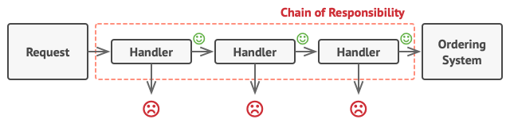

</div>

* ساختار و شرکت‌کنندگان (Structure & Participants)
    * Handler (پردازش‌گر پایه): یک رابط (Interface) یا کلاس انتزاعی که روش پردازش درخواست و همچنین مرجعی به پردازش‌گر بعدی در زنجیره را تعریف می‌کند.
    * ConcreteHandler (پردازش‌گر مشخص): کلاس‌هایی که منطق واقعی پردازش درخواست را پیاده‌سازی می‌کنند. اگر نتوانند درخواست را پردازش کنند، آن را به هندلر بعدی پاس می‌دهند.
    * Client (کلاینت): شیئی که درخواست را ایجاد کرده و زنجیره را پیکربندی و راه‌اندازی می‌کند.
* اصول طراحی رعایت شده (Design Principles)
    * اصل باز/بسته (Open/Closed Principle): شما می‌توانید بدون تغییر کدهای موجود، پردازش‌گرهای جدیدی به زنجیره اضافه کنید.
    * اصل مسئولیت واحد (Single Responsibility Principle): هر کلاس در زنجیره فقط و فقط مسئول یک نوع خاص از پردازش است.
    * اصل جداسازی (Decoupling): کلاینت نیازی ندارد بداند کدام شیء درخواست را پردازش می‌کند؛ فقط آن را به ابتدای زنجیره می‌دهد.
* کاربردها (Applicability)
    * زمانی که بیش از یک شیء می‌تواند یک درخواست را پردازش کند و هندلر مشخص از قبل تعیین نشده است.
    * زمانی که می‌خواهید درخواست را به یکی از چندین شیء ارسال کنید بدون اینکه گیرنده را به صراحت مشخص کنید.
    * زمانی که مجموعه شیءهایی که درخواست را پردازش می‌کنند باید به صورت پویا (Dynamically) در زمان اجرا تعیین شوند.
* مزایا:
    * کنترل بیشتری روی ترتیب پردازش درخواست‌ها دارید.
    * کد را از ساختارهای شرطی پیچیده (if/else یا switch تو در تو) پاکسازی می‌کند.
    * افزودن ویژگی‌های جدید (Middleware/Handler) بسیار آسان است.
* معایب:
    * اگر زنجیره به درستی پیکربندی نشود، ممکن است درخواست بدون پردازش رها شود.
    * دیباگ کردن زنجیره‌های بسیار طولانی می‌تواند چالش‌برانگیز باشد.
    * ایجاد زنجیرههای طولانی ممکن است سربار عملکردی (Performance Overhead) جزئی داشته باشد.
* برخی موارد کاربرد
    * پیاده‌سازی لاگ
    *

## 16.1. 🅱️ Examples1: سیستم لاگ‌گیری سلسله‌مراتبی

هدف آن این است که یک پیام لاگ، از ابتدای یک زنجیره وارد شود و هر پردازش‌گر (Logger) در مسیر، تصمیم بگیرد که آیا باید آن پیام را پردازش کند یا خیر.

* مکانیزم عملکرد در این کد
    1. زنجیره به این صورت چیده شده است: Console (INFO) ➔ File (ERROR) ➔ Email (CRITICAL).
    2. وقتی متد log_message فراخوانی می‌شود، هر هندلر بررسی می‌کند که آیا سطح_لاگ_خودش <= سطح_لاگ_پیام است یا خیر.
    3. اگر شرط برقرار بود، متد write را اجرا می‌کند.
    4. نکته کلیدی این کد: پس از بررسی (چه پیام را نوشته باشد و چه ننوشته باشد)، پیام را همیشه به هندلر بعدی در زنجیره پاس می‌دهد (self._next_logger.log_message(...)). این یعنی زنجیره هرگز به صورت خودکار متوقف نمی‌شود (Short-circuit نمی‌شود) و پیام تا انتهای زنجیره پیش می‌رود.

```python
import abc
from enum import Enum
from typing import Optional  # اضافه شده برای تایپ‌هینت دقیق‌تر اشاره‌گر بعدی


class LogLevel(Enum):
    """
    شمارش‌گر (Enum) برای تعریف سطوح مختلف لاگ.
    مقدار عددی کمتر به معنای اولویت پایین‌تر است.
    """
    INFO = 1
    DEBUG = 2
    WARNING = 3
    ERROR = 4
    CRITICAL = 5


class Logger(abc.ABC):
    """
    کلاس انتزاعی پایه برای پیاده‌سازی الگوی زنجیره مسئولیت (Chain of Responsibility).
    این کلاس ساختار اصلی زنجیره و منطق عبور پیام را مدیریت می‌کند.
    """

    def __init__(self, level: LogLevel) -> None:
        """
        مقداردهی اولیه پردازش‌گر لاگ.
        
        :param level: سطح لاگی که این پردازش‌گر مسئول مدیریت آن است.
        """
        self._log_level: LogLevel = level
        self._next_logger: Optional['Logger'] = None

    def set_next(self, logger: 'Logger') -> 'Logger':
        """
        تنظیم پردازش‌گر بعدی در زنجیره.
        
        :param logger: نمونه‌ای از کلاس Logger که باید به انتهای زنجیره فعلی اضافه شود.
        :return: خود شیء logger بازگردانده می‌شود تا امکان زنجیره‌سازی (Method Chaining) فراهم شود.
        """
        self._next_logger = logger
        return logger

    def log_message(self, level: LogLevel, message: str) -> None:
        """
        پردازش پیام لاگ. اگر سطح لاگ پیام، برابر یا بالاتر از سطح این پردازش‌گر باشد،
        پیام را می‌نویسد و سپس در هر صورت آن را به پردازش‌گر بعدی در زنجیره پاس می‌دهد.
        
        :param level: سطح لاگ پیام ارسالی.
        :param message: متن پیام لاگ.
        """
        # اگر سطح لاگ پیام >= سطح تعریف شده برای این هندلر باشد، آن را پردازش می‌کند
        if self._log_level.value <= level.value:
            self.write(message)

        # پاس دادن پیام به پردازش‌گر بعدی در زنجیره (اگر وجود داشته باشد)
        if self._next_logger is not None:
            self._next_logger.log_message(level, message)

    @abc.abstractmethod
    def write(self, message: str) -> None:
        """
        متد انتزاعی که باید توسط کلاس‌های فرزند برای نحوه خاص نوشتن لاگ پیاده‌سازی شود.
        
        :param message: متن پیام لاگ که باید نوشته شود.
        """
        pass


class ConsoleLogger(Logger):
    """
    پردازش‌گر مشخص برای نوشتن لاگ‌ها در کنسول (خروجی استاندارد).
    """

    def write(self, message: str) -> None:
        print(f'Console logger: {message}')


class FileLogger(Logger):
    """
    پردازش‌گر مشخص برای نوشتن لاگ‌ها در فایل.
    (در این مثال ساده، برای نمایش عملکرد، در کنسول چاپ می‌شود).
    """

    def write(self, message: str) -> None:
        print(f'File logger: {message}')


class EmailLogger(Logger):
    """
    پردازش‌گر مشخص برای ارسال لاگ‌های حیاتی از طریق ایمیل.
    (در این مثال ساده، برای نمایش عملکرد، در کنسول چاپ می‌شود).
    """

    def write(self, message: str) -> None:
        print(f'Email logger: {message}')


def setup_chain() -> Logger:
    """
    تابع کارخانه (Factory) برای پیکربندی و ساخت زنجیره مسئولیت.
    
    :return: اولین پردازش‌گر در زنجیره (نقطه ورود زنجیره).
    """
    console_logger = ConsoleLogger(LogLevel.INFO)
    file_logger = FileLogger(LogLevel.ERROR)
    email_logger = EmailLogger(LogLevel.CRITICAL)

    # ساخت زنجیره به ترتیب: Console -> File -> Email
    console_logger.set_next(file_logger).set_next(email_logger)

    return console_logger


if __name__ == '__main__':
    # ۱. راه‌اندازی و دریافت نقطه شروع زنجیره
    logger_chain = setup_chain()

    # ۲. ارسال یک پیام با سطح CRITICAL به ابتدای زنجیره
    # انتظار می‌رود این پیام توسط هر سه پردازشگر (Console, File, Email) پردازش شود،
    # زیرا سطح CRITICAL (5) از سطح INFO (1)، ERROR (4) و CRITICAL (5) بزرگتر یا مساوی است.
    logger_chain.log_message(LogLevel.CRITICAL, 'Information message')
```

## 16.2. 🅱️ Examples2: سیستم لاگ‌گیری سلسله‌مراتبی به روش دوم

```python
from abc import ABC, abstractmethod
from typing import Optional
from enum import Enum


# تعریف سطوح مختلف لاگ
class LogLevel(Enum):
    DEBUG = 1
    INFO = 2
    ERROR = 3


class AbstractLogger(ABC):
    """
    کلاس انتزاعی برای تعریف ساختار پایه پردازش‌گرهای لاگ.
    """

    def __init__(self, level: LogLevel) -> None:
        # سطح لاگ این پردازش‌گر
        self._level: LogLevel = level
        # اشاره‌گر به پردازش‌گر بعدی در زنجیره
        self._next_handler: Optional['AbstractLogger'] = None

    def set_next(self, handler: 'AbstractLogger') -> 'AbstractLogger':
        """
        تنظیم پردازش‌گر بعدی در زنجیره و بازگرداندن آن برای امکان زنجیره‌سازی (Fluent Interface).
        """
        self._next_handler = handler
        return handler

    @abstractmethod
    def write_log(self, message: str) -> None:
        """
        متد انتزاعی برای نوشتن پیام لاگ (باید در کلاس‌های فرزند پیاده‌سازی شود).
        """
        pass

    def log_message(self, level: LogLevel, message: str) -> None:
        """
        متد اصلی که تصمیم می‌گیرد آیا این هندلر باید لاگ را چاپ کند یا به بعدی پاس دهد.
        """
        # اگر سطح درخواستی >= سطح این هندلر باشد، آن را پردازش می‌کند
        if level.value >= self._level.value:
            self.write_log(message)

        # اگر هندلر بعدی وجود دارد و این هندلر نتوانست (یا خواست) پاس دهد، به بعدی منتقل می‌کند
        # نکته: در این مثال خاص، همه هندلرها لاگ را چاپ می‌کنند اما در الگوهای واقعی معمولاً 
        # اگر پردازش شد، زنجیره متوقف می‌شود. برای نشان دادن عبور از زنجیره، اینجا ادامه می‌دهیم.
        if self._next_handler:
            self._next_handler.log_message(level, message)


class DebugLogger(AbstractLogger):
    """پردازش‌گر لاگ‌های دیباگ."""

    def __init__(self) -> None:
        super().__init__(LogLevel.DEBUG)

    def write_log(self, message: str) -> None:
        print(f"[DEBUG]: {message}")


class InfoLogger(AbstractLogger):
    """پردازش‌گر لاگ‌های اطلاعاتی."""

    def __init__(self) -> None:
        super().__init__(LogLevel.INFO)

    def write_log(self, message: str) -> None:
        print(f"[INFO]: {message}")


class ErrorLogger(AbstractLogger):
    """پردازش‌گر لاگ‌های خطا."""

    def __init__(self) -> None:
        super().__init__(LogLevel.ERROR)

    def write_log(self, message: str) -> None:
        print(f"[ERROR]: {message}")


# --- بخش اجرای برنامه (Client) ---
if __name__ == "__main__":
    # ۱. ایجاد پردازش‌گرها
    debug_logger: AbstractLogger = DebugLogger()
    info_logger: AbstractLogger = InfoLogger()
    error_logger: AbstractLogger = ErrorLogger()

    # ۲. اتصال آن‌ها به یکدیگر برای ساخت زنجیره
    # زنجیره: Debug -> Info -> Error
    debug_logger.set_next(info_logger).set_next(error_logger)

    print("--- تست لاگ سطح DEBUG ---")
    # هر سه هندلر آن را پردازش می‌کنند
    debug_logger.log_message(LogLevel.DEBUG, "این یک پیام دیباگ است.")

    print("\n--- تست لاگ سطح ERROR ---")
    # فقط هندلر Error آن را پردازش می‌کند (چون سطحش بالاتر است)
    # اما چون در متد log_message شرط توقف نگذاشتیم، همه چاپ می‌شوند. 
    # (در حالت استاندارد اگر پردازش شود، زنجیره قطع می‌شود. برای سادگی اینجا همه چاپ می‌شوند).
    error_logger.log_message(LogLevel.ERROR, "خطای بحرانی در دیتابیس رخ داد!")
```

## 16.3. 🅱️ Examples3: Authentication Pipeline

هدف آن این است که یک درخواست ورود، به صورت مرحله‌به‌مرحله از فیلترهای امنیتی عبور کند.

1.     درخواست اول: تمام فیلدها صحیح هستند. از تمام ۴ مرحله عبور کرده و پیام Authentication successful. Access granted را برمی‌گرداند.
2. درخواست دوم: آی‌پی (192.168.1.2) در لیست سفید نیست. در مرحله اول رد می‌شود و پیام Untrusted IP address برمی‌گرداند.
3. درخواست سوم: آی‌پی صحیح است، اما رمز عبور (secure1234) اشتباه است. از مرحله اول عبور می‌کند اما در مرحله دوم رد می‌شود و پیام Invalid credentials برمی‌گرداند.
4. درخواست چهارم: آی‌پی و رمز عبور صحیح هستند، اما کد دو مرحله‌ای (1234567) اشتباه است. در مرحله سوم رد می‌شود و پیام Invalid 2FA code برمی‌گرداند.
5. درخواست پنجم: سه مرحله اول با موفقیت طی می‌شوند، اما توکن نشست (qwe1234) نامعتبر است. در مرحله چهارم (آخر) رد می‌شود و پیام Invalid session برمی‌گرداند.

```python
from abc import ABC, abstractmethod
from typing import Optional, List, Dict


class AuthHandler(ABC):
    """
    کلاس انتزاعی پایه برای پیاده‌سازی الگوی زنجیره مسئولیت (Chain of Responsibility)
    در فرآیند احراز هویت. این کلاس ساختار زنجیره و مکانیزم عبور درخواست را مدیریت می‌کند.
    """

    def __init__(self) -> None:
        """مقداردهی اولیه و تنظیم اشاره‌گر به پردازش‌گر بعدی در زنجیره."""
        self._next_handler: Optional['AuthHandler'] = None

    def set_next(self, handler: 'AuthHandler') -> 'AuthHandler':
        """
        تنظیم پردازش‌گر بعدی در زنجیره.
        
        :param handler: نمونه‌ای از کلاس AuthHandler که باید به انتهای زنجیره فعلی اضافه شود.
        :return: خود شیء handler بازگردانده می‌شود تا امکان زنجیره‌سازی (Method Chaining) فراهم شود.
        """
        self._next_handler = handler
        return handler

    @abstractmethod
    def handle(self, request: Dict[str]) -> str:
        """
        متد انتزاعی برای پردازش درخواست احراز هویت.
        باید توسط کلاس‌های فرزند پیاده‌سازی شود.
        
        :param request: دیکشنری حاوی اطلاعات درخواست احراز هویت.
        :return: رشته‌ای حاوی پیام موفقیت یا خطای احراز هویت.
        """
        pass

    def pass_to_next(self, request: Dict[str]) -> str:
        """
        پاس دادن درخواست به پردازش‌گر بعدی در زنجیره.
        اگر پردازش‌گر بعدی وجود نداشته باشد، پیام خطای پیش‌فرض بازگردانده می‌شود.
        
        :param request: دیکشنری حاوی اطلاعات درخواست احراز هویت.
        :return: نتیجه پردازش از سوی هندلر بعدی یا پیام خطای کمبود اعتبارنامه.
        """
        if self._next_handler:
            return self._next_handler.handle(request)

        return 'Authentication failed: Insufficient credentials'


class IPWhiteListHandler(AuthHandler):
    """
    پردازش‌گر بررسی لیست سفید آی‌پی (IP Whitelist).
    اولین مرحله از زنجیره احراز هویت.
    """

    def handle(self, request: Dict[str]) -> str:
        # بررسی وجود آی‌پی درخواست در لیست مجاز
        if request.get('ip') in ['192.168.1.1', '10.0.0.1']:
            print(f'{self.__class__.__name__}: IP verified')
            # در صورت موفقیت، درخواست به مرحله بعدی پاس داده می‌شود
            return self.pass_to_next(request)

        # در صورت عدم تطابق، زنجیره متوقف شده و پیام خطا بازگردانده می‌شود
        return f'{self.__class__.__name__}: Untrusted IP address'


class PasswordHandler(AuthHandler):
    """
    پردازش‌گر بررسی نام کاربری و رمز عبور.
    دومین مرحله از زنجیره احراز هویت.
    """

    def handle(self, request: Dict[str]) -> str:
        # بررسی تطابق نام کاربری و رمز عبور با مقادیر مورد انتظار
        if request.get('username') == 'admin' and request.get('password') == 'secure123':
            print(f'{self.__class__.__name__}: Credentials verified')
            return self.pass_to_next(request)

        return f'{self.__class__.__name__}: Invalid credentials'


class TwoFactorHandler(AuthHandler):
    """
    پردازش‌گر بررسی کد احراز هویت دو مرحله‌ای (2FA).
    سومین مرحله از زنجیره احراز هویت.
    """

    def handle(self, request: Dict[str]) -> str:
        # بررسی صحت کد دو مرحله‌ای
        if request.get('2fa_code') == '123456':
            print(f'{self.__class__.__name__}: 2FA verified')
            return self.pass_to_next(request)

        return f'{self.__class__.__name__}: Invalid 2FA code'


class SessionHandler(AuthHandler):
    """
    پردازش‌گر بررسی توکن نشست (Session Token).
    آخرین مرحله از زنجیره احراز هویت که در صورت موفقیت، دسترسی نهایی را اعطا می‌کند.
    """

    def handle(self, request: Dict[str]) -> str:
        # بررسی صحت توکن نشست
        if request.get('session_token') == 'qwe123':
            print(f'{self.__class__.__name__}: Session verified')
            # این آخرین مرحله است، بنابراین به جای pass_to_next، پیام موفقیت نهایی بازگردانده می‌شود
            return 'Authentication successful. Access granted'

        return f'{self.__class__.__name__}: Invalid session'


def client_code(handler: AuthHandler, requests: List[Dict[str]]) -> None:
    """
    تابع کلاینت برای اجرای تست روی زنجیره احراز هویت.
    
    :param handler: نقطه شروع زنجیره احراز هویت (اولین هندلر).
    :param requests: لیستی از دیکشنری‌های حاوی داده‌های درخواست احراز هویت.
    """
    for request in requests:
        print(f'\nAttempting to authenticate {request.get("username")}...')
        result = handler.handle(request)
        print(result)


if __name__ == '__main__':
    # ۱. ایجاد نمونه‌هایی از هر پردازش‌گر
    ip_handler = IPWhiteListHandler()
    password_handler = PasswordHandler()
    two_factor_handler = TwoFactorHandler()
    session_handler = SessionHandler()

    # ۲. ساخت زنجیره احراز هویت به ترتیب: IP -> Password -> 2FA -> Session
    ip_handler.set_next(password_handler).set_next(two_factor_handler).set_next(session_handler)

# ۳. تعریف سناریوهای مختلف تست
requests = [
    {
        # سناریو ۱: تمام اطلاعات صحیح است (موفقیت کامل)
        'ip': '192.168.1.1',
        'username': 'admin',
        'password': 'secure123',
        '2fa_code': '123456',
        'session_token': 'qwe123'
    },
    {
        # سناریو ۲: آی‌پی نامعتبر است (شکست در مرحله اول)
        'ip': '192.168.1.2',
        'username': 'random user 1',
        'password': 'secure123',
        '2fa_code': '123456',
        'session_token': 'qwe123'
    },
    {
        # سناریو ۳: آی‌پی صحیح است، اما رمز عبور اشتباه است (شکست در مرحله دوم)
        'ip': '192.168.1.1',
        'username': 'admin',
        'password': 'secure1234',
        '2fa_code': '123456',
        'session_token': 'qwe123'
    },
    {
        # سناریو ۴: آی‌پی و رمز عبور صحیح است، اما کد 2FA اشتباه است (شکست در مرحله سوم)
        'ip': '192.168.1.1',
        'username': 'admin',
        'password': 'secure123',
        '2fa_code': '1234567',
        'session_token': 'qwe123'
    },
    {
        # سناریو ۵: همه مراحل اولیه صحیح است، اما توکن نشست (Session) نامعتبر است (شکست در مرحله آخر)
        'ip': '192.168.1.1',
        'username': 'admin',
        'password': 'secure123',
        '2fa_code': '123456',
        'session_token': 'qwe1234'
    }
]

# ۴. اجرای کد کلاینت و ارسال درخواست‌ها به ابتدای زنجیره
client_code(ip_handler, requests)
```

## 16.4. 🅱️ Examples4: Order Validation Pipeline

در این مثال، یک سفارش باید از چندین فیلتر (بررسی موجودی، بررسی پرداخت، بررسی کلاهبرداری) عبور کند. اگر هر مرحله رد شود، زنجیره متوقف شده و سفارش ثبت نمی‌شود.

```python
from dataclasses import dataclass
from typing import Optional


@dataclass
class Order:
    """کلاس مدل برای نگهداری اطلاعات سفارش."""
    order_id: int
    amount: float
    is_paid: bool
    is_fraudulent: bool


class OrderHandler:
    """
    کلاس پایه برای هندلرهای اعتبارسنجی سفارش.
    """

    def __init__(self) -> None:
        # هندلر بعدی در زنجیره
        self._next_handler: Optional['OrderHandler'] = None

    def set_next(self, handler: 'OrderHandler') -> 'OrderHandler':
        """تنظیم هندلر بعدی."""
        self._next_handler = handler
        return handler

    def handle(self, order: Order) -> bool:
        """
        متد اصلی پردازش. اگر معتبر بود به بعدی پاس می‌دهد، در غیر این صورت False برمی‌گرداند.
        """
        # منطق اعتبارسنجی در کلاس‌های فرزند پیاده‌سازی می‌شود
        if not self.validate(order):
            return False  # اگر اعتبارسنجی ناموفق بود، زنجیره متوقف می‌شود

        # اگر هندلر بعدی وجود دارد، درخواست را به آن پاس می‌دهد
        if self._next_handler:
            return self._next_handler.handle(order)

        # اگر به آخر زنجیره رسیدیم و همه تایید کردند
        return True

    def validate(self, order: Order) -> bool:
        """متد پایه که باید در کلاس‌های فرزند بازنویسی شود."""
        raise NotImplementedError


class InventoryHandler(OrderHandler):
    """بررسی موجودی انبار."""

    def validate(self, order: Order) -> bool:
        print(f"بررسی موجودی برای سفارش {order.order_id}...")
        # فرض می‌کنیم همیشه موجودی داریم، مگر اینکه مبلغ خاصی باشد
        if order.amount > 10000:
            print("خطا: موجودی انبار برای این مبلغ کافی نیست!")
            return False
        print("موجودی انبار تایید شد.")
        return True


class PaymentHandler(OrderHandler):
    """بررسی وضعیت پرداخت."""

    def validate(self, order: Order) -> bool:
        print(f"بررسی وضعیت پرداخت برای سفارش {order.order_id}...")
        if not order.is_paid:
            print("خطا: سفارش پرداخت نشده است!")
            return False
        print("پرداخت تایید شد.")
        return True


class FraudHandler(OrderHandler):
    """بررسی کلاهبرداری و امنیت."""

    def validate(self, order: Order) -> bool:
        print(f"بررسی امنیت و کلاهبرداری برای سفارش {order.order_id}...")
        if order.is_fraudulent:
            print("خطا: این سفارش مشکوک به کلاهبرداری است!")
            return False
        print("امنیت سفارش تایید شد.")
        return True


# --- بخش اجرای برنامه (Client) ---
if __name__ == "__main__":
    # ۱. ایجاد هندلرها
    inventory_handler: OrderHandler = InventoryHandler()
    payment_handler: OrderHandler = PaymentHandler()
    fraud_handler: OrderHandler = FraudHandler()

    # ۲. ساخت زنجیره: موجودی -> پرداخت -> امنیت
    inventory_handler.set_next(payment_handler).set_next(fraud_handler)

    # ۳. ایجاد یک سفارش موفق
    valid_order: Order = Order(order_id=101, amount=500.0, is_paid=True, is_fraudulent=False)

    print("--- پردازش سفارش موفق ---")
    if inventory_handler.handle(valid_order):
        print("سفارش با موفقیت ثبت و نهایی شد!\n")
    else:
        print("سفارش رد شد.\n")

    # ۴. ایجاد یک سفارش ناموفق (پرداخت نشده)
    invalid_order: Order = Order(order_id=102, amount=200.0, is_paid=False, is_fraudulent=False)

    print("--- پردازش سفارش ناموفق (بدون پرداخت) ---")
    if inventory_handler.handle(invalid_order):
        print("سفارش با موفقیت ثبت و نهایی شد!")
    else:
        print("سفارش رد شد (زنجیره متوقف شد).")
```

# 17. 🅰️ Structural.Adapter(ایجاد کلاس واسط برای سازگاری بین دو ماژول ناسازگار)

هدف اصلی این الگو، تبدیل رابط (Interface) یک کلاس به رابط دیگری است که کلاینت انتظار دارد. این الگو به کلاس‌هایی اجازه می‌دهد که به دلیل داشتن رابط‌های ناسازگار، در کنار یکدیگر کار کنند (در غیر این صورت امکان‌پذیر نبود).

<div style="display: flex; flex-direction: column; align-items: center;">

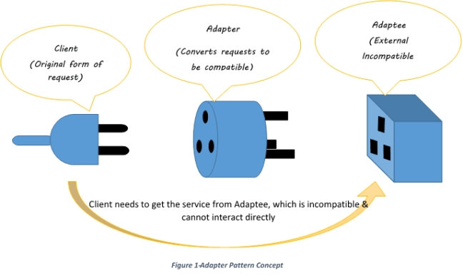

</div>

* اجزای اصلی (Components)
    * Target (هدف): رابط یا کلاس انتزاعی که کلاینت از آن استفاده می‌کند.
    * Adaptee (سازگار‌شونده): کلاس موجود با رابط ناسازگار که نیاز به تطبیق دارد.
    * Adapter (سازگارکننده): کلاسی که رابط Target را پیاده‌سازی کرده و فراخوانی‌ها را به Adaptee ارجاع می‌دهد.
    * Client (کلاینت): کدی که با اشیاء رابط Target تعامل دارد.
* انواع پیاده‌سازی
    * Object Adapter (بر اساس ترکیب/Composition): (روش استاندارد و پیشنهادی) در این روش، Adapter رابط Target را پیاده‌سازی کرده و یک شیء از Adaptee را درون خود ترکیب (Compose) می‌کند.
    * Class Adapter (بر اساس وراثت/Inheritance): در این روش، Adapter همزمان از Target ارث‌بری کرده و از Adaptee نیز ارث‌بری می‌کند (نیاز به Multiple Inheritance دارد که در زبان‌هایی مثل Java و C# پشتیبانی نمی‌شود، اما در Python و C++ ممکن است). ما در مثال‌ها از روش استاندارد Object Adapter استفاده می‌کنیم.
* تطبیق با اصول SOLID
    * اصل مسئولیت واحد (SRP): منطق تبدیل رابط از منطق تجاری (Business Logic) کلاس‌های اصلی جدا می‌شود و فقط در Adapter قرار می‌گیرد.
    * اصل باز/بسته (OCP): می‌توانید انواع جدیدی از Adapterها را برای سازگار کردن کلاس‌های جدید بدون تغییر در کد کلاینت یا Target معرفی کنید.
* مزایا و معایب
    * مزایا: جداسازی دغدغه‌ها (Separation of Concerns)، امکان استفاده از کتابخانه‌های Third-party بدون آلوده کردن کد اصلی، رعایت OCP.
    * معایب: افزایش پیچیدگی کلی سیستم با افزودن کلاس‌ها و اینترفیس‌های جدید.
* انواع کاربردها: جایگاه استفاده در پروژه‌های بزرگ صنعتی برای حل مشکلات یکپارچگی است.
    * یکپارچه‌سازی درگاه‌های پرداخت (Payment Gateways Integration): شرکت‌ها معمولاً یک رابط داخلی استاندارد برای پرداخت دارند. برای اتصال به درگاه‌های مختلف (مثل Stripe، PayPal، یا درگاه‌های بانکی محلی که APIهای متفاوتی دارند)، از Adapter استفاده می‌کنند تا هر درگاه را با رابط داخلی شرکت سازگار کنند.
    * انتزاع سرویس‌دهندگان ابری (Cloud Provider Abstraction): در معماری‌های Multi-Cloud، برای جلوگیری از Vendor Lock-in، یک رابط استاندارد برای ذخیره‌سازی فایل (مثل upload_file) تعریف می‌شود. سپس برای AWS S3، Google Cloud Storage و Azure Blob Storage جداگانه Adapter نوشته می‌شود تا API اختصاصی هر کدام را به رابط استاندارد تبدیل کنند.
    * مهاجرت و اتصال به سیستم‌های قدیمی (Legacy System / SOAP to REST): زمانی که یک سازمان می‌خواهد سیستم‌های قدیمی (مثلاً مبتنی بر SOAP یا XML) را به معماری مدرن (مثل Microservices و REST/JSON) مهاجرت دهد، به جای بازنویسی سیستم قدیمی، یک Adapter (یا Facade/Adapter ترکیبی) می‌نویسد که درخواست‌های JSON/REST را به SOAP/XML ترجمه کرده و به سیستم
      Legacy پاس دهد.
    * استانداردسازی درایورهای پایگاه داده (Database Driver Standardization): در ORMها (مثل SQLAlchemy یا Hibernate) یا لایه Repository، از الگوی Adapter برای یکپارچه‌سازی کوئری‌ها استفاده می‌شود. Adapterهای متفاوتی برای PostgreSQL، MySQL و MongoDB نوشته می‌شود تا متدهای استاندارد Repository را به زبان کوئری مخصوص هر دیتابیس ترجمه کنند.
    * یکپارچه‌سازی ابزارهای لاگ‌برداری و مانیتورینگ (Logging & Telemetry Adapters): در سیستم‌های Enterprise، ممکن است نیاز باشد لاگ‌ها همزمان به چندین مقصد (مثل ElasticSearch, Datadog, یا فایل‌های محلی) فرستاده شوند. یک رابط Logger استاندارد تعریف شده و Adapterهای مختلف، متدهای آن را به فرمت و API اختصاصی هر ابزار مانیتورینگ (مثل Log4j یا Winston)
      تبدیل می‌کنند.

<div style="display: flex; flex-direction: column; align-items: center;">

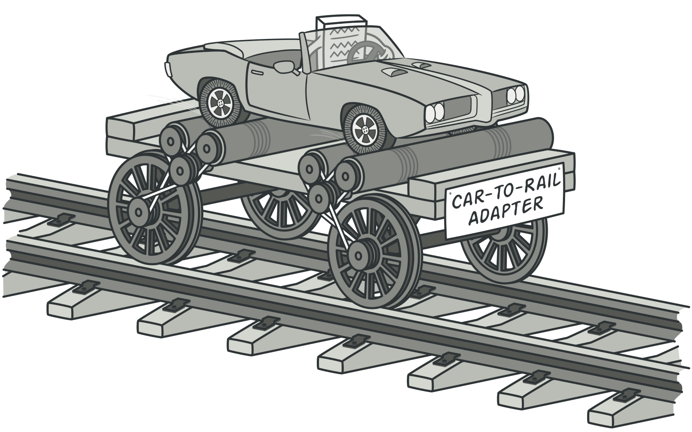

</div>

## 17.1. 🅱️ Examples1:

این کد با استفاده از الگوی Adapter، خروجی یک پریز برق ۲۳۰ ولت اروپایی را به فرمت مورد انتظار (۱۲۰ ولت) تبدیل می‌کند تا یک دستگاه آمریکایی بتواند بدون آسیب دیدن از آن برای شارژ استفاده کند.

```python
from typing import Union


# ۱. کلاس هدف (Target) - پریز برق استاندارد آمریکا
class USPowerOutlet:
    def output_120v(self) -> int:
        # متدی که کلاینت (دستگاه آمریکایی) انتظار دارد آن را فراخوانی کند
        print("providing 120 volt")
        return 120


# ۲. کلاس ناسازگار (Adaptee) - پریز برق اروپا
class EuropeanPowerSocket:
    def output_230v(self) -> int:
        # کلاسی با رابط متفاوت که مستقیماً با دستگاه آمریکایی سازگار نیست
        print("providing 230 volt")
        return 230


# ۳. کلاس سازگارکننده (Adapter)
class EuropeanToUSAdapter(USPowerOutlet):
    def __init__(self, european_power_socket: EuropeanPowerSocket) -> None:
        # دریافت و نگهداری مرجع کلاس ناسازگار (پریز اروپا) درون آداپتور
        self.european_power_socket = european_power_socket

    def output_120v(self) -> float:
        # پیاده‌سازی متد مورد انتظار کلاینت و ترجمه آن به متد کلاس ناسازگار
        volts = self.european_power_socket.output_230v()
        print(f'converting {volts}V to 120V')
        # تبدیل ولتاژ ۲۳۰ به حدود ۱۲۰ ولت
        return volts / 1.9167


# ۴. کلاینت (Client) - دستگاه آمریکایی
class AmericanDevice:
    def __init__(self, power_source: USPowerOutlet) -> None:
        # دستگاه فقط با رابط USPowerOutlet کار می‌کند (به لطف پلی‌مورفیسم، آداپتور هم پذیرفته می‌شود)
        self.power_source = power_source

    def charge(self) -> None:
        # درخواست برق از منبع تغذیه (که می‌تواند پریز اصلی یا آداپتور باشد)
        volts = self.power_source.output_120v()

        # بررسی ولتاژ دریافتی
        if volts == 120:
            print("Device is charging properly!")
        else:
            print(f"Warning!: {volts}V detected. Device may be damaged")


if __name__ == "__main__":
    print('==== using us power outlet ====')
    # حالت اول: اتصال مستقیم دستگاه به پریز استاندارد آمریکا
    us_outlet = USPowerOutlet()
    us_device = AmericanDevice(us_outlet)
    us_device.charge()

    print('\n==== using european power socket using adapter ====')
    # حالت دوم: اتصال دستگاه به پریز اروپا از طریق آداپتور
    euro_socket = EuropeanPowerSocket()
    adapter = EuropeanToUSAdapter(euro_socket)

    # پاس دادن آداپتور به دستگاه (دستگاه فکر می‌کند با یک پریز آمریکایی طرف است)
    us_device_with_adapter = AmericanDevice(adapter)
    us_device_with_adapter.charge()
```

## 17.2. 🅱️ Examples2:

رابط‌های ناهمگون دو درگاه پرداخت (PayPal و یک سیستم بانکی قدیمی) را به یک رابط استاندارد یکپارچه تبدیل می‌کند تا سیستم فروشگاه اینترنتی بتواند بدون درگیر شدن با جزئیات و تفاوت‌های هر درگاه، عملیات پرداخت و بازگشت وجه را به صورت یکپارچه انجام دهد.

```python
from abc import ABC, abstractmethod


# ۱. کلاس‌های ناسازگار (Adaptees) - سیستم‌های موجود که رابط متفاوتی دارند

class PaypalSDK:
    """درگاه پی‌پل که فقط با دلار کار می‌کند و متدهای متفاوتی دارد."""

    def make_payment(self, dollars: float) -> bool:
        print(f'Processing PayPal payment of ${dollars:.2f}')
        return True

    def issue_refund(self, dollars: float) -> bool:
        print(f"Issuing PayPal refund of ${dollars:.2f}")
        return True


class LegacyBankSystem:
    """سیستم بانکی قدیمی که با ارزهای مختلف کار می‌کند اما خروجی آن رشته متنی است."""

    def initiate_transaction(self, transaction_type: str, amount: float, currency: str) -> str:
        action = "PAYMENT" if transaction_type == 'PAY' else 'REFUND'
        print(f'{action} of {amount:.2f} {currency} via legacy bank system')
        return 'SUCCESS'


# ۲. رابط هدف (Target) - رابط استانداردی که کلاینت انتظار دارد

class PaymentProcessor(ABC):
    """رابط استانداردی که سیستم فروشگاه اینترنتی با آن کار می‌کند."""

    @abstractmethod
    def process_payment(self, amount: float, currency: str) -> bool:
        pass

    @abstractmethod
    def refund_payment(self, amount: float, currency: str) -> bool:
        pass


# ۳. کلاس‌های سازگارکننده (Adapters)

class PaypalAdapter(PaymentProcessor):
    """آداپتور پی‌پل: متدها را ترجمه کرده و تبدیل ارز را انجام می‌دهد."""

    def __init__(self, paypal: PaypalSDK) -> None:
        # نگهداری مرجع درگاه ناسازگار
        self.paypal = paypal

    def process_payment(self, amount: float, currency: str) -> bool:
        # پی‌پل فقط دلار قبول می‌کند، پس اگر ارز چیز دیگری بود آن را تبدیل می‌کنیم
        if currency != 'USD':
            amount = self._convert_currency(amount, currency, 'USD')

        # فراخوانی متد معادل در Adaptee
        return self.paypal.make_payment(amount)

    def refund_payment(self, amount: float, currency: str) -> bool:
        if currency != 'USD':
            amount = self._convert_currency(amount, currency, 'USD')

        return self.paypal.issue_refund(amount)

    def _convert_currency(self, amount: float, from_curr: str, to_curr: str) -> float:
        # متد داخلی برای تبدیل ارز (منطق مخصوص آداپتور پی‌پل)
        print(f'Converting {from_curr} to {to_curr}')
        rates = {"EUR": 0.85, "USD": 1.0}
        return amount * rates[to_curr] / rates[from_curr]


class LegacyBankSystemAdapter(PaymentProcessor):
    """آداپتور سیستم قدیمی: متدها را ترجمه کرده و خروجی رشته‌ای را به بولین تبدیل می‌کند."""

    def __init__(self, bank: LegacyBankSystem) -> None:
        # نگهداری مرجع سیستم بانکی قدیمی
        self.bank = bank

    def process_payment(self, amount: float, currency: str) -> bool:
        # ترجمه متد و پارامترها برای سیستم قدیمی
        result = self.bank.initiate_transaction('PAY', amount, currency)
        # تبدیل خروجی رشته‌ای ('SUCCESS') به بولین (True) مورد انتظار Target
        return result == 'SUCCESS'

    def refund_payment(self, amount: float, currency: str) -> bool:
        result = self.bank.initiate_transaction('REFUND', amount, currency)
        return result == 'SUCCESS'


# ۴. کلاینت (Client) - سیستم فروشگاه اینترنتی

class ECommerceSystem:
    """کلاینتی که فقط رابط استاندارد (PaymentProcessor) را می‌شناسد."""

    def __init__(self, payment_processor: PaymentProcessor) -> None:
        # تزریق وابستگی (Dependency Injection) از طریق رابط Target
        self.payment_processor = payment_processor

    def checkout(self, amount: float, currency: str) -> bool:
        print(f'\nProcessing checkout for {amount:.2f} {currency}')
        # کلاینت کاملاً بی‌خبر است که در پس‌زمینه کدام درگاه در حال استفاده است
        return self.payment_processor.process_payment(amount, currency)

    def process_refund(self, amount: float, currency: str) -> bool:
        print(f'\nProcessing refund for {amount:.2f} {currency}')
        return self.payment_processor.refund_payment(amount, currency)


if __name__ == '__main__':
    # ایجاد نمونه‌هایی از سیستم‌های ناسازگار (Adaptees)
    paypal = PaypalSDK()
    legacy_bank = LegacyBankSystem()

    # ایجاد آداپتورها برای پوشش دادن تفاوت‌ها
    paypal_adapter = PaypalAdapter(paypal)
    legacy_bank_adapter = LegacyBankSystemAdapter(legacy_bank)

    print('=== testing paypal ===')
    # تزریق آداپتور پی‌پل به سیستم فروشگاه
    shop = ECommerceSystem(paypal_adapter)
    shop.checkout(100.00, 'USD')
    shop.process_refund(50.00, 'USD')
    # در این مرحله آداپتور پی‌پل به صورت خودکار یورو را به دلار تبدیل می‌کند
    shop.checkout(80.00, 'EUR')

    print('\n=== testing legacy bank system ===')
    # تعویض آداپتور با آداپتور سیستم بانکی قدیمی (بدون نیاز به تغییر کد کلاینت)
    shop = ECommerceSystem(legacy_bank_adapter)
    shop.checkout(100.00, 'USD')
    shop.process_refund(50.00, 'USD')
    shop.checkout(80.00, 'EUR')
```

## 17.3. 🅱️ Examples3: Payment Gateway (یکپارچه‌سازی درگاه پرداخت)

سناریو: سیستم ما انتظار دارد پرداخت از طریق متد pay(amount) انجام شود. اما می‌خواهیم از یک درگاه پرداخت قدیمی استفاده کنیم که متد آن send_money(currency, value) است.

```python
from abc import ABC, abstractmethod


# ۱. تعریف رابط هدف (Target) که کلاینت انتظار دارد
class PaymentProcessor(ABC):
    @abstractmethod
    def pay(self, amount: float) -> bool:
        pass


# ۲. کلاس ناسازگار (Adaptee) - درگاه پرداخت قدیمی
class LegacyPaymentGateway:
    def send_money(self, currency: str, value: float) -> str:
        # شبیه‌سازی پردازش در درگاه قدیمی
        return f"SUCCESS: {value} {currency} sent via legacy gateway."


# ۳. کلاس سازگارکننده (Adapter)
class LegacyPaymentAdapter(PaymentProcessor):
    def __init__(self, legacy_gateway: LegacyPaymentGateway):
        # نگهداری مرجع کلاس ناسازگار درون سازگارکننده
        self._legacy_gateway = legacy_gateway

    def pay(self, amount: float) -> bool:
        # ترجمه فراخوانی از رابط Target به رابط Adaptee
        # فرض می‌کنیم واحد پول پیش‌فرض ریال (IRR) است
        result = self._legacy_gateway.send_money(currency="IRR", value=amount)

        # بررسی نتیجه و تبدیل به بولین مورد انتظار کلاینت
        return result.startswith("SUCCESS")


# ۴. کلاینت
def checkout(processor: PaymentProcessor, total_amount: float) -> None:
    print(f"در حال پردازش پرداخت به مبلغ {total_amount}...")
    if processor.pay(total_amount):
        print("پرداخت با موفقیت انجام شد.")
    else:
        print("پرداخت ناموفق بود.")


# اجرای مثال
if __name__ == "__main__":
    legacy_gateway = LegacyPaymentGateway()
    # استفاده از Adapter برای سازگار کردن درگاه قدیمی با رابط جدید
    adapted_processor = LegacyPaymentAdapter(legacy_gateway)

    checkout(adapted_processor, 150000.0)
```

## 17.4. 🅱️ Examples4: Notification Service

سناریو: سیستم ما برای ارسال پیام از متد send_notification(user_email, message) استفاده می‌کند. اما سرویس دهنده پیامکی (SMS) ما فقط شماره موبایل می‌پذیرد و متد آن dispatch_sms(phone, text) است.

```python
from abc import ABC, abstractmethod
from dataclasses import dataclass


# ۱. رابط هدف (Target)
class NotificationService(ABC):
    @abstractmethod
    def send_notification(self, user_email: str, message: str) -> None:
        pass


# ۲. کلاس ناسازگار (Adaptee) - سرویس دهنده پیامکی
class SmsProvider:
    def dispatch_sms(self, phone_number: str, text: str) -> None:
        print(f"[SMS Provider] پیامک به {phone_number} ارسال شد: {text}")


# ۳. مدل کاربر (برای نشان دادن تبدیل داده‌ها در Adapter)
@dataclass
class User:
    email: str
    phone: str


# ۴. کلاس سازگارکننده (Adapter)
class SmsNotificationAdapter(NotificationService):
    def __init__(self, sms_provider: SmsProvider, user: User):
        self._sms_provider = sms_provider
        self._user = user

    def send_notification(self, user_email: str, message: str) -> None:
        # در اینجا Adapter وظیفه دارد داده‌ها را مپ کند
        # چون سرویس پیامکی ایمیل را نمی‌فهمد، ما شماره موبایل کاربر را استخراج می‌کنیم
        if user_email == self._user.email:
            target_phone = self._user.phone
            # ترجمه و ارسال به Adaptee
            self._sms_provider.dispatch_sms(phone_number=target_phone, text=message)
        else:
            print("کاربر یافت نشد!")


# ۵. کلاینت
def notify_user(service: NotificationService, email: str, msg: str) -> None:
    service.send_notification(email, msg)


# اجرای مثال
if __name__ == "__main__":
    sms_service = SmsProvider()
    my_user = User(email="ali@example.com", phone="09123456789")

    # سازگار کردن سرویس پیامکی با رابط نوتیفیکیشن سیستم
    adapted_service = SmsNotificationAdapter(sms_service, my_user)

    notify_user(adapted_service, "ali@example.com", "سفارش شما ارسال شد.")
```

# 18. 🅰️ Structural.Composite(رفتار یکسان بین گره‌های زیرین و گره اصلی در ساختار درختی)

الگوی کامپوزیت برای ساخت سلسله‌مراتب جزء-کل (Part-Whole Hierarchies) به شکل درختی استفاده می‌شود.هدف اصلی این الگو این است که به کلاینت (Client) اجازه دهد تا با اشیاء منفرد (اجزاء) و ترکیب اشیاء (کل‌ها) به صورت یکسان (Uniformly) رفتار کند. به عبارت دیگر، کلاینت نیازی نیست بداند با یک شیء تکی طرف است یا یک گروه از شیءها.

<div style="display: flex; flex-direction: column; align-items: center;">

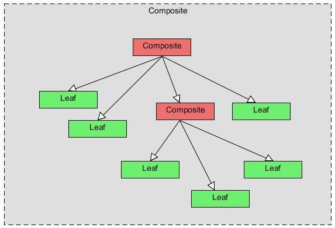

</div>

* ساختار (Structure)
    * Component (کامپوننت / رابط): یک اینترفیس یا کلاس انتزاعی که عملیات مشترک بین اشیاء ساده و پیچیده را تعریف می‌کند.
    * Leaf (برگ / جزء): نماینده اشیاء پایه‌ای و منفرد است. این اشیاء فرزندی ندارند و عملیات اصلی را انجام می‌دهند.
    * Composite (کامپوزیت / کل): نماینده اشیاء پیچیده‌ای است که می‌توانند دارای فرزند (Leaf یا Composite دیگر) باشند. این کلاس عملیات مدیریت فرزندان (افزودن، حذف، دریافت) را پیاده‌سازی می‌کند.
    * Client (کلاینت): از طریق اینترفیس Component با تمام اشیاء کار می‌کند.
* ملاحظات مهم در طراحی (Design Considerations)
    * شفافیت در برابر ایمنی (Transparency vs. Safety):
        * شفافیت: آیا متدهای مدیریت فرزندان (مثل add و remove) باید در اینترفیس پایه (Component) تعریف شوند؟ اگر بله، کلاینت می‌تواند با همه یکسان رفتار کند، اما ممکن است در زمان اجرا (Runtime) خطای UnsupportedOperation در کلاس Leaf رخ دهد.
        * ایمنی: اگر متدهای مدیریت فرزندان فقط در کلاس Composite تعریف شوند، ایمنی در زمان کامپایل (Compile-time) تضمین می‌شود، اما کلاینت باید قبل از صدا زدن متدها، نوع شیء را بررسی کند (Type Checking) که اصل OCP را نقض می‌کند. معمولاً در زبان‌هایی مثل Python یا Java، رویکرد شفافیت (تعریف در اینترفیس پایه) ترجیح داده می‌شود.
    * مدیریت حافظه و ارجاعات دوطرفه: اگر اشیاء کامپوزیت نیاز دارند به والد (Parent) خود دسترسی داشته باشند، باید مراقب حلقه‌های بی‌نهایت (Circular References) و نشت حافظه (Memory Leak) باشید.
    * بهینه‌سازی و کش کردن (Caching): اگر ساختار درختی بسیار بزرگ و پیچیده است (مثل یک سند گرافیکی سنگین)، محاسبه مکرر عملیات روی کل درخت می‌تواند پرهزینه باشد. استفاده از الگوی Visitor یا کش کردن نتایج می‌تواند راهگشا باشد.
    * مرتب‌سازی فرزندان: اگر ترتیب قرارگیری فرزندان اهمیت دارد، باید از ساختارهای داده‌ای مرتب (مثل List) به جای مجموعه‌های نامرتب (مثل Set) استفاده کنید.
* مزایا: رعایت اصل Single Responsibility (منطق درخت در یک جا قرار می‌گیرد)، رعایت اصل Open/Closed (بدون تغییر کد کلاینت می‌توان کامپوزیت‌های جدید ساخت)، و ساده‌سازی کد کلاینت با استفاده از پلی‌مورفیسم.
* معایب: محدود کردن نوع کامپوننت‌ها دشوار می‌شود (مثلاً اگر بخواهید کامپوزیت فقط اشیاء خاصی را بپذیرد، طراحی پیچیده می‌شود).

<div style="display: flex; flex-direction: column; align-items: center;">


</div>

* ۵ مورد از مهم‌ترین کاربردهای آن عبارتند از:
    * فریم‌ورک‌های رابط کاربری گرافیکی (GUI Frameworks):در کتابخانه‌هایی مثل React، Angular، یا فریم‌ورک‌های دسکتاپ مثل JavaFX و WPF، کامپوننت‌های UI (مثل دکمه، تکست‌باکس) برگ‌ها هستند و کانتینرها (مثل Div، Panel، Window) کامپوزیت‌ها هستند. رندر کردن صفحه با یک الگوریتم یکسان (بازگشتی) روی کل درخت DOM انجام می‌شود.
    * سیستم‌های گرافیکی و طراحی (Graphics & Drawing Applications): در نرم‌افزارهایی مثل Photoshop یا فرمت‌های برداری مثل SVG، اشکال ساده (خط، دایره) برگ‌ها هستند و گروه‌بندی اشکال (Group/Layers) کامپوزیت‌ها هستند. اعمال یک فیلتر یا تغییر مقیاس (Scale) روی یک گروه، به صورت خودکار روی تمام اعضای آن گروه اعمال می‌شود.
    * سیستم‌های سازمانی و منابع انسانی (HR & Organizational Structures):برای مدل‌سازی ساختار شرکت‌ها. کارمندان عادی (Leaf) و مدیران/دپارتمان‌ها (Composite) که شامل چندین کارمند یا زیردپارتمان هستند. محاسبه حقوق و دستمزد کل شرکت یا یک دپارتمان خاص با جمع زدن بازگشتی حقوق اعضای آن انجام می‌شود.
    * پلتفرم‌های تجارت الکترونیک و سبد خرید (E-commerce & Shopping Carts): مدیریت محصولات و پکیج‌ها. یک محصول تکی (Leaf) قیمت مشخصی دارد، اما یک "پکیج تخفیف‌دار" یا "باندل" (Composite) شامل چندین محصول است. قیمت نهایی سبد خرید با پیمایش درختی محاسبه می‌شود.
    * پارسرهای کامپایلر و ساختار اسناد (Compilers & Document Parsers):در طراحی کامپایلرها، کد منبع به یک درخت نحو (Abstract Syntax Tree - AST) تبدیل می‌شود. گره‌های برگ (مثل متغیرها و عملگرهای ساده) و گره‌های کامپوزیت (مثل حلقه‌ها، شرط‌ها و بلوک‌های کد که شامل گره‌های دیگر هستند) با استفاده از الگوی کامپوزیت مدیریت و پیمایش می‌شوند.

## 18.1. 🅱️ Examples1: سیستم منوی سلسله‌مراتبی (درختی)

هدف این کد این است که به کلاینت اجازه دهد بدون نیاز به بررسی نوع شیء (اینکه آیا با یک آیتم ساده طرف است یا یک زیرمنوی تو در تو)، با همه آن‌ها به یک شکل رفتار کند. این کار از طریق متد مشترک show_details انجام می‌شود که در کلاس‌های برگ (Leaf) فقط خودش را چاپ می‌کند، اما در کلاس کامپوزیت (Composite) به صورت بازگشتی (Recursive) تمام فرزندان خود را نیز
نمایش می‌دهد.

```python
from abc import ABC, abstractmethod


# ==========================================
# ۱. کامپوننت (Component)
# ==========================================
class Component(ABC):
    """
    رابط پایه (Interface) برای تمام اشیاء در ساختار کامپوزیت.
    این کلاس انتزاعی تضمین می‌کند که هم اشیاء ساده (Leaf) و هم اشیاء پیچیده (Composite)
    دارای یک متد مشترک برای نمایش جزئیات هستند.
    """

    @abstractmethod
    def show_details(self) -> None:
        """
        متد انتزاعی برای نمایش جزئیات.
        تمام کلاس‌های فرزند ملزم به پیاده‌سازی این متد هستند.
        """
        raise NotImplementedError


# ==========================================
# ۲. برگ (Leaf)
# ==========================================
class LeafElement(Component):
    """
    نماینده اشیاء پایه‌ای و منفرد (برگ‌های درخت).
    این اشیاء هیچ فرزند دیگری ندارند و فقط عملیات اصلی خود را انجام می‌دهند.
    """

    def __init__(self, position: str) -> None:
        self.position = position

    def show_details(self) -> None:
        """
        نمایش نام آیتم. 
        چون این یک برگ است، فقط نام خودش را با یک تورفتگی (Tab) چاپ می‌کند.
        """
        print('\t', end='')
        print(self.position)


# ==========================================
# ۳. کامپوزیت (Composite)
# ==========================================
class CompositeElement(Component):
    """
    نماینده اشیاء پیچیده (گره‌های درخت).
    این اشیاء می‌توانند دارای فرزند باشند (که فرزند می‌تواند Leaf یا Composite دیگری باشد).
    """

    def __init__(self, position: str) -> None:
        self.position = position
        # لیستی برای نگهداری اشیاء فرزند (رابط Component باعث می‌شود هر دو نوع Leaf و Composite اینجا ذخیره شوند)
        self.children: list[Component] = []

    def add(self, component: Component) -> None:
        """افزودن یک کامپوننت (فرزند) به ساختار درختی"""
        self.children.append(component)

    def remove(self, component: Component) -> None:
        """حذف یک کامپوننت از ساختار درختی"""
        self.children.remove(component)

    def show_details(self) -> None:
        """
        نمایش نام کامپوزیت و سپس پیمایش بازگشتی روی تمام فرزندان.
        این همان نقطه قوت الگوی کامپوزیت است: کلاینت فقط یک بار این متد را صدا می‌زند،
        اما کامپوزیت به صورت خودکار و بازگشتی کل زیردرخت را نمایش می‌دهد.
        """
        print(self.position)
        for child in self.children:
            # اضافه کردن تورفتگی برای نمایش بصری ساختار درختی (Hierarchy)
            print('\t', end='')
            # فراخوانی متد show_details روی فرزند (استفاده از پلی‌مورفیسم)
            child.show_details()


# ==========================================
# بخش کلاینت (Client) و اجرای برنامه
# ==========================================
if __name__ == '__main__':
    # ایجاد ریشه منو (یک کامپوزیت سطح بالا)
    top_level_menu = CompositeElement('main menu')

    # ایجاد زیرمنوها (کامپوزیت‌های سطح میانی)
    sub_menu_1 = CompositeElement('sub menu 1')
    sub_menu_2 = CompositeElement('sub menu 2')

    # ایجاد آیتم‌های نهایی منو (برگ‌های سطح پایین)
    sub_menu_11 = LeafElement('sub menu 11')
    sub_menu_12 = LeafElement('sub menu 12')
    sub_menu_21 = LeafElement('sub menu 21')
    sub_menu_22 = LeafElement('sub menu 22')

    # ساختاردهی به زیرمنوی اول (اتصال برگ‌ها به کامپوزیت)
    sub_menu_1.add(sub_menu_11)
    sub_menu_1.add(sub_menu_12)

    # ساختاردهی به زیرمنوی دوم
    sub_menu_2.add(sub_menu_21)
    sub_menu_2.add(sub_menu_22)

    # ساختاردهی به منوی اصلی (اتصال کامپوزیت‌های میانی به کامپوزیت ریشه)
    top_level_menu.add(sub_menu_1)
    top_level_menu.add(sub_menu_2)

    # فراخوانی متد روی ریشه. 
    # توجه کنید که کلاینت نیازی به دانستن نوع اشیاء داخلی ندارد و کل درخت به صورت یکپارچه چاپ می‌شود.
    top_level_menu.show_details()
```

## 18.2. 🅱️ Examples2:

این اسکریپت قصد دارد یک سیستم گرافیکی دوبعدی (مانند یک ویرایشگر ساده تصاویر یا رندرر SVG) را مدل‌سازی کند. در چنین سیستم‌هایی، ما اشکال هندسی پایه (مثل دایره و مربع) داریم و همچنین می‌توانیم چندین شکل را در یک «گروه» (Group) قرار دهیم. هدف اصلی این کد این است که به ما اجازه دهد یک «گروه» از اشکال را دقیقاً مثل یک «شکل تکی» در نظر بگیریم. وقتی به یک
گروه دستور render (رندر/نمایش) یا move (جابجایی) می‌دهیم، گروه به صورت خودکار و بازگشتی این دستور را به تمام اعضای داخلی خود منتقل می‌کند. به این ترتیب، کلاینت (کسی که کد را صدا می‌زند) نیازی ندارد بداند آیا دارد با یک شکل تکی کار می‌کند یا یک گروه تو در تو از شکل‌ها؛ او فقط متد را صدا می‌زند و بقیه کارها به صورت یکپارچه انجام می‌شود.

```python
from abc import ABC, abstractmethod


# region component interface

class Graphic(ABC):
    """
    رابط پایه (Component Interface) برای تمام اشیاء گرافیکی.
    این کلاس انتزاعی تضمین می‌کند که هم اشکال ساده (Leaf) و هم گروه‌ها (Composite)
    دارای متدهای مشترک برای رندر شدن و جابجایی هستند.
    """

    @abstractmethod
    def render(self) -> None:
        """
        متد انتزاعی برای رندر (نمایش) شکل.
        """
        raise NotImplementedError

    @abstractmethod
    def move(self, x: int, y: int) -> None:
        """
        متد انتزاعی برای جابجایی شکل به مختصات جدید یا به اندازه مشخص.
        """
        raise NotImplementedError


# endregion

# region Leaf classes

class Circle(Graphic):
    """
    کلاس برگ (Leaf) برای شکل دایره.
    این کلاس هیچ فرزند یا شکل دیگری درون خود ندارد و فقط رفتارهای مختص به دایره را پیاده‌سازی می‌کند.
    """

    def __init__(self, x: int, y: int, radius: int) -> None:
        self.x = x
        self.y = y
        self.radius = radius

    def render(self) -> None:
        """رندر کردن دایره با چاپ مختصات و شعاع آن."""
        print(f'Rendering Circle at ({self.x}, {self.y}) with radius {self.radius}')

    def move(self, x: int, y: int) -> None:
        """جابجایی دایره به اندازه x و y داده شده."""
        self.x += x
        self.y += y
        print(f'Circle moved to ({self.x}, {self.y})')


class Square(Graphic):
    """
    کلاس برگ (Leaf) برای شکل مربع.
    مشابه دایره، این کلاس نیز یک شیء پایه‌ای بدون فرزند است.
    """

    def __init__(self, x: int, y: int, side: int) -> None:
        self.x = x
        self.y = y
        self.side = side

    def render(self) -> None:
        """رندر کردن مربع با چاپ مختصات و طول ضلع آن."""
        print(f'Rendering Square at ({self.x}, {self.y}) with side {self.side}')

    def move(self, x: int, y: int) -> None:
        """جابجایی مربع به اندازه x و y داده شده."""
        self.x += x
        self.y += y
        print(f'Square moved to ({self.x}, {self.y})')


# endregion

# region Composite classes

class Group(Graphic):
    """
    کلاس کامپوزیت (Composite) برای گروه‌بندی اشکال.
    این کلاس می‌تواند شامل اشکال ساده (Leaf) یا گروه‌های دیگر (Composite) باشد.
    """

    def __init__(self, name: str) -> None:
        self.name = name
        # لیستی برای نگهداری اشیاء گرافیکی (هم شکل‌های ساده و هم گروه‌های دیگر)
        self.graphics: list[Graphic] = []

    def add(self, graphic: Graphic) -> None:
        """افزودن یک شیء گرافیکی (فرزند) به این گروه."""
        self.graphics.append(graphic)

    def remove(self, graphic: Graphic) -> None:
        """حذف یک شیء گرافیکی از این گروه."""
        self.graphics.remove(graphic)

    def render(self) -> None:
        """
        رندر کردن گروه.
        این متد ابتدا نام گروه را چاپ کرده و سپس به صورت بازگشتی (تفویضی) 
        متد render را روی تمام فرزندان خود فراخوانی می‌کند.
        """
        print(f'\nRendering Group {self.name}')
        for graphic in self.graphics:
            # استفاده از پلی‌مورفیسم: نیازی به بررسی نوع graphic نیست
            graphic.render()

    def move(self, x: int, y: int) -> None:
        """
        جابجایی گروه.
        این متد مختصات جابجایی را به تمام اعضای گروه منتقل می‌کند تا آن‌ها نیز جابجا شوند.
        این همان قابلیت کلیدی کامپوزیت است: جابجایی یک گروه = جابجایی تمام اعضای آن.
        """
        print(f'\nMoving Group {self.name} by ({x}, {y})')
        for graphic in self.graphics:
            # تفویض دستور move به تک‌تک فرزندان
            graphic.move(x, y)


# endregion

# region client

if __name__ == '__main__':
    # ۱. ایجاد اشکال ساده (برگ‌ها / Leaves)
    circle_1 = Circle(5, 5, 5)
    circle_2 = Circle(12, 8, 9)
    square_1 = Square(2, 6, 5)
    square_2 = Square(4, 7, 6)

    # ۲. ایجاد یک گروه (کامپوزیت / Composite)
    group_1 = Group('First Group')

    # ۳. افزودن اشکال به گروه (ساخت درخت جزء-کل)
    group_1.add(circle_1)
    group_1.add(circle_2)
    group_1.add(square_1)
    group_1.add(square_2)

    # ۴. استفاده یکپارچه از کامپوزیت
    # کلاینت فقط با یک شیء (group_1) کار می‌کند، اما این دستور روی ۴ شکل داخلی اعمال می‌شود.
    group_1.render()

    # جابجایی کل گروه؛ تمام اشکال درون گروه به اندازه (1, 2) جابجا خواهند شد.
    group_1.move(1, 2)

# endregion
```

## 18.3. 🅱️ Examples3:

# 19. 🅰️ Structural.Facade(قرار دادن چندین سرویس در کنار هم و در یک سرویس جداگانه توسط متدهای جداگانه از این سرویس‌ها استفاده کنیم)

* برای ساده‌سازی رابط کاربری برای سیستم‌های پیچیده استفاده می‌شود
* هدف و تعریف (Intent):الگوی Facade هدفش این است که یک رابط واحد و سطح بالا (High-level Interface) برای یک مجموعه از رابط‌ها در یک زیرسیستم (Subsystem) فراهم کند. این الگو یک رابط یکپارچه تعریف می‌کند که استفاده از زیرسیستم را بسیار آسان‌تر می‌کند و از پیچیدگی‌های داخلی آن برای کلاینت چشم‌پوشی می‌کند.
* ساختار (Structure)
    * این الگو معمولاً از ۳ بخش اصلی تشکیل شده است:
    * Subsystem (زیرسیستم‌ها): کلاس‌های پیچیده‌ای که منطق اصلی کار را انجام می‌دهند. کلاینت به صورت مستقیم با این‌ها کار نمی‌کند.
    * Facade (نما): یک کلاس ساده که می‌داند کدام کلاس‌های زیرسیستم برای انجام یک درخواست خاص باید فراخوانی شوند. این کلاس درخواست کلاینت را به اشیاء مناسب در زیرسیستم تفویض (Delegate) می‌کند.
    * Client (کلاینت): فقط با کلاس Facade ارتباط برقرار می‌کند و نیازی به شناخت زیرسیستم‌ها ندارد.
* ملاحظات مهم در طراحی (Design Considerations)
    * کاهش کوپلینگ (Coupling): هدف اصلی Facade کاهش وابستگی کلاینت به زیرسیستم است. کلاینت نباید مستقیماً به کلاس‌های داخلی زیرسیستم ارجاع (Reference) داشته باشد.
    * اصل Tell, Don't Ask (قانون دمیتر): Facade به ما کمک می‌کند تا از نقض قانون دمیتر جلوگیری کنیم. به جای اینکه کلاینت اشیاء زیرسیستم را بگیرد، وضعیت آن‌ها را بپرسد و سپس متدی را صدا بزند، فقط به Facade می‌گوید "چه کاری" انجام دهد.
    * عدم قرار دادن منطق تجاری (No Business Logic): کلاس Facade نباید حاوی منطق تجاری (Business Logic) یا قوانین پیچیده باشد. وظیفه آن فقط مسیریابی (Routing) و هماهنگی (Orchestration) بین زیرسیستم‌هاست. اگر Facade بزرگ و پیچیده شد، یعنی جای منطق تجاری در زیرسیستم‌ها خالی است.
    * تزریق وابستگی (Dependency Injection): بهتر است اشیاء زیرسیستم را از طریق Constructor به Facade تزریق کنید (به جای اینکه آن‌ها را درون Facade با new بسازید). این کار تست‌پذیری (Testability) را به شدت افزایش می‌دهد.
    * معماری لایه‌ای (Layered Architecture): در معماری‌های چندلایه، از Facade برای تعریف نقاط ورود (Entry Points) هر لایه استفاده می‌شود. مثلاً لایه Service می‌تواند به عنوان Facade برای لایه Repository عمل کند تا لایه Controller با جزئیات دیتابیس درگیر نشود.
    * مدیریت Facade های بزرگ: اگر یک کلاس Facade بیش از حد بزرگ شد و به اصطلاح "God Object" گردید، باید آن را به چندین Facade کوچکتر با مسئولیت‌های مجزا (مثلاً OrderFacade, PaymentFacade) تقسیم کنید.
* ۵ مورد از مهم‌ترین کاربردهای آن عبارتند از:
    * درگاه‌های پرداخت و سیستم‌های مالی (Payment Gateways):وقتی یک فروشگاه می‌خواهد از چندین درگاه پرداخت (زرین‌پال، پی‌پال، استرایپ و...) استفاده کند، به جای اینکه کد کلاینت را با APIهای متفاوت هر کدام درگیر کند، یک PaymentFacade می‌نویسد که یک متد pay() واحد دارد و در داخل، درخواست را به درگاه مناسب مسیریابی می‌کند.
    * لایه سرویس در معماری چندلایه (Service Layer in Layered Architecture): در بک‌اند (مثل Spring Boot یا Django)، کلاس‌های Service دقیقاً نقش Facade را برای لایه Repository/DAO بازی می‌کنند. آن‌ها کوئری‌های پیچیده دیتابیس، کش کردن (Redis) و اعتبارسنجی را پشت یک متد ساده مثل getUserProfile() پنهان می‌کنند تا Controllerها تمیز بمانند.
    * سیستم‌های هوشمند ساختمان و IoT (Smart Home / IoT): اپلیکیشن‌های موبایلی که خانه هوشمند را کنترل می‌کنند، از Facade استفاده می‌کنند. وقتی کاربر دکمه "حالت خواب" (Sleep Mode) را می‌زند، Facade به صورت همزمان قفل‌ها را چک می‌کند، ترموستات را تنظیم می‌کند و چراغ‌ها را خاموش می‌کند.
    * کتابخانه‌های ارتباط با سرویس‌های ابری (Cloud SDKs): SDKهای مربوط به AWS یا Azure بسیار پیچیده هستند. فریم‌ورک‌هایی مثل Terraform یا Serverless Framework از الگوی Facade استفاده می‌کنند تا APIهای پیچیده و تو در تو (Nested) این سرویس‌ها را به دستورات ساده‌ای مثل deploy() یا provision() تبدیل کنند.
    * یکپارچه‌سازی APIهای شخص ثالث (Third-Party API Wrappers): وقتی سیستم شما نیاز به دریافت اطلاعات از APIهای خارجی (مثل APIهای هواشناسی، نقشه‌ها یا شبکه‌های اجتماعی) دارد، به جای پراکنده کردن کدهای HTTP Request و مدیریت Tokenها در کل پروژه، یک WeatherFacade یا SocialMediaFacade می‌سازید که متدهایی مثل get_current_weather() دارد و تمام پیچیدگی‌های
      REST/GraphQL را در داخل خود مدیریت می‌کند.

  <div style="display: flex; flex-direction: column; align-items: center;">

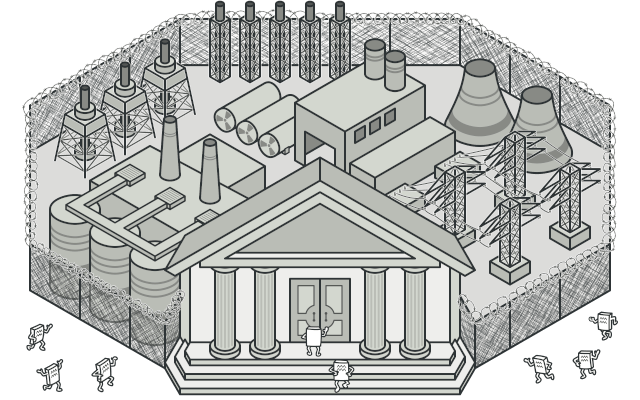

</div>

## 19.1. 🅱️ Examples1:

کاربر تنها کافی‌ست یک متد (place_order) را صدا بزند، بدون اینکه نیاز به تعامل مستقیم با سیستم‌های زیرساختی داشته باشد،درحالی‌که پشت‌صحنه چهار سیستم مختلف (موجودی، پرداخت، حمل‌ونقل، اطلاع‌رسانی) کار می‌کنند.

| مرحله | نام سیستم          | کار انجام‌شده      |
|-------|--------------------|--------------------|
| 1️⃣   | InventorySystem    | بررسی موجودی محصول |
| 2️⃣   | PaymentSystem      | پردخت هزینه        |
| 3️⃣   | ShippingSystem     | برنامه‌ریزی تحویل  |
| 4️⃣   | NotificationSystem | ارسال ایمیل تأیید  |

```python
"""
سیستم سفارش با استفاده از Facade Pattern
این ماژول چندین سیستم را در یک رابط ساده یکپارچه می‌کند
"""

from typing import Dict, Any, Optional


class InventorySystem:
    """
    سیستم مدیریت موجودی - بررسی در دسترس بودن محصولات
    
    مسئولیت‌ها:
        - تأیید موجودی محصول
        - بررسی کمیت درخواستی
    """

    def check_availability(self, product_id: int, quantity: int) -> bool:
        """
        موجودی محصول را بررسی می‌کند
        
        Args:
            product_id (int): شناسه محصول
            quantity (int): تعداد درخواستی
            
        Returns:
            bool: True اگر موجود باشد، False در غیر این صورت
        """
        print(f"Checking availability for product {product_id}, quantity {quantity}")
        return True


class PaymentSystem:
    """
    سیستم پردخت - پردخت هزینه سفارش
    
    مسئولیت‌ها:
        - پردخت رقم سفارش
        - اعتبارسنجی اطلاعات کارت
    """

    def process_payment(self, payment_details: Dict[str, Any], amount: float) -> bool:
        """
        پردخت را انجام می‌دهد
        
        Args:
            payment_details (Dict[str, Any]): جزئیات پرداخت (مثلاً اطلاعات کارت)
            amount (float): مبلغ سفارش
            
        Returns:
            bool: True اگر پردخت موفق باشد
        """
        print(f'Processing payment of ${amount:.2f}')
        return True


class ShippingSystem:
    """
    سیستم حمل‌ونقل - برنامه‌ریزی تحویل
    
    مسئولیت‌ها:
        - تعیین زمان و مسیر تحویل
        - ایجاد شماره پیگیری
    """

    def schedule_delivery(self, product_id: int, quantity: int, address: str) -> str:
        """
        تحویل محصول را برنامه‌ریزی می‌کند
        
        Args:
            product_id (int): شناسه محصول
            quantity (int): تعداد
            address (str): آدرس تحویل
            
        Returns:
            str: شماره پیگیری
        """
        print(f'Scheduling delivery for product {product_id}, quantity {quantity}, address: {address}')
        return 'TRACK_123456'


class NotificationSystem:
    """
    سیستم اطلاع‌رسانی - ارسال تأیید سفارش
    
    مسئولیت‌ها:
        - ارسال ایمیل تأیید
        - اطلاع‌رسانی به مشتری
    """

    def send_confirmation(self, email: str, order_details: Dict[str, Any]) -> None:
        """
        ایمیل تأیید سفارش را ارسال می‌کند
        
        Args:
            email (str): آدرس ایمیل مشتری
            order_details (Dict[str, Any]): جزئیات سفارش
            
        Returns:
            None
        """
        print(f'Sending confirmation to {email}')
        print(f'Order details: {order_details}')


class OrderFacade:
    """
    Facade - واسط یکپارچه برای سفارش‌دهی
    
    این کلاس تمام سیستم‌ها را مدیریت می‌کند و رابط ساده‌ای را برای کاربر فراهم می‌کند.
    کاربر فقط با یک متد (place_order) تعامل دارد.
    
    مسئولیت‌ها:
        - ایجاد و ذخیره نمونه‌های سیستم‌های مختلف
        - هماهنگ‌سازی فرآیند سفارش‌دهی
        - مدیریت خطاها
    """

    def __init__(self) -> None:
        """
        سیستم‌های مختلف را مقدار‌دهی می‌کند
        """
        self.inventory_system: InventorySystem = InventorySystem()
        self.payment_system: PaymentSystem = PaymentSystem()
        self.shipping_system: ShippingSystem = ShippingSystem()
        self.notification_system: NotificationSystem = NotificationSystem()

    def place_order(self, product_id: int, quantity: int, payment_details: Dict[str, Any], email: str, shipping_address: str) -> str:
        """
        سفارش را از ابتدا تا انتها انجام می‌دهد
        
        مراحل:
            1. بررسی موجودی محصول
            2. پردخت هزینه سفارش
            3. برنامه‌ریزی تحویل
            4. ارسال ایمیل تأیید
        
        Args:
            product_id (int): شناسه محصول
            quantity (int): تعداد درخواستی
            payment_details (Dict[str, Any]): جزئیات پرداخت
            email (str): ایمیل مشتری
            shipping_address (str): آدرس تحویل
            
        Returns:
            str: شماره پیگیری سفارش
            
        Raises:
            Exception: اگر موجودی یا پردخت ناموفق باشد
        """
        print('=== starting order processing ===')

        # مرحله 1: بررسی موجودی
        if not self.inventory_system.check_availability(product_id, quantity):
            raise Exception('Product not available')

        # مرحله 2: محاسبه و پردخت (قیمت: 20 برای هر واحد)
        amount: float = quantity * 20
        if not self.payment_system.process_payment(payment_details, amount):
            raise Exception('Payment failed')

        # مرحله 3: برنامه‌ریزی تحویل
        tracking_number: str = self.shipping_system.schedule_delivery(product_id, quantity, shipping_address)

        # مرحله 4: ارسال تأیید
        order_details: Dict[str, Any] = {'product_id': product_id,
                                         'quantity': quantity,
                                         'amount': amount,
                                         'tracking_number': tracking_number}
        self.notification_system.send_confirmation(email, order_details)

        print('\n=== order processed successfully ===')
        return tracking_number


if __name__ == '__main__':
    # ایجاد نمونه از Facade
    order_facade: OrderFacade = OrderFacade()

    try:
        # سفارش را ثبت می‌کنیم
        tracking_num: str = order_facade.place_order(product_id='product-12345',
                                                     quantity=10,
                                                     payment_details={'card': '1111-1111-1111-1111'},
                                                     email='test@gmail.com',
                                                     shipping_address='Tehran - Shariati')
        print(f'Your tracking number is {tracking_num}')

    except Exception as e:
        # خطاهای احتمالی را مدیریت می‌کنیم
        print(f'Order failed: {str(e)}')

```

## 19.2. 🅱️ Examples2:  احراز هویت و ثبت‌نام کاربران

| سرویس                     | عملکرد                                          |
|---------------------------|-------------------------------------------------|
| **UserService**           | مدیریت کاربران (بررسی منحصربه‌فرد بودن و ایجاد) |
| **PasswordHasherService** | رمزگذاری و تایید رمز عبور                       |
| **EmailService**          | ارسال ایمیل‌های فعال‌سازی                       |
| **AuthService**           | هماهنگی تمام سرویس‌ها برای انجام ثبت‌نام کامل   |

```python
import uuid
from typing import Any


class UserService:
    """
    سرویس مدیریت کاربران.
    
    این کلاس مسئول انجام عملیات مرتبط با کاربران مانند بررسی منحصربه‌فرد بودن
    و ایجاد کاربر جدید است.
    """

    def check_user_is_unique(self, email: str) -> bool:
        """
        بررسی می‌کند که آیا ایمیل وارد شده در سیستم منحصربه‌فرد است یا خیر.
        
        Args:
            email (str): ایمیل کاربری که باید بررسی شود
            
        Returns:
            bool: True اگر ایمیل منحصربه‌فرد باشد، False در غیر این صورت
        """
        print(f'checking that user is unique with email: {email}')
        return True

    def create_user(self, email: str, hashed_password: str) -> bool:
        """
        یک کاربر جدید در سیستم ایجاد می‌کند.
        
        Args:
            email (str): ایمیل کاربر جدید
            hashed_password (str): رمز عبور هش‌شده کاربر
            
        Returns:
            bool: True اگر کاربر با موفقیت ایجاد شود، False در غیر این صورت
        """
        print(f'creating user with email: {email} and hashed password: {hashed_password}')
        return True


class PasswordHasherService:
    """
    سرویس رمزگذاری و تایید رمز عبور.
    
    این کلاس مسئول تبدیل رمز عبور به فرم هش‌شده و تایید صحت رمز عبور است.
    """

    def encrypt_password(self, password: str) -> str:
        """
        رمز عبور را هش می‌کند و یک رشته هش‌شده برمی‌گرداند.
        
        Args:
            password (str): رمز عبور اصلی (بدون هش)
            
        Returns:
            str: رمز عبور هش‌شده
        """
        print(f'hashing password: {password}')
        return str(uuid.uuid4())

    def verify_password(self, password: str, hashed_password: str) -> bool:
        """
        تایید می‌کند که رمز عبور وارد شده با رمز هش‌شده ذخیره‌شده برابر است یا خیر.
        
        Args:
            password (str): رمز عبور وارد شده توسط کاربر
            hashed_password (str): رمز عبور هش‌شده ذخیره‌شده در پایگاه داده
            
        Returns:
            bool: True اگر رمز عبور صحیح باشد، False در غیر این صورت
        """
        print(f'verifying password: {password}')
        return True


class EmailService:
    """
    سرویس ارسال ایمیل.
    
    این کلاس مسئول ارسال ایمیل‌های مختلف (مثل فعال‌سازی حساب) است.
    """

    def send_activation_email(self, email: str) -> bool:
        """
        ایمیل فعال‌سازی حساب را برای کاربر می‌فرستد.
        
        Args:
            email (str): آدرس ایمیل کاربری که ایمیل فعال‌سازی برای آن ارسال شود
            
        Returns:
            bool: True اگر ایمیل با موفقیت ارسال شود، False در غیر این صورت
        """
        print(f'sending activation email: {email}')
        return True


class AuthService:
    """
    سرویس احراز هویت.
    
    این کلاس کامل‌ترین سرویس است که فرآیند ثبت‌نام را مدیریت می‌کند.
    از سه سرویس دیگر (UserService, PasswordHasherService, EmailService) استفاده می‌کند.
    """

    def __init__(self):
        """
        AuthService را مقداردهی اولیه می‌کند و تمام سرویس‌های مورد نیاز را ایجاد می‌کند.
        """
        self.user_service = UserService()
        self.password_hasher = PasswordHasherService()
        self.email_service = EmailService()

    def register_user(self, email: str, password: str) -> bool:
        """
        یک کاربر جدید را در سیستم ثبت‌نام می‌کند.
        
        مراحل ثبت‌نام:
        1. بررسی منحصربه‌فرد بودن ایمیل
        2. هش کردن رمز عبور
        3. ایجاد کاربر در پایگاه داده
        4. ارسال ایمیل فعال‌سازی
        
        Args:
            email (str): ایمیل کاربر جدید
            password (str): رمز عبور کاربر جدید (بدون هش)
            
        Returns:
            bool: True اگر ثبت‌نام موفق باشد، False اگر ایمیل تکراری باشد
        """
        # بررسی منحصربه‌فرد بودن ایمیل
        if self.user_service.check_user_is_unique(email):
            # هش کردن رمز عبور برای ذخیره‌سازی امن
            hashed_password = self.password_hasher.encrypt_password(password)

            # ایجاد کاربر جدید در پایگاه داده
            user_created = self.user_service.create_user(email, hashed_password)

            # ارسال ایمیل فعال‌سازی
            self.email_service.send_activation_email(email)

            return True

        # اگر ایمیل تکراری باشد، False برمی‌گرداند
        return False


if __name__ == '__main__':
    # ایجاد نمونه‌ای از AuthService
    auth = AuthService()

    # تست ثبت‌نام کاربر جدید
    auth.register_user('test@test.com', '123456')

```

## 19.3. 🅱️ Examples3: Home Theater

سیستم سینمای خانگی: در این مثال، روشن کردن یک فیلم شامل روشن کردن پروژکتور، تنظیم صدا، کم کردن نور و روشن کردن دستگاه DVD است. به جای اینکه کاربر درگیر این مراحل شود، از یک Facade استفاده می‌کنیم.

```python
# ==========================================
# زیرسیستم‌ها (Subsystem Classes)
# ==========================================

class Projector:
    """کلاس زیرسیستم: پروژکتور"""

    def on(self) -> None:
        print("  [پروژکتور] روشن شد.")

    def off(self) -> None:
        print("  [پروژکتور] خاموش شد.")


class SoundSystem:
    """کلاس زیرسیستم: سیستم صوتی"""

    def set_volume(self, level: int) -> None:
        print(f"  [سیستم صوتی] ولوم روی {level} تنظیم شد.")


class Lights:
    """کلاس زیرسیستم: نورپردازی"""

    def dim(self, level: int) -> None:
        print(f"  [نورپردازی] شدت نور به {level} درصد کاهش یافت.")


class DvdPlayer:
    """کلاس زیرسیستم: پخش‌کننده DVD"""

    def play(self, movie: str) -> None:
        print(f"  [DVD] در حال پخش فیلم: {movie}")


# ==========================================
# کلاس نما (Facade)
# ==========================================

class HomeTheaterFacade:
    """
    کلاس Facade که یک رابط ساده برای تماشای فیلم فراهم می‌کند.
    این کلاس منطق تجاری ندارد و فقط زیرسیستم‌ها را هماهنگ می‌کند.
    """

    def __init__(self, projector: Projector, sound: SoundSystem, lights: Lights, dvd: DvdPlayer) -> None:
        # تزریق وابستگی‌ها از طریق Constructor
        self._projector = projector
        self._sound = sound
        self._lights = lights
        self._dvd = dvd

    def watch_movie(self, movie: str) -> None:
        """هماهنگی زیرسیستم‌ها برای شروع تماشای فیلم"""
        print("\n🎬 آماده‌سازی برای تماشای فیلم...")
        self._lights.dim(20)  # کم کردن نور
        self._projector.on()  # روشن کردن پروژکتور
        self._sound.set_volume(15)  # تنظیم ولوم
        self._dvd.play(movie)  # پخش فیلم
        print("🎬 لذت ببرید!\n")

    def end_movie(self) -> None:
        """هماهنگی زیرسیستم‌ها برای پایان تماشای فیلم"""
        print("\n🛑 در حال پایان دادن به تماشای فیلم...")
        self._lights.dim(100)  # روشن کردن کامل نور
        self._projector.off()  # خاموش کردن پروژکتور
        print("🛑 سیستم خاموش شد.\n")


# ==========================================
# بخش کلاینت (Client)
# ==========================================

if __name__ == "__main__":
    # ۱. ایجاد اشیاء زیرسیستم
    my_projector = Projector()
    my_sound = SoundSystem()
    my_lights = Lights()
    my_dvd = DvdPlayer()

    # ۲. ایجاد شیء Facade و تزریق زیرسیستم‌ها به آن
    home_theater = HomeTheaterFacade(my_projector, my_sound, my_lights, my_dvd)

    # ۳. کلاینت فقط با Facade کار می‌کند و از پیچیدگی زیرسیستم‌ها بی‌خبر است
    home_theater.watch_movie("Inception")
    home_theater.end_movie()
```

## 19.4. 🅱️ Examples4: E-commerce Order

پردازش سفارش در فروشگاه اینترنتی: ثبت یک سفارش شامل بررسی موجودی انبار، پردازش پرداخت، هماهنگی ارسال و ارسال نوتیفیکیشن است.

```python
from typing import Dict


# ==========================================
# زیرسیستم‌ها (Subsystem Classes)
# ==========================================

class InventorySystem:
    """زیرسیستم: بررسی و رزرو موجودی انبار"""

    def check_stock(self, product_id: str, quantity: int) -> bool:
        print(f"  [انبار] بررسی موجودی برای {quantity} عدد از محصول {product_id}...")
        return True  # فرض می‌کنیم موجود است

    def reserve(self, product_id: str, quantity: int) -> None:
        print(f"  [انبار] {quantity} عدد از محصول {product_id} رزرو شد.")


class PaymentGateway:
    """زیرسیستم: درگاه پرداخت"""

    def process_payment(self, amount: float, card_number: str) -> bool:
        print(f"  [پرداخت] پردازش مبلغ {amount} تومان با کارت {card_number}...")
        return True  # فرض می‌کنیم پرداخت موفق بوده


class ShippingService:
    """زیرسیستم: سرویس ارسال و لجستیک"""

    def arrange_shipping(self, address: str, product_id: str) -> None:
        print(f"  [ارسال] هماهنگی ارسال محصول {product_id} به آدرس: {address}")


class NotificationService:
    """زیرسیستم: ارسال پیامک/ایمیل به کاربر"""

    def send_confirmation(self, user_email: str, order_id: str) -> None:
        print(f"  [نوتیفیکیشن] ایمیل تایید سفارش {order_id} به {user_email} ارسال شد.")


# ==========================================
# کلاس نما (Facade)
# ==========================================

class OrderFacade:
    """
    کلاس Facade برای مدیریت فرآیند پیچیده ثبت سفارش.
    """

    def __init__(self, inventory: InventorySystem, payment: PaymentGateway,
                 shipping: ShippingService, notification: NotificationService) -> None:
        self._inventory = inventory
        self._payment = payment
        self._shipping = shipping
        self._notification = notification

    def place_order(self, product_id: str, quantity: int, price: float,
                    card_number: str, address: str, user_email: str) -> str:
        """
        یک متد واحد برای ثبت سفارش که تمام مراحل پیچیده پشت صحنه را مدیریت می‌کند.
        """
        print("\n🛒 شروع پردازش سفارش...")

        # ۱. بررسی و رزرو انبار
        if not self._inventory.check_stock(product_id, quantity):
            raise ValueError("موجودی کافی نیست!")
        self._inventory.reserve(product_id, quantity)

        # ۲. پردازش پرداخت
        if not self._payment.process_payment(price * quantity, card_number):
            raise ValueError("پرداخت ناموفق بود!")

        # ۳. هماهنگی ارسال
        self._shipping.arrange_shipping(address, product_id)

        # ۴. تولید شناسه سفارش (یک منطق ساده برای تولید ID)
        order_id = f"ORD-{product_id}-1024"

        # ۵. ارسال نوتیفیکیشن
        self._notification.send_confirmation(user_email, order_id)

        print(f"✅ سفارش {order_id} با موفقیت ثبت شد.\n")
        return order_id


# ==========================================
# بخش کلاینت (Client)
# ==========================================

if __name__ == "__main__":
    # ۱. ایجاد اشیاء زیرسیستم
    inv = InventorySystem()
    pay = PaymentGateway()
    ship = ShippingService()
    notif = NotificationService()

    # ۲. ایجاد Facade
    order_system = OrderFacade(inv, pay, ship, notif)

    # ۳. کلاینت فقط یک متد را با پارامترهای مشخص صدا می‌زند
    order_system.place_order(
        product_id="LAPTOP-01",
        quantity=1,
        price=45000000,
        card_number="6037-****-****-1234",
        address="تهران، خیابان آزادی، پلاک ۱۰",
        user_email="user@example.com"
    )
```

# 20. 🅰️ Structural.Decorator(افزودن قابلیت به آبجکت‌های خود در خارج از بدنه کلاس)

* افزودن قابلیت به آبجکت‌های خود در خارج از بدنه کلاس
* الحاق پویا و شفافِ مسئولیت‌های اضافی به یک شیء، بدون تغییر ساختار کلاس اصلی و بدون نیاز به زیرکلاس‌سازی (Subclassing). Decorator انعطاف‌پذیری بیشتری نسبت به وراثت ایستا (Static Inheritance) برای افزودن رفتار فراهم می‌کند.
* الگوی Decorator یک الگوی ساختاری (Structural) است که به شما اجازه می‌دهد رفتارهای جدید را به‌صورت پویا (Dynamic) و در زمان اجرا (Runtime) به یک شیء اضافه کنید، بدون آنکه ساختار کلاس اصلی تغییر کند.
* به بیان ساده‌تر: به‌جای اینکه برای هر ترکیب از قابلیت‌ها یک زیرکلاس جدید بسازید، قابلیت‌ها را مثل لایه‌های پیاز دور شیء اصلی می‌پیچید.

<div style="display: flex; flex-direction: column; align-items: center;">


</div>

## 20.1. 🅱️ اجزای ساختار

* Component
    * رابط مشترک (Abstract Base Class یا Protocol)
    * رابط مشترک (Interface یا Abstract Class) که هم برای شیء اصلی و هم برای Decoratorها تعریف می‌شود. تضمین می‌کند که Decoratorها قابل تعویض با شیء اصلی باشند (اصل Liskov Substitution).
* ConcreteComponent
    * پیاده‌سازی پایه و اصلی
    * پیاده‌سازی پایه‌ای از Component. شیئی که قرار است رفتارهای اضافی به آن الحاق شود.
* Decorator
    * کلاس پایه دکوریتورها؛ مرجع Component را نگه می‌دارد و فراخوانی را به آن ارجاع می‌دهد
    * کلاس انتزاعی که رابط Component را پیاده‌سازی می‌کند و یک مرجع (Reference) به یک شیء از نوع Component نگه می‌دارد. رفتار پیش‌فرض را به شیء داخلی واگذار (Delegate) می‌کند.
* ConcreteDecorator
    * رفتار جدید را قبل/بعد از فراخوانی مرجع اضافه می‌کند
    * پیاده‌سازی‌های مشخص Decorator که مسئولیت‌های اضافی را قبل یا بعد از فراخوانی component.operation() اضافه می‌کنند.

## 20.2. 🅱️ نحوه تعامل اجزا

```
┌──────────────────────────────────────────────┐
│  ConcreteDecoratorA                          │
│  ┌───────────────────────────────────────┐   │
│  │     ConcreteDecoratorB                │   │
│  │  ┌─────────────────────────────────┐  │   │
│  │  │       ConcreteComponent ────┐   │  │   │
│  │  │                             │   │  │   │
│  │  │          behaviorC ◀────────┘   │  │   │
│  │  │                                 │  │   │
│  │  └─────────────────────────────────┘  │   │
│  │     behaviorB ◀═════════════════      │   │
│  └───────────────────────────────────────┘   │
│  behaviorA  ◀≡≡≡≡≡≡≡≡≡≡≡≡≡≡≡≡≡≡≡≡≡≡          │
└──────────────────────────────────────────────┘
```

* Decorator درخواست‌ها را به شیء Component داخلی خود هدایت (Forward) می‌کند.
* ConcreteDecorator می‌تواند قبل یا بعد از هدایت درخواست، رفتار اضافی اجرا کند.
* کلاینت فقط با رابط Component کار می‌کند و از وجود Decoratorها بی‌خبر است.
* Decoratorها می‌توانند به‌صورت تو در تو (Nested) یکدیگر را بپیچند:
* `DecoratorA(DecoratorB(ConcreteComponent))`

```
┌──────────────────────┐
│    <<interface>>     │
│      Component       │
├──────────────────────┤
│ + operation()        │
└──────┬───────┬───────┘
       │       │
       │       │  implements
       │       ▼
       │  ┌──────────────────────┐         ┌──────────────────────┐
       │  │      Decorator       │────────▶│    <<interface>>     │
       │  ├──────────────────────┤  wraps  │      Component       │
       │  │ - component: Comp.   │         └──────────────────────┘
       │  ├──────────────────────┤
       │  │ + operation()        │
       │  └──────┬───────────────┘
       │         │  extends
  implements     ▼
       │  ┌──────────────┐  ┌──────────────┐
       │  │ ConcreteDecA │  │ ConcreteDecB │
       │  ├──────────────┤  ├──────────────┤
       │  │ + operation()│  │ + operation()│
       │  └──────────────┘  └──────────────┘
       ▼
┌──────────────────────┐
│  ConcreteComponent   │
├──────────────────────┤
│ + operation()        │
└──────────────────────┘
```

```
┌──────────────────────┐
│   Component (رابط)   │  ← انتزاع مشترک
│  + operation()       │
└──────┬───────┬───────┘
       │       │
       │       │
┌──────┴──┐ ┌──┴───────────────┐
│Concrete │ │    Decorator     │  ← پیاده‌سازی پایه + نگه‌داشتن مرجع
│Component│ │  - _component    │
│         │ │  + operation()   │
└─────────┘ └──┬───────────────┘
               │
       ┌───────┴───────┐
       │               │
┌──────┴──────┐ ┌──────┴──────┐
│ConcreteDecA │ │ConcreteDecB │  ← هر کدام یک رفتار جدید
└─────────────┘ └─────────────┘
```

## 20.3. 🅱️ موارد استفاده از این الگوی طراحی

* از Decorator استفاده کنید وقتی:
    * افزودن مسئولیت به شیء به‌صورت پویا و شفاف نیاز است؛ یعنی کلاینت نباید بداند که شیء تزئین شده است یا خیر (رابط یکسان حفظ شود).
    * مسئولیت‌ها باید قابل بازپس‌گیری (Revocable) باشند؛ یعنی بتوان تزئین را در زمان اجرا حذف کرد.
    * توسعه از طریق وراثت عملی نیست: یا به دلیل انفجار کلاس‌ها، یا به این دلیل که تعریف کلاس پنهان است (مثلاً در یک کتابخانه شخص ثالث) و نمی‌توانید آن را زیرکلاس کنید.
    * ترکیب رفتارها در زمان اجرا مورد نیاز است، نه زمان کامپایل.
* موارد کاربردی در صنعت
    * جریان‌های ورودی/خروجی (I/O Streams): در Java، کلاس‌هایی مثل BufferedInputStream، GZIPInputStream و DataInputStream همگی Decoratorهایی هستند که روی InputStream پیچیده می‌شوند: new DataInputStream(new BufferedInputStream(new FileInputStream("file"))).
        * پیچیدن لایه‌های Buffering، Compression و Encryption روی استریم‌های ورودی/خروجی (مثلاً java.io در جاوا: BufferedInputStream(new GZIPInputStream(new FileInputStream(...)))).
    * فریم‌ورک‌های وب و Middleware:در ASP.NET Core، Django Middleware و Express.js، هر لایه Middleware یک Decorator است که درخواست/پاسخ HTTP را قبل و بعد از Handler اصلی پردازش می‌کند (احراز هویت، لاگینگ، فشرده‌سازی و...).
    * سیستم‌های لاگینگ و مانیتورینگ:ابزارهایی مثل OpenTelemetry از Decorator برای افزودن Tracing، Metrics و Logging به سرویس‌ها بدون تغییر کد اصلی استفاده می‌کنند.
        * افزودن لایه‌های ثبت زمان اجرا (Timing)، شمارش فراخوانی (Metrics) و ردیابی توزیع‌شده (Tracing) به سرویس‌های میکروسرویس بدون دست‌زدن به منطق تجاری.
    * رابط‌های گرافیکی (GUI):در Java Swing و Qt، قابلیت‌هایی مثل اسکرول (JScrollPane)، حاشیه (Border) و Tooltip به کامپوننت‌ها از طریق Decorator اضافه می‌شوند.
        * افزودن حاشیه (Border)، اسکرول (Scroll)، سایه (Shadow) و انیمیشن به ویجت‌ها به‌صورت ترکیبی (مثلاً در فریمورک‌های Flutter و Qt).
    * رمزنگاری و امنیت داده:لایه‌های رمزنگاری مثل TLS/SSL روی سوکت‌های شبکه به‌صورت Decorator پیاده‌سازی می‌شوند: SSLSocket یک Socket را می‌پیچد و رمزنگاری/رمزگشایی شفاف اضافه می‌کند.
    * وب و API: افزودن لایه‌های احراز هویت (Auth)، محدودیت نرخ (Rate Limiting)، فشرده‌سازی (GZip) و CORS به هندلرهای HTTP بدون تغییر کد اصلی (مثلاً Middleware در Django/FastAPI).
    * بازی‌سازی (Game Dev): اعمال افکت‌های موقت روی شخصیت بازی مثل سرعت بیشتر، سپر دفاعی، سم و نامرئی بودن که هر کدام یک دکوریتور مستقل هستند و در زمان اجرا اضافه/حذف می‌شوند.

## 20.4. 🅱️ توضیحات تکمیلی

* مزایا
    * انعطاف‌پذیری بیشتر از وراثت:رفتارها در زمان اجرا اضافه/حذف می‌شوند.
    * جلوگیری از انفجار کلاس‌ها:n کلاس، n+1n+1n+1 کلاس کافی است.
    * رعایت اصل OCP: کلاس‌ها برای توسعه باز و برای تغییر بسته هستند.
    * رعایت اصل SRP:هر Decorator یک مسئولیت مشخص دارد.
    * شفافیت برای کلاینت:کلاینت با رابط یکسان کار می‌کند.
    * ترکیب‌پذیری:Decoratorها آزادانه ترکیب می‌شوند.
* معایب
    * اشیاء کوچک زیاد:هر Decorator یک شیء مجزاست؛ دیباگ سخت‌تر می‌شود.
    * وابستگی به ترتیب:گاهی ترتیب پیچیدن Decoratorها مهم است (مثلاً فشرده‌سازی باید قبل از رمزنگاری باشد).
    * پیچیدگی پیکربندی:ساختن شیء نهایی با چندین لایه Decorator می‌تواند کد راه‌اندازی را شلوغ کند (راه‌حل: استفاده از Factory یا Builder).
    * هویت شیء تغییر می‌کند:decorator != component؛ اگر کلاینت به هویت شیء وابسته باشد، مشکل‌ساز می‌شود.
* قاعده طلایی: Decorator زمانی درست استفاده شده که کلاینت نتواند تفاوت بین Component ساده و Component تزئین‌شده را تشخیص دهد — همه چیز از طریق یک رابط یکسان اتفاق می‌افتد.

## 20.5. 🅱️ سناریو مشکل و حل مسئله

فرض کنید یک کلاس Window دارید که عملیات پایه‌ای مثل draw() و getDescription() را ارائه می‌دهد. حالا می‌خواهید قابلیت‌هایی مثل اسکرول‌بار، حاشیه و سایه را به آن اضافه کنید.

* رویکرد نادرست: وراثت انفجاری که سبب بروز مشکلات زیر میشود:
    *     انفجار کلاس‌ها: ترکیب nnn ویژگی، 2n2^n2n کلاس تولید می‌کند.
    * عدم انعطاف: ترکیب‌ها در زمان کامپایل ثابت هستند.
    * تکرار کد: منطق اسکرول‌بار در چندین کلاس تکرار می‌شود.
    * نقض اصل OCP: برای هر ترکیب جدید باید کلاس جدید بسازید.
* راه‌حل Decorator: به جای وراثت، از ترکیب (Composition) استفاده می‌کنیم. هر قابلیت یک Decorator مستقل است که شیء اصلی را در خود می‌پیچد (Wraps) و رفتار جدید را قبل یا بعد از فراخوانی متد اصلی اضافه می‌کند.

```
Window
├── WindowWithScrollbar
├── WindowWithBorder
├── WindowWithShadow
├── WindowWithScrollbarAndBorder
├── WindowWithScrollbarAndShadow
├── WindowWithBorderAndShadow
└── WindowWithScrollbarAndBorderAndShadow  ← ۲^n کلاس!
```

## 20.6. 🅱️ Examples

### 20.6.1. ✅️ Examples1: فرمت‌دهی متن 📝

سناریو: یک ویرایشگر متن که می‌خواهد قالب‌بندی‌هایی مثل پررنگ (Bold)، کج (Italic) و زیرخط (Underline) را به‌صورت ترکیبی روی متن اعمال کند.

```python
class WrittenText:
    def __init__(self, text: str):
        self._text = text

    def render(self):
        return self._text


class ItalicWrapper(WrittenText):
    def __init__(self, wrapped: WrittenText):
        self._wrapped = wrapped

    def render(self):
        return f'<i>{self._wrapped.render()}</i>'


class BoldWrapper(WrittenText):
    def __init__(self, wrapped: WrittenText):
        self._wrapped = wrapped

    def render(self):
        return f'<b>{self._wrapped.render()}</b>'


class UnderlineWrapper(WrittenText):
    def __init__(self, wrapped: WrittenText):
        self._wrapped = wrapped

    def render(self):
        return f'<u>{self._wrapped.render()}</u>'


if __name__ == '__main__':
    my_text = WrittenText('Toplearn')
    print(my_text.render())

    italic_version = ItalicWrapper(my_text)
    print(italic_version.render())

    bold_italic_version = BoldWrapper(ItalicWrapper(WrittenText('Toplearn')))
    print(bold_italic_version.render())

    underline_bold_italic_version = UnderlineWrapper(BoldWrapper(ItalicWrapper(WrittenText('Toplearn'))))
    print(underline_bold_italic_version.render())
```

### 20.6.2. ✅️ Examples1: شکل دیگر پیاده‌سازی

```python
from abc import ABC, abstractmethod


# ──────────────────────────────────────────────
# ۱. رابط مشترک (Component)
# ──────────────────────────────────────────────
class Text(ABC):
    """رابط مشترک برای متن ساده و قالب‌بندی‌شده."""

    @abstractmethod
    def render(self) -> str:
        """متن نهایی قالب‌بندی‌شده را برمی‌گرداند."""
        ...


# ──────────────────────────────────────────────
# ۲. پیاده‌سازی پایه (ConcreteComponent)
# ──────────────────────────────────────────────
class PlainText(Text):
    """متن ساده بدون هیچ قالب‌بندی."""

    def __init__(self, content: str) -> None:
        """
        Args:
            content: محتوای متنی ساده.
        """
        self._content = content

    def render(self) -> str:
        return self._content


# ──────────────────────────────────────────────
# ۳. کلاس پایه تزئین‌کننده (Decorator)
# ──────────────────────────────────────────────
class TextDecorator(Text):
    """
    کلاس پایه برای تمام قالب‌بندی‌ها.
    متن داخلی را نگه می‌دارد و render را به آن واگذار می‌کند.
    """

    def __init__(self, text: Text) -> None:
        """
        Args:
            text: شیء متنی که قرار است قالب‌بندی شود.
        """
        self._text = text

    def render(self) -> str:
        return self._text.render()


# ──────────────────────────────────────────────
# ۴. تزئین‌کننده‌های مشخص (ConcreteDecorators)
# ──────────────────────────────────────────────
class Bold(TextDecorator):
    """قالب‌بندی پررنگ با استفاده از تگ HTML."""

    def render(self) -> str:
        # متن داخلی را render کرده و در تگ <b> می‌پیچیم
        return f"<b>{self._text.render()}</b>"


class Italic(TextDecorator):
    """قالب‌بندی کج با استفاده از تگ HTML."""

    def render(self) -> str:
        return f"<i>{self._text.render()}</i>"


class Underline(TextDecorator):
    """قالب‌بندی زیرخط با استفاده از تگ HTML."""

    def render(self) -> str:
        return f"<u>{self._text.render()}</u>"


# ──────────────────────────────────────────────
# ۵. استفاده (Client)
# ──────────────────────────────────────────────
if __name__ == "__main__":
    # متن ساده
    simple: Text = PlainText("سلام دنیا")
    print(f"ساده:   {simple.render()}")

    # متن پررنگ
    bold_text: Text = Bold(PlainText("سلام دنیا"))
    print(f"پررنگ:   {bold_text.render()}")

    # متن پررنگ + کج + زیرخط (ترکیب سه Decorator)
    fancy: Text = Underline(Italic(Bold(PlainText("سلام دنیا"))))
    print(f"ترکیبی:  {fancy.render()}")
```

```
خروجی
ساده:   سلام دنیا
پررنگ:   <b>سلام دنیا</b>
ترکیبی:  <u><i><b>سلام دنیا</b></i></u>
```

### 20.6.3. ✅️ Examples2: سیستم سفارش قهوه ☕

```python
# region Base component

class Coffee:
    def cost(self):
        return 5

    def description(self):
        return "Simple coffee"


# endregion

# region decorator

class CoffeeDecorator(Coffee):
    def __init__(self, coffe: Coffee):
        self._coffee = coffe

    def cost(self):
        return self._coffee.cost()

    def description(self):
        return self._coffee.description()


# endregion


# region concrete decorators

class Milk(CoffeeDecorator):
    def cost(self):
        return self._coffee.cost() + 2

    def description(self):
        return self._coffee.description() + ' , milk'


class Sugar(CoffeeDecorator):
    def cost(self):
        return self._coffee.cost() + 3

    def description(self):
        return self._coffee.description() + ' , sugar'


class WhippedCream(CoffeeDecorator):
    def cost(self):
        return self._coffee.cost() + 4

    def description(self):
        return self._coffee.description() + ' , whipped cream'


# endregion

# region client

if __name__ == '__main__':
    simple_coffee = Coffee()
    print(f'{simple_coffee.description()}: ${simple_coffee.cost()}')

    coffee_with_milk = Milk(simple_coffee)
    print(f'{coffee_with_milk.description()}: ${coffee_with_milk.cost()}')

    coffee_with_milk_and_sugar = Sugar(coffee_with_milk)
    print(f'{coffee_with_milk_and_sugar.description()}: ${coffee_with_milk_and_sugar.cost()}')

# endregion
```

### 20.6.4. ✅️ Examples2: سیستم سفارش قهوه به روش دوم

سناریو: یک کافی‌شاپ که قهوه پایه دارد و مشتری می‌تواند افزودنی‌هایی مثل شیر، شکر و وانیل اضافه کند. هر افزودنی قیمت و توضیحات را تغییر می‌دهد.

```python
from abc import ABC, abstractmethod


# ──────────────────────────────────────────────
# ۱. رابط مشترک (Component)
# ──────────────────────────────────────────────
class Beverage(ABC):
    """رابط مشترک برای تمام نوشیدنی‌ها و افزودنی‌ها."""

    @abstractmethod
    def get_description(self) -> str:
        """توضیحات نوشیدنی را برمی‌گرداند."""
        ...

    @abstractmethod
    def get_cost(self) -> float:
        """هزینه نوشیدنی را برمی‌گرداند."""
        ...


# ──────────────────────────────────────────────
# ۲. پیاده‌سازی پایه (ConcreteComponent)
# ──────────────────────────────────────────────
class Espresso(Beverage):
    """اسپرسو به‌عنوان نوشیدنی پایه."""

    def get_description(self) -> str:
        return "اسپرسو"

    def get_cost(self) -> float:
        return 30.0  # هزار تومان


# ──────────────────────────────────────────────
# ۳. کلاس پایه تزئین‌کننده (Decorator)
# ──────────────────────────────────────────────
class BeverageDecorator(Beverage):
    """
    کلاس پایه برای تمام افزودنی‌ها.
    یک مرجع به نوشیدنی داخلی نگه می‌دارد
    و فراخوانی‌ها را به آن واگذار می‌کند.
    """

    def __init__(self, beverage: Beverage) -> None:
        """
        Args:
            beverage: نوشیدنی‌ای که قرار است تزئین شود.
        """
        self._beverage = beverage

    def get_description(self) -> str:
        return self._beverage.get_description()

    def get_cost(self) -> float:
        return self._beverage.get_cost()


# ──────────────────────────────────────────────
# ۴. تزئین‌کننده‌های مشخص (ConcreteDecorators)
# ──────────────────────────────────────────────
class Milk(BeverageDecorator):
    """افزودنی شیر."""

    def get_description(self) -> str:
        # توضیحات شیر را به توضیحات نوشیدنی داخلی اضافه می‌کنیم
        return self._beverage.get_description() + " + شیر"

    def get_cost(self) -> float:
        # هزینه شیر را به هزینه نوشیدنی داخلی اضافه می‌کنیم
        return self._beverage.get_cost() + 5.0


class Sugar(BeverageDecorator):
    """افزودنی شکر."""

    def get_description(self) -> str:
        return self._beverage.get_description() + " + شکر"

    def get_cost(self) -> float:
        return self._beverage.get_cost() + 2.0


class Vanilla(BeverageDecorator):
    """افزودنی وانیل."""

    def get_description(self) -> str:
        return self._beverage.get_description() + " + وانیل"

    def get_cost(self) -> float:
        return self._beverage.get_cost() + 7.0


# ──────────────────────────────────────────────
# ۵. استفاده (Client)
# ──────────────────────────────────────────────
if __name__ == "__main__":
    # سفارش ساده: فقط اسپرسو
    order1: Beverage = Espresso()
    print(f"سفارش: {order1.get_description()}")
    print(f"قیمت: {order1.get_cost()} هزار تومان\n")

    # سفارش پیچیده: اسپرسو + شیر + وانیل
    order2: Beverage = Vanilla(Milk(Espresso()))
    print(f"سفارش: {order2.get_description()}")
    print(f"قیمت: {order2.get_cost()} هزار تومان\n")

    # سفارش با دو بار شکر
    order3: Beverage = Sugar(Sugar(Espresso()))
    print(f"سفارش: {order3.get_description()}")
    print(f"قیمت: {order3.get_cost()} هزار تومان")
```

```
خروجی
سفارش: اسپرسو
قیمت: 30.0 هزار تومان

سفارش: اسپرسو + شیر + وانیل
قیمت: 42.0 هزار تومان

سفارش: اسپرسو + شکر + شکر
قیمت: 34.0 هزار تومان
```

### 20.6.5. ✅️ Examples3

```python
class Component():
    """
    The base Component interface defines operations that can be altered by
    decorators.
    """

    def operation(self) -> str:
        pass


class ConcreteComponent(Component):
    """
    Concrete Components provide default implementations of the operations. There
    might be several variations of these classes.
    """

    def operation(self) -> str:
        return "ConcreteComponent"


class Decorator(Component):
    """
    The base Decorator class follows the same interface as the other components.
    The primary purpose of this class is to define the wrapping interface for
    all concrete decorators. The default implementation of the wrapping code
    might include a field for storing a wrapped component and the means to
    initialize it.
    """

    _component: Component = None

    def __init__(self, component: Component) -> None:
        self._component = component

    @property
    def component(self) -> Component:
        """
        The Decorator delegates all work to the wrapped component.
        """

        return self._component

    def operation(self) -> str:
        return self._component.operation()


class ConcreteDecoratorA(Decorator):
    """
    Concrete Decorators call the wrapped object and alter its result in some
    way.
    """

    def operation(self) -> str:
        """
        Decorators may call parent implementation of the operation, instead of
        calling the wrapped object directly. This approach simplifies extension
        of decorator classes.
        """
        return f"ConcreteDecoratorA({self.component.operation()})"


class ConcreteDecoratorB(Decorator):
    """
    Decorators can execute their behavior either before or after the call to a
    wrapped object.
    """

    def operation(self) -> str:
        return f"ConcreteDecoratorB({self.component.operation()})"


def client_code(component: Component) -> None:
    """
    The client code works with all objects using the Component interface. This
    way it can stay independent of the concrete classes of components it works
    with.
    """

    # ...

    print(f"RESULT: {component.operation()}", end="")

    # ...


if __name__ == "__main__":
    # This way the client code can support both simple components...
    simple = ConcreteComponent()
    print("Client: I've got a simple component:")
    client_code(simple)
    print("\n")

    # ...as well as decorated ones.
    #
    # Note how decorators can wrap not only simple components but the other
    # decorators as well.
    decorator1 = ConcreteDecoratorA(simple)
    decorator2 = ConcreteDecoratorB(decorator1)
    print("Client: Now I've got a decorated component:")
    client_code(decorator2)

# Output:
# Client: I've got a simple component:
# RESULT: ConcreteComponent
# 
# Client: Now I've got a decorated component:
# RESULT: ConcreteDecoratorB(ConcreteDecoratorA(ConcreteComponent))    

```

# 21. 🅰️ Structural.Flyweight(هدف مدیریت منابع)

* برای مدیریت منابع حافظه هنگامی که هزاران آبجکت و ملاحظات ریسورس وجود دارد که برخی اطلاعات بین این آبجکت ها و منابع مشترک هستند
* الگوی Flyweight یک الگوی ساختاری (Structural) است که با اشتراک‌گذاری (Sharing) اشیاء تا حد امکان، مصرف حافظه را به شدت کاهش می‌دهد. این الگو برای شرایطی طراحی شده که سیستم نیاز دارد تعداد بسیار زیادی (گاهی میلیون‌ها) شیء ریزدانه (Fine-grained) ایجاد کند که ایجاد تک‌تک آن‌ها باعث پر شدن حافظه (OutOfMemory) می‌شود.
* ایده اصلی این است که به‌جای ساخت یک شیء جدید برای هر درخواست، حالت (State) شیء را به دو بخش تقسیم می‌کنیم:
    * حالت ذاتی/درونی (Intrinsic State): داده‌های مشترک و تغییرناپذیر (Immutable) که در خود شیء Flyweight ذخیره و بین اشیاء مشابه اشتراک‌گذاری می‌شوند.
    * حالت بیرونی/زمینه‌ای (Extrinsic State): داده‌های منحصر‌به‌فرد و تغییرپذیر که از شیء Flyweight خارج شده و در زمان اجرا توسط کلاینت (Context) به آن تزریق می‌شوند.
* هدف اصلی این الگو، کاهش مصرف حافظه در سیستم‌هایی است که نیاز دارند تعداد بسیار زیادی شیء مشابه ایجاد کنند.
* اجزای اصلی
    * flyweight: قسمتی از آبحکت که مشترک هستند بین تمام آبحکت‌ها
    * context(Client): اجزای غیر مشترک
        * حالت بیرونی را محاسبه/نگه‌داری می‌کند و هنگام فراخوانی متد Flyweight، آن را به عنوان آرگومان پاس می‌دهد.
    * flyweightFactory: مدیریت ایجاد آبجکت‌ها
        * مدیریت استخر (Pool) اشیاء. بررسی می‌کند آیا شیء مورد نیاز قبلاً ساخته شده یا خیر؛ اگر بله، همان را برمی‌گرداند و اگر نه، می‌سازد.
* ملاحظات و اصول طراحی (Design Considerations)
    1. تفکیک دقیق حالت‌ها (State Separation): مهم‌ترین ملاحظه، تشخیص مرز بین حالت ذاتی و بیرونی است. حالت ذاتی هرگز نباید تغییر کند، زیرا اگر تغییر کند، تمام اشیایی که آن را به اشتراک گذاشته‌اند خراب می‌شوند.
    2. تغییرناپذیری (Immutability): اشیاء Flyweight (حالت ذاتی) باید Immutable باشند. این موضوع نه تنها از خراب شدن داده‌های مشترک جلوگیری می‌کند، بلکه در محیط‌های چند‌نخی (Multi-threaded) نیز ایمنی (Thread-Safety) را تضمین می‌کند.
    3. معامله حافظه در برابر پردازنده (Memory vs CPU Trade-off): این الگو مصرف RAM را به شدت کاهش می‌دهد، اما مصرف CPU را کمی افزایش می‌دهد (به دلیل هزینه جستجو در Factory برای یافتن شیء مشترک یا محاسبه مجدد حالت بیرونی). این الگو فقط زمانی توجیه دارد که گلوگاه (Bottleneck) سیستم، حافظه باشد نه پردازنده.
    4. اصل باز/بسته (Open/Closed Principle - OCP): می‌توانید Flyweightهای جدیدی اضافه کنید بدون اینکه کد کلاینت یا Factory را تغییر دهید (اگر Factory به‌درستی بر اساس رابط کار کند).
    5. اصل تفکیک رابط (Interface Segregation Principle - ISP):رابط Flyweight باید فقط متدهایی را تعریف کند که برای رفتار مشترک نیاز است. متدهای مربوط به حالت بیرونی نباید در این رابط باشند.
    6. مدیریت چرخه حیات (Lifecycle Management): Factory مسئول ساخت، نگهداری (Cache/Pool) و در نهایت نابودی اشیاء Flyweight است. کلاینت هرگز نباید مستقیماً Flyweight را با new یا __init__ بسازد.

<div style="display: flex; flex-direction: column; align-items: center;">

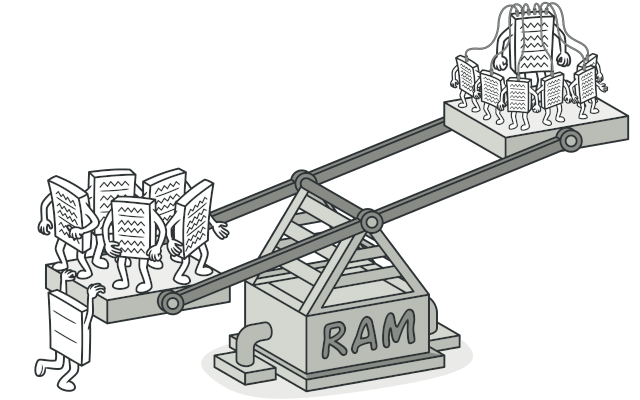

</div>

## 21.1. 🅱️ توضیحات تکمیلی

* نکته فنی: مکانیزم String Interning در پایتون و جاوا، یک پیاده‌سازی داخلی و سطح زبان از الگوی Flyweight است
* موارد مهم از کاربردهای این الگوی طراحی
    * موتورهای بازی‌سازی (Game Engines):رندر کردن انبوه اشیاء مشابه مثل ذرات (Particles)، گلوله‌ها، درختان و چمن‌ها در Unity یا Unreal Engine. تکسچر و مدل مشترک است، فقط ترنسفورم (مکان/چرخش) متفاوت است.
    * ویرایشگرهای متن و IDEها: نرم‌افزارهایی مثل VS Code یا MS Word برای رندر میلیون‌ها کاراکتر، آیکون‌های تکراری در منوها، و استایل‌های CSS مشترک در DOM مرورگرها.
    * مرورگرهای وب (Web Browsers):موتورهای رندر (مثل Blink در کروم) برای مدیریت گره‌های DOM و استایل‌های CSS. استایل‌های مشترک بین هزاران المنت HTML به اشتراک گذاشته می‌شوند.
    * سیستم‌های اطلاعات جغرافیایی (GIS): نرم‌افزارهای نقشه‌کشی (مثل ArcGIS) برای رندر میلیون‌ها پیکسل، نقاطinterest (POI) یا کاشی‌های نقشه (Map Tiles) که داده‌های پایه آن‌ها یکسان است.
    * پردازش داده‌های کلان (Big Data / Finance): در سیستم‌های معاملاتی (Trading) یا تحلیل داده، برای مدیریت میلیون‌ها رکورد که فیلدهای دسته‌بندی شده (Categorical Fields) تکراری دارند (مثلاً نماد سهام، نوع ارز). به جای ذخیره رشته تکراری، به یک آبجکت مشترک اشاره می‌شود (مشابه String Interning).
* چه زمانی استفاده نکنیم؟
    * زمانی که تعداد اشیاء کم است (سربار Factory بی‌دلیل است).
    * زمانی که حافظه مشکل سیستم نیست.
    * زمانی که نمی‌توانید بخش‌های مشترک (Intrinsic) و غیرمشترک (Extrinsic) را به‌درستی از هم تفکیک کنید.
    * زمانی که اشیاء مدام در حال تغییر حالت ذاتی خود هستند (نقض Immutability).

## 21.2. 🅱️ Examples1: ایجاد درخت و استفاده از ویژگی‌های مشترک برای همه درختان

در این مثال، ما می‌خواهیم یک جنگل با هزاران درخت بسازیم. اگر برای هر درخت یک شیء کامل (شامل تکسچر، مدل سه‌بعدی و صدا) بسازیم، حافظه RAM به سرعت پر می‌شود.

* برای حل این مشکل، کد داده‌های هر درخت را به دو بخش تقسیم می‌کند:
    * حالت ذاتی / مشترک (Intrinsic State): ویژگی‌هایی که بین درختان هم‌نوع یکسان است (مثل name, texture, model, wind_sound). این بخش در کلاس TreeType قرار دارد و توسط TreeTypeFactory کش (Cache) می‌شود تا فقط یک بار در حافظه ساخته شود و بین تمام درختان هم‌نوع به اشتراک گذاشته شود.
    * حالت بیرونی / منحصر‌به‌فرد (Extrinsic State): ویژگی‌هایی که برای هر درخت متفاوت است (مثل مختصات x, y و میزان health). این بخش در کلاس Tree قرار دارد.

در نهایت، در بخش `__main__`، کد ۳۰۰۰ درخت می‌کارد و با یک محاسبه ریاضی ساده نشان می‌دهد که استفاده از این الگو چقدر در مصرف حافظه صرفه‌جویی کرده است (چون به جای ساخت ۳۰۰۰ مدل و تکسچر، فقط ۶ مدل و تکسچر در حافظه نگه داشته شده است).

```python
from typing import Dict, Tuple, List
import random
from dataclasses import dataclass


@dataclass
class TreeType:
    """
    کلاس Flyweight که حالت ذاتی (مشترک) درخت را نگهداری می‌کند.
    ویژگی‌هایی مثل تکسچر و مدل که برای تمام درختان یک نوع، یکسان هستند.
    """
    name: str
    texture: str
    model: str
    wind_sound: str

    def display(self, x: int, y: int, health: int) -> None:
        """
        نمایش درخت با ترکیب حالت ذاتی (مشترک) و حالت بیرونی (مختصات و سلامتی).
        
        :param x: مختصات افقی درخت (حالت بیرونی)
        :param y: مختصات عمودی درخت (حالت بیرونی)
        :param health: میزان سلامتی درخت (حالت بیرونی)
        """
        print(f'Rendering {self.name} tree at ({x}, {y}) with {health}% health')
        print(f' - Texture: {self.texture}')
        print(f' - Model: {self.model}')

        # پخش صدای باد فقط در صورتی که سلامت درخت بالا باشد (منطق خاص رندر)
        if health > 70:
            print(f' - Sound: {self.wind_sound}')


class TreeTypeFactory:
    """
    کارخانه Flyweight: مسئول ساخت، مدیریت و کش کردن اشیاء TreeType.
    این کلاس تضمین می‌کند که برای هر ترکیب از ویژگی‌های ذاتی، فقط یک شیء ساخته شود.
    """
    # دیکشنری برای نگهداری (کش کردن) اشیاء ساخته شده
    _tree_types: Dict[str, TreeType] = {}

    @classmethod
    def get_tree_type(cls, name: str, texture: str, model: str, wind_sound: str) -> TreeType:
        """
        دریافت نوع درخت. اگر از قبل در کش وجود داشته باشد، همان را برمی‌گرداند
        در غیر این صورت، یک نمونه جدید ساخته و در کش ذخیره می‌کند.
        
        :return: شیء TreeType مشترک
        """
        # ساخت کلید یکتا بر اساس ویژگی‌های ذاتی (بدون در نظر گرفتن wind_sound برای کلید)
        key = f'{name}_{texture}_{model}'

        if key not in cls._tree_types:
            # اگر در کش نبود، نمونه جدید بساز و ذخیره کن
            cls._tree_types[key] = TreeType(name, texture, model, wind_sound)
            print(f'Created new tree type {key}')
        else:
            # اگر در کش بود، فقط پیام بازیافت نمایش داده شود
            print(f'Reusing existing tree type {key}')

        return cls._tree_types[key]

    @classmethod
    def total_types_created(cls) -> int:
        """
        تعداد کل انواع درخت‌های ساخته شده (اشیاء یکتا در کش) را برمی‌گرداند.
        
        :return: تعداد اشیاء یکتای TreeType
        """
        return len(cls._tree_types)


@dataclass
class Tree:
    """
    کلاس Context که حالت بیرونی (منحصر‌به‌فرد) هر درخت را نگهداری می‌کند.
    """
    x: int
    y: int
    health: int
    tree_type: TreeType  # ارجاع به شیء مشترک Flyweight (به جای کپی کردن داده‌ها)

    def display(self) -> None:
        """نمایش درخت با پاس دادن مختصات و سلامتی به شیء مشترک."""
        self.tree_type.display(self.x, self.y, self.health)


class Forest:
    """
    کلاس کلاینت که جنگل را مدیریت می‌کند و درختان را می‌کارد.
    """

    def __init__(self) -> None:
        # لیستی از تمام درختان کاشته شده (شامل حالت بیرونی و ارجاع به Flyweight)
        self.trees: List[Tree] = []

    def plant_tree(self, x: int, y: int, health: int, name: str, texture: str, model: str, wind_sound: str) -> None:
        """
        کاشت یک درخت جدید با استفاده از کارخانه برای دریافت نوع مشترک.
        
        :param x: مختصات افقی
        :param y: مختصات عمودی
        :param health: میزان سلامتی
        :param name: نام درخت
        :param texture: نام فایل تکسچر
        :param model: نام فایل مدل
        :param wind_sound: نام فایل صدا
        """
        # دریافت شیء مشترک از کارخانه
        tree_type = TreeTypeFactory.get_tree_type(name, texture, model, wind_sound)
        # ساخت شیء درخت با حالت بیرونی و ارجاع به شیء مشترک
        self.trees.append(Tree(x, y, health, tree_type))

    def plant_random_trees(self, count: int) -> None:
        """
        کاشت تعداد مشخصی درخت با مشخصات تصادفی.
        
        :param count: تعداد درختانی که باید کاشته شوند
        """
        # لیست مشخصات از پیش تعریف شده برای درختان
        tree_specs = [
            ('Tree 1', 'tree_1_texture.jpg', 'tree_1_model.obj', 'tree_1_wind.mp3'),
            ('Tree 2', 'tree_2_texture.jpg', 'tree_2_model.obj', 'tree_2_wind.mp3'),
            ('Tree 3', 'tree_3_texture.jpg', 'tree_3_model.obj', 'tree_3_wind.mp3'),
            ('Tree 4', 'tree_4_texture.jpg', 'tree_4_model.obj', 'tree_4_wind.mp3'),
            ('Tree 5', 'tree_5_texture.jpg', 'tree_5_model.obj', 'tree_5_wind.mp3'),
            ('Tree 6', 'tree_6_texture.jpg', 'tree_6_model.obj', 'tree_6_wind.mp3'),
        ]

        for _ in range(count):
            # تولید مختصات و سلامتی تصادفی (حالت بیرونی)
            x, y = random.randint(0, 1000), random.randint(0, 1000)
            health = random.randint(10, 100)
            # انتخاب تصادفی یکی از مشخصات از پیش تعریف شده (حالت ذاتی)
            spec = random.choice(tree_specs)
            self.plant_tree(x, y, health, *spec)

    def display_forest(self) -> None:
        """نمایش ۵ درخت اول جنگل برای تست خروجی."""
        for tree in self.trees[:5]:
            tree.display()

        print('... and many more trees ...')


if __name__ == '__main__':
    print('Creating a forest with flyweight pattern')
    forest = Forest()

    # کاشت ۳۰۰۰ درخت تصادفی
    forest.plant_random_trees(3000)

    print(f'\nTotal trees planted: {len(forest.trees)}')
    print(f'Unique tree types created: {TreeTypeFactory.total_types_created()}')

    # محاسبه تخمینی مصرف حافظه بدون استفاده از الگوی Flyweight
    # (فرض: هر درخت ۴ ویژگی ۵۰ بایتی + ۳ ویژگی مختصات/سلامتی ۴ بایتی دارد)
    without_flyweight = len(forest.trees) * 4 * 50 + len(forest.trees) * 3 * 4

    # محاسبه تخمینی مصرف حافظه با استفاده از الگوی Flyweight
    # (فقط اشیاء یکتا ۲۰۰ بایت فضا می‌گیرند + ۳۰۰۰ درخت هر کدام ۱۲ بایت برای مختصات)
    with_flyweight = TreeTypeFactory.total_types_created() * 200 + len(forest.trees) * 3 * 4

    print(f'\n Estimated memory without flyweight: ~{without_flyweight} bytes')
    print(f'Estimated memory with flyweight: ~{with_flyweight} bytes')

    # محاسبه و نمایش درصد صرفه‌جویی در حافظه
    print(f'Memory saved: {(without_flyweight - with_flyweight) / without_flyweight * 100:.2f}%')
```

## 21.3. 🅱️ Examples1: پیاده سازی جنگل به روش دیگر

در یک بازی، ممکن است ۱۰۰,۰۰۰ درخت در یک جنگل وجود داشته باشد. مدل سه‌بعدی و تکسچر درختان بلوط مشترک است، اما مکان آن‌ها در نقشه متفاوت است.

```python
from typing import Dict, List, Tuple


# ─── رابط فلای‌ویت ───
class Tree:
    """رابط درخت."""

    def draw(self, x: int, y: int, z: int) -> None:
        pass


# ─── فلای‌ویت مشخص (حالت ذاتی) ───
class TreeType(Tree):
    """
    نوع درخت (مثلاً بلوط، کاج). 
    تکسچر و مدل سه‌بعدی در اینجا قرار می‌گیرند (حالت ذاتی و سنگین).
    """

    def __init__(self, name: str, texture_data: str) -> None:
        self._name: str = name
        # شبیه‌سازی داده‌های سنگین گرافیکی (تکسچر و مش سه‌بعدی)
        self._texture_data: str = texture_data

    def draw(self, x: int, y: int, z: int) -> None:
        print(f"کشیدن درخت [{self._name}] با تکسچر [{self._texture_data[:10]}...] در موقعیت ({x}, {y}, {z})")


# ─── کارخانه فلای‌ویت ───
class TreeFactory:
    """مدیریت انواع درختان."""

    _tree_types: Dict[str, TreeType] = {}

    @classmethod
    def get_tree_type(cls, name: str, texture: str) -> TreeType:
        if name not in cls._tree_types:
            cls._tree_types[name] = TreeType(name, texture)
        return cls._tree_types[name]


# ─── کلاینت / زمینه (Context) ───
class Forest:
    """
    جنگل. فقط مختصات درختان را نگه می‌دارد.
    """

    def __init__(self) -> None:
        # ذخیره مختصات (حالت بیرونی) برای هر درخت
        self._trees: List[Tuple[Tree, int, int, int]] = []

    def plant_tree(self, name: str, texture: str, x: int, y: int, z: int) -> None:
        tree_type = TreeFactory.get_tree_type(name, texture)
        self._trees.append((tree_type, x, y, z))

    def draw_forest(self) -> None:
        print("\n--- رندر جنگل ---")
        for tree_obj, x, y, z in self._trees:
            tree_obj.draw(x, y, z)


# ─── استفاده ───
if __name__ == "__main__":
    forest = Forest()

    # کاشت ۵ درخت. فقط ۲ نوع درخت (Oak و Pine) در حافظه ساخته می‌شود.
    forest.plant_tree("Oak", "oak_texture_high_res_data...", 10, 20, 0)
    forest.plant_tree("Pine", "pine_texture_high_res_data...", 15, 25, 0)
    forest.plant_tree("Oak", "oak_texture_high_res_data...", 30, 40, 0)
    forest.plant_tree("Oak", "oak_texture_high_res_data...", 50, 60, 0)
    forest.plant_tree("Pine", "pine_texture_high_res_data...", 70, 80, 0)

    forest.draw_forest()
```

## 21.4. 🅱️ Examples2: شبیه‌سازی عملکرد داخلی یک ویرایشگر متن یا همان Text Editor

وقتی شما در یک ویرایشگر متن (مثل Word) تایپ می‌کنید، هر کاراکتر دارای ویژگی‌های ظاهری (فونت، سایز، رنگ، بولد بودن و...) و همچنین موقعیت مکانی در صفحه است. اگر قرار باشد برای تک‌تک حروف یک فایل متنی بزرگ، تمام این ویژگی‌های ظاهری را در حافظه ذخیره کنیم، حجم عظیمی از RAM اشغال می‌شود.

* راه‌حل این کد (الگوی Flyweight) به این صورت است که کد داده‌های هر کاراکتر را به دو بخش تقسیم می‌کند:
    * حالت ذاتی / مشترک (Intrinsic State): ویژگی‌های ظاهری مثل نام فونت، سایز، رنگ و... که بین حروف مشابه کاملاً یکسان است. این بخش در کلاس CharacterStyle قرار دارد و توسط StyleFactory کش (Cache) می‌شود. یعنی اگر ۱۰۰۰ حرف با فونت "Arial 12" داشته باشیم، فقط یک شیء CharacterStyle در حافظه ساخته می‌شود و هر ۱۰۰۰ حرف به همان یک شیء اشاره می‌کنند.
    * حالت بیرونی / منحصر‌به‌فرد (Extrinsic State): خودِ حرف (مثل 'H' یا 'e') و موقعیت آن (position) که برای هر کاراکتر متفاوت است. این بخش در کلاس FormattedCharacter نگهداری می‌شود که بسیار سبک است.

در نهایت، کلاس Document به عنوان کلاینت عمل کرده، کاراکترها را مدیریت می‌کند و آن‌ها را بر اساس موقعیت مرتب و رندر می‌کند. در انتهای کد، با چاپ total_types_created مشخص می‌شود که با وجود ۱۱ کاراکتر، فقط ۲ استایل یکتا در حافظه ساخته شده است!

```python
from typing import Dict, List
from dataclasses import dataclass


@dataclass
class CharacterStyle:
    """
    کلاس Flyweight (وزن‌سبک) که حالت ذاتی و مشترک کاراکترها را نگهداری می‌کند.
    ویژگی‌هایی مثل فونت، سایز و رنگ که بین کاراکترهای هم‌استایل، یکسان هستند
    و فقط یک بار در حافظه ساخته می‌شوند.
    """
    font_name: str
    font_size: int
    is_bold: bool
    is_italic: bool
    color: str

    def apply_style(self, char: str) -> str:
        """
        استایل‌های ذاتی را روی یک کاراکتر خاص اعمال کرده و خروجی متنی برمی‌گرداند.
        
        :param char: کاراکتر مورد نظر برای استایل‌دهی
        :return: رشته متنی شامل کاراکتر و استایل‌های آن
        """
        weight = 'bold' if self.is_bold else 'normal'
        style = 'italic' if self.is_italic else 'normal'

        return f'[{char}: {self.font_name} {self.font_size}px, {weight} {style}, {self.color}]'


class StyleFactory:
    """
    کارخانه Flyweight: مسئول ساخت، مدیریت و کش کردن اشیاء CharacterStyle.
    این کلاس تضمین می‌کند که برای هر ترکیب از ویژگی‌های ظاهری، فقط یک شیء ساخته شود
    و در درخواست‌های بعدی، همان شیء قبلی از حافظه بازگردانده شود.
    """
    # دیکشنری برای نگهداری (کش کردن) استایل‌های ساخته شده
    _styles: Dict[str, CharacterStyle] = {}

    @classmethod
    def get_style(cls, font_name: str, font_size: int, is_bold: bool, is_italic: bool, color: str) -> CharacterStyle:
        """
        دریافت استایل کاراکتر. اگر از قبل در کش وجود داشته باشد، همان را برمی‌گرداند
        در غیر این صورت، یک نمونه جدید ساخته و در کش ذخیره می‌کند.
        
        :return: شیء CharacterStyle مشترک
        """
        # ساخت کلید یکتا بر اساس تمام ویژگی‌های ذاتی
        key = f'{font_name}-{font_size}-{is_bold}-{is_italic}-{color}'

        if key not in cls._styles:
            # اگر در کش نبود، نمونه جدید بساز و ذخیره کن
            cls._styles[key] = CharacterStyle(font_name, font_size, is_bold, is_italic, color)

        # چه جدید ساخته شده باشد چه از قبل بوده، شیء کش شده را برمی‌گردان
        return cls._styles[key]

    @classmethod
    def total_types_created(cls) -> int:
        """
        تعداد کل استایل‌های یکتای ساخته شده در حافظه را برمی‌گرداند.
        
        :return: تعداد اشیاء یکتای CharacterStyle
        """
        return len(cls._styles)


@dataclass
class FormattedCharacter:
    """
    کلاس Context که حالت بیرونی (منحصر‌به‌فرد) هر کاراکتر را نگهداری می‌کند.
    این کلاس بسیار سبک است و فقط خود حرف، موقعیت آن و یک ارجاع (Reference) 
    به شیء سنگین CharacterStyle را در خود دارد.
    """
    char: str
    style: CharacterStyle  # ارجاع به شیء مشترک Flyweight (به جای کپی کردن داده‌های استایل)
    position: int

    def render(self) -> str:
        """
        رندر کاراکتر با استفاده از استایل مشترک.
        
        :return: رشته متنی رندر شده
        """
        return self.style.apply_style(self.char)


class Document:
    """
    کلاس کلاینت که سند متنی را مدیریت می‌کند، کاراکترها را اضافه کرده و آن‌ها را رندر می‌کند.
    """

    def __init__(self) -> None:
        # لیستی از تمام کاراکترهای سند (شامل حالت بیرونی و ارجاع به Flyweight)
        self.characters: List[FormattedCharacter] = []

    def add_character(self, char: str, font_name: str, font_size: int, is_bold: bool, is_italic: bool, color: str, position: int) -> None:
        """
        اضافه کردن یک کاراکتر جدید به سند با استفاده از کارخانه برای دریافت استایل مشترک.
        """
        # دریافت شیء استایل مشترک از کارخانه (اگر قبلاً ساخته شده باشد، از کش می‌آید)
        style = StyleFactory.get_style(font_name, font_size, is_bold, is_italic, color)

        # ساخت شیء سبک کاراکتر و افزودن به لیست
        self.characters.append(FormattedCharacter(char, style, position))

    def render(self) -> str:
        """
        رندر کل سند. کاراکترها ابتدا بر اساس موقعیت (position) مرتب می‌شوند و سپس نمایش داده می‌شوند.
        
        :return: رشته متنی شامل کل سند رندر شده
        """
        # مرتب‌سازی کاراکترها بر اساس موقعیت آن‌ها در متن
        sorted_characters: List[FormattedCharacter] = sorted(self.characters, key=lambda char: char.position)

        # رندر کردن هر کاراکتر و joining آن‌ها با خط جدید
        return '\n'.join(char.render() for char in sorted_characters)


if __name__ == '__main__':
    # ساخت یک سند جدید
    document = Document()

    # اضافه کردن کلمه "Hello " با استایل یکسان (Arial, 12, Bold, Black)
    # نکته: چون استایل یکسان است، کارخانه فقط بار اول شیء را می‌سازد و 5 بار بعدی از کش استفاده می‌کند.
    document.add_character('H', 'Arial', 12, True, False, 'black', 0)
    document.add_character('e', 'Arial', 12, True, False, 'black', 1)
    document.add_character('l', 'Arial', 12, True, False, 'black', 2)
    document.add_character('l', 'Arial', 12, True, False, 'black', 3)
    document.add_character('o', 'Arial', 12, True, False, 'black', 4)
    document.add_character(' ', 'Arial', 12, True, False, 'black', 5)

    # اضافه کردن کلمه "World" با تغییر استایل برای حرف اول (W)
    # حرف 'W' استایل جدیدی دارد (سایز 16 و رنگ white)، پس کارخانه یک شیء جدید در کش می‌سازد.
    document.add_character('W', 'Arial', 16, True, False, 'white', 6)

    # حروف بعدی دوباره به استایل قبلی (سایز 16 اما رنگ black) برمی‌گردند.
    # چون ترکیب ویژگی‌ها با 'W' متفاوت است (رنگ black است)، کارخانه یک شیء جدید سوم می‌سازد.
    # (در واقع در اینجا 2 استایل جدید ساخته می‌شود: یکی برای W و یکی برای orld)
    document.add_character('o', 'Arial', 16, True, False, 'black', 7)
    document.add_character('r', 'Arial', 16, True, False, 'black', 8)
    document.add_character('l', 'Arial', 16, True, False, 'black', 9)
    document.add_character('d', 'Arial', 16, True, False, 'black', 10)

    # رندر و چاپ کل سند
    print(document.render())

    # چاپ تعداد استایل‌های یکتای ساخته شده در حافظه
    # با وجود 11 کاراکتر، فقط 2 استایل یکتا در حافظه ساخته شده است (یکی برای Hello و یکی برای World)
    print(f"Total unique styles created in memory: {StyleFactory.total_types_created()}")
```

## 21.5. 🅱️ Examples2: پیاده‌سازی ویرایشگر متن به روش دوم

فرض کنید یک ویرایشگر متن دارید که یک فایل ۱۰ مگابایتی (شامل میلیون‌ها کاراکتر) را باز می‌کند. اگر برای هر حرف یک شیء بسازید، رم پر می‌شود.

* حالت ذاتی (مشترک): نام کاراکتر، فونت، سایز.
* حالت بیرونی (منحصر‌به‌فرد): مختصات X و Y روی صفحه نمایش.

```python
from typing import Dict, Tuple, Any


# ─── رابط فلای‌ویت ───
class Character:
    """رابط مشترک برای کاراکترها."""

    def render(self, x: int, y: int) -> None:
        """
        متد رندر که مختصات (حالت بیرونی) را از کلاینت دریافت می‌کند.
        """
        pass


# ─── فلای‌ویت مشخص (حالت ذاتی) ───
class CharacterType(Character):
    """
    این کلاس حالت ذاتی (فونت و نام کاراکتر) را نگه می‌دارد.
    چون بین میلیون‌ها حرف 'A' مشترک است، باید تغییرناپذیر (Immutable) باشد.
    """

    def __init__(self, symbol: str, font_family: str, font_size: int) -> None:
        # حالت ذاتی (درونی و مشترک)
        self._symbol: str = symbol
        self._font_family: str = font_family
        self._font_size: int = font_size

    def render(self, x: int, y: int) -> None:
        # ترکیب حالت ذاتی و بیرونی برای نمایش
        print(f"رندر حرف '{self._symbol}' | فونت: {self._font_family} | "
              f"سایز: {self._font_size} | در مختصات ({x}, {y})")


# ─── کارخانه فلای‌ویت ───
class CharacterFactory:
    """
    مدیریت استخر اشیاء. جلوگیری از ساخت اشیاء تکراری.
    """

    def __init__(self) -> None:
        # دیکشنری برای کش کردن کاراکترهای ساخته شده
        self._types_cache: Dict[str, CharacterType] = {}

    def get_character_type(self, symbol: str, font: str, size: int) -> CharacterType:
        # ساخت کلید یکتا بر اساس حالت ذاتی
        key = f"{symbol}_{font}_{size}"

        if key not in self._types_cache:
            # اگر از قبل ساخته نشده، بساز و در کش ذخیره کن
            self._types_cache[key] = CharacterType(symbol, font, size)
            print(f"[Factory] ساخت کاراکتر جدید برای '{symbol}' و ذخیره در کش.")

        return self._types_cache[key]


# ─── کلاینت / زمینه (Context) ───
class Document:
    """
    سند متنی. مختصات (حالت بیرونی) را نگه می‌دارد و از Factory استفاده می‌کند.
    """

    def __init__(self) -> None:
        # لیستی از tuples: (شیء فلای‌ویت, مختصات x, مختصات y)
        self._characters: list[Tuple[Character, int, int]] = []
        self._factory = CharacterFactory()

    def add_character(self, symbol: str, font: str, size: int, x: int, y: int) -> None:
        # دریافت شیء مشترک از Factory
        char_type = self._factory.get_character_type(symbol, font, size)
        # ذخیره شیء مشترک به همراه مختصات منحصر‌به‌فرد (حالت بیرونی)
        self._characters.append((char_type, x, y))

    def render_document(self) -> None:
        print("\n--- شروع رندر سند ---")
        for char_obj, x, y in self._characters:
            # پاس دادن حالت بیرونی (x, y) به شیء مشترک
            char_obj.render(x, y)


# ─── استفاده ───
if __name__ == "__main__":
    doc = Document()

    # اضافه کردن حروف. حرف 'A' سه بار استفاده شده اما فقط یک بار در حافظه ساخته می‌شود.
    doc.add_character('A', 'Arial', 12, 10, 20)
    doc.add_character('B', 'Arial', 12, 30, 20)
    doc.add_character('A', 'Arial', 12, 50, 20)  # از کش خوانده می‌شود
    doc.add_character('A', 'Times', 14, 70, 20)  # فونت متفاوت، پس جدید ساخته می‌شود

    doc.render_document()
```

# 22. 🅰️ Structural.Proxy(کنترل دسترسی به شیء اصلی و افزودن لایه‌های میانی برای عملیات‌ها)

<div style="display: flex; flex-direction: column; align-items: center;">


</div>

* کنترل دسترسی به شیء اصلی و افزودن لایه‌های میانی برای عملیات‌هایی مانند:
    * تأخیر در ساخت شیء سنگین (Lazy Initialization)
    * کنترل دسترسی (Access Control)
    * لاگ‌گذاری (Logging)
    * کش کردن (Caching)
    * ارتباط از راه دور (Remote Communication)
*

```
┌─────────────────────────────────────────────────────────────┐
│                    main Proxy structure                     │
└─────────────────────────────────────────────────────────────┘

          ┌─────────────────┐
          │    Subject      │  ← Common interface (Interface/ABC)
          │  + request()    │
          └────────┬────────┘
                   │
         ┌─────────┴─────────┐
         │                   │
         │                   │
┌────────┴────────┐ ┌────────┴────────┐
│  RealSubject    │ │     Proxy       │
│                 │ │ - _real_subject │
│  + request()    │ │  + request()    │
└─────────────────┘ └────────┬────────┘
                             │
             (Reference)     │
                             │
                    ┌────────┴────────┐
                    │   RealSubject   │
                    └─────────────────┘


┌─────────────────────────────────────────────┐
│                   (Flow)                    │
└─────────────────────────────────────────────┘

    Client
       │
       ▼
    ┌──┴───┐            request()          ┌──────────┐
    │Proxy ├──────────────────────────────►│ RealSubj │
    └──┬───┘                               └────┬─────┘
       ▲                                        │
       │   (Access control،log، cache، ...)     │
       │                                        ▼
       │            main process                │
       │                                        │
       └────────────── result ──────────────────┘
```

## 22.1. 🅱️ مثال یک مشکل و حل مسئله

مشکل: کوئر در دیتابیس عظیم می‌تواند هزینه‌بر باشد و مقدار زیادی از منابع سیستم را مصرف می‌کند درحالی که ممکن است شماهر از گاهی به آن نیاز داشته باشید. بعنون راه حل ابتدایی و غیر استاندارد شما می‌توانید مقداردهی اولیه‌ی تنبل را پیاده‌سازی کنید: این شیء را فقط زمانی که واقعاً مورد نیاز است ایجاد کنید. همه کلاینت‌های شیء باید مقداری کد مقداردهی
اولیه‌ی معوق را اجرا کنند. متأسفانه، این احتمالاً باعث تکرار زیاد کد می‌شود.

<div style="display: flex; flex-direction: column; align-items: center;">

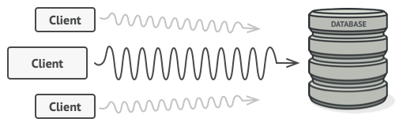

</div>

حل مشکل:الگوی Proxy پیشنهاد می‌کند که یک کلاس پروکسی جدید با رابط کاربری مشابه با یک شیء سرویس اصلی ایجاد کنید. سپس برنامه خود را به‌روزرسانی کنید تا شیء پروکسی را به تمام کلاینت‌های شیء اصلی ارسال کند. پروکسی پس از دریافت درخواست از یک کلاینت، یک شیء سرویس واقعی ایجاد می‌کند و تمام کارها را به آن محول می‌کند.

پروکسی خود را به عنوان یک شیء پایگاه داده پنهان می‌کند. می‌تواند مقداردهی اولیه کند و ذخیره‌سازی نتایج را بدون اینکه کلاینت یا شیء پایگاه داده واقعی حتی بدانند، انجام دهد.

اما فایده آن چیست؟ اگر نیاز به اجرای چیزی قبل یا بعد از منطق اولیه کلاس دارید، پروکسی به شما امکان می‌دهد این کار را بدون تغییر آن کلاس انجام دهید. از آنجایی که پروکسی همان رابط کاربری کلاس اصلی را پیاده‌سازی می‌کند، می‌توان آن را به هر کلاینتی که انتظار یک شیء سرویس واقعی را دارد، ارسال کرد.

<div style="display: flex; flex-direction: column; align-items: center;">

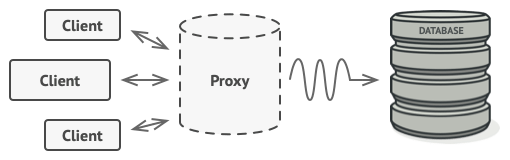

</div>

## 22.2. 🅱️ توضیحات تکمیلی

* ملاحظات و اصول طراحی
    * اصل جایگزینی لیسکوف (Liskov Substitution Principle - LSP)
        * پراکسی باید بتواند به‌جای شیء واقعی استفاده شود.
        * پراکسی دقیقاً همان رابط (Interface) شیء واقعی را پیاده‌سازی می‌کند. کلاینت نباید متوجه تفاوت شود.
    * اصل باز/بسته (Open/Closed Principle - OCP)
        * می‌توانید رفتار جدید (مثل لاگ یا کش) اضافه کنید بدون آنکه کد RealSubject یا Client را تغییر دهید.
    * اصل تک‌وظیفه‌ای (Single Responsibility Principle - SRP)
        * پراکسی مسئول کنترل دسترسی است، نه منطق کسب‌وکار.
        * هر نوع پراکسی یک مسئولیت مشخص دارد (مثلاً فقط کش، فقط احراز هویت).
    * اصل تفکیک رابط (Interface Segregation Principle - ISP)
        * رابط Subject باید مینیمال باشد.
        * اگر رابط بزرگ باشد، پراکسی مجبور است متدهای بی‌ربط را هم پیاده‌سازی کند.
    * اصل وارونگی وابستگی (Dependency Inversion Principle - DIP)
        * کلاینت به انتزاع (Subject) وابسته است، نه به پیاده‌سازی واقعی.
    * شفافیت (Transparency)
        * کلاینت نباید بداند با Proxy کار می‌کند یا RealSubject.
        * این شفافیت امکان تست آسان‌تر (Mocking) را فراهم می‌کند.
    * سربار عملکردی (Performance Overhead)
        * پراکسی یک لایه اضافی است و سربار (Overhead) دارد.
        * این سربار باید در برابر مزایا (کش، امنیت، Lazy Loading) توجیه‌پذیر باشد.
    * چه زمانی استفاده نکنیم؟
        * وقتی شیء سبک است و ساخت آن سریع انجام می‌شود.
        * وقتی نیاز به کنترل دسترسی یا کش ندارید.
        * وقتی سربار لایه اضافی قابل قبول نیست.
        * وقتی یچیدگی کد بیشتر از فایده آن است.
* انواع Proxy
    * Virtual Proxy (پراکسی مجازی): تأخیر در ساخت شیء سنگین (Lazy Loading)
        * مثال: لود تصویر فقط زمانی که کاربر آن را می‌بیند
    * Protection Proxy (پراکسی حفاظتی): کنترل دسترسی بر اساس نقش کاربر
        * مثال: فقط ادمین می‌تواند داده‌ها را حذف کند
    * Remote Proxy (پراکسی راه دور):نماینده شیء در فضای آدرس دیگر (شبکه)
        * مثال: RPC، Web Service، gRPC
    * Caching Proxy (پراکسی کش): ذخیره نتایج گران‌قیمت برای استفاده مجدد
        * مثال: کش نتایج دیتابیس یا API
    * Logging Proxy (پراکسی لاگ): ثبت فراخوانی‌ها برای دیباگ یا Audit
        * مثال: لاگ تمام درخواست‌های API
* موارد کاربردی از استفاده در صنعت
    * ORM و دسترسی به داده‌ها: در فریمورک‌هایی مثل Django و SQLAlchemy برای Lazy Loading روابط (Relations). وقتی یک شیء User را لود می‌کنید، لیست سفارشات او تا زمانی که دسترسی پیدا نکنید لود نمی‌شود.
    * RPC و ارتباطات شبکه: در سیستم‌های توزیع‌شده مثل gRPC، SOAP و RMI. پراکسی سمت کلاینت (Stub) درخواست‌ها را Serialize کرده و به سرور می‌فرستد و پاسخ را دریافت می‌کند.
    * Caching و CDN: در سیستم‌هایی مثل Redis یا Varnish به عنوان Reverse Proxy. پاسخ‌های HTTP یا نتایج کوئری‌های گران‌قیمت کش می‌شوند تا از اجرای مجدد جلوگیری شود.
    * امنیت و API Gateway: در API Gatewayها (مثل Kong، Apigee) برای Authentication، Rate Limiting، SSL Termination و Logging قبل از رسیدن درخواست به سرویس اصلی.
    * تست و Mocking: در فریمورک‌های تست مثل unittest.mock و pytest. پراکسی‌ها (Mocks/Stubs) به جای سرویس‌های واقعی (دیتابیس، API خارجی) استفاده می‌شوند تا تست‌ها سریع و ایزوله باشند.
* مزایا
    * کنترل دسترسی به شیء اصلی
    * بهینه‌سازی عملکرد (Lazy Loading، Caching)
    * افزودن قابلیت‌ها بدون تغییر کد اصلی (OCP)
    * شفافیت برای کلاینت
    * امکان تست آسان‌تر (Mocking)
* معایب:
    * سربار عملکردی (لایه اضافی)
    * پیچیدگی کد بیشتر
    * تأخیر در تشخیص باگ‌ها (چون لایه میانی وجود دارد)
    * ممکن است پاسخ‌دهی را بسیار کند (اگر کش نباشد)
* الگوی Proxy یک ابزار قدرتمند برای کنترل غیرمستقیم دسترسی به اشیاء است. این الگو به‌ویژه در شرایط زیر حیاتی است:
    * منابع سنگین: وقتی ساخت شیء هزینه‌بر است (Virtual Proxy)
    * امنیت: وقتی نیاز به کنترل دسترسی دارید (Protection Proxy)
    * شبکه: وقتی شیء در فضای آدرس دیگری است (Remote Proxy)
    * عملکرد: وقتی نیاز به کش دارید (Caching Proxy)

## 22.3. 🅱️ Examples1: Virtual Proxy - لود تنبل تصاویر

این مثال نشان می‌دهد چگونه یک تصویر سنگین فقط زمانی لود می‌شود که واقعاً نیاز به نمایش آن باشد.

```python
from abc import ABC, abstractmethod
from typing import Optional
import time


# ─── رابط مشترک (Subject) ───
class Image(ABC):
    """رابط مشترک برای تصاویر."""

    @abstractmethod
    def display(self) -> None:
        """تصویر را نمایش می‌دهد."""
        pass


# ─── شیء واقعی (RealSubject) ───
class RealImage(Image):
    """
    کلاس تصویر واقعی که فایل را از دیسک لود می‌کند.
    این عملیات سنگین و زمان‌بر است.
    """

    def __init__(self, filename: str) -> None:
        self._filename = filename
        print(f"[RealImage] شروع لود فایل: {filename}")
        self._load_from_disk()
        print(f"[RealImage] فایل {filename} با موفقیت لود شد.")

    def _load_from_disk(self) -> None:
        """
        شبیه‌سازی لود فایل سنگین از دیسک.
        در واقعیت این عملیات I/O زمان‌بر است.
        """
        # شبیه‌سازی تأخیر شبکه/دیسک
        time.sleep(2)
        self._data = f"داده‌های تصویر {self._filename}"

    def display(self) -> None:
        print(f"نمایش تصویر: {self._filename}")
        print(f"داده‌ها: {self._data[:30]}...")


# ─── پراکسی (Proxy) ───
class ImageProxy(Image):
    """
    پراکسی مجازی برای لود تنبل (Lazy Loading) تصویر.
    تا زمانی که display() صدا زده نشود، تصویر لود نمی‌شود.
    """

    def __init__(self, filename: str) -> None:
        self._filename = filename
        # در ابتدا تصویر واقعی ساخته نمی‌شود
        self._real_image: Optional[RealImage] = None

    def display(self) -> None:
        """
        اولین بار که display صدا زده شود، تصویر واقعی ساخته می‌شود.
        دفعات بعدی از همان شیء استفاده می‌شود.
        """
        if self._real_image is None:
            print(f"[Proxy] تصویر {self._filename} هنوز لود نشده. در حال لود...")
            self._real_image = RealImage(self._filename)

        # ارجاع به شیء واقعی برای نمایش
        self._real_image.display()


# ─── استفاده ───
if __name__ == "__main__":
    print("=" * 60)
    print("مثال Virtual Proxy - لود تنبل تصاویر")
    print("=" * 60)

    # ساخت پراکسی (سریع - بدون لود واقعی)
    image1 = ImageProxy("photo_1.jpg")
    image2 = ImageProxy("photo_2.jpg")

    print("\n[Client] اشیاء ساخته شدند اما هنوز لود نشده‌اند.")
    print("(اینجا هیچ لودی اتفاق نیفتاده)")

    print("\n--- درخواست نمایش تصویر اول ---")
    image1.display()  # اینجا لود اتفاق می‌افتد (2 ثانیه)

    print("\n--- درخواست نمایش تصویر اول (دوباره) ---")
    image1.display()  # اینجا لود اتفاق نمی‌افتد (از کش استفاده می‌کند)

    print("\n--- درخواست نمایش تصویر دوم ---")
    image2.display()  # اینجا لود اتفاق می‌افتد (2 ثانیه)

    print("\n" + "=" * 60)
    print("نتیجه: بدون Proxy، هر دو تصویر در شروع لود می‌شدند.")
    print("با Proxy، فقط تصاویر مورد نیاز لود شدند.")
    print("=" * 60)
```

## 22.4. 🅱️ Examples2: Protection Proxy - کنترل دسترسی

این مثال نشان می‌دهد چگونه پراکسی می‌تواند دسترسی به عملیات حساس را بر اساس نقش کاربر کنترل کند.

```python
from abc import ABC, abstractmethod
from typing import Optional
from datetime import datetime


# ─── رابط مشترک (Subject) ───
class Document(ABC):
    """رابط مشترک برای اسناد."""

    @abstractmethod
    def read(self) -> str:
        """محتوای سند را می‌خواند."""
        pass

    @abstractmethod
    def delete(self) -> bool:
        """سند را حذف می‌کند."""
        pass


# ─── شیء واقعی (RealSubject) ───
class ConfidentialDocument(Document):
    """
    سند محرمانه که عملیات واقعی خواندن و حذف را انجام می‌دهد.
    """

    def __init__(self, filename: str, content: str) -> None:
        self._filename = filename
        self._content = content
        print(f"[Document] سند '{filename}' ساخته شد.")

    def read(self) -> str:
        """بازگرداندن محتوای سند."""
        return f"محتوای سند '{self._filename}': {self._content}"

    def delete(self) -> bool:
        """حذف واقعی سند."""
        print(f"[Document] سند '{self._filename}' حذف شد.")
        return True


# ─── پراکسی حفاظتی (Protection Proxy) ───
class ProtectedDocumentProxy(Document):
    """
    پراکسی که دسترسی به سند را بر اساس نقش کاربر کنترل می‌کند.
    
    قوانین:
    - همه کاربران می‌توانند بخوانند (به جز مهمان)
    - فقط ادمین می‌تواند حذف کند
    """

    def __init__(self, document: Document, user_role: str) -> None:
        """
        Args:
            document: شیء سند واقعی
            user_role: نقش کاربر ('admin', 'user', 'guest')
        """
        self._document = document
        self._user_role = user_role
        self._access_log: list = []

    def _log_access(self, operation: str, allowed: bool) -> None:
        """ثبت لاگ دسترسی برای Audit."""
        timestamp = datetime.now().strftime("%H:%M:%S")
        status = "مجاز" if allowed else "غیرمجاز"
        log_entry = f"[{timestamp}] کاربر '{self._user_role}' - عملیات {operation}: {status}"
        self._access_log.append(log_entry)
        print(log_entry)

    def read(self) -> str:
        """
        بررسی مجوز خواندن قبل از دسترسی به سند.
        """
        # کاربر مهمان نمی‌تواند بخواند
        if self._user_role == "guest":
            self._log_access("read", False)
            return "خطا: دسترسی غیرمجاز! کاربران مهمان نمی‌توانند اسناد را بخوانند."

        self._log_access("read", True)
        return self._document.read()

    def delete(self) -> bool:
        """
        بررسی مجوز حذف قبل از دسترسی به سند.
        فقط ادمین می‌تواند حذف کند.
        """
        if self._user_role != "admin":
            self._log_access("delete", False)
            return False

        self._log_access("delete", True)
        return self._document.delete()

    def get_access_log(self) -> list:
        """بازگرداندن لاگ دسترسی‌ها."""
        return self._access_log


# ─── استفاده ───
if __name__ == "__main__":
    print("=" * 70)
    print("مثال Protection Proxy - کنترل دسترسی به اسناد محرمانه")
    print("=" * 70)

    # ساخت سند واقعی
    real_doc = ConfidentialDocument(filename="secret_report.pdf", content="این یک سند بسیار محرمانه است!")

    print("\n" + "-" * 70)
    print("کاربر ادمین:")
    print("-" * 70)
    admin_proxy = ProtectedDocumentProxy(real_doc, user_role="admin")
    print(admin_proxy.read())
    print(f"حذف موفق: {admin_proxy.delete()}")

    print("\n" + "-" * 70)
    print("کاربر عادی:")
    print("-" * 70)
    user_proxy = ProtectedDocumentProxy(real_doc, user_role="user")
    print(user_proxy.read())
    print(f"حذف موفق: {user_proxy.delete()}")  # نباید موفق شود

    print("\n" + "-" * 70)
    print("کاربر مهمان:")
    print("-" * 70)
    guest_proxy = ProtectedDocumentProxy(real_doc, user_role="guest")
    print(guest_proxy.read())  # نباید موفق شود
    print(f"حذف موفق: {guest_proxy.delete()}")  # نباید موفق شود

    print("\n" + "=" * 70)
    print("لاگ دسترسی‌ها (Audit Log):")
    print("=" * 70)
    for log in admin_proxy.get_access_log():
        print(log)
```

## 22.4. 🅱️ Examples3:

```python
from abc import ABC, abstractmethod
from typing import Optional


# region subject interface

class Image(ABC):
    @abstractmethod
    def display(self):
        raise NotImplementedError


# endregion

# region real subject

class RealImage(Image):
    def __init__(self, filename: str):
        self.filename = filename
        self.load_image()

    def display(self):
        print(f'displaying image with filename: {self.filename}')

    def load_image(self):
        print(f'loading image with filename: {self.filename}')


# endregion

# region proxy

class ProxyImage(Image):
    def __init__(self, filename: str):
        self.filename = filename
        self.real_image: Optional[RealImage] = None

    def display(self):
        if self.real_image is None:
            self.real_image = RealImage(self.filename)

        self.real_image.display()


# endregion

# region client

if __name__ == '__main__':
    img = ProxyImage('test.jpg')
    if input(f'would you like to see the real image? ') == 'y':
        img.display()

# endregion

```

# 23. 🅰️ Structural.Bridge(جداسازی انتزاع از پیاده‌سازی جهت استقلال تغییر)

جداسازی انتزاع (Abstraction) از پیاده‌سازی (Implementation) تا هر دو بتوانند مستقل از هم تغییر کنند. این الگو به جای استفاده از وراثت چندلایه، از ترکیب (Composition) استفاده می‌کند.

<div style="display: flex; flex-direction: column; align-items: center;">


</div>

* یک ابزار قدرتمند برای مدیریت پیچیدگی در سیستم‌هایی است که چندین بعد تغییر دارند. این الگو با جداسازی انتزاع از پیاده‌سازی، امکان ترکیب‌پذیری بالا را فراهم می‌کند و از انفجار کلاس‌ها جلوگیری می‌کند.
* این الگو به‌ویژه در سیستم‌های Enterprise که نیاز به انعطاف‌پذیری و توسعه‌پذیری دارند، جایگاه ویژه‌ای دارد و با رعایت اصول SOLID، کدی تمیز، قابل نگهداری و قابل توسعه ایجاد می‌کند.

## 23.1. 🅱️ مشکل و حل مسئله انفجار کلاس‌ها

تی سیستم شما چندین بعد تغییر دارد، استفاده از وراثت منجر به انفجار کلاس‌ها (Class Explosion) می‌شود. فرض کنید می‌خواهید شکل‌های مختلف را با رنگ‌های مختلف رندر کنید:

<div style="display: flex; flex-direction: column; align-items: center;">

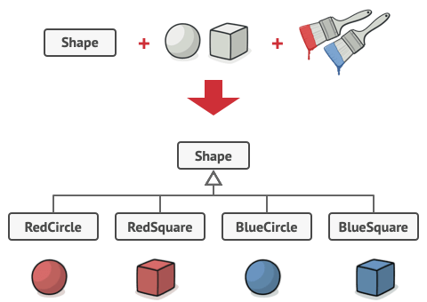

</div>

```
by Inheritance (without Bridge):
─────────────────────────────────
Shape
├── RedCircle
├── BlueCircle
├── GreenCircle
├── RedSquare
├── BlueSquare
├── GreenSquare
├── RedTriangle
├── BlueTriangle
└── GreenTriangle
```

اگر یک شکل یا یک رنگ اضافه شود، تحت هرکدام باید ۳ کلاس اضافه شود. درحالی که تحت رویکرد bridge تنها یک کلاس یا رنگ اضافه می‌شود

```
With Bridge:
──────────────────
Shape (ABstract)
├── Circle
├── Square
└── Triangle

Color (Implement)
├── Red
├── Blue
└── Green
```

در حالت استفاده از رویکرد bridge بصورت خطی کلاس‌ها استفاده می‌شود: `Circle + Red` یا `Circle + Blue` یا موارد دیگر

<div style="display: flex; flex-direction: column; align-items: center;">

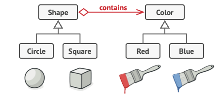

</div>

## 23.2. 🅱️ توضیحات تکمیلی:

* مقایسه با سایر الگوها
    * Bridge vs Adapter:
        * Bridge: قبل از طراحی، برای جداسازی ابعاد تغییر
        * Adapter: بعد از طراحی، برای سازگاری رابط‌های ناسازگار
    * Bridge vs Strategy:
        * Bridge: دو سلسله‌مراتب موازی (انتزاع و پیاده‌سازی)
        * Strategy: یک سلسله‌مراتب با الگوریتم‌های قابل تعویض
    * Bridge vs Decorator:
        * Bridge: جداسازی ابعاد تغییر
        * Decorator: افزودن رفتار به شیء موجود
* موارد پرکاربرد در صنعت
    * JDBC در جاوا (Java Database Connectivity): جدا کردن API JDBC (انتزاع) از درایورهای دیتابیس (پیاده‌سازی). شما با java.sql.Connection کار می‌کنید، اما در پس‌زمینه درایور MySQL، PostgreSQL یا Oracle اجرا می‌شود. این اجازه می‌دهد بدون تغییر کد، دیتابیس را عوض کنید.
    * درایورهای گرافیکی (Graphics Drivers): جدا کردن API گرافیکی (مثل OpenGL یا DirectX) از درایورهای سخت‌افزاری. بازی‌ها با API کار می‌کند، اما در پس‌زمینه درایور NVIDIA، AMD یا Intel اجرا می‌شود.
    * فریمورک‌های UI (User Interface): جدا کردن ویجت‌ها (انتزاع) از پیاده‌سازی‌های پلتفرم (پیاده‌سازی). مثلاً در AWT/Swing جاوا، کامپوننت‌های UI (Button، TextField) انتزاع هستند و Peer classes پیاده‌سازی‌های خاص ویندوز/لینوکس/مک هستند.
    * سیستم‌های لاگ (Logging Frameworks):جدا کردن API لاگ (انتزاع) از مقصدهای مختلف (پیاده‌سازی). شما با Logger.info() کار می‌کنید، اما لاگ می‌تواند به فایل، کنسول، دیتابیس یا سرویس ابری (مثل ELK Stack) ارسال شود.
    * سیستم‌های پرداخت (Payment Gateways): جدا کردن منطق پرداخت (انتزاع) از درگاه‌های مختلف (پیاده‌سازی). شما با PaymentProcessor.charge() کار می‌کنید، اما در پس‌زمینه Stripe، PayPal یا درگاه محلی اجرا می‌شود.
* مزایا:
    * جداسازی ابعاد تغییر (Separation of Concerns)
    * جلوگیری از انفجار کلاس‌ها
    * رعایت اصل باز/بسته (OCP)
    * رعایت اصل مسئولیت یگانه (SRP)
    * انعطاف‌پذیری بالا در ترکیب انتزاع و پیاده‌سازی
    * شفافیت برای کلاینت
* معایب:
    * پیچیدگی کد بیشتر (دو سلسله‌مراتب موازی)
    * سربار عملکردی (ترکیب به جای وراثت)
    * نیاز به طراحی دقیق قبل از پیاده‌سازی
    * ممکن است برای سیستم‌های ساده، بیش‌ازحد پیچیده باشد
* چه زمانی از Bridge استفاده کنیم؟
    * دو یا چند بعد تغییر مستقل دارید
    * می‌خواهید از انفجار کلاس‌ها جلوگیری کنید
    * نیاز دارید انتزاع و پیاده‌سازی مستقل از هم تغییر کنند
    * می‌خواهید کد را در زمان اجرا قابل پیکربندی کنید
* چه زمانی از Bridge استفاده نکنیم؟
    * فقط یک بعد تغییر دارید
    * تغییرات پیاده‌سازی نادر است
    * سیستم ساده است و پیچیدگی اضافی توجیه ندارد
    * عملکرد حیاتی است و سربار ترکیب قابل قبول نیست

## 23.3. 🅱️ Examples1: دستگاه‌های الکترونیکی با کنترل‌های مختلف

فرض کنید دستگاه‌های مختلف (رادیو، تلویزیون) دارید که با کنترل‌های مختلف (قدیمی، پیشرفته) کار می‌کنند.

```python
from abc import ABC, abstractmethod


# ─── لایه پیاده‌سازی (Implementor) ───
class Device(ABC):
    """
    رابط پیاده‌سازی برای دستگاه‌های الکترونیکی.
    این لایه جزئیات پیاده‌سازی خاص هر دستگاه را مدیریت می‌کند.
    """

    @abstractmethod
    def turn_on(self) -> None:
        """دستگاه را روشن می‌کند."""
        pass

    @abstractmethod
    def turn_off(self) -> None:
        """دستگاه را خاموش می‌کند."""
        pass

    @abstractmethod
    def set_channel(self, channel: int) -> None:
        """کانال را تنظیم می‌کند."""
        pass

    @abstractmethod
    def get_channel(self) -> int:
        """کانال فعلی را برمی‌گرداند."""
        pass


# ─── پیاده‌سازی مشخص: رادیو ───
class Radio(Device):
    """پیاده‌سازی خاص برای رادیو."""

    def __init__(self) -> None:
        self._is_on: bool = False
        self._channel: int = 1

    def turn_on(self) -> None:
        self._is_on = True
        print(f"رادیو روشن شد. کانال فعلی: {self._channel}")

    def turn_off(self) -> None:
        self._is_on = False
        print("رادیو خاموش شد.")

    def set_channel(self, channel: int) -> None:
        if self._is_on:
            self._channel = channel
            print(f"کانال رادیو به {channel} تغییر کرد.")
        else:
            print("لطفاً ابتدا رادیو را روشن کنید.")

    def get_channel(self) -> int:
        return self._channel


# ─── پیاده‌سازی مشخص: تلویزیون ───
class TV(Device):
    """پیاده‌سازی خاص برای تلویزیون."""

    def __init__(self) -> None:
        self._is_on: bool = False
        self._channel: int = 1

    def turn_on(self) -> None:
        self._is_on = True
        print(f"تلویزیون روشن شد. کانال فعلی: {self._channel}")

    def turn_off(self) -> None:
        self._is_on = False
        print("تلویزیون خاموش شد.")

    def set_channel(self, channel: int) -> None:
        if self._is_on:
            self._channel = channel
            print(f"کانال تلویزیون به {channel} تغییر کرد.")
        else:
            print("لطفاً ابتدا تلویزیون را روشن کنید.")

    def get_channel(self) -> int:
        return self._channel


# ─── لایه انتزاع (Abstraction) ───
class RemoteControl(ABC):
    """
    رابط انتزاعی برای کنترل‌های از راه دور.
    این لایه منطق کسب‌وکار (کنترل دستگاه) را مدیریت می‌کند.
    """

    def __init__(self, device: Device) -> None:
        # ترکیب: کنترل به یک دستگاه وابسته است
        self._device = device

    @abstractmethod
    def press_power(self) -> None:
        """دکمه پاور را فشار می‌دهد."""
        pass

    @abstractmethod
    def press_channel_up(self) -> None:
        """کانال را افزایش می‌دهد."""
        pass

    @abstractmethod
    def press_channel_down(self) -> None:
        """کانال را کاهش می‌دهد."""
        pass


# ─── انتزاع مشخص: کنترل قدیمی ───
class BasicRemoteControl(RemoteControl):
    """کنترل از راه دور قدیمی با قابلیت‌های پایه."""

    def press_power(self) -> None:
        print("[کنترل قدیمی] دکمه پاور فشار داده شد.")
        # بررسی وضعیت دستگاه و تغییر آن
        if self._device.get_channel() > 0:
            # فرض می‌کنیم اگر کانال > 0 است، دستگاه روشن است
            self._device.turn_off()
        else:
            self._device.turn_on()

    def press_channel_up(self) -> None:
        print("[کنترل قدیمی] دکمه کانال بالا فشار داده شد.")
        current = self._device.get_channel()
        self._device.set_channel(current + 1)

    def press_channel_down(self) -> None:
        print("[کنترل قدیمی] دکمه کانال پایین فشار داده شد.")
        current = self._device.get_channel()
        if current > 1:
            self._device.set_channel(current - 1)


# ─── انتزاع مشخص: کنترل پیشرفته ───
class AdvancedRemoteControl(RemoteControl):
    """کنترل از راه دور پیشرفته با قابلیت‌های اضافی."""

    def press_power(self) -> None:
        print("[کنترل پیشرفته] دکمه پاور فشار داده شد.")
        # منطق پیشرفته‌تر برای روشن/خاموش کردن
        self._device.turn_on()

    def press_channel_up(self) -> None:
        print("[کنترل پیشرفته] دکمه کانال بالا فشار داده شد.")
        current = self._device.get_channel()
        self._device.set_channel(current + 1)

    def press_channel_down(self) -> None:
        print("[کنترل پیشرفته] دکمه کانال پایین فشار داده شد.")
        current = self._device.get_channel()
        if current > 1:
            self._device.set_channel(current - 1)

    def mute(self) -> None:
        """قابلیت اضافی: بی‌صدا کردن."""
        print("[کنترل پیشرفته] دکمه Mute فشار داده شد.")
        print("دستگاه بی‌صدا شد.")


# ─── استفاده ───
if __name__ == "__main__":
    print("=" * 70)
    print("مثال Bridge: دستگاه‌های الکترونیکی با کنترل‌های مختلف")
    print("=" * 70)

    # ساخت دستگاه‌ها
    radio = Radio()
    tv = TV()

    print("\n" + "-" * 70)
    print("ترکیب ۱: رادیو + کنترل قدیمی")
    print("-" * 70)
    basic_radio_remote = BasicRemoteControl(radio)
    basic_radio_remote.press_power()
    basic_radio_remote.press_channel_up()
    basic_radio_remote.press_channel_up()

    print("\n" + "-" * 70)
    print("ترکیب ۲: تلویزیون + کنترل پیشرفته")
    print("-" * 70)
    advanced_tv_remote = AdvancedRemoteControl(tv)
    advanced_tv_remote.press_power()
    advanced_tv_remote.press_channel_up()
    advanced_tv_remote.mute()  # قابلیت اضافی

    print("\n" + "-" * 70)
    print("ترکیب ۳: تلویزیون + کنترل قدیمی")
    print("-" * 70)
    basic_tv_remote = BasicRemoteControl(tv)
    basic_tv_remote.press_power()
    basic_tv_remote.press_channel_down()

    print("\n" + "=" * 70)
    print("نتیجه: هر دستگاهی با هر کنترلی قابل ترکیب است!")
    print("بدون Bridge: 2 دستگاه × 2 کنترل = 4 کلاس")
    print("با Bridge: 2 دستگاه + 2 کنترل = 4 کلاس (اما قابل ترکیب!)")
    print("=" * 70)
```

## 23.4. 🅱️ Examples2:فرمت‌های خروجی با رندررهای مختلف

فرض کنید می‌خواهید مستندات را در فرمت‌های مختلف (PDF، HTML) رندر کنید، اما رندررهای مختلفی برای سیستم‌عامل‌های مختلف (ویندوز، لینوکس) دارید.

```python
from abc import ABC, abstractmethod


# ─── لایه پیاده‌سازی (Implementor) ───
class Renderer(ABC):
    """
    رابط پیاده‌سازی برای رندررها.
    این لایه جزئیات رندر در پلتفرم‌های مختلف را مدیریت می‌کند.
    """

    @abstractmethod
    def render_circle(self, x: float, y: float, radius: float) -> None:
        """دایره را رندر می‌کند."""
        pass

    @abstractmethod
    def render_rectangle(self, x: float, y: float, width: float, height: float) -> None:
        """مستطیل را رندر می‌کند."""
        pass


# ─── پیاده‌سازی مشخص: رندرر ویندوز ───
class WindowsRenderer(Renderer):
    """رندرر مخصوص ویندوز."""

    def render_circle(self, x: float, y: float, radius: float) -> None:
        print(f"[ویندوز] رندر دایره در ({x}, {y}) با شعاع {radius}")

    def render_rectangle(self, x: float, y: float, width: float, height: float) -> None:
        print(f"[ویندوز] رندر مستطیل در ({x}, {y}) با ابعاد {width}×{height}")


# ─── پیاده‌سازی مشخص: رندرر لینوکس ───
class LinuxRenderer(Renderer):
    """رندرر مخصوص لینوکس."""

    def render_circle(self, x: float, y: float, radius: float) -> None:
        print(f"[لینوکس] رندر دایره در ({x}, {y}) با شعاع {radius}")

    def render_rectangle(self, x: float, y: float, width: float, height: float) -> None:
        print(f"[لینوکس] رندر مستطیل در ({x}, {y}) با ابعاد {width}×{height}")


# ─── لایه انتزاع (Abstraction) ───
class Shape(ABC):
    """
    رابط انتزاعی برای اشکال هندسی.
    این لایه منطق کسب‌وکار (تعریف اشکال) را مدیریت می‌کند.
    """

    def __init__(self, renderer: Renderer) -> None:
        # ترکیب: شکل به یک رندرر وابسته است
        self._renderer = renderer

    @abstractmethod
    def draw(self) -> None:
        """شکل را رسم می‌کند."""
        pass

    @abstractmethod
    def resize(self, factor: float) -> None:
        """شکل را تغییر اندازه می‌دهد."""
        pass


# ─── انتزاع مشخص: دایره ───
class Circle(Shape):
    """شکل دایره."""

    def __init__(self, renderer: Renderer, x: float, y: float, radius: float) -> None:
        super().__init__(renderer)
        self._x = x
        self._y = y
        self._radius = radius

    def draw(self) -> None:
        print(f"رسم دایره:")
        self._renderer.render_circle(self._x, self._y, self._radius)

    def resize(self, factor: float) -> None:
        self._radius *= factor
        print(f"اندازه دایره تغییر کرد. شعاع جدید: {self._radius}")


# ─── انتزاع مشخص: مستطیل ───
class Rectangle(Shape):
    """شکل مستطیل."""

    def __init__(self, renderer: Renderer, x: float, y: float, width: float, height: float) -> None:
        super().__init__(renderer)
        self._x = x
        self._y = y
        self._width = width
        self._height = height

    def draw(self) -> None:
        print(f"رسم مستطیل:")
        self._renderer.render_rectangle(self._x, self._y, self._width, self._height)

    def resize(self, factor: float) -> None:
        self._width *= factor
        self._height *= factor
        print(f"اندازه مستطیل تغییر کرد. ابعاد جدید: {self._width}×{self._height}")


# ─── استفاده ───
if __name__ == "__main__":
    print("=" * 70)
    print("مثال Bridge: فرمت‌های خروجی با رندررهای مختلف")
    print("=" * 70)

    # ساخت رندررها
    windows_renderer = WindowsRenderer()
    linux_renderer = LinuxRenderer()

    print("\n" + "-" * 70)
    print("ترکیب ۱: دایره + رندرر ویندوز")
    print("-" * 70)
    circle_win = Circle(windows_renderer, x=10.0, y=20.0, radius=5.0)
    circle_win.draw()
    circle_win.resize(2.0)
    circle_win.draw()

    print("\n" + "-" * 70)
    print("ترکیب ۲: مستطیل + رندرر لینوکس")
    print("-" * 70)
    rect_linux = Rectangle(linux_renderer, x=5.0, y=15.0, width=10.0, height=20.0)
    rect_linux.draw()
    rect_linux.resize(0.5)
    rect_linux.draw()

    print("\n" + "-" * 70)
    print("ترکیب ۳: دایره + رندرر لینوکس")
    print("-" * 70)
    circle_linux = Circle(linux_renderer, x=30.0, y=40.0, radius=8.0)
    circle_linux.draw()

    print("\n" + "=" * 70)
    print("نتیجه: هر شکلی با هر رندرری قابل ترکیب است!")
    print("بدون Bridge: 2 شکل × 2 رندرر = 4 کلاس")
    print("با Bridge: 2 شکل + 2 رندرر = 4 کلاس (اما قابل ترکیب!)")
    print("=" * 70)
```

## 23.4. 🅱️ Examples3:

حل مشکل "انفجار کلاس‌ها" (Class Explosion) ناشی از وراثت چندگانه یا سلسله‌مراتب‌های عمیق، با استفاده از اصل "ترکیب به جای وراثت" (Composition over Inheritance). این کد به شما اجازه می‌دهد که ابعاد مختلف یک سیستم (مثلاً "نوع دستگاه" و "نوع سیستم‌عامل" یا "شکل هندسی" و "رنگ") را کاملاً مستقل از هم توسعه دهید و در زمان اجرا هر ترکیبی از آن‌ها را بدون
تغییر در کدهای موجود، به یکدیگر متصل کنید.

* جداسازی دو بعد تغییر: کد، منطق برنامه را به دو بخش مجزا تقسیم می‌کند:
    * لایه انتزاع (Abstraction): شامل کلاس‌های Abstraction و RefinedAbstraction است که منطق سطح بالا و رابط کاربری (کلاینت) را مدیریت می‌کنند.
    * لایه پیاده‌سازی (Implementation): شامل کلاس‌های Implementation، ConcreteImplementationA و ConcreteImplementationB است که جزئیات اجرایی و منطق سطح پایین را بر عهده دارند.
* ایجاد پل (Bridge): کلاس Abstraction به جای اینکه از کلاس‌های پیاده‌سازی ارث‌بری کند، یک مرجع (Reference) از نوع Implementation را درون خود نگه می‌دارد (در متد __init__). این مرجع همان "پل" ارتباطی بین دو لایه است.
* واگذاری (Delegation): وقتی کلاینت متد perform_action را روی RefinedAbstraction صدا می‌زند، این کلاس مستقیماً کار را انجام نمی‌دهد، بلکه آن را به متد action_implementation در شیء implementation واگذار می‌کند.
* انعطاف‌پذیری در زمان اجرا: در بخش __main__ (کلاینت)، می‌بینیم که می‌توانیم در زمان اجرا (Runtime) تصمیم بگیریم کدام انتزاع با کدام پیاده‌سازی ترکیب شود. بدون نیاز به ساخت کلاس‌های جدید (مثل RefinedAbstractionWithImplA)، فقط با پاس دادن آبجکت‌ها به یکدیگر، رفتار نهایی تغییر می‌کند.

```python
from abc import ABC, abstractmethod


# region define abstraction ( abstract class )

class Abstraction(ABC):
    """
    کلاس پایه انتزاع (Abstraction) در الگوی طراحی پل (Bridge).
    این کلاس رابط سطح بالا (High-level interface) را تعریف می‌کند و 
    به جای پیاده‌سازی مستقیم منطق، آن را به لایه پیاده‌سازی واگذار می‌کند.
    """

    def __init__(self, implementation: 'Implementation'):
        # دریافت شیء پیاده‌سازی از طریق ترکیب (Composition) به جای وراثت
        self.implementation = implementation

    @abstractmethod
    def perform_action(self):
        # متد انتزاعی که باید در کلاس‌های مشتق‌شده (Refined Abstraction) پیاده‌سازی شود
        raise NotImplementedError


# endregion

# region define implementation ( abstract class )

class Implementation(ABC):
    """
    کلاس پایه پیاده‌سازی (Implementor) در الگوی طراحی پل.
    این کلاس رابط سطح پایین (Low-level interface) را تعریف می‌کند که 
    توسط کلاس‌های Concrete Implementation پیاده‌سازی خواهد شد.
    """

    @abstractmethod
    def action_implementation(self):
        # متد انتزاعی برای تعریف عملیات پایه‌ای که باید توسط پیاده‌سازی‌های مشخص انجام شود
        raise NotImplementedError


# endregion

# region concrete implementations

class ConcreteImplementationA(Implementation):
    """
    پیاده‌سازی مشخص A.
    این کلاس یکی از حالت‌های خاص پیاده‌سازی لایه پایین را ارائه می‌دهد.
    """

    def action_implementation(self):
        # منطق خاص مربوط به پیاده‌سازی A در اینجا قرار می‌گیرد
        return 'Action performed by Implementation A'


class ConcreteImplementationB(Implementation):
    """
    پیاده‌سازی مشخص B.
    این کلاس حالت دیگری از پیاده‌سازی لایه پایین را ارائه می‌دهد.
    """

    def action_implementation(self):
        # منطق خاص مربوط به پیاده‌سازی B در اینجا قرار می‌گیرد
        return 'Action performed by Implementation B'


# endregion

# region refined abstraction


class RefinedAbstraction(Abstraction):
    """
    انتزاع پالایش‌شده (Refined Abstraction).
    این کلاس متدهای سطح بالای تعریف‌شده در کلاس Abstraction را پیاده‌سازی می‌کند
    و فراخوانی‌ها را به شیء implementation (لایه پایین) ارجاع می‌دهد.
    """

    def perform_action(self):
        # واگذاری (Delegate) اجرای عملیات به لایه پیاده‌سازی
        return self.implementation.action_implementation()


# endregion

# region client

if __name__ == '__main__':
    # --- بخش کلاینت ---
    # ایجاد ترکیب‌های مختلف از انتزاع و پیاده‌سازی در زمان اجرا (Runtime)

    # ترکیب انتزاع پالایش‌شده با پیاده‌سازی A
    refined_abstraction_a = RefinedAbstraction(ConcreteImplementationA())

    # ترکیب انتزاع پالایش‌شده با پیاده‌سازی B
    refined_abstraction_b = RefinedAbstraction(ConcreteImplementationB())

    # اجرای عملیات و چاپ خروجی‌ها
    print(refined_abstraction_a.perform_action())
    print(refined_abstraction_b.perform_action())

# endregion
```

## 23.4. 🅱️ Examples4:

حل مشکل "انفجار کلاس‌ها" (Class Explosion) که در اثر استفاده از وراثت چندگانه یا سلسله‌مراتب‌های عمیق ایجاد می‌شود. این الگو با استفاده از اصل "ترکیب به جای وراثت" (Composition over Inheritance)، انتزاع (Abstraction) را از پیاده‌سازی (Implementation) جدا می‌کند تا هر دو بتوانند مستقل از هم تغییر کنند. اگر در دنیای واقعی بخواهیم مثال بزنیم، این کد
مثل این است که شما یک "رابط کاربری ریموت کنترل" (انتزاع) داشته باشید که می‌تواند به "تلویزیون" یا "سیستم صوتی" (پیاده‌سازی) متصل شود. شما نیازی ندارید برای هر تلویزیون یک ریموت کنترل اختصاصی بسازید؛ بلکه ریموت کنترل (انتزاع) و دستگاه (پیاده‌سازی) هر کدام مستقل از هم توسعه می‌یابند و در زمان استفاده به هم متصل می‌شوند.

* جداسازی دو بعد تغییر: کد، منطق برنامه را به دو سلسله‌مراتب مجزا تقسیم می‌کند:
    * لایه انتزاع (Abstraction و RefinedAbstraction): منطق سطح بالا را مدیریت می‌کند و رابط ارتباطی با کلاینت است.
* لایه پیاده‌سازی (Implementation و کلاس‌های Concrete...): جزئیات اجرایی و منطق سطح پایین را بر عهده دارد.
* ایجاد پل (Bridge): کلاس Abstraction به جای اینکه از کلاس‌های پیاده‌سازی ارث‌بری کند، یک مرجع (Reference) از نوع Implementation را درون خود نگه می‌دارد (در متد __init__). این مرجع همان "پل" ارتباطی بین دو لایه است.
* واگذاری (Delegation): وقتی کلاینت متد perform_action را روی RefinedAbstraction صدا می‌زند، این کلاس مستقیماً کار را انجام نمی‌دهد، بلکه آن را به متد action_implementation در شیء implementation واگذار (Delegate) می‌کند.
* انعطاف‌پذیری در زمان اجرا: در بخش __main__ (کلاینت)، می‌بینیم که می‌توانیم در زمان اجرا (Runtime) تصمیم بگیریم کدام انتزاع با کدام پیاده‌سازی ترکیب شود. بدون نیاز به ساخت کلاس‌های جدید و تو در تو، فقط با پاس دادن آبجکت‌ها به یکدیگر، رفتار نهایی برنامه تغییر می‌کند.

```python
from abc import ABC, abstractmethod


# region define abstraction ( abstract class )

class Abstraction(ABC):
    """
    کلاس پایه انتزاع (Abstraction) در الگوی طراحی پل (Bridge).
    این کلاس رابط سطح بالا (High-level interface) را تعریف می‌کند و 
    به جای پیاده‌سازی مستقیم منطق، آن را به لایه پیاده‌سازی واگذار می‌کند.
    """

    def __init__(self, implementation: 'Implementation'):
        # دریافت شیء پیاده‌سازی از طریق ترکیب (Composition) به جای وراثت
        self.implementation = implementation

    @abstractmethod
    def perform_action(self):
        # متد انتزاعی که باید در کلاس‌های مشتق‌شده (Refined Abstraction) پیاده‌سازی شود
        raise NotImplementedError


# endregion

# region define implementation ( abstract class )

class Implementation(ABC):
    """
    کلاس پایه پیاده‌سازی (Implementor) در الگوی طراحی پل.
    این کلاس رابط سطح پایین (Low-level interface) را تعریف می‌کند که 
    توسط کلاس‌های Concrete Implementation پیاده‌سازی خواهد شد.
    """

    @abstractmethod
    def action_implementation(self):
        # متد انتزاعی برای تعریف عملیات پایه‌ای که باید توسط پیاده‌سازی‌های مشخص انجام شود
        raise NotImplementedError


# endregion

# region concrete implementations

class ConcreteImplementationA(Implementation):
    """
    پیاده‌سازی مشخص A.
    این کلاس یکی از حالت‌های خاص پیاده‌سازی لایه پایین را ارائه می‌دهد.
    """

    def action_implementation(self):
        # منطق خاص مربوط به پیاده‌سازی A در اینجا قرار می‌گیرد
        return 'Action performed by Implementation A'


class ConcreteImplementationB(Implementation):
    """
    پیاده‌سازی مشخص B.
    این کلاس حالت دیگری از پیاده‌سازی لایه پایین را ارائه می‌دهد.
    """

    def action_implementation(self):
        # منطق خاص مربوط به پیاده‌سازی B در اینجا قرار می‌گیرد
        return 'Action performed by Implementation B'


# endregion

# region refined abstraction


class RefinedAbstraction(Abstraction):
    """
    انتزاع پالایش‌شده (Refined Abstraction).
    این کلاس متدهای سطح بالای تعریف‌شده در کلاس Abstraction را پیاده‌سازی می‌کند
    و فراخوانی‌ها را به شیء implementation (لایه پایین) ارجاع می‌دهد.
    """

    def perform_action(self):
        # واگذاری (Delegate) اجرای عملیات به لایه پیاده‌سازی
        return self.implementation.action_implementation()


# endregion

# region client

if __name__ == '__main__':
    # --- بخش کلاینت ---
    # ایجاد ترکیب‌های مختلف از انتزاع و پیاده‌سازی در زمان اجرا (Runtime)

    # ترکیب انتزاع پالایش‌شده با پیاده‌سازی A
    refined_abstraction_a = RefinedAbstraction(ConcreteImplementationA())

    # ترکیب انتزاع پالایش‌شده با پیاده‌سازی B
    refined_abstraction_b = RefinedAbstraction(ConcreteImplementationB())

    # اجرای عملیات و چاپ خروجی‌ها
    print(refined_abstraction_a.perform_action())
    print(refined_abstraction_b.perform_action())

# endregion
```

</div>


https://refactoring.guru/design-patterns/observer

# 24. TODO:// هر کدام دارای ۵ مثال عنوان از کاربرد در صنعت داشته باشند