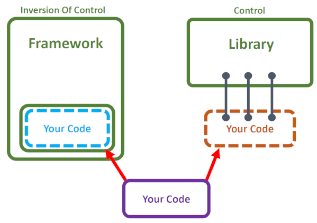
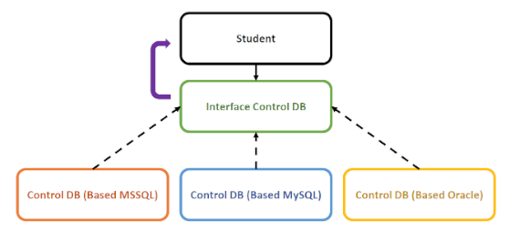
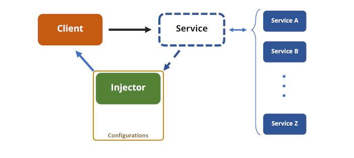
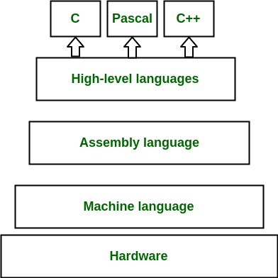

# 🅰️ مفاهیم و نکات کد نویسی

* در برنامه نویسی توصیه می‌شود که جندین return در یک تابع یا سویییچ یا فور قرار ندهیم. بهتر است دیتاهای متفاوت داخل یک پارامتر گنجانده شود و برحسب شرایط Break گردد و در انتها آن مقدار مطلوب را ریترن نماییم
* زبان‌های تفسیری مثل Perl و Scheme و TCL و زبان‌های سیستمی مثل C و C++ و Java
* QA یا `QualityAssurance` یا «تضمین کیفیت»: کیفیت در مراحل توسعه
    * تمرکز روی فرآیندها و روش‌ها مثلا:[برنامه‌ریزی][استانداردسازی][بهبود فرآیندهای توسعه نرم‌افزار]
    * شامل بررسی مستندات، ممیزی‌ها و پیاده‌سازی بهترین شیوه‌ها در توسعه نرم‌افزار
* QC یا `QualityControl` یا «کنترل کیفیت»: کیفیت در محصول نهایی(مطابق با استانداردهای کیفیت)
    * ارزیابی محصول نهایی برای شناسایی و اصلاح مشکلات و خطاها در محصول نهایی
* abs(): در برنامه‌نویسی این تابع علامت منفی را حذف میکند
* Name
    * my_age = 23 # snake case variable naming
    * myAge = 23 # camel case variable naming
    * MyAge = 23 # upper camel case
    * PI = 3.14 #برخی مغیرهای ریاضی ثابت را باید به تمام حروف بزرگ بنویسیم
*

## 🅱️ SOLID

مجموعه‌ای از اصول طراحی نرم‌افزار هستند که به بهبود قابلیت نگهداری، گسترش و خوانایی کد کمک می‌کنند

* S برگرفته از SRP یا Single Responsibility Principle: هر کلاس باید تنها یک مسئولیت داشته باشد.
    * یک کلاس باید تنها یک دلیل برای تغییر داشته باشد
    * کمک به کاهش وابستگی‌ها و افزایش قابلیت نگهداری
* O برگرفته از OCP یا Open/Closed Principle: کلاس‌ها باید برای گسترش باز و برای تغییر بسته باشند
    * قابلیت گسترش رفتار یک کلاس مشروط بر عدم تغییرکد آن کلاس
    * معمولاً با استفاده از وراثت یا الگوهای طراحی مانند استراتژی
* L برگرفته از LSP یا Liskov Substitution Principle
* I برگرفته از ISP یا Interface Segregation Principle: ترجیح استفاده از چندین «رابطه خاص» بر یک «رابطه عمومی[بزرگ]»
    * عدم استفاده از متد بدون استفاده
    * کاهش وابستگی‌ها و افزایش انعطاف‌پذیری
* D برگرفته از DIP یا Dependency Inversion Principle عدم وابستگی «ماژول‌سطح‌بالا» به «ماژول‌سطح‌پایین» ولی وابستگی هردو به انتزاعات
    * لزوم وابستگی جزئیات به انتزاعات
    * عدم وابستگی انتزاعات به جزئیات
    * کاهش وابستگی‌ها و افزایش قابلیت تست

## 🅱️ Architectural Patterns(انواع معماری‌نرم‌آفزار)

1. معماری لایه‌ای(Layered Architecture)
    * MVC[ModelViewController]
        1. لایه مدل(دیتابیس و کلاس‌ها و مدل‌ها)
        2. لایه نما(رابط کاربری)
        3. لایه کنترلر(اتصال و ارتباط بین لایه نما و مدل)
2. معماری میکروسرویس(Microservices Architecture)
    * هر سرویس مستقل از سرویس دیگر باشد و در پورت مستقل اقدام به ارائه سرویس نماید
    * هر سرویس می‌تواند با زبان مستقل برنامه‌نویسی نوشته و استقرار یابد
    * تغییر و تعویض یک سریس روی سرویس دیگر تاثیر نخواهد داشت و هر سرویس بعنوان یک ماژول مستقل عمل خواهد کرد
3. معماری تک‌صفحه‌ای(Single Page Application - SPA)
    * همه کارهایی که قرار است توسط سیستم ارائه شود تنها در یک صفحه ارائه شود
    * این مدل معمولاً با استفاده از فریم‌ورک‌هایی مانند React، Angular یا Vue.js پیاده‌سازی می‌شود.
    * تنها بخش‌هایی از صفحه به‌روزرسانی می‌شوند و وزن پردازشی در javaScript که سمت کلاینت است خواهد افتاد
4. معماری میکروفرانت‌اند(Micro Frontends): هر صفحه از رابط کاربری بصورت مستقل عمل نماید حتی از لحاظ زبان برنامه‌نویسی و تکنولوژی
5. معماری مبتنی بر API(API-First Architecture)

> به گفته فرشاد تعریف لایه کنترلر در مدل mvc: دینا اکسس (دیتابیس و ارتباط جاوایی) و لایه سرویس و منطق کسب و کار و انتیتی ها

## 🅱️ ControlType

* Direct(مستقیم): بصورت عادی برنامه یک کتابخانه را فراخوانی نموده و به آن ورودی می‌دهد و خروجی مطلوب را از آن حاصل می‌کند
    * Library: یک وظیفه خاص را برعهده می‌گیرند
        * API(تابع) های متفاوت برای آن وظیفه خاص ارائه می‌دهند
        * هر کجایی که تمایل داشته باشید می‌توانید از این توابع استفاده نمایید(ابتدا افزودن کتابخانه به کد و سپس استفاده)
        * مثلا کتابخانه‌ای نوشته شود که مجموعه عددی را به روش خاصی سورت نماید
* Inversion(کنترل‌معکوس): به حالتی که فریم‌وورک‌ها کد ما رو کنترل کنند
    * Framework: تعیین چهارچوب و نقشه راه برای پیاده‌سازی یک هدف
        * یک فریم ورک به صورت کلی یک کارایی ثابت داره
        * وقتی ما از یک فریم ورک استفاده می کنیم، یعنی فریم‌ورک کدها را تحت کنترل خودش قرار می‌دهد
        * فریم‌ورک ها یک سری موارد رو تعیین می‌کنند که برنامه‌نویس باید با کدهای خود آن را پُر کند، تا هدف مطلوب در قالب ارائه شده فریم‌ورک پیاده‌سازی شود
        * فریم‌ورک‌ها بصورت Abstract مواردی را که برنامه‌نویس نیاز دارد را تعیین و برنامه‌نویس آن را مطابق میل خویش(باتوجه به کارایی مطلوب خود) تعیین می‌کند
    * Dependency Inversion: سیستم طراحی شده کم‌ترین وابستگی را به نحوه پیاده‌سازی ماژول‌های خودش داشته باشد
        * سیستم به‌گونه‌ای طراحی شود که کم‌ترین وابستگی را به نحوه پیاده‌سازی ماژول‌های خودش داشته باشه
        * ارتباطات ماژول‌های یک سیستم با یکدیگر را به گونه‌ای از هم جدا کنیم که ماژول‌های بزرگتر وابسته به نحوه پیاده‌سازی ماژول‌های کوچک‌تر نباشند.
        * مثال: ارتباط با دیتابیس بگونه‌ای باشد که اگر دیتابیس را از ماکروسافت به اوراکل تغییر دادیم، نیاز نباشد تا کد را بصورت مجرا از اول بنویسیم یا کامپایل نماییم و فقط بخش کوچکی را تغییر دهیم
            * راه‌حل: تعریف یک اینترفیس از موارد مورد نیاز بصورت ابسترکت و سپس پیاده‌سازی آن اینترفیس توسط کلاس‌هایی با جزئیات دلخواه برنامه‌نویس
* DependencyInjection:
    * تعریف
        * برنامه با تکنیک DependencyInversion بگونه‌ای پیاده‌سازی می‌شود که ازطرف کلاینت، وابستگی‌های موردنیاز[درقالب یک «فایل‌کانفیگ» یا «کلیدومقدار»] به سرور ارسال و پاسخ متناظر با درخواست ارسال شده به کلاینت داده می‌شود
        * درخواست، مطابق با تنظیمات تزریق‌کننده(Injector)، ازسمت کلاینت اعلام می‌شود و پاسخ متناظر آن باتوجه به تنظیمات مطرح شده، به کلاینت ارسال می‌گردد
        * سیستم، یک شیء، مطابق با تنظیمات درخواستی برای کلاینت در نظر می‌گیرد و این موضوع می‌تواند
        * بعنوان مثال یک دیکشنری را در نظر بگیرید که کلمه درخواستی توسط کلاینت به سرور ارسال و پاسخ متناظر با آن کلمه تبدیل به صفحات html می‌شود و به کلاینت ارسال می‌شود
        * آفت این‌گونه تکنولوژی «کامپایل‌دوباره» برحسب تنظیمات است.
        * به سبب جلوگیری از کامپایل مجدد، فایل IOC Container را تعریف می‌کنند تا وابستگی‌ها و ارتباط میان کلاس‌ها و اینترفیس‌ها را مدیریت نماید
    * IOC Container: فایلی(مثلا json) حاوی تنظیمات وابستگی‌ها(ارتباط میان کلاس‌ها و اینترفیس‌ها) است
        * مخفف Inversion Of Control Container است
        * در فریم‌ورک‌هایی همچون Spring و ASP.net، این فایل در قالب یک json، در کنار برنامه قرار دارد
        * این فایل این امکان را فراهم می‌کند که بعد از کامپایل سیستم، بتوان اتصالات ماژول‌ها به یک‌دیگر را تغییر داد و دیگر نیازی به کامپایل مجدد نباشد.

تفاوت استفاده مستقیم از کتابخانه یا استفاده از فریم‌ورک‌ها

InversionDependency

InjectionDependency

## 🅱️ pass by value|reference

---

