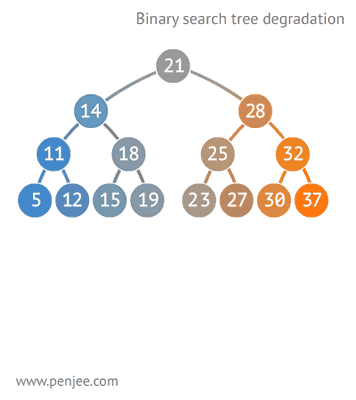
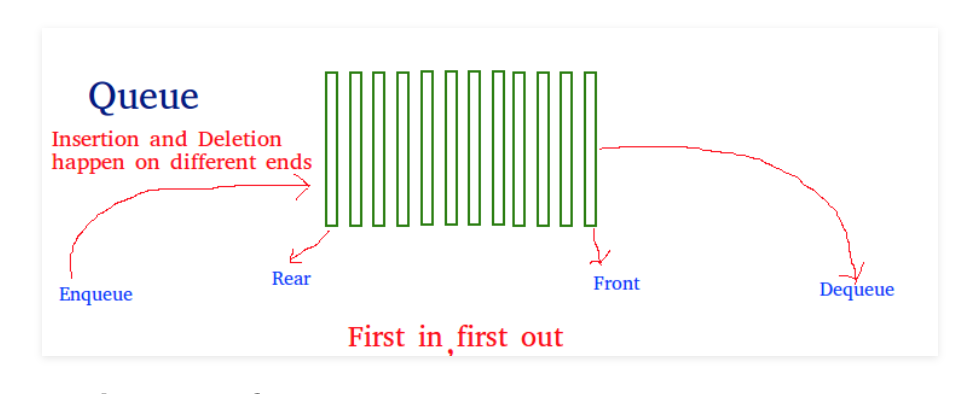
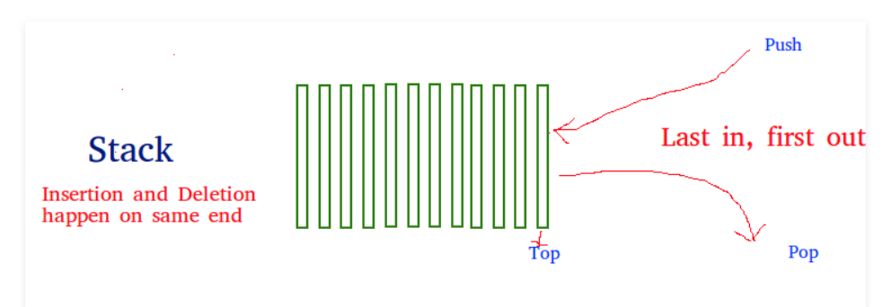
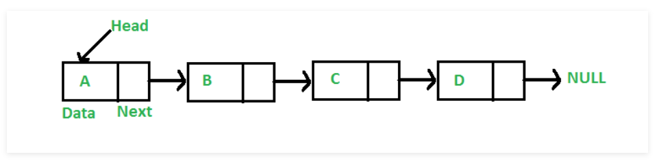
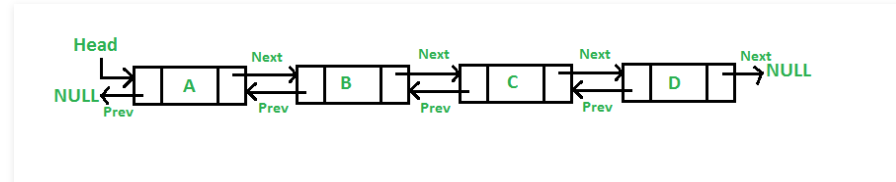
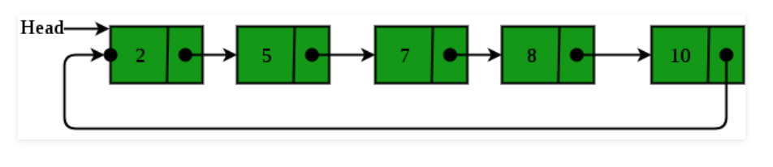

<div dir="rtl">

# 1. 🅰️ Concept and CleanCode

* در برنامه نویسی توصیه می‌شود که جندین return در یک تابع یا سویییچ یا فور قرار ندهیم. بهتر است دیتاهای متفاوت داخل یک پارامتر گنجانده شود و برحسب شرایط Break گردد و در انتها آن مقدار مطلوب را ریترن نماییم
* زبان‌های تفسیری مثل Perl و Scheme و TCL و زبان‌های سیستمی مثل C و C++ و Java
* QA یا `QualityAssurance` یا «تضمین کیفیت»: کیفیت در مراحل توسعه
    * تمرکز روی فرآیندها و روش‌ها مثلا:[برنامه‌ریزی][استانداردسازی][بهبود فرآیندهای توسعه نرم‌افزار]
    * شامل بررسی مستندات، ممیزی‌ها و پیاده‌سازی بهترین شیوه‌ها در توسعه نرم‌افزار
* QC یا `QualityControl` یا «کنترل کیفیت»: کیفیت در محصول نهایی(مطابق با استانداردهای کیفیت)
    * ارزیابی محصول نهایی برای شناسایی و اصلاح مشکلات و خطاها در محصول نهایی
* abs(): در برنامه‌نویسی این تابع علامت منفی را حذف میکند
* Name
    * my_age = 23 # snake case variable naming
    * myAge = 23 # camel case variable naming
    * MyAge = 23 # upper camel case
    * PI = 3.14 #برخی مغیرهای ریاضی ثابت را باید به تمام حروف بزرگ بنویسیم
* Erlang: یک زبان برنامه نویسی Distributed که در آن قابلیت FaultTolerance را پیاده ساز ی کرده و وقتی مشکل پیش باید برنامه متوقف نمی‌شود و کار خود را ادامه می‌دهد
    * RabbitMQ is written by "Erlang"
        * require for install RabbitMQ(open-source message-broker software)
    * Distributed language that implementationf Fault tolerance, so It continues to work when a problem occurs
* QT: فریم‌ورک برای توسعه رابط کاربری گرافیکی (GUI) در برنامه‌های نرم‌افزاری هستند
    * با زبان C++ توسعه یافته است، اما از طریق بایندینگ‌های مختلف می‌توان با زبان‌های دیگر مانند Python (با استفاده از PyQt یا PySide) نیز از آن استفاده کرد.
    * Qt بیشتر برای توسعه برنامه‌های چندپلتفرمی و با قابلیت‌های غنی مناسب است درحالی که gtk برای گنوم ولینوکسی استفاده می‌شود
    * دارای ابزار طراحی گرافیکی به نام Qt Designer است که به توسعه‌دهندگان اجازه می‌دهد تا به راحتی رابط‌های کاربری را طراحی کنند.
* برای بیان تفاوت Library و FrameWork می‌توان گفت که در شیوه کدنویسی با Library کنترل قواعد دست کدنویس است ولی در شیوه فریمورک قواعد تحت چهارچوب از قبل تعیین شده فریم‌ورک خواهد بود
    * در حالت فریمورد: فریم‌ورک کنترل را دارد و شما در قواعد آن کار می‌کنید

## 1.1. 🅱️ SOLID

مجموعه‌ای از اصول طراحی نرم‌افزار هستند که به بهبود قابلیت نگهداری، گسترش و خوانایی کد کمک می‌کنند

* S برگرفته از SRP یا Single Responsibility Principle: هر کلاس باید تنها یک مسئولیت داشته باشد.
    * یک کلاس باید تنها یک دلیل برای تغییر داشته باشد
    * کمک به کاهش وابستگی‌ها و افزایش قابلیت نگهداری
* O برگرفته از OCP یا Open/Closed Principle: کلاس‌ها باید برای گسترش باز و برای تغییر بسته باشند
    * قابلیت گسترش رفتار یک کلاس مشروط بر عدم تغییرکد آن کلاس
    * معمولاً با استفاده از وراثت یا الگوهای طراحی مانند استراتژی
* L برگرفته از LSP یا Liskov Substitution Principle
* I برگرفته از ISP یا Interface Segregation Principle: ترجیح استفاده از چندین «رابطه خاص» بر یک «رابطه عمومی[بزرگ]»
    * عدم استفاده از متد بدون استفاده
    * کاهش وابستگی‌ها و افزایش انعطاف‌پذیری
* D برگرفته از DIP یا Dependency Inversion Principle عدم وابستگی «ماژول‌سطح‌بالا» به «ماژول‌سطح‌پایین» ولی وابستگی هردو به انتزاعات
    * لزوم وابستگی جزئیات به انتزاعات
    * عدم وابستگی انتزاعات به جزئیات
    * کاهش وابستگی‌ها و افزایش قابلیت تست

# 2. 🅰️ Architectural

## 2.1. 🅱️ Architectural Patterns(انواع معماری‌نرم‌آفزار)

1. معماری لایه‌ای(Layered Architecture)
    * MVC[ModelViewController]
        1. لایه مدل(دیتابیس و کلاس‌ها و مدل‌ها)
        2. لایه نما(رابط کاربری)
        3. لایه کنترلر(اتصال و ارتباط بین لایه نما و مدل)

2. معماری میکروسرویس(Microservices Architecture)
    * هر سرویس مستقل از سرویس دیگر باشد و در پورت مستقل اقدام به ارائه سرویس نماید
    * هر سرویس می‌تواند با زبان مستقل برنامه‌نویسی نوشته و استقرار یابد
    * تغییر و تعویض یک سریس روی سرویس دیگر تاثیر نخواهد داشت و هر سرویس بعنوان یک ماژول مستقل عمل خواهد کرد
    * روشی برای تقسیم یک نرم‌افزار به بخش‌های کوچک مستقل از یکدیگر که برپایه distributed است.
    * مثلا یک سرویس برای مدیریت کاربرها و سرویس دوم برای جستجوی سایت
    * ارتباط هرکدام توسط Rest full API یا همان وب‌سرویس که بر پایه http است
    * هر سرویس می‌تواند توسط یک زبان یا تکنولوژی نوشته شود و ارتباط باهم بگیرد
    * معماری MVC و معماری چندلایه‌ای بودن نرم‌افزار ذیل معماری مونولتیک هستند و نه معماری مایکروسرویس

3. معماری تک‌صفحه‌ای(Single Page Application - SPA)
    * همه کارهایی که قرار است توسط سیستم ارائه شود تنها در یک صفحه ارائه شود
    * این مدل معمولاً با استفاده از فریم‌ورک‌هایی مانند React، Angular یا Vue.js پیاده‌سازی می‌شود.
    * تنها بخش‌هایی از صفحه به‌روزرسانی می‌شوند و وزن پردازشی در javaScript که سمت کلاینت است خواهد افتاد
4. معماری میکروفرانت‌اند(Micro Frontends): هر صفحه از رابط کاربری بصورت مستقل عمل نماید حتی از لحاظ زبان برنامه‌نویسی و تکنولوژی
5. معماری مبتنی بر API(API-First Architecture)

> به گفته فرشاد تعریف لایه کنترلر در مدل mvc: دینا اکسس (دیتابیس و ارتباط جاوایی) و لایه سرویس و منطق کسب و کار و انتیتی ها

## 2.2. 🅱️ ControlType

* Direct(مستقیم): بصورت عادی برنامه یک کتابخانه را فراخوانی نموده و به آن ورودی می‌دهد و خروجی مطلوب را از آن حاصل می‌کند
    * Library: یک وظیفه خاص را برعهده می‌گیرند
        * API(تابع) های متفاوت برای آن وظیفه خاص ارائه می‌دهند
        * هر کجایی که تمایل داشته باشید می‌توانید از این توابع استفاده نمایید(ابتدا افزودن کتابخانه به کد و سپس استفاده)
        * مثلا کتابخانه‌ای نوشته شود که مجموعه عددی را به روش خاصی سورت نماید
* Inversion(کنترل‌معکوس): به حالتی که فریم‌وورک‌ها کد ما رو کنترل کنند
    * Framework: تعیین چهارچوب و نقشه راه برای پیاده‌سازی یک هدف
        * یک فریم ورک به صورت کلی یک کارایی ثابت داره
        * وقتی ما از یک فریم ورک استفاده می کنیم، یعنی فریم‌ورک کدها را تحت کنترل خودش قرار می‌دهد
        * فریم‌ورک ها یک سری موارد رو تعیین می‌کنند که برنامه‌نویس باید با کدهای خود آن را پُر کند، تا هدف مطلوب در قالب ارائه شده فریم‌ورک پیاده‌سازی شود
        * فریم‌ورک‌ها بصورت Abstract مواردی را که برنامه‌نویس نیاز دارد را تعیین و برنامه‌نویس آن را مطابق میل خویش(باتوجه به کارایی مطلوب خود) تعیین می‌کند
    * Dependency Inversion: سیستم طراحی شده کم‌ترین وابستگی را به نحوه پیاده‌سازی ماژول‌های خودش داشته باشد
        * سیستم به‌گونه‌ای طراحی شود که کم‌ترین وابستگی را به نحوه پیاده‌سازی ماژول‌های خودش داشته باشه
        * ارتباطات ماژول‌های یک سیستم با یکدیگر را به گونه‌ای از هم جدا کنیم که ماژول‌های بزرگتر، وابسته به نحوه پیاده‌سازی ماژول‌های کوچک‌تر نباشند.
        * مثال: ارتباط با دیتابیس بگونه‌ای باشد که اگر دیتابیس را از ماکروسافت به اوراکل تغییر دادیم، نیاز نباشد تا کد را بصورت مجرا از اول بنویسیم یا کامپایل نماییم و فقط بخش کوچکی را تغییر دهیم
            * راه‌حل: تعریف یک اینترفیس از موارد مورد نیاز بصورت ابسترکت و سپس پیاده‌سازی آن اینترفیس توسط کلاس‌هایی با جزئیات دلخواه برنامه‌نویس
* DependencyInjection:
    * تعریف
        * برنامه با تکنیک DependencyInversion بگونه‌ای پیاده‌سازی می‌شود که ازطرف کلاینت، وابستگی‌های موردنیاز[درقالب یک «فایل‌کانفیگ» یا «کلیدومقدار»] به سرور ارسال و پاسخ متناظر با درخواست ارسال شده به کلاینت داده می‌شود
        * درخواست، مطابق با تنظیمات تزریق‌کننده(Injector)، ازسمت کلاینت اعلام می‌شود و پاسخ متناظر آن باتوجه به تنظیمات مطرح شده، به کلاینت ارسال می‌گردد
        * سیستم، یک شیء، مطابق با تنظیمات درخواستی برای کلاینت در نظر می‌گیرد و این موضوع می‌تواند
        * بعنوان مثال یک دیکشنری را در نظر بگیرید که کلمه درخواستی توسط کلاینت به سرور ارسال و پاسخ متناظر با آن کلمه تبدیل به صفحات html می‌شود و به کلاینت ارسال می‌شود
        * آفت این‌گونه تکنولوژی «کامپایل‌دوباره» برحسب تنظیمات است.
        * به سبب جلوگیری از کامپایل مجدد، فایل IOC Container را تعریف می‌کنند تا وابستگی‌ها و ارتباط میان کلاس‌ها و اینترفیس‌ها را مدیریت نماید
    * IOC Container: فایلی(مثلا json) حاوی تنظیمات وابستگی‌ها(ارتباط میان کلاس‌ها و اینترفیس‌ها) است
        * مخفف Inversion Of Control Container است
        * در فریم‌ورک‌هایی همچون Spring و ASP.net، این فایل در قالب یک json، در کنار برنامه قرار دارد
        * این فایل این امکان را فراهم می‌کند که بعد از کامپایل سیستم، بتوان اتصالات ماژول‌ها به یک‌دیگر را تغییر داد و دیگر نیازی به کامپایل مجدد نباشد.

تفاوت استفاده مستقیم از کتابخانه یا استفاده از فریم‌ورک‌ها


InversionDependency


InjectionDependency


# 3. 🅰️ Algorithm

> INSERTION INTO A BINARY SEARCH TREE (BST) WORKS


> DEGENERATION OF BINARY SEARCH TREE


# 4. 🅰️ Queue

* Kafka: برنامه آپاچی Kafka حجم زیاد داده را در صف نگهداری و اداره میکند(همانند rabbitMQ و ActiveMQ)
    * قابلیت‌ [کلاستر شدن] و [ماندگاری(Durability) مثل لاگ دیتا برای ماندگاری دیتا] و [Reliability] و [Fault tolerance] و [replicated] و [partitioned] و [distributed] و [Scalability] و [Zero downTime] و [Kafka-metrics برای مانیتور دیتای عملیاتی]
    * اکتیوام‌کیو و مشابه برای نگهداری دیتایهای دیتابیس و مشابه بودند ولی کافکا برای هرنوع دیتایی می‌تواند راهگشا باشد مثل Business Metrics، لاگ‌های سرویس‌ها، آمارهای سنجش عملیاتی (Operational Metrics) و …




# 5. 🅰️ LinkedList

LinkedList


DoublyLinkedList


CircularlyLinkedList



---


# 🅰️ HTTP

## 🅱️ Methods

| متد HTTP   | نام رایج         | کاربرد اصلی                 | نحوه ارسال داده                       |
|------------|------------------|-----------------------------|---------------------------------------|
| **GET**    | خواندن           | دریافت منبع (resource)      | فقط در **URL** (query params یا path) |
| **POST**   | ایجاد            | ایجاد منبع جدید             | در **body** (معمولاً JSON)            |
| **PUT**    | جایگزینی کامل    | جایگزینی کامل یک منبع موجود | در **body** (تمام فیلدها)             |
| **PATCH**  | به‌روزرسانی جزئی | به‌روزرسانی بخشی از منبع    | در **body** (فقط فیلدهای تغییریافته)  |
| **DELETE** | حذف              | حذف یک منبع                 | معمولاً **بدون body** (شناسه در URL)  |

## 🅱️Data Request/Response

### ✅️Request

#### ❇️Path Parameters

- Such as:`GET /api/users/123`
- Type: string
- Syntax: `<int:user_id>` or `{id}`
- کاربرد
    - موارد استفاده: ثابت‌ها و داده‌های ضروری
    - نباید برای فیلتر یا جستجو استفاده شود.

#### ❇️Query Parameters

- position: after `?` in URL
- مثال: `GET /api/users?role=admin&limit=10&sort=name`
- کاربرد استاندارد:
    - فیلتر کردن (?status=active)
    - جستجو (?q=ali)
    - صفحه‌بندی (?page=2&size=20)
    - مرتب‌سازی (?sort=-created_at)
    - انتخاب فیلدها (?fields=id,name,email)
- محدودیت‌ها:
    - طول URL محدود است (معمولاً ~2000 کاراکتر).
    - داده‌های حساس (مثل رمز عبور) نباید اینجا بیایند (چون در لاگ‌ها ذخیره می‌شوند).
    - Type: String(list as string)
        - ?tags=python&tags=django
        - ?["python", "django"]

#### ❇️Request Body

- جایگاه: بعد از هدرها
- کاربرد استاندارد:
    - ارسال داده‌های پیچیده یا حجیم (مثل JSON، فرم، فایل).
    - فقط در متدهای غیر Safe نظیر `POST`, `PUT`, `PATCH`, `DELETE`
- البته `DELETE` معمولاً body ندارد
- مزایا:
    - بدون محدودیت طول (نسبت به URL).
    - امن‌تر برای داده‌های حساس (با HTTPS).
    - پشتیبانی از ساختارهای پیچیده (آبجکت، آرایه، تودرتو).

فرمت‌های رایج

| `Content-Type`                      | کاربرد                             |
|-------------------------------------|------------------------------------|
| `application/json`                  | APIهای مدرن (داده‌های ساختاریافته) |
| `application/x-www-form-urlencoded` | فرم‌های HTML ساده                  |
| `multipart/form-data`               | آپلود فایل + داده                  |
| `text/plain`                        | متن ساده (نادر)                    |

```json
POST /api/users
Content-Type: application/json

{
"name": "Ali",
"email": "ali@example.com"
}
```

#### ❇️HTTP Headers

بعنوان متادیتا لحاظ می‌شوند و نه دیتای اصلی کسب و کار. یعنی نباید دیتای اصلی را توسط آن ارسال کرد(مگر در موارد خاص مثل `X-Request-ID`)

- `Authorization: Bearer <token>` -------------------------------> Authentication
- `Content-Type: application/json`
- `Accept-Language: fa-IR`
- `User-Agent` --------------------------------------------------> Client Data
- CORS: `Origin` ,  `Access-Control-Request-Method`

#### ❇️Cookies

- position: on header
  - `Cookie: name=value; sessionid=abc123`
- ذخیره تنظیمات کلاینت نظیر زبان کلاینت 
- با Flag های HttpOnly, Secure, SameSite محافظت شوند.
- در APIهای مدرن (Token-based) کمتر استفاده می‌شوند.

### ✅️Response

#### ❇️Response Body

- بازگرداندن داده‌های درخواستی (JSON, XML, HTML, فایل و ...)

```json
HTTP/1.1 200 OK
Content-Type: application/json

{
  "id": 123,
  "name": "Ali",
  "email": "ali@example.com"
}
```

استاندارد پاسخ خطا

````json
{
  "error": {
    "code": "invalid_email",
    "message": "آدرس ایمیل نامعتبر است.",
    "field": "email"
  }
}
````


#### ❇️Response Headers

- `Content-Type`: نوع بدنه
  - `application/json`
- `Location`
  - `201 Created`: آدرس منبع جدید پس از ایجاد
- `Set-Cookie`: تنظیما کوکی جدید
- `Cache-Control`: سیاست کش
- `WWW-Authenticate`: درخواست‌های احراز هویت

```
HTTP/1.1 201 Created
Location: /api/users/123
Content-Type: application/json
```
#### ❇️Status Code

انتقال وضعیت عملیات بدون نیاز به بدنه


- 2xx
- 3xx
- 4xx
- 5xx
- 


</div>