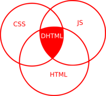

# 🅰️ مفاهیم و نکات

* نکته‌مهم: React کتابخانه است و Next.js فریمورک است
* SSR یعنی Server Side Rendering : صفحه اولیه وب رو روی سرور درست می‌کنیم، بعد اون رو به مرورگر می‌فرستیم
    * سرور HTML آماده می‌فرسته
    * SEO قوی
    * سرعت لود اولیه:‌ سریعتر (HTML آماده)
* CSR یعنی Client Side Rendering : صفحه روی مرورگر کاربر ساخته می‌شود.
    * مرورگر کاربر کد رو اجرا می‌کند
    * SEO ضعیف
    * سرعت لود اولیه:‌ کمتر (چون JSON باید بیاد)

* Reaact.js
    * یک Library است
    * فقط برای ساخت UI
    * باید خودت بقیه چیزها رو بهش اضافه کنی
* NextReact|Next.js
    * یک فریم‌ورک است(Framework)
    * برپایه React.js است
    * تمام ابزارهای لازم رو داره (روتینگ، SSR، API و ...)
    * برای پروژه‌های حرفه‌ای و تجاری
* ReactNative
    * یک فریم‌ورک است(Framework)

