 <div dir="rtl">

# 1. 🅰️ مفاهیم و تعریف‌ها

* طراحی اولیه جاوا به سال ۱۹۹۱ برمی‌گردد و اولین نسخه جاوا توسط شرکت «سان‌میکروسیستم» در سال ۱۹۹۵ منتشر شد و شرکت سان توسط شرکت اوراکل در سال ۲۰۱۰ خریداری شد
* نسخه‌های حاوا
    * J2SE: یعنی نسخه دوم از جاوای Standard Edition
    * J2ME: یعنی نسخه دوم از جاوای Micro Edition
    * J2EE: یعنی نسخه دوم از جاوای Enterprise Edition

```
JDK Alpha and Beta (1995)
JDK 1.0 (January 21, 1996)
JDK 1.1 (February 19, 1997)
J2SE 1.2 (December 8, 1998)=Java2StandardEditiom
J2SE 1.3 (May 8, 2000)
J2SE 1.4 (February 6, 2002)
Java SE 5.0 (September 30, 2004)
Java SE 6 (December 11, 2006)
Java SE 7 (July 28, 2011)
Java SE 8 (March 18, 2014)
```

* **JavaSE**: مخفف عبارت JavaStandardEdition است.
* **JavaEE**: مخفف عبارت JavaEnterpriseEdition است.
* **JME** یا JavaME: مخفف عبارت Java Micro/Mobile Edition و عنوان خیلی کوچک‌شده از جاوا حتی کوچکتر از JavaCore که برای استفاده جاوا در دستگاه‌های الکترونیکی بکار می‌رود.
* **JDK**: مخفف JavaDevelopmentKit است و نرم افزاری است که به کاربر اجازه اجرا و کامپایل برنامه‌های جاوا را می‌دهد. (بدرد برنامه نویسان جاوا میخوره)
* **JRE**: مخفف عبارت JavaRuntimeEnvironment است.
* بخش کوچکی از JDK که فقط برای اجرای یک برنامه جاوا احتیاج است و شامل موارد موجود در jdk نیست
* **Javac**: مخفف عبارت Java Compiler است
* **IDE**: مخفف عبارت IntegratedDevelopmentEnvironment است. محیط‌هایی که مجموعه‌ای از امکانات مورد نیاز برنامه‌نویس را بصورت یکپارچه همانند یک جعبه‌ابزار فراهم می‌کنند. معروف‌ترین‌های آن نظیر: Eclipse یا NetBeans یا IntelliJ IDEA
* **Indentation**: دندانه‌گذاری یا همان تورفتگی در دستورات کد جهت ظاهر زیبای قطعه کد نوشته شده
* پیمایش: اگر عملی را روی تک تک عناصر یک آرایه انجام دهیم به اینکار پیمایش آرایه می‌گویند
* **Jshell**: قابلیتی که از جاوای۹ به بعد آمده و اجازه می‌دهد کدهای کوچک که در حد اسکریتی است را بدون ساختن کلاس تست کنیم.
    * که در IDE IntelliJ در مسیر Tools>JshellConsole قرار دارد
* **JavaEESpecification**: مجموعه‌ای از SubModule هایی که در جاوا نوشته شده است و درکنار هم یک پلتفرم را مهیا کرده است. درواقع با گفتم javaEE منظور مجموعه‌ای از Specificationها است
* JAR file: یک زیپ فایل که مخفف Java Archive است
* WAR file: یک زیپ فایل که مخفف Web Archive است
    * اگر بخواهید فایل html یا css یا فایل‌های مختلف داشته باشید باید کنار فایل war قرار بدید
* EAR file:  یک زیپ فایل که مخفف Enterprise Archive است. برنامه اینترپرایزی که هم Jar و هم War دارد و اگر بخواهیم از هر دو استفاده نماییم
    * تامکت یا Jetti نمی‌تواند این گزینه را باز نمایند
* **EJB**: بدون دخالت وب بتوان توسط ماژول‌های جاوا برنامه اینترپرایز تولید کرد.مثلا: به دیتابیس وصل شد و عملیات CRUD انجام داد
* **ConnectionPool**: در مواردی که تعداد کانکشن‌ها زیاد است با باز نگهداشتن مینیمم مثلا ۵ کانکشن بصورت StandBy می‌توانیم Cost را کاهش دهیم و هرگاه نیاز به کانکشن شد آن را اختصاص دهیم یعنی باز نگهداشنت ۵ کانکشن کم‌هزینه‌تر است از مداوما باز و بستن کانکشن در دفعات بالا
* **DML(Data Manipulation Language)**: شامل ۱-آپدیت ۲-دیلیت ۳-اینسرت است
* **Security**: برقراری امنیت در سطح متد یا کاربر یا وب برقرار می‌کند
* **DependencyInjection**:
    * قابلیت مدیریت و ارائه سرویس به کلایت، مطابق با تنظیمات درخواستی آن کلاینت، در سطوح ارتباطات ماژول‌ها و کلاس‌ها و اینترفیس‌ها و اشیاء(البته تکنولوزی خواسته شده از طرف کلاینت، باید در دسترس جاوا باشد)
    * تزریق وابستگی‌ها به کد، از طریق تکنولوژی‌ها و نمونه‌های موجود در دسترس
    * مشابه CDI یا Context Dependency Injection در JavaEE
* **Transactions**: مدیریت تمامی تراکنش‌های سطوح دیتابیس بطوری که دیگر کامیت یا RollBack توسط کاربر صورت نگیرد.
    * سبب مانیتورینگ بهتر روی تراکنش‌ها می‌شود
    * مدیریت بهتر تعداد کانکشن‌های باز
    * ایجاد تراکنش بین چند سرور بصورت قراردادی
* **JMS(JavaMessageService)**: سرویسی است که اجازه می‌دهد بین اپ‌های مختلف درحال اجرا در یک سرور، پیام رد و بدل نمایید
* **Persistence**: جهت سهولت در استفاده از دیتابیس برای delete و update و insert و select بدون اینکه درگیر sql statementها باشیم
    * Persistence یک JPA یا Java Persistence API محسوب می‌شود
    * مثلا در هایبرنیت(پایگاه‌داده)سبب اتصال شی‌گرایی به دیتابیس است
    * سبب کندتر شدن سیستم می‌شود ولی نگهداری سیستم و خطا کاهش می‌یابد
* **JavaMail**: افزودن قابلیت Email به برنامه‌های جاوایی در سطوح Enterprise
* **Connector**: امکان اتصال سرورهای BPMS مجزا به سرویس‌های نوشته شده جاوایی
    * **BPMS(BusinessProcessManagementSystem)**  به معنی «اتوماتیک کردن و مکانیزاسیون فرآیندهای کسب و کار»
* **JDBC**: یک API برای اتصال از طریق جاوا به دیتابیس

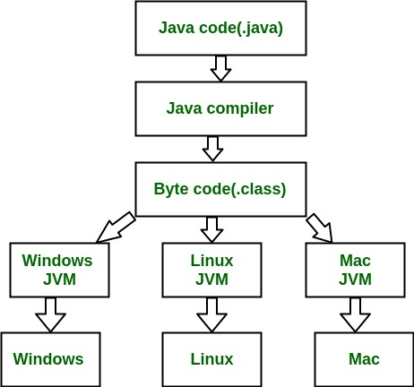

## 1.1. 🅱️ نکات

* ترتیب اجرای برنامه‌ها به صورت زیر است
    * [Fortran, C ,Pascal] > HighLevelLanguage > AssemblyLanguage > MachineLanguage > hardware
* زبان جاوا برای اجرا بصورت زیر عمل می‌نماید:
    * JVM > ByteCode(.class) < JavacCompiler < JavaCode(.Java) < UserInterface
* زبان‌های برنامه‌نویسی نظیر **Scala** و **Groovy** برای ران شدن نیاز به وجود **JVM** دارند
* بازه عددی متغیر int عددی بین منفی ۲ به توان 31 تا یک عدد کمتر از مثبت ۲ به توان ۳۱ است.
* برای استفاده از اعدادکوچکتر از int می‌توان از short یا byte نیز استفاده نمود
* نکته: در جاوا وقتی از /** استفاده می‌نماییم یعنی داکیومنت کنونی با جاواداک در ارتباnh;gdfgdfط است
* نکته:برای اینکه بدانیم یک متغیر در کجاها در workspace استفاده شده است می‌توانیم روی محل تعریف یک متغیر راست کلیک کرده و از گزینه‌های موجود references را باز کرده و از زیرمنوی workspace استفاده نماییم.
* نکته: برای رفتن به مکان تعریف یک متغیر یا کلاس یا متد یا غیره از کلید F3 استفاده می‌شود
* برای ایجاد کامنت از شیوه زیر استفاده می‌شود
  ```java
  //This is a temporary variable
  or
  /* Data */
    ```

## 🅱️ نام‌گذاری

* بصورت کلی پیشنهاد می‌شود که در نامگذاری‌ها از فعل استفاده نشود.
* جاوا به حروف بزرگ و کوچک حساس می‌باشد که اصطلاحا می‌گویند جاوا CaseSensitive Name است
    * **بسته‌ها**: همه حروف کوچک مثل com.sun.eng
    * **کلاس‌ها**: Camel Case یعنی با حروف بزرگ شروع شود و همه حروف اول کلمه بزرگ و بقیه کوچک
        * مثل: ImageSprite یا Raster یا StreamReader و غیره
        * از اسم برای نام‌گذاری استفاده نمایید
* **متدها**: شروع با حروف کوچک و سپس ادامه در وضعیت Camel Case
    * مثل: getBackground یا runFast و غیره
    * از فعل برای نام‌گذاری استفاده نمایید
* **متغیرها**: شروع با حرف کوچک و ادامه با الگوی «کوهان‌شتر»
    * مثل: myWidth یا maxNumber
* **ثابت‌ها**: همه حروف بزرگ، کلمات مختلف در نام با Undeline جدا شوند
    * مثل: MIN_WIDTH
* برای کلاس‌ها و متغیرها و متدها از اسامی با معنی و گویا استفاده شود و نام‌هایی از قبیل زیر مناسب نیستند:
    * a, b, c, x, y, z, a1, var1, var2, method1, Class, MyClass, myMethod
* برای متغیرهای شمارنده مثل استفاده در حلقه for نام‌هایی مثل i و j اشکالی ندارد
* اگر از نام‌های مناسب استفاده شود ممکن است نیاز به جاواداک را کمتر نماید

## 🅱️ انواع متغیرها

* **انواع داده‌اولیه یا Primitive Data Types**: همانند داده‌هایی از نوع Byte یا Short یا Int یا Long یا Float یا Double یا Boolean یا Char که هر متغیر از این انواع، حاوی یک مقدار است و شیء نیست و حتی به شیء نیز اشاره نمی‌کند. بلکه مستقیماً یک مقدار را نگهداری می‌کنند. همچنین امکان استفاده از new ندارند.
* **انواع داده ارتجاعی یا Reference Data Types**: همانند داده‌هایی از نوع String یا Scanner یا مشابه که از نوع کلاس هستند یا کلاس‌هایی که ما خودمان ایجاد میکنیم نظیر Book یا Person یا غیره که هر متغیر از این انواع ارجاع به شیء است. همچنین از new باید استفاده شود
* اگر عدد از نوع double باشد برای اینکه تصریح کنیم که عدد از نوع double است می‌توانیم در انتهای عدد یک علامت d بگذاریم

```java
d=4763.129837D; //تصریح اینکه متغیر از نوع دابل است
f=4763.129837F; //تصریح اینکه متغیر از نوع فلوت است
l=4763.129837L; //تصریح اینکه متغیر از نوع لانگ است 
```

```java

int a=12;
b=--a; //اول مقدار «آ» که ۱۲ هست را به ۱۱ تغییر بده و بعد آن را به «بی» وارد کن
```

```java
int a=12; 
b=a--; //اول مقدار «a» را که ۱۲ هست به «بی» وارد کن و سپس یک واحد از عدد ۱۲ کم کن
```

* نمونه «تبدیل‌داده» Type Cast در جاوا

```java
int varINT=2;
long varLONG=20;
varINT = (int) varLONG;
```

* برخی اعداد

```java
double x = Double.NaN
double x = Double.NEGATIVE_INFINITY
double x = Double.POSITIVE_INFINITY
double x = Double.MAX_VALUE
int x = Integer.MAX_VALUE
```

## 1.2. 🅱️ JDK

* [URL](https://linuxtech.blog.ir/post/143)
* ابتدا توسط دستورات زیر از ورژن کنونی جاوای خود آگاه شوید:

```shell
java -version
//output:
//       openjdk version "17.0.6" 2023-01-17
//       OpenJDK Runtime Environment (build 17.0.6+10-Debian-1deb11u1)
//       OpenJDK 64-Bit Server VM (build 17.0.6+10-Debian-1deb11u1, mixed mode, sharing)
```

### 1.2.1. ✅️ Install

* ابتدا باید نرم‌افزار oracle jdk را دانلود نمایید. [URL](https://www.oracle.com/java/technologies/javase/javase8-archive-downloads.html) یا [URL](https://www.cs.ait.ac.th/~marikhu/installers/)
* اگر در سیستم شما هیچ نسخه‌ای وجود نداردآنگاه توسط دستور زیر اقدام نمایید

```shell
sudo update-alternatives --install "/usr/bin/java" "java" "/opt/<DIRECTORY>/bin/java" 1 #JRE
sudo update-alternatives --install "/usr/bin/javac" "javac" "/opt/<DIRECTORY>/bin/javac" 1 #JDK
sudo update-alternatives --install "/usr/bin/javaws" "javaws" "/opt/<DIRECTORY>/bin/javaws" 1 #Web
```

* نکته: عدد صفر میزان اولویت را تعیین می‌کند که این ورژن که نصب می‌شود تحت چه اولویت در سیستم استفاده قرار گیرد
* توسط دستور زیر نسخه‌های موجود در سیستم به نمایش درآمده و نیز می‌توان نسخه پیش‌فرض سیستم را انتخاب نمود:

```shell
sudo update-alternatives --config java
sudo update-alternatives --config javac
sudo update-alternatives --config javaws
```

* توسط دستور زیر از وجود ورژن‌های قبلی آگاه شوید

```shell
java -version
sudo update-alternatives --list java
sudo update-alternatives --list javac
sudo update-alternatives --list javaws
```

* توسط دستور زیر می‌توانیم یک ورژن جدید به سیستم بیافزاییم

```shell
sudo update-alternatives --set java <PATH>
sudo update-alternatives --set javac <PATH>
sudo update-alternatives --set javaws <PATH>
```

### 1.2.2. ✅️ Remove

برای حذف یک نسخه از جاوا بهتر است از دستور زیر اقدام نمایید

* گام اول: مشاهده نسخه ها به همراه مسیرهای آنها

```shell
java -version
sudo update-alternatives --list java
sudo update-alternatives --list javac
sudo update-alternatives --list javaws
```

* گام دوم: حذف نسخه مورد نظر توسط ارائه مسیر آن ورژن

```shell
sudo update-alternatives --remove java <Path>
sudo update-alternatives --remove javac <Path>
sudo update-alternatives --remove javaws <Path>

#example:
sudo update-alternatives --remove java /opt/java8/bin/java
```

* گام سوم: تعیین نسخه مطلوب باقیمانده از نسخه‌های جاوا بعنوان پیش‌فرض

```shell
sudo update-alternatives --config java
sudo update-alternatives --config javac
sudo update-alternatives --config javaws
```

### 1.2.3. ✅️ JavaWebStart

* در ورژن‌های شماره ۷ یا ۸ مورد javaws یا java web start وجود داشت ولی در ورژن‌های بالاتر این مورد وجود ندارد که برای این کار با نصب بسته icedtea می‌توانیم javaws را به سیستم معرفی کنیم

```shell
sudo apt install icedtea-netx 
sudo yum install icedtea-web
````

* در این صورت برنامه‌های با فرمت jnlp می‌توانیم با دستور زیر اجرا نماییم

```shell
/usr/bin/javaws /tmp/launch.jnlp 
```

## 1.3. 🅱️ HelloWorld

برای نوشتن یک برنامه ساده به روش زیر عمل می‌نماییم:

```java
vim First.java
Public class First {
public static void main(String[] args) {
System.out.println("اولین برنامه !!!")
}
}
```

برای کامپایل کردن یک برنامه جاوا نوشته شده از دستور زیر استفاده می‌نماییم:

```java
javac First.java
```

در این صورت اگر برنامه به درستی نوشته شده باشد فایل کامپایل شده آن بصورت First. Class ساخته می‌شود. دراین‌صورت باید با دستور زیر برنامه را اجرا کنیم:

```java
java First
```

نکته: اسم کلاس باید دقیقا با اسم فایل منطبق باشد

# 2. 🅰️ JavaVirtualMachine

* یک برنامه نوشته شده به زبان C است که بعنوان یک میان افزار تلقی می‌شود
* هر برنامه در جاوا بر روی JVM اجرا می‌شود
* نکته: در قطعه کد زیر موارد اشاره شده در حافظه‌های متناظر قرار می‌گیرند:
  ```java
  public static void swapNames(Students s1, Students s2) {
  String tmp = s1.name;
  s1.name = s2.name;
  s2.name = tmp;
  int numbers = 5;
  }
  ```

* حافظه Stack متغیرهایی نظیر number و tmp و s2 و s1 را در خود جای می‌دهد که متغیر number مقدار نگهداری می‌کند ولی موارد دیگر آدرس(شیء) را نگهداری می‌کنند
* حافظه Heap مو اردی نظیر : آدرس جایی که number و tmp و s2 و s1 دارند به آن اشاره میکنند
* MemoryLeak یا نشت‌حافظه: تحت اختیار گرفتم حافظه رَم توسط برنامه و عدم توانایی آزادکردن و برگرداندن آن و درپی آن مواجه با کمبود رم

## 2.1. 🅱️ حافظه Heap

* همه اشیاء در بخشی از حافظه بنام Heap در رم ذخیره می‌شود
* عملگر new حافظه را در بخشی بنام Heap ایجاد می‌کند.
* هر شیء که new می‌شود روی Heap قرار می‌گیرد
* برای تعیین اندازه اولیه Heap از عبارت Xms استفاده می‌شود.
* حافظه Heap در زمان تعریف یک متغیر، به آدرس متغیر اشاره می‌کند
    * java -Xms512m -Xmx375m Person
* برای تعیین حداکثر اندازهHeap از عبارت Xmx استفاده می‌شود.
    * Java -Xmx3750m -Xss4m Main
* بطور مثال:
*

```java
java person #فراخوانی کلاس پرسن
java -Xms512m -Xmx375m Person
Java -Xmx3750m -Xss4m Main
```

نکته: اگر برنامه‌ای اشیاء فراوانی را new نماید ممکن است با ارور Java Heap Space روبرو شویم یعنی یک ارور از نوع:
`OutOfMemoryError: Java heap space`

### 2.1.1. ✅️ Garbage Collection

* موجودیت Garbage Collector که بخشی از jvm است بدون نیاز به دخالت برنامه‌نویس قابلیت شناسایی و آزادسازی حافظه Heap از اشیاء ساخته شده که دیگر در برنامه دیگر مورد استفاده قرار نمی‌گیرد را دارد.
* زباله روب یا همان Garbage Collection فقط درباره حافظه هست. و نمی‌تواند منابعی مثل فایل را که توسط یک شیء باز شده است را آزاد سازی نماید.
* بدون نیاز به دخالت برنامه‌نویس قابلیت پاکسازی حافظه را دارد(تنها درمورد حافظه است
    * نمی‌تواند منابعی مثل فایل که توسط یک شیء باز شده‌است را آزادسازی‌نماید

## 2.2. 🅱️ حافظه Stack

* حافظه Stack در زمان تعریف یک متغیر، مقادیر را نگهداری می‌کند
* متغیرهای محلی هر متد در این حافظه قرار خواهند گرفت.
* وقتی یک متد فراخوانی می‌شود به تعداد متغیرهای محلی آن در Stack فضا اشغال می‌شود و وقتی این متد تمام شد حافظه های اختصاص داده شده آزاد خواهد شد
* آزادسازی حافظه استک بصورت خودکار در تمامی زبان‌های برنامه نویسی وجود دارد و کاری سبک و پیچیده نیست
* برای تعیین حداکثر اندازهStack از عبارت Xss استفاده می‌شود.
* اگر یک متد را بصورت بازگشتی صدا بزنیم طوریکه هیچ شرط پایانی نداشته باشد، آنگاه با ارور Stack Overflow روبرو خواهیم شد

```java
java person #فراخوانی کلاس پرسن
java -Xss4m person
Java -Xmx3750m -Xss4m Main
```

* نکته: اگر یک متد را بصورت بازگشتی صدا بزنیم طوریکه هیچ شرط پایانی نداشته باشد، آنگاه با ارور Stack Overflow روبرو خواهیم شد

```java
int Func(int i){
return Func(i+1);
}
```

## 2.3. 🅱️ ClassLoader

* وقتی کلاسی را برای اولین‌بار مورد استفاده قرار می‌دهیم، بخشی از JVM بنام Class Loader این کلاس را در قسمتی از حافظه بارگذاری می‌کند که بخشی از این حافظه مختص متغیرهای استاتیک آن کلاس خواهد بود.
* هنگام فراخوانی یک کلاس، ClassLoader این کلاس در قسمتی از حافظه بارگزاری می‌شود که بخشی از آن مختص متغیرهای استاتیک کلاس است.

## 2.4. 🅱️ ClassPath

* یک پارامتر برای کامپایلر جاوا یا JVM هست.
* مشخص می‌کند در چه محل‌هایی به دنبال کلاس‌ها و بسته‌ها بگردند
* این پارامتر به دستور java یا javac پاس می‌شود
* یا اینکه بصورت یک متغیر محیطی Environment Variable تعریف می‌شود
* همچنین محل کلاس‌های موجود در زبان جاوا نیازی به معرفی در Class Path ندارند مثل String
* با مفهوم path اشتباه نگیرید
* path مربوط به سیستم عامل است و محل فایل‌های اجرایی را مشخص می‌کند
* با مفهوم Working Directory اشتباه نگیرید(دایرکتوری که برنامه در آن مسیر دارد اجرا می‌شود)
* عبارت زیر یعنی وقتی جاوا دارد اجرا می‌شود باید فولدر myprogram را بگردد تا بتواند کلاس HellowWorld را پیدا نماید. بعبارتی یعنی کلاس‌های ما در مسیر /home/user/myprogram قرار دارند و اسم کامل کلاس هم org.mypackage.HellowWorld نام دارد.

```shell
Windows: java -cp D:\myprogram org.mypackage.HellowWorld
LINUC: java -cp /home/user/myprogram org.mypackage.HellowWorld
```

میتوان از متغیر محیطی استفاده کرد:

```shell
set CLASSPATH=D:\myprogram
java org.mypackage.HelloWorld
```

تعیین چندین فولدر یا JAR در مسیر classpath:

```shell
java -cp D:\myprogram;d:\lib\support.jar org.mypackage.HellowWorld
```

* برای جداکردن بخش‌های مختلف cp در لینوکس از کاراکتر : و در ویندوز از کاراکتر ; استفاده می‌شود.
* عبارت خط cp- معادلclasspath- است.
* استفاده از چندین فایل JAR و شاخه جاری به عنوان cp:

```shell
java -classpath ‘.:/mylib/*’ MyApp
```

## 2.5. 🅱️ Meta Space و Perm Gen(Permanent Generation)

* بخشی از حافظه مسئول نگهداری اشیاء از قبیل «شیءکلاس» یا «ClassObject» است.
* قبل از نسخه۸ جاوا اطلاعات کلاس‌ها (شیء کلاس) د ربخشی بنام PermGen دخیره می‌شد
* اگر پروژه بسیار بزرگ داشته باشیم ممکن است این فضا پر شود و با خطای Out Of Memory Error مواجه شویم(برنامه‌ای که کلاس‌های زیادی شامل کتابخانه‌ها و فایل‌های Jar متنوع باشد)
* حجم حافظه PermGen قابل تنظیم است

```shell
java -XX:MaxPermSize=512m MyClass
```

* بعد از جاوا8 اطلاعات مربوط به کلاس‌ها در Meta Space نگهداری می‌شود و PermGen به کلی حذف شده است و دیگر نیازی به تنظیم اندازه PermGen نداریم.

## 2.6. 🅱️ مفاهیم پایه

دستورات زیر برای چاپ در کنسول هست:

```java
System.out.println(a);
System.out.print(X);
System.out.println(a*6+1);
```

### 2.6.1. ✅️ دستورات شرطی

اگر شرط درست باشد مقدار value_true اجرا شود و اگر نبود مقدار value_false به اجرا در بیاید

```java
TYPE value = CONDITION ? value_true : value_false;
```

عبارت زیر یعنی:یعنی اگر مقدار area از ۱۰ بزرگتر بود مقدار value برابر بشود با 1 وگرنه مقدار آن بشود منفی یک

```java
area=5;
int value = area > 10 ? 1 :-1;
```

عبارت زیر معادل عبارت استفاده شده در بالا است:

```java
if (condition) {
statements;
} else if (condition) {
statements;
} else {
statements;
}
```

حالت Switch نیز به گونه زیر است

```java
switch (I) {
    case 1:
        Commands;
        break;
    case 2:
        Commands;
        break;
    case 3:
        Commands;
        break;
        …
    default:
        Commands;
    } 
```

```java
List<ClassName> list=new ArrayList<>();
while (){
   ClassName obj=new ClassName(); #آبجکت را پر می‌کنیم
   list.add(obj)}

for(ClassName obj: list){
    System.out.println(obj
    }
```

* ترجیحاً برای مقایسه اعداد اعشاری از عملگر == یا =! استفاده نشود

### 2.6.2. ✅️ حلقه‌ها

```java
//For
for (opration ; Condition ; opration){دستورات}
for (int i=1;i<=10;i++){}
for(String s : array)
System.out.println(s);

//do while
long counter=0;
do{
counter++;
System.out.println(counter);
}while(counter<10);

//while
long counter=1;
while(counter<10){
System.out.println(counter);
counter++;
}
```

### 2.6.3. ✅️ JarFile

* عبارت JAR مخفف Java Archive است.
* بطور معمول یک فایل jar شامل کلاس‌هایی با پسوند نقطه class هستند(و احتمالاً فایل‌های تکمیلی و فایل‌های تنظیماتی)
* معمولاً متن برنامه‌ها (فایل‌های پسوند java) در فایل Jar گنجانده نمی‌شوند
* برای ایجاد فایل jar میتوان از دستور زیر استفاده کرد:
  ```java
  jar cf <JarFile> <Input Files>
  ```
    * **JarFile**: نام فایل جری که میخواهیم ایجاد کنیم
    * **InputFiles**: مجموعه برنامه‌های که قرار است در فایل جر ضمیمه شوند
* همچنین ابزارهایی نظیر Eclipse و Ant و Maven نیز میتوانند این کار را انجام دهند

### 2.6.4. ✅️ bytecode

* فایل کامپایل شده را ByteCode می‌گویند.
* فایل با پسوند class که معمولا یک فایلjar شامل کلاس‌هایی با پسوند نقطه class است.
* با کمک دستور javap (در JDK هست) می‌توانیم bytecode یک کلاس را ببینیم.(صفحه مشکی در مثال زیر)
* مثال: کلاس زیر که توسط کامپایلر کامپایل شده است، در ایجاد دو متغیر g1 و g2 به یک شکل ترجمه نموده است.

```java
public class Generic<T> {
void f() {
Generic<String> g1;
g1 = new Generic<String>();
Generic<Integer> g2;
g2 = new Generic<Integer>();
}
}
```

شکل زیر نمونه بایت‌کد کلاس بالا است.

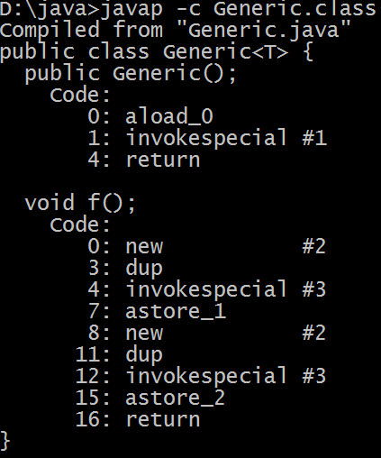

در شکل سیاه‌رنگ خطوط شماره 10و11و12و13 از خط شماره۴موجود در کلاس حاصل شده است(از عبارت new تا عبارت astore_1) و همچنین خطوط شماره 14و15و16و17 از خط شماره6 موجود در کلاس حاصل شده است(از عبارت new تا عبارت astore_2) که نشان می‌دهد در حالت generic به ازای هر نوع داده با طرز رفتار یکسان مواجه خواهیم بود.

---

# 3. 🅰️ شیءگرایی و مفاهیم شیء

## 3.1. 🅱️ مقداردهی اولیه

* ترتیب «مقداردهی‌اولیه» به «یک‌شیء» ساخته شده از کلاس بصورت زیر است:
    * همه مقداردهی‌هایی که‌در خطوط کلاس قراردارد(Inline Initialization) مثلاً خط اول یا دوم یک متغیر ایجاد و مقداردهی‌کنیم
    * همه بلوک‌های مقدار دهی اولیه یا Initialization Block ها(معمول نیست که در یک کلاس چند بلوک مقداردهی اولیه داشته باشیم)
    * یکی از توابع سازنده(همانی که صدا زده شده است)
* ترتیب «مقداردهی‌اولیه» به یک شیء از «کلاس‌حاوی‌ویژگی‌استاتیک» بصورت زیر خواهد بود.
    * اول: مقداردهی به متغیرهای استاتیک
* نمونه مثال مقدار دهی در خط:

```java
public static int MAX_AGE = 150;
private static double PI = 3.14;
static String defaultName = theDefaultName();
private static String theDefaultName() {return "Ali Alavi";}
```

* دوم:مقداردهی به متغیرهای استاتیک توسط «بلوک‌استاتیک» یا Static Block

نمونه مثال استفاده از بلوک استاتیک یا همان Static Block

```java
public class Person {
public static int MAX_AGE ;
private static double PI ;
static String defaultName ;
private static String theDefaultName() {return "Ali Alavi";}
static{
MAX_AGE = 150;
PI = 3.14;
String s = theDefaultName();
if(s != null)
defaultName = theDefaultName();
}
}
```

* سوم: اقداماتی که مربوط به هر شیء است(فرض شود ویژگی استاتیک نداریم) انجام می‌شود که شامل زیر است:
    * مقداردهی به هرویزگی به ازای ایجاد هر شیء
    * مقداردهی Inline یا همان در خط به ویژگی‌ها
    * «بلوک‌مقداردهی‌اولیه» یا Instance Initialization Block
    * تابع سازنده یا Constructor
* فرض شود بخواهیم تعداد اشیاء زنده از یک کلاس را بدانیم، می‌توان این موضوع را توسط یک ویژگی استاتیک مدیریت نمود. باتوجه به قطعه کد زیر، توجه نمایید:

```java
public class LiveObjects {
private static int liveInstances = 0;
{
liveInstances++;
}
public static int getLiveInstances() {
return liveInstances;
}
protected void finalize() {
liveInstances--;
}
}
```

* توضیحات قطعه کد به شرح زیر است:
    * ویژگی liveInstances: استاتیک است زیرا ویژگی کل کلاس است و مختص یک شیء نیست و کل کلاس در هر زمان باید بداند که چند شیء زنده وجود دارد. از نوع Private است زیرا باید دسترسی محدود باشد تا کسی نتواند از بیرون عدد را تغییر دهد.
    * «بلوک‌مقداردهی‌اولیه» بابت اینکه هربار شیء ساخته شود پس دستورات بلاک انجام شود، پس یک واحد به این متغیر افزوده شود
    * متد getLiveInstances یک Getter برای ویژگی liveInstances است. از نوع استاتیک است زیرا متدی است که برای خود کلاس قرار است استفاده شود و نه مختص یک شیءخاص و public است زیرا هرکسی بخواهد بتواند این متد را فراخوانی کند
    * متد finalize: هرگاه Garbage Collector بخواهد شیء را حذف کند و دور بریزد ، قبل از پاک کردن، این متد را فراخوانی می‌کند و هرگار شیء می‌میرد باید یک واحد از متغیر liveInstances کاسته شود

### 3.1.1. ✅️ متد Constructor

* هر بار که از یک کلاس استفاده می‌شود، درصورتی که آن کلاس دارای تابع Constructor باشد، این تابع فراخوانی خواهد شد.

```java
Public class Circle {
private double radius;
public Circle(double r) {
radius = r;
}
public double getArea(){
return radius*radus * 3.14;
}
}
```

همچنین برای صدا زدن از فرمت زیر استفاده می‌شود:

```java
public static void main(String[] args) {
Circle c = new Circle(2);
Systenm.out.println(c.getArea());
}
```

* باید دقیقاً هم‌نام کلاس باشد. و هیچ نوع برگشتی نباید داشته باشد
* هنگام new نمودن و ایجاد شیء جدید از کلاس بصورت خودکار این تابع فراخوانی خواهد شد
* یک کلاس می‌تواند سازنده‌های مختلفی داشته باشد.(به شرط اینکه پارامتر‌های مختلفی داشته باشد)

```java
Public class Circle {
private double radius;
public Circle(double r) {
radius = r;
}
public double getArea(){
return radius*radus * 3.14;
}
public Circle(){
}
}
```

* درصورت عدم تعریف تابع سازنده برای یک کلاس، کامپایلر جاوا بصورت خودکار، یک تابع سازنده بدون پارامتر ورودی با بدنه خالی درنظر خواهد گرفت
* وقتی برنامه نویس اولین constructor را تعریف نماید جاوا سازنده پیش‌فرض برای این کلاس اضافه نمی‌کند.
* هرگاه یک شیء ساخته می‌شود سازنده‌اش فراخوانی می‌شود. یعنی سازنده باید ویژگی‌های شیء را مقدار دهی نماید. درصورت لزوم ، ویژگی‌هایی که خودشان شیء هستند را هم ایجاد نماید.

```java
Public class Car {
private Engine engine;
private Tyre[] tyres;
public Car() {
engine = new Engine()’
tyres = new Tyre[4];
for(int I = 0; I < tyres.length; i++) {
tyres[i] = new Tyre();
}
}
}
```

* اگر در تابع سازنده مقدار یک ویژگی یا همانProperty مشخص نشود، آنگاه هر ویژگی مقدار پیش‌فرض نوع داده خودش را میگیرد. یعنی integer , char , long مقدار صفر و Boolean مقدار False و متغیر‌های ارجاعی (اشیاء) مقدار Null را به خود می‌گیرند
* گاهی یک تابع سازنده در بدنه خود یک سازنده دیگر را فراخوانی می‌نماید. در این صورت باید این فراخوانی حتماً اولین دستور سازنده باشد، این فراخوانی به کمک پارامتر this صورت می‌گیرد.

```java
  public class Country {
  private String name;
  Private int population;

  public Country(){
  name = "Iran" ;
  }
  public Country(int number){
  this();
  population = number;
  }
  public Country(String n, int number) {
  this(number);
  name = n;
  }
}
```

### 3.1.2. ✅️ بلوک Initialization

* همانند تابع سازنده سبب مقداردهی اولیه به کلاس است و هرگاه یک شیء جدید از کلاس مذکور ساخته شود این بلاک اجرا خواهد شد
* به قطعه کد زیر توجه نمایید:

```java
public class Car {
private int numberOfTyres=4;
private tyre[] tyres;
{
tyre=new Tyre[numberOfTyres];
for(int i=0;i<tyres.lenght;i++){
tyres[i]=new Tyre();
}
}
}
```

## 3.2. 🅱️ رهاسازی شیء

### 3.2.1. ✅️ متد Destructor

* مفهوم Destructor در مقابل مفهوم سازنده(Constructor) است.
* جاوا نیازی به Destructor ندارد و مفهوم Garbage Collector کارهای مفهوم Destructor را انجام می‌دهد.
* تابع Destructor سبب آزادسازی شیءهای ساخته شده است
* برخی زبان‌های برنامه‌نویسی مانند ++C از عنوان نابودگر پشتیبانی می‌کنند

### 3.2.2. ✅️ متد finalize

* هرچند جاوا Destructor ندارد اما برای هرکلاس متد ویژه‌ای با نام finalize قابل تعریف است و برنامه نویس می‌تواند این متد را ایجاد نماید.
* هروقت Garbage Collection بخواهد یک شیء را آزاد نماید قبل از آزاد شدن شیء متد Finalize از آن شیء را فراخوانی می‌کند.(وصیت نامه یک شیء)
* می‌توان بصورت دستی فرایند زباله روبی را در این متد به اجرا در آورد:

```java
public class Circle {
private double radius;
public Circle(double r) {radius = r;}
public void finalize() {System.out.println("Finalize...");}
public static void f(){
Circle c = new Circle(2);
System.out.println(c.radius);
public static void main(String[] args){
f();
System.gc();
}
}
```

* معمولاً برنامه‌نویس باید اجازه بدهد که Garbage Collector بصورت مقتضی خودش اتوماتیک فراخوانی شود و دستی آن را فراخوانی نکند.
* عملیات زباله روب یا همان Garbage Collection فقط پیرامون حافظه اقدام‌های خود را انجام می‌دهد
* ممکن است یک شیء منابعی غیر از حافظه را در اختیار گرفته باشد و این منابع را هنوز آزاد نکرده باشد مثل باز بودن یک فایل یا دسترسی به یک دیتابیس
* پیاده‌سازی Finalize کار رایجی نیست و کاربردهای خاصی دارد

## 3.3. 🅱️ عملگر Instanceof

* این عملگر مشخص می‌کند که آیا شیء از نوع یک کلاس می‌باشد یا خیراگر شیء از جنس آن کلاس باشد(نمونه‌ای از آن کلاس) مقدار True و در غیر اینصورت همواره مقدار False را در خروجی برمی‌گرداند.
* نکته: اگر ارجاع موردنظر null باشد، این عملگر false برمی‌گرداند
* این بررسی در زمان اجرا انجام می‌شود
* قاعدتاً Type باید زیرکلاس Ref باشد
* اگر Type همان کلاس Ref یا اَبَرکلاس Ref باشد: همیشه true، مگر...
* اگر Type اَبَرکلاس، زیرکلاس یا خود Ref نباشد: خطای کامپایل (همیشه غلط)
* اگر a نمونه‌ای از کلاس Type (یا زیرکلاس آن) باشد، true برمی‌گرداند

```java
Ref a = … //a: شیء
a instanceof Type //ُType: کلاس
```

* قبل از هر Downcast بهتر است، بررسی صورت گیرد.

```java
Animal x = ...
if(x instanceof Cat){Cat c = (Cat)x; c.mew();}
```

## 3.4. 🅱️ کلاس‌های مهم در جاوا

### 3.4.1. ✅️ کلاس‌های «لفاف‌انواع‌اولیه»

متناظر با هر داده نوع‌اولیه یک‌کلاس وجود دارد که به این کلاس‌هاPrimitive Wrapper Class گفته می‌شود. یعنی هرگاه یک شیء مورد نیاز باشد، آنگاه باید بجای انواع اولیه از Wrapper Class استفاده شود. اشیاء این کلا‌س‌ها، برخلاف انواع اولیه، می‌توانند NULL باشند. که این موضوع زمانی اهمیت دارد که بخواهیم متغیری تعریف کنیم که می‌تواند بصورت اختیاری توسط کاربر تکمیل شود. یعنی مثلاً سن کاربر بصورت اختیاری در یک فرم قرار داده شده است.که در آن صورت بجای تعریف متغیر int از کلاس Integer برای متغیر سن استفاده می‌شود

* برای نوع اولیه byte یک Wrapper Class متناظر، تحت عنوان Byte وجود دارد.
* برای نوع اولیه short یک Wrapper Class متناظر، تحت عنوان Short وجود دارد.
* برای نوع اولیه int یک Wrapper Class متناظر، تحت عنوان Integer وجود دارد.
* برای نوع اولیه long یک Wrapper Class متناظر، تحت عنوان Long وجود دارد.
* برای نوع اولیه float یک Wrapper Class متناظر، تحت عنوان Float وجود دارد.
* برای نوع اولیه double یک Wrapper Class متناظر، تحت عنوان Double وجود دارد.
* برای نوع اولیه char یک Wrapper Class متناظر، تحت عنوان Character وجود دارد.
* برای نوع اولیه boolean یک Wrapper Class متناظر، تحت عنوان Boolean وجود دارد.

* یک مثال از کلاس‌های wrapper را در زیر مشاهده می‌نمایید:

```java
Double n = new Double(12.2);
double d = n.doubleValue();
int i = n.intValue();
double max = Double.MAX_VALUE;
Integer a = new Integer(12);
int maxint = Integer.MIN_VALUE;
```

* **AutoBoxing**: از نسخه جاوا ۵ به بعد اگر یک مقدار primitive به عنوان شیء استفاده شود آنگاه بصورت خودکار به شیء از نوع متناظر Wrapper تبدیل می‌شود یعنی نمونه زیر درحالت عادی سبب خطا می‌شود ولی با این Auto Boxing مشکلی نخواهد بود

```java
Integer i = 2;
```

* **Unboxing**: اگر یک شیء از نوع Wrapper بع عنوان یک Primitive استفاده شود آنگاه بصورت خودکار به یک مقدار از نوع منتاظر Primitive تبدیل می‌شود. یعنی نمونه زیر درحالت عادی سبب بروز خطا می‌شود ولی با این unboxing مشکلی پیش نمی‌آید

```java
int a = new Integer(12);
```

## 3.5. 🅱️ متدهای مهم در جاوا

### 3.5.1. ✅️ متد ToString

* هرگاه بخواهیم یک شیء را به رشته تبدیل نماییم از این متد استفاده می‌شود. بطور مثال: برای چاپ اطلاعات یک شیء یا ذخیره در فایل
* همه کلاس‌ها این متد را دارند، حتی اگر برای آن کلاس تعریف نشده باشد. اما پیاده‌سازی صحیح آن را باید برای کلاس جدید تعریف کنیم

```java
Person person = new Person("Ali", 25);
String s = person.toString();
```

```java
Integer number = new Integer(12);
String s = number.toString();
```

```java
package ir.javacup.oop;
public class Circle {
private double radius;
public Circle(double radius){
this.radius = radius;
}
public String toString(){
return "Circle [radius=" + radius + "]";
}
public static void main(String[] args){
Circle c = new Circle(2.0);
System.out.println(c.toString());
}
}
```

در مثال بالا اگر متد ToString را تعریف نمی‌کردیم خروجی متد پیش‌فرض ToString جاوا عبارت زیر میشد:

```java
ir.javacup.oopadeeperlook.Circle@15db9742
```

اما وقتی این متد را تعریف کردیم خروجی مطلوب مشابه زیر شده است:

```java
Circle [radius=2.0]
```

### 3.5.2. ✅️ متد Equals

* عملگر«==»
    * متغیر‌های‌اولیه(Primitive): برای بررسی تساوی بین دو متغیر از نوع Primitive (بطور مثال int یا boolean یا char )
        * عملگر «==» مناسب است
    * متغیر‌های ارجاع(Reference): اگر متغیر از نوع Reference یا همان ارجاع باشد
        * عملگر «==» تساوی محتوای دو شیء را بررسی نمی‌کند
        * عملگر «==» تساوی ارجاع(اشاره‌گرها) را بررسی می‌کند
        * عملگر «==» به ما می‌گوید که آیا دو متغیر به یک جا از حافظه اشاره می‌کنند یا خیر

```java
String s = new String("Ali");
String t = new String("Ali");
if(s == t)
System.out.println("s==t");
else
System.out.println("s!=t");
//OUTPUT: s!=t
```

* متد equal
    * برای مقایسه محتوای دو شیء از متد equals استفاده می‌کنیم
    * بسیاری از کلاس‌های مهم جاوا، متد equals مناسبی دارند که تساوی محتوی دو شیء را بررسی می‌کند. مثل کلاس String یا کلاس‌های لفاف اولیه نظیر Integer و Character و …

```java
String s = new String("Ali");
String t = new String("Ali");
if(s.equals(t))
System.out.println("s equals t");
else
System.out.println("s is not equals t");
// OUTPUT: s equals t
```

* اگر بخواهیم در کلاسی که خودمان ایجاد کردیم این متد را تعریف نماییم باید یک شیء بصورت پارامتر بگیرد و نهایتا مقدار boolean برگرداند. این متد ویژگی‌های شیء موجود در پارامتر را با ویژگی‌های خودش توسط کلمه کلیدی this بررسی و مقایسه می‌کند و در نهایت وضعیت بصورت درست یا غلط برگردانده می‌شود. در تعریف متد equals محتوی پارامتر با this مقایسه می‌شود.
* به مثال زیر توجه نمایید:

```java
public class Person {
private String nationalID;
private String name;
private String email;
private int age;

public boolean equals(object other) {
return nationalID.equals(other.nationalID);
}
public static void main(String[] args) {
Person p1 = new Person("1290786547", "Ali Alavi");
Person p2 = new Person("1290786547", "Taghi Taghavi");
Person p3 = new Person("0578905672", "Taghi Taghavi");
System.out.println(p1.equals(p2));✅️ return True
System.out.println(p2.equals(p3));❌️️️️ return False
}
}
```

* باتوجه به قطعه کد زیر تمام اشیاء توسط متد equals با هم برابر هستند ولی ...

```java
String str1 = new String("Ali");
String str2 = new String("Ali");
String str3 = "Ali";
String str4 = "Ali";
→ str1 == str2 // ❌️️️️ مساوی نیستند زیرا هرکدام به یک شیء جدید اشاره دارد
→ str2 == str3 // ❌️️️ مساوی نیستند
→ str3 == str4 // ✅️ باهم مساوی هستند

ّInteger int1 = new ّInteger(2);
ّInteger int2 = new ّInteger(2);
ّInteger int3 = "Ali";
ّInteger int4 = "Ali";
→ int1 == int2 ❌️️️ مساوی نیستند زیرا هرکدام به یک شیء جدید اشاره دارد
→ int2 == int3 ❌️️️ مساوی نیستند #autoboxing
→ int3 == int4 ✅️ باهم مساوی هستند #autoboxing
```

* همواره متدهای equals و hash Code باید باهم تولید شوند زیرا ایندو با هم وابستگی دارند
* همواره باید پارامتر ورودی equals یک آبجکت باشد و نه چیز دیگر زیرا اگر چیزی جز object بگیرد وارد مفهوم overload می‌شود ولی با نوشتن متد equals قصد داریم که متد را override کنیم و نه اینکه overload کنیم
* در ساختارهای داده Data Structure تابع Equals بسیار مهم است:
    * متدهای خود contains یا remove(Object o) یا indexOf(Object o) هنگامی که به جستجوی شیء مساوی می‌پردازند از متد Equals استفاده می‌کنند
    * متد equals روی اشیاء فهرست فراخوانی می‌شود و شیء موردنظر به آن پاس می‌شود
    * در مجموعه‌ها (مثل HashSet) تکراری بودن عضو جدید با کمک equals بررسی می‌شود
* مثال:خروجی کد زیر False هست و این مشکل باید با پیاده‌سازی متد equals مناسب حل شود:

```java
class Student {
private String name;
public Student(String name) {
this.name = name;
}
}

main(){
List<Student> list = new ArrayList<Student>();
list.add(new Student("Ali"));
System.out.println(list.contains(new Student("Ali")));
}
```

* در مثال بالا،‌شکل صحیح متد «Equals» که باید داخل کلاس نوشته شود بصورت زیر است (البته متد «Equals» زیر کامل و دقیق نیست وجزئیاتی مثل «NULL» بودن پارامتر را بررسی نمی‌کند)

```java
public boolean equals(Object obj) {
Student other = (Student) obj;
if (!name.equals(other.name))
return false;
return true;
}
```

### 3.5.3. ✅️ متد getClass

* اولین باری که یک کلاس استفاده می‌شود این کلاس توسط مکانیزم «Dynamic Loading» درحافظه بارگذاری می‌شود و اطلاعات مربوط به این کلاس، در یک شیئی مجزا تحت عنوان «شیءکلاس» یا «Class Object» در حافظه جای می‌گیرد
* بعنوان مثال درمورد کلاس String یک شیء در حافظه ایجاد می‌شود که اطلاعات این کلاس را نگهداری می‌کند.(اطلاعات ویژگی‌ها، متدها، متغیرها، مقادیر و غیره)
* هر شیءای یک ارجاع به «ClassObject» خودش دارد. مثلاً اگر ۱۰ شیء از جنس Person ساخته شود، آنگاه یک شیء دیگراز جنس «ClassObject» برای Person هم خواهیم داشت.
* هر شیء ارجاعی به Object ای دارد که این آبجکت، اطلاعاتی درباره کلاس این شیء در خودش نگهداری می‌کند.
* این ارجاع به کمک متد getClass برمی‌گردد.
* متد getClass در کلاس Object و بصورت final پیاده‌سازی شده است.

```java
Animal a = new Dog("Fido");
String s = a.getClass().getSimpleName(); //output: s → Dog
s = a.getClass().getName(); //output: نام کامل به همراه بسته‌ها و مسیرهای آن کلاس
```

### 3.5.4. ✅️ تکنیکHash

* برخی از ساختمان‌داده‌های جاوا مبتنی بر تکنیک Hash هستند(مانند HashSet و Hash Map)
* از هر شیء یک عدد صحیح(Hash) مبتنی بر ويژگی‌های داخل شیء استخراج می‌شود
* از hash برای محاسبه محل ذخیره شیء استفاده می‌شود
* ممکن است دو شیء مقدار hash مساوی داشته باشند(دو شیء با ويژگی‌های مساوی، باید مقدار hash مساوی برگردانند)
* تساوی مقدار Hash به معنی تساوی خود اشیاء نیست
* مقدار hash تصادفی نیست. یعنی اگر از یک شیء دوبار hash گرفته بشود باید دو مقدار یکسان حاصل گردد

#### 3.5.4.1. ❇️ متدHashCode

* بسیاری از ساختمان داده‌ها از تکنیک hash استفاده می‌کنند
* متد hashCode از کلاس Object به همه کلاس‌ها به ارث می‌رسد که قابلیت override آن وجود دارد
* با کمک تابع hashCode یک شیء به یک عدد صحیح (hash) تبدیل می‌شود
* از hash برای جایابی در حافظه و دسترسی سریع به اشیاء استفاده می‌شود
* متد hashCode مناسب، از فیلدهای شیء استفاده می‌کند و عددی حتی‌الامکان متفاوت برمی‌گرداند
* از امکانات IDE (مثلاً eclipse) برای تولید متدهای equals و hashCode استفاده کنید
* اگر برای مقایسه دو شیء متد equals مقدار true برمی‌گرداند، آنگاه باید خروجی متد hashCode این دو شیء هم با هم مساوی باشند، و نه لزوماً برعکس(یعنی اگر دو شیء هش مساوی دارند لزوماً به این معنی نیست که با هم برابر هستند و متد Equals آن‌ها مقدار True برنمی‌گرداند)
* مثال:مقدار False برمیگرداند.

```java
class Student {
private String name;
public Student(String name) {
this.name = name;
}
}
main(){
Set<Student> set = new HashSet<Student>();
set.add(new Student("Ali"));
System.out.println(set.contains(new Student("Ali")));
}
```

* راه حل: باید برای کلاس Student هم متد equals و هم hashCode مناسبی پیاده کنیم. پیاده‌سازی equals کافی نیست، زیرا HashSet مبتنی بر hashCode کار می‌کند
* مثلاً:

```java
public int hashCode() {
return 31 + ((name == null) ? 0 : name.hashCode());
}
```

# 4. 🅰️ دسته‌بندی و سطوح‌دسترسی

## 4.1. 🅱️ Package [دسته‌بندی‌دیتا برنامه]

* عنوان Packaging در جاوا، امکانی برای طبقه‌بندی و گروه‌بندی کلاس‌های جاوا است(مانند مفهوم فولدر در مدیریت فایل) که هر بسته ممکن است شامل تعدادی کلاس باشد که کاربرد مشابهی دارند.
* یک فضای نام‌گذاری(name Space) یکتا برای کلاس‌ها فراهم می‌کند.
* نام دقیق کلاس = نام بسته + نام کلاس
* هر بسته می‌تواند شمال بسته های دیگر باشد(سلسله مراتبی از بسته‌ها)
* کلاس‌های یک بسته در یک شاخه(Folder) نگهداری می‌شوند
* برای قرار دادن یک بسته در یک کلاس، فایل کلاس را درون شاخه بسته قرار میدهیم
* می‌توانیم در اولین خط از تعریف کلاس، با استفاده از دستور package آن را معرفی می‌کنیم:

```java
package ir.MyCompany;
```

* معمولاً نام‌گذاری بسته‌ها از کل به جزء صورت می‌گیرد: دامنه>شرکت>دپارتمان>پروژه>زیرمجموعه

```java
Files.Securent.It.Behrooz.Com
```

* باکمک ستاره (*) همه کلاس‌های یک بسته قابل استفاده می‌شوند

```java
import java.util.*;
```

* کلاس‌های بسته java.lang که شامل بسته‌های اصلی زبان جاوا است نیاز به import شدن ندارد. مثلاً کلاس String و Math از این بسته است.
* دستور import فقط برای کامپایلر است.(جایگزین شدن نام کلاس با نام کامل کلاس‌ها و آدرس‌ها و درنهایت کامپایل شدن برنامه بدون وجود داشتن دستورات import)
* دستور import در کلاس کامپایل شده دیده نمی‌شود(فایل .class یا bytecode)

### 4.1.1. ✅️ پوشه‌بندی پروژه‌ها

* **پوشهsrc**: شامل مواردی نظیر: Servlet ، سرویس‌ها،‌ بخش لاجیک کد نوشته شده، انضمام لایه کنترلر
    * این پوشه محض فایل‌های باینتری ساخته می‌شود. پس معمولا فایل‌های Text و XML در این پوشه نباید قرار بگیرد
* پوشه web: تمامی صفحات استاتیک[شامل اچ‌تی‌ام‌ال‌ها] و استاتیک ریسورس‌ها[سی‌اس‌اس و جاوا اسکریپت]
* پوشه lib: اگر Library مجزا داشتیم باید رد پوشه‌ای بنام lib در این فولدر کپی بشود
* پوشه Resources: بصورت پیش‌فرض معمولاً وجود خارجی نداشته و در زمان نیاز توسط کدنویس تولید می‌شود.
    * حین ساختن پوشه،توسط گزینهmark as به Root Resources تغییر وضعیت می‌دهیم و قرارداد می‌کنیم که فایل‌های پروژه را در این پوشه قرار دهیم
    * داخل آن میتوانیم چندین دایرکتوری بسازیم و دسته بندی را منسجم‌تر نماییم

## 4.2. 🅱️ محصورسازی یا Encapsulation

* یک از تکنیک‌های برنامه‌نویسی Object Oriented است که در مفهوم کلاس و دسترسی‌ها معنی پیدا می‌کند
* محدودسازی دسترسی به کلاس و پنهان‌سازی اجزای پیاده‌سازی
* در کد نوشته شده، منطقه عمومی و منطقه خصوصی تعریف شود. بطوری که بخش خصوصی از دید کاربران پنهان است
* مثلاً استفاده از متدهای get برای دریافت مقادیر ویژگی‌های کلاس، که به آن‌ها Getter گفته می‌شود یا استفاده از متدهای Set برای مقداردهی به ویژگی‌های کلاس، که به آنهاSetter گفته می‌شود.

## 4.3. 🅱️ سطوح‌دسترسی یا Access Level

توسط یک کلیدواژه می‌توان برای هر متد یا کلاس سطح‌دسترسی تعیین نمود که این موارد می‌تواند Public یا Private یا هیچی باشد.

* سطوح‌دسترسی برای کلاس‌ها: Public و Package Access است
    * سطوح‌دسترسی برای متدها و ویژگی‌ها: Public و Private و Package Access است
    * یک فایل جاوا:
        * می‌تواند صفر یا چند کلاس غیر public با اسم‌های متفاوت تعریف شود.
        * حداکثر یک کلاس Public می‌تواند داشته باشد
        * اگرحاوی کلاس public باشد باید حتماً یکی باشد و نمی‌تواند دو کلاس پاپلیک باشد و باید همنام فایل باشد
        * ممکن است کلاس عمومی نداشته باشد

### 4.3.1. ✅️ سطح‌دسترسی Public [مخصوص متدها و ویژگی‌ها و کلاس‌ها]

* اگر یک متد یا ویژگی بصورت public تعریف شود، یعنی این متد یا ویژگی از هرکجا و از هرکلاسی و از هر package قابل استفاده و دردسترس است(یعنی دسترسی به آن آزاد می‌باشد)
* متد‌های Getter و Setter بصورت Public تعریف می‌پذیرند.

### 4.3.2. ✅️ سطح‌دسترسی private [مخصوص متدها و ویژگی‌ها]

* سطح دسترسی از نوع private یعنی در «خارج‌کلاس» از هیچ‌کجا قابلیت استفاده(از ویژگی‌ها و متدها) وجود ندارد و کلاس‌های دیگر به آن ویژگی دسترسی نخواهند داشت.
* فقط دسترسی از داخل همان کلاس برقرار است
* سطح‌دسترسی Private برای یک کلاس معنی ندارد(مگر برای کلاس‌های‌داخلی یا همان inner Class ها)
* معمولاً ویژگی‌ها (property) بصورت private تعریف می‌شوند و برای تغییر در ویژگی‌ها از متدهای Setter و برای دریافت مقدار ویژگی‌ها از متدهای getter استفاده می‌شود.همچنین دلیل استفاده از getter , setter این است که توسط اعتبارسنجی اجازه دریافت هر مقدار به ویژگی یا همان متغیرها داده نشود

```java
public void setAge(ini a) {
if (a>0 && a<150)
age=a;
}
public int getAge() {"
return age;
}
```

### 4.3.3. ✅️ سطح دسترسی Package Access [مخصوص متدها و ویژگی‌ها و کلاس‌ها]

* حالت پیش‌فرض برای زمانی است که برای ویژگی و متد سطح دسترسی تعیین نکرده باشیم.
* یعنی عبارت کلیدی public یا private استفاده نشده باشد که در این صورت، دسترسی به آن متد یا ویژگی فقط در داخل کلاس‌های همان بسته ممکن است.
* بگونه‌ای خواهد بود که گویا برای کلاس‌های داخل بسته، این متد یا ویژگی از نوع public می‌باشد
* **بطور خلاصه**: قابل استفاده داخل بسته و غیرقابل استفاده در خارج بسته
* اگر برای یک کلاس عبارت public را تعیین نکنیم آنگاه سطح‌دسترسی برابر Package Access خواهد شد

### 4.3.4. ✅️ سطح‌دسترسی Protected [کاربرد در وراث، برای متدها و ویژگی‌ها]

گاهی لازم است که یک ویژگی یا متد در زیرکلاس قابل استفاده باشد ولی از سایر کلاس‌ها مخفی باشد که برای این نیازمندی سطح دسترسی Protected ایجاد شده است

* اگر عضوی (متد یا متغیر) protected باشد،
    * برای زیرکلاس‌ها در دسترس است
    * برای کلاس‌های داخل همان بسته (package) هم قابل استفاده است
    * برای سایر کلاس‌ها مخفی (غیرقابل استفاده) خواهد بود
* یک سطح دسترسی میانی: کمتر از public و بیشتر از package access
* برای سایر کلاس‌ها که زیرکلاس کلاس اصلی‌مان نیستند و یا در بسته قرار ندارند ویژگیها مخفی خواهد بود، یعنی گویا private برایشان از نوع private است

### 4.3.5. ✅️ مرور سطح دسترسی

* **Public** (عمومی): از همه کلاس‌ها قابل استفاده است
* **Protected** (محفوظ): از زیرکلاس‌ها و سایر کلاس‌های همان بسته قابل استفاده است
* **PackageAccess** (دسترسی در بسته):از سایر کلاس‌های همان بسته هم قابل استفاده است
* **Private**: فقط در همان کلاس قابل استفاده است (از دید هر کلاس دیگری مخفی است)

بصورت خلاصه سطوح دسترسی برای کلیدواژه‌ها بصورت زیر است:

| Modifier    | Class | Package | Subclass | World |
|-------------|-------|---------|----------|-------|
| Public      | ✅️    | ✅️      | ✅️       | ✅️    |
| protected   | ✅️    | ✅️      | ✅️       | ❌️    |
| No Modifier | ✅️    | ✅️      | ❌️       | ❌️    |
| Private     | ✅️    | ❌️      | ❌️       | ❌️    |

# 5. 🅰️ شیءگرایی و مفاهیم اصلی

## 5.1. 🅱️ Method Overloading یا سربارکردن متد

در یک کلاس می‌توانیم متدهای مختلف همنام تعریف کنیم، به شرطی که پارامترهای‌متفاوتی داشته باشند و همگی این متدها قابل استفاده خواهند بود.

```java
Void func1(){
System.out.println("f is called");
}
Void func1(int number){
System.out.println("f is called with number = " + number);
}
Void func1(String s){
System.out.println("f is called with s = " + s);
}
Void func1(String s, int number){
System.out.println("f is called with s = " + s + ", number =" + number);
}
public static void main(String[] args) {
Circle cir = new Circle();
cir.func1();
cir.func1(5);
cir.func1("salam");
cir.func1("salam",7);
}
```

* سربار کردن متد یا همان تکنیک Overloading را فقط براساس پارامتر ورودی تفکیک می‌کنیم و اساساً نمی‌توان برحسب مقدار بازگشتی Overloading تنظیم نمود. اما حالت زیر اشکالی ندارد:

```java
void func2(int a){}
int func2(){
return 0;
}
```

## 5.2. 🅱️ مفاهیم Static

* مفهوم استاتیک هم برای ویژگی‌ها و هم برای متدها قابل استفاده است
* یک ویژگی غیراستاتیک، به ازای هر شیء یک خانه در حافظه ایجاد میکند.

### 5.2.1. ✅️ ویژگی استاتیک

* ویژگی‌های مشترک بین اشیاء ساخته شده از یک کلاس را در حالت استاتیک قرار می‌دهیم.
    * مثلاً در کلاس پراید، بدلیل اینکه طول این پراید برای همه پرایدها ثابت است، پس متغیر length را از نوع استاتیک قرار می‌دهیم. اما ویژگی‌های رنگ و قیمت ممکن است برای اشیاء متفاوت(پرایدهای متنوع) متفاوت باشد
* یک متغیر استاتیک، درواقع یک ویژگی برای یک کلاس است و نه برای اشیاء
    * یعنی وقتی از آن متغیر نوع استاتیک صحبت به میان می‌رود، این صحبت معطوف به اشیاء نیست بلکه مربوط به کلاس است(بعبارتی مربوط به همه اشیاء ساخته شده از کلاس است)
* بدون ساختن شیء می‌توانیم از متغیرهای(ویژگی‌های) استاتیک استفاده نماییم(با کمک اسم‌کلاس و اسم‌متغیر به همراه نقطه)

```java
Pride.length
```

* ویژگی تعریف شده از نوع استاتیک در یک کلاس، در بین تمام اشیاء آن کلاس مشترک است
* هرشیء ساخته‌شده از کلاس حاوی متغیر استاتیک، فقط و فقط یک خانه درحافظه برای نگهداری دیتای آن متغیر استاتیک نیاز دارد.(چون این ویژگی در تمام اشیاء یکسان است)
* مثال: کلاس Math در جاوا

```java
public class Math {
public static double PI = 3.1415926;
…
...
}
```

### 5.2.2. ✅️ متد استاتیک

* درحالت عادی هر متد روی یک شیء فراخوانی می‌شود. ولی برخی متدها به هیچ شیءخاصی از کلاس مرتبط نیستند. چنین متدهایی از نوع استاتیک تعریف می‌شوند.
* متد استاتیک بدون نیاز به ساختن شیء قابل فراخوانی هستند.

```java
Double value = Math.pow(2,3); //تابع توان در کلاس ریاضی از نوع استاتیک تعریف شده است
String str = String.valueOf(12); //تابع «ولیوآف» در کلاس«استرینگ» از نوع استاتیک تعریف شده است
```

* مثال از متد استاتیک در کلاس Math در جاوا:

```java
public class Math {
public static double PI = 3.1415926;
public static double pow(double a, double b) {…}
public static int round(float a) {…}
public static int abs(int a) {…}
public static double max(double a, double b) {…}
public static double sqrt(double a) {…}
}
```

* متدهای استاتیک در‌واقع «مجموعه‌دستورات» برای کلاس هستند نه «مجموعه‌دستورات» که اختصاص به یک شیء داشته باشد
* متدهای استاتیک به «شیء» ساخته شده از کلاس یا «اجزای‌شیء» دسترسی ندارند.
* متدهای استاتیک فقط می‌توانند از ویژگی‌های استاتیک کلاس استفاده نمایند. اما متدهای معمولی می‌توانند از همه ویژگی‌های استاتیک و غیر استاتیک موجود در کلاس استفاده نمایند
* متغیرهای استاتیک هم مثل ویژگی‌های معمولی باید مقداردهی اولیه معتبر داشته باشند و اینکار یکبار برای همیشه در لحظه تعریف انجام می‌شود.

## 5.3. 🅱️ مفاهیم Final

* اجزای final بمنزله نهایی شده تلقی می‌شود یعنی اگر یک شیء یا متغیر یا متد یا کلاس از نوع final تعریف شود، قابلیت تغییر نخواهد داشت. و این کار با افزودن کلیدواژه final در ابتدای متغیر انجام می‌شود
* **نکته‌مهم**: مفاهیم final[ثابت بودن یا نبودن] و سطوح‌دسترسی[public, Private, Package Access] و استاتیک بودن یا نبودن، هرکدام یک مفهوم مستقل از هم هستند.

### 5.3.1. ✅️ متغیر final

* دو نوع متغیر داریم ۱-Primitive و ۲-Reference که درهرکدام نوع رفتار متفاوت دارد.
* هر متغیر final (در هر دو حالت) باید بلافاصله مقداردهی شود که این مقداردهی می‌تواند بصورت inline یا Initiator Block یا تابع‌سازنده باشد

* **PrimitiveVariable**: اگر از نوع final تعریف شود آنگاه
    * باید در هنگام تعریف مقداردهی شود
    * دیگر هرگز مقدار آن قابل تغییر نیست
    * به این متغیرها Constant گفته می‌شود.
    * بطور مثال مقادری Math.PI یا Integer.MAX_VALUE که درجاوا متغیرهای ثابت می‌باشد، با کلید واژه final مشخص شده است
* **ReferenceVariable** : اگر از نوع final تعریف شود آنگاه
    * به شیء دیگری نمی‌تواند ارجاع دهد
    * ارجاع و اشاره‌گر ثابت خواهد بود و به شیء یا جایی نمی‌تواند اشاره نماید

به مثال‌های زیر توجه شود

```java
final int I = 2;
I = 3;❌️️️ // مقدار متغیرهایی از انواع اولیه غیرقابل تغییر است
```java
final Person p1 = new Person();
p1 = p2;❌️️️ # هویت یک شیء ثابت قابل تغییر نیست
p1 = new Person();❌️️️ # هویت یک شیء ثابت قابل تغییر نیست
p1.setName("Ali");✅️ #وضعیت(ویژگی، محتوی) یک شیء ثابت قابل تغییر است

### ✅️ متد final

* متدهای final ،قابلیت override کردن در زیرکلاس‌ها را ندارند
* اگر یک متد final در یک زیرکلاس override شود آنگاه سبب بروز خطای کامپایلر می‌شود
* یعنی تعریف یک متد نهایی شده و هیچ‌کس قابلیت تغییر این متد را ندارد تا سبب تغییر کارایی متد شود
* تعریف یک متد بصورت final یک تصمیم دلخواه از سوی برنامه‌نویس است. تا به دیگران اجازه ندهد کارایی متد را تغییر دهند.
* در بیشتر موارد متدهای نوشته شده را چهارچوب final قرار نمی‌دهیم.
* نگرشی در بین برنامه نویسان وجود دارد که متدهایشان را final می‌کنند تا مفهوم polymorphiam در آن متد bind نشود و سبب افزایش سرعت و کارایی شود. این اشتباه است که با هدف افزایش performance متدها را final تعریف نماییم.
مثال:
```java
class Dog extends Animal{
@Override
public void talk() { ... }
public final void bark() { ... }
}
```

### 5.3.2. ✅️ کلاس final

* کلاس‌های final قابل extend کردن نیستند.
* ارث‌بری از آن غیر مجاز است
* اگر کسی زیرکلاس تولید نماید سبب خطای کامپایلر خواهد شد
* یعنی مفهوم و کارایی کلاس دقیق پیاده‌سازی شده و این کلاس قابلیت تغییر ندارد تا کارایی کلاس تغییرنماید
* در بیشتر موارد کلاس‌های نوشته شده را چهارچوب final قرار نمی‌دهیم

```java
final class Dog extends Animal{
...
}
```

* مثال: کلاس String که در جاوا قرار دارد یک کلاس final می‌باشد. که قابلیت extend ندارد زیرا این کلاس نهایی شده است

### 5.3.3. ✅️ اشیاء «تغییرپذیر» یا «تغییرناپذیر»

* اشیاء به دو دسته تقسیم می‌شوند: برخی از نوع تغییر پذیر و برخی از نوع تغییر ناپذیر هستند.طراح کلاس تصمیم می‌گیرد نمونه‌های یک کلاس تغییرپذیر باشند یا خیر
* ثابت بودن درباره ثبات هویت یا identity شیء است و با final مشخص می‌شود ولی تغیییر ناپذیر بودن درباره ثبات وضعیت (state) است

* **MutableObject** یا اشیاء تغییرپذیر
    * امکان تغییر وضعیت اشیاء در اینگونه اشیاء وجود دارد
    * اشیاءای که تغییرپذیرند معمولاً Setter دارند
    * به متدهای Setter یک متغیر اصطلاحاً mutator می‌گویند
* **ImmutableObject** یا اشیاء تغییرناپذیر
    * محتوای آن‌ها قابل تغییر نیست. متدی برای تغییر وضعیت یا ویژگی‌ها یا Property ها وفیلدها داخل اون شیء وجود ندارد
    * تغییرناپذیری یک مفهوم است و کلیدواژه خاصی ندارد
    * ویژگی‌های اینگونه اشیاء بعد از ساخت این اشیاء قابل تغییر نیست
    * مزایای آن: سادگی و فهم ساده‌تر و کارایی بهتر برنامه و سهولت و بهینگی در موازی کاری یا همان Thread-safe
    * خیلی از کلاسهایی که می‌شناسیم از این نوع است: مثل String که متد setValue ندارد
    * همه کلاس‌های لفاف انواع اولیه(Integer یا Character یا غیره) از نوع Immutable هستند و متد Setter ندارند که بتوانیم محتوی آن را تغییر دهیم
    * توجه شود که وقتی گفته می‌شود یک شیء «تغییر ناپذیر» است، مفهوم جداگانه‌ای از مفهوم «ثابت بودن» final دارد.

## 5.4. 🅱️ مفاهیم وراثت(Inheritance)

* به کلاس اصلی، کلاس پایه (Base Class) یا اَبَرکلاس(Superclass) یا کلاس والد(Parent Class) می‌گویند
* به کلاس وارث، کلاس مشتق (Derived Class) یا زیرکلاس(Subclass) یا کلاس فرزند(Child Class) می‌گویند
* زیرکلاس از نوع کلاس می‌باشد و ویژگی‌های و رفتار اَِبَرِِکلاس خود را به ارث می‌برد
* هر شیء از زیرکلاس، شیءای یا نمونه‌ای از اَبَرکلاس هم هست.
* یک کلاس می‌تواند زیرکلاس‌های مختلفی داشته باشد.
* زیرکلاس نمی‌تواند ویژگی یا متد ابرکلاس را حذف نماید
* در جاوا وراٍثت با کلید واژه Extends معرفی می‌شود

```java
class Shape{
int color;
int positionX, positionY;
}
class Circle extends Shape{
private int radius;
public double getArea(){
return 3.14*radius*radius;
}
}
class Rectangle extends Shape{
private int width, length;
public double getArea(){
return width*length;
}
}
```

* یک زیرکلاس نمی‌تواند بصورت همزمان از چند ابرکلاس ارث ببرد.(multiple Inheritance یا ارث‌بری چندگانه درجاوا پشتیبانی نمی‌شود)
* تعریف متغیر در زیر کلاس که هم‌نام متغیر اَبَرکلاس هستند، کار رایجی نیست.

### 5.4.1. ✅️ Override

* هنگامی که یک زیرکلاس از یک ابرکلاس **ارث‌بری** می‌کند، درچنین شرایطی قابلیت تغییر و اصلاحات در **متدها** وجود دار. یعنی متدی که در والد تعریف شده را بطور دلخواه **تغییر** دهیم و ساختار و بدنه آن تغییر نماید(و اینکه باید تعداد آرگومان ورودی یکسان باشند)
* هرگاه یک زیرکلاس می‌سازیم و متدی را **Override** می‌کنیم دراین صورت **حق نداریم سطح دسترسی** به این متد را **کاهش** دهیم.
    * مثلاً حق نداریم متدی را که در اَبَرکلاس public بوده است را در زیرکلاس private تعریف کنیم چرا؟ چون:این کار قانون IS-A را نقض می‌کند و هر شیء از زیرکلاس، شیئی از جنس اَبَرکلاس هم هست و هر رفتاری که در اَبَرکلاس هست، باید برای اشیاء زیرکلاس هم قابل فراخوانی باشد. پس سطح دسترسی به متدها در زیرکلاس‌ها قابل کاهش نیست.
* درصورت یکسان بودن نام ویژگی یا متد در هردو کلاس والد و فرزند، در چنین شرایطی درصورت فراخوانی آن متد یا ویژگی، آنگاه آن متد یا ویژگی موجود در زیرکلاس فراخوانی خواهد شد.
* مفهوم Override برای متدها معنی داشته وبرای متغیرهای معنی ندارد

### 5.4.2. ✅️ Super

در مفهوم وراثت گاهی نیاز می‌شود که متد یا ویژگی خاصی را که در اَبَرکلاس تعریف شده است مورد استفاده قرار گیرد و نه متد یا ویژگی متناظر در زیر کلاس، پس در چنین شرایطی توسط کلیدواژه Super میتوان متد یا ویژگی موجود در ابرکلاس را فراخوانی نمود
مثال زیر اگر تابع Func از کلاس اَبَرکلاس فراخوانی خواهد شد، حتی اگر متد Func مجدداً در زیرکلاس تعریف شده باشد

```java
super.Func();
```

* عبارت زیر بیانگر متدسازنده‌ای از ابرکلاس است که داراری دو پارامتر ورودی است

```java
super(name, id);
```

* عبارت this و Super در مقابل هم هستند یعنی عبارت this به اجزای خود کلاس دسترسی ایجاد می‌کند ولی در super دسترسی به اجزای اَبَرکلاس ایجاد خواهد شد.
  مثال یک:

```java
class Person{
private String name;
private String nationalID;
public Person(String name, String nationalID) {
this.name = name;
this.nationalID = nationalID;
}
}
```

ایجاد زیرکلاس برای مثال یک:

```java
class Student extends Person{
private long studentID;
public Student(String name, String id, long studentID) {
super(name, id);
this.studentID = studentID;
}
}
```

* **متدهای سازنده به ارث نمی‌رسند.** یعنی مثلاً اگر متد سازنده‌ای در اَبَرکلاس باشد که یک پارامتر int می‌گیرد این متد سازنده به زیرکلاس به ارث نمی‌رسد.
* وقتی یک زیرکلاس تعریف می‌کنیم باید متد سازنده مشخصی از اَبَرکلاس در متد سازنده‌ی زیرکلاس فراخوانی شود وگرنه سازنده‌ای بدون پارامتر از اَبَرکلاس بصورت ضمنی فراخوانی خواهد شد و این کار با کلیدواژه super که باید در اولین دستور در زیرکلاس باشد صورت می‌گیرد. همچنین اگر سازنده‌ای در اَبَرکلاس نباشد، خطای کامپایل ایجاد می‌شود.مثال:

```java
class Person{
private String name;
private String nationalID;
public Person(String name, String nationalID) {
this.name = name;
this.nationalID = nationalID;
}
}
class Student extends Person{
private long studentID;
public Student(String name, String id, long studentID) {
super(name, id);
this.studentID = studentID;
}
}
```

ادامه مثال؛ برای ایجاد اشیاءاز کلاس‌های بالا، باید به صورت زیر اقدام کرد:

```java
Person p = new Person("Ali Alavi", "1290562352");
Student s = new Student("Ali Alavi", "1290562352", 94072456);
```

### 5.4.3. ✅️ کلاس Object

* در جاوا هر کلاس، یک زیرکلاسی از ابرکلاس Object است. یعنی همه کلاس‌ها از Object ارث‌بری می‌کنند
* کلاس‌هایی که هنگام تعريف از کلیدواژه extends استفاده نمی‌کنند به صورت ضمنی از Object ارث‌بری می‌کنند
* کلاس‌هایی که هنگام تعريف از کلیدواژه extends استفاده می‌کنند به صورت غیرمستقیم از Object ارث‌بری می‌کنند
  مثلاً: در تعریف کلاس Parent گویی نوشته‌ایم

```java
class Parent extends Object {
…
}
```

* کلاس Object متدهای آشنایی دارد نظیر: toString , finalize , equals ,hashCode و غیره

### 5.4.4. ✅️ مقداردهی اولیه در وراثت

* وقتی یک زیرکلاس تعریف می‌کنیم:
    * ابتدا باید درنظر داشته باشیم که متدهای سازنده به ارث نمی‌رسند و با این نکته باید متد سازنده مشخصی از ابرکلاس در متد سازنده زیرکلاس فراخوانی شود که این کار با کلیدواژه super انجام می‌شود و این فراخوانی در اولین خط از متد سازنده زیرکلاس باشد
    * در غیر این صورت متد سازنده‌ای بدون پارامتر از اَبَرکلاس به صورت ضمنی توسط کامپایلر فراخوانی می‌شود

```java
class Person{
private String name;
private String nationalID;
public Person(String name, String nationalID) {
this.name = name;
this.nationalID = nationalID;
}
}
class Student extends Person{
private long studentID;
public Student(String name, String id, long studentID) {
**super(name, id);**
this.studentID = studentID;
}
}

// در ادامه
Person p = new Person("Ali Alavi", "1290562352");
Student s = new Student("Ali Alavi", "1290562352", 94072456);
```

* بارگزای کلاس‌ها در وراثت به صورت زیر است:
    * **اول**: اگر اَبَرکلاس از کلاس دیگری ارث‌بری کرده باشد، آن کلاس بارگداری می‌شود(به همین صورت تا برسیم به بالاترین کلاس والد)
    * **دوم**: اَبَرکلاس بارگذاری می‌شود
    * **سوم**: یکبار برای همیشه زیرکلاس بارگذاری می‌شود
        * یادآوری: هنگام بارگذاری کلاس، ویژگی‌های استاتیک مقداردهی اولیه می‌شوند
    * **چهارم**: هنگام ایجاد شیء از زیرکلاس (هر بار که یک شیء از نوع زیرکلاس ایجاد می‌شود)
        * **پنجم**: ابتدا بخشی از شیء که در اَبَرکلاس تعریف شده، مقدار دهی اولیه می‌شود
        * **ششم**: سپس سایر ویژگی‌های شیء که در زیرکلاس تعریف شده، آماده می‌شود.

### 5.4.5. ✅️ توضیحات تکمیلی

* در نمودارهای UML در Class Diagram ها برای نمایش دسترسی
    * اعضای protected از علامت # استفاده می‌نماییم
    * اعضای Private از علامت – استفاده می‌نماییم
    * اعضای Public از علامت + استفاده می‌نماییم

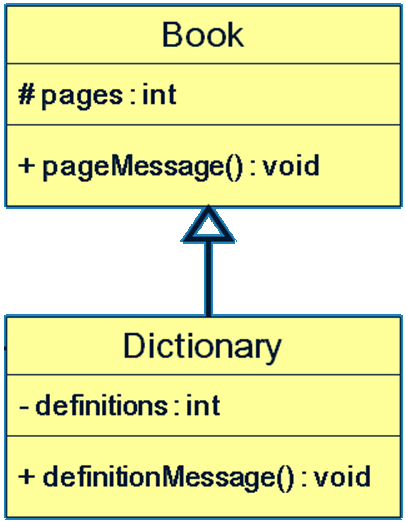

## 5.5. 🅱️ چندریختی یا Polymorphism

* پس از محصورسازی (Encapsulation) و وراثت(Inheritance) موضوع چندریختی(Polymprphism) مهمترین و حیاتی‌ترین امکان در زبان‌های شیءگرایی به‌حساب می‌آید
* متدی روی یک شیء فراخوانی‌می‌شود. نوعِ شیء، در زمان اجرا مشخص می‌شود. یعنی در زمان اجرا رفتار دقیق این شیء(برحسب نوع آن) معلوم می‌شود.
* ایجاد امکان چندریختی، از عهده کامپایلر بر نمی‌آید و کامپایلر نمی‌داند یک ارجاع، به شیئی از چه کلاسی اشاره خواهد کرد و در زمان اجرا مشخص می‌شود

```java
Animal a ;
if(X)
a = new Cat();
else
a = new Fish();
a.move("right", 3.0);
```

* به نوع Cast توجه شود که شیء از نوع والد در شیء از نوع فرزند ریخته نمی‌شود و شیء فرزند در شیء والد ریخته می‌شود(توجه: درباره عملگر تساوی صحبت می‌کنیم که «نوع» سمت چپ و راست آن متفاوت است)

```java
Child c = new Child();
Parent p = new Parent();
p = c;✅️
c = p;❌️️️
```

* مثال در حالت Up casting یا «تغییر نوع به بالا» که همواره معتبر است

```java
Shape s = new Rectangle();
Circle c = new Circle();
Shape s = c;
Animal a = new Dog();
Person p = new Student("Ali", 9430623);
```

* مثال در حالت Down casting یا «تغییر نوع به پایین» که همواره معتبر نیست وگاهی معتبر و گاهی نامعتبر است و باید کلیدواژه Cast ذکر شود

```java
shape s = …
Circle c = s;❌️️️ خطا

shape s = new Circle();
Circle c = (Circle) s;✅️

shape s = new Rectangle();
Circle c = (Circle) s;❌️️️ #خطای زمان اجرا
```

* در نمونه چندریختی زیر: تابع draw ظاهری یکسان ولی رفتاری متفاوت دارند.

```java
Shape s = new Rectangle();
s.draw();
double d = s.getArea();

Circle c = new Circle();
s = c;
s.draw();
d = s.getArea();
```

مثال دیگر

```java
class Parent {
Public void f() {
System.out.println("f() in Parent");
}
public class Child extends Parent {
Public void f() {
System.out.println("f() in Child");
}

public static void main(String[] args) {
Parent p new Parent();
p.f();
Child c = new Child();
c.f();
p = c;
p.f();
}
}
```

مثال

```java
class Animal{}
class Cat extends Animal{}
class Dog extends Animal{}

Object o = new Object();
Animal a = new Animal();
Animal x = new Cat();
Cat c = new Cat();
Dog d = new Dog();

o = a;
o = c;
a = o; ❌️️️ خطای کامپایل
a = c;
c = o; ❌️️️ خطای کامپایل
c = a; ❌️️️ خطای کامپایل
c = d; ❌️️️ خطای کامپایل
c = (Cat) x;
d = (Dog) x; ❌️️️ خطا ClassCastException در زمان اجرا
```

### 5.5.1. ✅️ شرایط کدنویسی بدون چندریختی

* در یک بازی فوتبال صدها نوع شیء وجود دارد که باید به ازای هر نوع یک حلقه ایجاد کنیم

```java
Player[] players = ...
Referee[] refs = ...
Ball ball = …

for (Player ply : players) {
ply.draw();
}

for (Referee ref : refs) {
ref.draw();
}

ball.draw();
```

* با وجود چند ریختی شکل ساده‌سازی شده قطعه کد بالا به فرم زیر درخواهد آمد:

```java
Drawable[] drawables = …
for (Drawable dr : drawables) {
dr.draw();
}
```

## 5.6. 🅱️ مفهوم انتزاعی (Abstract)

انتزاعی بودن یک کلاس یا متد باید توسط برنامه نویس مشخص شود و اینکار با کلیدواژه abstract انجام می‌شود

### 5.6.1. ✅️ متد انتزاعی

* انتزاعی بودن یک متد باید توسط برنامه‌نویس با کلیدواژه abstract تصریح شود
* **متد بدون بدنه** که در داخل کلاس تعریف می‌شود. و هر شیء که از این کلاس ساخته شود به آن متد دسترسی دارد. با این تفاوت که بدنه این متد باید در زیرکلاس تعریف شود.
* چنین متدی در اَبَرکلاس، متد انتزاعی خوانده می‌شود.
* متد Concrete متدی است که پیاده‌سازی کاملاً مشخصی داشته و انتزاعی نیست.
* Concrete method ≠ Abstract Method
* گاهی همه متدهای یک کلاس،‌ انتزاعی هستند.
* متد انتزاعی، دارای بدنه و پیاده‌سازی نیست. قرار نیست که پیاده‌سازی شود و باید توسط یک زیرکلاس پیاده‌سازی شود.

```java
abstract class Animal {
private String name;
public void setName(String name) {
this.name = name;
}
public String getName() {
return name;
}
public abstract void talk();
}
class Cat extends Animal{
public Cat(String name) {
super(name);
}
@Override
public void talk() {
System.out.println("Mew!");
}
}

class Dog extends Animal {
public Dog(String name) {
super(name);
}
@Override
public void talk() {
System.out.println("Hop!");
}
}
```

مثال دوم:

```java
public abstract class Shape {
public abstract double getArea();
public abstract double getPerimeter();
}

public class Circle extends Shape {
private double radius;
public double getRadius() {
return radius;
}
public void setRadius(double radius) {
this.radius=radius;
}
public double getArea() {
return Math.pow(radius, 2) * Math.PI;
}
public double getPerimiter() {
return 2*radius * Matn.PI;
}
}

public class Rectangle extends Shape{
private double width, length;
public double getWidth() {
return width;
}
public void setWidth(double width) {
this.width=width;
}
public double getLength() {
return length;
}
public void setLength(double length) {
this.length=length;
}
public double getArea() {
return length * width;
}
public double getPremiter() {
return 2 -(length + width);
}
}

public class Square extends Shape{
private double length;
public double getLength(){
return length;
}
public void setLength(double length) {
this.length=length;
}
public double getArea() {
return length * length;
}
public double getPrimeter() {
return 4 * length;
}
}
```

### 5.6.2. ✅️ کلاس انتزاعی

* انتزاعی بودن یک کلاس باید توسط برنامه نویس با کلیدواژه abstract تصریح شود
* کلاسی که هیچ شیئی مستقیماً از آن ایجاد نمی‌شود و اگر شیئی از جنس این کلاس است، باید از یکی از زیرکلاس‌هایش تولید شود.
* کلاس‌هایی که متد انتزاعی دارند(حتی یک متد انتزاعی):
    * قطعاً این کلاس یک کلاس انتزاعی می‌باشد و حتماً باید قبل از تعریفل کلاس، کلیدواژه abstract اضافه شود.
    * این کلاس قطعاً تعریف برخی رفتارها را ندارد. پس باید در زمان پیاده‌سازی در «زیرکلاس» بدنه این متدها را(حداقل یک متد) تعریف کنیم تا به یکConcrete method تبدیل شود
    * نمی‌توانیم نمونه‌ای بسازیم زیرا استفاده از new برای یک کلاس انتزاعی باعث خطای کامپایل می‌شود.
* در «زیرکلاس» مشتق شده، اگر حتی یک متد انتزاعی پیاده‌سازی یا بدنه‌دار نشود، آنگاه بازهم انتزاعی خواهد بود و باید با پیشوند abstract تعریف شود
* کلاسی که هیچ متد انتزاعی در آن نیست(ارث‌بری هم نداشته) هم می‌تواند بصورت انتزاعی تعریف شود
    * باید در ابتدای نام آن کلاس، عبارت abstract آورده شود.
    * این کار معمولاً به منظور جلوگیری از ایجاد شیء از این کلاس کاربرد دارد.
    * گاهی برای اجباری کردن ایجاد زیرکلاس‌هایی از آن نیز کاربرد دارد

مثال: این کلاس توسط برنامه‌نویس بگونه‌ای طراحی شده است که اجازه ایجاد شیء را نمی‌دهد:

```java
abstract class Human {
private String name ;
public String getName(){
return ;name
}
}
```

### 5.6.3. ✅️ مفهوم Interface

* اگر در یک «اَبَرکلاس»، تمام متدها انتزاعی باشد و هیچ متغیری هم تعریف نشود، آنگاه به آن ابرکلاس Interface یا «واسط» می‌گویند
* بجای کلیدواژه Class از کلیدواژه interface استفاده می‌شود
  هیچ متد غیر Abstract نباید داشته‌باشد
* همه متدها بدون نوشتن کلیدواژه ، بصورت ضمنی Abstract و Public تلقی می‌شوند
* Interfaceها تنها هدف ریل‌گذاری دارند. و مانند یک کلاس کاملاً انتزاعی است (pure abstract class)
* همانند کلاس انتزاعی امکان ایجاد نمونه(شیء) وجود ندارد و عملگر new قابل اجرا روی یک واسط نیست
* دو مثال زیر از لحاظ معنا و کاربرد تقریباً مشابه هستند: حالت اول:

```java
public interface Shape {
double getArea();
double getPerimeter();
}
```

حالت‌دوم:

```java
public abstract class Shape {
public abstract double getArea();
public abstract double getPrimeter();
}
```

مثال:

```java
public interface Shape {
double getArea();
double getPerimeter();
}

class Rectangle implements Shape{
private double width, length;
private int color;
public Rectangle(double width, double length, int color){
this.width=width;
this.length=length;
this.color=color;
}
public int getColor(){
return color;
}
public double getArea(){
return width * length;
}
public double getPerimeter(){
return 2 * (width * length);
}
}
```

#### 5.6.3.1. ❇️ جزییات ارث‌بری Interface

* ارث‌بری یک کلاس از یک واسط، با کلیدواژه implements است
* اگر کلاسی یک واسط را پیاده‌سازی نماید، آنگاه باید همه متدهای آن را هم تعریف کند وگرنه این کلاس متدهای انتزاعی را به ارث برده است و خودش هم باید انتزاعی شود

```java
abstract class Rectangle implements Shape{
public double getArea() {
return …;
}
}
```

* ارث‌بری یک واسط از واسط دیگر، با کلیدواژه extends انجام می‌شود.
    * یک واسط نمی‌تواند از یک کلاس ارث‌بری نماید.

```java
interface CanRun{
void run();
}
interface CanThink{
void think();
}
interface CanTalk extends CanThink{
void talk();
}
interface Human extends CanRun, CanTalk{
void think();
}
```

* یک کلاس می‌تواند صفر یا چند واسط را پیاده‌سازی کند(implements) همچنین یک کلاس می‌تواند از صفر یا چند واسط ارث‌بری نماید(extends) که در مثال زیر آورده شده است

```java
interface CanFight {
void fight();
}
interface CanSwim {
void swim();
}
interface CanFly() {
void fly();
}
Class ActionCharacter {
private String name;
Public String getName() {
return name;
}
}
class Hero extends ActionCharacter implements CanFight, CanSwim, CanFly{
public void swim(){}
public void fly(){}
public void fight(){}
}
```

* ارث‌بری زیر بدلیل «تضاد اسامی» غلط است

```java
interface A{ void f(); }
interface B{ int f(); }
abstract class C implements A,B{} //❌️️️غلط است بدلیل تضاد اسامی
```

* امکان تعریف سازنده (Constructor) در واسط وجود ندارد
    * زیرا هدف سازنده مقداردهی اولیه ویژگی‌های شیء است(Field یا Property) و نیز سازنده وضعیت اولیه شیء را آماده می‌کند.
    * اما واسط حالت شیء را توصیف نمی‌کند.
* بهتر است حتی‌الامکان طراحی کلاس‌ها و متد‌های ما به واسطه ها وابسته باشند.
* از جاوا8 به بعد یک واسط میتواند متدهای غیر انتزاعی داشته باشد. که به این متدها، متد پیش‌فرض(Default Method ) گفته می‌شود.

```java
interface Person {
Date getBirthDate(); //این متد انتزاعی است
default Integer age(){
long diff = new Date().getTime()-getBirthDate().getTime();
return (int) (diff / (1000L*60*60*24*365));
}
}
```

#### 5.6.3.2. ❇️ متغیر

* تعریف یک متغیر در یک واسط رایج نیست
    * اگر در واسط متغیر تعریف شود بدون نوشتن کلیدواژه بصورت ضمنی: Public و static و final خواهد بود.

```java
Interface Humans{
int MAX_AGE=150; //public static final int MAX_AGE=150;
}
```

## 5.7. 🅱️ Annotation

* به مفهوم حاشیه‌نگاری، که با کاراکتر @ آغاز می‌شود گفته می‌شود
* بخشی از Metadata به‌حساب می‌آید
* توضیحی پیرامون یک کلاس یا متد یا غیره می‌دهد.
* برنحوه کامپایل مؤثر است.
  مثال:
    * Override@
        * قبل از تعریف یک متد می‌آید(بالای متد)
        * تصریح می‌کند که این متد برآمده از ابرکلاس Override می‌شود
        * در این صورت اگر به درستی متد را Override نکنیم سبب بروز خطا در کامپایل می‌شود
        * این تصریح می‌تواند سبب کاهش در بروز اشتباهات شود

# 6. 🅰️ DataStructure And Containers(ساختمان‌داده‌وظرف‌ها)

جاوا امکانات متنوعی برای نگهداری اشیاء دارد نظیر: کلاس‌هایی مثل انواع لیست‌ها، مجموعه‌ها، جدول‌ها و ...

* هر یک از این کلاس‌ها، یک ساختمان داده (Data Structure) است
* هر نمونه ساختمان داده، یک ظرف (container) برای نگهداری اشیاء است
* امکانات و الگوریتم‌هایی بر روی اشیاء داخل ظرف هم پشتیبانی می‌شود. مانند جستجو، تبدیل به انواع دیگر، مرتب‌سازی و …
* امکاناتی که جاوا به این منظور ساخته : Java collections framework است که کتابخانه‌ای از کلاس‌ها و واسط‌هایی که ساختمان‌های داده مختلف را ایجاد می‌کنند
* در جاوا برای اهداف متفاوت ساختار متفاوت بوجود آمده است و راه‌حل مورد نیاز گاهی آرایه و گاهی ArrayList و گاهی دیگر ساختارها است
* در زیر خلاصه‌ای از شکل ساختمان داده‌ها آورده شده است:
    * Collection: همانند فهرستی از اشیاء عمل می‌کنند
        * List: نظیر array و ArrayList و LinkedList
        * Set: نظیر HashSet و غیره
    * Map: همانند جدول یا نگاشت از اشیاء عمل می‌کنند. جدول دو ستون(زوج‌مرتب‌دوتایی) است که ستون اول مقدار Key و ستون دوم مقدار Value است.
* **نکته‌خیلی‌مهم**: انواع داده اولیه مثل int و double در هیچ‌یک از ظرف‌های جاوا همانند map یا LinkedList یا ArrayList یا غیره قابل‌استفاده نیستند و برای استفاده باید بجای int یا double از مقادیری همچون Integer یا Double استفاده نمایید
* مقایسه کلی بین Array و ArrayList
    * Array
        * امکان استفاده از انواع داده اولیه نظیر int و double درصورتی که در ArrayList نمی‌توان از Primitive Data لیست ساخت
        * کارایی یا performance بیشتر نسبت به ArrayList
    * ArrayList
        * ارائه متدها و امکاناتی که در آرایه نیست مانند اضافه و کم کردن اعضا به صورت پویا، جستجو در لیست

## 6.1. 🅱️ Collection

* واسط List و Set زیرواسط java.util.Collection در جاوا هستند.
* برخی از متدهای مهم Collection در زیر آورده شده است:

```java
int size();
boolean isEmpty();
boolean contains(Object o);
boolean add(E e);
boolean remove(Object o);
void clear();
```

* نمودار Collection به شکل زیر است:

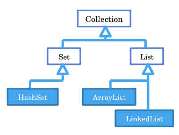

### 6.1.1. ✅️ تفاوت اصلی set و List

* اشیاء داخل یک Set متمایز هستند، شیء تکراری در Set وجود ندارد
* اگر تلاش کنید شیئی تکراری به مجموعه اضافه شود، مجموعه تغییری نمی‌کند
    * شیءتکراری: شیئی که با یکی از اعضای موجود مجموعه برابر است (براساس متد equals)
* اعضای List ترتیب دارند. بین اعضای Set لزوماً ترتیبی وجود ندارد
* واسط Set هیج متدی که با اندیس کار کند، ندارد
* مثلاً در واسط Set ، متد get(i) نداریم، ولی در List داریم
* متدهای دیگری مثل موارد زیر هم در Set وجود ندارد:

```java
set(int index, E element)
int indexOf(Object o)
int lastIndexOf(Object o)
remove(int index)
```

## 6.2. 🅱️ واسط List

* ساختمان داده لیست از نوع Collection می‌باشد.
* یک واسط یا interface تحت عنوان List وجود دارد که ArrayList آمده و متدهای آن را پیاده‌سازی کرده است

```java
interface List<E> {
int size();
boolean isEmpty();
boolean contains(Object o);
boolean add(E e);
boolean remove(Object o);
void clear();
E get(int index);
E set(int index, E element);
void add(int index, E element);
E remove(int index);
int indexOf(Object o);
int lastIndexOf(Object o);
List<E> subList(int fromIndex, int toIndex);
}
```java

### ✅️ Array

**تعریف**: مجموعه‌ای از داده‌های مرتبط به هم که همه این داده‌ها «از یک نوع» هستند
* طول آرایه ثابت است واندازه آن تنها یکبار و آن‌هم در زمان ایجاد معین می‌شود. و امکانی برای افزایش طول آرایه وجود ندارد و باید سراغ ساختارهای دیگر برویم
* شماره ترتیبی هر عنصر در آرایه، اندیس یا ایندکس نامیده می‌شود و اندیس از صفر شروع می‌شود
* عناصر آرایه به همان ترتیب در حافظه جای داده می‌شود
* هر آرایه در‌واقع یک شیء است و مثل همه اشیاء در بخشی از حافظه بنام Heap ذخیره می‌شوند
* در آرایه محدودیت‌هایی هست هندل کردن آن کمی سخت است مانند: افزایش طول سایز آرایه (Size). حذف برخی عناصر آرایه

برای تعریف آرایه از روش زیر استفاده می‌نماییم:
```java
String[] strs; # یعنی «اس‌تی‌آرز» یک ارجاع به شیءای از جنس آرایه است
Person[] people; # یعنی «پی‌پِل» یک ارجاع به شیءای از جنس آرایه است
people = new Person[5]; # ایجاد یک شیء از جنس آرایه(یعنی اختصاص مکان ۵تایی در حافظه) که حاوی پنج پرسن است
float[] RealNumber = new fload[10]; # ایجاد یک شیء از جنس آرایه که حاوی ۱۰ عدد فلوت است
int[] array = new int[10]; #ایجاد یک آرایه با ۱۰ عنصر از نوع عدد صحیح
int array[] = new int[10]; #ایجاد یک آرایه با ۱۰ عنصر از نوع عدد صحیح
int[][] matrix = {{1,2},{8,4}} #ایجاد آرایه دو بعدی
char[] array = {‘a’ , ‘s’ , ‘t’ };
```

به قطعه کد زیر توجه کنید

```java
Student[] students; # ایجاد یک‌ارجاع به‌آرایه‌ای ازنوع استیودنت یعنی تولید متغیری که قرار است ارجاعی به یک آرایه در آن ذخیره شود
students=new student[4]; # ایجاد یک‌جا درحافظه(حاوی۴ارجاع) برای استیودنت‌ها[یک شیء جدید از جنس آرایه در حافظه]
#و اینکه «استیودنتس» خط بالاتر به آن اشاره دارد یعنی آدرس محل ۴تایی درآن ذخیره شده است
students[0]=new Student(); # اولین خونه آرایه‌۴تایی که هم‌اکنون نال است، به‌جایی درحافظه که یک شیء جدید است اشاره خواهد کرد
students[0].setName("Ali"); # تعیین یک مقدار برای شیء
```

باتوجه به قطعه‌کدزیر می‌توان تصویر را تفسیر نمود


#### 6.2.0.1. ❇️ کلاس String

رشته یا String: مجموعه‌ای از کاراکترهایی است که کنار هم قرار گرفته‌است

* هر رشته String یک متغیر از نوع Reference Datatype است
* در یک آرایه از جنس []String، هر مؤلفه «یک ارجاع به رشته» است
* در آرایه‌ای از جنس []Int، هر مؤلفه «یک مقدارint» است
* هر رشته String در‌واقع یک شیء است

```java
String str = "salam bar Hossein";
char ch = str.charAt(0);
int i = str.indexOf("Salam");
int j = str.lastIndexOf("Salam");
String str2 = str + "mazloom" + i;
String str3 = str.replace("salam", "Hi");
```

**نکته مهم**: با تساوی دو عبارت String ، اشاره‌گر کپی می‌شود و محتوی کپی نمی‌شود یعنی متغیر s و t هردو به یک شیء اشاره می‌کنند

```java
1) String s; # اختصاص بخشی از حافظه به متغیر اس(نگهداری آدرس حافظه برای ارجاع به شیء دیگر)
2) s= new String("Ali"); # ایجاد شیء جدید و برگرداندن ارجاع آن به متغیر اس
3) String t= new String("Taghi"); #اختصاص بخشی از حافظه به متغیر و در ادامه نگهداری آدرس حافظه شیء در متغیر
4) s=t; #تغییر «آدرس ارجاع» متغیر اس به همان آدرسی که متغیر تی ارجاع دارد
```

مفهوم بالا در شکل زیر بیان شده است

* برخی ساختار تولید متن در جاوا وجود داردکه در زیر آورده شده است

```java
 System.out.println(MessageFormat.format("Name:{0} , FamilyName: {1}",name,familyName);
 System.out.println(String.format("Name:%s , FamilyName: %s",name,familyName);
```

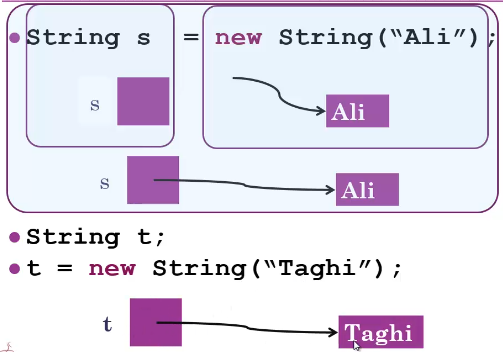

#### 6.2.0.2. ❇️ Convert Collection To Array

* واسط Collection دو متد با نام to Array برای تبدیل به آرایه معرفی می‌کند:
  **روش‌اول**: با استفاده از متد زیر:

```java
Object[ ] toArray()
```

* این متد پارامتری نمی‌گیرد و فهرست را به یک آرایه از Object ها تبدیل می‌کند. بدین ترتیب نوع واقعی اشیاء در آرایه معلوم نیست

**روش‌دوم**: با استفاده از متد زیر:

```java
T[] toArray(T[] a)
```

* در این روش، آرایه‌ای از اشیاء به عنوان پارامتر ارسال می‌شود
* مقدار برگشتی از نوع داده مشخص شده است
* اگر پارامتر موردنظر به اندازه کافی فضا داشته باشد، همان را پر می‌کند وگرنه، یک آرایه جدید از همان جنس می‌سازد
  **مثال**:

```java
ArrayList<Integer> list = new ArrayList<Integer>();
list.add(new Integer(5));
list.add(new Integer(4));
list.add(new Integer(3));

Object[] array = list.toArray();
for (Object object : array) {
Integer i = (Integer) object;
System.out.println(i);
}
Integer[] array2 = list.toArray(new Integer[list.size()]);
for (Integer i : array2)
System.out.println(i);
Integer[] array3 = list.toArray(new Integer[0]);
for (Integer i : array3)
System.out.println(i);
```

### 6.2.1. ✅️ کلاس ArrayList

* در مسیر java.ustil.ArrayList قرار دارد
* لیستی که امکان تغییر سایز طول آرایه در آن وجود دارد. مثلاً زمانی‌که نمیدانیم تعداد یک آرایه چقدر است، استفاده از این مورد مطلوب می‌باشد
* در ابتدا خالی است و به مرور می‌توانیم عناصر به این فهرست اضافه یا کم کنیم.
* در مثال زیر شیء students ظرفی از اشیاء هست که هر نوع از اشیاء را میتوان به آن اضافه کرد.(معمولا همه اجزای یک لیست دارای جنس مشابه می‌باشند)

```java
ArrayList students = new ArrayList();
students.add(new Student("Ali Alavi"));
students.add(new Student("Taghi Taghavi"));
students.remove(0);
```

* ولی معمولاً نمی‌خواهیم اجازه دهیم که یک ظرف اشیائی از انواع مختلف را نگه دارد

```java
ArrayList s = new ArrayList();
s.add(new Student("Ali Alavi"));
s.add("Taghi Taghavi"); //توصیه نمی‌شود که از این نحو استفاده شود
s.add(new Object()); //توصیه نمی‌شود که از این نحو استفاده شود
```

* لیست‌ها میتوانند نوع اشیاء درون خود را مشخص کنند که در مثال زیر لیستی از اشیاء کلاس Student را ذخیره میکند

```java
ArrayList<Student> students = new ArrayList<Student>(); //به این لیست فقط باید اشیاء «استیودنت» افزوده گردد
//Eample:
students.add(new Student("Ali Alavi"));
students.add(new Student("Taghi Taghavi"));
students.remove(0); // حذف شیء صفر یعنی اولین شیء که به این لیست افزوده شده است
students.remove(new Student("Behrooz MohammadiNasab")); // حذف چنین شیء از لیست
Student stud = students.get(0); //دستیابی به یک شیء خاص
System.out.println(stud);
//limitation:
students.add("Taghi Taghavi"); // ❌️️️ نمی‌توانیم رشته اضافه نماییم و فقط باید کلاس استیودنت اضافه گردد
students.add(new Object()); // ❌️️️ نمی‌توانیم آبجکت اضافه نماییم و فقط باید کلاس استیودنت اضافه گردد
```

* لیست‌ها میتوانند نوع اشیاء درون خود را مشخص کنند که در مثال زیر لیستی از اشیاء نوع رشته String را ذخیره میکند

```java
ArrayList<String> names = new ArrayList<String>();
names.add("Ali Alavi");
names.add("Taghi Taghavi");
names.remove(0);
names.remove("Ali Alavi");
String nm = names.get(0);
System.out.println(nm);
```

* درواقع ArrayList لیستی هست که به کمک آرایه پیاده‌سازی شده است.
* برای حذف یک عضو ArrayList ، خانه‌های بعدی در خانه قبلی کپی می‌شوند. و این کپی‌های ناخواسته سبب کاهش performance یا کارایی می‌شود.
* لیست ArrayList ظرفی از اشیاء است: هر یک از مقادیر داخل آن، یک شیء است
    * انواع داده اولیه (primitive types) نمی‌توانند در ArrayList قرار گیرند
    * این محدودیت برای سایر انواع ظرف‌ها (مثل Linked List و Set و ...) هم وجود دارد.
    * در واقع این محدودیت برای همه انواع عام (generics)، از جمله ظرف‌ها، وجود دارد.
    * این محدودیت برای آرایه وجود ندارد.

```java
ArrayList<int>        // ❌️️️ غلط است
int[]            // ✅️ صحیح است
```

* در مجموع، کلاس ArrayList پرکاربردتر است

#### 6.2.1.1. ❇️ متدهای مهم

```java
int size()            // طول فهرست
boolean isEmpty()        // فهرست خالی است یا خیر
boolean contains(Object o)    // وجود شیء موردنظر در فهرست
add(E e)            // یک عضو به فهرست اضافه می‌کند
remove(Object o)        // یک عضو از فهرست حذف می‌کند
remove(int index)        // عضوی با شماره اندیس موردنظر را حذف می‌کند
clear()                // همه اعضای فهرست را حذف می‌کند
get(int index)            // عضوی که در اندیس موردنظر است را برمی‌گرداند
int indexOf(Object o)        // شماره اندیس عضو موردنظر را برمی‌گرداند

```

* درواقع ArrayList یک زیر کلاس از واسط java.util.List می‌باشد و متدهای بالا همگی از واسط List ارث‌بری شده است و توسط کلاس ArrayList پیاده‌سازی شده است

```java
public class ArrayList<E> implements List<E>
```

مثال:

```java
List<String> list = new ArrayList<String>();
Scanner scanner = new Scanner(System.in);
while(true){
String input = scanner.next();
if(input.equalsIgnoreCase("exit"))
break;
list.add(input);
}
if(list .isEmpty()){
System.out.println("No string entered");
}else{
System.out.println(list .size());
if(list .contains("Ali"))
System.out.println("Ali Found!");
for (String s : list) {
System.out.println(s);
}
}
```

#### 6.2.1.2. ❇️ تبدیل آرایه به ArrayList

```java
String[] strings = {"ali", "taghi"};
ArrayList<String> list = new ArrayList<String>();
for (String str : strings)
list.add(str);
```

#### 6.2.1.3. ❇️ تبدیل ArrayList به آرایه:

```java
String[] array = new String[list.size()];
for (int i = 0; i < array.length; i++)
array[i] = list.get(i);
```

### 6.2.2. ✅️ لیست پیوندی(Linked List)

* برخلاف آرایه، همه اعضا پشت سرهم در حافظه قرار نمی‌گیرند. بلکه هر عضو فهرست، محل (آدرس یا ارجاع) عضو بعدی را نگه می‌دارد

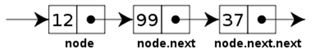

* برای افزودن عضو به فهرست ابتدا یک شیء جدید ایجاد می‌کنیم و آخرین ارجاع (اشاره‌گر) به این شیء جدید اشاره خواهد کرد.


* برای حذف عضو از فهرست کافیست اشاره‌گر عضو کنونی، به شیء بعدی اشاره کند

  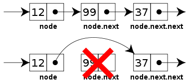


* تحت کلاس java.util.LinkedList در جاوا پیاده‌سازی شده است
* کلاس Linked List هم مانند ArrayList واسط List را پیاده‌سازی کرده است. همه متدهای مهم List را دارد، مانند add ، get ، remove و … بنابراین نحوه کاربرد Linked List مشابه ArrayList است

```java
LinkedList<Double> grades = new LinkedList<Double>();
grades.add(new Double(18.5));
grades.add(new Double(19.5));
grades.add(new Double(17.5));
for (Double d : grades)
System.out.println(d);
```

مثال از لیست پیوندی:

```java
List<String> list = new LinkedList<String>();
list.add("Ali");
list.add("Taghi");
System.out.println(list.get(1));
list.remove("Taghi");
for (String string : list) {
System.out.println(string);
}
```

* کلاس‌هایLinked List و ArrayList واسط List را پیاده کرده‌اند اما پیاده‌سازی متفاوتی دارند.
    * درون هر Linked List یک آرایه نیست بلکه یک لیست پیوندی است.
* در زمانی که تعداد زیادی add و remove در لیست داریم بهتر است از لیست پیوندی استفاده شود.
* درهنگامی که دسترسی فراوان به عناصر(بااستفاده از اندیس) وجود دارد بهتر است از نوع ArrayList پیاده‌سازی شود.
* هزینه اجرای get(i) در ArrayList کم است ولی در لیست پیوندی i عنصر باید پیمایش شوند تا به عنصری با اندیس i برسیم.
* در کد زیر بهتر است بخاطر ارجاع‌های مکرر از لیست پیوندی استفاده شود تا سریعتر اجرا شود

```java
for(int i=0;i<1000000;i++){
for(int j=0;j<100;j++)
list.add(0, new Object());
for(int j=0;j<100;j++)
list.remove(0);
}
```

## 6.3. 🅱️ واسطSet [مجموعه]

* ساختمان داده Set از نوع Collection می‌باشد.
* شبیه معنای «مجموعه» در ریاضیات است. تعدادی شیء متمایز که لزوماً بین اعضا ترتیبی وجود ندارد
* Set اجازه افزودن عضو تکراری به مجموعه را نمی‌دهد. تکراری بودن عضو جدید را چک می‌کند (سربار محاسباتی) پس به همین لحاظ می‌تواند از هدر رفتن حافظه جلوگیری کند (کاهش حافظه مصرفی)
* مثلاً دو مجموعه زیر با هم برابر هستند

```java
{1,2,3,1,4,2} = {4,3,2,1}
```

### 6.3.1. ✅️ کلاسHashSet

* کلاس HashSet واسط Set در مسیر java.util.Set را پیاده‌سازی کرده است. مثال:

```java
HashSet<String> set= new HashSet<String>();
set.add("Ali");
set.add("Taghi");
set.add("Naghi");
```

مثال:

```java
Set<String> set = new HashSet<String>();
set.add("Ali");
set.add("Taghi");
set.add("Taghi");
set.add("Ali");
set.add("Taghi");
System.out.println(set.size()); // OUTPUT: 2
for (String str : set)
System.out.println(str); // OUTPUT: Taghi "\n" Ali
set.remove("Ali");
System.out.println(set.contains("Ali")); // OUTPUT: False
System.out.println(set.contains("Taghi")); // OUTPUT: True
set.clear();
System.out.println(set.size()); // OUTPUT: 0
```

## 6.4. 🅱️ واسطMap

واسط MAP در مسیرjava.util.Map قرار دارد. باید توجه شود که یک MAP از نوع Collection نیست.

* **Map** : همانند جدول یا نگاشت از اشیاء عمل می‌کند. جدول دو ستون(زوج‌مرتب‌دوتایی) است که ستون اول مقدار Key و ستون دوم مقدار Value است.
* اعضای ستون اول (کلیدها) یکتا هستند: کلید تکراری نداریم
* اعضای ستون دوم (مقادیر) ممکن است تکراری باشند
* نوع ستون اول و ستون دوم قابل تعیین است.
* نکته‌خیلی‌مهم: انواع داده اولیه مثل int و double در هیچ‌یک از ظرف‌های جاوا قابل‌استفاده نیستند و برای استفاده باید از مقادیری همچون Integer یا Double استفاده نمایید و نه int یا double
* مثال: mp یک شیء از نوع map است که Key آن(ستون اول) از نوع رشته و Value یا مقادیر آن(ستون دوم) از نوع اعداد حقیقی است. به عبارتی می‌شود گفت که «نگاشتی از رشته به عدد حقیقی»

```java
Map<String, Double> mp;
```

* مثال: «نگاشتی از اعداد صحیح به دانشجو»

```java
Map<Integer, Student> mp;
```

نگاهی به واسط Map:

```java
public interface Map<K,V> {
V get(Object key);
V put(K key, V value);
int size();
boolean isEmpty();
boolean containsKey(Object key);
boolean containsValue(Object value);
V remove(Object key);
void putAll(Map m);
void clear();
Set<K> keySet();
Collection<V> values();
}
```

## 6.5. 🅱️ کلاس HashMap

* کلاس java.util.HashMap واسط map را implement کرده است و به این واسط ساختار داده است
* در جاوا ساده‌ترین نوع cache را با کلاس HashMap می‌توان پیاده‌سازی کرد. کوچکترین واحدی که در آن می‌توان کش تولید کرد از آبجکت static HashMap است. که نام و مقدار دارد که در کش‌های داخل مموری مورد استفاده قرار می‌گیرد.

به قطعه کد زیر توجه نمایید:

```java
Map<Integer, String> map = new HashMap<Integer, String>();
map.put(87300876, "Ali Alavi");
map.put(87234431, "Taghi Taghavi");
map.put(87300876, "Naghi Naghavi");
String name = map.get(87300876);
System.out.println(name); // Naghi Naghavi
System.out.println(map.get(87234431)); // Taghi Taghavi
```

* در کد بالا به جای Integer از int استفاده شده است
    * تبدیل int به Integer از جاوا 5 به بعد بصورت خودکار انجام می‌شود (auto Boxing) یعنی قسمت‌هایی توسط تابع put مقدار مستقیم int (مثلاً 87300876) داده شده اشتباه بوده و بخاطر auto Boxing این موضوع ارور گرفته نشده است
* نوع مورد استفاده در همه کلاس‌های java collections framework باید شیء باشند

### 6.5.1. ✅️ put

* تغییر مقدار با کمک put صورت می‌گیرد
* اگر سطری با کلید تکراری به یک map اضافه شود: مقدار قبلی آن کلید حذف می‌شود.
  مثال:

```java
Map<Integer, String> map = new HashMap<Integer, String>();
map.put(76, "Ali")
map.put(31, "Taghi")
map.put(76, "Naghi")    // 76: Naghi
```

**مثال**: این برنامه به شرطی درست کار می‌کند که متدهای equals و hashCode به خوبی در کلاس Student پیاده‌سازی شده‌باشند

```java
Map<Student, Double> map = new HashMap<Student, Double>();
map.put(new Student("Ali Alavi"), new Double(18.76));
map.put(new Student("Taghi Taghavi"), new Double(15.43));
map.put(new Student("Naghi Naghavi"), new Double(17.26));
map.put(new Student("Naghi Naghavi"), new Double(15.26));
map.remove(new Student("Naghi Naghavi"));

Double grade = map.get(new Student("Taghi Taghavi"));
System.out.println("Grade of Taghi=" + grade);

for (Student student : map.keySet())
System.out.println(student.toString());

Double totalSum = 0.0;
for (Double avg : map.values())
totalSum += avg;

System.out.println("Average = " + (totalSum / map.size()));
```

## 6.6. 🅱️ واسط Iterator

* واسط Collection ، از واسط Iterable ارث‌بری کرده است
* بنابراین List ها و Set ها همگی Iterable هستند

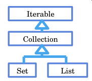

* از جاوا 5 به بعد، for each برای آرایه‌ها و collection ها ممکن شد

```java
//**Example1:**
int[] array = {1,2,3,7};
for (int i : array)
System.out.println(i);
//**Example2:**
List<Integer> list ;
...
for (Integer i : list)
System.out.println(i);
```

* قبل از جاوا 5 با کمک iterator پیمایش روی collectionها انجام می‌شد. این امکان همچنان وجود دارد و کاربردهایی نیز دارد
  مثال:

```java
List<Integer> list = ... ;
Iterator<Integer> iterator = list.iterator();
while(iterator.hasNext()){
Integer i = iterator.next();
System.out.println(i);
}
```

* واسط Iterator که سبب شد تا امکان for each در نسخه‌های جدید جاوا با کمک آن پیاده شود.

```java
public interface Iterator<E> {
boolean hasNext();
E next(); //رفتن به خونه بعدی
void remove();
Iterator<T> iterator();
}
```

واسط‌های زیرمجموعه Collection هم Iterator را ارث‌بری می‌کنند:

```java
public interface Collection<E> extends Iterable<E> {…}
```

### 6.6.1. ✅️ متد Iterator

* متد iterator در واسط java.lang.Iterable تعریف شده است. هرکلاسی که Iterable را Implement نماید باید متد Iterator را هم پیاده‌سازی نماید
* هر for each توسط Iterator انجام می‌شود
* در واقع همه کلاس‌هایی که Iterable هستند، امکان for each دارند
  مثال

```java
List<Integer> list = new ArrayList<Integer>();
for(int i=0;i<10;i++)
list.add(i);

Iterator<Integer> iterator = list.iterator();
while(iterator.hasNext()){
Integer value = iterator.next();
if(value%2==0)
iterator.remove();
}
System.out.println(list.size()); // OUTPUT: 5
```

### 6.6.2. ✅️ تغییر همزمان یا Concurrent Modification

* فرض کنید: چند بخش برنامه به صورت همزمان در حال استفاده از یک ظرف باشند(مثلاً یک لیست یا مجموعه)و در همین حال، یک بخش از برنامه، تغییری در ظرف ایجاد کند(مثلاً شیئی به آن اضافه یا کم کند) این تغییر همزمان نباید ممکن باشد زیرا یک ظرف توسط یک بخش درحال پیمایش است و در بخش دیگری تغییر می‌کند
    * مثلاً شاید در بخشی که پیمایش انجام می‌شود، روی طول ظرف حساب شده باشد که سبب تغییر روی این محور محاسبه‌بشود و تمامی معادلات به هم بریزد
    * مثلاً شیئی که پیمایش و پردازش شده، توسط بخش دیگری از برنامه حذف شود
* جاوا از تغییرات همزمان از Containerها (مواردی ذیل واسط Collection یا موارد ذیل واسط Map) جلوگیری می‌کند.
* با تغییر حتی روی یک متد در Container ها سبب «غیرمعتبر» نمودن تمامی iterator های آن Container می‌شود و درادامه هر عملیات روی iterator های غیرمعتبر شده سبب پرتاب خطای **ConcurrentModificationException** می‌شود. به این تکنیک، «**شکست‌سریع**» یا **FailFast** گفته می‌شود
* با تغییر یک ظرف توسط یک iterator ، سایر iterator ها غیرقابل‌استفاده می‌شوند. این تکنیک، روش جاوا برای جلوگیری از تغییر همزمان است.
* مثال:در این مثال itr غیر معتبر می‌شود و منجر به ارسال خطای ConcurrentModificationException می‌شود.

```java
Collection<String> c = new ArrayList<String>();
Iterator<String> itr = c.iterator();
c.add("An object"); // این خط سبب می‌شود که «آی‌تی‌آر» نامعتبر شود
// و هر گونه پیمایش روی «آی‌تی‌آر» سبب ارور می‌شود
String s = itr.next(); //❌️️️ سبب بروز خطا می‌شود زیرا «آی‌تی‌آر» نامعتبر است
```

مثال: بلافاصله بعد از اجرای متد remove روی این خط خطا دریافت می‌کنیم و iterator ای که با کمک آن حلقه for را به اجرا درآورده‌ایم نامعتبر می‌شود:

```javaList<String> list = new ArrayList<String>();
list.add("A");
list.add("B");
list.add("C");
for (String s : list)
if(s.equals("A"))
list.remove(s); //❌️️️ با تغییریافتن کالکشن «لیست» ایتریتورهای دیگری که بر روی لیست ساخته شده‌اند نامعتبر می‌شوند
// که یکی از این ایتریتورها ، حلقه فور است
// ومیدانیم که هر فورایچ توسط یک ایترتور انجام می‌شود
// پس هنگامی که دوباره به حلقه رجوع میکند و میخواهد مقدار بگیرد ارور نامعتبر بودن لیست را میدهد
// نکته‌مهم: ارور روی خط حلقه فور داده می‌شود یعنی خط۵ ونه خط حذف یک پارامتر
```

**مثال غلط: حذف یک رکورد از یک لیست**: این راه‌حل منجر به Concurrent Modification Exception می‌شود.( از این‌مورد استفاده‌نکنید):

```java
void removeAli(List<String> list){
for (String string : list)
if(string.startsWith("Ali"))
list.remove(string);
}
```

**مثال صحیح**: راه حل(اول) صحیح مثال بالا(**از این روش استفاده نمایید**):

```java
public static void removeAli(List<String> list){
Iterator<String> iterator = list.iterator();
while(iterator.hasNext()) {
String string = iterator.next();
if(string.startsWith("Ali"))
iterator.remove();
}
}
```

**مثال صحیح**: راه حل(دوم) صحیح مثال بالا( از این روش استفاده نمایید):

```java
public static void removeAli(List<String> list){
for (int i = list.size()-1; i >= 0; i--)
if(list.get(i).startsWith("Ali"))
list.remove(i);
}
```

## 6.7. 🅱️ واسط Comparable

گاهی لازم است دو شیء با هم مقایسه شوند و ترتیب آن‌ها مشخص شود(کدام‌یک کوچک‌تر است و کدامیک بزرگتر!)

* **کاربرد مقایسه اشیاء**: مرتب‌سازی و جستجوی سریع‌تر (مثلاً در ظرفی از اشیاء)
    * متد equals ، فقط تساوی اشیاء را بررسی میکند
    * برای بسياری از انواع داده (کلاس) معنای مشخصی برای «ترتیب» اشیاء وجود دارد
        * در موارد عددی به کمک عملگرها می‌توان بزرگ‌تر و کوچکتر را جستجو نمود
        * در موار غیر عددی عملگرهای مقایسه‌ای (< و > و <= و >=) کار نمی‌کنند
* اگر کلاسی واسط Comparable را پیاده کند، یعنی برای اشیاء این کلاس، عنوان ترتیب معنا داشته و مهم است.

نگاهی به واسط Comparable:

```java
public interface Comparable<T> {
public int compareTo(T o);
}
```

### 6.7.1. ✅️ متد compareTo

* تابع CompareTo شیء جاری را با پارامتر متد مقایسه می‌کند و یک عدد برمی‌گرداند
    * عدد خروجی اگر مثبت باشد یعنی شیء جاری بزرگ‌تر از پارامتر متد است
    * عدد خروجی اگر صفر باشد یعنی شیء جاری مساوی از پارامتر متد است
    * عدد خروجی اگر منفی باشد یعنی شیء جاری کوچکتر از پارامتر متد است

مثال: در خط شماره ۳ پارامتر this همان date است که تعدا میلی‌ثانیه تا کنون را برمی‌گرداند. خط ۴ تعداد میلی‌ثانیه زمانی خاص را برمی‌گرداند و خط بعدی مقایسه می‌کند

```javaclass java.util.Date implements Comparable<Date>{
public int compareTo(Date anotherDate) {
long thisTime = getMillisOf(this);
long anotherTime = getMillisOf(anotherDate);
return (thisTime<anotherTime ? -1 : (thisTime==anotherTime ? 0 : 1));
}
}
```

نمونه کاربردی کلاس بالا در قطعه کد زیر استفاده شده است

```java
//Deprecated Constructors:
Date d1 = new Date(2015, 10, 21);
Date d2 = new Date(2013, 7, 26);
Date d3 = new Date(2013, 7, 26);
System.out.println(d1.compareTo(d2)); // OUTPUT:1
System.out.println(d2.compareTo(d1)); // OUTPUT:-1
System.out.println(d2.compareTo(d3)); // OUTPUT:0
```

برای هر کلاس جدید که ترتیب اشیاء در آن معنی و اهمیت دارد، کلاس را فرزند Comparable کنید و متد compareTo مناسب برای آن پیاده‌سازی کنید

### 6.7.2. ✅️ واسط Comparator

واسط دیگری بنام Comparator داریم که در مسیر java.util.Comparator قرار دارد.

* گاهی می‌خواهیم اشیاء را با ترتیبی غیر از آن‌چه خودشان تعریف کرده‌اند مقایسه کنیم. مثلاً کلاس دانشجو واسط Comparable را پیاده‌سازی کرده و متد compareTo را بر اساس معدل دانشجو تعریف کرده ولی ما می‌خواهیم فهرست دانشجویان را براساس «سن» مرتب کنیم (ترتیب بر اساس سن) گاهی نیز می‌خواهیم اشیائی را مقایسه کنیم که کلاسشان Comparable نیست. در این موارد واسط Comparator را برای مقایسه این اشیاء پیاده‌سازی می‌کنیم

ساختار واسط Comparator :

```java
public interface Comparator<T> {
int compare(T o1, T o2);
}
```java
مثال: Comparator برای کلاس Student: در زیر دو دانشجو توسط متد CompareTo بر حسب نمره با هم مقایسه می‌شوند
```java
class Student implements Comparable<Student> {
int age;
double grade;
// مقایسه زیر برحسب نمره صورت می‌گیرد
public int compareTo(Student s) {
return (this.grade<s.grade ? -1 : (this.grade == s.grade ? 0 : +1));
}
//Constructor for this class
public Student(int age, double grade) {
this.age = age;
this.grade = grade;
}
}
```

ادامه: اگر بخواهیم مقایسه دو دانشجو نه برحسب نمره بلکه بر حسب سن مقایسه نماییم. به همین خاطر مطابق زیر عمل می‌کنیم

```java
class StudentComparator implements Comparator<Student>{
// مقایسه بر حسب سن صورت می‌گیرد
public int compare(Student s1, Student s2) {
return s1.age<s2.age? -1:(s1.age==s2.age?0 : +1);
}
}
```

ادامه:استفاده از کلاس فوق مطابق زیر است

```java
StudentComparator comparator = new StudentComparator();
Student s1 = new Student(21, 17.5);
Student s2 = new Student(20, 18.5);
System.out.println(s1.compareTo(s2));
System.out.println(comparator.compare(s1,s2));
\\ output:
\\        -1
\\         1
```

## 6.8. 🅱️ داده‌های Enumeration

* فرض شود که یک کلاس، تعداد مشخص و محدود شیء خواهد داشت و در آینده اضافه نخواهد شد. بهتر است بجای کلاس با کلیدواژه enum تعریف شود و همان جا همه اشیاء (نمونه‌ها) آن مشخص شود.
* همه نمونه‌های enum بصورت ضمنی public , static, final هستند.
* هیچ‌نمونه (شیء) جدیدی نمی‌تواند ایجاد شود(نمونه سازی با کمک new با ارور مواجه خواهد شد)
* ارث‌بری از enum امکان‌پذیر نیست
* مثال‌اول: وضعیت یک اس ام اس که می‌تواند در وضعیت ۱- ارسال شده ۲- در دست ارسال ۳-مواجه با خطا
* مثال‌دوم: رنگ که آبی و سبز و مشکی و قرمز(که برای پیاده‌سازی چنین مواردی از enum استفاده می‌شود.)
* مثال‌سوم: کلاس نوع دانشجو که حتماً چیزی بین لیسانس و فوق لیسانس و دکترا و این قبیل است
* مثال رنگ را با دوحالت زیر که یکی با enum و دومی بدون enum است پیاده‌سازی می‌کنیم:
  **حالت بدون Enum:**

```java
class Color{
public static final Color BLACK = new Color();
public static final Color BLUE = new Color();
public static final Color GREEN = new Color();
public static final Color RED = new Color();
private Color() { }
}
```

حالت Enum:

```java
enum Color { BLACK, BLUE, GREEN, RED }
```

برای استفاده از این مورد باید به شکل زیر اقدام کرد:

```java
Color color = Color.BLACK;
```

مثال متفاوت:

```java
enum Shape { RECTANGLE, CIRCLE, SQUARE}
enum StudentType {BS, MS, PHD }
```

**بعنوان نمونه به قطعه کد زیر توجه نمایید:**

```java
enum Shape {
Rectangle(1), //نحوه خاص استفاده از تابع سازنده در این نوع داده‌ها
Circle(2), //نحوه خاص استفاده از تابع سازنده در این نوع داده‌ها
Square(3); //نحوه خاص استفاده از تابع سازنده در این نوع داده‌ها

private int number;
Shape(int i){ //تعریف تابع سازنده
number= i;
}
public int getNumber(){
return number;
}
}
```

برای استفاده از این مورد باید به شکل زیر اقدام کرد:

```java
Shape sh = Shape.CIRCLE; //ایجاد یک ارجاع بنام «اس‌اچ» که یکی از اشیاء تحت عنوان «سیرکل» اشاره می‌کند
print (sh.getNumber()); // برگرداندن عدد ۲
sh = Shape.valueOf("CIRCLE"); // یک متد استایک «وَلیو آف» درون این «اینام‌ها» وجود دارد که که یک رشته می‌گیرد و
// شیء که با این نام است را برمی‌گرداند یعنی شیء را برمی‌گرداند
print(sh.getNumber());
Shape[] array = Shape.values(); //متد استایک «ولیوز» بصورت پیش‌فرض وجود دارد که تمام مقادیر را درون آرایه می‌ریزد
for (Shape s : array) {
print(s.name()); // متد نام یک متد استاتیک است که بصورت پیش‌فرض وجود دارد
// متد «نام» و متد «تو استرینگ» مشابه هم کار می‌کنند
}

// Runtime Error:
sh = Shape.valueOf("PYRAMID"); // در زمان استفاده از داده غیر از موارد تعریف شده با ارور مواجه خواهیم شد
```

## 6.9. 🅱️ Variable Argument List متغیر «متفاوت‌پارامتر»

* امکان تعریف متد به نحوی که بعضی از پارامتر‌های این متدها تعداد متغیری از پارامترها رو دریافت کنند.
* در‌واقع آرگومان‌های این متد بگونه‌ای است که می‌شود تعداد صفر یا یک یا چند پارامتر ورودی بعنوان آرگومان به این متد ارسال کرد
* پیاده‌سازی آن به شکل زیر است.

```java
void Func(Type… args){…}
void func1 String… args){…} # هنگام فراخوانی تابع می‌توانیم به این تابع یک یا چند رشته پاس بدهیم
func1(); #طول آرایه زیر صفر است
func1("Ali"); #طول آرایه زیر یک است
func1("A","B","C","D"); #طول آرایه زیر چهار است
```

پارامتر ارسالی به این‌گونه متدها، به شکل یک آرایه قابل استفاده است.

```java
void Func2(String… params){
String[] array = params;
System.out.println(array.length);
for(String p : params) {
System.out.println(p);
}
}
```

تفاوت استفاده از varargs با آرایه را در دو قطه زیر می‌توان دید.

```java
1) void func1(String[] args){...}
2) void func1(String... args){…}
```

روش‌های فراخوانی دو تابع بالا به اشکال زیر است

```java
1)

String[] array = {"A","B"};
func1(array); # فراخوانی متد اول فقط به این شکل است

2)فراخوانی متد دوم به همه اَشکال زیر صحیح است و دست برنامه‌نویس باز است
func2();
func2("A");
func2("A","B");
func2("A","B","C");
func2(array);
```

## 6.10. 🅱️ کلاس Arrays

جاوا یک کلاس برای کار بار آرایه‌های تحت عنوان java.util.Arrays فراهم آورده است که این کلاس دارای متدهای فراوانی است که بصورت استاتیک در آن تعبیه شده است و برای استفاده از آن نیاز به ساختن شیء نیست و مستقیماً می‌توان از آن استفاده نمود

* این کلاس‌ها دارای متدهای استاتیک متنوعی هستند، نظیر
    * کپی اشیاء درون آرایه
    * پر کردن همه اعضا با یک مقدار مشخص (fill)
    * جستجو (search)
    * مرتب‌سازی (sort) و ...

```java
Random random = new Random();
Long[] array = new Long[100];
Arrays.fill(array, 5L);
Long[] copy = Arrays.copyOf(array, 200);
for (int i = 100; i < copy.length; i++)
copy[i] = random.nextLong()%10;
//An unmodifiable list:
List<Integer> asList = Arrays.asList(1, 2 , 3, 4);
List<Long> asList2 = Arrays.asList(array);
Arrays.sort(array);
int index = Arrays.binarySearch(array, 7L);
int[] a1 = {1,2,3,4};
int[] a2 = {1,2,3,4};
System.out.println(a1==a2); // output: false
System.out.println(a1.equals(a2)); // output: false
System.out.println(Arrays.equals(a1, a2)); // output: true
System.out.println(a1); // output: [I@7852e922
System.out.println(a1.toString()); // output: [I@7852e922
System.out.println(Arrays.toString(a1)); // output: [1, 2, 3, 4]
```

## 6.11. 🅱️ کلاس Collections

جاوا یک کلاس برای کار بار آرایه‌های تحت عنوان java.util.Collections فراهم آورده است که این کلاس دارای متدهای فراوانی است که بصورت استاتیک در آن تعبیه شده است و برای استفاده از آن نیاز به ساختن شیء نیست و مستقیماً می‌توان از آن استفاده نمود

* این کلاس‌ها دارای متدهای استاتیک متنوعی هستند، نظیر
    * کپی اشیاء درون ظرف‌ها
    * پر کردن همه اعضا با یک مقدار مشخص (fill)
    * جستجو (search)
    * مرتب‌سازی (sort) و …

```java
List<String> list = new ArrayList<String>();
Collections.addAll(list, "A", "Book", "Car", "A");
int freq = Collections.frequency(list, "A");
Collections.sort(list);
Comparator<String> comp = new Comparator<String>(){
public int compare(String o1, String o2) {
return o1.length() < o2.length() ? -1 :
(o1.length() == o2.length() ? 0 : +1);
}
};
Collections.sort(list, comp);
Collections.reverse(list);

String min = Collections.min(list);
String max = Collections.max(list);
String max2 = Collections.max(list, comp);

Collections.shuffle(list);
Collections.fill(list, "B");
```

## 6.12. 🅱️ انواع داده عام Generic

* داده عام از نسخه 5 به جاوا اضافه شد. قبل از JDK1.5 اصلاً Generic نداشتیم
* کلاس ArrayList بگونه‌ای پیاده‌سازی شده که انواع متغیر String و Integer و Double یا غیره را بتواند به لیست تبدیل نماید.
* گاهی کلاس باید بگونه‌ای نوشته‌شود که انواع داده‌ها را بتواند(همانند کلاس ArrayList) پوشش دهد.
* کلاس ArrayList یک نوع داده عام (Generic) است
    * این قابلیت هنگامی برای کلاس ArrayList فراهم می‌شود که نوع داده آن، از نوع عام استفاده شده باشد
    * اگر کلاس ArrayList از نوع داده عام تعریف نمی‌شد آنگاه باید برای هرکدام از انواع داده کلاس مستقل مثلاً StringArrayList و IntegerArrayList و StudentArrayList تعریف می‌نمودیم.

```java
ArrayList<String> list1 = new ArrayList<String>(); #نمونه لیست از نوع متن
list1.add("Ali");
OR
ArrayList<Integer> list2 = new ArrayList<Integer>(); #نمونه لیست از نوع عدد
list2.add(new Integer(2));
```

* یک واسط یا کلاس‌مجرد نیز می‌تواند همانند کلاس عام(generic) از نوع عام تعریف شود
* قابلیت استفاده از چند «پارامتر نوع» در یک کلاس عام (generic type) وجود دارد
    * بطور مثال، کلاس Map که دارای دو نوع‌عام K و V است. در ادامه مثال آن آورده شده است.
* در زمان استفاده از کلاس‌های نوع عام، پارامترهای داده شده باید حتماً از نوع کلاس باشند و Primitive Data نمی‌توانند بعنوان ورودی تعریف شوند

```java
interface List<E>
List<String> strs; // ✅️
List<Integer> ints; // ✅️
List<Student> stus; // ✅️
List<int> error1; // ❌️️️ خطای کامپایل
List<double> error2; // ❌️️️ خطای کامپایل
```

### 6.12.1. ✅️ نحوه تعریف کلاس‌عام

* در مثال زیر فرض‌شود بخواهیم کلاس Stack (که درجاوا وجود دارد) را پیاده‌سازی نماییم:
    * این کلاس قراراست پشته‌ای از اشیاء را نگهداری‌نماید
    * ظرفی از اشیاء که به کمک متد push دیتا را ذخیره کند
    * ظرفی از اشیاء که به کمک متد pop دیتا را بازیابی می‌کند
    * هرجا کاراکتر E را مشاهده کردیم یعنی این مقدار می‌تواند هر نوع باشد.
    * کاراکتر E استفاده شده در این مثال یک اسم دلخواه است و می‌توانستT باشد

```java
public class Stack<E> {
private E[] elements;
private int top;
public void push(E pushValue) {
if (top == elements.length - 1) throw new FullStackException();
elements[++top] = pushValue;
}
public E pop() {
if (top == -1) throw new EmptyStackException();
return elements[top--];
}
public Stack(int maxsize) {
top = -1;
elements = (E[]) new Object[maxsize];
}
}
// Sample1
Stack<String> st1;
st1 = new Stack<String>(10);
st1.push("A");
st1.push("B");
String p1 = st1.pop();
// Sample2
Stack<Integer> st2;
st2 = new Stack<Integer>(10);
st2.push(new Integer(1));
st2.push(new Integer(2));
Integer p2 = st2.pop();
st2.push("A"); // ❌️️️ در لیست اعداد حروف جای نمی‌گیرد و تولید ارور می‌نماید
```

### 6.12.2. ✅️ ایجاد کلاس‌های‌عام دلخواه

* مثال۱: فرض کنید می‌خواهیم کلاس Pair تعریف کنیم
    * هر شیء از این کلاس یک جفت شیء (زوج مرتب) در درون خود نگه می‌دارد
    * می‌خواهیم در زمان ایجاد شیء (و نه در زمان تعریف کلاس) نوع این دو شیء را تعیین کنیم

```java
public class Pair<T1, T2> {
private T1 first;
private T2 second;
public T1 getFirst() {
return first;
}
public void setFirst(T1 first){
this.first = first;
}
public T2 getSecond() {
return second;
}
public void setSecond(T2 second) {
this.second = second;
}
public Pair(T1 first, T2 second) {
this.first = first;
this.second = second;
}
}
// Sample1
Pair<String, Double> p1;
p1 = new Pair<String, Double>("Ali", 19.0);
String name = p1.getFirst();
Double avg = p1.getSecond();
// Sample2
Pair<String, String> p2;
p2 = new Pair<String, String>("Ali", "Alavi");
String fname = p2.getFirst();
String lname = p2.getSecond();
```

مثال2(لیست‌پیوندی):

هر گره دو فیلد مهم دارد: 1- مقدار (از هر نوعی می‌تواند باشد) 2- ارجاع به گره بعدی (ارجاعی به یک Node)

```java
class Node<E> {
E item;
Node<E> next;
Node(E element, Node<E> next) {
this.item = element;
this.next = next;
}
}
// Sample1
Node<String> last = new Node("Taghi", null);
Node<String> first = new Node("Ali", last);
```

### 6.12.3. ✅️ برخی کلاس‌ها نوع عام جاوا

نگاهی به کلاس ArrayList

```java
class ArrayList<E> implements List<E>
//extends... implements...
{
public int size() {...}
public E get(int index) {...}
public E set(int index, E element) {...}
public boolean add(E e) {...}
...
}
interface List<E> extends Collection<E> {
int size();
boolean isEmpty();
boolean add(E e);
boolean equals(Object o);
E get(int index);
E set(int index, E element);
void add(int index, E element);
E remove(int index);
List<E> subList(int fromIndex, int toIndex);
}
```

نگاهی به کلاس ArrayList

```java
public class HashMap<K,V> implements Map<K,V>
//extends... implements...
{
...
}
interface Map<K,V> {
int size();
V get(Object key);
V put(K key, V value);
V remove(Object key);
Set<K> keySet();
Collection<V> values();
}
```

### 6.12.4. ✅️ محدود کردن نوع عام

* هنگام استفاده از یک نوع عام، از هر کلاسی به عنوان پارامتر نوع می‌توانیم استفاده کنیم.ولی گاهی نیازمندیم که پارامتر نوع را محدود به انواع خاصی کنیم.
* مثال: در این مثال، extends یعنی «پارامتر نوع» باید زیرکلاس Number باشد(کلاس‌هایی که عدد را ارث بری می‌کنند یعنی باید عدد باشد و رشته نمی‌تواند باشد)

```java
class NumbersQueue<T extends Number>{…}
inetrface SortedList<E extends Comparable>{…}
class Person{}
// در این صورت موارد زیر را بررسی نمایید
NumbersQueue<Integer> n; // ✅️ باید عدد باشد پس صحیح است
NumbersQueue<Double> d; // ✅️ باید عدد باشد پس صحیح است
NumbersQueue<String> s; // ❌️️️ باشد عدد باشد ولی رشته گرفته پس غلط است
NumbersQueue<Person> p; // ❌️️️ باید عدد باشد ولی کلاس گرفته پس غلط است
SortedList<Long> l; // ✅️ باید مواردی باشد که «کامپربل» باشد و نوع لانگ هست
SortedList<Float> f; // ✅️ باید مواردی باشد که «کامپربل» باشد و نوع اعشاری هست
SortedList<String> s; // ✅️ باید مواردی باشد که «کامپربل» باشد و نوع رشته هست
SortedList<Person> p; // ❌️️️ باید مواردی باشد که «کامپربل» باشد و نوع کلاس نیست
```

### 6.12.5. ✅️ نوع خام (Raw Type)

انواع داده عام را بدون تصریح «پارامتر نوع» هم می‌توان استفاده کرد. که در این صورت، کامپایلر حداقلِ محدودیت ممکن را برای این انواع اعمال می‌کند.
مثال۱: کلاس ArrayList را اگر بدون پارامتر استفاده نمایید آنگاه هیچ محدودیتی نداشته و هر نوع را به خود می‌تواند بگیرد.در این مثال، هر شیئی قابل افزودن به List است (محدودیتی نیست)

```java
ArrayList list = new ArrayList();
list.add("A");
list.add(new Integer(5));
list.add(new Character('#'));
```

مثال۲: در این مثال، فقط اشیائی از نوع Number (یا فرزندان Number) قابل استفاده در queue هستند

```java
class NumbersQueue<T extends Number>{ // درج «اکستند» به منزله محدود کردن است که تنها از آن نوع باشد
public void enqueue(T o){}
public T dequeue(){...}
}

NumbersQueue queue;
queue = new NumbersQueue();
queue.enqueue(new Integer(1));
queue.enqueue(new Double(3.14));
queue.enqueue("Ali"); // ❌️️️ رشته نمی‌تواند بگیرد و فقط باید از نوع اعداد باشد
```

### 6.12.6. ✅️ استنتاج نوع یا Type Inference

* از نسخه 7 (java 1.7) به بعد، «استنتاج نوع» برای انواع عام ممکن شده است.
* به‌ويژه، ذکر نوع عام در هنگام نمونه‌سازی از انواع عام لازم نیست (نوع آن استنتاج می‌شود)

```java
ArrayList<String> list = new ArrayList<String>(); // در قدیم باید حتماً مقدار استرینگ را مشخص می‌کردیم
ArrayList<String> list = new ArrayList<>(); // در جاوای جدید نیاز به معرفی نیست و کامپایلر استنتاج می‌کند

Map<String, List<Student>> map = new HashMap<String, List<Student>>(); // نسخه قدیمی باید حتماً می‌نوشتیم
Map<String, List<Student>> map = new HashMap<>(); // نسخه جدید نیاز به نوشتن نیست
```

### 6.12.7. ✅️ وراثت و انواع داده‌عام

یک نوع عام یا غیرعام می‌تواند از یک نوع عام یا غیرعام ارث‌بری کند که در این صورت چهار حالت پیش می‌آید

* حالت‌اول: یک نوع غیرعام، فرزند نوع غیرعام دیگری باشد
  ```java
  class A{}
  class B extends A{}
  ```
* حالت‌دوم: یک نوع عام، فرزند یک نوع غیرعام باشد
  ```java
  class Box<T> extends B{}
  ```
* حالت‌سوم: یک نوع غیرعام، فرزند یک نوع عام باشد
    * در این صورت، زیرکلاس، عام بودن را کنار می‌گذارد
    * زیرکلاس تعیین می‌کند از چه نوع خاصی به جای پارامتر نوع اَبَرکلاس استفاده می‌کند
  ```java
  class IntList implements List<Integer>{
  public boolean add(Integer e){…}
  }
  ```
* حالت‌چهارم: یک نوع عام، فرزند یک نوع عام باشد
  ```java
  interface NumberList<T extends Number> extends List<T>{}
  ```

* در این صورت می‌تواند پارامتر نوع را محدودتر کند

### 6.12.8. ✅️ متدهای عام یا Generic Method

متدهای یک کلاس عام می‌توانند از نوع داده عام آن کلاس استفاده کنند. به عنوان پارامتر یا نوع داده برگشتی:

```java
class ArrayList<E> {
public E get(int index) {...}
public boolean add(E e) {...}
}
```

**اما یک متد، خود نیز می‌تواند، نوعی عام را به عنوان «پارامتر نوع» معرفی کند.**

* و این نوع‌عام می‌تواند نوعی غیر از چیزی باشد که در خود کلاس تعیین شده است باشد مثلاً نوعی غیر از E در کلاس بالا

```java
class GenericClass<T>{
public <E> void function(E p1, T p2){}
}
```

* حتی برای متدهایی که در کلاس‌های غیرعام قرار دارند هم ممکن است
* به این متدها، متد عام (Generic Method) گفته می‌شود

```java
interface NotGeneric{
public <E> E function(E p1);
}
```

مثال:

```java
class NotGeneric {
public <T> T chooseRandom(T p1, T p2) {
if(new Random().nextFloat() > 0.5)
return p1;
return p2;
}
public static <E extends Comparable> E max(E p1, E p2){
return p1.compareTo(p2) > 0 ? p1 : p2;
}
}
// استفاده از کلاس بالا به صورت زیر است
String s = new NotGeneric().chooseRandom("A", "B");
Integer num = new NotGeneric().chooseRandom(1, 2);
num = NotGeneric.max(1, 2);
s = NotGeneric.max("A", "B");
```

### 6.12.9. ✅️ فرآیند مَحو (Erasure)

* کنترلی که برروی انواع داده عام (Generic) اعمال می‌شود مربوط به زمان کامپایل توسط کامپایلر است.و تنها کامپایلر هست که از عدم بروز اشتباه در نحوه استفاده از Generic مراقبت می‌کند.
* هنگامی که کامپایل تمام می‌شود و برنامه به اجرا درمی‌آید، اثری از «پارامترنوع» در زمان اجرا وجود نخواهد داشت و در زمان اجرا پارامتر نوع کلاً حذف خواهد شد. بعبارتی در ByteCode (منظور فایل کامپایل شده یا فایل با پسوند class هست) اطلاعاتی درباره «پارامترنوع» یک شیء نیست. که به این نحوه رفتار Erasure گفته می‌شود.
* به عنوان مثال، هر چهار خط زیر به یک شکل ترجمه می‌شوند. کد ترجمه‌شده‌ی هر چهار دستور زیر (در byte code) یکسان است

```java
ArrayList<String> list = new ArrayList<>();
ArrayList<Integer> list = new ArrayList<>();
ArrayList<Object> list = new ArrayList<>();
ArrayList list = new ArrayList();//raw type
```

مثال دیگر: در ترجمه کلاس SortedList زیر، هرجا پارامتر نوع (T) استفاده شده، در هنگام ترجمه با Comparable جایگزین می‌شود و همچنین در ادامه کد ترجمه‌شده‌ی هر سه دستور زیر (در byte code) یکسان است

```java
class SortedList<T extends Comparable>{}
SortedList<Integer> list = new SortedList<>();
SortedList<String> list = new SortedList<>();
SortedList<Comparable> list = new SortedList<>();
```

* خلاصه: اِعمال محدودیت‌ها در زمینه داده‌های عام برعهده کامپایلر است. بعد از کامپایلر (در زمان اجرا) محدودیتی در زمینه داده‌های عام اِعمال نمی‌شود.

مثال: در مثال زیر عبارت‌های اول به عبارت‌های دوم ترجمه می‌شود

```java
// عبارت اول
class Stack<T>{
void push(T s){}
T pop() {…}
}
// عبارت دوم
class Stack{
void push(Object s){}
Object pop() {…}
}
```

مثال: در مثال زیر عبارت‌های اول به عبارت‌های دوم ترجمه می‌شود

```java// عبارت اول
class SortedList<T extends Comparable<T>>{
T[] values;
public void add(T o){…}
}
// عبارت دوم
class SortedList{
Comparable[] values;
public void add(Comparable o){…}
}
```

مثال: در مثال زیر عبارت‌های اول به عبارت‌های دوم ترجمه می‌شود

```java
// عبارت اول
static <E extends Comparable<E>> E max(E p1, E p2){…}
// عبارت دوم
static Comparable max(Comparable p1, Comparable p2){…}
```

### 6.12.10. ✅️ محدودیت‌ها در تعریف «نوع‌عام»

* در زمان اجرا اگر از یک «شیء نوع عام» استفاده شده باشد، «پارامتر نوع» اصلاً معلوم نخواهد بود. مثلاً در زمان اجرا هنگام ایجاد(new) نمودن یک شیء از نوع لیست دو حالت زیر یکسان خواهند بود

```java
List<String>
List<Integer>
```

* در زمان اجرا، عملیات بر روی «پارامتر نوع» غیرممکن است( عملیات زمان اجرا نظیر new و instanceof )
* نمونه‌سازی (با کمک new) از «پارامتر نوع» غیر ممکن است

```java
class Name<T>{
T ref = new T(); // ❌️️️ خطای کامپایل
}
```

ایجاد (new) آرایه از پارامتر نوع ممکن نیست(البته قسمت قبل از مساوی اشکال ندارد و قسمت بعد از مساوی سبب بروز ارور می‌شود)

```java
T[] elements = new T[size]; // ❌️️️ خطای کامپایل
عملگر instanceof بر روی پارامتر نوع قابل فراخوانی نیست
if(o instanceof T);
```

تعریف متغیر استاتیک از جنس «پارامتر نوع» ممکن نیست

```java
private static T obj;
```

اگر پارامتر نوع را قید کنیم، ایجاد آرایه از نوع عام ممکن نیست

```java
Stack<String>[] s = new Stack<String>[8]; // ❌️️️ خطای کامپایل
Stack[] t = new Stack[8]; // ✅️ بدون خطای کامپایل
```

استفاده از انواع داده اولیه (primitives) به عنوان پارامتر نوع ممکن نیست

```java
Stack<int> s; // ❌️️️️ خطای کامپایل
```

در صورت تعیین پارامتر نوع، امکان instanceof برای نوع عام وجود ندارد

```java
if(o instanceof Stack<String>); // ❌️️️️ خطای کامپایل
if(o instanceof Stack); // ✅️ بدون خطای کامپایل
```

یک کلاس عام نمی‌تواند به عنوان استثنا (exception) استفاده شود. یک کلاس عام نمی‌تواند از Throwable ارث‌بری کند. بنابراین شیئی از نوع عام را نمی‌توان پرتاب (throw) یا دریافت (catch) کرد

```java
class GenExc<T> extends Exception {} // ❌️️️  syntax error
```

البته از «پارامتر نوع» (و نه از خود نوع عام) می‌توان به صورت استثنا استفاده کرد:

```java
class Generic<T extends Exception> {
void f() throws T {…}
<E extends Throwable> void g() throws E {…}
}
```

## 6.13. 🅱️ مرور برخی واسط‌ها و کلاس‌های مهم دیگر

| نام           | نوع  | پدر        | توضیحات                                         |
|---------------|------|------------|-------------------------------------------------|
| SortedSet     | واسط | Set        | یک مجموعه مرتب                                  |
| TreeSet       | کالس | SortedSet  | یک مجموعه مرتب که براساس یک درخت پیاده شده      |
| SortedMap     | واسط | Map        | یک نگاشت (جدول) که بر اساس کلیدهایش مرتب است    |
| TreeMap       | کالس | SortedMap  | نگاشت مرتبی (براساس کلید) که با درخت پیاده شده  |
| Queue         | واسط | Collection | یک صف از اشیاء (FIFO)                           |
| PriorityQueue | کالس | Queue      | یک صف اولویت‌دار (بر اساس مقایسه و ترتیب اشیاء) |
| Stack         | کالس | Vector     | یک پشته از اشیاء (LIFO)                         |

<div style="display: flex; flex-direction: column; align-items: center;">


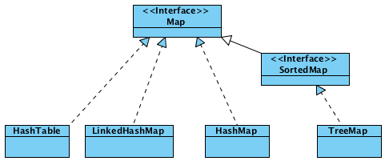
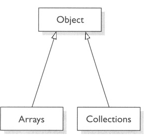

</div>

## 6.14. 🅱️ برخی مفاهیم

* برخی از ظرف‌ها synchronized هستند (Synchronized Collections)
    * ظرف‌هایی که استفاده از آن‌ها در چند thread همزمان، امن است
    * کلاس‌های thread-safe (مراجعه به مبحث thread)
    * مثل Vector و Concurrent Hash Map
    * اگر نیازی به استفاده همزمان از اشیاء کلاس نیست، از اینها استفاده نکنید
* برخی ظرف‌ها غیرقابل تغییر هستند (Unmodifiable Collections)
    * فقط می‌توانیم اعضای آن‌ها را پیشمایش کنیم (کم‌و‌زیاد کردن اعضا ممکن نیست)

مثال:

```java
List<String> unmod1 = Arrays.asList("A", "B");
List<String> mod1 = new ArrayList<>(unmod1);
Collection<String> unmod2 = Collections.unmodifiableCollection(mod1);
```

نکته(از جاوا 7 به بعد): امکان عدم ذکر نوع عام (generic) هنگام ایجاد شیء

```java
List<String> mylist1 = new ArrayList<String>();
List<String> mylist2 = new ArrayList<>();

Set<Integer> set1 = new HashSet<Integer>();
Set<Integer> set2 = new HashSet<>();

Map<String, Integer> m2 = new HashMap<String, Integer>();
Map<String, Integer> m1 = new HashMap<>();
```

# 7. 🅰️ Stream

* سه نوع ورودی رایج در برنامه‌ها به شکل زیر است:
    * ورودی استاندارد(Standard Input)
        * راه ساده استفاده در جاوا استفاده از Scanner یا System.in است
    * خروجی استاندارد(Standard Output)
    * خروجی ارور استاندارد(Standard Error)
* ورودی‌های System.in از نوع

نمایش در خروجی استاندارد

```javaSystem.out.println("")
System.out.println(variable)
System.out.format("min double = %5.2f", floatVariable); #فرمت مناسب برای نمایش اعداد اعشاری
```

کلاس‌های زیادی در جاوا پیرامون مبحث ورودی و خروجی مطرح است که برخی از آن‌ها در ذیل آورده شده است

## 7.1. 🅱️ Scanner class

این کلاس در مسیر java.util.Scanner قرار دارد و برای دریافت و پردازش رشته‌های متنی کاربرد دارد. مثلاً اگر بخواهیم درخصوص برنامه‌ای از کاربر دیتا دریافت کنیم

```java
Scanner scaner = new Scanner(System.in);
String line = scaner.nextLine(); #دریافت رشته از کاربر
int i = scaner.nextInt(); #دریافت عدد اینتیجر از کاربر
double d = scaner.nextDouble(); #دریافت عدد دابل از کاربر
```

کلاس Scanner می‌تواند با انواع Input Stream ها و Reader ها کار کند

```java
s = new Scanner("1.txt");
s = new Scanner(new File("1.txt"));
s = new Scanner(new FileInputStream("1.txt"));
s = new Scanner(new FileReader("1.txt"));
```

# 8. 🅰️ مدیریت‌خطا(Exception)

**Exception**: خطا یا اتفاقی غیرعادی که در جریان اجرای برنامه رخ می‌دهد و سبب اخلال در روند اجرای طبیعی برنامه‌می‌شود.
بصورت پیش‌فرض اگر در زمان اجرا خطا یا استثنایی رخ دهد، این استثنا توسط JVM کشف می‌شود و توضیحاتی درباره این استثنا به خروجی standard output هدایت می‌شود و اجرای برنامه قطع می‌شود و خاتمه می‌یابد(اگر آن Exception مدیریت نشده باشد). این روند پیش‌فرض می‌باشد ولی معمولاً برنامه‌نویس باید عکس‌العمل بهتری برای زمان بروز استثنا پیاده‌سازی کند.

* برخی از عناوین مهم که سبب بروز خطا در زمان اجرا خواهند شد:
    * ورودی نامعتبر
    * تقسیم عدد بر صفر
    * دسترسی به مقداری از آرایه که خارج از محدوده آرایه است
    * خرابی دیسک
    * باز کردن استریم(سوکت یا فایل یا دیوایس یا غیره) که وجود ندارد
* استثناء یک مفهوم در زمان اجرا است و یک کد در زمان کامپایل، هیچ خطایی ندارد

## 8.1. 🅱️ Exception Object

* هر استثناء یک شیء است و هنگام رخداد Exception ، «شیءاستثنا» یا «Exception Object» بهJVM تحویل می‌شود که به آن «پرتاب‌استثنا» یا «Throwing Exception» گفته می‌شود.
* «شیءاستثنا» شامل اطلاعاتی نظیر موارد زیر است:
    * پیغام خطا
    * اطلاعاتی پیرامون نوع خطا
    * شماره خطی از برنامه که استثناء در آن رخ داده است
    * محل اصلی پرتاب شدن استثناء
    * Stack Trace: مجموعه متدهایی که استثناء از آن‌ها عبور کرده و متدهای getStackTrace و printStackTrace قابلیت دسترسی به اطلاعات را از طریق «شیءاستثنا» فراهم می‌آورد

```java
public class StackTrace {
public static void main(String[] args) {
try{
f();
}catch(Exception e){
e.printStackTrace();
}
}
private static void f(){
g();
}
private static void g(){
throw new NullPointerException();
}
}
//OUTPUT:
//java.lang.NullPointerException
//at Third.g(Third.java:18)
//at Third.f(Third.java:13)
//at Third.main(Third.java:5)
```

### 8.1.1. ✅️ Class Exception جدید

* کلاس جدید معمولاً کلاس‌های ساده‌ای از «ابرکلاس» java.lang.Exception هستند
    * می‌توانند در وضعیت پرتاب (throw) یا در وضعیت دریافت (catch) باشند
    * متدها و ويژگی‌های کم و مختصری دارند(البته مثل همه کلاس‌ها می‌توانند سازنده، ويژگی و متدهای متنوعی داشته باشند)
    * معمولاً یک سازنده بدون پارامتر و یک سازنده با پارامتر رشته(دریافت پیغام خطا) دارند.

```java
public class IOException extends Exception {
public IOException() {
super();
}
public IOException(String message) {
super(message);
}
...
}
```

مثال از نحوه استفاده از کلاس IOException :

```java
if(...)
throw new IOException();
if(...)
throw new IOException("Internal state failure");
```

مثال:

```java
class BadIranianNationalID extends Exception {}
...
...
try {
if (input.length()!=10) {
throw new BadIranianNationalID();
}
System.out.println("Accept NationalID.");
} catch (BadIranianNationalID e) {
System.out.println("Bad ID!");
}

```

مثال:

```java
public static Integer getYear(String day) throws Exception {
if (day == null)
throw new NullPointerException();
if (day.length() == 0)
throw new EmptyValueException();
if (!matchesDateFormat(day))
throw new MalformedValueException();
String yearString = day.substring(0, 4);
int year = Integer.parseInt(yearString);
return year;
}

private static boolean matchesDateFormat(String input) {...}
```

* درهنگام ایجاد یک کلاس Exception جدید درصورت تمایل می‌توانید نوع آن را Checked Exception یا Unchecked Exception قرار دهید.
    * Checked Exception ← کلاس جدید را فرزند Exception قرار دهید
    * Unchecked Exception ← کلاس جدید را فرزند RuntimeException قرار دهید
* اگر نمی‌خواهید کامپایلر آن را چک کند، آن را چک‌نشده تعریف کنید
* برای این کار، کلاس جدید را فرزند RuntimeException قرار دهید

## 8.2. 🅱️ Exception Handling Framework

* مکانیزمی برای برنامه‌نویسی بهتر در تشخیص و گزارش و مدیریت استثناءها
* سبب می‌شود تا بدنه اصلی برنامه و بلوک‌های مدیریت خطاها تفکیک شود
* مدیریت خطا در بخشی از کد ممکن می‌شود که این کار امکان‌پذیر است و نه قسمتی که خطا رخ می‌دهد.
    * ممکن است خطا در یک بخشی از برنامه رخ دهد ولی عکس‌العمل مناسب در جایی دیگر از برنامه صورت گیرد. مثلاً در یکی از متدهایی که آن را فراخوانی نموده‌اند
* امکان گروه‌بندی و دسته‌بندی نمودن خطاها و پیاده‌سازی خاص پیرامون نوع خطا خاص صورت گیرد.
* هر «شیءاستثنا»، نوعی دارد، مثلاً نوع «خطا هنگام خواندن فایل» و «خطای تقسیم بر صفر» متفاوت است. بنابراین می‌توان خطاها را برحسب نوع دسته‌بندی نمود.

```java
try {
Commands;
}catch (ArithmeticException e1) {
Handler;
}catch (ArrayIndexOutOfBoundsException e2) {
Handler;
}catch(IOException e3){
Handler;
}catch( SQLException e4){
Handler;
}catch(ClassCastException | NullPointerException e5){
Handler;
}catch(Exception e){
Handler;
}
```

* اگر چندین catch تنظیم شده باشد:
    * اگر در catch اول یک نوع استثنا تنظیم شود، آنگاه نمی‌توانیم درcatch دوم یک «زیرکلاس» از آن نوع استثنا دریافت کنیم.
    * یعنی بلوک اول باید جزئی‌تر از بلوک‌های بعدی باشند وگرنه استثناء توسط آن بلوک دریافت و هیچ‌گاه به بلوک دوم نمی‌رسد
    * در چنین شرایطی ارور Unreachable catch block به شما اجازه نخواهد داد.
    * در مثال زیر این موضوع بیان شده است:

```java
try {
int a = Integer.parseInt(args[0]);
int b = Integer.parseInt(args[1]);
System.out.println(a/b);
} catch (Exception ex) {
//..
} catch (ArrayIndexOutOfBoundsException e) { //❌️️️ ارور: زیرا تمامی استثناها توسط بلوک بالا دریافت و به این بلوک نمی‌رسد
//..
}
//در مثال بالا اگر ترتیب جایگزین شود مشکلی بوجود نخواهد آمد
```

اگر متدی در زیرکلاس خود override می‌شود، اجازه ندارد دایره Exception ها(که به کمک throws پرتاب می‌کند) را گسترده‌تر نماید. یعنی زیر کلاس حق ندارد استثناءهای بیشتری از ابرکلاس برای پرتاب تعریف نماید

مثال۱:

```java
class Parent{
void f(){} // بدون مدیریت استثنا
}
class Child extends Parent{
void f()throws Exception{} //❌️️ زیرا کلاس والد هیچ استثناء مدیریت نکرده ولی فرزند استثناء مدیریت کرده است
}
```

مثال۲:

```java
class Parent{
void f() throws ArithmeticException{} // مدیریت تنهای یک نوع استثنا
}

class Child extends Parent{
void f() throws ArithmeticException, IOException{} //❌️️️ مدیریت دو نوع استثنا
}
```

مثال۳:

```java
class Parent{
void f()throws ArithmeticException{} // استثناء از نوع خاص‌تر
}
class Child extends Parent{
void f() throws Exception{} // ❌️️️ اینجا استثناء از نوع عام‌تر مدیریت شده است
}
```

مثال۴:

```java
class Parent{
void f() throws Exception{}
}
class Child extends Parent{
void f() throws ArithmeticException{}
}
// ✅️ بدون ارور
```

### 8.2.1. ✅️ Try

* قطعه کدی که ممکن است سبب بروز خطا شود داخل این بلوک قرار داده می‌شود.
* اگر خطایی در قطعه Try رخ دهد، برنامه همان قسمت متوقف شده و دنبال یک «Exception Handler» می‌گردد و در صورت یافتن آن ، خطا مستقیماً به قسمت Catch مربوط به Handler خود هدایت می‌شود.
* هنگام رخداد یک ٍException ، یک «شیءاستثنا» یا «Exception Object» ایجاد می‌شود

#### 8.2.1.1. ❇️ امکان try-with-resources

* دو قطعه کد زیر یکسان هستند و این امکان برای ریسورس‌ها نظیر فایل‌ها بوجود آمده است که خودکار یک ریسورس close گردد

* قبل از جاوا۷

```java
BufferedReader br = new BufferedReader(new FileReader(path));
try {
return br.readLine();
} finally {
if (br != null) br.close();
}
```

بعد از جاوا۷

```java
try (BufferedReader br =
new BufferedReader(new FileReader(path))) {

return br.readLine();
}
```

### 8.2.2. ✅️ Catch یا Exception Handler

* مجموعه اقدام‌های جانبی در صورت بروز خطا نیز در این بلوک قرار داده می‌شود.
* «شیءاستثنا» یا «Exception Object» که پرتاب «Throw» شده است، توسط Catch دریافت می‌شود.
* این قسمت از اطلاعات موجود در «شیءاستثنا» یا «Exception Object» برای مدیریت بهتر استثناء استفاده می‌کند.
* اگر این بخش نباشد: «رفتار پیش‌فرض جاوا» در مقابله با استثنا اجرا می‌شود. یعنی پیغام خطا در خروجی استاندارد چاپ و اجرای برنامه خاتمه خواهد یافت.
* در بسیاری از موارد باید بروز خطا را لاگ بزنیم و این کار در بلاک catch قابل انجام است-البته بهتر است از فناوری مخصوص لاگ مثل SLF4J استفاده نمایید. استفاده از System.out.println یا printStackTrace برای اینکار مناسب نیست
* پیام مناسب و گویا به عنوان message استفاده کنید:

```java

throw new IOException(message);
```

استثناء را نادیده نگیرید-مثلا کد فوق SQLException را خفه میکند(کار خوبی نیست)

```java
try {
db.save(entity);
} catch (SQLException ex) {}
```

### 8.2.3. ✅️ throw

عبارت زیر سبب پرتاب یک استثناء در یک تابع خواهد شد

```java
throw new Exception("متن دلخواه");
```

گاهی استثنا باید re-throw شود. یعنی catch شود، کارهایی انجام شود، و سپس دوباره throw شود

```java
try {
...
}catch (IOException ex) {
...
throw ex;
}
```

گاهی هم خطای جدیدی در بلاک catch پرتاب می‌شود. یعنی هر کاری که ممکن است در catch انجام می‌دهیم و سپس خطای جدیدی ایجاد و پرتاب می‌کنیم

```java
try {
...
}catch (IOException e) {
...
throw new ReportDataException(e);
}
```

### 8.2.4. ✅️ throws

* هرگاه در انتهای یک متد عبارت throw Exception مشاهده شد یعنی:
    * احتمال بروز خطا و پرتاب استثناء در این متد وجود دارد
    * این تابع هیچ عملی درخصوص Exception Handler نخواهد کرد و فقط استثناء را به تابع بالایی پرتاب می‌کند

مثال:

```java
public static int getYear(String day) throws Exception{
if (day == null || day.length() == 0)
throw new Exception("Bad Parameter");
String yearString = day.substring(0, 4);
int year = Integer.parseInt(yearString);
return year;
}
public static void main(String[] args) {
Scanner scanner = new Scanner(System.in);
System.out.print("Enter a date: ");
String date = scanner.next();
try {
Integer year = getYear(date); // فرض شود محتوی متغیر، معتبر نباشد
System.out.println(year);
}
catch (Exception e) {
System.out.println(e.getMessage());
}
}
```

مثال:

```java
public class Test1{
public ststic void main(String[] args){
try{
Scanner scanner = new Scanner(System.in);
int first = Scanner.nextInt();
int second = Scanner.nextInt();
int div = division(first,second);
System.out.println(div);
}catch(Exception e) {
System.out.println(e.getMessage());
}
}
private static int division(int first, int second)throws Exception {
if(second == 0)
throw new Exception("مخرج صفر هست");
return first/second;
}
```

### 8.2.5. ✅️ finally

```java
Try{
Commands;
} catch(ExceptionType e) {
Handler;
} finally {
Command;
}
```

* بخشی که در finally می‌آید، تحت هر شرایطی در انتهای اجرای try-catch حتماً اجرا می‌شود. شرایطی از قبیل:
    * تمام طبیعی اجرای بلاک try بدون پرتاب خطا
    * خروج اجباری از بلاک try (مثلاً با return ،break یا continue)
    * خطایی در try پرتاب شود و در catch دریافت شود
    * خطایی در try پرتاب شود و در هیچ یک از بلاک‌های catch، دریافت نشود
    * وموارد دیگر، تحت هر شرایطی...
* اگر خطا پرتاب شود یا نشود، در انتهای کار اجرای بخش finally تضمین می‌شود.
* معمولاً برای آزادسازی منابع گرفته شده در Try استفاده می‌شود.
    * همانند بستن فایل یا اتمام اتصال به دیتابیس البته هر منبعی بجز حافظه که این حافظه توسط ذباله روب بصورت خودکار آزاد می‌شود.

## 8.3. 🅱️ کلاس Throwable

* در واقع هر آن‌چه درباره Exception گفته‌شده، درباره Throwable نیز صادق است مثلاً هر شیء از جنس Throwable قابل پرتاب (throw) یا دریافت (catch) است
* دو نوع Throwable اصلی وجود دارد
    * Exception : اکثر کلاس‌های استثنا که با آن‌ها سروکار داریم
    * Error (خطا) : معمولاً تلاش نمی‌کنیم که آن‌ها را در برنامه catch کنیم
        * حتی اگر آن را catch کنیم، کار مهمی در قبال این خطاها نمی‌توانیم انجام دهیم
        * مانند: OutOfMemoryError

## 8.4. 🅱️ Unchecked Exception استثناء چک‌نشده

* برای برخی استثناها ذکر کلیدواژه throws واجب نیست.
* کامپایلر در زمان کامپایل احتمال دریافت(Catch) یا اعلان پرتاب(throw) توسط متد را اجبار نمی‌کند
* کلاس‌های این نوع، عبارتند از :
    * کلاس Error
    * کلاس Runtime Exception
    * زیرکلاس‌های Error و Runtime Exception

به قطعه‌کد زیر توجه نمایید:

```java
private static void function(String arg) {
System.out.println(1 / arg.length()); //ممکن است صفر باشد
}
public static void main(String[] args) {
function("");
}
```

بطور مثال در قطعه‌کد بالا متد function ممکن است Arithmetic Exception پرتاب نماید ولی کلیدواژه throws تصریح نشده است. با التزام این کار برنامه‌ها پر از throws های نامهم می‌شدند.

* کلاس‌های ArrayIndexOutOfBoundsException یا ArithmeticException از این قبیل هستند.

## 8.5. 🅱️ checked Exception استثناء چک‌شده

* کامپایلر جاوا بررسی می‌کند که اگر در یک متد این نوع Exception ها پرتاب می‌شود پس متد باید آن را Catch کند یا احتمال پرتاب شدن را به کمک throws اعلام نماید.

به قطعه کد زیر توجه نمایید:

```java
void example(int x) {
if(x==1)
throw new Error();
if(x==2)
throw new RuntimeException();
if(x==3)
throw new NullPointerException();
if(x==3)
throw new IOException(); //❌️️️ اینجا سبب ارور می‌شود
// Syntax Error:Unhandled Exception Type IOException
```

فرم درست این قطعه کد بصورت زیر است

```java
void example(int x) throws IOException {
...
if(x==3)
throw new IOException();
}
```

## 8.6. 🅱️ استثناء illegal Exception

* از نوع Runtime است
* هنگامی throw می‌شود که هم‌اکنون وضعیت مطلوب است ولی ممکن است در آینده بنابر دلایل زیادی که هنوز آن را هندل نکردیم خطا رخ دهد.
* این استثناء را ارسال می‌کنیم تا برنامه‌نویس را نسبت به ملاحضه‌خیز بودن قطعه‌کد آگاه کنیم
* اصطلاح خودمانی: ممکن هست چیزهایی درست نباشد و در حال ریسک است. پس این استثناء را پرتاب می‌کنیم.
* انواع زیادی از این نوع وجود دارد که برخی در زیر آورده شده است:
    * illegalStateException
    * illegalSelectorException
    * illegalAccessException
    * illegalArgumentException
    * illegalCallerException
    * illegalFormatException
    * illegalThreadException
    * illegalAnnotationException
    * illegalReceiveException
    * illegalFormatWidthException
    * illegalClassFormatException

```java
…
@Override
public void play(String mediaPath) throws MediaPlayerException {
try {
….
} catch(Exception e) {
throw new IllegalStateException(e);
}
}
…
```

# 9. 🅰️ مفاهیم تکمیلی

## 9.1. 🅱️ Java Documents

* کامنتی که با **/ شروع شود تحت عنوان جاواداک در نظر گرفته می‌شود
* این جاواداک قبل از هر چیزی قرار گرفته باشد به توصیف همان جزء می‌پردازد(متد یا کلاس یا سازنده یا ویژگی یا هر چیز دیگر)
* دستور javadocs این توصیفات را به یک مستند HTML تبدیل می‌کند

```java
/**

* This class represents a human. Objects of this class are immutable...
* @author Sadegh Aliakbary
* @see java.lang.String
  */
  public class Person {
  /** national ID (SSN) */
  private String ID;
  private String name; //No javadoc

/**

* The only constructor of the class
* @param id The social security number (national ID)
* @param name The full-name, including first-name and last-name
  */
  public Person(String id, String name) {
  ID = id;
  this.name = name;
  }
  /**
* This method should be called to ask the person run
* @param speed The speed of running
* @return returns true if he/she can run with that speed
  */
  public boolean run(double speed){…}
  }
```

## 9.2. 🅱️ Refactoring

برخی تکنیک‌های کدنویسی برای منظم‌نمودن و سادگی و تمیز سازی قطعات کد نوشته شده

* قواعد کلی برای کد
    * استفاده از نام‌های مناسب در کد
    * کاهش پیچیدگی در هر سطح و در هر قسمت که میسر است
* «منظم‌سازی» متد
    * استخراج متد برای ه ر هدف
        * برپایه کشف رابطه بین اجزای کد
    * هدف مستقل و منسجم
        * یک متد خوب کاری مستقل و منسجم انجام می‌دهد.
        * حدالامکان هر متد هدفی واحد انجام دهد( استقلال)
        * پرهیز از پیچیدگی وابستگی‌ بین متدها
    * پرهیز از تکراری نویسی و تبدیل به متد
        * دو متد نباید یک کار را انجام دهند
        * هیچ‌گاه نباید یک قطعه کد دوبار استفاده شود و حتماً باید به متد تبدیل شود
    * ساده‌سازی
        * عدم استفاده از متدهای طولانی و ساده‌سازی کارها
        * عدم استفاده از تعداد متغیر زیاد در متدها
        * کاهش تعداد آرگومان ورودی به متد و ساده‌سازی متغیر‌های ورودی به متد بعنوان آرگومان
        * دیتای مورد نیاز برای استفاده در هر متد توسط خود متد تولید شود و در متغیر محلی ریخته شود.(حدالامکان) و نه اینکه بعنوان آرگومان ورودی پاس داده شود
    * استفاده از تکنیک فراخوانی متد به جای پاس شدن مقدار پارامتر همانند استفاده از Getterها
    * استفاده از متدهای inline
* «منظم‌سازی» کلاس
    * استخراج کلاس بر پایه کشف روابط بین اجزای کد
    * عدم تعریف کلاس بزرگ و حدالامکان استخراج «زیرکلاس» یا «ابرکلاس»
    * اگر یک متد از یک کلاسی به کررات استفاده می‌شود پس شاید بهتر باشد به نحوی به کلاس خویش منتقل شود
    * اگر درتغییر یک قطعه کد، جاهای زیادی با پراکندگی زیادی از کلاس‌ها درحال تغییر است، این «بوی‌بد» تلقی می‌شود.
    * کلاس‌های کوچک و مختصر که معمولاً از آن‌ها استفاده نمی‌شود باید با تدبیر مناسب به کلاس‌های دیگر بپیوندند و ترکیب شوند
* «منظم‌سازی» متغیر
    * استخراج متغیر برای اهداف خاص
    * تکنیک: تبدیل مجموعه پارامترها به یک شیء (Introduce Parameter Object)

تحقیق برای بهروز: در اینترنت عنوان «بوی‌بد» یا «Bad Smell» را جستجو نمایید و تکنیک‌های کدنویسی بهتر را استخراج نمایید
http://refactoring.comm/catalog

# 10. 🅰️ تست نرم‌افزار(JUnit)

* پس از اتمام یک برنامه توسط برنامه‌نویس، پیش از تحویل محصول به مشتری، باید ابعاد کنترل و تضمين کيفيت محصول بررسی و آزمايش شود. تا از كيفيت آن مطمئن شويم. نرم افزاري كه آزمايش نشده، هنوز كامل نيست. انواع آزمايش‌ها، كيفيت نرم‌افزار را از ديدگاههاي مختلف مي‌آزمايند.
* **تست‌نرم‌افزار** : فرايندی برای آزمايش ويژگی‌های موردنظر نرم‌افزار و بررسی عمل‌کرد برنامه نوشته شده
* تست از نوع junit
    * ساخت فولدر بنام تست یعنی New>CreateDirectory
    * راست کلیک روی فولدر و انتخاب گزینه TestSourceRoot (رنگ سبز) از منوی MarkDirectoryAs
    * روی کلاس کلیک و از لامپ ظاهر شده گزینه Create Test را انتخاب می‌کنیم
    * انتخاب توابعی که می‌خواهیم تست روی آن انجام شود
* معمولا بهتر است که در تست‌های Junit موارد Exception ها را داخل throws قرار دهیم زیرا اگر اکسپشن رخ بدهد آن را fail تلقی میکند

## 10.1. 🅱️ مفاهیم

* **BusinessCode** : متن اصلی کد برنامه‌ها
* **TestCode** : کدهایی که برای آزمانیش برنامه‌ها نوشته شوند
* سطح آزمون : در چه حدی و ریز شدن نرم‌افزار تست می‌شود
    * آزمون واحد: تست یک مولفه یا بخش کوچک
    * آزمون يکپارچگی: تست چند بخش که با هم یکپارچه شده و اقدام واحدی را انجام می‌دهند
    * آزمون سيستم: تست تمام نرم‌افزار
* نوع آزمون: آزمون عملکرد، آزمون ويژگی‌های کيفی
* روش آزمون:
    * white box: در تست جزئیات پیاده‌سازی را مد نظر قرار دهیم
    * black box: به نحوه پیاده‌سازی کاری نداریم و فقط ورودی و خروجی را تست می‌کنیم و توقع داریم این سیستم همانند یک جعبه سیاه کار نماید
* شکل آزمون: آزمون خودکار، آزمون‌دستی
* نقش آزمون‌گر: برنامه‌نويس، تيم تست، کاربر يا …
* آزمون واحد یا Junit از وظایف برنامه‌نویس است.
* تنها آزمون واحد کافی نیست و انواع دیگر آزمون‌ها برای تضمین کیفیت نرم‌افزار لازم است.
* چارچوب‌های xUnit : چارچوب‌هايی برای آزمون واحد در زبان‌های مختلف ايجاد شده است. اين ابزارها، اجرا و تشخيص نتيجه آزمون را خودکار می‌کنند. مجموعه اين ابزارها xUnit ناميده می‌شوند. مثل CppUnit در برای زبان سی پلاس پلاس و Junit درزبان جاوا
*
    * assert
    * Assert.assertEquals(Value1,Value2);
        * مقدار اول چیزی که انتظار داریم باشد
        * مقدار دوم: خروجی دیتای تولید شده توسط برنامه که میخواهیم بررسی کنیم
* تابع beforeClass یک قاعده است در JUnit که اجازه می‌دهد قبل از اجرای تست ها یک اتفاقی بیافتد
* تابع afterClass یک قاعده است در JUnit که اجازه می‌دهد بعد از اجرای تست ها یک اتفاقی بیافتد

```java
@BeforeClass
public static void beforeClass(){}

@AfterClass
public static void afterClass() throws SQLException{}
```

* **معایب تست سنتی:**

* تست‌هاي نوشته شده دور ريخته می‌شود و استفاده مجدد ممکن نیست(software reuse) برای test code
* در هر لحظه يك تست انجام می‌شود
* برنامه نويس بايد به صورت دستي تست‌ها را اجرا كند
* برنامه نويس بايد شخصاً از صحت آنها مطمئن شود و تشخيص موفقيت آميز بودن تستها خودکار نيست

**ویژگی‌های آزمون‌واحد (Unit Test)**

* اجراي خودکار
* تشخيص خودکار موفقيت تست
* قابل تكرار و استفاده مجدد
* یک آزمون white box است (نه black box)
* یک آزمون واحد است (نه آزمون سيستم، و نه حتی آزمون چند بخش يکپارچه شده)
* معمولاً هدف آزمون عملکردی (نه آزمون ويژگی‌های کيفی)
* آزمون خودکار انجام می‌شود (نه دستی)
* توليد و انجام آن توسط خود برنامه‌نويس است (نه توسط تيم تست يا کاربر)
* بهبود کيفيت برنامه‌ها
* کاهش اشکالات (bugs) و وقت كمتري به خاطر debugging هدر ميدهد
* به تأخير نيافتادن زمان کشف اشکالات برنامه
* بهبود ساختار و طراحی برنامه
* افزايش اطمينان به اجزای برنامه و سطوح پايين کد
* مستند گويا، زنده و قابل اجرا برای برنامه

## 10.2. 🅱️ نکات Junit

* هر متد تست يک نمونه‌آزمون (test-case) خوانده د
* نمونه‌آزمون‌ها متد main ندارند و با کمک Test Runner اجرا می‌شوند
    * غالباً از طريق محيطهای برنامه‌نويسی (مثل Eclipse) يا Maven اجرا می‌شوند
    * يادآوری: موفقيت‌آميز بودن آزمون بايد به صورت خودکار بررسی شود
    * نه به صورت دستی: سندروم println 😁️
* نتيجه آزمون در JUnit با کمک assertion بررسی می‌شود. مثال: متد assertEquals
* هر نمونه‌آزمون شامل اين بخش‌هاست:
    * test data : يک ورودی برای متد موردآزمون تعیین می‌شود
    * expected result : خروجی و رفتار موردنظر برای اين ورودی مشخص می‌شود
    * invocation : متد موردآزمون با اين ورودی فراخوانی می‌شود
    * assertion : خروجی و رفتار متد با خروجی موردنظر تطبيق داده می‌شود
* اگر اجرای تست موفقيت‌آميز باشد: تست pass شده است
* اگر اجرای تست موفقيت‌آميز نباشد: تست fail شده است

## 10.3. 🅱️ Junit Framework

* مثلاً در Eclipse باید Library فریم‌ورک JUnit را به سیستم اضافه نماییم
* قبل از متد از annotation تحت عنوان Test استفاده می‌کنیم
* هر متدی که قبل از آن انوتیشن test آمده باشد بعنوان یک تست در نرم‌افزار تلقی می‌شود. و نرم‌افزار خروجی تک تک این متدها را نشان می‌دهد که آیا صحیح انجام شده است یاخیر.
* معمولاً یک کلاس جدید ایجاد می‌کنند به نام تست و تمام تست‌های مربوطه به یک کلاس را در آن قرار می‌دهند.
* مجموعه متدهای JUnit Assertions

```java
assertNull(x)        // بررسی نال بودن مقدار
assertNotNull(x)    // بررسی نال نبودن مقدار
assertTrue(boolean x)    // بررسی صحیح بودن مقدار
assertFalse(boolean x)    // بررسی ناصحیح بودن مقدار
assertEquals(x, y)    // x.equals(y) بررسی مساوی بودن که توسط تابع صورت می‌گیرد
assertSame(x, y)    // x ==y بررسی برابر بودن از جنس مساوی بودن و از اپراتور مساوی استفاده می‌شود
assertNotSame // بررسی نابرابر بودن مقدار
fail()            // اگر اجزای تست به آن برسد آنگاه آزمون شکست می‌خورد
// و تنها در خطی از این تابع استفاده می‌کنیم که نمی‌خواهیم اجرای برنامه به هیچ‌وجه به اون خط برسد و غیره
```

* متد **Before**
    * قبل از هر متد تست اجرا می‌شود
    * مسؤول کارهایی كه قبل از اجراي هر تست لازم است. مثل اتصال به پايگاه داده، مقداردهي به فيلدها و غیره
* متد **BeforeClass** : يک بار قبل از همه تست‌ها
* متد **After**
    * اجرا بعد از هر متد تست. مثل بستن اتصال به پايگاه داده، بستن فايل و غیره
* متد **AfterClass** : یکبار بعد از همه تست‌ها

## 10.4. 🅱️ قطعه‌کدها و مثال‌ها

مثال۱: یک آرایه داریم و می‌خواهیم مرتب‌سازی شود و در انتها چک شود که آیا مرتب سازی بدرستی صورت گرفت است یا خیر

```java
@Test //استفاده از انوتیشن
public void testSort(){
int[] array = {3,2,1,5,6,4}; // آرایه‌ای که قصد مرتب‌سازی داریم
sort(array); // اعمال عملیات مرتب سازی
int[] sortArray={1,2,3,4,5,6}; // تعریف یک آرایه که انتظار داریم آرایه قبلی همانند این آرایه بشود
assertArrayEquals(array, sortArray);)    // بررسی تساوی آرایه اصلی و آرایه‌ای که انتظار داریم باشد
}
```

در مثال بالا اگر تساوی دو آرایه برقرار نبود پس متد assertArrayEquals خروجی عدم تساوی گزارش می‌دهد

مثال۲: بخش Business Code

```java
public class MyMath {
private static final MyMath instance = new MyMath();

public static MyMath getInstance(){
return instance;
}
public int division(int a, int b){
if( b == 0 ) throw new ArithmeticException("Division by zero");
return a//b;
}
public int multiply(int a, int b)
return a*b;
}
}
```

مثال۲: بخش Test Code

```java
@Test
public void testDivision(){
MyMath math = MyMath.getInstance();
asserNotNull(math);
assertEquals(math.division(4,2),2);
assertEquals(math.division(5,3),1);
try{
math.division(5,0);
// the test should never reach this line:
fail();
}catch(Exception e){
//The Exception is OK
asserTrue(e Instanceof ArithmeticException);
}
}
```

مثال۲:

```java
public class TestDB {
private static Database db;
private static List<String> storage;

@BeforeClass // یکبار برای همه تست‌ها باید این متد انجام شود
public static void startup(){
db = new Database();
storage = new ArrayList<String>();
db.setStorage(storage);
}
@Afterclass // یکبار برای همه تست‌ها باید این متد انجام شود
public static void shutdown(){
db = null;
storage = null;
}
@Before // قبل از هر تست
public void setup(){
db.open(;
}
@After // بعد از هر تست
public void teardown(){
db.close();
}
}
```

مثال۲: بخش‌تست

```java
@Test
public void testNormal(){
String name = "Ali Alavi"
db.insert(name);
asserTrue(storage.contain(name));
db.delete(name);
assertFalse(storage.contain(name));
}
@Test
public void TestNull(){
db.insert(null);
asserTrue(storage.contain(null));
assertEquals(1,storage.size());
}

```

# 11. 🅰️ WEB

* **JavaWebServers**:
    * ApacheTomcat: رایگان و محبوب‌ترین وب‌سرور که فقط servlet یا JSP را ساپورت می‌کند
    * EclipseJetty: محبوبیت‌درجه‌دوم
    * WildFly: برای ردهت و رایگان و اپن‌سورس
    * IBMWebsphere: غیررایگان
    * OracleWeblogic: غیررایگان[Develop رایگان ارائه می‌دهد ولی اگر بخواهیم محصول رسمی ارائه بدهیم محدود می‌شود]
        * پورت پیش‌فرض: 7001
        * کانتکس‌پَت‌پیش‌فرض:console یعنی پس از نام دامنه این نام را قرار بدهید
    * OracleGlassFish: رایگان و اپن‌سورس
* **JavaApplicationWebserver**: اگر بخواهیم فایل *.Jar نظیر ejb-app.jar یا *.Ear نظیر web-ejb-app.ear را باز کنیم.
    * OracleWeblogic: غیررایگان و یکی از بهترین‌ها است
    * OracleGlassFish: رایگان و اپن‌سورس
    * IBMWebsphere: غیررایگان
    * Jboss: برای ردهت و غیررایگان
    * WildFly: برای ردهت و رایگان و اپن‌سورس
* پوشه‌ها:
    * src: سرولت‌ها و سرویس‌ها و تمامی لاجیک برنامه که نوشته می‌شود و لایه کنترلر است
        * معمولا فایل‌های Text و XML در این پوشه نباید قرار بگیرد زیرا این پوشه برای فایل‌های جاوایی و باینری درنظر گرفته شده است
    * web: تمامی صفحات استاتیک[شامل اچ‌تی‌ام‌ال‌ها] و استاتیک ریسورس‌ها[سی‌اس‌اس و جاوا اسکریپت]
        * اگر لایبرری مجزا داشتیم باید رد پوشه‌ای بنام lib در این فولدر کپی بشود
    * Resources: این پوشه معمولا نیست و ما خودمان میسازیم و mark as آن را به RootResources تغییر میدهیم و قرار می‌کنیم که فایل‌های پروژه را در این پوشه قرار دهیم
        * داخل آن میتوانیم چندین دایرکتوری بسازیم

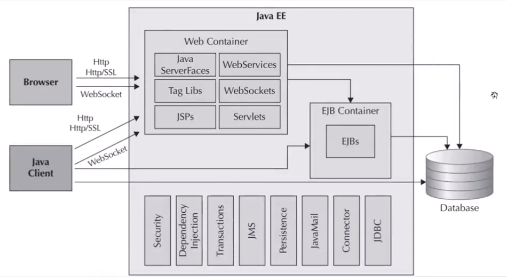
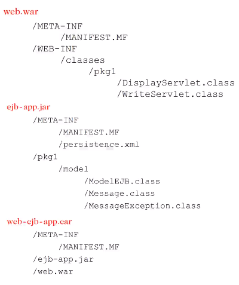

## 11.1. 🅱️ WebContainer

* JSF(JavaServerFace)
    * روش مدرن برای نوشتن صفحات JSP
    * با استفاده از JSF شما دارید آن را جایگزین JSP می‌کنید
* JSP(JavaServerPages)
    * نمونه ساده شده Servlet ها می‌باشد که اجازه ساخت صفحات پویا را به برنامه‌نویس می‌دهد
    * برنامه‌های jsp فایل‌هایی که شامل کد های Html و جاوا می‌باشند که در هنگام اولین دسترسی به servlet تبدیل می‌شوند(توسط Container)
* XML
    * web-app: در این فایل tag اصلی می‌باشد
    * servlet: در این tag یکسری اطلاعات پیرامون Servlet تعریف میکنیم
    * load-on-startup : این tag به این معنا میباشد که در هنگام بالاآمدن Web Logic Server تعریف میشود. این عدد باید مثبت باشد و نشان دهنده اولویت اجرا آن میباشد.
    * Servlet-Maping : نشان دهنده ارتباط بین Servlet و آدرس URL می‌باشد. در این tag مشخص میشود که چگونه به Servlet های خود دسترسی پیدا کنید. در اینجا ما تمام URL هارا با استفاده از Servlet تعریف شده مدیریت میکنیم.
* TagLibs(JSTL(JavaServerPagesTagLibrary))
    * فراهم‌آوردن قابلیت‌های JavaCore در قالب Tag برای WebApplication‌ها
    * تگ‌هایی که در صفحات وب بصورت سفارشی توسط برنامه‌نویس تعریف می‌شود و در تیم برای استفاده از آن قرارداد می‌کنید

```java
<servlet-name>Faces Servlet</servlet-name>
<servlet-class>javax.faces.webapp.FacesServlet</servlet-class>
<load-on-startup>1</load-on-startup>
<url-pattern>*.xhtml</url-pattern>
<welcome-file-list><welcome-file>index.jsp</welcome-file></welcome-file-list>
// اگر تنها دامنه وارد شد و صفحه خاصی وارد نشد بصورت خودکار این صفحه را باز نماید
```

### 11.1.1. ✅️ WebServices

* نحوه ارتباط با endpoint و فراخوانیوب‌سرویس تحت پروتکل‌های وب‌سرور
    * Soap:
    * RestApi:

### 11.1.2. ✅️ WebSocket

* قابلیت بازنگهداشتن یک ارتباط باز بین مرورگر و سرور برای مواردی که در ادامه ممکن است استفاده شود
* درخواست‌های وب از نوع StateLess است یعنی وقتی ارسال می‌شود تمام می‌شود ولی در WebSocket می‌توان پروتکلی مابین سرور و کلاینت برقرار کرد که ارتباط قطع نشود و مکانیزمی مشابه pushAjax داشته باشیم
* این تکنولوژی در رابط‌کاربری‌های خیلی مدرن استفاده می‌شود
* مثال:
    * چت‌های برپایه وب: پیام‌رسان‌ها
    * Notificationهای سایت‌هایی نظیر فیس‌بوک

## 11.2. 🅱️ Servlet

* Servlet: برنامه‌ای که در شبکه کار می‌کند
* Java Servlet : تکنولوژی جدیدتر از CGI برای ساخت WebApplication
    * جاوا سرولت یک کلاس است که در زمان اجرا توسط وب‌سرور تنها یک شیء از آن ساخته می‌شود
    * پردازش درخواست های http را انجام می‌دهد
    * مزیت
        * کاراریی بهتر: استفاده از thread بجای ایجاد پردازه کاملا جدید
        * قابلیت جابجایی: زبان جاوا CrossPlatform است
        * استفاده از حافظه مشترک: برای درخواست‌ها و پردازه‌ها و thread‌ ها
        * سبک‌تر: ارتباط بین thread ها بسیار راحت‌تر از ارتباط بین پردازه‌هاست
* اقداماتی که یک سرولت انجام می‌دهد:
    * بررسی هدرهای درخواست و بادی درخواست و قراردادن و اِنکپسول‌کردن در کلاس ServletRequest و از آن به بعد برنامه نویس توسط جاوا با آن ارتباط برقرار می‌کند و در ادامه هدرهای پاسخ را تولید می‌کنیم
    * تولید دیتا برای پاسخ به کلاینت
    * مشخص کردن هدر پاسخ
    * نوشتن بادی پاسخ
* چرخه‌حیات‌سرولت‌ها:
    * تولید تنها یک شیءاز کلاس سرولت
    * فراخوانی تابع init : به محض اینکه اولین بار سرور توسط اپلیکیشن سرور فراخوانی می‌شود. کاربرد زمان استفاده از ریسورس یا گرفتن مقادیر
    * فراخوانی توابع متناظر مثلا doGet یا doPost یا غیره
    * فراخوانی تابع destroy: دقیقا به محض UnDeploy شدن پروژه از اپلیکیشن سرور یا استاپ شدن اپلیکیشن سرور یا آزاد کردن ریسورس
* Servlet Container: ایجاد ملزومات و شرایط‌اجرا برای JavaEE Applications
    * درخواست کلاینت به سرور برای ارسال و نمایش یک صفحه وب
    * درخواست به وب‌سرور موجود در سرور ارسال می‌شود
    * در سمت سرور پویا کننده صفحات‌وب بر عهده جاوا است
    * وب‌سرور و servlet برای مدیریت کردن صفحات‌پویای‌وب در تعامل هستند
        * پشتیبانی از Multi Threading
        * مدیریت Life Cycle یا طول عمر درخواست‌ها
        * تامین امنیت
        * Object Pooling: استفاده مجدد از objectهایی که ایجاد دوباره آن هزینه زیادی خواهد داشت
* متد‌ها:
    * Service: نماینده تمام متدهای http است
* Anotations:
    * WebServlet: برای اینکه یک کلاس مشتق شده از httpServlet بعنوان سرولت درنظر گرفته شود ۲ راه وجود دارد۱-ذکر نام آن در تنظیمات یا قراردادن این انوتیشن در قبل از نام کلاس برای این مشخص شدن نام یوآرال از کلید زیر استفاه می‌کنیم

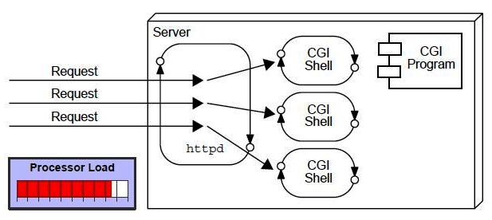

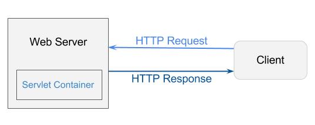
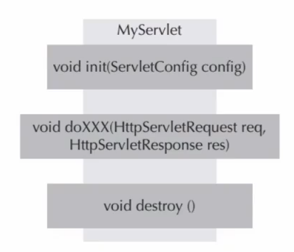

### 11.2.1. ✅️ HttpServletRequest

```java
HttpServetRequestMethods:
Decoded:http://127.0.0.1:7001/hr/employee$list?dep_name=fin^com]
Encoded:http%3A%2F%2F127.0.0.12%3A7001%2Fhr%2Femployee%24list%3Fdep_name%3Dfin%5Ecom%0A
```

* getContextPath()
    * Result:/hr
    * UrlDecode:No
* getLocalAddr()→ آدرس آی‌پی سروری که برنامه روی آن درحال اجرا است که برای فهمیدن پروکسی هم کاربرد دارد
    * Result:127.0.0.1
* getLocalName()→نام سرور که برای فهم پروکسی هم کاربرد دارد
    * Result:127.0.0.1
* getLocalPort()→شماره پورت
    * employee$list 7001
* getMethod()→نوع متد که از نوع گِت است یا پُست
    * Result: Get
* getPathInfo()→شامل مقداری که پس از کانتکس‌پَت
    * Result: employee$list
    * UrlDecode:Yes
* getProtocol()→نوع پروتکل
    * Result: http/1.1
* getQueryString()→مقادیری که بصورت پارامتر ارسال شده است
    * UrlDecode:No
    * Result:dep_name%3Dfin%5Ecom%0A
* getRequestedSessionId()→مدیریت تِرَک کردن کاربران
    * UrlDecode:No
* getRequestedURI()→از کانتکس پَت به بعد که دیکد نشده است
    * UrlDecode:No
    * Result: hr%2Femployee%24list%3Fdep_name%3Dfin%5Ecom%0A
* getRequestedURL()→کل مسیر را از اچ‌تی‌تی‌پی نمایش می‌دهد
    * UrlDecode:No
    * Result:http%3A%2F%2F127.0.0.12%3A7001%2Fhr%2Femployee%24list%3Fdep_name%3Dfin%5Ecom%0A
* getScheme()→
    * Result: http
* getServerName()→سرور جاری که باید به موضوع پرکسی توجه داشت که شاید تفاوت داشته باشد
    * Result: 127.0.0.1
* getServerPort()→7001
    * Result: شماره پورت سرور
* getServletPath()→ همان کانتکس پت
    * UrlDecode:Yes
    * Result:/hr
* getParameterName()→تمامی پارامترهای ارسالی را برمیگرداند
    * UrlDecode:Yes
    * Result: [dep_name]
* getParameter("dep_name")→خواندن مقدار یک پارامتر
    * UrlDecode:Yes
    * Result:fin^com
* getReader()→اگر رکوئست شامل بادی باشد آنگاه خواندن بادی ارسالی
    * Description:  معمولا در زمان ارسال رکوئست از نوع پست بطور مثال در زمان آپلود عکس یا ارسال اِیجَکس به حالت جِی‌سان این تابع مطرح می‌شود
        * معمولا در فرم‌های اچ‌تی‌ام‌ال، در رکوئست‌های مرورگر بادی ارسال نمی‌شود
    * return:BufferedReader
* getInputStream()→اگر بادی بصورت بایت استفاده شود
    * return:ServletInputStream
* getHeaderNames()→خواندن تمام هدرهای دریافت شده
    * return: Enumeration<String>
    * NextElement
    * HashMoreElement
* getHeader("Host") → خواندن هدر خاص
    * return: String
* getRemoteAddr()→آدرس سیستمی که ارسال کرده
    * return: String
* getRemoteHost()→ آی‌پی سیستمی که ارسال کرده
    * return: String
* getRemotePort()→پورت سیستمی که ارسال کرده
    * return: Int

[Http Servet Request](http://127.0.0.1:7001/hr/employee$list?dep_name=fin^com)
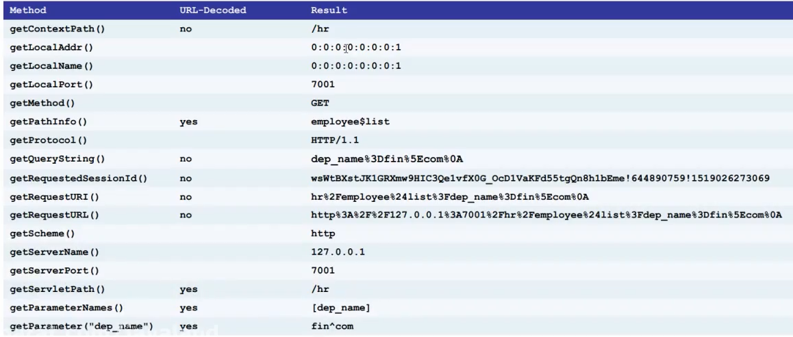

### 11.2.2. ✅️ HttpServletResponse

```java
HttpServetRequestMethods:*
Decoded:http://127.0.0.1:7001/hr/employee$list?dep_name=fin^com]*
Encoded:http%3A%2F%2F127.0.0.12%3A7001%2Fhr%2Femployee%24list%3Fdep_name%3Df*in%5Ecom%0A
```

* PrintWriter getWriter()→برای نوشتن بادی نوشتن بصورت کاراکتر
* ServletOutputStream getOutputStream()→برای نوشتن بادی بصورت بایت همانند ارسال پی دی اف
* addHeader(String name,String value)→افزودن هدر به پاسخ*
    * مثلا ارسال هدر برای اینکه به هیچ‌عنوان صفحه را کش نکند
* addDateHeader(String name,long date)→اضافه کردن هدر از جنس تاریخ به پاسخ
* voidsendRedirect(String location)→درخواست به کلاینت مبنی بر عوض کردن آدرس وب
* Http Servet Request(http://127.0.0.1:7001/hr/employee$list?dep_name=fin^com)

### 11.2.3. ✅️ Example1

ایجاد یک فرم html از نوع استاتیک و وصل کردن آن به یک سرولت

```java
@WebServlet(name = "RegisterServlet" ,urlPatterns={ "/registerData" })
public class RegisterServlet extend HttpServlet {
     protected void doPost(...){
         String firstName = request.getParameter("first_name");
         String lasttName = request.getParameter("last_name");
         String personalName = request.getParameter("personal_num");

         System.out.println("موارد درج شده در اینجا در ترمینال به نمایش در خواهد آمد")
         PrintWriter out = response.getWriter();
         out.write(s:"<!DOCTYPE html>");
         out.write(s:"<html>");
         out.write(s:"<body>");
         out.write(s:"<h1>Your data saved successfully</h1>");
         out.write(s:"<p>%s %s - PersonalNumber is = %s</p>",first_name,last_name,personal_num);
         out.write(s:"</body>");
         out.write(s:"</html>");
         out.close();
    }
     protected void doGet(...){}
```

```java
<!DOCTYPE html>
<html lang="en">
<head><meta charset="UTF-8"><title>ثبت فرم توسط سرولت</title></head>
<body>
<p>Please enter your information: </p>
<form method="post" action="registerData">
<table>
<tr><td><label for="first_name">first_name</label></td><td><input id="first_name" type="text" name="first_name" /></td></tr>
<tr><td><label for="last_name">last_name</label></td><td><input id="last_name" type="text" name="last_name" /></td></tr>
<tr><td><label for="personal_num">personal_num</label></td><td><input id="personal_num" type="text" name="personal_num" /></td></tr>
<tr><td></td><td><input type="submit" value="Save Data" /></td></tr>
</table>
</form>
</body>
</html>
```

# 12. 🅰️ Log

```java
private static final Logger lg = Logger.getLogger(<ClassName>.class.getName())
lg.severe(e.getMessage())
lg.info("متن دلخواه")
```

</div>

