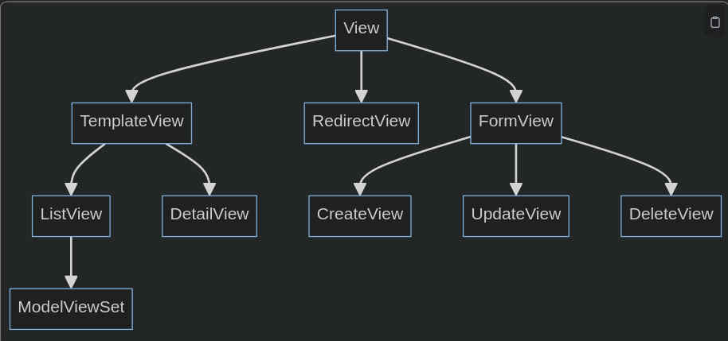

<div dir="rtl">

# 1. 🅰️BasicRenderingMethods

## 1.1. 🅱️django.http.HttpResponse

* نمایش صفحه `HTML` با تولید دستی رشته‌های `HTML` در کد پایتون
* این روش هیچ تمپلیتی ندارد. شما کل `HTML` را به صورت رشته‌ای (string) در کد پایتون می‌نویسید و با `HttpResponse` آن را به مرورگر می‌فرستید.
* هرگز در پروژه واقعی استفاده نشود(زیرا نگهداری آن غیرممکن است)
*     سریع برای تست یک خطی
* نیازی به فایل تمپلیت ندارد

```python
from django.http import HttpResponse


def home_view(request):
    html = """
    <!DOCTYPE html>
    <html>
    <head><title>صفحه اصلی</title></head>
    <body>
        <h1>سلام دنیا!</h1>
        <p>این صفحه کاملاً دستی نوشته شده است.</p>
        <footer>© 2025</footer>
    </body>
    </html>
    """
    return HttpResponse(html)
```

## 1.2. 🅱️HttpResponse+template(context)

* نمایش صفحه با استفاده از فایل تمپلیت (.html) و پردازش دستی آن در پایتون
* قبل از `render()` اولین روش صحیح برای نماش صفحات در جنگو بود
* از قابلیت‌های تمپلیت جنگو(مثلا `` یا `{{ variable }}`یا ``) استفاده می‌کند
* منسوخ شده و با render() جایگزین شده است
* روش کار:
    1. یک فایل `HTML` جداگانه(تمپلیت) داریم
    2. از طریق `loader.get_template()` تمپلیت خوانده می‌شود
    3. داده های کد به آن داده می‌شود
    4. خروجی را در `HttpResponse` قرار میدهیم

ساختار پروژه به صورت زیر است

```
myproject/
├── myapp/
│   ├── views.py
│   ├── templates/
│   │   └── welcome.html
│   └── urls.py
└── settings.py
```

File: `welcome.html`

```html
<!DOCTYPE html>
<html>
<head><title>خوش آمدید</title></head>
<body>
<h1>سلام {{ name }}!</h1>
<p>سن شما: {{ age }} سال</p>

<ul>
    
    <li>{{ activity }}</li>
    
</ul>

</body>
</html>
```

```python
# ╔══════════╗
# ║ views.py ║
# ╚══════════╝
from django.http import HttpResponse
from django.template import loader


def welcome_view(request):
    template = loader.get_template('welcome.html')  # ۱. بارگذاری فایل تمپلیت
    context = {  # ۲. تعریف داده‌هایی که به تمپلیت داده می‌شوند
        'name': 'علی',
        'age': 28,
        'hobbies': ['فوتبال', 'کتاب', 'سفر']
    }
    html = template.render(context, request)  # ۳. پر کردن تمپلیت با داده‌ها (render کردن)
    return HttpResponse(html)  # ۴. ارسال به مرورگر

# ╔═════════╗
# ║ urls.py ║
# ╚═════════╝
from django.urls import path
from .views import welcome_view

urlpatterns = [
    path('', welcome_view, name='welcome'),
]
```

## 1.3. 🅱️django.shortcuts.render()

* render() یک تابع کمکی (helper function) است که در جنگو برای ساده‌سازی نمایش صفحات HTML طراحی شده است.

```
myproject/
├── myapp/
│   ├── views.py
│   ├── templates/
│   │   └── welcome.html
│   └── urls.py
└── settings.py
```

File: `welcome.html`

```html
<!DOCTYPE html>
<html>
<head><title>خوش آمدید</title></head>
<body>
<h1>سلام {{ name }}!</h1>
<p>سن شما: {{ age }} سال</p>

<ul>
    
    <li>{{ hobby }}</li>
    
</ul>

</body>
</html>
```


```python
# ╔══════════╗
# ║ views.py ║
# ╚══════════╝
from django.shortcuts import render


def welcome_view(request):
    context = {
        'name': 'محمد',
        'age': 30,
        'activities': ['دویدن', 'شنا', 'گیتار']
    }
    return render(request, 'welcome.html', context)

# ╔═════════╗
# ║ urls.py ║
# ╚═════════╝
from django.urls import path
from .views import welcome_view

urlpatterns = [
    path('', welcome_view, name='welcome'),
]
```

نکته حالت های متفاوت ممکن است به صورت زیر باشد

```python
render(request, template_name, context=None, content_type=None, status=200, using=None)  # content_type default is text/html
render(request, 'welcome.html', context=None)
render(request, 'feed.xml', context, content_type='application/xml')
```

## 1.4. 🅱️Http404

```python

from django.shortcuts import render
from django.http import Http404, HttpResponseNotFound, HttpResponseRedirect
from django.template.loader import render_to_string

days = {'saturday': 'شنبه', 'sunday': 'یکشنبه', 'monday': 'دوشنبه', 'tuesday': 'سه‌شنبه', 'wednesday': 'چهارشنبه', 'thursday': 'پنج‌شنبه', 'friday': 'جمعه'}


def func(reqeust, day):
    day_data = days.get(day)

    if day_data is None:  # if not some_condition:
        # روش اول
        raise Http404  # اتوماتیک در پوشه تمپلیت دنبال فایل با نام ۴۰۴ می‌گردد

        # روش دوم
        response_data = render_to_string('404.html')
        return HttpResponseNotFound(response_data)

        # روش سوم
        return render(request, '404.html', status=404)

    context = {
        "day": f'selected DAY is {day}',
        "data": day_data
    }
    return render(reqeust, 'page.html', context)
```

# 2. 🅰️TemplateTag

جنگو از یک Template Engine مبتنی بر HTML + متغیرها + تگ‌ها + فیلترها استفاده می‌کند. این ماشین، فایل `.html` را پردازش می‌کند، متغیرها را جایگزین می‌کند، و دستورات تگ‌ها را اجرا می‌نماید(و نهایتاً HTML خالص تولید می‌کند).

* و در جنگو `` با `reverse()` یکسان است
    * نکته: در تمپلیت‌ها معمولاً از `` استفاده می‌کنیم و نه از `reverse`
    * اما اگر URL را در View محاسبه کردید و به تمپلیت فرستادید، می‌توانید از آن استفاده کنید
* تگ‌ها و فیلترها به صورت اسلیم (lightweight) طراحی شده‌اند تا اجتناب از منطق پیچیده در تمپلیت شود
* عبارت `` برای لود کردن تگ‌های استاتیک است

## 2.1. 🅱️Tag

| دسته                 | تگ‌های ضروری                                        | کاربرد                                     |
|----------------------|-----------------------------------------------------|--------------------------------------------|
| **شرطی**             | ``, ``, ``              | نمایش محتوا بر اساس شرط                    |
| **حلقه**             | ``, ``                          | پیمایش لیست‌ها و مدیریت حالت خالی          |
| **متغیرها**          | ``, `` | ذخیره مقدار موقت برای بهینه‌سازی           |
| **قالب‌بندی**        | ``                                         | نمایش زمان فعلی                            |
| **توابع تکرارپذیر**  | ``, ``, ``     | ساخت قالب‌های قابل بازاستفاده و مادر-فرزند |
| **امنیت و فرم‌ها**   | ``                                  | امنیت فرم‌های POST                         |
| **فایل‌های استاتیک** | ``, ``                 | لینک به CSS/JS/تصاویر                      |
| **آدرس‌ها**          | ``                                         | ایجاد لینک‌های پویا بدون Hardcode          |
| **کش**               | ``                                       | بهبود عملکرد با کش کردن قطعات سنگین        |
| **کامنت / خطایابی**  | ``, ``                      | نوت‌نویسی و رفع اشکال در توسعه             |
| **فضای سفید**        | ``                                   | کاهش حجم HTML با حذف فاصله‌های اضافی       |

### 2.1.1. ✅️BasePage(block)

* همه نام‌های masterPage یا MainPage یا BasePage یا LayoutePage به یک مفهوم اشاره دارند
* ایجاد یک صفحه‌اصلی(صفحه پیش‌فرض)تا بقیه صفحات از آن مشتق شود و در ادامه بتوان توسط تگ‌های دلخواه هر صفحه قابلیت سفارشی‌سازی محقق شود
* فایل `base.html` باید در مسیر  `template` قرار گرفته باشد تا قابلیت شناخته شدن داشته باشد
* دایرکتوری template باید در فایل `setting.py` بعنوان مسیر پیش‌فرض تمپلیت‌های پروژه لحاظ شده باشد
* هرصفحه‌ای که ازاین صفحه ارث‌بری نماید، بااستفاده از نام بلاک‌های ذیل، می‌تواند دیتای سفارشی همان صفحه را در محتوی بلاک‌ها درج نمود
* یک تمپلیت پایه (base) داشته باشید، و تمام صفحات دیگر از آن وراثت ببرند(فقط بخش‌های خاص خود را جایگزین کنند)
* کاهش تکرار کد

File: `templates/basePage.html`

```html
<!DOCTYPE html>
<html lang="fa">
<head>
    <meta charset="UTF-8">
    <meta name="viewport" content="width=device-width, initial-scale=1.0">
    <title>وبسایت من</title>  <!-- 👈️  -->

    <!-- Share CSS -->
    <link rel="stylesheet" href="">

    <!-- Special CSS -->
      <!-- 👈️  -->
</head>
<body>
<nav class="navbar">
    <a href="/">خانه</a>
    <a href="/about/">درباره</a>
    <a href="/contact/">تماس</a>
    
    <span>سلام {{ user.username }}!</span>
    <a href="/logout/">خروج</a>
    
    <a href="/login/">ورود</a>
    
</nav>

<main>
     <!-- 👈️ محتوای اصلی — جایی که فرزندان جایگزین می‌کنند -->

</main>


<footer>
    <!-- Special Footer -->
    #  <!-- 👈️  -->

    <!-- Share Footer -->
    &copy; 2025 وبسایت من — تمامی حقوق محفوظ است.
</footer>

<!--  Share JS -->
<script src=""></script>

<!--  Special JS -->
   <!-- 👈️  -->
</body>
</html>
```

* `block title` می‌تواند در هر صفحه تغییر کند
* `block content` حتما در «صفحه‌لایه‌پایین‌تر» تکمیل خواهد شد
* اختیاری: `block extra_css` و  `extra_js` برای صفحات نیازمند سفارشی‌سازی
* [URL](https://docs.djangoproject.com/en/5.1/ref/templates/builtins/#block)

### 2.1.2. ✅️subPage(extends)

«صفحه‌لایه‌پایین‌تر» که از «صفحه‌اصلی» ارث‌بری میکند و تمام صفحات یک ساختار واحد خواهند داشت(ولی هر کدام محتوا، استایل و اسکریپت خاص خود را دارند)

* هرآنچه در محتوی `block` قرارمیدهید جایگزین می‌شود
* از `extends` فقط برای ساختار اصلی استفاده کنید,نه برای بخش‌های کوچک!

File: `templates/products/product_detail.html`

```html
 <!-- 👈️  -->

جزئیات محصول — {{ product.name }} <!-- 👈️  -->

 <!-- 👈️  -->
<article>
    <h1>{{ product.name }}</h1>
    <p><strong>قیمت:</strong> {{ product.price }} تومان</p>
    
    <p>{{ product.description }}</p>

    <button id="add-to-cart">افزودن به سبد</button>
</article>


 <!-- 👈️  -->
<link rel="stylesheet" href="">


 <!-- 👈️  -->
<script src=""></script>
<script>
    document.getElementById('add-to-cart').addEventListener('click', () => {
        alert('محصول به سبد اضافه شد!');
    });
</script>

```

* ``:اعلام وراثت از `basePage.html`
* ``:جایگزینی عنوان صفحه(بدون تأثیر روی سایر صفحات)
* ``:حتماً باید پر شود(اگر نشود، خطا می‌دهد در جنگو ۴.۲+)
* ``:اختیاری(فقط وقتی نیاز دارید، پر می‌شود)
* ``:اختیاری برای اسکریپت‌های صفحه‌محور(فقط وقتی نیاز دارید، پر می‌شود)

File: `view.py`

```python
from django.shortcuts import render


def index(request):
    return render(request, 'subPage1.html')
```

#### 2.1.2.1. ❇️block.super

اگر از کلمه کلیدی  `block.super` استفاده نمایید محتوی والد حفظ خواهد شد و تنها محتوی به بلاک «صفحه‌لایه‌پایین‌تر» افزوده خواهد شد

File: `templates/base.html`

```html
<!DOCTYPE html>
<html>
<head>
    <title>سایت من</title>
    <link href="" rel="stylesheet">
</head>
<body>
<header>...</header>
<main></main>
<footer>...</footer>

<script src=""></script>

</body>
</html>
```

File: `templates/admin/base_admin.html`

```html


پنل مدیریت — 


<div class="admin-wrapper">
    <aside class="sidebar">
        
    </aside>
    <section class="admin-content">
        
    </section>
</div>



{{ block.super }}
<script src=""></script>

```

File: `templates/admin/dashboard.html`

```html


داشبورد

<h2>آمار کلی</h2>
<p>تعداد کاربران: {{ user_count }}</p>
<p>سفارشات امروز: {{ orders_today }}</p>

```

### 2.1.3. ✅️Include

* تهیه بخش های متفاوت از تکه‌ها صفحه و استفاده در صفحه اصلی یا هر صفحه دلخواه
* نکته: بلوک `include` معمولا در بدنه یعنی `Content` مورد استفاده قرار می‌گیرد
* ترکیب یک فایل تمپلیت دیگر در داخل فایل فعلی
* هدف:کاهش تکرار بخش‌های کوچک (مثل منو، فرم، کارت محصول، کامنت)
* مدیریت مستقل بخش‌ها(هر کدام یه فایل جداگانه)
* همواره یک پوشه برای `include` داشته باشید
* از `include` برای همه چیزهای تکراری استفاده کنید,فوتر، ناوبری، فرم‌ها، کارت‌ها، کامنت‌ها
* Standard Name: `*_form.html` or `*_card.html` or `*_list.html` or `*_modal.html`

File: `templates/includes/login_form.html`

```html

<form method="post" action="">
    
    <div>
        <label for="username">نام کاربری:</label>
        <input type="text" name="username" id="username" required>
    </div>
    <div>
        <label for="password">رمز عبور:</label>
        <input type="password" name="password" id="password" required>
    </div>
    <button type="submit">ورود</button>
    
    <p style="color: red;">نام کاربری یا رمز عبور اشتباه است.</p>
    
</form>
```

File: `templates/registration/login.html` صفحه ورود

```html



<h1>ورود به سایت</h1>


```

File: `templates/home.html` صفحه اصلی(فرم ورود در فوتر)

```html



<h1>خوش آمدید!</h1>
<p>برای دسترسی به بخش‌های ویژه، وارد شوید.</p>



<div class="footer-login">
    <h4>وارد شوید:</h4>
    
</div>

```

#### 2.1.3.1. ❇️Context(with)

* قابلیت انتقال دیتا از طریق کلمه کلیدی `with` در سازوکار `include` وجود دارد
* همیشه از `with` استفاده کنید(حتی اگر متغیر موجود است تا از عدم شفافیت جلوگیری کنید)

File: `templates/products/list.html` (لیست محصولات)

```html



<h1>محصولات</h1>
<div class="products-grid">
    
    
    
</div>

```

File: `templates/includes/product_card.html`

```html

<div class="product-card">
    
    <h3>{{ product.name }}</h3>
    <p class="price">{{ product.price|default:"ناموجود" }}</p>
    
    <button class="btn-buy">خرید</button>
    
    <button class="btn-disabled" disabled>ناموجود</button>
    
</div>
```

توضیحات:

* `with product=product` متغیر `product` را فقط برای این `include` تعریف می‌کند.
* بدون `with` اگر `product` در کانتکست والد وجود نداشته باشد، خطا می‌دهد

#### 2.1.3.2. ❇️ContextWith(only)

* فقط متغیرهایی که با `with` به همراه `=`  و  `only` تعریف کردید در تمپلیت داخلی در دسترس هستند.
* بقیه متغیرهای والد حذف می‌شوند
* کاربرد امنیت: نمی‌خواهید یه user یا request از صفحه والد به داخل include نفوذ کند.
* کاربرد پاکیزگی: مطمئن شوید که include فقط چیزی که لازم دارد را می‌بیند.
* کاربرد تست‌پذیری: می‌توانید include را به صورت مستقل تست کنید.

File: `templates/includes/comment_list.html`

```html

<ul class="comment-list">
    
    <li>{{ comment.text }} — {{ comment.author }}</li>
    
</ul>
```

File: `templates/post/detail.html`

```html



<article>
    <h1>{{ post.title }}</h1>
    <p>{{ post.content }}</p>
</article>

<!-- فقط کامنت‌ها را نمایش بده — بدون دسترسی به متغیرهای دیگر -->


```

## 2.2. 🅱️Filter

فیلتر(Filter) یک تابع ساده است که یک مقدار(value) را دریافت می‌کند، آن را پردازش می‌کند، و یک خروجی جدید برمی‌گرداند

* فیلترها همیشه رشته برمی‌گردانند
* اگر بخواهید HTML را رندر کنید(حتماً `|safe` را اضافه کنید.)

```
Syntax: {{ variable|filter_name:argument }}
```

| گروه                                                  | عناصر                                                                                                                                                                 |
|-------------------------------------------------------|-----------------------------------------------------------------------------------------------------------------------------------------------------------------------|
| **رشته‌ها (String Manipulation)**                     | `upper`, `lower`, `title`, `capfirst`, `slugify`, `truncatechars`, `truncatewords`, `truncatewords_html`, `escape`, `safe`, `linebreaks`, `linebreaksbr`, `striptags` |
| **اعداد (Number Operations)**                         | `floatformat`, `add`, `sub`, `multiply`, `divide`, `mod`, `abs`, `intcomma`                                                                                           |
| **لیست‌ها و آرایه‌ها (List/Array Operations)**        | `length`, `join`, `slice`, `first`, `last`, `random`, `dictsort`, `dictsortreversed`                                                                                  |
| **امنیت و HTML (Security & XSS)**                     | `escape`, `safe`, `striptags`                                                                                                                                         |
| **تاریخ و زمان (Date & Time Formatting)**             | `date`, `time`, `timesince`, `timeuntil`, `naturalday`, `naturaltime`                                                                                                 |
| **مقادیر پیش‌فرض و جایگزینی (Defaults & Fallbacks)**  | `default`, `default_if_none`, `yesno`                                                                                                                                 |
| **جمع‌بندی و صرفه‌جویی (Pluralization & Conversion)** | `pluralize`, `phone2numeric`                                                                                                                                          |
| **حذف و اصلاح تگ‌های خاص (Tag Filtering)**            | `removetags`                                                                                                                                                          |

```
## Examples:
# ╔═════════╗
# ║ STRING  ║   ← String Manipulation
# ╚═════════╝

{{ name|upper }} ← change all characters to uppercase
input:"ali reza" ▶️ "ALI REZA"

{{ name|lower }} ← change all characters to lowercase
input:"HELLO WORLD" ▶️ "hello world"

{{ name|title }} ← capitalize first letter of each word
input:"john doe" ▶️ "John Doe"

{{ name|capfirst }} ← capitalize only the first character of the string
input:"john doe" ▶️ "John doe"

{{ name|slugify }} ← convert string to URL-safe slug (replace spaces with hyphens, remove special chars)
input:"Hello, World! 2025" ▶️ "hello-world-2025"

{{ name|truncatechars:10 }} ← truncate string to 10 characters and append "…"
input:"This is a very long text" ▶️ "This is a…"

{{ name|truncatewords:3 }} ← truncate string to 3 words and append "…"
input:"The quick brown fox jumps over the lazy dog" ▶️ "The quick brown…"

{{ name|truncatewords_html:3 }} ← truncate to 3 words while preserving HTML tags
input:"<p>Hello <strong>World</strong></p>" ▶️ "<p>Hello <strong>World</strong>…</p>"

{{ name|escape }} ← escape HTML characters to prevent XSS attacks
input:"<script>alert('XSS')</script>" ▶️ "<script>alert(&#x27;XSS&#x27;)</script>"

{{ name|safe }} ← render raw HTML (use only if content is trusted)
input:"<strong>Bold Text</strong>" ▶️ "<strong>Bold Text</strong>"

{{ name|linebreaks }} ← convert newlines (\n) to <p> tags
input:"Line 1\nLine 2\nLine 3" ▶️ "<p>Line 1</p><p>Line 2</p><p>Line 3</p>"

{{ name|linebreaksbr }} ← convert newlines (\n) to <br> tags
input:"Line 1\nLine 2" ▶️ "Line 1<br>Line 2"

{{ name|striptags }} ← remove all HTML tags, keep only text
input:"<p>Hello <b>World</b></p><script>malicious()</script>" ▶️ "Hello World"


# ╔══════════╗
# ║ NUMBERS  ║   ← Number Operations
# ╚══════════╝

{{ price|floatformat:2 }} ← round number to 2 decimal places
input:3.14159 ▶️ "3.14"

{{ price|floatformat:"-2" }} ← remove trailing zeros from decimal
input:5.000 ▶️ "5"

{{ number|add:5 }} ← add the given number to the value
input:10 ▶️ 15

{{ number|sub:3 }} ← subtract the given number from the value (Django 3.2+)
input:10 ▶️ 7

{{ number|multiply:4 }} ← multiply the value by the given number
input:6 ▶️ 24

{{ number|divide:2 }} ← divide the value by the given number (Django 3.2+)
input:12 ▶️ 6

{{ number|mod:5 }} ← return remainder after division by the given number (Django 3.2+)
input:17 ▶️ 2

{{ number|abs }} ← return absolute value
input:-7 ▶️ 7

{{ price|intcomma }} ← add commas as thousands separators (e.g., for USD/EUR)
input:1000000 ▶️ "1,000,000"


# ╔════════════════╗
# ║ ARRAY or LIST  ║  ← List/Array Operations
# ╚════════════════╝

{{ items|length }} ← return number of items in list
input:["apple", "banana", "cherry"] ▶️ 3

{{ items|join:", " }} ← join list elements with specified separator
input:["a", "b", "c"] ▶️ "a, b, c"

{{ items|slice:":2" }} ← slice list from start to index 2 (like Python [0:2])
input:["a", "b", "c", "d"] ▶️ ["a", "b"]

{{ items|slice:"1:3" }} ← slice list from index 1 to 3
input:["a", "b", "c", "d"] ▶️ ["b", "c"]

{{ items|slice:"::-1" }} ← reverse the list
input:["a", "b", "c"] ▶️ ["c", "b", "a"]

{{ items|first }} ← return the first item of the list
input:["a", "b", "c"] ▶️ "a"

{{ items|last }} ← return the last item of the list
input:["a", "b", "c"] ▶️ "c"

{{ items|random }} ← return a random item from the list (Django 2.2+)
input:["red", "green", "blue"] ▶️ "green"

{{ users|dictsort:"name" }} ← sort list of dictionaries by the given key
input:[{"name":"Zahra"},{"name":"Ali"}] ▶️ [{"name":"Ali"},{"name":"Zahra"}]

{{ users|dictsortreversed:"age" }} ← sort list of dictionaries by key in descending order
input:[{"name":"Ali","age":20},{"name":"Zahra","age":25}] ▶️ [{"name":"Zahra","age":25},{"name":"Ali","age":20}]


# ╔═══════════╗
# ║ SECURITY  ║ ← Security & XSS Prevention
# ╚═══════════╝

{{ user_input|escape }} ← escape HTML to prevent XSS attacks (Django does this by default)
input:"<script>alert('XSS')</script>" ▶️ "<script>alert(&#x27;XSS&#x27;)</script>"

{{ html_content|safe }} ← render unescaped HTML (use only with trusted content)
input:"<strong>Important</strong>" ▶️ "<strong>Important</strong>"

{{ html_with_script|striptags }} ← remove all HTML tags, keep only plain text
input:"<p>Hello</p><script>evil()</script>" ▶️ "Hello"


# ╔══════════╗
# ║ DATE/TIME ║   ← Date & Time Formatting
# ╚══════════╝

{{ now|date:"Y-m-d" }} ← format date as YYYY-MM-DD
input:datetime(2025, 4, 5, 10, 30) ▶️ "2025-04-05"

{{ now|date:"j F Y" }} ← format date in human-readable form: Day Month Year
input:datetime(2025, 4, 5, 10, 30) ▶️ "5 April 2025"

{{ now|time:"H:i" }} ← format time in 24-hour format: HH:MM
input:datetime(2025, 4, 5, 10, 30) ▶️ "10:30"

{{ created_at|timesince }} ← display how long ago the datetime occurred (e.g., "1 day, 2 hours")
input:datetime(2025, 4, 4, 8, 0) ▶️ "1 day, 2 hours"

{{ event_date|timeuntil }} ← display how much time remains until the datetime (e.g., "5 days")
input:datetime(2025, 4, 10, 14, 0) ▶️ "5 days"

{{ created_at|naturalday }} ← show "today", "yesterday", or normal date (requires )
input:datetime.today() ▶️ "today"

{{ created_at|naturaltime }} ← show relative time like "2 hours ago" (requires )
input:datetime(2025, 4, 4, 15, 0) ▶️ "2 hours ago"


# ╔════════╗
# ║ OTHER  ║  ← Miscellaneous Filters
# ╚════════╝

{{ value|default:"N/A" }} ← return fallback value if input is falsy (None, "", 0, False, [])
input:None ▶️ "N/A"

{{ value|default_if_none:"Unknown" }} ← return fallback value only if input is exactly None
input:None ▶️ "Unknown"

{{ is_active|yesno:"فعال,غیرفعال" }} ← convert True/False to custom strings separated by comma
input:True ▶️ "فعال"

{{ is_active|yesno:"✅,❌" }} ← convert True/False to emojis or custom symbols
input:False ▶️ "❌"

{{ count|pluralize }} ← return empty string if value is 1, otherwise return "s" (for pluralization)
input:1 ▶️ ""

{{ count|pluralize:"s" }} ← return empty string if value is 1, else return suffix (e.g., "s")
input:1 ▶️ ""

{{ count|pluralize:"s" }} ← return suffix when value is not 1 (e.g., "s" for plural)
input:3 ▶️ "s"

{{ phone|phone2numeric }} ← convert phone letters to numbers (e.g., A→2, C→2, L→5)
input:"1-800-CALL-NOW" ▶️ "1-800-2255-669"

{{ html|removetags:"script style" }} ← remove specific HTML tags while keeping others
input:"<p>Hello <script>bad()</script></p><style>...</style>" ▶️ "<p>Hello </p>"
```

# 3. 🅰️Reverse

**️Reverse**: در جنگو برای جلوگیری از هاردکد کردن «یو آر اِل»ها مثلاً `/accounts/login/` از نام «یو آر اِل» ها استفاده می‌کنیم. این کار باعث می‌شود اگر «یو آر اِل» تغییر کند (مثلاً از `/login/` به `/signin/`)، فقط در `urls.py` تغییر دهیم و کل پروژه به‌روز می‌شود.

```python
from django.urls import reverse

redirect("/accounts/login/")  # ❌️ بد:
redirect(reverse("login"))  # ✅️ خوب:
url = reverse('profile', kwargs={'pk': 123})  # Output: "/profile/123/"
```

* نکته: در تمپلیت‌ها معمولاً از  استفاده می‌کنیم و نه از reverse اما اگر URL را در View محاسبه کردید و به تمپلیت فرستادید، می‌توانید از آن استفاده کنید
* `reverse` و `reverse_lazy` هر دو برای جلوگیری از هاردکد URLها استفاده می‌شوند.
* استفاده نادرست از reverse در سطح ماژول/کلاس باعث `NoReverseMatch` می‌شود.

**reverse_lazy**: اگر reverse را در سطح کلاس یا `settings.py` استفاده کنید، ممکن است `URLconf` هنوز بارگذاری نشده باشد که در آن صورت ارور `NoReverseMatch` وقوع می‌پیوندد. به همین خاطر reverse_lazy طراحی شده است.

* گزینه Reverse فقط در جاهایی استفاده کنید که URLconf یا `URL.py` قبلاً بارگذاری شده(مثلاً داخل viewها، توابع و ...)
* در جاهایی استفاده کنید که URLها ممکن است هنوز آماده‌سازی و بارگذاری نشده باشندمثل:`settings.py` و `ClassAttributes` و `Forms` و `AdminClass` و `AppConfig`
* اگر کد شما در سطح `Module` یا `Class` اجرا می‌شودبهتر است از `reverse_lazy` استفاده نمایید
* اگر داخل تابع یا متد است بهتر است از  `reverse` استفاده نمایید
* مکانیزم `reverse_lazy` یک مکانیزم تنبل است که تا زمان فراخوانی، URL را محاسبه نمی‌کند.
*
    * مکانیزم `reverse()` مستقیماً به `django.urls.resolvers` می‌رود و از `ResolverMatch` استفاده می‌کند.
* مکانیزم `reverse_lazy()` یک `Object LazyProxy` است و تا زمانی که `str()` یا `__str__()` فراخوانی نشود، URL تولید نمی‌شود.

```python
from django.urls import reverse_lazy

login_url = reverse_lazy('login')  # هنوز URLها بارگذاری نشده؟ مشکلی نیست!


class MyView(LoginRequiredMixin, View):
    login_url = reverse_lazy('login')  # ✅ کار می‌کند!
```

| ویژگی            | `reverse()`                             | `reverse_lazy()`                          |
|------------------|-----------------------------------------|-------------------------------------------|
| **زمان اجرا**    | هنگام فراخوانی                          | هنگام استفاده اولیه (Lazy)                |
| **استفاده در**   | توابع (FBV)                             | کلاس‌ها (CBV), ایمپورت‌های اولیه          |
| **خطای احتمالی** | اگر URL ناموجود باشد → `NoReverseMatch` | همان — اما بعد از بارگذاری کامل           |
| **مثال کاربردی** | `return redirect(reverse('post_list'))` | `success_url = reverse_lazy('post_list')` |

## 3.1. 🅱️Example

فرض کنید می‌خواهیم یک سایت ساده مدیریت کاربران داشته باشیم با این قابلیت‌ها:

* صفحه لاگین (/login/)
* صفحه پروفایل (/profile/<pk>/)
* اگر کاربر لاگین نکرده، به صفحه لاگین ریدایرکت شود
* بعد از لاگین، به پروفایل خودش برود
* در صفحه لاگین، لینک "ثبت‌نام" وجود داشته باشد
* در این مثال، هم reverse و هم reverse_lazy را استفاده می‌کنیم.

```
myproject/
├── manage.py
├── myproject/
│   ├── __init__.py
│   ├── settings.py
│   ├── urls.py
│   └── wsgi.py
└── users/
    ├── __init__.py
    ├── admin.py
    ├── apps.py
    ├── forms.py
    ├── models.py
    ├── urls.py
    ├── views.py
    └── templates/
        └── users/
            ├── login.html
            └── profile.html
```

```python
# ╔═══════════════════════╗
# ║ myproject/settings.py ║  ←  آدرس  `LOGIN_URL` و `LOGIN_REDIRECT_URL` در سطح ماژول هستند(پس حتماً باید از reverse_lazy استفاده کنیم.)
# ╚═══════════════════════╝
# ... سایر تنظیمات

INSTALLED_APPS = [
    'django.contrib.admin',
    'django.contrib.auth',
    'django.contrib.contenttypes',
    'django.contrib.sessions',
    'django.contrib.messages',
    'django.contrib.staticfiles',
    'users',  # ✅ اپلیکیشن ما
]

# ⚠️ اینجا از reverse_lazy استفاده می‌کنیم چون هنوز URLها بارگذاری نشده‌اند!
from django.urls import reverse_lazy

LOGIN_URL = reverse_lazy('users:login')  # ✅ reverse_lazy — امن
LOGIN_REDIRECT_URL = reverse_lazy('users:profile', kwargs={'pk': 1})  # برای مثال pk=1

# تنظیمات template
TEMPLATES = [
    {
        'BACKEND': 'django.template.backends.django.DjangoTemplates',
        'DIRS': [],
        'APP_DIRS': True,
        'OPTIONS': {
            'context_processors': [
                'django.template.context_processors.debug',
                'django.template.context_processors.request',
                'django.contrib.auth.context_processors.auth',
                'django.contrib.messages.context_processors.messages',
            ],
        },
    },
]

# برای سادگی — اجازه لاگین با کاربر admin
AUTHENTICATION_BACKENDS = ['django.contrib.auth.backends.ModelBackend']

# ╔═══════════════════╗
# ║ myproject/urls.py ║ ← اصلی
# ╚═══════════════════╝

from django.contrib import admin
from django.urls import path, include

urlpatterns = [
    path('admin/', admin.site.urls),
    path('', include('users.urls', namespace='users')),  # ✅ نیم‌اسپیس برای جلوگیری از تداخل
]

# ╔═══════════════╗
# ║ users/urls.py ║ ← اپلیکیشن
# ╚═══════════════╝
from django.urls import path
from . import views

app_name = 'users'  # ✅ برای استفاده از namespace

urlpatterns = [
    path('login/', views.LoginView.as_view(), name='login'),
    path('profile/<int:pk>/', views.ProfileView.as_view(), name='profile'),
]

# ╔════════════════╗
# ║ users/views.py ║
# ╚════════════════╝
from django.shortcuts import render, redirect
from django.contrib.auth import login, authenticate
from django.contrib.auth.mixins import LoginRequiredMixin
from django.views.generic import View
from django.urls import reverse, reverse_lazy  # ✅ هر دو را import کردیم
from .forms import LoginForm


class LoginView(View):
    template_name = 'users/login.html'
    form_class = LoginForm

    def get(self, request):
        form = self.form_class()
        return render(request, self.template_name, {'form': form})

    def post(self, request):
        form = self.form_class(request.POST)
        if form.is_valid():
            username = form.cleaned_data['username']
            password = form.cleaned_data['password']
            user = authenticate(request, username=username, password=password)
            if user:
                login(request, user)
                # ✅ از reverse استفاده می‌کنیم چون داخل متد هستیم و URLها قطعاً بارگذاری شده‌اند
                return redirect(reverse('users:profile', kwargs={'pk': user.pk}))
            else:
                form.add_error(None, 'Invalid credentials')
        return render(request, self.template_name, {'form': form})


class ProfileView(LoginRequiredMixin, View):
    # ✅ اینجا باید از reverse_lazy استفاده کنیم — چون login_url یک ویژگی کلاس است
    login_url = reverse_lazy('users:login')  # اگر لاگین نکرده، به اینجا ریدایرکت شود

    def get(self, request, pk):
        # فقط برای نمایش — در عمل باید چک کنید pk متعلق به کاربر جاری است یا نه
        context = {
            'user_id': pk,
            'username': request.user.username if request.user.is_authenticated else 'Anonymous'
        }
        return render(request, 'users/profile.html', context)
```

* در کلاس `ProfileView` متغیر `login_url` یک ویژگی کلاس است(پس از reverse_lazy استفاده می‌کنیم)
* در کلاس `LoginView` چون در داخل متد `post` هستیم پس از reverse استفاده می‌کنیم.

File: `users/forms.py`

```python
from django import forms


class LoginForm(forms.Form):
    username = forms.CharField(max_length=150, widget=forms.TextInput(attrs={'placeholder': 'Username'}))
    password = forms.CharField(widget=forms.PasswordInput(attrs={'placeholder': 'Password'}))
```

File: `users/templates/users/login.html`

```html
<!DOCTYPE html>
<html>
<head>
    <title>Login</title>
</head>
<body>
<h2>Login</h2>
<form method="post">
    
    {{ form.as_p }}
    <button type="submit">Login</button>
</form>

<!-- ✅ مثال استفاده از reverse در Template — نیازی نیست! از  استفاده کنید -->
<!-- اما اگر در view محاسبه شده، می‌توانید از context بدهید -->
<p>Don't have an account? <a href="">Sign up here</a> (example link)</p>
</body>
</html>
```

File: `users/templates/users/profile.html`

```python
< !DOCTYPE
html >
< html >
< head >
< title > Profile < / title >
< / head >
< body >
< h2 > User
Profile < / h2 >
< p > User
ID: {{user_id}} < / p >
< p > Username: {{username}} < / p >
< a
href = "" > Logout(dummy
link) < / a >
< / body >
< / html >
```

File: `users/models.py`  نیازی به تغییر ندارد(از User پیش‌فرض استفاده می‌کنیم)

```
# هیچ چیزی نمی‌نویسیم — از User پیش‌فرض Django استفاده می‌کنیم
```

File: `users/admin.py`

```python
from django.contrib import admin
from django.contrib.auth.models import User
from django.urls import reverse_lazy


@admin.register(User)
class UserAdmin(admin.ModelAdmin):
    list_display = ['username', 'email', 'is_staff']

    # ✅ مثال پیشرفته: استفاده از reverse_lazy در Admin
    def view_on_site(self, obj):
        # این متد لینک "View on site" را در ادمین تعریف می‌کند
        # چون در سطح کلاس اجرا می‌شود، باید از reverse_lazy استفاده کنیم
        return reverse_lazy('users:profile', kwargs={'pk': obj.pk})
```

حتی در `view_on_site` که یک متد است، بهتر است از `reverse_lazy` استفاده کنیم چون ممکن است موقع بارگذاری ادمین، «یو آر اِل»ها آماده نباشند

برای راه‌اندازی:

```shell
python manage.py makemigrations
python manage.py migrate
python manage.py createsuperuser # add new SuperUser
python manage.py runserver
# open : http://127.0.0.1:8000/login/  or http://127.0.0.1:8000/profile/1/
```

اگر لاگین نکنید و به `/profile/1/` بروید، به `/login/` ریدایرکت می‌شوید

# 4. 🅰️Model

در جنگو، مدل (Model) یک کلاس پایتونی است که ساختار دیتابیس را تعریف می‌کند. هر مدل به یک جدول دیتابیس مپ می‌شود و هر فیلد (Field) در مدل، یک ستون (Column) در جدول است. مدل‌ها در فایل `models.py` هر اپ تعریف می‌شوند.

ساختار کلی مدل‌ها به شکل زیر است

```python
from django.db import models


class MyModel(models.Model):
    field1 = models.CharField(max_length=100)
    field2 = models.IntegerField()
```

* هر مدل باید از `models.Model` ارث‌بری کند.
* انواع فیلدهای پرکاربرد
    * `CharField`:متن کوتاه (نیازمندmax_length)
    * `TextField`:متن بلند
    * `IntegerField`:عدد صحیح
    * `FloatField` or `DecimalField`:اعداد اعشاری
    * `BooleanField`:True/False
    * `DateField` or `DateTimeField`:تاریخ / تاریخ و زمان
    * `EmailField`:ایمیل (اعتبارسنجی دارد)
    * `URLField`:آدرس URL
    * `FileField` or `ImageField`:فایل / تصویر
    * `ForeignKey`:رابطه یک-به-چند
    * `ManyToManyField`:رابطه چند-به-چند
    * `OneToOneField`:رابطه یک-به-یک

## 4.1. 🅱️Options

هر فیلد در Django می‌تواند پارامترهای اختیاری زیر را داشته باشد(این‌ها مهم‌ترین و پرکاربردترین‌ها هستند):

### 4.1.1. ✅️null

* Type: Boolean
* Default:False (یعنی بصورت پیش‌فرض مقدار `Null` نتواند در دیتابیس ذخیره شود)
* null=`True` (مقدار `null` بتواند در دیتابیس ذخیره شود)
* برای فیلدهای عددی یا تاریخی مناسب است.
* برای فیلدهای متنی (`CharField`, `TextField`) بهتر است به‌جای `null=True` از `blank=True` استفاده کنید، زیرا رشته خالی '' بهتر از `NULL` است.

```python
age = models.IntegerField(null=True)
```

### 4.1.2. ✅️blank

* Type: Boolean
* Default:False
* blank=`True` (یعنی فیلد اختیاری است)
* در فرم‌ها(مثلا `admin`, `ModelForm`) تعیین می‌کند که فیلد اجباری است یا خیر.
* نکته: null مربوط به دیتابیس است، blank مربوط به اعتبارسنجی فرم

```python
bio = models.TextField(blank=True)
```

### 4.1.3. ✅️choices

* برای محدود کردن مقادیر ممکن فیلد
* باتوجه به مثال زیر:مقدار ذخیره شده در دیتابیس `d` خواهد بود و مقدار قابل نمایش `Draft` خواهد بود

```python
STATUS_CHOICES = [
    ('d', 'Draft'),
    ('p', 'Published'),
    ('a', 'Archived'),
]

status = models.CharField(max_length=1, choices=STATUS_CHOICES)
```

### 4.1.4. ✅️default

* مقدار پیش‌فرض فیلد (در دیتابیس و فرم‌ها)
* می‌تواند مقدار ثابت یا تابع باشد (مثل timezone.now)

```python
is_active = models.BooleanField(default=True)
created_at = models.DateTimeField(default=timezone.now)
```

### 4.1.5. ✅️help_text

* متن راهنما که در فرم‌ها نمایش داده می‌شود

```python
email = models.EmailField(help_text="Please enter a valid email address.")
```

### 4.1.6. ✅️verbose_name

*     نام خوانا و انسانی برای فیلد (در ادمین و فرم‌ها نمایش داده می‌شود).

```python
first_name = models.CharField("First Name", max_length=50)
# or
first_name = models.CharField(max_length=50, verbose_name="First Name")
```

### 4.1.7. ✅️primary_key

* اگر `True` باشد، این فیلد به جای `id` پیش‌فرض، کلید اصلی می‌شود.
* اگر تنظیم کنید، Django دیگر فیلد id ایجاد نمی‌کند.

```python
student_id = models.CharField(max_length=10, primary_key=True)
```

### 4.1.8. ✅️unique

* اگر `True` باشد، مقدار فیلد در کل جدول باید منحصر به فرد باشد.
* هردو پارامتر ForeignKey و unique=True به صورت خودکار ایندکس می‌شوند.

```python
email = models.EmailField(unique=True)
```

### 4.1.9. ✅️db_index

* اگر `True` باشد، روی این فیلد ایندکس ایجاد می‌شود (برای بهبود عملکرد جستجو)
* هردو پارامتر ForeignKey و unique=True به صورت خودکار ایندکس می‌شوند.

```python
slug = models.SlugField(db_index=True)
```

### 4.1.10. ✅️editable

*     اگر `False` باشد، در فرم‌های ادمین و `ModelForm` نمایش داده نمی‌شود.
* فیلدهای `auto_now=True` و `auto_now_add=True` به صورت خودکار `editable=False` هستند

```python
created_at = models.DateTimeField(auto_now_add=True, editable=False)
```

### 4.1.11. ✅️auto_now or auto_now_add

* `auto_now=True`:هر بار که رکورد ذخیره می‌شود (save)، زمان آخرین بروزرسانی ذخیره می‌شود.
* `auto_now_add=True`:فقط هنگام ایجاد اولیه رکورد، زمان ثبت می‌شود
* این فیلدها به صورت خودکار `editable=False` هستند

```python
created_at = models.DateTimeField(auto_now_add=True)
updated_at = models.DateTimeField(auto_now=True)
```

### 4.1.12. ✅️max_length(CharField or SlugField or EmailField or ...)

* حداکثر طول رشته را تعیین میکند
* برای موارد خاص الزامی است.

```python
title = models.CharField(max_length=200)
```

### 4.1.13. ✅️upload_to (FileField or ImageField)

* مسیر ذخیره‌سازی فایل نسبت به `MEDIA_ROOT`

```python
avatar = models.ImageField(upload_to='avatars/')
```

### 4.1.14. ✅️on_delete (ForeignKey or OneToOneField)

*     تعیین می‌کند چه اتفاقی بیفتد اگر رکورد مرتبط حذف شود.
* مقادیر رایج:
    * models.CASCADE: حذف رکورد وابسته (پیش‌فرض نیست! باید تنظیم شود)
    * models.SET_NULL: مقدار فیلد را NULL کن (فقط اگر null=True)
    * models.PROTECT: جلوگیری از حذف
    * models.SET_DEFAULT: مقدار پیش‌فرض را تنظیم کن
    * models.DO_NOTHING: هیچ کاری نکن (خطرناک!)

```python
author = models.ForeignKey(User, on_delete=models.CASCADE)
```

### 4.1.15. ✅️related_name

* نام معکوس رابطه برای دسترسی از مدل مرتبط.

```python
# in Post model :
author = models.ForeignKey(User, on_delete=models.CASCADE, related_name='posts')

# حالا می‌توانیم بگوییم:
user.posts.all()  # همه پست‌های یک کاربر
```

### 4.1.16. ✅️through(ManyToManyField)

* برای استفاده از یک مدل واسطه برای رابطه چند به چند.

```python
members = models.ManyToManyField(User, through='Membership')
```

## 4.2. 🅱️MetaClass

داخل کلاس Meta می‌توانید تنظیماتی مثل نام جدول، مرتب‌سازی پیش‌فرض، محدودیت‌های منحصربه‌فرد و ... را تعریف کنید.

```python
# moldel.py

class Meta:
    ordering = ['-created_at']  # مرتب‌سازی پیش‌فرض
    verbose_name = "Article"
    verbose_name_plural = "Articles"
    db_table = 'my_custom_table_name'
    unique_together = [['title', 'author']]  # ترکیب منحصربه‌فرد
    indexes = [
        models.Index(fields=['title', 'status']),
    ]
```

## 4.3. 🅱️ModelMethods

### 4.3.1. ✅️`__str__`

* نحوه نمایش شیء در ادمین و shell

```python
def __str__(self):
    return self.title
```

### 4.3.2. ✅️get_absolute_url

* آدرس کامل به صفحه جزئیات شیء(برای ادمین و redirect)

```python
from django.urls import reverse


def get_absolute_url(self):
    return reverse('article_detail', args=[self.slug])
```

## 4.4. 🅱️Example

فرض کنید می‌خواهیم یک مدل پیشرفته برای مقاله (Article) بسازیم که:

* دارای عنوان، محتوا، اسلاگ، نویسنده، وضعیت، تگ‌ها، تاریخ ایجاد/بروزرسانی، تصویر شاخص و ...
* تمام پارامترهای مهم فیلدها را پوشش دهد.
* متدها و Meta کامل داشته باشد.
* اسلاگ به صورت خودکار از عنوان ساخته بشود

```
myproject/
├── manage.py
├── myproject/
│   ├── __init__.py
│   ├── settings.py
│   ├── urls.py          ← اصلی
│   └── wsgi.py
└── blog/
    ├── __init__.py
    ├── admin.py         ← مدیریت ادمین
    ├── apps.py
    ├── forms.py         ← فرم‌های مقاله
    ├── models.py        ← مدل‌های دیتابیس (Article, Tag)
    ├── urls.py          ← URLهای اپ وبلاگ
    ├── views.py         ← ویوها (لیست، جزئیات، ایجاد، ...)
    └── templates/
        └── blog/
            ├── base.html
            ├── article_list.html
            ├── article_detail.html
            └── article_form.html
```

File: `blog/models.py`

```python

```

File: `blog/admin.py` اختیاری و برای نمایش در ادمین

```python
# blog/models.py
from django.db import models
from django.contrib.auth.models import User
from django.urls import reverse
from django.utils import timezone
from django.utils.text import slugify
import uuid


class Tag(models.Model):
    name = models.CharField("نام تگ", max_length=50, unique=True)
    slug = models.SlugField("اسلاگ", unique=True, allow_unicode=True)

    class Meta:
        verbose_name = "تگ"
        verbose_name_plural = "تگ‌ها"
        ordering = ['name']

    def __str__(self):
        return self.name

    def save(self, *args, **kwargs):
        if not self.slug:
            self.slug = slugify(self.name, allow_unicode=True)
        super().save(*args, **kwargs)


class Article(models.Model):
    title = models.CharField(
        "عنوان",
        max_length=200,
        help_text="حداکثر 200 کاراکتر",
        db_index=True,
    )
    slug = models.SlugField(
        "اسلاگ",
        max_length=220,
        unique=True,
        allow_unicode=True,
        blank=True,
    )
    content = models.TextField("محتوا")
    author = models.ForeignKey(
        User,
        on_delete=models.CASCADE,
        verbose_name="نویسنده",
        related_name="articles",
    )
    tags = models.ManyToManyField(
        Tag,
        verbose_name="تگ‌ها",
        blank=True,
        related_name="articles",
    )
    STATUS_CHOICES = [
        ('draft', 'پیش‌نویس'),
        ('published', 'منتشر شده'),
        ('archived', 'بایگانی شده'),
    ]
    status = models.CharField(
        "وضعیت",
        max_length=10,
        choices=STATUS_CHOICES,
        default='draft',
        db_index=True,
    )
    is_featured = models.BooleanField("ویژه", default=False)
    created_at = models.DateTimeField("ایجاد شده در", auto_now_add=True, editable=False)
    updated_at = models.DateTimeField("آخرین بروزرسانی", auto_now=True, editable=False)
    published_at = models.DateTimeField("تاریخ انتشار", null=True, blank=True)
    views = models.PositiveIntegerField("بازدیدها", default=0)
    uuid = models.UUIDField("شناسه یکتا", default=uuid.uuid4, editable=False, unique=True)
    cover_image = models.ImageField(
        "تصویر شاخص",
        upload_to='articles/covers/%Y/%m/%d/',
        blank=True,
        null=True,
    )

    def __str__(self):
        return f"{self.title} ({self.get_status_display()})"

    def get_absolute_url(self):
        return reverse('blog:article_detail', kwargs={'slug': self.slug})

    def save(self, *args, **kwargs):
        if not self.slug:
            self.slug = slugify(self.title, allow_unicode=True)
            original_slug = self.slug
            counter = 1
            while Article.objects.filter(slug=self.slug).exists():
                self.slug = f"{original_slug}-{counter}"
                counter += 1
        super().save(*args, **kwargs)

    def publish(self):
        self.status = 'published'
        if not self.published_at:
            self.published_at = timezone.now()
        self.save()

    @property
    def is_published(self):
        return self.status == 'published' and self.published_at is not None

    class Meta:
        verbose_name = "مقاله"
        verbose_name_plural = "مقالات"
        ordering = ['-published_at', '-created_at']
        db_table = 'blog_articles'
        indexes = [
            models.Index(fields=['status', 'published_at']),
            models.Index(fields=['author', 'status']),
        ]
        constraints = [
            models.UniqueConstraint(fields=['title', 'author'], name='unique_title_per_author')
        ]


# Signal: تنظیم تاریخ انتشار هنگام تغییر به published
from django.db.models.signals import pre_save
from django.dispatch import receiver


@receiver(pre_save, sender=Article)
def set_published_at(sender, instance, **kwargs):
    if instance.status == 'published' and not instance.published_at:
        instance.published_at = timezone.now()
```

File: `blog/admin.py` پنل مدیریت

```python
# blog/admin.py
from django.contrib import admin
from .models import Article, Tag


@admin.register(Article)
class ArticleAdmin(admin.ModelAdmin):
    list_display = ['title', 'author', 'status', 'published_at', 'views']
    list_filter = ['status', 'author', 'tags']
    search_fields = ['title', 'content']
    prepopulated_fields = {'slug': ('title',)}
    date_hierarchy = 'published_at'
    readonly_fields = ['created_at', 'updated_at', 'uuid', 'views']
    filter_horizontal = ['tags']  # برای ManyToManyField


@admin.register(Tag)
class TagAdmin(admin.ModelAdmin):
    list_display = ['name', 'slug']
    prepopulated_fields = {'slug': ('name',)}
```

File: `blog/forms.py` فرم‌ها

```python
# blog/forms.py
from django import forms
from .models import Article


class ArticleForm(forms.ModelForm):
    class Meta:
        model = Article
        fields = ['title', 'content', 'status', 'is_featured', 'tags', 'cover_image']
        widgets = {
            'content': forms.Textarea(attrs={'rows': 10, 'class': 'form-control'}),
            'title': forms.TextInput(attrs={'class': 'form-control'}),
            'status': forms.Select(attrs={'class': 'form-control'}),
            'tags': forms.SelectMultiple(attrs={'class': 'form-control'}),
        }
        help_texts = {
            'title': 'حداکثر 200 کاراکتر',
            'cover_image': 'اختیاری - فرمت‌های JPG/PNG مجاز هستند.',
        }
```

File: `blog/views.py` ویوها

```python
# blog/views.py
from django.shortcuts import render, get_object_or_404, redirect
from django.contrib.auth.decorators import login_required
from django.views.generic import ListView, DetailView
from django.utils import timezone
from .models import Article, Tag
from .forms import ArticleForm


# ───────────────────────────────
# ویوهای مبتنی بر کلاس (Class-Based Views)
# ───────────────────────────────

class ArticleListView(ListView):
    model = Article
    template_name = 'blog/article_list.html'
    context_object_name = 'articles'
    paginate_by = 10

    def get_queryset(self):
        # فقط مقالات منتشر شده
        return Article.objects.filter(status='published').order_by('-published_at')


class ArticleDetailView(DetailView):
    model = Article
    template_name = 'blog/article_detail.html'
    context_object_name = 'article'
    slug_field = 'slug'
    slug_url_kwarg = 'slug'

    def get_object(self, queryset=None):
        obj = super().get_object(queryset)
        # افزایش بازدید
        obj.views += 1
        obj.save(update_fields=['views'])
        return obj


# ───────────────────────────────
# ویوهای مبتنی بر تابع (Function-Based Views)
# ───────────────────────────────

@login_required
def article_create_view(request):
    if request.method == 'POST':
        form = ArticleForm(request.POST, request.FILES)
        if form.is_valid():
            article = form.save(commit=False)
            article.author = request.user
            article.save()
            form.save_m2m()  # ذخیره ManyToMany (tags)
            if article.status == 'published':
                article.publish()
            return redirect(article.get_absolute_url())
    else:
        form = ArticleForm()
    return render(request, 'blog/article_form.html', {'form': form, 'title': 'ایجاد مقاله'})


@login_required
def article_update_view(request, slug):
    article = get_object_or_404(Article, slug=slug, author=request.user)
    if request.method == 'POST':
        form = ArticleForm(request.POST, request.FILES, instance=article)
        if form.is_valid():
            article = form.save(commit=False)
            article.save()
            form.save_m2m()
            if article.status == 'published' and not article.published_at:
                article.publish()
            return redirect(article.get_absolute_url())
    else:
        form = ArticleForm(instance=article)
    return render(request, 'blog/article_form.html', {'form': form, 'title': 'ویرایش مقاله'})


def tag_articles_view(request, slug):
    tag = get_object_or_404(Tag, slug=slug)
    articles = Article.objects.filter(tags=tag, status='published').order_by('-published_at')
    return render(request, 'blog/article_list.html', {
        'articles': articles,
        'tag': tag,
    })
```

File: `blog/urls.py`

```python
# blog/urls.py
from django.urls import path
from . import views

app_name = 'blog'

urlpatterns = [
    path('', views.ArticleListView.as_view(), name='article_list'),
    path('article/<slug:slug>/', views.ArticleDetailView.as_view(), name='article_detail'),
    path('create/', views.article_create_view, name='article_create'),
    path('edit/<slug:slug>/', views.article_update_view, name='article_update'),
    path('tag/<slug:slug>/', views.tag_articles_view, name='tag_articles'),
]
```

File: `myproject/urls.py` فایل مسیرهای اصلی پروژه

```python
# myproject/urls.py
from django.contrib import admin
from django.urls import path, include
from django.conf import settings
from django.conf.urls.static import static

urlpatterns = [
    path('admin/', admin.site.urls),
    path('', include('blog.urls', namespace='blog')),
]

# برای نمایش فایل‌های مدیا در حالت توسعه
if settings.DEBUG:
    urlpatterns += static(settings.MEDIA_URL, document_root=settings.MEDIA_ROOT)
```

File: `blog/templates/blog/base.html`  قالب پایه

```html
<!-- blog/templates/blog/base.html -->
<!DOCTYPE html>
<html lang="fa" dir="rtl">
<head>
    <meta charset="UTF-8">
    <meta name="viewport" content="width=device-width, initial-scale=1.0">
    <title>وبلاگ من</title>
    <link href="https://cdn.jsdelivr.net/npm/bootstrap@5.3.0/dist/css/bootstrap.rtl.min.css" rel="stylesheet">
</head>
<body class="bg-light">
<nav class="navbar navbar-expand-lg navbar-dark bg-dark">
    <div class="container">
        <a class="navbar-brand" href="">وبلاگ من</a>
        <div class="navbar-nav ms-auto">
            
            <span class="navbar-text text-white me-3">سلام {{ user.username }}</span>
            <a class="nav-link" href="">مقاله جدید</a>
            <a class="nav-link" href="">پنل مدیریت</a>
            <a class="nav-link" href="">خروج</a>
            
            <a class="nav-link" href="">ورود</a>
            
        </div>
    </div>
</nav>

<div class="container py-4">
    
</div>

<script src="https://cdn.jsdelivr.net/npm/bootstrap@5.3.0/dist/js/bootstrap.bundle.min.js"></script>
</body>
</html>
```

File: `blog/templates/blog/article_list.html`

```html
<!-- blog/templates/blog/article_list.html -->


لیست مقالات


<div class="row mb-4">
    <div class="col">
        <h2>مقالات منتشر شده</h2>
        
        <div class="alert alert-info">نمایش مقالات برچسب‌خورده با: <strong>{{ tag.name }}</strong></div>
        
    </div>
</div>

<div class="row">
    
    <div class="col-md-6 col-lg-4 mb-4">
        <div class="card h-100">
            
            
            
            <div class="card-body d-flex flex-column">
                <h5 class="card-title">{{ article.title }}</h5>
                <p class="card-text flex-grow-1">{{ article.content|truncatewords:30 }}</p>
                <div class="text-muted small">
                    نویسنده: {{ article.author.username }}<br>
                    انتشار: {{ article.published_at|date:"Y/m/d H:i" }}<br>
                    بازدید: {{ article.views }}
                </div>
                <a href="{{ article.get_absolute_url }}" class="btn btn-primary mt-3">ادامه مطلب</a>
            </div>
        </div>
    </div>
    
    <div class="col">
        <div class="alert alert-warning">مقاله‌ای یافت نشد.</div>
    </div>
    
</div>


<nav aria-label="صفحه‌بندی">
    <ul class="pagination justify-content-center">
        
        <li class="page-item"><a class="page-link" href="?page=1">اول</a></li>
        <li class="page-item"><a class="page-link" href="?page={{ page_obj.previous_page_number }}">قبلی</a></li>
        

        <li class="page-item active"><span class="page-link">{{ page_obj.number }}</span></li>

        
        <li class="page-item"><a class="page-link" href="?page={{ page_obj.next_page_number }}">بعدی</a></li>
        <li class="page-item"><a class="page-link" href="?page={{ page_obj.paginator.num_pages }}">آخر</a></li>
        
    </ul>
</nav>


```

File: `blog/templates/blog/article_detail.html`

```html
<!-- blog/templates/blog/article_detail.html -->


{{ article.title }}


<article>
    <header class="mb-4">
        <h1>{{ article.title }}</h1>
        <div class="text-muted">
            نویسنده: {{ article.author.username }} —
            انتشار: {{ article.published_at|date:"Y/m/d H:i" }} —
            بازدید: {{ article.views }}
        </div>
        
        <div class="mt-2">
            
            <a href="" class="badge bg-secondary text-decoration-none">{{ tag.name }}</a>
            
        </div>
        
    </header>

    
    <div class="mb-4">
        
    </div>
    

    <div class="content mb-4">
        {{ article.content|linebreaks }}
    </div>

    
    <div class="d-flex gap-2">
        <a href="" class="btn btn-warning">ویرایش</a>
        <!-- می‌توانید دکمه حذف هم اضافه کنید -->
    </div>
    
</article>

```

File: `blog/templates/blog/article_form.html`

```html
<!-- blog/templates/blog/article_form.html -->


{{ title }}


<div class="row justify-content-center">
    <div class="col-md-8">
        <div class="card">
            <div class="card-header">
                <h4>{{ title }}</h4>
            </div>
            <div class="card-body">
                <form method="post" enctype="multipart/form-data">
                    
                    <div class="mb-3">
                        <label class="form-label">عنوان</label>
                        {{ form.title }}
                        
                        <div class="text-danger small">{{ form.title.errors }}</div>
                        
                    </div>
                    <div class="mb-3">
                        <label class="form-label">محتوا</label>
                        {{ form.content }}
                        
                        <div class="text-danger small">{{ form.content.errors }}</div>
                        
                    </div>
                    <div class="mb-3">
                        <label class="form-label">وضعیت</label>
                        {{ form.status }}
                    </div>
                    <div class="mb-3 form-check">
                        {{ form.is_featured }}
                        <label class="form-check-label" for="{{ form.is_featured.id_for_label }}">مقاله ویژه</label>
                    </div>
                    <div class="mb-3">
                        <label class="form-label">تگ‌ها</label>
                        {{ form.tags }}
                    </div>
                    <div class="mb-3">
                        <label class="form-label">تصویر شاخص</label>
                        {{ form.cover_image }}
                        
                        <div class="form-text">{{ form.cover_image.help_text }}</div>
                        
                    </div>
                    <button type="submit" class="btn btn-primary">ذخیره</button>
                    <a href="" class="btn btn-secondary">انصراف</a>
                </form>
            </div>
        </div>
    </div>
</div>

```

File: `myproject/settings.py`

```python
# settings.py

INSTALLED_APPS = [
    'django.contrib.admin',
    'django.contrib.auth',
    'django.contrib.contenttypes',
    'django.contrib.sessions',
    'django.contrib.messages',
    'django.contrib.staticfiles',
    'blog',  # ✅ اپ وبلاگ
]

# ...

LANGUAGE_CODE = 'fa-ir'
TIME_ZONE = 'Asia/Tehran'
USE_I18N = True
USE_TZ = True

# مدیا
MEDIA_URL = '/media/'
MEDIA_ROOT = BASE_DIR / 'media'

# استاتیک
STATIC_URL = 'static/'
STATIC_ROOT = BASE_DIR / 'staticfiles'

# برای فارسی‌نویسی در ادمین
from django.utils.translation import gettext_lazy as _

LANGUAGES = [
    ('fa', _('Persian')),
    ('en', _('English')),
]
```

دستورات اجرایی

```shell
python manage.py makemigrations
python manage.py migrate
python manage.py createsuperuser
python manage.py runserver
```

* http://127.0.0.1:8000/ لیست مقالات
* http://127.0.0.1:8000/create/ الیجاد مقاله و نیاز به لاگین دارد
* http://127.0.0.1:8000/admin/ پنل مدیریت

# 5. 🅰️ClassBaseView

**FunctionBaseView**:در این حالت View ها به‌صورت تابع معمولی پایتون همانند ️BasicRenderingMethods که از django.http.HttpResponse استفاده می‌کند نوشته می‌شوند.

* مزایا:
    *     ساده و شهودی برای مبتدیان
    * کنترل کامل روی منطق
    * مناسب برای منطق‌های غیراستاندارد یا پیچیده
* معایب
    *     تکرار کد در پروژه‌های بزرگ (مثلاً برای Create/Edit/Delete)
    * نیاز به نوشتن دستی چیزهایی مثل فرم‌ها، اعتبارسنجی، redirect و ...

**Class-Based Views (CBV)**:ویوها به‌صورت کلاس پایتون نوشته می‌شوند و از وراثت و Mixinها برای استفاده مجدد کد استفاده می‌کنند.

* نکته: GenericViewها از ترکیب Mixinها + View ساخته شده‌اند
* نکته:Mixinها خودشان View نیستند، اما اجزای سازنده Viewها هستند
* هر CBV یک متد `dispatch()` دارد که` HttpMethod` را تشخیص می‌دهد و به get, post می‌فرستد
* تمام متد‌های CBV از `self.request`, `self.kwargs`, `self.args` استفاده می‌کنند
* متد `get_context_data()` متدی است که context را می‌سازد و قابلیت Override شدن دارد.
* متد get_queryset() در ListView, DetailView قرار وجود دارد و اگر نوشته‌نشود model.objects.all() را می‌گیرد.

```
🆑️ → Class or کلاس 
🅾️ → Object or شیء
Ⓜ️ → Method or function or تابع
p  → parent

Django Views
│
├── 1. Function-Based Views (FBV)
│    ├── my_view[Ⓜ️]
│    ├── list_view → [Ⓜ️]
│    ├── detail_view → [Ⓜ️]
│    ├── create_view → [Ⓜ️]
│    ├── update_view → [Ⓜ️]
│    ├── delete_view → [Ⓜ️]
│    └── api_view → [Ⓜ️(return JsonResponse)] )
│
└── 2. Class-Based Views (CBV)
     │
     ├── View[🆑️] → (base for all CBVs) ⟹ (handles HTTP methods)
     │    │
     │    ├── TemplateView[🆑️]──┬─➤ Parents: View
     │    │    │                └─➤ CombineFrom: [View🆑️] + [RendersTemplate]
     │    │    │
     │    │    ├── ListView[🆑️] ───➤ Parents: MultipleObjectMixin + TemplateResponseMixin + View
     │    │    └── DetailView[🆑️] ─➤ Parents: SingleObjectMixin + TemplateResponseMixin + View
     │    │
     │    ├── FormView[🆑️] ──┬─➤ Parent: FormMixin + TemplateResponseMixin + View) ⏩️ handlesForms and CreatesModelInstance
     │    │    │             └─➤ CombineFrom: [View🆑️ Or TemplateView🆑️] + HandleForm(GET/POST + validation + success/fail)
     │    │    │ 
     │    │    ├── CreateView[🆑️]──┬─➤ Parent: ModelFormMixin + ProcessFormView + FormMixin + TemplateResponseMixin + View ⏩️ (creates model instance) 
     │    │    │                   └─➤ CombineFrom: [FormView🆑️] + DataBase
     │    │    │ 
     │    │    │ 
     │    │    ├── UpdateView[🆑️]──┬─➤ Parent: ModelFormMixin + ProcessFormView + SingleObjectMixin + FormMixin + TemplateResponseMixin + View) ⏩️ (edits model instance)
     │    │    │                   └─➤ CombineFrom: [FormView🆑️] + DataBase
     │    │    │ 
     │    │    │ 
     │    │    └── DeleteView[🆑️]──┬─➤ Parent: DeletionMixin + SingleObjectMixin + TemplateResponseMixin + View) ⏩️ (deletes object with confirmation)
     │    │                        └─➤ CombineFrom: [FormView🆑️] + DataBase
     │    │
     │    └── RedirectView[🆑️] → (p: View) ⟹ (redirects to URL)
     │
     ├── 2.2. Other Generic Views
     │    ├── 2.2.1. DisplayView
     │    │   │
     │    │   └── ArchiveIndexView[🆑️] → (p: ListView) ⟹ (show archive time)
     │    │        ├── YearArchiveView[🆑️] → (p: ArchiveIndexView) ⟹ (filter by year)
     │    │        ├── MonthArchiveView[🆑️] → (p: ArchiveIndexView) ⟹ (filter by month)
     │    │        ├── WeekArchiveView[🆑️] → (p: ArchiveIndexView) ⟹ (filter by week)
     │    │        ├── DayArchiveView[🆑️] → (p: ArchiveIndexView) ⟹ (filter by day)
     │    │        └── DateDetailView[🆑️] → (p: SingleObjectMixin + TemplateResponseMixin + View) ⟹ (single object by date + slug)
     │    │
     │    └── 2.2.2. FormHandlingViews
     │        ├── ProcessFormView[🆑️] → (p: View) ⟹ (process GET/POST for forms)
     │        └── ModelFormMixin[🆑️] → (p: FormMixin) ⟹ (binds ModelForm)
     │
     ├── 2.3. Authentication Views
     │    ├── LoginView[🆑️] → (p: FormView) ⟹ (handles login)
     │    ├── LogoutView[🆑️] → (p: RedirectView)
     │    ├── PasswordChangeView[🆑️] → (p: FormView)
     │    ├── PasswordChangeDoneView[🆑️] → (p: TemplateView)
     │    ├── PasswordResetView[🆑️] → (p: FormView)
     │    ├── PasswordResetDoneView[🆑️] → (p: TemplateView)
     │    ├── PasswordResetConfirmView[🆑️] → (p: FormView)
     │    └── PasswordResetCompleteView[🆑️] → (p: TemplateView)
     │
     ├── 2.4. Mixins
     │    ├── ContextMixin[🅾️] → (adds context to template)
     │    ├── TemplateResponseMixin[🅾️] → (handles template rendering)
     │    ├── SingleObjectMixin[🅾️] → (retrieves single object)
     │    ├── MultipleObjectMixin[🅾️] → (retrieves list of objects)
     │    ├── LoginRequiredMixin[🅾️] → (requires authenticated user)
     │    ├── UserPassesTestMixin[🅾️] → (custom permission logic)
     │    ├── FormMixin[🅾️] → (handles form logic)
     │    ├── PermissionRequiredMixin[🅾️] → (requires Django permission)
     │    └── SuccessMessageMixin[🅾️] → (adds success message after form)
     │
     ├── 2.5. API & Specialized Views
     │    ├── JSONResponseMixin[🅾️] → (provides JSON response)
     │    ├── DeletionMixin[🅾️] → (deletion helper)
     │    ├── AsyncView[🆑️] → (p: View) ⟹ (supports async HTTP)
     │    ├── APIView[🆑️] → (p: View) ⟹ (base API view)
     │    ├── GenericAPIView[🆑️] → (p: APIView) ⟹ (adds queryset/form handling)
     │    ├── ListModelMixin[🅾️] → (API list endpoint)
     │    ├── CreateModelMixin[🅾️] → (API create endpoint)
     │    ├── RetrieveModelMixin[🅾️] → (API retrieve endpoint)
     │    ├── UpdateModelMixin[🅾️] → (API update endpoint)
     │    ├── DestroyModelMixin[🅾️] → (API delete endpoint)
     │    ├── ViewSet[🅾️] → (groups API actions)
     │    └── ModelViewSet[🆑️] → (p: ViewSet + GenericAPIView + mixins) ⟹ (full CRUD API)
     │
     └── 2.6. Advanced CBV Patterns
          ├── BaseListView[🆑️] → (p: ListView) ⟹ (customizable list view)
          ├── BaseDetailView[🆑️] → (p: DetailView) ⟹ (customizable detail view)
          ├── ModelPermissionMixin[🅾️] → (map HTTP methods to permissions)
          ├── OwnerRequiredMixin[🅾️] → (restrict object access to owner)
          └── BulkActionView[🆑️] → (p: View) ⟹ (handle bulk create/update/delete)
```

| نیاز موجود                          | پیشنهاد استفاده از کدام View |
|-------------------------------------|------------------------------|
| نمایش یک صفحه HTML ساده             | `TemplateView`               |
| فرم بدون مدل (مثل تماس با ما)       | `FormView`                   |
| لیست کردن داده‌ها (مقالات، محصولات) | `ListView`                   |
| نمایش جزئیات یک آیتم                | `DetailView`                 |
| ایجاد رکورد جدید                    | `CreateView`                 |
| ویرایش رکورد                        | `UpdateView`                 |
| حذف رکورد                           | `DeleteView`                 |
| منطق کاملاً سفارشی یا API ساده      | `FBV` یا `View`              |
| نیاز به کنترل کامل روی GET/POST     | `View` (CBV پایه)            |

## 5.1. 🅱️View

یک کلاس پایتون که از `django.views.View` ارث‌بری می‌کند و برای هر متد HTTP (`GET`, `POST`, ...) یک متد دارد.

```python
from django.views import View
from django.http import HttpResponse


class MyView(View):
    def get(self, request):
        return HttpResponse("این یک CBV ساده است.")

    def post(self, request):
        return HttpResponse("POST دریافت شد!")
```

* این کلاس پایه‌ترین کلاس برای ساخت انواع View در Django هست.
* نیاز به Override کردن متد‌های get, post, ...
* بدون منطق از پیش ساخته(مثل فرم یا مدل)
* وقتی می‌خواهید یک CBV کاملاً سفارشی بسازید
* APIهای ساده بدون مدل
* پایه برای ساخت CBVهای شخصی‌سازی‌شده
* پدر تمام CBVهای دیگر
    * مثل `TemplateView`, `FormView`, `ListView` و ...
* TemplateView, FormView و ... همگی از View ارث‌بری می‌کنند.
    * کلاس `ListView` و `DetailView` از `MultipleObjectMixin` و `SingleObjectMixin` ارث‌بری کرده است
    * کلاس `CreateView` و `UpdateView` از `ModelFormMixin` ارث‌بری کرده است
* متد `dispatch()` بررسی میکند که درخواست از چه نوعی هست (GET, POST, PUT, ...) و متد مربوطه را فراخوانی می‌کند و مثلاً اگر درخواست GET باشد، متد `get()` فراخوانی می‌گردد

## 5.2. 🅱️Generic Views

زیرمجموعه‌ای از CBVها که منطق‌های رایج وب (مثل نمایش لیست، نمایش جزئیات، ایجاد/ویرایش/حذف یا CRUD) را از پیش پیاده‌سازی کرده‌اند

* کاهش کد تکراری
* قابلیت شخصی‌سازی با Override
* استفاده از Mixinها برای افزودن قابلیت (مثل LoginRequiredMixin)
* همگی از `View` یا زیرکلاس‌های آن (مثل `TemplateResponseMixin`) ارث‌بری می‌کنند.
* در پروژه‌های واقعی، ۸۰٪ ویوها فقط CRUD هستند. برای همین Generic ها ساخته شده‌اند.

| View           | بهترین شیوه                      | نکته حرفه‌ای                                        |
|----------------|----------------------------------|-----------------------------------------------------|
| `TemplateView` | برای صفحات استاتیک               | از `extra_context` برای داده ساده استفاده کنید      |
| `FormView`     | برای فرم‌های غیرمدلی             | `form_valid()` را Override کنید برای پردازش         |
| `ListView`     | همیشه `paginate_by` و `ordering` | `get_queryset()` برای فیلتر کردن                    |
| `DetailView`   | از `slug` برای سئو               | `query_pk_and_slug=True` برای امنیت                 |
| `CreateView`   | `fields` یا `form_class`         | `form_valid()` برای افزودن داده خودکار (مثلauthor)  |
| `UpdateView`   | از همان تمپلیت CreateView        | `get_object()` برای کنترل دسترسی                    |
| `DeleteView`   | حتماً `success_url`              | صفحه تأیید الزامی — از `POST` برای حذف استفاده کنید |



:

| ویژگی(تفاوت‌کلیدی‌باCBV) | CBV (پایه)                | Generic View             |
|--------------------------|---------------------------|--------------------------|
| **تعداد خطوط کد**        | ۱۰–۲۰ خط                  | ۳–۵ خط                   |
| **کنترل**                | کامل                      | محدود (اما استاندارد)    |
| **کاربرد**               | ساخت ویوهای شخصی‌سازی شده | ساخت سریع CRUD           |
| **مثال**                 | `View`, `FormView`        | `ListView`, `CreateView` |

### 5.2.1. ✅️TemplateView

* برای نمایش یک تمپلیت HTML بدون ارتباط با مدل یا فرم.
* در دسته‌بندی `TemplateView` (که در عمل پس از View ساده‌ترین CBV است) را ذیل Generic نیز آوردند
* امکان افزودن داده به context
* متد `get_context_data()` برای افزودن داده به تمپلیت
* فقط نمایش تمپلیت
* بدون ارتباط با مدل یا فرم
* از `TemplateResponseMixin` + `ContextMixin` + `View` ارث‌بری می‌کند.
* و ویو `TemplateView` در وضعیت بدون مدل،‌ جزو سریع‌ترین View برای صفحات استاتیک است
* خطاهای رایج
    * فراموش کردن `as_view()` در `urls.py` که سبب وقوع ارور `TypeError: view must be a callable` می‌شود
    * نام تمپلیت اشتباه وارد شود که سبب وقوع ارور `TemplateDoesNotExist` می‌شود
* `TemplateView` = `View` + render template

```python
from django.views.generic import TemplateView


class AboutView(TemplateView):
    template_name = "about.html"

    def get_context_data(self, **kwargs):
        context = super().get_context_data(**kwargs)
        context['title'] = "درباره ما"
        return context
```

می‌توانید extra_context هم در URL استفاده کنید:

```python
# url.py
path('about/', TemplateView.as_view(template_name='about.html', extra_context={'title': 'درباره ما'}))
```

مثال۱:دراین مثال از مدل استفاده نشده است

File: `View.py`

```python
from django.views.generic import TemplateView


class AboutView(TemplateView):
    template_name = "about.html"

    def get_context_data(self, **kwargs):
        context = super().get_context_data(**kwargs)
        context['title'] = "درباره ما"
        context['team_size'] = 15
        return context
```

File: `urls.py`

```python
from django.urls import path
from . import views

urlpatterns = [
    path('about/', views.AboutView.as_view(), name='about'),
]
```

File: `templates/about.html`

```html
<!DOCTYPE html>
<html>
<head>
    <title>{{ title }}</title>
</head>
<body>
<h1>{{ title }}</h1>
<p>تیم ما شامل {{ team_size }} نفر است.</p>
</body>
</html>
```

#### 5.2.1.1. ❇️ ListView

نمایش لیستی از اشیاء یک مدل(مثل لیست مقالات)

* paginate_by برای صفحه‌بندی خودکار استفاده می‌شود. می‌توان از page_obj در تمپلیت استفاده کرد
* نام تمپلیت اشتباه → پیش‌فرض: app_name/modelname_list.html
* مرتب‌سازی را فراموش نکنید زیرا برای نمایش مهم است وگرنه درهم و نامرتب نمایش خواهد شد
* متد get_queryset() در ListView, DetailView قرار وجود دارد و اگر نوشته‌نشود model.objects.all() را می‌گیرد.

File: `models.py`

```python
from django.db import models


class Article(models.Model):
    title = models.CharField(max_length=200)
    content = models.TextField()
    created_at = models.DateTimeField(auto_now_add=True)

    def __str__(self):
        return self.title
```

File: `views.py`

```python
from django.views.generic import ListView
from .models import Article


class ArticleListView(ListView):
    model = Article
    template_name = 'article_list.html'
    context_object_name = 'articles'  # نام متغیر در تمپلیت
    paginate_by = 5  # صفحه‌بندی — 5 مورد در هر صفحه
    ordering = ['-created_at']  # مرتب‌سازی بر اساس تاریخ (جدیدترین اول)
```

File: `urls.py`

```python
path('articles/', views.ArticleListView.as_view(), name='article_list'),
```

File: `templates/article_list.html`

```html
<!DOCTYPE html>
<html>
<head><title>مقالات</title></head>
<body>
<h1>لیست مقالات</h1>

<div>
    <h3>{{ article.title }}</h3>
    <small>{{ article.created_at }}</small>
    <hr>
</div>


<!-- صفحه‌بندی -->
<div>
    
    <a href="?page=1">اول</a>
    <a href="?page={{ page_obj.previous_page_number }}">قبلی</a>
    

    صفحه {{ page_obj.number }} از {{ page_obj.paginator.num_pages }}

    
    <a href="?page={{ page_obj.next_page_number }}">بعدی</a>
    <a href="?page={{ page_obj.paginator.num_pages }}">آخر</a>
    
</div>
</body>
</html>
```

نکته:تابع `get_queryset()` را برای فیلتر کردن Override کنید

```python
def get_queryset(self):
    return Article.objects.filter(title__icontains='django')
```

#### 5.2.1.2. ❇️ DetailView

نمایش جزئیات یک رکورد(همانند صفحه یک مقاله)

* `get_object()` برای سفارشی‌سازی نحوه پیدا کردن شیء.
* `slug_field` و `slug_url_kwarg` برای استفاده از `slug` به جای `pk`.
* می‌توانید `query_pk_and_slug = True` کنید(برای امنیت SEO.)
* اگر pk یا slug وجود نداشته باشد آنگاه با 404 مواجه خوهید شد
* فراموش کردن `context_object_name` که بصورت پیش‌فرض object است سبب گمراه‌کنندگی خواهد شد
* متد get_queryset() در ListView, DetailView قرار وجود دارد و اگر نوشته‌نشود model.objects.all() را می‌گیرد.

File: `models.py`

```python
from django.db import models


class Article(models.Model):
    title = models.CharField(max_length=200)
    content = models.TextField()
    created_at = models.DateTimeField(auto_now_add=True)

    def __str__(self):
        return self.title
```

File: `views.py`

```python
from django.views.generic import DetailView
from .models import Article


class ArticleDetailView(DetailView):
    model = Article
    template_name = 'article_detail.html'
    context_object_name = 'article'
    # پیش‌فرض: جستجو با pk — اگر می‌خواهید با slug:
    # slug_field = 'slug'
    # slug_url_kwarg = 'slug'
```

File: `urls.py`

```python
path('article/<int:pk>/', views.ArticleDetailView.as_view(), name='article_detail'),
# Or with slug:
# path('article/<slug:slug>/', views.ArticleDetailView.as_view(), name='article_detail'),
```

File: `templates/article_detail.html`

```html
<!DOCTYPE html>
<html>
<head><title>{{ article.title }}</title></head>
<body>
<h1>{{ article.title }}</h1>
<small>{{ article.created_at }}</small>
<div>{{ article.content|linebreaks }}</div>
<hr>
<a href="">بازگشت به لیست</a>
</body>
</html>
```

### 5.2.2. ✅️FormView

برای مدیریت فرم‌هایی که مستقیماً توسط مدل ذخیره نمی‌شوند(همانند فرم تماس با ما)

* `FormView` = `TemplateView` + `پردازش فرم`
* `FormView` = `TemplateView` + `HandleForm(GET/POST + validation + success/fail)`
* این کلاس از TemplateView وراثت می‌کند(یعنی متد dispatch را دارد)، پس تمپلیت را نیز نمایش می‌دهد. همچنین قابلیت مدیریت و پردازش فرم اضافه شده است
    * فرم را نمایش میدهد (در حالت GET)
    * فرم را اعتبارسنجی میکند (در حالت POST)
    * اگر فرم معتبر بود، form_valid() را اجرا میکند
    * اگر نامعتبر بود، form_invalid() را اجرا میکند و فرم را با خطاها دوباره نمایش میدهد
* متدهای form_valid() و form_invalid()  در FormView سبب کنترل عملیات پس از اعتبارسنجی می‌گردد
* بدون ارتباط با مدل
* از `FormMixin` + `TemplateResponseMixin` + `View` ارث‌بری می‌کند.
* `CreateView` = `FormView` + `create object in DB`
* `UpdateView` = `FormView` + `update object in DB`
* `DeleteView` = `FormView` + `delete object in DB `
* متد `get_form_class()` مدل(Model) یا `form_class` را می‌خواند
* متد `form_valid()` متد `save()` را به اجرا درمی‌آورد
* متد `get_context_data()` مقادیر `{'form': form, 'view': self}` را می‌سازد

```
View
│
└── TemplateView
     │
     └── FormView
          │
          ├── CreateView   → ذخیره رکورد جدید
          ├── UpdateView   → ویرایش رکورد موجود
          └── DeleteView   → حذف رکورد
```

File: `forms.py`

```python
from django import forms


class ContactForm(forms.Form):
    name = forms.CharField(max_length=100, label="نام شما")
    email = forms.EmailField(label="ایمیل")
    message = forms.CharField(widget=forms.Textarea, label="پیام")
```

File: `views.py`

```python
from django.views.generic import FormView
from django.urls import reverse_lazy
from django.contrib import messages
from .forms import ContactForm


class ContactView(FormView):
    template_name = 'contact.html'
    form_class = ContactForm
    success_url = reverse_lazy('contact')  # همان صفحه — یا '/thanks/'

    def form_valid(self, form):
        # پردازش فرم — مثلاً ارسال ایمیل
        name = form.cleaned_data['name']
        messages.success(self.request, f'سلام {name}، پیام شما دریافت شد!')
        # می‌توانید ایمیل بفرستید یا لاگ کنید
        print(form.cleaned_data)
        return super().form_valid(form)
```

File: `urls.py`

```python
path('contact/', views.ContactView.as_view(), name='contact'),
```

File: `templates/contact.html`

```html
<!DOCTYPE html>
<html>
<head><title>تماس با ما</title></head>
<body>


<div style="color: green;">{{ message }}</div>



<form method="post">
    
    {{ form.as_p }}
    <button type="submit">ارسال</button>
</form>
</body>
</html>
```

* `form_valid()` برای پردازش داده‌های فرم Override کنید.
* `success_url` حتماً تعیین کنید(درغیر این صورت خطا می‌دهد)
* `reverse_lazy` برای جلوگیری از ImportError در زمان لود ماژول.
* اگر  `form_class` فراموش شود آنگاه ارور `ImproperlyConfigured` میدهد
* اگر  `success_url` فراموش شود آنگاه ارور `No URL to redirect to` میدهد

#### 5.2.2.1. ❇️ CreateView

ایجاد رکورد جدید در مدل با استفاده از فرم.

* CreateView = FormView + عملیات دیتابیس
* کلاس  `️CreateView` آبجکت ندارد ولی کلاس `UpdateView` برای pre-fill کردن دیتا، آبجکت دارد
* از بین fields یا form_class حتماً یکی را مشخص کنید.
* مقدار success_url را حتماً تعیین کنید در غیر این صورت با خطا مواجه خواهید شد
* اگر fields یا form_class استفاده نشده باشد آنگاه خطای ImproperlyConfigured وقوع می‌پیوندد

File: `models.py`

```python
from django.db import models


class Article(models.Model):
    title = models.CharField(max_length=200)
    content = models.TextField()
    created_at = models.DateTimeField(auto_now_add=True)

    def __str__(self):
        return self.title
```

File: `views.py`

```python
from django.views.generic import CreateView
from django.urls import reverse_lazy
from .models import Article


class ArticleCreateView(CreateView):
    model = Article
    fields = ['title', 'content']  # فیلدهایی که در فرم نمایش داده شوند
    template_name = 'article_form.html'
    success_url = reverse_lazy('article_list')

    # اختیاری: عنوان صفحه
    def get_context_data(self, **kwargs):
        context = super().get_context_data(**kwargs)
        context['title'] = "ایجاد مقاله جدید"
        return context
```

File: `urls.py`

```python
path('article/new/', views.ArticleCreateView.as_view(), name='article_create'),
```

File: `templates/article_form.html`

```html
<!DOCTYPE html>
<html>
<head><title>{{ title }}</title></head>
<body>
<h1>{{ title }}</h1>
<form method="post">
    
    {{ form.as_p }}
    <button type="submit">ذخیره</button>
</form>
<a href="">انصراف</a>
</body>
</html>
```

نکته: تابع form_valid() برای پردازش قبل از ذخیره مورد استفاده قرار می‌گیرد

```python
def form_valid(self, form):
    form.instance.author = self.request.user  # اگر User دارید
    return super().form_valid(form)
```

#### 5.2.2.2. ❇️ UpdateView

* UpdateView = FormView + عملیات دیتابیس
* ویرایش یک رکورد موجود(فرم با داده‌های فعلی پر می‌شود)

File: `models.py`

```python
from django.db import models


class Article(models.Model):
    title = models.CharField(max_length=200)
    content = models.TextField()
    created_at = models.DateTimeField(auto_now_add=True)

    def __str__(self):
        return self.title
```

File: `views.py`

```python
from django.views.generic import UpdateView
from django.urls import reverse_lazy
from .models import Article


class ArticleUpdateView(UpdateView):
    model = Article
    fields = ['title', 'content']
    template_name = 'article_form.html'
    success_url = reverse_lazy('article_list')

    def get_context_data(self, **kwargs):
        context = super().get_context_data(**kwargs)
        context['title'] = "ویرایش مقاله"
        return context
```

File: `urls.py`

```python
...
path('article/<int:pk>/edit/', views.ArticleUpdateView.as_view(), name='article_update'),
...
```

File: `templates/article_form.html` همانند CreateView می‌باشد

```html
<!DOCTYPE html>
<html>
<head><title>{{ title }}</title></head>
<body>
<h1>{{ title }}</h1>
<form method="post">
    
    {{ form.as_p }}
    <button type="submit">ذخیره</button>
</form>
<a href="">انصراف</a>
</body>
</html>
```

* تابع get_object() شیء را برای ویرایش برمی‌گرداند — معمولاً با pk.
* برای UpdateView از همان تمپلیت CreateView می‌توان استفاده کرد و Django خودش تشخیص می‌دهد.
* اگر pk وجود نداشته باشد آنگاه خطای 404 خواهد داد
* اگر fields یا form_class وجود نداشته باشد آنگاه خطای ImproperlyConfigured خواهد داد

نکته: تابع form_valid() برای افزودن منطق قبل از ذخیره مورد استفاده قرار می‌گیرد

```python
def form_valid(self, form):
    form.instance.updated_by = self.request.user
    return super().form_valid(form)
```

#### 5.2.2.3. ❇️ DeleteView

حذف یک رکورد(با صفحه تأیید)

* DeleteView = FormView + عملیات دیتابیس
* کلاس  `️DeleteView` حتما نیاز به `success_url` دارد

File: `models.py`

```python
from django.db import models


class Article(models.Model):
    title = models.CharField(max_length=200)
    content = models.TextField()
    created_at = models.DateTimeField(auto_now_add=True)

    def __str__(self):
        return self.title
```

File: `views.py`

```python
from django.views.generic import DeleteView
from django.urls import reverse_lazy
from .models import Article


class ArticleDeleteView(DeleteView):
    model = Article
    template_name = 'article_confirm_delete.html'
    success_url = reverse_lazy('article_list')
```

File: `urls.py`

```python
path('article/<int:pk>/delete/', views.ArticleDeleteView.as_view(), name='article_delete'),
```

File: `templates/article_confirm_delete.html`

```html
<!DOCTYPE html>
<html>
<head><title>تأیید حذف</title></head>
<body>
<h1>آیا از حذف "{{ object.title }}" اطمینان دارید؟</h1>
<form method="post">
    
    <button type="submit">بله، حذف شود</button>
    <a href="">خیر، بازگشت</a>
</form>
</body>
</html>
```

* حتماً `success_url` تعیین کنید(در غیر اینصورت با خطا مواجه خواهید شد)
* صفحه یا `template_name` برای صفحه تأیید را می‌توانید سفارشی کنید.
* تابع `get_object()` برای سفارشی‌سازی نحوه پیدا کردن شیء مورد استفاده قرار می‌گیرد
* اگر `success_url` قرار داده نشود آنگاه با ارور `ImproperlyConfigured` مواجه خواهید شد
* فراموش کردن `csrf_token` سبب وقوع 403 Forbidden خواهد شد

# 6. 🅰️Mixin

یک کلاس کمکی است که به تنهایی استفاده نمی‌شوند فقط برای افزودن یک قابلیت خاص به کلاس‌های دیگر طراحی شده‌اند و به کد افزوده می‌شوند(و نه برای استفاده مستقیم). این فکر که میکسین(Mixin) یک View مستقل است اشتباه است زیرا Mixin فقط یک «افزونه» می‌باشد

نکته بسیار مهم: * میکسین(Mixin)ها همیشه قبل از View اصلی نوشته می‌شوند مثلا ویوکلاس `LoginRequiredMixin` باید قبل از کلاس  `ListView` در درون کد آمده باشد

```python
# class ArticleListView(ListView, LoginRequiredMixin):  # ❌️ غلط است
# class ArticleListView(LoginRequiredMixin, ListView):  # ✅️ صحیح است
```

* Override
    * نکته‌مهم:میکسین(Mixin)ها با Override کردن متدهای View (مثل `dispatch`, `get_queryset` , `get`, `get_context_data`) رفتار جدیدی اضافه می‌کنند.
    * متد `dispatch`:متد اولین متدی که در CBV فراخوانی می‌شود(بهترین جا برای چک‌های امنیتی)
    * متد `handle_no_permission`:یک متد داخلی جنگو برای هدایت کاربر است که قابلیت Override دارد
    * متد `super()` باید حتماً در آخر Mixinها فراخوانی شود وگرنه View اصلی اجرا نمی‌شود. مخصوصا در متدهای `get_context_data` و `dispatch`و`form_valid`و `get_queryset`
* Combine
    * میکسین‌ها می‌توانند با هم ترکیب شوند(مثل `LoginRequiredMixin` + `PageTitleMixin` + `ListView`
    * در هنگام ترکیب میکسین‌ها ترتیب میکسین‌ها مهم است(میکسین‌هایی که متدها را Override می‌کنند باید اول بیایند)
    * امنیت در اولویت باشد یعنی Mixinهای امنیتی (`LoginRequiredMixin`, `PermissionRequiredMixin`) را همیشه اول قرار دهید.
    * میکسین‌ها را ترکیب کنید و نه جایگزین زیرا هر میکسین یک ویژگی واحد را اضافه می‌کند
    * درصورت استفاده از متغیر تکراری در دو میکسین آنگاه آن میکسین که آخرین مقدار دهی را انجام داده لحاظ خواهد شد
    * اگر ترتیب نوشته شدن Mixinها اشتباه باشد آنگاه متد get_context_data به‌درستی Override نخواهد شد
* نکات
    * میکسین(Mixin)ها معمولاً از `object` ارث‌بری می‌کنند(نه از View)
    * فراموش کردن `login_url` در `LoginRequiredMixin` سبب بروز خطا می‌شود.
        * اگر پارامتر `LOGIN_URL` در فایل `settings.py` تنظیم شده باشد ارور نخواهد داد
    * اگر در هنگام دریافت Context استفاده از متد `super()` را فراموش کنید آنگاه context یا داده‌ها ناقص می‌شوند.

| Mixin                     | کاربرد                                                          | متدهای کلیدی                                                                                            |
|---------------------------|-----------------------------------------------------------------|---------------------------------------------------------------------------------------------------------|
| `LoginRequiredMixin`      | اجبار کاربر به لاگین قبل از دسترسی به View                      | 1.`dispatch` 2.`handle_no_permission`                                                                   |
| `PermissionRequiredMixin` | بررسی مجوزهای کاربر (بر اساس `Permission`های مدل)               | 1.`has_permission` 2.`dispatch` 3.`get_permission_required` 4.`handle_no_permission`                    |
| `UserPassesTestMixin`     | تست سفارشی برای دسترسی کاربر (مثلاً فقط نویسنده مقاله)          | 1.`test_func` 2.`dispatch` 3.`get_test_func` 4.`handle_no_permission`                                   |
| `SuccessMessageMixin`     | نمایش پیام موفقیت پس از عملیات موفق (مثل ذخیره فرم)             | 1.`form_valid` 2.`get_success_message`                                                                  |
| `ContextMixin`            | افزودن داده‌های اضافی به context تمپلیت                         | 1.`get_context_data`                                                                                    |
| `FormMixin`               | افزودن قابلیت مدیریت فرم به View (پایه FormView و ...)          | 1.`get_form` 2.`get_form_class` 3.`get_form_kwargs` 4.`get_success_url` 5.`form_valid` 6.`form_invalid` |
| `ModelFormMixin`          | افزودن قابلیت کار با `ModelForm` (پایه CreateView و UpdateView) | 1.`get_form_class` 2.`get_form_kwargs` 3.`get_success_url` 4.`form_valid` 5.`get_context_data`          |
| `SingleObjectMixin`       | کار با یک شیء واحد (پایه DetailView و UpdateView و DeleteView)  | 1.`get_object` 2.`get_queryset` 3.`get_slug_field` 4.`get_context_data`                                 |
| `MultipleObjectMixin`     | کار با لیستی از اشیاء (پایه ListView)                           | 1.`get_queryset` 2.`get_ordering` 3.`paginate_queryset` 4.`get_context_data` 5.`get_paginate_by`        |
| `TemplateResponseMixin`   | افزودن قابلیت رندر کردن تمپلیت                                  | 1.`render_to_response` 2.`get_template_names` 3.`get_context_data`                                      |
| `DeletionMixin`           | افزودن قابلیت حذف شیء (پایه DeleteView)                         | 1.`delete` 2.`post` 3.`get_success_url`                                                                 |
| `ProcessFormView`         | مدیریت درخواست‌های GET و POST برای فرم‌ها (پایه FormView و ...) | 1.`get` 2.`post` 3.`http_method_not_allowed`                                                            |

## 6.1. 🅱️LoginRequiredMixin

مثال۱: فرض کنید می‌خواهید فقط کاربران لاگین‌کرده بتوانند لیست مقالات را ببینند. و اگر کاربر لاگین نکرده، او را به صفحه لاگین بفرستد

File: `model.py`

```python
from django.db import models


class Article(models.Model):
    title = models.CharField(max_length=200, verbose_name="عنوان")
    content = models.TextField(verbose_name="محتوا")
    created_at = models.DateTimeField(auto_now_add=True, verbose_name="تاریخ ایجاد")

    def __str__(self):
        return self.title

    class Meta:
        verbose_name = "مقاله"
        verbose_name_plural = "مقالات"
```

File: `view.py`

```python
from django.views.generic import ListView
from django.contrib.auth.mixins import LoginRequiredMixin  # ← این یک میکسین است!
from .models import Article


class ArticleListView(LoginRequiredMixin, ListView):  # نکته‌بسیارمهم: میکسین را قبل از ویو اصلی می‌نویسیم
    model = Article
    template_name = 'articles.html'
    context_object_name = 'articles'
    paginate_by = 5

    login_url = '/admin/login/'  # or '/accounts/login/' اگر کاربر لاگین نکرده باشد، به کجا هدایت شود
```

File: `urls.py`

```python
from django.urls import path
from . import views

urlpatterns = [
    path('articles/', views.ArticleListView.as_view(), name='article_list'),
]
```

File: `templates/articles.html`

```html
<!DOCTYPE html>
<html>
<head>
    <title>مقالات</title>
</head>
<body>

<p>سلام {{ user.username }}! 👋</p>


<h1>لیست مقالات</h1>


<div style="border: 1px solid #ccc; padding: 10px; margin: 10px 0;">
    <h3>{{ article.title }}</h3>
    <small>{{ article.created_at }}</small>
</div>

<p>مقاله‌ای وجود ندارد.</p>


<!-- صفحه‌بندی -->

<a href="?page=1">اول</a>
<a href="?page={{ page_obj.previous_page_number }}">قبلی</a>


صفحه {{ page_obj.number }} از {{ page_obj.paginator.num_pages }}


<a href="?page={{ page_obj.next_page_number }}">بعدی</a>
<a href="?page={{ page_obj.paginator.num_pages }}">آخر</a>

</body>
</html>
```

## 6.2. 🅱️PageTitleMixin

مثال۲: ساخت یک Mixin ساده و سفارشی شده بنام `PageTitleMixin` برای افزودن عنوان صفحه به همه Viewهایی که از این Mixin استفاده می‌کنند

در این مثال LoginRequiredMixin متد dispatch را Override می‌کند و قبل از اجرای View، چک می‌کند که کاربر لاگین کرده یا نه.

File: `model.py`

```python
from django.db import models


class Article(models.Model):
    title = models.CharField(max_length=200, verbose_name="عنوان")
    content = models.TextField(verbose_name="محتوا")
    created_at = models.DateTimeField(auto_now_add=True, verbose_name="تاریخ ایجاد")

    def __str__(self):
        return self.title

    class Meta:
        verbose_name = "مقاله"
        verbose_name_plural = "مقالات"
```

File: `view.py`

```python
from django.views.generic import TemplateView, ListView
from django.contrib.auth.mixins import LoginRequiredMixin
from .models import Article


# ✅ میکسین سفارشی: افزودن عنوان صفحه
class PageTitleMixin:
    """میکسین برای افزودن عنوان صفحه به کانتکس"""
    page_title = "بدون عنوان"  # مقدار پیش‌فرض

    def get_context_data(self, **kwargs):
        context = super().get_context_data(**kwargs)  # فراخوانی متد والد
        context['page_title'] = self.page_title  # افزودن عنوان به کانتکس
        return context


class ArticleListView(LoginRequiredMixin, PageTitleMixin, ListView):  # 👈️
    model = Article
    template_name = 'articles.html'
    context_object_name = 'articles'
    paginate_by = 5
    login_url = '/admin/login/'
    page_title = "لیست مقالات 📄"  # ← عنوان سفارشی


class AboutView(PageTitleMixin, TemplateView):  # ✅ ussing in TemplateView
    template_name = 'about.html'
    page_title = "درباره ما 🏠"
```

File: `urls.py`

```python
from django.urls import path
from . import views

urlpatterns = [
    path('articles/', views.ArticleListView.as_view(), name='article_list'),
    path('about/', views.AboutView.as_view(), name='about'),
]
```

File: `templates/base.html`

```html
<!DOCTYPE html>
<html>
<head>
    <title>{{ page_title }}</title>  <!-- ← عنوان از میکسین -->
</head>
<body>
<h1>{{ page_title }}</h1>

</body>
</html>
```

File: `templates/articles.html`(بروزرسانی می‌کنیم)

```html




<div style="border: 1px solid #ccc; padding: 10px; margin: 10px 0;">
    <h3>{{ article.title }}</h3>
    <small>{{ article.created_at }}</small>
</div>

<p>مقاله‌ای وجود ندارد.</p>


<!-- صفحه‌بندی -->

<a href="?page=1">اول</a>
<a href="?page={{ page_obj.previous_page_number }}">قبلی</a>


صفحه {{ page_obj.number }} از {{ page_obj.paginator.num_pages }}


<a href="?page={{ page_obj.next_page_number }}">بعدی</a>
<a href="?page={{ page_obj.paginator.num_pages }}">آخر</a>


```

File: `templates/about.html`

```html



<p>ما یک تیم عالی هستیم! 😊</p>

```

## 6.3. 🅱️UserPassesTestMixin

هدف: فقط کاربری که نویسنده مقاله است، بتواند آن را ویرایش کند.اگر کاربر دیگری (حتی اگر لاگین کرده باشد) بخواهد ویرایش کند خطای 403 Forbidden نمایش داده خواهد شد

* توسط `UserPassesTestMixin` می‌توانید هر شرط دلخواهی را برای دسترسی به View تعریف کنید
* حتماً `test_func` را تعریف کنید.
* حتماً `super()` را فراخوانی کنید
* 403: شما اجازه ندارید(ولی منبع وجود دارد)
* 404: منبع اصلاً وجود ندارد.


1. کاربر روی لینک ویرایش مقاله کلیک می‌کند → /article/5/edit/
2. جنگو ArticleUpdateView را فراخوانی می‌کند.
3. ابتدا LoginRequiredMixin چک می‌کند که کاربر لاگین کرده است یا خیر.
4. اگر لایگن نکرده باشد به صفحه لاگین هدایت می‌شود
5. سپس UserPassesTestMixin فعال می‌شود
6. متد test_func را اجرا می‌کند
7. در test_func
    1. self.get_object()  مقاله با pk=5 را برمی‌گرداند.
    2. article.author همان نویسنده مقاله (مثلاً کاربر ali) خواهد بود
    3. self.request.user کاربر جاری (مثلاً کاربر reza)  خواهد بود
8. اگر کاربرلاگین کرده و نویسنده مقاله متفاوت باشند آنگاه دسترسی رد می‌شود و ارور 403 Forbidden خواهد شد
9. اگر کاربرلاگین کرده و نویسنده مقاله یکسان باشند فرم ویرایش نمایش داده می‌شود.

File: `model.py` مدل مقاله + ارتباط با کاربر

```python
from django.db import models
from django.contrib.auth.models import User  # ← کاربر پیش‌فرض جنگو


class Article(models.Model):
    title = models.CharField(max_length=200, verbose_name="عنوان")
    content = models.TextField(verbose_name="محتوا")
    author = models.ForeignKey(
        User,  # ← ارتباط با کاربر — نویسنده مقاله
        on_delete=models.CASCADE,
        verbose_name="نویسنده"
    )
    created_at = models.DateTimeField(auto_now_add=True, verbose_name="تاریخ ایجاد")

    def __str__(self):
        return self.title

    class Meta:
        verbose_name = "مقاله"
        verbose_name_plural = "مقالات"
```

اضافه شدن فیلد author از نوع ForeignKey به User (یعنی هر مقاله یک نویسنده دارد)

File: `view.py`

```python
from django.views.generic import UpdateView
from django.contrib.auth.mixins import LoginRequiredMixin, UserPassesTestMixin  # ← میکسین‌های امنیتی
from django.urls import reverse_lazy
from django.shortcuts import get_object_or_404
from .models import Article


# ویو ویرایش مقاله(فقط برای نویسنده مقاله)
class ArticleUpdateView(LoginRequiredMixin, UserPassesTestMixin, UpdateView):  # فقط کاربر لاگین‌کرده‌ای که نویسنده مقاله است، می‌تواند آن را ویرایش کند.
    model = Article
    fields = ['title', 'content']  # ← فیلدهای قابل ویرایش
    template_name = 'article_form.html'
    success_url = reverse_lazy('article_list')  # ← بعد از موفقیت به کجا برود؟

    # call by UserPassesTestMixin 
    def test_func(self):  # Check: article.author(نویسنده مقاله) = self.request.user(کاربر جاری لاگین کرده)
        article = self.get_object()  # get ArticleObject by pk or slug
        is_author = article.author == self.request.user

        # is_author=true  👉️ AllowAccess
        # is_author=False 👉️ Error 403 Forbidden
        return is_author

        # if article.author != self.request.user:
        #    raise PermissionDenied("شما نویسنده این مقاله نیستید و نمی‌توانید آن را ویرایش کنید.")
        # return True

    def get_context_data(self, **kwargs):  # برای افزودن داده‌ها(مثل عنوان صفحه) به تمپلیت
        context = super().get_context_data(**kwargs)  # ← فراخوانی متد والد — حتماً این خط باشد!
        context['page_title'] = "ویرایش مقاله"
        return context

    def form_valid(self, form):  # اختاری: قبل از ذخیره فرم اجرا می‌شود
        """
        اگر بخواهیم قبل از ذخیره، تغییری در داده‌ها ایجاد کنیم — اینجا انجام می‌شود.
        در این مثال نیازی نیست — چون author قبلاً تنظیم شده و نباید تغییر کند.
        """
        # مثلاً می‌توانیم تاریخ ویرایش را آپدیت کنیم — اگر فیلد داشتیم:
        # form.instance.updated_at = timezone.now()
        return super().form_valid(form)
```

File: `urls.py`

```python
from django.urls import path
from . import views

urlpatterns = [
    # مقدار pk در URL است وبرای پیدا کردن مقاله خاص است
    path('article/<int:pk>/edit/', views.ArticleUpdateView.as_view(), name='article_update'),
]
```

File: `templates/article_form.html` تمپلیت فرم ویرایش

```html
<!DOCTYPE html>
<html>
<head>
    <title>{{ page_title }}</title>
</head>
<body>
<h1>{{ page_title }}</h1>

<!-- نمایش پیام‌های موفقیت/خطا -->


<div style="background: #d4edda; color: #155724; padding: 10px; margin: 10px 0;">
    {{ message }}
</div>



<!-- فرم ویرایش -->
<form method="post">
     <!-- حملات CSRF را جلوگیری می‌کند — حتماً باشد! -->
    {{ form.as_p }}  <!-- نمایش فرم به صورت پاراگرافی -->
    <button type="submit">ذخیره تغییرات</button>
</form>

<!-- لینک بازگشت -->
<p><a href="">← بازگشت به لیست مقالات</a></p>
</body>
</html>
```

File: `templates/403.html` صفحه خطا (اگر این فایل را نسازید، جنگو یک صفحه 403 پیش‌فرض نشان می‌دهد)

```html
<!DOCTYPE html>
<html>
<head>
    <title>دسترسی ممنوع</title>
</head>
<body>
<h1>⛔ دسترسی ممنوع</h1>
<p>شما مجوز لازم برای ویرایش این مقاله را ندارید.</p>
<p>اگر فکر می‌کنید اشتباه است، با مدیر سیستم تماس بگیرید.</p>
<a href="">بازگشت به لیست مقالات</a>
</body>
</html>
```

# 7. 🅰️DRF-View

| ویژگی                 | APIView                         | ViewSet                                    | ModelViewSet                     |
|-----------------------|---------------------------------|--------------------------------------------|----------------------------------|
| نوع کلاس              | پایه‌ای برای ساخت API           | برای منابع (Resource) — نیاز به تعریف دستی | زیرمجموعه ViewSet — CRUD خودکار  |
| کنترل                 | کامل — شما همه چیز را می‌نویسید | متوسط — actionها را تعریف می‌کنید          | کم — فقط مدل و سریالایزر می‌دهید |
| URL Mapping           | دستی با `path()`                | با `Router`                                | با `Router`                      |
| مناسب برای            | منطق سفارشی / APIهای غیر مدلی   | APIهای مبتنی بر منبع                       | CRUD کامل روی مدل‌های Django     |
| متد‌های پیش‌فرض       | `get()`, `post()`, ...          | `list()`, `create()`, `retrieve()`...      | همان ViewSet + پیاده‌سازی خودکار |
| نیاز به مدل/سریالایزر | خیر                             | خیر (اختیاری)                              | بله                              |

| نیاز شما                                | کلاس مناسب                | دلیل                                |
|-----------------------------------------|---------------------------|-------------------------------------|
| API ساده بدون مدل (مثل Health Check)    | `APIView`                 | کنترل کامل، بدون پیچیدگی            |
| API مبتنی بر منبع (Resource) بدون مدل   | `ViewSet`                 | استفاده از Router + تعریف دستی منطق |
| CRUD کامل روی مدل Django                | `ModelViewSet`            | کدنویسی کم، استاندارد، سریع         |
| نیاز به منطق پیچیده یا ترکیب HTML + API | `APIView`                 | انعطاف‌پذیری بالا                   |
| ساخت API استاندارد و مستند              | `ModelViewSet` + `Router` | خروجی خودکار، قابلیت Swagger        |

| جنبه                   | APIView                      | ViewSet                         | ModelViewSet                     |
|------------------------|------------------------------|---------------------------------|----------------------------------|
| **سطح انتزاع**         | پایین — نزدیک به Django View | متوسط — مبتنی بر Resource       | بالا — مبتنی بر Model + CRUD     |
| **کنترل توسعه‌دهنده**  | کامل                         | متوسط (فقط actionها)            | کم (فقط تنظیمات اولیه)           |
| **پیچیدگی پیاده‌سازی** | بالا — همه چیز دستی          | متوسط — actionها دستی           | پایین — تقریباً صفر کدنویسی      |
| **انعطاف‌پذیری**       | بسیار بالا                   | بالا                            | متوسط (مگر با override یا mixin) |
| **تولید URL**          | دستی (`path()`)              | خودکار (`Router`)               | خودکار (`Router`)                |
| **وابستگی به مدل**     | خیر                          | خیر                             | بله                              |
| **مناسب برای**         | APIهای سفارشی، منطق پیچیده   | منابع غیرمدلی با استاندارد REST | CRUD سریع و استاندارد روی مدل    |

* شما می‌توانید هر سه را در یک پروژه ترکیب کنید
* `ModelViewSet` برای مدیریت کاربران
* `ViewSet` برای مدیریت لاگ‌های سیستمی (ذخیره در فایل)
* `APIView` برای endpoint لاگین یا آپلود فایل

## 7.1. 🅱️APIView

* معادل View در DRF می‌باشد که کلاس پایه است
* کلاسی است که مستقیماً از `View` های جنگو ارث‌بری می‌کند و آن را برای کار با API های RestFull آماده می‌کند.
* کنترل کامل روی `request`, `response`, `authentication`, `permissions`, `serialization` و ... وجود دارد
* وقتی بخواهیم API غیرمرتبط با مدل‌های دیتابیس بسازیم (مثلاً API برای محاسبه، لاگین، چک سلامت سیستم و ...)
* وقتی منطق پردازش پیچیده یا غیراستاندارد است (مثلاً ترکیب چند مدل، فراخوانی سرویس خارجی، پردازش فایل و ...)
* وقتی بخواهیم کاملاً دستی هر HttpMethod (`GET`, `POST`, `PUT`, ...) را پیاده‌سازی کنیم
* هیچ فرضی درباره مدل، سریالایزر یا عملیات CRUD ندارد.
* شما باید همه چیز را خودتان بنویسید: نحوه پاسخ، نحوه پردازش داده، نحوه اعتبارسنجی.
* «یو آر اِل‌» به صورت دستی با `path()` یا `re_path()` تعریف می‌شوند.
* مناسب برای Endpoint های سفارشی مثل `/api/login/`, `/api/report/`, `/api/upload/`

مثال۱: API برای نمایش پیام سلام و پذیرش نام کاربر


```python
# ╔════════════════════╗
# ║ products/models.py ║      ← هیچ مدلی نداریم
# ╚════════════════════╝
# چون API ما داده‌ای در دیتابیس ذخیره نمی‌کند
# فقط یک پاسخ ساده JSON برمی‌گرداند

# ╔═════════════════════════╗
# ║ products/serializers.py ║     ← نداریم و نیاز نیست
# ╚═════════════════════════╝

# ╔════════════════════╗
# ║ products/views.pyy ║     ← example with APIView
# ╚════════════════════╝
from rest_framework.views import APIView
from rest_framework.response import Response
from rest_framework import status


class GreetingAPIView(APIView):
    def get(self, request):  # Return "Hello" message 
        return Response({"message": "سلام! به API ما خوش آمدید."}, status=status.HTTP_200_OK)

    def post(self, request):  # Get usename and return custome message 
        # get name from request body 
        name = request.data.get('name', 'کاربر ناشناس')
        return Response({"message": f"سلام {name}! خوشحالم که اینجایی."}, status=status.HTTP_200_OK)  # Customize Response 

# ╔═══════════════╗
# ║ products/urls.py ║ ← اپلیکیشن
# ╚═══════════════╝
from django.urls import path
from .views import GreetingAPIView

urlpatterns = [
    # manual url — non Router
    path('greeting/', GreetingAPIView.as_view(), name='greeting-api'),
]
```

```
# ╔══════╗
# ║ TEST ║  ←  ✅️ Success
# ╚══════╝
GET http://127.0.0.1:8000/greeting/ ---------------------------> Response:{ "message": "سلام! به API ما خوش آمدید." }
POST http://127.0.0.1:8000/greeting/ ---> { "name": "علی" } ---> Response: { "message": "سلام علی! خوشحالم که اینجایی." }
```

## 7.2. 🅱️ViewSet

* معادل GenericView در DRFاست
* `ViewSet` مجموعه‌ای از عملیات مرتبط با یک Resource را در یک کلاس جمع می‌کند
    * مثال:«کاربر» — شامل عملیات: لیست کردن و ایجاد و جزئیات و ویرایش و حذف
    * مثال:«تسک‌ها» — شامل عملیات استانداردCRUD: ذخیره و بازیابی داده‌ها را خودمان مدیریت کنیم
* هنگامی که بخواهیم منطق خودمان را بر یک Resource پیاده‌سازی کنیم(بدون مدل)
* actionهای استاندارد(`list`, `create`, `retrieve`, `update`, `destroy`) را دارد اما شما باید بدنه آن‌ها را بنویسید و مانند `ModelViewSet` که پیاده‌سازی پیش‌فرضی داشته باشد نیست
* هنگامی استفاده می‌شود که منطق شما مبتنی بر یک Resource است، اما داده‌ها از جای دیگری می‌آیند (مثلاً Redis, File, API خارجی).
* نیازی به وجود مدل یا وجود سریالایزر ندارد(اما معمولاً از سریالایزر برای تبدیل داده‌ها استفاده می‌شود)
* با Router کار می‌کند زیرا «یو آر اِل»ها به صورت خودکار ساخته می‌شوند.
* هنگامی که به مدل اتصال نداشته باشد بصورت اجباری نیاز به `basename` دارد زیرا `Router` نمی‌داند چه نامی برای URL معکوس بسازد
* `ViewSet` یک قرارداد است. قراردادی که می‌گوید: “اگر متد `list` را پیاده‌سازی کنی، `Router` آن را به `GET /resource/` متصل می‌کند.” — اما نحوه پیاده‌سازی با توست.
  مثال۱: مدیریت "تسک‌های موقت" در حافظه (بدون دیتابیس) - پس در این مثال `models.py` نداریم (در حافظه کار می‌کنیم)
* `ViewSet` و `ModelViewSet` در نهایت به `APIView` تبدیل می‌شوند(وقتی `Router` آن‌ها را به URL متصل می‌کند).


```python
# ╔═════════════════════════╗
# ║ products/serializers.py ║
# ╚═════════════════════════╝
from rest_framework import serializers

class TaskSerializer(serializers.Serializer): # only for show and validate
    id = serializers.IntegerField(read_only=True)
    title = serializers.CharField(max_length=200)
    done = serializers.BooleanField(default=False)

# ╔═══════════════════╗
# ║ products/views.py ║      ← with ViewSet
# ╚═══════════════════╝
from rest_framework.viewsets import ViewSet
from rest_framework.response import Response
from rest_framework import status
from .serializers import TaskSerializer

TASKS = [  # Temporary Tasks list(inMemory)
    {"id": 1, "title": "درس خواندن", "done": False},
    {"id": 2, "title": "ورزش کردن", "done": True},
]
next_id = 3

class TaskViewSet(ViewSet):  # simple ViewSet for management tasks(without model) and manually implemet actions: list, create, retrieve, update, destroy

    def list(self, request):  # list all tasks
        serializer = TaskSerializer(TASKS, many=True)
        return Response(serializer.data)

    def create(self, request):  # create new task
        global next_id
        serializer = TaskSerializer(data=request.data)

        if serializer.is_valid():  # Add new id
            new_task = serializer.validated_data
            new_task['id'] = next_id
            TASKS.append(new_task)
            next_id += 1
            return Response(new_task, status=status.HTTP_201_CREATED)
        return Response(serializer.errors, status=status.HTTP_400_BAD_REQUEST)

    def retrieve(self, request, pk=None):  # get task by id
        task = next((t for t in TASKS if t['id'] == int(pk)), None)
        if task:
            serializer = TaskSerializer(task)
            return Response(serializer.data)
        return Response({"error": "Task not found"}, status=status.HTTP_404_NOT_FOUND)

    def update(self, request, pk=None):  # Full edit task
        task_index = next((i for i, t in enumerate(TASKS) if t['id'] == int(pk)), None)
        if task_index is not None:
            serializer = TaskSerializer(TASKS[task_index], data=request.data)
            if serializer.is_valid():
                TASKS[task_index] = serializer.validated_data
                TASKS[task_index]['id'] = int(pk)  # آی‌دی را حفظ می‌کنیم
                return Response(TASKS[task_index])
            return Response(serializer.errors, status=status.HTTP_400_BAD_REQUEST)
        return Response({"error": "Task not found"}, status=status.HTTP_404_NOT_FOUND)

    def destroy(self, request, pk=None):  # Removwe Task
        global TASKS
        task_index = next((i for i, t in enumerate(TASKS) if t['id'] == int(pk)), None)
        if task_index is not None:
            TASKS.pop(task_index)
            return Response(status=status.HTTP_204_NO_CONTENT)
        return Response({"error": "Task not found"}, status=status.HTTP_404_NOT_FOUND)

# ╔══════════════════╗
# ║ products/urls.py ║ ← اپلیکیشن
# ╚══════════════════╝
from django.urls import path, include
from rest_framework.routers import DefaultRouter
from .views import TaskViewSet

router = DefaultRouter()  # ایجاد روتر

# [Register ViewSet] + [automatically create CRUD RouterURLs]
router.register(r'tasks', TaskViewSet, basename='task')  # basename --> ضروری است چون ویوست به مدل متصل نیست

urlpatterns = [
    path('api/', include(router.urls)),
]
```

استفاده و تست برنامه

* `GET /api/tasks/` ---------> لیست تسک‌ها
* `POST /api/tasks/` --------> ایجاد تسک جدید
* `GET /api/tasks/1/` -------> جزییات تسک ۱
* `PUT /api/tasks/1/` -------> ویرایش کامل
* `DELETE /api/tasks/1/` ----> حذف

## 7.3. 🅱️ModelViewSet

* کلاس ModelViewSet زیرمجموعه ViewSet است که به طور خودکار تمام عملیات CRUD را برای یک مدل جنگو در دیتابیس پیاده‌سازی می‌کند.
* فقط کافی است مدل و سریالایزر را مشخص کنید و بقیه کارها را DRF خودکار انجام می‌دهد
* کاربرد اصلی:
    * وقتی می‌خواهید سریع‌ترین و استانداردترین راه برای ساخت APIهای CRUD را داشته باشید.
    * وقتی API شما مستقیماً با یک مدل Django کار می‌کند.
    * وقتی می‌خواهید از قابلیت‌های پیشرفته DRF مثل فیلتر، صفحه‌بندی، جستجو، Permissionها و ... به صورت یکپارچه استفاده کنید.
* ویژگی‌های کلیدی:
    * نیاز به `queryset` و `serializer_class` دارد.
    * تمام actionها (`list`, `create`, ...) را خودکار پیاده‌سازی می‌کند.
    * با `Router` کار می‌کند و URLها بصورت خودکار ساخته خواهند شد
    * نیازی به `basename` ندارد زیرا چون از مدل نام URL را استخراج می‌کند.
    * قابلیت توسعه با `@action` هنگام اضافه کردن endpointهای سفارشی.
    * قابلیت استفاده از Mixinها — می‌توانید فقط بخشی از عملیات را فعال کنید (مثلاً فقط ReadOnlyModelViewSet).
* `ViewSet` و `ModelViewSet` در نهایت به `APIView` تبدیل می‌شوند(وقتی `Router` آن‌ها را به URL متصل می‌کند).
* خلاصه و خودمانی: من یک مدل دارم — فقط به DRF بگم که یک API کامل CRUD برای آن بسازه و در ادامه من فقط نظاره‌گر باشم!

مثال۱: مدیریت کامل کتاب‌ها با دیتابیس

```python
# ╔════════════════════╗
# ║ products/models.py ║
# ╚════════════════════╝

from django.db import models


class Book(models.Model):
    """
    مدل کتاب — شامل عنوان، نویسنده و تاریخ انتشار
    """
    title = models.CharField(max_length=200, verbose_name="عنوان")
    author = models.CharField(max_length=100, verbose_name="نویسنده")
    published_date = models.DateField(verbose_name="تاریخ انتشار")

    def __str__(self):
        return self.title

    class Meta:
        verbose_name = "کتاب"
        verbose_name_plural = "کتاب‌ها"
        ordering = ['-published_date']

# ╔═══════╗
# ║ SHELL ║
# ╚═══════╝
# python manage.py makemigrations
# python manage.py migrate


# ╔═════════════════════════╗
# ║ products/serializers.py ║
# ╚═════════════════════════╝
from rest_framework import serializers
from .models import Book

class BookSerializer(serializers.ModelSerializer):
    """
    سریالایزر برای تبدیل مدل Book به JSON و برعکس
    """

    class Meta:
        model = Book
        fields = '__all__'  # شامل id, title, author, published_date


# ╔═══════════════════╗
# ║ products/views.py ║       ← with ModelViewSet
# ╚═══════════════════╝
from rest_framework.viewsets import ModelViewSet
from .models import Book
from .serializers import BookSerializer


class BookViewSet(ModelViewSet):
    """
    ModelViewSet به صورت خودکار:
    - list → GET /books/
    - create → POST /books/
    - retrieve → GET /books/1/
    - update → PUT /books/1/
    - partial_update → PATCH /books/1/
    - destroy → DELETE /books/1/

    فقط کافیست queryset و serializer_class را مشخص کنید!
    """
    queryset = Book.objects.all()  # داده‌هایی که API برمی‌گرداند
    serializer_class = BookSerializer  # نحوه تبدیل داده‌ها به JSON

# ╔══════════════════╗
# ║ products/urls.py ║ ← اپلیکیشن
# ╚══════════════════╝
from django.urls import path, include
from rest_framework.routers import DefaultRouter
from .views import BookViewSet

router = DefaultRouter() # ✅ ایجاد Router

# ثبت ModelViewSet — نیازی به basename نیست (چون به مدل متصل است)
router.register(r'books', BookViewSet)

urlpatterns = [
    path('api/', include(router.urls)),
]
```


# 8. 🅰️DRF-Serializer

`Serializer = Change(ModelOrObjects ↔ JSON) + Validation`

* **Serialize**: تبدیل ابجکت دیتابیس یا شیء به JSON (مثلا برای نمایش لیست کاربران)
* **Deserialize**: تبدیل JSON دریافتی از کاربر به ابجکت دیتابیس (مثلا برای ثبت‌نام کاربر جدید)
* **اعتبارسنجی**: قبل از ذخیره داده در دیتابیس، باید از صحت آن‌ها اطمینان حاصل کرد.
* در DRF دو نوع اصلی Serializer وجود دارد
    * GeneralSerializer: غیرمدلی و برای تبدیل داده‌های عمومی
    * ModelSerializer: برای تبدیل مستقیم مدل‌های جنگو که در اکثر موارد از این نوع اسفتفاده می‌شود
* اگر محاسبه‌ای پیچیده یا پرهزینه است، بهتر است محاسبه در `View` یا مدل انجام شود و نتیجه به `Serializer` داده شود (از طریق `context` یا `annotate`)
* نکته:Serializerها باید تست شوند(هم از نظر تبدیل صحیح داده‌ها، هم از نظر اعتبارسنجی)
* می‌توان معادل `ModelForm` برای APIها درنظر گرفت
* برای نمایش داده از مسیرهای تو در تو مشابه زیر عمل کنید `author_name = serializers.CharField(source='author.user.profile.full_name')`

فرض کنید یک مدل کاربر داریم:

```python
# models.py
from django.db import models


class User(models.Model):
    name = models.CharField(max_length=100)
    email = models.EmailField()
    age = models.IntegerField()
```

اگر بخواهیم برای این مدل یک `Serializer` بنویسیم به صورت زیر خواهد بود

```python
# serializers.py
from rest_framework import serializers


class UserSerializer(serializers.Serializer):
    name = serializers.CharField(max_length=100)
    email = serializers.EmailField()
    age = serializers.IntegerField()
```

## 8.1. 🅱️Serialize(Object → JSON)

* هنگامی که می‌خواهیم داده را به کلاینت بفرستیم
* برای مثال بالا Serialize کردن آن به شیوه زیر است.
* این `Serializer` ساده فقط داده‌ها رو اعتبارسنجی و تبدیل می‌ک(ذخیره در دیتابیس رو خودش انجام نمی‌ده. برای ذخیره باید دستی اقدام کنی)

```python
# Note: باتوجه به مثال بالا سریالایز کردن از کلاس سریالایزر به صورت زیر است
user = User.objects.get(id=1)  # یه کاربر از دیتابیس
serializer = UserSerializer(user)  # تبدیل به Serializer
print(serializer.data)
# خروجی: {'name': 'علی', 'email': 'ali@gmail.com', 'age': 25}
```

مثال دیگر

```python
instance = MyModel.objects.get(id=1)
serializer = MyModelSerializer(instance)
json_data = serializer.data  # ← خروجی قابل ارسال
```

## 8.2. 🅱️Deserialize(JSON → Object)

* هنگامی که داده از کلاینت دریافت می‌شود
* نکته: `is_valid()` الزامی است. بدون آن، `save()` قابل اجرا نیست

```python
# Note: باتوجه به مثال بالا «دی‌سریالایز» کردن از کلاس «سریالایزر» به صورت زیر است
data = {'name': 'رضا', 'email': 'reza@gmail.com', 'age': 30}
serializer = UserSerializer(data=data)

if serializer.is_valid():  # اعتبارسنجی داده‌ها
    # حالا می‌تونیم ذخیره کنیم (اما این Serializer خودش ذخیره نمی‌کنه!)
    print(serializer.validated_data)
    # خروجی: OrderedDict([('name', 'رضا'), ('email', 'reza@gmail.com'), ('age', 30)])
else:
    print(serializer.errors)
```

مثال دیگر

```python
incoming_data = {"title": "عنوان جدید", "author": 5}
serializer = MyModelSerializer(data=incoming_data)

if serializer.is_valid():
    instance = serializer.save()  # ← ذخیره در دیتابیس
else:
    errors = serializer.errors  # ← خطاهای اعتبارسنجی
```

## 8.3. 🅱️ModelSerializer

هنگامی که یک مدل داریم نیاز نیست که فیلدهای آن را بنویسیم و مستقیم توسط `ModelSerializer` از پارامترهای مدل این فیلدها را استخراج کنیم

```python
class UserSerializer(serializers.ModelSerializer):
    class Meta:
        model = MyModel  # such as User
        fields = ['id', 'name', 'email', 'age']  # or '__all__' or exclude = ['age']
```

* **model**: مشخص می‌کند این Serializer مربوط به کدام مدل است.
* **fields**: تعیین می‌کند کدام فیلدهای مدل در `Serializer` مورد استفاده قرار گیرد.
    * '__all__': تمام فیلدها
    * ['field1', 'field2']: فقط فیلدهای انتخابی
    * exclude = ['field3']: تمام فیلدها به جز فیلدهای ذکر شده
*     این کلاس خودش وظیفه خواندن فیلدها را از مدل(دیتابیس) برعهده می‌گیرد
* متد `create()` و `update()` را دارد یعنی امکان ذخیره مستقیم در دیتابیس وجود دارد

```python
data = {'name': 'سارا', 'email': 'sara@gmail.com', 'age': 22}
serializer = UserSerializer(data=data)

if serializer.is_valid():
    user = serializer.save()  # ✅ ذخیره می‌شه تو دیتابیس!
    print(user.name)  # سارا
```

## 8.4. 🅱️Fields

نوع داده‌هایی نظیر `CharField` و`EmailField` و `IntegerField` و `BooleanField` و  `DateTimeField` و غیره نوع داده‌هایی هستن که `Serializer` ازشون استفاده می‌کنه تا بدونه چه نوع داده‌ای رو قبول کنه و چطور اعتبارسنجی کن

```python
name = serializers.CharField(max_length=100, min_length=3)
email = serializers.EmailField()
# "ali@gmail.com" ✅️ قبول می‌کند
# "ali.gmail.com" ❌️ قبول نمی‌کند
```

### 8.4.1. ✅️read_only=True

* در Serialization جایگاه دارد
* جلوگیری از تغییر داده‌های حساس توسط کاربر
* در لایه `Deserialize` فیلدهای `read_only` در `validated_data` نادیده گرفته می‌شود(حتی اگر در `request.data` باشند)
* معمولا برای فیلدهایی که کاربر نباید تغییر دهد و از سمت سرور ارسال می‌شود کابرد دارد نظیر `id`و `created_at` و `updated_at` و `author`
* `read_only=True`: فیلد فقط در خروجی نمایش داده شود و در ورودی مثل put یا post حتی اگر کاربر آن را بفرستد، نادیده گرفته شود
* این فیلد فقط در خروجی نمایش داده می‌شود.

### 8.4.2. ✅️write_only=True

* در DeSerialize جایگاه دارد
* در لایه `Serializer`، فیلدهای `write_only` در متد `to_representation()` حذف می‌شوند حتی اگر مدل شامل آن فیلد باشد.
* `write_only=True`: فیلد فقط در ورودی `POST` , `PUT` پردازش می‌شود و در خروجی (Response) نمایش داده نمی‌شود.
* برای فیلدهایی مورد استفاده قرار می‌گیرد که نباید به کلاینت برگردانده شود،
    * `password`: کاربر موقع ثبت‌نام می‌فرستد، ولی در خروجی JSON نمایش داده نمی‌شود.
    * `token`
    * `secret_key`
* این فیلد فقط در ورودی استفاده می‌شود.
* در serialization (خروجی → JSON) نمایش داده نمی‌شود

### 8.4.3. ✅️max_length

* در Serialization و DeSerialize جایگاه دارد
* محدودیت تعداد کاراکتر برای فیلدهای متنی
* اگر کاربر بیشتر از این تعداد بفرستد، خطای اعتبارسنجی می‌دهد
* جلوگیری از ورود داده‌های طولانی (مثلاً عنوان بیش از 200 کاراکتر)
* هماهنگی با مدل دیتابیس (اگر `CharField(max_length=200)` دارید، اینجا هم باید باشد)
* این یک Validator است که در مرحله `is_valid()` اعمال می‌شود. می‌توانید validators سفارشی هم اضافه کنید. این اولین خط دفاعی در برابر داده‌های نامعتبر است — قبل از رسیدن به مدل.

مثال ساده: ثبت‌نام کاربر که در آن read_only و write_only و max_length استفاده شده باشد

* بخاطر `write_only=True` پسورد در خروجی نخواهد بود
* بخاطر `read_only=True` مقادری `id` و `created_at` ارسالی کاربر نادیده گرفته شده است
* بخاطر `max_length=50` مقدار `username` نباید بیش از ۵۰ کاراکتر باشد و گرنه سبب بروز خطا در خروجی خواهد شد

```python
# ╔═════════════════╗
# ║ users/models.py ║
# ╚═════════════════╝
from django.db import models


class User(models.Model):
    username = models.CharField(max_length=50, unique=True)  # max_length=50
    email = models.EmailField(unique=True)
    password = models.CharField(max_length=128)  # در واقعیت هش می‌شود
    created_at = models.DateTimeField(auto_now_add=True)  # read_only candidate

    def __str__(self):
        return self.username


# ╔══════════════════════╗
# ║ users/serializers.py ║
# ╚══════════════════════╝
from rest_framework import serializers
from .models import User


class UserSerializer(serializers.Serializer):
    id = serializers.IntegerField(read_only=True)  # کاربر نمی‌تواند آن را تنظیم کند
    username = serializers.CharField(max_length=50)  # محدودیت طول رشته
    email = serializers.EmailField()  # بدون محدودیت خاص
    created_at = serializers.DateTimeField(read_only=True)  # فقط سرور کنترل می‌کند
    password = serializers.CharField(write_only=True, max_length=128)  # در خروجی نمایش داده نمی‌شود

    # Override
    def create(self, validated_data):
        # validated_data: 1️⃣️read_only 2️⃣️does not contain id or created_at 
        # validated_data: 1️⃣️write_only 2️⃣️contain password --> Hide in output
        return User.objects.create(**validated_data)


# ╔════════════════╗
# ║ users/views.py ║
# ╚════════════════╝
from rest_framework.views import APIView
from rest_framework.response import Response
from rest_framework import status
from .models import User
from .serializers import UserSerializer


class UserRegisterView(APIView):
    def post(self, request):
        serializer = UserSerializer(data=request.data)
        if serializer.is_valid():
            user = serializer.save()  # ذخیره در دیتابیس
            # برگرداندن داده بدون پسورد (چون write_only)
            output_serializer = UserSerializer(user)
            return Response(output_serializer.data, status=status.HTTP_201_CREATED)
        return Response(serializer.errors, status=status.HTTP_400_BAD_REQUEST)


# ╔═══════════════════╗
# ║ myproject/urls.py ║ ← اصلی
# ╚═══════════════════╝
from django.contrib import admin
from django.urls import path, include

urlpatterns = [
    path('admin/', admin.site.urls),
    path('api/', include('users.urls')),
]

# ╔═══════════════╗
# ║ users/urls.py ║ ← اپلیکیشن
# ╚═══════════════╝
from django.urls import path
from .views import UserRegisterView

urlpatterns = [
    path('register/', UserRegisterView.as_view(), name='user-register'),
]
```

```shell
# ╔══════╗
# ║ TEST ║  ←  ❌️ Error: max_length
# ╚══════╝
# 
curl -X POST http://127.0.0.1:8000/api/register/ \
  -H "Content-Type: application/json" \
  -d '{
    "username": "john_doe_very_long_name_exceeding_fifty_characters_1234567890",
    "email": "john@example.com",
    "password": "mypassword",
    "id": 999,
    "created_at": "2020-01-01T00:00:00Z"
  }'
# output: {  "username": ["Ensure this field has no more than 50 characters."] }


# ╔══════╗
# ║ TEST ║  ←  ✅️ Success
# ╚══════╝
curl -X POST http://127.0.0.1:8000/api/register/ \
  -H "Content-Type: application/json" \
  -d '{
    "username": "john_doe",
    "email": "john@example.com",
    "password": "mypassword"
  }'
# output: 
# ---> {
# --->   "id": 1,
# --->   "username": "john_doe",
# --->   "email": "john@example.com",
# --->   "created_at": "2025-04-05T12:00:00Z"
# ---> }
```

### 8.4.4. ✅️many

* توضیحات اولیه: در DRF یک `Serializer` وظیفه `Serialize`  یا `DeSerialize` را برعهده دارد
    * Serialize: Obj → Json
    * DeSerialize: Json → Obj
* پارامتر many تعیین می‌کند که آیا این عملیات روی یک آبجکت(many=False) یا لیستی از آبجکت‌ها (many=True) انجام شود
* `many=False`
    * به صورت پیش‌فرض `False` می‌باشد یعنی فرض می‌شود که عملیات تنها روی یک آبجکت انجام شود
    * سریالایزر فرض می‌کند شما برای تبدیل به JSON و هم برای اعتبارسنجی داده ورودی فقط یک آبجکت دارید
        * مثلاً یک کاربر، یک محصول، یک تسک
* `many=True`
    * سریالایزر فرض می‌کند شما لیستی از آبجکت‌ها دارید
        * مثلاً لیست کاربران، لیست تسک‌ها، لیست محصولات.
    * برای Serialize کردن QuerySet (مثلاً `Task.objects.all()`)
    * برای Deserialize کردن لیستی از داده‌ها (مثلاً ایجاد دسته‌ای تسک)
    * DRF به جای `Serializer` از `ListSerializer` استفاده می‌کند
        * `ListSerializer`: یک Wrapper است برای حلقه‌زدن روی لیست و اعمال سریالایزر روی هر آیتم.
    * نوع داده ورودی و خروجی باید با many همخوانی داشته باشد. در غیر این صورت خطای واضحی دریافت می‌کنید

| ویژگی                   | `many=False` (پیش‌فرض)             | `many=True`                            |
|-------------------------|------------------------------------|----------------------------------------|
| نوع داده ورودی          | یک دیکشنری (Single Object)         | لیستی از دیکشنری‌ها (List of Objects)  |
| نوع داده خروجی          | یک دیکشنری                         | لیستی از دیکشنری‌ها                    |
| کاربرد متداول           | جزئیات یک آیتم، ایجاد یک آیتم      | لیست کردن، ایجاد دسته‌ای               |
| مثال داده ورودی         | `{"title": "Task", "done": false}` | `[{"title": "..."}, {"title": "..."}]` |
| مثال داده خروجی         | `{"id": 1, "title": "Task", ...}`  | `[{"id": 1, ...}, {"id": 2, ...}]`     |
| خطای رایج               | `Expected a list... got dict`      | `'QuerySet' object is not a mapping`   |
| استفاده با QuerySet     | ❌ خطا                              | ✅ صحیح                                 |
| استفاده با Model Object | ✅ صحیح                             | ❌ خطا                                  |

مثال1️⃣️:نمایش و ایجاد یک تسک که از حالت `many=False` استفاده میکنیم

```python
# ╔═════════════════╗
# ║ tasks/models.py ║ ← با مثال قبلی یکسان است
# ╚═════════════════╝
from django.db import models


class Task(models.Model):
    title = models.CharField(max_length=200, verbose_name="عنوان")
    done = models.BooleanField(default=False, verbose_name="انجام شده")
    created_at = models.DateTimeField(auto_now_add=True, verbose_name="تاریخ ایجاد")

    def __str__(self):
        return self.title

    class Meta:
        verbose_name = "تسک"
        verbose_name_plural = "تسک‌ها"


# ╔══════════════════════╗
# ║ tasks/serializers.py ║ 
# ╚══════════════════════╝
from rest_framework import serializers
from .models import Task


class TaskSerializer(serializers.ModelSerializer):
    class Meta:
        model = Task
        fields = ['id', 'title', 'done', 'created_at']
        # many=False is DEFAULT → Serializer expects a SINGLE object


# ╔════════════════╗
# ║ tasks/views.py ║
# ╚════════════════╝
from rest_framework.views import APIView
from rest_framework.response import Response
from rest_framework import status
from .models import Task
from .serializers import TaskSerializer


class TaskCreateView(APIView):
    """
    POST /api/tasks/create/ — Create a single task
    """

    def post(self, request):
        # many=False → expects a SINGLE object (dict), NOT a list
        serializer = TaskSerializer(data=request.data)  # many=False by default
        if serializer.is_valid():
            task = serializer.save()
            return Response(TaskSerializer(task).data, status=status.HTTP_201_CREATED)
        return Response(serializer.errors, status=status.HTTP_400_BAD_REQUEST)


class TaskDetailView(APIView):
    """
    GET /api/tasks/<id>/ — Retrieve a single task
    """

    def get(self, request, pk):
        try:
            task = Task.objects.get(pk=pk)
        except Task.DoesNotExist:
            return Response({"error": "Task not found."}, status=status.HTTP_404_NOT_FOUND)

        # many=False → serializes a SINGLE object
        serializer = TaskSerializer(task)  # many=False by default
        return Response(serializer.data)


# ╔═══════════════════╗
# ║ myproject/urls.py ║ ← اصلی
# ╚═══════════════════╝
from django.contrib import admin
from django.urls import path, include

urlpatterns = [
    path('admin/', admin.site.urls),
    path('api/', include('tasks.urls')),
]

# ╔═══════════════╗
# ║ tasks/urls.py ║ ← اپلیکیشن
# ╚═══════════════╝
from django.urls import path
from .views import TaskCreateView, TaskDetailView

urlpatterns = [
    path('tasks/create/', TaskCreateView.as_view(), name='task-create'),
    path('tasks/<int:pk>/', TaskDetailView.as_view(), name='task-detail'),
]
```

```shell
# ╔══════╗
# ║ TEST ║  ←  ✅️ Success
# ╚══════╝
curl -X POST http://127.0.0.1:8000/api/tasks/create/ -H "Content-Type: application/json"  -d '{"title": "Learn Django", "done": false}'
# Output:
# ---> {
# --->   "id": 1,
# --->   "title": "Learn Django",
# --->   "done": false,
# --->   "created_at": "2025-04-05T12:00:00Z"
# ---> }

curl http://127.0.0.1:8000/api/tasks/1/
# Output:
# ---> {
# --->   "id": 1,
# --->   "title": "Learn Django",
# --->   "done": false,
# --->   "created_at": "2025-04-05T12:00:00Z"
# ---> }
```

مثال2️⃣️: لیست تسک‌ها به همراه ایجاد دسته‌ای تسک

```python
# ╔═════════════════╗
# ║ tasks/models.py ║
# ╚═════════════════╝
from django.db import models


class Task(models.Model):
    title = models.CharField(max_length=200, verbose_name="عنوان")
    done = models.BooleanField(default=False, verbose_name="انجام شده")
    created_at = models.DateTimeField(auto_now_add=True, verbose_name="تاریخ ایجاد")

    def __str__(self):
        return self.title

    class Meta:
        verbose_name = "تسک"
        verbose_name_plural = "تسک‌ها"


# ╔══════════════════════╗
# ║ tasks/serializers.py ║ 
# ╚══════════════════════╝
from rest_framework import serializers
from .models import Task


class TaskSerializer(serializers.ModelSerializer):
    class Meta:
        model = Task
        fields = ['id', 'title', 'done', 'created_at']
        # many=False is DEFAULT → Serializer expects a SINGLE object


# ╔════════════════╗
# ║ tasks/views.py ║
# ╚════════════════╝
# tasks/views.py — ادامه فایل قبلی

class TaskListView(APIView):
    """
    GET /api/tasks/ — List ALL tasks
    """

    def get(self, request):
        tasks = Task.objects.all()  # Returns a QuerySet → LIST of objects
        # many=True → tells serializer to expect a LIST
        serializer = TaskSerializer(tasks, many=True)  # ✅ many=True for LIST
        return Response(serializer.data)


class TaskBulkCreateView(APIView):
    """
    POST /api/tasks/bulk/ — Create MULTIPLE tasks at once
    """

    def post(self, request):
        # many=True → expects a LIST of objects
        serializer = TaskSerializer(data=request.data, many=True)  # ✅ many=True
        if serializer.is_valid():
            tasks = serializer.save()  # Returns LIST of created objects
            # Serialize output — again with many=True
            output_serializer = TaskSerializer(tasks, many=True)
            return Response(output_serializer.data, status=status.HTTP_201_CREATED)
        return Response(serializer.errors, status=status.HTTP_400_BAD_REQUEST)


# ╔═══════════════════╗
# ║ myproject/urls.py ║ ← اصلی
# ╚═══════════════════╝
from django.contrib import admin
from django.urls import path, include

urlpatterns = [
    path('admin/', admin.site.urls),
    path('api/', include('tasks.urls')),
]

# ╔═══════════════╗
# ║ tasks/urls.py ║ ← اپلیکیشن
# ╚═══════════════╝
from django.urls import path
from .views import TaskCreateView, TaskDetailView, TaskListView, TaskBulkCreateView

urlpatterns = [
    path('tasks/create/', TaskCreateView.as_view(), name='task-create'),
    path('tasks/<int:pk>/', TaskDetailView.as_view(), name='task-detail'),
    path('tasks/', TaskListView.as_view(), name='task-list'),  # ✅ GET list
    path('tasks/bulk/', TaskBulkCreateView.as_view(), name='task-bulk'),  # ✅ POST bulk
]
```

```shell
# ╔══════╗
# ║ TEST ║  ←  ✅️ Success
# ╚══════╝
curl http://127.0.0.1:8000/api/tasks/  # ---> دریافت لیست تسک‌ها (GET)
# Output:
# ---> [
# --->   {
# --->     "id": 1,
# --->     "title": "Learn Django",
# --->     "done": false,
# --->     "created_at": "2025-04-05T12:00:00Z"
# --->   },
# --->   {
# --->     "id": 2,
# --->     "title": "Build API",
# --->     "done": true,
# --->     "created_at": "2025-04-05T12:05:00Z"
# --->   }
# ---> ]

curl -X POST http://127.0.0.1:8000/api/tasks/bulk/ \  # ---> ایجاد دسته‌ای تسک (POST)
  -H "Content-Type: application/json" \
  -d '[
    {"title": "Read DRF Docs", "done": false},
    {"title": "Write Tests", "done": false}
  ]' 
# Output:
# ---> [
# --->   {
# --->     "id": 3,
# --->     "title": "Read DRF Docs",
# --->     "done": false,
# --->     "created_at": "2025-04-05T12:10:00Z"
# --->   },
# --->   {
# --->     "id": 4,
# --->     "title": "Write Tests",
# --->     "done": false,
# --->     "created_at": "2025-04-05T12:10:00Z"
# --->   }
# ---> ]

```

## 8.5. 🅱️Validation

* گاهی می‌خوایم یک چک اضافه انجام بدیم. مثلا
    * نام کاربری نباید کمتر از ۳ کاراکتر باشد
    * ایمیل نباید دامنه‌ی خاصی داشته باشد
* به دوصورت انجام میشود که گاهی توسط متد `validate` بصورت کلی اعتبارسنجی میکنیم و گاهی تنها یک فیلد را اعتبار سنجی می‌کنیم
* می‌توان چند validator روی یک فیلد قرار داد یعنی لیست می‌پذیرد
* همواره در اعتبارسنجی از نوع فلید `return value` درکد قرار داده شود وگرنه `None` ذخیره خواهد شد
  همواره در اعبارسنجی کلی  `return data` در کد قرار داده شود
  و امکان استفاده از چند اعبارسنجی برای یک فیلد وجود دارد
  اگر از `ModelSerializer` استفاده و `password`  را override کردیم، آنگاه حتماً `write_only=True` قرار داده شود تا در خروجی ظاهر نشود
  می‌توان از serializers.ValidationError`("پیام")` یا `serializers.ValidationError({"field": "پیام"})` استفاده کرد.

مثال۱

```python
# validators.py
from rest_framework import serializers


def validate_starts_with_uppercase(value):
    if not value[0].isupper():
        raise serializers.ValidationError("نام باید با حرف بزرگ شروع شود!")
    return value


# serializers.py
from rest_framework import serializers
from .validators import validate_starts_with_uppercase  # import custom validator from another file


def validate_name(value):  # validate_<Field> --> name
    if len(value) < 3:
        raise serializers.ValidationError("نام باید حداقل ۳ کاراکتر باشد!")
    return value


def validate_email(value):  # validate_<Field> --> email
    if "gmail.com" not in value:
        raise serializers.ValidationError("فقط ایمیل جیمیل قابل قبول است!")
    return value


class UserSerializer(serializers.Serializer):
    name = serializers.CharField(validators=[validate_name, validate_starts_with_uppercase])
    email = serializers.EmailField(validators=[validate_email])
    age = serializers.IntegerField()
    is_adult = serializers.BooleanField()

    def validate_age(self, value):  # validate_<Field> --> age
        if value < 5 or value > 120:
            raise serializers.ValidationError("سن باید بین ۵ تا ۱۲۰ باشد!")
        return value

    # global validation برای چک کردن رابطه بین فیلدها
    def validate(self, data):
        age = data.get('age')
        is_adult = data.get('is_adult')

        if age < 18 and is_adult:
            raise serializers.ValidationError({
                'is_adult': 'User under 18 years of age cannot be adult!',
                'age': 'Age is less than 18'
            })
        return data


# Ussing: نحوه تست
data = {"name": "Sara", "email": "ali@gmail.com", "age": 16, "is_adult": True}
serializer = UserSerializer(data=data)
serializer.is_valid()  # ❌ False
print(serializer.errors)
# {
#   ['is_adult': 'User under 18 years of age cannot be adult!'],
#   ['age': 'Age is less than 18']
# }
```

مثال۲

```python
# models.py
from django.db import models


class User(models.Model):
    username = models.CharField(max_length=50)
    email = models.EmailField()
    age = models.IntegerField()
    password = models.CharField(max_length=100)


# serializers.py
from rest_framework import serializers
from .models import User


# Validator خارجی — چک کردن قدرت رمز عبور
def validate_password_strength(value):
    if len(value) < 8:
        raise serializers.ValidationError("رمز عبور باید حداقل ۸ کاراکتر باشد!")
    if not any(char.isdigit() for char in value):
        raise serializers.ValidationError("رمز عبور باید حداقل یک عدد داشته باشد!")
    return value


class UserSerializer(serializers.ModelSerializer):
    # اضافه کردن validator به فیلد password
    password = serializers.CharField(write_only=True, validators=[validate_password_strength])

    class Meta:
        model = User
        fields = ['username', 'email', 'age', 'password']

    # Validator فیلدی — چک کردن ایمیل
    def validate_email(self, value):
        if not value.endswith('@gmail.com'):
            raise serializers.ValidationError("فقط ایمیل‌های جیمیل قابل قبول هستند!")
        return value

    # Validator کلی — چک کردن سن و نام کاربری
    def validate(self, data):
        if data['age'] < 13 and len(data['username']) < 5:
            raise serializers.ValidationError("کاربران زیر ۱۳ سال باید نام کاربری حداقل ۵ کاراکتری داشته باشند!")
        return data

    # ذخیره کردن — چون از ModelSerializer استفاده کردیم، اینجا override می‌کنیم
    def create(self, validated_data):
        user = User.objects.create(
            username=validated_data['username'],
            email=validated_data['email'],
            age=validated_data['age'],
        )
        user.set_password(validated_data['password'])  # رمز رو هش کن
        user.save()
        return user


# Test ۱: رمز ضعیف
data = {
    "username": "Ali",
    "email": "ali@gmail.com",
    "age": 20,
    "password": "123"
}
serializer = UserSerializer(data=data)
serializer.is_valid()  # ❌
# خطا: "رمز عبور باید حداقل ۸ کاراکتر باشد!"

# Test ۲: ایمیل غیر جیمیل
data = {
    "username": "Ali",
    "email": "ali@yahoo.com",  # ❌
    "age": 20,
    "password": "StrongPass123"
}
serializer = UserSerializer(data=data)
serializer.is_valid()  # ❌
# خطا: "فقط ایمیل‌های جیمیل قابل قبول هستند!"

# Test ۳: کاربر زیر ۱۳ سال با نام کوتاه
data = {
    "username": "Ali",  # فقط ۳ کاراکتر
    "email": "ali@gmail.com",
    "age": 12,  # زیر ۱۳
    "password": "StrongPass123"
}
serializer = UserSerializer(data=data)
serializer.is_valid()  # ❌
# خطا: "کاربران زیر ۱۳ سال باید نام کاربری حداقل ۵ کاراکتری داشته باشند!"
```

## 8.6. 🅱️to_representation

وقتی بخواهیم خروجی JSON تغییر کند(یعنی خروجی نمایش درآمده به کاربر متفاوت باشد) متد  `to_representation` را override می‌کنیم

```python
class UserSerializer(serializers.ModelSerializer):
    class Meta:
        model = User
        fields = '__all__'

    def to_representation(self, instance):  # instance:  ابجکت دیتابیس
        # data: دیکشنری خروجی که می‌تونیم تغییرش بدیم
        data = super().to_representation(instance)
        data['name'] = data['name'].upper()  # اسم رو بزرگ کن
        data['age_group'] = 'بزرگسال' if data['age'] >= 18 else 'کودک'
        return data
```

```python
# Before:
{"name": "علی", "age": 16}

# After:
{"name": "علی", "age": 16, "age_group": "کودک"}
```

## 8.7. 🅱️Context

* context یک دیکشنری است که اطلاعات اضافی را از ویو به داخل سریالایزر منتقل می‌کند
* گاهی نیاز است اطلاعاتی مانند `request`, `view`, یا مقادیر سفارشی به `Serializer` منتقل شود.
* این قابلیت برای ساخت Serializerهای هوشمند و شرطی بسیار مفید است.

```python
# ╔══════════╗
# ║ views.py ║      ← send Context to Serializer
# ╚══════════╝
from rest_framework.views import APIView
from rest_framework.response import Response


class UserView(APIView):
    def get(self, request):
        user = request.user  # کاربر لاگین کرده
        serializer = UserSerializer(user, context={'request': request, 'custom_message': 'سلام کاربر عزیز!'})  # 👈️ ارسال دیتا
        return Response(serializer.data)


# ╔════════════════╗
# ║ serializers.py ║
# ╚════════════════╝
from rest_framework import serializers

class UserSerializer(serializers.ModelSerializer):
    welcome_message = serializers.SerializerMethodField()

    class Meta:
        model = User
        fields = ['id', 'name', 'welcome_message']

    def get_welcome_message(self, obj):
        # ✅ دسترسی به context
        custom_msg = self.context.get('custom_message', 'پیامی وجود ندارد')  # 👈️  دریافت اطلاعات
        return custom_msg

# ╔════════╗
# ║ Output ║
# ╚════════╝
# ---> {
# --->   "id": 1,
# --->   "name": "علی",
# --->   "welcome_message": "سلام کاربر عزیز!"
# ---> }
```

اگر از Generic Views یا ViewSets استفاده کنیم، DRF خودش context را با 'request', 'view', 'format' پر می‌کند

```python
# اینجا context شامل request هست — نیازی به دستی اضافه کردنش نیست!
class UserListView(generics.ListAPIView):
    queryset = User.objects.all()
    serializer_class = UserSerializer  # context بهش خودکار داده می‌شه!
```

اما اگر از APIView یا Viewهای دستی استفاده می‌کنیم، باید خودمان context را ارجاع دهیم

```python
serializer = MySerializer(data, context={'request': request})
```

## 8.8. 🅱️NestedSerializer

Nested Serializer (سریالایزر تو در تو) به معنای استفاده از یک Serializer درون Serializer دیگر است. این مفهوم زمانی کاربرد دارد که مدل‌های شما با یکدیگر رابطه‌ی دارند. مانند

* یک کاربر (User) چندین پست (Post) دارد(رابطه ForeignKey)
* یک پست (Post) چندین تگ (Tag) دارد(رابطه ManyToMany)
* یک پروفایل (Profile) دقیقاً به یک کاربر (User) متعلق است(رابطه OneToOne)

در این مواقع، می‌توانید با استفاده از Nested Serializer، داده‌های مرتبط را به‌صورت تو در تو در خروجی JSON نمایش دهید یا در ورودی پذیرش کنید.

مثال مقدماتی: رابطه `ForeignKey` با هدف این که هنگام نمایش یک کتاب، اطلاعات نویسنده نیز در خروجی JSON نمایش داده شود و نه فقط نه فقط `author_id` که باید برای هر مدل یک serializer تعریف نماییم

```python
# ╔═══════════╗
# ║ models.py ║
# ╚═══════════╝
from django.db import models


class Author(models.Model):
    name = models.CharField(max_length=100)
    email = models.EmailField()

    def __str__(self):
        return self.name


class Book(models.Model):
    title = models.CharField(max_length=200)
    author = models.ForeignKey(Author, on_delete=models.CASCADE, related_name='books')
    published_year = models.IntegerField()

    def __str__(self):
        return self.title


# ╔════════════════╗
# ║ serializers.py ║
# ╚════════════════╝
from rest_framework import serializers
from .models import Author, Book


class AuthorSerializer(serializers.ModelSerializer):
    class Meta:
        model = Author
        fields = ['id', 'name', 'email']


class BookSerializer(serializers.ModelSerializer):
    author = AuthorSerializer()  # ← Nested Serializer

    class Meta:
        model = Book
        fields = ['id', 'title', 'author', 'published_year']
```

```
# ╔════════╗
# ║ Output ║ ← به‌جای نمایش author: 3، کل اطلاعات نویسنده را درون یک شیء تو در تو نمایش می‌دهد
# ╚════════╝
{ 
  "id": 1,
  "title": "یادگیری عمیق",
  "author": {
    "id": 3,
    "name": "سید مجتبی حسینی",
    "email": "mj@example.com"
  },
  "published_year": 2023
}
```

# 9. 🅰️DRF-Router

ک ابزار هوشمند است که به جای نوشتن URLهای دستی برای `ViewSet` ها، به صورت خودکار «یو آر اِل»های RESTful را بر اساس Action های استاندارد (`list`, `create`, `retrieve`, `update`, `destroy`) تولید می‌کند.

ساختار Router و نحوه کار آن

```python
from rest_framework.routers import DefaultRouter

router = DefaultRouter()
router.register(r'books', BookViewSet)  # خودکار URLهای CRUD را می‌سازد
```

| Action     | URL            | HTTP Method | نام URL (name=) |
|------------|----------------|-------------|-----------------|
| `list`     | `/books/`      | GET         | `book-list`     |
| `create`   | `/books/`      | POST        | `book-list`     |
| `retrieve` | `/books/{pk}/` | GET         | `book-detail`   |
| `update`   | `/books/{pk}/` | PUT         | `book-detail`   |
| `destroy`  | `/books/{pk}/` | DELETE      | `book-detail`   |

* SimpleRouter
    * پایه‌ای ترین روتر
    * فقط «یو آر اِل»های اصلی را می‌سازد
    * بدون صفحه `APIRoot`
* DefaultRouter(رایج‌ترین)
    * `SimpleRouter` + `APIRoot`
    * صفحه اصلی API که لیست تمام Endpointها را نشان می‌دهد
* Custom Router: وقتی می‌خواهید رفتار روتر را تغییر دهید

نکات

* نکته: اگر `queryset` در `ViewSet` در داخل فایل `view.py` تعریف نشده باشد آنگاه حتما باید `basename` در فایل `url.py` تعریف شود

مثال 1️⃣️: مدیریت محصولات (Products)

```
myproject/
├── manage.py
├── myproject/
│   ├── settings.py
│   └── urls.py
└── products/
    ├── __init__.py
    ├── models.py
    ├── serializers.py
    ├── views.py
    └── urls.py
```

```python
# ╔════════════════════╗
# ║ products/models.py ║
# ╚════════════════════╝
from django.db import models


class Product(models.Model):
    name = models.CharField(max_length=200, verbose_name="نام محصول")
    price = models.DecimalField(max_digits=10, decimal_places=2, verbose_name="قیمت")
    description = models.TextField(blank=True, verbose_name="توضیحات")
    created_at = models.DateTimeField(auto_now_add=True)

    def __str__(self):
        return self.name

    class Meta:
        verbose_name = "محصول"
        verbose_name_plural = "محصولات"


# ╔═════════════════════════╗
# ║ products/serializers.py ║
# ╚═════════════════════════╝
from rest_framework import serializers
from .models import Product


class ProductSerializer(serializers.ModelSerializer):
    class Meta:
        model = Product
        fields = '__all__'  # ['id', 'name', 'price', 'description', 'created_at']


# ╔═══════════════════╗
# ║ products/views.py ║
# ╚═══════════════════╝
from rest_framework.viewsets import ModelViewSet
from .models import Product
from .serializers import ProductSerializer


class ProductViewSet(ModelViewSet):  # A simple ViewSet for viewing and editing products.
    queryset = Product.objects.all()
    serializer_class = ProductSerializer


# ╔═══════════════════╗
# ║ myproject/urls.py ║ ← اصلی
# ╚═══════════════════╝
from django.contrib import admin
from django.urls import path, include

urlpatterns = [
    path('admin/', admin.site.urls),
    path('api/', include('products.urls')),
]

# ╔══════════════════╗
# ║ products/urls.py ║ ← اپلیکیشن
# ╚══════════════════╝
from django.urls import path, include
from rest_framework.routers import DefaultRouter  # ✅ DefaultRouter for API Root
from .views import ProductViewSet

router = DefaultRouter()  # Create a router and register our viewset with it.

# 'basename' is optional ---> if queryset is defined in ViewSet
# 'basename' is mandatory --> if [queryset is NOT defined in ViewSet] or [set FullCustomize url]
router.register(r'products', ProductViewSet, basename='product')

urlpatterns = [  # The API URLs are now determined automatically by the router.
    path('', include(router.urls)),  # Includes all CRUD URLs automatically
]
```

```shell
python manage.py makemigrations
python manage.py migrate
python manage.py createsuperuser # اختیاری — برای تست در Admin
python manage.py runserver
```

* `GET /api/` -----------------> API Root page (فقط در DefaultRouter)
* `GET /api/products/` --------> لیست محصولات
* `POST /api/products/` -------> ایجاد محصول جدید
* `GET /api/products/1/` ------> جزئیات محصول با id=1
* `PUT /api/products/1/` ------> ویرایش کامل محصول
* `PATCH /api/products/1/` ----> ویرایش جزئی
* `DELETE /api/products/1/` ---> حذف محصول

## 9.1. 🅱️Custom Actions

اگر بخواهیم Action های دلخواه خودمان را به کد اضافه نماییم

در ادامه مثال۱ اگر بخواهیم اکشن `expensive` و `discount` دلخواه خودمان را اضافه کنیم باید فایل `products/views.py` را به شکل زیر تغییر بدهیم. آنگاه دو آدرس جدید زیر را خواهیم داشت که Router به صورت خودکار این URLها را اضافه می‌کند!

* `GET /api/products/expensive/` → لیست محصولات گران‌قیمت
* `POST /api/products/1/discount/` → اعمال تخفیف روی محصول 1

```shell
# products/views.py — افزودن action سفارشی
from rest_framework.decorators import action
from rest_framework.response import Response

class ProductViewSet(ModelViewSet):
    queryset = Product.objects.all()
    serializer_class = ProductSerializer

    @action(detail=False, methods=['get'])
    def expensive(self, request):
        """
        Return products with price > 1000
        """
        expensive_products = self.queryset.filter(price__gt=1000)
        serializer = self.get_serializer(expensive_products, many=True)
        return Response(serializer.data)

    @action(detail=True, methods=['post'])
    def discount(self, request, pk=None):
        """
        Apply 10% discount to a product
        """
        product = self.get_object()
        product.price = product.price * 0.9
        product.save()
        return Response({'status': 'discount applied', 'new_price': product.price})
```

# 10. 🅰️Files

## 10.1. 📁️Setting.py

* `INSTALL_APPS`
    * `INSTALL_APPS=[... , 'rest_framework' ,...]`
    * `INSTALL_APPS=[... , 'rest_framework.authtoken' ,...]`
    * `INSTALL_APPS=[... , 'drf-spectacular' ,...]` # Swagget
* `LANGUAGE_CODE = 'fa-ir'` تغییر زبان داشبورد از انگلیسی به فارسی
* `TEMPLATES`
    * `'APP_DIRS': True`  بصورت خودکار در هر اپلیکیشن اضافه‌شده دنبال پوشه تمپلیت بگرد و آن را بخوان
* `MEDIA_ROOT = BASE_DIR / 'MyDir'` مدیاهای ارسالی کاربر بصورت پیش‌فرض کجا ذخیره گردد
    * must be absolute name
* `MEDIA_URL = 'MyDir'` باز کردن یک مسیر خاص در آدرس‌های داخلی جنگو
    * بصورت پیش‌فرض همه مسیرهای جنگو بسته است مگر که مسیر خاصی را باز نمایید که باید در فایل یوآراِل نیز این گزینه را اضافه نمایید
* `SESSION_COOKIE_AGE = 120` مقدار زمان عمر سشن را روی ۲دقیقه تنظیم می‌کند
    * بصورت پیش‌فرض مقدار آن دو هفته است
* `AUTH_USER_MODEL = 'account_module.user'` تعیین نام مدل[جدول دیتابیس] که باید بابت احراز هویت مورد استفاده قرار بگیرد
    * نام مآژول و یک نقطه و نانم کلاس مدل یعنی نیاز به آوردن نام فایل نیست
* `REST_FRAMEWORK = {...}` تنظیمات «دی‌آراِف» و رست را این قسمت قرار می‌دهیم
    * `'DEFAULT_PAGINATION_CLASS'`
        * `REST_FRAMEWORK = {...,'DEFAULT_PAGINATION_CLASS': 'rest_framework.pagination.PageNumberPagination',...}` # use «page=۱|۲|۳|......» for pagenumber
        * `REST_FRAMEWORK = {...,'DEFAULT_PAGINATION_CLASS': 'rest_framework.pagination.LimitOffsetPagination',...}` # use «limit» for X record in one page and «offset» for begin at X record
    * `'DEFAULT_AUTHENTICATION_CLASSES'`
        * `REST_FRAMEWORK = {...,'DEFAULT_AUTHENTICATION_CLASSES': ['rest_framework.authentication.BasicAuthentication'],...}` # send user and pass for all pages
        * `REST_FRAMEWORK = {...,'DEFAULT_AUTHENTICATION_CLASSES': ['rest_framework.authentication.TokenAuthentication'],...}` # Use Token for authenticate
    * `'DEFAULT_PERMISSION_CLASSES'`
        * `REST_FRAMEWORK = {...,'DEFAULT_PERMISSION_CLASSES': ['rest_framework.permissions.IsAuthenticated'],...}` # execute code when authenticate is valid(when user logedin)
    * `'DEFAULT_SCHEMA_CLASS'` # Swagger
        * `REST_FRAMEWORK = {...,'DEFAULT_SCHEMA_CLASS': 'drf_spectacular.openapi.AutoSchema',...}`
* `SIMPLE_JWT = {...}` customize JWT authentication's behavior [URL](https://django-rest-framework-simplejwt.readthedocs.io/en/latest/settings.html)
    * `'ACCESS_TOKEN_LIFETIME'` # عمر توکن اکسس
        * `"SIMPLE_JWT = {...,ACCESS_TOKEN_LIFETIME": timedelta(minutes=5)}`
    * `'REFRESH_TOKEN_LIFETIME'` عمر توکن رفرش
        * `"SIMPLE_JWT = {...,REFRESH_TOKEN_LIFETIME": timedelta(days=1)}`
    * `'AUTH_HEADER_TYPES'`
        * `"SIMPLE_JWT = {...,AUTH_HEADER_TYPES": ("Bearer",)}` # نام ارسالی همراه توکن باید چه باشد
* `SPECTACULAR_SETTINGS = {...}` # SWAGGER  [URL](https://drf-spectacular.readthedocs.io/en/latest/readme.html)
    * `SPECTACULAR_SETTINGS = {...,'TITLE': 'Your Project API',...}`
    * `SPECTACULAR_SETTINGS = {...,'DESCRIPTION': 'Your project description',...}`
    * `SPECTACULAR_SETTINGS = {...,'VERSION': '1.0.0',...}`
    * `SPECTACULAR_SETTINGS = {...,'SERVE_INCLUDE_SCHEMA': False,...}`
* `ALLOWED_HOSTS = ['*']` # Need to run `python3 manage.py runserver 0.0.0.0:8000`
    * `ALLOWED_HOSTS = ['192.168.1.100', 'example.com', '127.0.0.1']`

```python
# تنظیمات زبان فارسی (اختیاری)
LANGUAGE_CODE = 'fa-ir'
TIME_ZONE = 'Asia/Tehran'
USE_I18N = True
USE_TZ = True
```

## 10.2. 🅱️Static

* جنگو از الگوی "اپ‌محور" استفاده می‌کند. بنابراین، بهترین روش این است که برای هر اپ، یک پوشه به نام static بسازید
    * نکته مهم: حتماً یک زیرپوشه با نام اپ (مثل myapp/) داخل static/ بسازید. این از تداخل نام فایل‌ها در اپ‌های مختلف جلوگیری می‌کند
* عبارت `` باید بالای هر فایل HTML که از فایل‌های استاتیک استفاده می‌کند درج گردد
* `STATIC_URL`: نشان‌دهنده URL پیش‌فرض برای دسترسی به فایل‌های استاتیک در مرورگر است.
* `STATICFILES_DIRS`:اگر فایل‌های استاتیک مشترکی دارید که در تمام اپ‌ها استفاده می‌شوند (مثلاً فایل‌های عمومی پروژه)، آنها را در یک پوشه خارج از اپ‌ها قرار دهید
* `STATIC_ROOT`:وقتی دستور `collectstatic` را اجرا می‌کنید، تمام فایل‌های استاتیک از اپ‌ها و `STATICFILES_DIRS` را در این مسیر جمع‌آوری می‌کند
    * این مسیر فقط در محیط تولید (production) استفاده می‌شود
    * این پوشه نباید در git قرار گیرد (در `.gitignore` اضافه کنید)

```
myapp/
    ├── static/
    │   └── myapp/
    │       ├── css/
    │       │   └── style.css
    │       ├── js/
    │       │   └── script.js
    │       └── images/
    │           └── logo.png
    ├── templates/
    ├── models.py+
    └── views.py
```

File: `setting.py`

```python
STATIC_URL = 'static/'  # Default url on clients browser
STATIC_ROOT = BASE_DIR / "staticfiles"
# ╔═══════════════════╗
# ║ STATICFILES_DIRS ║
# ╚═══════════════════╝
# myproject/               ←  اگر ساختار شبیه ساختار ذیل بود
#     ├── static/          ← فایل‌های استاتیک عمومی پروژه
#     │   ├── css/
#     │   └── js/
#     ├── myapp/
#     │   └── static/myapp/...
#     └── settings.py
import os

STATICFILES_DIRS = [
    BASE_DIR / "static",  # پوشه استاتیک اصلی پروژه (در کنار manage.py)
]
```

```html
<!DOCTYPE html>
<html>
<head>
    
    <link rel="stylesheet" href=""> <!--If ussing "STATICFILES_DIRS"-->
    <link rel="stylesheet" href="">
    <script src=""></script>
</head>
<body>

</body>
</html>
```

**محیطProduction**

در محیط توسعه (development)، جنگو به طور خودکار فایل‌های استاتیک را سرو می‌کند.اما در تولید (مثلاً روی سرور با Nginx یا Apache)، باید همه فایل‌های استاتیک را در یک مکان جمع کنید. این دستور تمام فایل‌های استاتیک از همه اپ‌ها و STATICFILES_DIRS را در STATIC_ROOT کپی می‌کند. پس از اجرای این دستور، سرور وب (مثل Nginx) باید مستقیماً از STATIC_ROOT فایل‌ها را سرو کند (نه از جنگو!).

```shell
python manage.py collectstatic

# ╔══════╗
# ║ NGINX ║
# ╚══════╝
location /static/ {
    alias /path/to/your/project/staticfiles;
}
```

* اگر می‌خواهید فایل‌های استاتیک را روی Heroku، Railway، Render یا Docker راه‌اندازی کنید، همین ساختار کافی است. فقط حتماً collectstatic را در مرحله ساخت (build) اجرا کنید.

**محیطDevelopment**

* جنگو در تولید برای سرو فایل‌های استاتیک مناسب نیست
* در محیط توسعه، جنگو به صورت خودکار فایل‌های استاتیک را سرو می‌کند اما فقط اگر`DEBUG = True`باشد و در `urls.py` پروژه خط زیر اضافه شده باشد

```python
from django.conf import settings
from django.conf.urls.static import static
from django.urls import path

urlpatterns = [
    path('admin/', admin.site.urls),
    # ... سایر مسیرها
]

# فقط در محیط توسعه! و هیچوقت این خطوط را در محیط تولید نگذارید!
if settings.DEBUG:
    urlpatterns += static(settings.STATIC_URL, document_root=settings.STATIC_ROOT)
    urlpatterns += static(settings.MEDIA_URL, document_root=settings.MEDIA_ROOT)  # اگر media هم دارید
```

**FINAL:**

جمع‌بند از فایل `settings.py`

```python
import os
from pathlib import Path

BASE_DIR = Path(__file__).resolve().parent.parent

STATIC_URL = 'static/'

STATICFILES_DIRS = [
    BASE_DIR / "static",  # فایل‌های عمومی پروژه
]

STATIC_ROOT = BASE_DIR / "staticfiles"

# اگر از Media (آپلود فایل‌ها) هم استفاده می‌کنید:
MEDIA_URL = 'media/'
MEDIA_ROOT = BASE_DIR / "media"
```

</div>