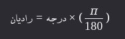

<div dir="rtl">

# 1. 🅰️ PreDefine modules

## 1.1. 🅱️ `__init__.py`

* یک فولدر(دایرکتوری) حاوی فایل __init__.py بعنوان یک package(بسته) شناخته می‌شود و بدون این فایل پایتون نمی‌تواند دایرکتوری را به‌عنوان یک بسته شناسایی کند
* هرگاه یک بسته(ماژول) import شود، آنگاه کد داخل این فایل به منظور راه‌انداز(پیکربندی ماژول‌ها) اجرا می‌شود
* وقتی یک package ایمپورت می‌شود، فایل __init__.py اولین چیزی است که اجرا می‌شود

### 1.1.1. ✅️ advantages of package directory

* فولدر می‌تواند شامل ماژول‌های دیگر یعنی FileName.py های دیگر باشد
* فولدر می‌تواند حاوی sub-packageهای دیگر باشد
* می‌توانید از importهای نسبی (relative imports) و ساختارهای پیچیده‌تر استفاده کنید
* سازماندهی و مدیریت ماژول‌ها و زیر بسته‌ها
* می‌توان initialization code را به اجرا درآورد تا در هنگام استفاده بصورت پیش‌فرض به اجرا درآید

**اگر یک دایرکتوری بسته یا Package نباشد**

* یک فولدر حتی بدون __init__.py هم می‌تواند package باشد (implicit namespace package) که در پایتون 3.3 به بعد ممکن شده است اما در این صورت import نسبی (from . import ...) کار نمی‌کند.
* نمی‌توانید از __all__ کدهای اولیه‌سازی استفاده کنید.

### 1.1.2. ✅️ Example

فرض کنید دایرکتوری حاوی نظام و ساختارفایل زیر است

```
myproject/
│
├── main.py
└── mypackage/
    ├── __init__.py
    ├── module_a.py
    └── module_b.py
``` 

باوجود `__init__.py` در `main.py` می‌توانید بنویسید:

```python
from mypackage import module_a
``` 

و در فایل `module_a.py` می‌توانید بنویسید

```python
from . import module_b  # import نسبی
```

💡 بدون __init__.py، این . (نقطه) در import نسبی کار نمی‌کند.

### 1.1.3. ✅️ FileContent

* هر بار این بسته مورد استفاده قرار بگیرد آنگاه لاگ بیاندازد که فلان بسته مورد استفاده قرار گرفته است

```python
print("Package is being imported!")
```

## 1.2. 🅱️ `__all__`

* یک لیست از رشته‌ها (strings)  است که نام متغیرها، توابع، یا کلاس‌هایی هستند که وقتی از یک ماژول یا package از طریق import * استفاده می‌کنید، وارد می‌شوند
* قابلیت تعریف کردن در ۱-فایل‌های .py (ماژول) و ۲-در فایل __init__.py (package)

📌️ **دلایل استفاده**

* کنترل دقیق بر روی آنچه قابل ایمپورت است
    * هنگام عدم استفاده از __all__ درهنگام import * تمام نام‌های عمومی یا PublicNames داخل ماژول ایمپورت می‌شوند
    * منظور از PublicNames ها مواردی است که با آندرلاین شروع **نمی‌شوند** (توابع یا کلاس‌ها و متغیرها)
* عدم آلودگی namespace
    * وقتی import * می‌کنید، تمام نام‌ها به scope فعلی وارد می‌شوند. این می‌تونه باعث تداخل نام‌ها بشه.
    * با استفاده از __all__ می‌تونی دقیق مشخص کنی که چه چیزهایی قراره وارد بشن.

📌️ **نحوه تعریف:**: * عبارت __all__ حتما باید در انتها تعریف شود

فرض کنید بسته mymodule.py با محتوی زیر دارد

```python
def func1():
    print("func1")


def func2():
    print("func2")


class class1:
    print("func3")


__all__ = ['func1', 'class1']
```

حالا وقتی بنویسید:

```python
from mymodule import *
```

فقط func1 و func3 ایمپورت می‌شوند.

## 1.3. 🅱️ Install Offline Modules

### 1.3.1. ✅️ [install from local Archive](https://packaging.python.org/en/latest/tutorials/installing-packages/#installing-from-local-archives)

#### 1.3.1.1. ❇️ Method 1️⃣️

```shell
mkdir /tmp/download
vim /tmp/requirements.txt
- wadllib==1.3.6
- webcolors==1.11.1
- webencodings==0.5.1
- websocket-client==1.2.3
- Werkzeug==2.2.2
cd download
pip download -r /tmp/requirements.txt
python3 -m pip install --no-index --find-links=file:///tmp/download wadllib webcolors webencodings websocket-client Werkzeug

```

#### 1.3.1.2. ❇️ Method 2️⃣️

```shell
python3 -m pip install ./downloads/SomeProject-1.0.4.tar.gz
python3 -m pip install --no-index --find-links=file:///local/dir/ SomeProject
python3 -m pip install --no-index --find-links=/local/dir/ SomeProject
python3 -m pip install --no-index --find-links=relative/dir/ SomeProject
```

#### 1.3.1.3. ❇️ Method 3️⃣️

* برای نصب دستی یک بسته ابتدا آن را دانلود کرده و سپس به پوشه مورد نظر رفته و مطابق دستور زیر نصب نمایید(به فایل توضیحی همراه بسته توجه گردد)
    ```python
    python setup.py install --user --prefix=~
    ```

### 1.3.2. ✅️ Installer

* تولید یک فایل اجرایی برنامه پایتون(اکسپورت فایل اجرایی از تمام پکیج‌ها و لایبرری‌ها و مشتقات برنامه نوشته شده)
    ```python
    pyinstaller --onefile --windowed <MainScript.py>
    ```

# 2. 🅰️ Built-in functions

## 2.1. 🅱️ Math

### 2.1.1. ✅️ abs(x)

محاسبه قدرمطلق یعنی اگر منفی باشد مثبت می‌کند

```python
abs(-5)  # Output: 5
abs(-3.14)  # Output: 3.14
abs(3 - 4j)  # Output: 5.0 (قدر مطلق یک عدد مختلط)

import math

math.abs(-5)  # ❌️ AttributeError: module 'math' has no attribute 'abs'
```

### 2.1.2. ✅️ Min,Max(iterable, *iterables, key, default)

* از توابع داخلی (built-in) هستند که به ترتیب برای یافتن کوچکترین و بزرگترین مقدار در یک دنباله (مانند لیست، تاپل، رشته و غیره) استفاده می‌شوند.
* min:پیدا کردن کوچکترین مقدار در یک دنباله یا بین چند عدد
* max:پیدا کردن بزرگترین مقدار در یک دنباله یا بین چند عدد

```python
# syntax:
# min(iterable, *iterables, key, default)
# max(iterable, *iterables, key, default)

# min(arg1, arg2, *args, key)
# max(arg1, arg2, *args, key)
```

مثال‌ها

```python
# Example1️⃣️: on list
numbers = [4, 1, 7, 3, 9]
print(min(numbers))  # Output: 1
print(max(numbers))  # Output: 9

# Example2️⃣️: on multiple number
print(min(10, 5, 8, 3))  # Output: 3
print(max(10, 5, 8, 3))  # Output: 10

# Example3️⃣️: on string(بر اساس ترتیب الفبایی)
letters = ['b', 'a', 'd', 'c']
print(min(letters))  # Output: 'a'
print(max(letters))  # Output: 'd'

# Example4️⃣️: On words
words = ['apple', 'hi', 'banana']
print(min(words, key=len))  # Output: 'hi' (کوتاه‌ترین کلمه)
print(max(words, key=len))  # Output: 'banana' (بلند کلمه)

# Example5️⃣️: set Default
print(min([], default=0))  # Output: 0

# Example6️⃣️: set Default
users = []  # Empty user
youngest_age = min((user['age'] for user in users), default=None)
print(youngest_age)  # Output: None

# Example7️⃣️: set Default
data = []
result = max(data, default=0)
print(result)  # Output: 0
```

پارامتر `key`: این پارامتر یک تابع است که مشخص می‌کند بر اساس چه معیاری مقایسه انجام شود

```python
# Example1️⃣️
list1 = ['mohammad', 'milad', 'akbar', 'sara', 'iman', 'ali']
print(f"min lenght in {list(list1)} ---> {min(list1, key=lambda n: len(n))}")  # Output: Ali ------> مینیمم را برحسب تعداد کاراکتر درنظر بگیر
print(f"max lenght in {list(list1)} ---> {max(list1, key=lambda n: len(n))}")  # Output: mohammad -> ماکزیمم را برحسب تعداد کاراکتر درنظر بگیر

# Example2️⃣️
students = [
    {'name': 'Ali', 'age': 20},
    {'name': 'Reza', 'age': 18},
    {'name': 'Sara', 'age': 22}
]

youngest = min(students, key=lambda x: x['age'])
print(youngest)  # Output: {'name': 'Reza', 'age': 18}

oldest = max(students, key=lambda x: x['age'])
print(oldest)  # Output: {'name': 'Sara', 'age': 22}
```

* وقتی یک لیست(یا هر iterable) خالی باشد، فراخوانی min یا max بدون default باعث خطای ValueError می‌شود
   ```python
   min([])  # ❌️ ValueError: min() arg is an empty sequence
   ```
* برای رشته‌ها، min و max بر اساس کد ASCII کاراکترها عمل می‌کنند
   ```python
   print(min('Hello'))  # 'H' (کد ASCII کمتری دارد)
   print(max('Hello'))  # 'o' (بیشترین کد ASCII)
   ```

### 2.1.3. ✅️ range(start,stop,step)

* برای تولید دنباله‌ای از اعداد استفاده می‌شود. معمولاً در حلقه‌های for به کار می‌رود
* فقط اعداد صحیح (int) قابل استفاده هستند
* نمی‌توان از اعداد اعشاری استفاده کرد

```python
# Syntax: range(start, stop, step)
# stop: الزاما باید وارد شود
```

```python
for i in range(5): print(i)  # Output: 0, 1, 2, 3, 4
for i in range(2, 7): print(i)  # Output: 2, 3, 4, 5, 6
for i in range(1, 10, 2): print(i)  # Output: 1, 3, 5, 7, 9
for i in range(5, 0, -1): print(i)  # Output: 5, 4, 3, 2, 1
for i in range(10, 5, -2): print(i)  # Output: 10, 8, 6
for i in range(0, 11, 2): print(i)  # Output: 0, 2, 4, 6, 8, 10
print(list(range(1, 6)))  # Output: [1, 2, 3, 4, 5]
```

### 2.1.4. ✅️ round(number,ndigits)

* برای گِرد کردن اعداد اعشاری به نزدیک‌ترین مقدار با تعداد مشخصی رقم اعشار استفاده می‌شود.
* number: عددی که می‌خواهید گرد شود (اجباری)
* کاربرد در گرد کردن و نمایش قیمت

```python
print(round(3.6))  # -----------> Output: 4
print(round(3.4))  # -----------> Output: 3
print(round(3.5))  # -----------> Output: 4
print(round(2.5))  # -----------> Output: 2 ← مهم! (پایتون به سمت عدد زوج نزدیک‌تر گرد می‌کند)
```

#### 2.1.4.1. ❇️ ndigits

* ndigits: تعداد ارقام اعشار (اختیاری)
    * اگر ننویسید، به نزدیک‌ترین عدد صحیح گرد می‌شود.

```python
print(round(3.14159, 2))  # ----> Output: 3.14
print(round(2.675, 2))  # ------> Output: 2.67 یا 2.68؟ (به دلیل دقت شناور، ممکن است 2.68 نباشد!)
print(round(1.2345, 1))  # -----> Output: 1.2
print(round(1.2345, 3))  # -----> Output: 1.234
print(round(12.2565856, 5))  # -> 12.25659
```

* منفی: گرد کردن به سمت چپ ممیز (به دهگان، صدگان و غیره)

```python
print(round(123.456, -1))  # خروجی: 120.0 → گرد به نزدیک‌ترین 10 تایی
print(round(123.456, -2))  # خروجی: 100.0 → گرد به نزدیک‌ترین 100 تایی
print(round(167, -2))  # خروجی: 200
```

* عدد صحیح بازگردانده می‌شود اگر ndigits نباشد

```python
type(round(3.7))  # <class 'int'>
```

* اما اگر ndigits باشد، خروجی float است

```python
type(round(3.7, 1))  # <class 'float'>
```

* به دلیل نحوه ذخیره اعداد اعشاری در کامپیوتر، گاهی نتیجه غیرمنتظره می‌دهد
    *     📌 دلیل: عدد 2.675 دقیقاً در حافظه به صورت 2.674999... ذخیره می‌شود. 

```python
print(round(2.675, 2))  # ممکن است خروجی: 2.67 باشد، نه 2.68!
```

* بین گرد کردن و قطع کردن فرق هست

```python
# Example1️⃣️: این کار قطع می‌کند، نه گرد می‌کند
x = 3.14159
truncated = int(x * 100) / 100  # 3.14

# Example2️⃣️: این کار گرد می‌کند، نه قطع می‌کند
price = 19.87654
print(f"قیمت: {round(price, 2)} تومان")  # خروجی: قیمت: 19.88 تومان
```

#### 2.1.4.2. ❇️ Banker’s Rounding

* پایتون از روش گرد کردن بانکی (Banker’s Rounding) استفاده می‌کند یعنی وقتی عدد دقیقاً در وسط دو عدد باشد (مثل 2.5 یا 3.5)، به نزدیک‌ترین عدد زوج گرد می‌شود.
* این روش برای کاهش سوگیری آماری در محاسبات طولانی استفاده می‌شود.

```python
print(round(2.5))  # خروجی: 2
print(round(3.5))  # خروجی: 4
print(round(4.5))  # خروجی: 4
print(round(5.5))  # خروجی: 6
```

### 2.1.5. ✅️ repr(object)

* برای دریافت نمایش رشته‌ای "رسمی" از یک شیء (object) استفاده می‌شود.
* هدف اصلی repr() این است که یک رشته تولید کند که
    * نحوه ساخت شیء را نشان دهد
    * قابل استفاده در کد پایتون باشد (مثلاً برای دیباگ یا بازسازی شیء)
    * برای توسعه‌دهندگان و دیباگ کردن طراحی شده است
* تفاوت `str` و `repr`
    * str(x): خروجی را به شکل "طبیعی" نشان می‌دهد (\n به عنوان خط جدید).
    * repr(x): دقیقاً نشان می‌دهد که رشته چگونه نوشته شده (با \n به عنوان کاراکتر فرار).

```python
# Example 1️⃣️
x = "Hello\nWorld"
print(str(x))  # Output: Hello
# World

print(repr(x))  # Output: 'Hello\nWorld'

# Example 2️⃣️:
x = 3.141592653589793238
print(str(x))  # Output:3.141592653589793
print(repr(x))  # Output:3.141592653589793 سعی می‌کند دقت بیشتری حفظ کند

# Example 3️⃣️:
lst = ['apple', 'banana\nsweet', 42]
print(str(lst))  # Output:['apple', 'banana\nsweet', 42]
print(repr(lst))  # Output:['apple', 'banana\\nsweet', 42]
```

* می‌توانید رفتار repr() را در کلاس‌های خود با تعریف متد __repr__() تنظیم کنید

```python
class Person:
    def __init__(self, name, age):
        self.name = name
        self.age = age

    def __repr__(self):
        return f"Person(name='{self.name}', age={self.age})"


p = Person("Ali", 25)
print(repr(p))  # Person(name='Ali', age=25)
print(p)  # Person(name='Ali', age=25)
# نکته از قطعه کد بالا: `print(p)` و `print(repr(p))` خروجی یکسان دارند زیرا print از str استفاده می‌کند، اما str وقتی `__str__` نباشد از repr استفاده می‌کند)

```

# 3. 🅰️ MATH

## 3.1. 🅱️ Math module

| ویژگی                        | `math`       | `cmath`                                     |
|------------------------------|--------------|---------------------------------------------|
| کار با اعداد حقیقی           | ✅ بله        | ❌ خیر (اما می‌تواند عدد حقیقی را هم بپذیرد) |
| کار با اعداد مختلط           | ❌ خیر        | ✅ بله                                       |
| ریشه دوم عدد منفی            | ❌ خطا می‌دهد | ✅ جواب مختلط می‌دهد                         |
| لگاریتم عدد منفی             | ❌ خطا می‌دهد | ✅ جواب مختلط می‌دهد                         |
| توابع قطبی (`polar`, `rect`) | ❌ ندارد      | ✅ دارد                                      |

تابخانه math فقط با اعداد حقیقی (real numbers) کار می‌کند.

```python
import math

math.sqrt(-1)  # ❌️ Error: ValueError
math.log(-1)  # ❌️ Error: ValueError
```

کتابخانه cmath با اعداد مختلط (complex numbers)اعم از اعداد صحیح کار می‌کند.

```python
import cmath

print(cmath.sqrt(-1))  # ✅️ 1j
cmath.log(-1)  # ✅️ 3.141592653589793j
```

```python
# Example1️⃣️: 
# Leading Zero
number = 1
number = f"{number:03d}"
print(number)
```

### 3.1.1. ✅️ math.floor(x)

* بزرگترین عدد صحیحی که کوچکتر یا مساوی مقدار ایکس باشد را برمی‌گرداند
* به عبارتی اگر ایکس اعشاری باشد مقدار صحیح برا برمی‌گرداند

```python
import math

print(math.floor(4.7))  # Output: 4
print(math.floor(3.2))  # Output: 3
print(math.floor(-1.2))  # Output: -2
print(math.floor(5))  # Output: 5
print(math.floor(0.9))  # Output: 0
print(int(-1.7))  # Output: -1 (عدد را به سمت صفر گِرد می‌کند)
print(math.floor(-1.7))  # Output: -2 (عدد را به سمت منفی بی‌نهایت گِرد می‌کند)
```

### 3.1.2. ✅️ math.ceil(x)

* برای گرد کردن هر عدد اعشاری (یا صحیح) به بالا (به سمت بالاترین عدد صحیح) استفاده می‌شود
* کلمهٔ ceil مخفف ceiling به معنی سقف است.

```python
import math

print(math.ceil(4.1))  # Output: 5
print(math.ceil(4.0))  # Output: 4
print(math.ceil(4.9))  # Output: 5
print(math.ceil(-2.3))  # Output:-2
print(math.ceil(0.5))  # Output: 1
print(math.ceil(-0.5))  # Output: 0
```

### 3.1.3. ✅️ math.sqrt(x)

* جذر (ریشه دوم) یک عدد را محاسبه و برمی‌گرداند.
* مقدار ورودی اگر یک عدد منفی باشد، خطای ValueError رخ می‌دهد

```python
import math

print(math.sqrt(9))  # Output: 3.0
print(math.sqrt(16))  # Output: 4.0
print(math.sqrt(2))  # Output: 1.4142135623730951
print(math.sqrt(0))  # Output: 0.0
print(math.sqrt(7.5))  # Output: 2.7386127875258306
print(math.sqrt(-1))  # ❌️ Error:ValueError
```

### 3.1.4. ✅️ math.pow(x,y)

* محاسبه x به توان y
* شاید با تابع pow(x, y, z) اشتباه گرفته شود که یک تابع داخلی(built-in) پایتون است که پشتیبانی از سومین آرگومان برای محاسبه به پیمانه (modulus) را دارد

```python
import math

print(math.pow(2, 3))  # Output: 8.0
print(math.pow(4, 0.5))  # Output: 2.0
print(math.pow(5))  # ❌️ Error
math.pow(x, y, z)  # ❌️ Error (در ماژول math چنین تابعی نداریم)
pow(2, 3, 5)  # (built-in) # ✅️ ==> (2^3 % 5) = (8 % 5) => [Output:3]
```

### 3.1.5. ✅️ math.degrees(radian)

* برای تبدیل زاویه از رادیان به درجه استفاده می‌شود
* ورودی: زاویه بر حسب رادیان (عدد حقیقی)
* خروجی: زاویه بر حسب درجه
* دوتابع `math.degrees(radian)` و `math.radians(degree)` معکوس یکدیگر هستند

```python
import math

# 103. convert π radian to degree (π = 180°)
print(math.degrees(math.pi))  # Output: 180.0

# 104. convert π/2 radian to degree (90 degree)
print(math.degrees(math.pi / 2))  # Output: 90.0

# 105. convert π/4 radian to degree (45 degree)
print(math.degrees(math.pi / 4))  # Output: 45.0

# 106. convert 1 radian to degree
print(math.degrees(1))  # Output: 57.29577951308232

# 107. تبدیل زاویه منفی
print(math.degrees(-math.pi / 3))  # Output: -60.0
```


```python
import math

# Example 1️⃣️
radians = math.pi / 3
degrees = radians * (180 / math.pi)
print(degrees)  # Output: 60.0

# Example 2️⃣️: فرض کن می‌خوای زاویه مقابل یک ضلع را پیدا کنی
opposite = 3
adjacent = 4
angle_radians = math.atan(opposite / adjacent)  # تانژانت معکوس
angle_degrees = math.degrees(angle_radians)
print(f"زاویه: {angle_degrees:.2f} درجه")  # Output: زاویه: 36.87 درجه
```

### 3.1.6. ✅️ math.radians(degree)

* برای تبدیل زاویه از درجه به رادیان استفاده می‌شود
* دوتابع `math.degrees(radian)` و `math.radians(degree)` معکوس یکدیگر هستند

```python
import math

# 110. convert 180 degree To radian
print(math.radians(180))  # Output: 3.141592653589793  → π

# 111. convert 90 degree
print(math.radians(90))  # Output: 1.5707963267948966 → π/2

# 112. convert 45 degree
print(math.radians(45))  # Output: 0.7853981633974483 → π/4

# 113. convert 30 degree
print(math.radians(30))  # Output: 0.5235987755982988

# 114. تبدیل زاویه منفی
print(math.radians(-60))  # Output: -1.0471975511965976 → -π/3
```



```python
import math

# Example 1️⃣️
degrees = 60
radians = degrees * (math.pi / 180)
print(radians)  # -----------> Output: 1.0471975511965976
print(math.radians(60))  # --> Output: 1.0471975511965976

# Example 2️⃣️: فرض کن می‌خوای سینوس 30 درجه را حساب کنیم
# Note:❌ اگر مستقیماً بنویسی math.sin(30)، عدد 30 را رادیان فرض می‌کند و جواب اشتباه می‌دهد!
angle_degrees = 30
angle_radians = math.radians(angle_degrees)
print(math.sin(angle_radians))  # --> Output: ✅️ 0.5
print(math.sin(30))  # -------------> Output: ❌️ -0.988 (غلط! چون 30 رادیان است)
```


## 3.2. 🅱️ mathGraph

```python
import matplotlib.pyplot as plot

xs = [2, 4, 6, 8, 20, 21, 22, 28, 4]
ys = [1, 3, 5, 8, 9, 12, 20, 30, 4]
plot.plot(xs, ys)
plot.show()
```

## 3.3. 🅱️ pyfiglet

- نمایش متن بصورت AsciiArt یعنی همانند خروجی دستور cowsay در لینوکس
- ترکیب آن با termcolor بسیار مفید خواهد شد

```python
import pyfiglet

print(pyfiglet.figlet_format(message))
```

```python
#!/usr/bin/env python
import pyfiglet
from termcolor2 import colored

ascii_art = pyfiglet.figlet_format("Hello")
ascii_art = colored(ascii_art, color="red")
print(ascii_art)
```

# 4. 🅰️ Environment

## 4.1. 🅱️ termcolor

* ماژولی برای رنگ آمیزی خروجی

```python
import termcolor

# help(termcolor) 

print(termcolor.colored('python course', color="white", on_color="on_magenta", attrs=["blink"]))
print(termcolor.colored('python course', color="green"))
print(termcolor.colored('python course', color="blue"))
print(termcolor.colored('python course', color="cyan"))

```

# 5. 🅰️ Web

## 5.1. 🅱️ JsonResponse

```
return JsonResponse(Items.to_dict(), safe=False)
```

* توضیحات safeکه بصورت پیش‌فرض True است
    * اگر safe=Trueباشد آنگاه JsonResponse فقط مجاز است یک dict را بگیرد. یعنی اگر یک لیست یا نوع دیگری بفرستید، Django یک خطا می‌ده
    * اگر safe=False باشد
        * آنگاه اجازه می‌دهیم هر نوع object قابل سریالایز شدن JSON (مثل لیست , namedtuple , custom class ) را هم برگردانیم.
        * در این حالت، JsonResponse فرض می‌کند که شما مسئول مدیریت خروجی هستید.

## 5.2. 🅱️ requests

### 5.2.1. ✅️ Get

```python
import requests

res1 = requests.get("https://barnamenevisan.info/api/courses/getactivecourses")
res2 = requests.get("https://jsonplaceholder.typicode.com/comments", params={'postId': 2})

# 1)
print(f"[res1.status_code]: {res1.status_code}\n\n")

# 2)
print(f"[res1.text]:{res1.text}\n\n")  # string

# 3)
for course in res1.json():
    print(f"Curse:{course['title']} Teacher: {course['teacher']}")

# 4)
print(f"[res2.json()]: {res2.json()}")

```

### 5.2.2. ✅️ Post

```python
import requests

res1 = requests.post("https://jsonplaceholder.typicode.com/posts")
res2 = requests.get("https://jsonplaceholder.typicode.com/comments", params={'postId': 2})

print(f"[res1.json()]: {res1.json()}\n")
print(f"[res2.json()]: {res2.json()}\n\n")

for data in res1.json():
    print(f"[data]: {data}")

```

## 5.3. 🅱️ BaseHTTPRequestHandler and HTTPServer

```python
from http.server import BaseHTTPRequestHandler, HTTPServer
import json


class MyHandler(BaseHTTPRequestHandler):
    def do_GET(self):
        # تنظیم کد وضعیت پاسخ
        self.send_response(200)
        self.send_header('Content-type', 'text/plain;charset=utf-8')  # استفاده از text/plain
        self.end_headers()

        # نوشتن محتوای پاسخ با خط جدید
        response = "Requested path: {}\n".format(self.path)
        response += "This is a new line.\n"  # اضافه کردن خط جدید
        self.wfile.write(response.encode('utf-8'))

    def do_POST(self):
        # تنظیم کد وضعیت پاسخ
        self.send_response(200)
        self.send_header('Content-type', 'application/json;charset=utf-8')
        self.end_headers()

        # محتوای پاسخ
        response = {
            'message': 'این یک پاسخ از سمت سرور است به درخواست POST شما'
        }
        self.wfile.write(json.dumps(response, ensure_ascii=False).encode('utf-8'))


def run(server_class=HTTPServer, handler_class=MyHandler, port=8080):
    server_address = ('', port)  # گوش دادن به همه آدرس‌ها
    httpd = server_class(server_address, handler_class)
    print(f'Server running on port {port}...')
    httpd.serve_forever()


if __name__ == "__main__":
    run()
```

</div>