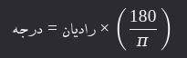
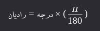
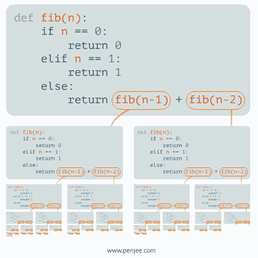

<div dir="rtl">

# 1. 🅰️ PreDefine modules

## 1.1. 🅱️ `__init__.py`

* دایرکتوری که حاولی این فایل است یعنی این دایرکتوری یک پکیج (package) است
* یک فولدر(دایرکتوری) حاوی فایل __init__.py بعنوان یک package(بسته) شناخته می‌شود و بدون این فایل پایتون نمی‌تواند دایرکتوری را به‌عنوان یک بسته شناسایی کند
* هرگاه یک بسته(ماژول) import شود، آنگاه کد داخل این فایل به منظور راه‌انداز(پیکربندی ماژول‌ها) اجرا می‌شود
* وقتی یک package ایمپورت می‌شود، فایل __init__.py اولین چیزی است که اجرا می‌شود
*

### 1.1.1. ✅️ advantages of package directory

* فولدر می‌تواند شامل ماژول‌های دیگر یعنی FileName.py های دیگر باشد
* فولدر می‌تواند حاوی sub-packageهای دیگر باشد
* می‌توانید از importهای نسبی (relative imports) و ساختارهای پیچیده‌تر استفاده کنید
* سازماندهی و مدیریت ماژول‌ها و زیر بسته‌ها
* می‌توان initialization code را به اجرا درآورد تا در هنگام استفاده بصورت پیش‌فرض به اجرا درآید

**اگر یک دایرکتوری بسته یا Package نباشد**

* یک فولدر حتی بدون __init__.py هم می‌تواند package باشد (implicit namespace package) که در پایتون 3.3 به بعد ممکن شده است اما در این صورت import نسبی (from . import ...) کار نمی‌کند.
* نمی‌توانید از __all__ کدهای اولیه‌سازی استفاده کنید.

### 1.1.2. ✅️ Example

فرض کنید دایرکتوری حاوی نظام و ساختارفایل زیر است

```
myproject/
│
├── main.py
└── mypackage/
    ├── __init__.py
    ├── module_a.py
    └── module_b.py
``` 

باوجود `__init__.py` در `main.py` می‌توانید بنویسید:

```python
from mypackage import module_a
# or
from mypackage.module_a import add

print(add(2, 3))  # 5
# or
import mypackage.module_a as calc

print(calc.add(2, 3))  # 5

``` 

و در فایل `module_a.py` می‌توانید بنویسید

```python
from . import module_b  # import نسبی
```

💡 بدون __init__.py، این . (نقطه) در import نسبی کار نمی‌کند.

### 1.1.3. ✅️ FileContent

* هر بار این بسته مورد استفاده قرار بگیرد آنگاه لاگ بیاندازد که فلان بسته مورد استفاده قرار گرفته است

```python
print("Package is being imported!")
```

## 1.2. 🅱️ `__all__`

* یک لیست از رشته‌ها (strings)  است که نام متغیرها، توابع، یا کلاس‌هایی هستند که وقتی از یک ماژول یا package از طریق import * استفاده می‌کنید، وارد می‌شوند
* قابلیت تعریف کردن در ۱-فایل‌های .py (ماژول) و ۲-در فایل __init__.py (package)

📌️ **دلایل استفاده**

* کنترل دقیق بر روی آنچه قابل ایمپورت است
    * هنگام عدم استفاده از __all__ درهنگام import * تمام نام‌های عمومی یا PublicNames داخل ماژول ایمپورت می‌شوند
    * منظور از PublicNames ها مواردی است که با آندرلاین شروع **نمی‌شوند** (توابع یا کلاس‌ها و متغیرها)
* عدم آلودگی namespace
    * وقتی import * می‌کنید، تمام نام‌ها به scope فعلی وارد می‌شوند. این می‌تونه باعث تداخل نام‌ها بشه.
    * با استفاده از __all__ می‌تونی دقیق مشخص کنی که چه چیزهایی قراره وارد بشن.

📌️ **نحوه تعریف:**: * عبارت __all__ حتما باید در انتها تعریف شود

فرض کنید بسته mymodule.py با محتوی زیر دارد

```python
def func1():
    print("func1")


def func2():
    print("func2")


class class1:
    print("func3")


__all__ = ['func1', 'class1']
```

حالا وقتی بنویسید:

```python
from mymodule import *
```

فقط func1 و func3 ایمپورت می‌شوند.

## 1.3. 🅱️ Install Offline Modules

### 1.3.1. ✅️ [install from local Archive](https://packaging.python.org/en/latest/tutorials/installing-packages/#installing-from-local-archives)

#### 1.3.1.1. ❇️ Method 1️⃣️

```shell
mkdir /tmp/download
vim /tmp/requirements.txt
- wadllib==1.3.6
- webcolors==1.11.1
- webencodings==0.5.1
- websocket-client==1.2.3
- Werkzeug==2.2.2
cd download
pip download -r /tmp/requirements.txt
python3 -m pip install --no-index --find-links=file:///tmp/download wadllib webcolors webencodings websocket-client Werkzeug

```

#### 1.3.1.2. ❇️ Method 2️⃣️

```shell
python3 -m pip install ./downloads/SomeProject-1.0.4.tar.gz
python3 -m pip install --no-index --find-links=file:///local/dir/ SomeProject
python3 -m pip install --no-index --find-links=/local/dir/ SomeProject
python3 -m pip install --no-index --find-links=relative/dir/ SomeProject
```

#### 1.3.1.3. ❇️ Method 3️⃣️

* برای نصب دستی یک بسته ابتدا آن را دانلود کرده و سپس به پوشه مورد نظر رفته و مطابق دستور زیر نصب نمایید(به فایل توضیحی همراه بسته توجه گردد)

```python
python
setup.py
install - -user - -prefix = ~
```

### 1.3.2. ✅️ Installer

* تولید یک فایل اجرایی برنامه پایتون(اکسپورت فایل اجرایی از تمام پکیج‌ها و لایبرری‌ها و مشتقات برنامه نوشته شده)

```python
pyinstaller - -onefile - -windowed < MainScript.py >
```

# 2. 🅰️ Built-in functions

## 2.1. 🅱️ Math

### 2.1.1. ✅️ abs(x)

محاسبه قدرمطلق یعنی اگر منفی باشد مثبت می‌کند

```python
abs(-5)  # Output: 5
abs(-3.14)  # Output: 3.14
abs(3 - 4j)  # Output: 5.0 (قدر مطلق یک عدد مختلط)

import math

math.abs(-5)  # ❌️ AttributeError: module 'math' has no attribute 'abs'
```

### 2.1.2. ✅️ Min,Max(iterable, *iterables, key, default)

* از توابع داخلی (built-in) هستند که به ترتیب برای یافتن کوچکترین و بزرگترین مقدار در یک دنباله (مانند لیست، تاپل، رشته و غیره) استفاده می‌شوند.
* min:پیدا کردن کوچکترین مقدار در یک دنباله یا بین چند عدد
* max:پیدا کردن بزرگترین مقدار در یک دنباله یا بین چند عدد

```python
# syntax:
# min(iterable, *iterables, key, default)
# max(iterable, *iterables, key, default)

# min(arg1, arg2, *args, key)
# max(arg1, arg2, *args, key)
```

مثال‌ها

```python
# Example1️⃣️: on list
numbers = [4, 1, 7, 3, 9]
print(min(numbers))  # Output: 1
print(max(numbers))  # Output: 9

# Example2️⃣️: on multiple number
print(min(10, 5, 8, 3))  # Output: 3
print(max(10, 5, 8, 3))  # Output: 10

# Example3️⃣️: on string(بر اساس ترتیب الفبایی)
letters = ['b', 'a', 'd', 'c']
print(min(letters))  # Output: 'a'
print(max(letters))  # Output: 'd'

# Example4️⃣️: On words
words = ['apple', 'hi', 'banana']
print(min(words, key=len))  # Output: 'hi' (کوتاه‌ترین کلمه)
print(max(words, key=len))  # Output: 'banana' (بلند کلمه)

# Example5️⃣️: set Default
print(min([], default=0))  # Output: 0

# Example6️⃣️: set Default
users = []  # Empty user
youngest_age = min((user['age'] for user in users), default=None)
print(youngest_age)  # Output: None

# Example7️⃣️: set Default
data = []
result = max(data, default=0)
print(result)  # Output: 0
```

پارامتر `key`: این پارامتر یک تابع است که مشخص می‌کند بر اساس چه معیاری مقایسه انجام شود

```python
# Example1️⃣️
list1 = ['mohammad', 'milad', 'akbar', 'sara', 'iman', 'ali']
print(f"min lenght in {list(list1)} ---> {min(list1, key=lambda n: len(n))}")  # Output: Ali ------> مینیمم را برحسب تعداد کاراکتر درنظر بگیر
print(f"max lenght in {list(list1)} ---> {max(list1, key=lambda n: len(n))}")  # Output: mohammad -> ماکزیمم را برحسب تعداد کاراکتر درنظر بگیر

# Example2️⃣️
students = [
    {'name': 'Ali', 'age': 20},
    {'name': 'Reza', 'age': 18},
    {'name': 'Sara', 'age': 22}
]

youngest = min(students, key=lambda x: x['age'])
print(youngest)  # Output: {'name': 'Reza', 'age': 18}

oldest = max(students, key=lambda x: x['age'])
print(oldest)  # Output: {'name': 'Sara', 'age': 22}
```

* وقتی یک لیست(یا هر iterable) خالی باشد، فراخوانی min یا max بدون default باعث خطای ValueError می‌شود
   ```python
   min([])  # ❌️ ValueError: min() arg is an empty sequence
   ```
* برای رشته‌ها، min و max بر اساس کد ASCII کاراکترها عمل می‌کنند
   ```python
   print(min('Hello'))  # 'H' (کد ASCII کمتری دارد)
   print(max('Hello'))  # 'o' (بیشترین کد ASCII)
   ```

### 2.1.3. ✅️ range(start,stop,step)

* برای تولید دنباله‌ای از اعداد استفاده می‌شود. معمولاً در حلقه‌های for به کار می‌رود
* فقط اعداد صحیح (int) قابل استفاده هستند
* نمی‌توان از اعداد اعشاری استفاده کرد

```python
# Syntax: range(start, stop, step)
# stop: الزاما باید وارد شود
```

```python
for i in range(5): print(i)  # Output: 0, 1, 2, 3, 4
for i in range(2, 7): print(i)  # Output: 2, 3, 4, 5, 6
for i in range(1, 10, 2): print(i)  # Output: 1, 3, 5, 7, 9
for i in range(5, 0, -1): print(i)  # Output: 5, 4, 3, 2, 1
for i in range(10, 5, -2): print(i)  # Output: 10, 8, 6
for i in range(0, 11, 2): print(i)  # Output: 0, 2, 4, 6, 8, 10
print(list(range(1, 6)))  # Output: [1, 2, 3, 4, 5]
```

### 2.1.4. ✅️ round(number,ndigits)

* برای گِرد کردن اعداد اعشاری به نزدیک‌ترین مقدار با تعداد مشخصی رقم اعشار استفاده می‌شود.
* number: عددی که می‌خواهید گرد شود (اجباری)
* کاربرد در گرد کردن و نمایش قیمت

```python
print(round(3.6))  # -----------> Output: 4
print(round(3.4))  # -----------> Output: 3
print(round(3.5))  # -----------> Output: 4
print(round(2.5))  # -----------> Output: 2 ← مهم! (پایتون به سمت عدد زوج نزدیک‌تر گرد می‌کند)
```

#### 2.1.4.1. ❇️ ndigits

* ndigits: تعداد ارقام اعشار (اختیاری)
    * اگر ننویسید، به نزدیک‌ترین عدد صحیح گرد می‌شود.

```python
print(round(3.14159, 2))  # ----> Output: 3.14
print(round(2.675, 2))  # ------> Output: 2.67 یا 2.68؟ (به دلیل دقت شناور، ممکن است 2.68 نباشد!)
print(round(1.2345, 1))  # -----> Output: 1.2
print(round(1.2345, 3))  # -----> Output: 1.234
print(round(12.2565856, 5))  # -> 12.25659
```

* منفی: گرد کردن به سمت چپ ممیز (به دهگان، صدگان و غیره)

```python
print(round(123.456, -1))  # خروجی: 120.0 → گرد به نزدیک‌ترین 10 تایی
print(round(123.456, -2))  # خروجی: 100.0 → گرد به نزدیک‌ترین 100 تایی
print(round(167, -2))  # خروجی: 200
```

* عدد صحیح بازگردانده می‌شود اگر ndigits نباشد

```python
type(round(3.7))  # <class 'int'>
```

* اما اگر ndigits باشد، خروجی float است

```python
type(round(3.7, 1))  # <class 'float'>
```

* به دلیل نحوه ذخیره اعداد اعشاری در کامپیوتر، گاهی نتیجه غیرمنتظره می‌دهد
    *     📌 دلیل: عدد 2.675 دقیقاً در حافظه به صورت 2.674999... ذخیره می‌شود. 

```python
print(round(2.675, 2))  # ممکن است خروجی: 2.67 باشد، نه 2.68!
```

* بین گرد کردن و قطع کردن فرق هست

```python
# Example1️⃣️: این کار قطع می‌کند، نه گرد می‌کند
x = 3.14159
truncated = int(x * 100) / 100  # 3.14

# Example2️⃣️: این کار گرد می‌کند، نه قطع می‌کند
price = 19.87654
print(f"قیمت: {round(price, 2)} تومان")  # خروجی: قیمت: 19.88 تومان
```

#### 2.1.4.2. ❇️ Banker’s Rounding

* پایتون از روش گرد کردن بانکی (Banker’s Rounding) استفاده می‌کند یعنی وقتی عدد دقیقاً در وسط دو عدد باشد (مثل 2.5 یا 3.5)، به نزدیک‌ترین عدد زوج گرد می‌شود.
* این روش برای کاهش سوگیری آماری در محاسبات طولانی استفاده می‌شود.

```python
print(round(2.5))  # خروجی: 2
print(round(3.5))  # خروجی: 4
print(round(4.5))  # خروجی: 4
print(round(5.5))  # خروجی: 6
```

### 2.1.5. ✅️ repr(object)

* برای دریافت نمایش رشته‌ای "رسمی" از یک شیء (object) استفاده می‌شود.
* هدف اصلی repr() این است که یک رشته تولید کند که
    * نحوه ساخت شیء را نشان دهد
    * قابل استفاده در کد پایتون باشد (مثلاً برای دیباگ یا بازسازی شیء)
    * برای توسعه‌دهندگان و دیباگ کردن طراحی شده است
* تفاوت `str` و `repr`
    * str(x): خروجی را به شکل "طبیعی" نشان می‌دهد (\n به عنوان خط جدید).
    * repr(x): دقیقاً نشان می‌دهد که رشته چگونه نوشته شده (با \n به عنوان کاراکتر فرار).

```python
# Example 1️⃣️
x = "Hello\nWorld"
print(str(x))  # Output: Hello
# World

print(repr(x))  # Output: 'Hello\nWorld'

# Example 2️⃣️:
x = 3.141592653589793238
print(str(x))  # Output:3.141592653589793
print(repr(x))  # Output:3.141592653589793 سعی می‌کند دقت بیشتری حفظ کند

# Example 3️⃣️:
lst = ['apple', 'banana\nsweet', 42]
print(str(lst))  # Output:['apple', 'banana\nsweet', 42]
print(repr(lst))  # Output:['apple', 'banana\\nsweet', 42]
```

* می‌توانید رفتار repr() را در کلاس‌های خود با تعریف متد __repr__() تنظیم کنید

```python
class Person:
    def __init__(self, name, age):  # Constructor
        self.name = name
        self.age = age

    def __repr__(self):
        return f"Person(name='{self.name}', age={self.age})"


p = Person("Ali", 25)
print(repr(p))  # Person(name='Ali', age=25)
print(p)  # Person(name='Ali', age=25)
# نکته از قطعه کد بالا: `print(p)` و `print(repr(p))` خروجی یکسان دارند زیرا print از str استفاده می‌کند، اما str وقتی `__str__` نباشد از repr استفاده می‌کند)

```

## 2.2. 🅱️ reversed(sequence)

* این تابع خود داده اصلی را تغییر نمی‌دهد (immutable)، فقط یک iterator معکوس برمی‌گرداند
* خروجی: یک iterator برمی‌گرداند که عناصر یک sequence یا سری می‌باشند که معکوس شده‌اند
* ورودی:
    * لیست (list)
    * تاپل (tuple)
    * رشته (str)
    * دامنه (range)
    * یا هر شیء دیگری که __reversed__() داشته باشد یا قابل اندیس‌گذاری باشد (__getitem__ + __len__)
* با `join()` می‌توانیم کاراکترهای معکوس شده را دوباره به رشته تبدیل کنیم.
* پایتون به‌طور پیش‌فرض نمی‌داند چطور یک کلاس سفارشی رو معکوس کند. هریک از دو روش زیر برای reverse کردن دریک کلاس کافی است
    * روش1️⃣️: پیاده‌سازی `__reversed__()`
    * روش2️⃣️:پیاده‌سازی  `__getitem__` و `__len__`
* اگر در یک کلاس سفارشی شده موارد بالا پیاده‌سازی نشود آنگاه برای معکوس نمودن سبب تولید ارور می‌شود

```python
# Example1️⃣️: List
list1 = [1, 2, 3, 4, 5]
list1_reverse = reversed(list1)
print(list(list1_reverse))  # Output: [5, 4, 3, 2, 1]

# Example2️⃣️: Tuple
tuple1 = (10, 20, 30, 40)
tuple1_rev = reversed(tuple1)
print(tuple(tuple1_rev))  # Output: (40, 30, 20, 10)

# Example3️⃣️: Range
range1 = range(1, 6)  # 1, 2, 3, 4, 5
range1_rev = reversed(range1)
print(list(range1_rev))  # خروجی: [5, 4, 3, 2, 1]

# Example4️⃣️: string(char)
for char in reversed("Hello"):
    print(char)

# Example5️⃣️: Slicing --> لیست جدید (کم‌کارآمدتر برای داده‌های بزرگ)    
list1 = [1, 2, 3]
list1_rev = list1[::-1]  # [::-1] یک لیست جدید با تمام عناصر معکوس می‌سازد — حافظه بیشتری می‌گیرد.
print(list1_rev)  # [3, 2, 1]


# Example6️⃣️: 
class MyList:
    def __init__(self, items):
        self.items = items

    def __len__(self):
        return len(self.items)

    def __getitem__(self, index):
        return self.items[index]

    def __reversed__(self):
        return reversed(self.items)


my_obj = MyList([1, 2, 3])
for item in reversed(my_obj):
    print(item)
# Output:
# 3
# 2
# 1
s


```

## 2.3. 🅱️ reverse()

* معکوس کردن عناصر یک لیست در همان لیست اصلی (بدون ساختن لیست جدید)
* این یک متد مُتَغّیرکننده (mutating method) است.

```python
# Example1️⃣️: 
numbers = [1, 2, 3, 4, 5]
numbers.reverse()
print(numbers)  # Output: [5, 4, 3, 2, 1]

# Example2️⃣️: ❌️ اشتباه رایج
numbers = [1, 2, 3, 4, 5]
result = numbers.reverse()  # هیچگاه به این شکل استفاده نمی‌شود
print(result)  # Output: None

# Example3️⃣️: String
words = ['apple', 'banana', 'cherry']
words.reverse()
print(words)  # Output: ['cherry', 'banana', 'apple']

# Example4️⃣️: 
data = [10, 20, 30]
data.reverse()

for item in data:
    print(item)
# Output:
# 30
# 20
# 10

# Example4️⃣️: ❌️ Error: AttributeError
text = "hello"
text.reverse()  # چون رشته‌ها لیست نیستند و این تابع را ندارند

# Example4️⃣️: ✅️ شیوه درست join
text = "hello"
reversed_text = ''.join(reversed(text))
print(reversed_text)  # olleh
```

### 2.3.1. ✅️ reverse() 🆚️ reversed(sequence)

* بدلیل اینکه `reverse()` لیست اصلی را تغییر میدهد توصیه می‌شود از این تابع استفاده نشود و از تابع `reversed(sequence)` استفاده شود
* reverse()
    * هنگامی‌که بخواهیم به صورت دائمی لیست اصلی معکوس شود و با حالت اصلی کاری نداشته باشیم
    * وقتی محدودیت حافظه مهم است و نیاز به لیست جدید نمی‌باشد

* reversed()
    * هنگامی که نمی‌خواهیم لیست اصلی تغییر کند و نیاز به استفاده مجدد از لیست اصلی است
    * هنگامی‌که بخواهیم فقط و فقط یک بار عناصر را معکوس کنیم مثلا برای حلقه for بخواهیم معکوس نماییم
    * هنگامی که روی رشته، تاپل یا range کار می‌کنیم.

```python
# reverse() — درجا
a = [1, 2, 3]
a.reverse()
print(a)  # Output: [3, 2, 1]
print(a)  # Output: [3, 2, 1]

# reversed() — غیرمخرب
b = [1, 2, 3]
c = list(reversed(b))
print(b)  # Output: [1, 2, 3]
print(c)  # Output: [3, 2, 1]
```

## 2.4. 🅱️ Sort

* برای مرتب‌سازی یک لیست بصورت درجا (in-place)

```python
# syntax: list.sort(reverse=False, key=None)
# reverse: False(Default) --> مرتب‌سازی به صورت صعود
# reverse: True ------------> مرتب‌سازی به صورت نزولی
# Key: function ------------> یک تابع که مشخص می‌کند که مرتب‌سازی بر چه اساسی صورت گیرد
```

```python
# Example1️⃣️: 
numbers = [3, 1, 4, 1, 5, 9]
numbers.sort()
print(numbers)  # Output: [1, 1, 3, 4, 5, 9]

# Example2️⃣️: 
numbers = [3, 1, 4, 1, 5, 9]
numbers.sort(reverse=True)
print(numbers)  # Output: [9, 5, 4, 3, 1, 1]

# Example3️⃣️:
words = ['banana', 'apple', 'cherry']
words.sort()
print(words)  # Output: ['apple', 'banana', 'cherry']

# Example4️⃣️: 
words = ['python', 'is', 'awesome']
words.sort(key=len)
print(words)  # Output: ['is', 'python', 'awesome']

# Example5️⃣️:
numbers = [-5, 3, -1, 10]
numbers.sort(key=abs)
print(numbers)  # Output: [-1, 3, -5, 10] --> Becuase: | -1 | = 1, |3| = 3, |-5| = 5, |10| = 10

# Example6️⃣️:
# تابع sort() مقدار None برمی‌گرداند و لیست اصلی رو تغییر می‌ده. پس اگر بنویسی:
numbers = [3, 1, 4, 1, 5, 9]
sorted_list = numbers.sort()  # --> ❌️
print(sorted_list)  # ------------> Output: None
```

## 2.5. 🅱️ Sorted

* یک کپی مرتب‌شده از یک ایترابل (iterable) برمی‌گرداند، بدون اینکه داده اصلی تغییر کند.
* نه فقط روی لیست بلکه روی tuple, str, set, dict و ... هم کار می‌کنه.
* همواره لیست برمی‌گرداند و حتی اگر ورودی یک تاپل یا رشته باشه، خروجی یک لیست است.
* لیست ها برای مرتب سازی نیاز به کلید دارند

```python
# syntax: sorted(iterable, key=None, reverse=False)
```

```python
# Example1️⃣️: 
numbers = [4, 1, 3, 2]
sorted_numbers = sorted(numbers)
print(sorted_numbers)  # Output: [1, 2, 3, 4]
print(numbers)  # Output: [4, 1, 3, 2] ← تغییر نکرده

# Example2️⃣️: 
sorted_desc = sorted(numbers, reverse=True)
print(sorted_desc)  # Output: [4, 3, 2, 1]

# Example3️⃣️:
text = "python"
sorted_chars = sorted(text)
print(sorted_chars)  # ['h', 'n', 'o', 'p', 't', 'y']
print(''.join(sorted_chars))  # Output: "hnopty"

# Example4️⃣️: 
tuple1 = (5, 2, 8, 1)
sorted_tuple1 = sorted(tuple1)
print(sorted_tuple1)  # Output: [1, 2, 5, 8] ← لیست برمی‌گردونه!

# Example5️⃣️:
words = ['banana', 'kiwi', 'apple', 'pear']
sorted_by_len = sorted(words, key=len)
print(sorted_by_len)  # Output: ['pear', 'kiwi', 'apple', 'banana']

# Example6️⃣️:
nums = [-5, 3, -1, 10]
sorted_abs = sorted(nums, key=abs)
print(sorted_abs)  # Output: [-1, 3, -5, 10]

# Example7️⃣️:
grades = {'ali': 19, 'reza': 15, 'sara': 18, 'Behrooz': 20, 'tasnim': 10, 'AmirAbas': 9}

# مرتب بر اساس نام (کلید)
sorted_by_name1 = sorted(grades.items())
sorted_by_name2 = sorted(grades.items(), key=lambda x: x[0], reverse=False)
print(sorted_by_name1)  # Output: [('AmirAbas', 9), ('Behrooz', 20), ('ali', 19), ('reza', 15), ('sara', 18), ('tasnim', 10)]
print(sorted_by_name2)  # Output: [('AmirAbas', 9), ('Behrooz', 20), ('ali', 19), ('reza', 15), ('sara', 18), ('tasnim', 10)]

# مرتب بر اساس نمره (مقدار)
sorted_by_grade = sorted(grades.items(), key=lambda x: x[1], reverse=True)
print(sorted_by_grade)  # Output: [('Behrooz', 20), ('ali', 19), ('sara', 18), ('reza', 15), ('tasnim', 10), ('AmirAbas', 9)]

# Example8️⃣️: دیکشنری
students = [
    {'name': 'Ali', 'age': 20},
    {'name': 'Sara', 'age': 18},
    {'name': 'Reza', 'age': 22}
]

sorted_students = sorted(students, key=lambda x: x['age'])
print(students)  # ---------> Output: [{'name': 'Ali', 'age': 20}, {'name': 'Sara', 'age': 18}, {'name': 'Reza', 'age': 22}]         
print(sorted_students)  # --> Output: [{'name': 'Sara', 'age': 18}, {'name': 'Ali', 'age': 20}, {'name': 'Reza', 'age': 22}]       

#  مرتب‌سازی چندمرحله‌ای
sorted_student_multi = sorted(students, key=lambda x: (x['age'], x['name']))
print(sorted_student_multi)  # Output: [{'name': 'Sara', 'age': 18}, {'name': 'Ali', 'age': 20}, {'name': 'Reza', 'age': 22}]
```

## 2.6. 🅱️ len(object)

* تعداد عناصر یک شیء قابل اندیس‌گذاری یا ایترابل (iterable) را برمی‌گرداند
* وقتی `len(obj)` رو صدا می‌زنی، پایتون در واقع متد داخلی `__len__()` شیء رو فراخوانی می‌کنه:
* انواع داده‌هایی که `len()` روی آن‌ها کار می‌کند

| نوع داده         | توضیح                              | مثال                          |
|------------------|------------------------------------|-------------------------------|
| `str` (رشته)     | تعداد کاراکترها (حتی فاصله و نماد) | `len("hello")` → `5`          |
| `list` (لیست)    | تعداد عناصر                        | `len([1, 2, 3])` → `3`        |
| `tuple` (تاپل)   | تعداد عناصر                        | `len((1, 2))` → `2`           |
| `dict` (دیکشنری) | تعداد **کلیدها**                   | `len({'a': 1, 'b': 2})` → `2` |
| `set` (مجموعه)   | تعداد عناصر (بدون تکراری)          | `len({1, 2, 3})` → `3`        |
| `range`          | تعداد اعداد در بازه                | `len(range(5))` → `5`         |

```python
# Syntax: len(object)
# ورودی باید یک شیء باشد که طول تعریف شده داشته باشه (مثل لیست، رشته، تاپل، دیکشنری، مجموعه و ...)
```

```python
# Example1️⃣️: 
text = "Hello, world!"
print(len(text))  # Output: 13

# Example2️⃣️: 
fruits = ['apple', 'banana', 'cherry']
print(len(fruits))  # Output: 3

# Example3️⃣️:
person = {'name': 'Ali', 'age': 25, 'city': 'Tehran'}
print(len(person))  # Output: 3 (تعداد کلیدها)

# Example4️⃣️: 
unique_nums = {1, 2, 2, 3, 3, 3}
print(len(unique_nums))  # Output: 3

# Example5️⃣️:
r = range(10, 20)
print(len(r))  # Output: 10 (اعداد 10 تا 19)


# Example6️⃣️:
class Team:
    def __init__(self, members):
        self.members = members

    def __len__(self):
        return len(self.members)


team = Team(['Ali', 'Reza', 'Sara'])  # ایجاد شیء
print(len(team))  # Output: 3

# Example7️⃣️: چک کردن اینکه لیست خالی است یا نه
list1 = []
if len(list1) == 0:
    print("لیست خالی است")

# Example8️⃣️: تکرار بر اساس طول لیست
list2 = [3, 1, 4, 1, 5, 9]
for i in range(len(list2)):
    print(list2[i])

# Example9️⃣️:
name = input("نام خود را وارد کنید: ")
if len(name) < 3:
    print("نام باید حداقل 3 کاراکتر باشد")

# Example1️⃣️0️⃣️:
len(None)  # ❌️ TypeError
```

### 2.6.1. ✅️ `all(iterable)`

* برای بررسی شرایط منطقی روی یک ایترابل (مثل لیست، تاپل، رشته و ...)
* بررسی می‌کند که آیا همه عناصر در یک ایترابل درست (True) هستند یا نه.
* به محض دیدن اولین False، متوقف می‌شود.
* ورودی تابع حتما باید یک ورودی قابل پیمایش (iterable) باشد.

```python
# Syntax: all(iterable)
# Output: True → اگر همه عناصر True باشند یا ایترابل خالی باشد.
# Output: False → اگر حداقل یک عنصر False باشد.

# قانون
# all([x1, x2, x3, ...]) ≡ x1 and x2 and x3 and ...
```

* عدد `0` به طور پیش‌فرض در پایتون مقدار `False` در نظر گرفته شده است
* عدد `1` به طور پیش‌فرض در پایتون مقدار `False` در نظر گرفته شده است

```python
print(all([True, True, True]))  # Output: True
print(all([True, False, True]))  # Output: False
print(all([]))  # Output: True اگر خالی باشد ترو برمی‌گرداند
print(all([2, 3, 4, 8]))  # Output: True
print(all(5))  # ❌️ TypeError: روی اعداد، رشته‌های تک کاراکتر و غیره بصورت مستقیم کار نمی‌کنند
print(all([num % 2 == 0 for num in [1, 2, 3, 4, 5]]))  # Output: False همه آیتم هایی که در نامبر هستند بر دو بخش پذیر هستند یا خیر
print(all(["hello", "world", "python"]))  # معادل: all(len(w) > 0 for w in words) → True
print(all(x > 0 for x in [1, 2, 3, 4]))  # Output: True ------------> بررسی اینکه همه اعداد مثبت‌هستند یا خیر
print(all(["ali", "123456", "ali@example.com"]))  # Output: True ---> فقط اگر هیچ‌کدام خالی نباشند
```

### 2.6.2. ✅️ `any(iterable)`

* بررسی می‌کنه که آیا حداقل یک عنصر در ایترابل درست (True) است یا نه.
* برای بررسی شرایط منطقی روی یک ایترابل (مثل لیست، تاپل، رشته و ...)
* اگر تنها حتی یک آیتم از مواردی که به این تابع داده شده است True باشد مقدار True را برمی‌گرداند
* به محض دیدن اولین True، متوقف می‌شود.
* ورودی تابع حتما باید یک ورودی قابل پیمایش (iterable) باشد.

```python
# Syntax: any(iterable)
# Output: True  → اگر حداقل یک عنصر True باشد.
# Output: False → اگر همه عناصر False باشند یا ایترابل خالی باشد.

# قانون
# any([x1, x2, x3, ...]) ≡ x1 or x2 or x3 or ...
```

```python
print(any([False, True, False]))  # -----------------------> Output: True
print(any([False, False, False]))  # ----------------------> Output: False
print(any([]))  # -----------------------------------------> Output: False
print(any([0, 0, 0, 0]))  # -------------------------------> Output: False
print(any([0, 0, 0, 1]))  # -------------------------------> Output: True
print(any("hello"))  # معادل any(['h','e','l','l','o']) ---> Output: True
print(any(""))  # -----------------------------------------> Output: False
print((any([num % 2 != 0 for num in [2, 4, 6, 8]])))  # ---> Output: False
print(any(x < 0 for x in [1, -2, 3]))  # ------------------> Output: True ---> حداقل یک عدد منفی در لیست موجود است
```

* جدول مقایسه `all()` و `any()`

| حالت             | `all(iterable)`           | `any(iterable)`                 |
|------------------|---------------------------|---------------------------------|
| `[True, True]`   | ✅ `True`                  | ✅ `True`                        |
| `[True, False]`  | ❌ `False`                 | ✅ `True`                        |
| `[False, False]` | ❌ `False`                 | ❌ `False`                       |
| `[]` (خالی)      | ✅ `True`                  | ❌ `False`                       |
| `[0, 1, 2]`      | ❌ `False` (چون 0 = False) | ✅ `True` (چون 1 و 2 وجود دارند) |
| `["", "hi"]`     | ❌ `False`                 | ✅ `True`                        |

# 3. 🅰️ MATH

## 3.1. 🅱️ Math module

| ویژگی                        | `math`       | `cmath`                                     |
|------------------------------|--------------|---------------------------------------------|
| کار با اعداد حقیقی           | ✅ بله        | ❌ خیر (اما می‌تواند عدد حقیقی را هم بپذیرد) |
| کار با اعداد مختلط           | ❌ خیر        | ✅ بله                                       |
| ریشه دوم عدد منفی            | ❌ خطا می‌دهد | ✅ جواب مختلط می‌دهد                         |
| لگاریتم عدد منفی             | ❌ خطا می‌دهد | ✅ جواب مختلط می‌دهد                         |
| توابع قطبی (`polar`, `rect`) | ❌ ندارد      | ✅ دارد                                      |

تابخانه math فقط با اعداد حقیقی (real numbers) کار می‌کند.

```python
import math

math.sqrt(-1)  # ❌️ Error: ValueError
math.log(-1)  # ❌️ Error: ValueError
```

کتابخانه cmath با اعداد مختلط (complex numbers)اعم از اعداد صحیح کار می‌کند.

```python
import cmath

print(cmath.sqrt(-1))  # ✅️ 1j
cmath.log(-1)  # ✅️ 3.141592653589793j
```

```python
# Example1️⃣️: 
# Leading Zero
number = 1
number = f"{number:03d}"
print(number)
```

### 3.1.1. ✅️ math.floor(x)

* بزرگترین عدد صحیحی که کوچکتر یا مساوی مقدار ایکس باشد را برمی‌گرداند
* به عبارتی اگر ایکس اعشاری باشد مقدار صحیح برا برمی‌گرداند

```python
import math

print(math.floor(4.7))  # Output: 4
print(math.floor(3.2))  # Output: 3
print(math.floor(-1.2))  # Output: -2
print(math.floor(5))  # Output: 5
print(math.floor(0.9))  # Output: 0
print(int(-1.7))  # Output: -1 (عدد را به سمت صفر گِرد می‌کند)
print(math.floor(-1.7))  # Output: -2 (عدد را به سمت منفی بی‌نهایت گِرد می‌کند)
```

### 3.1.2. ✅️ math.ceil(x)

* برای گرد کردن هر عدد اعشاری (یا صحیح) به بالا (به سمت بالاترین عدد صحیح) استفاده می‌شود
* کلمهٔ ceil مخفف ceiling به معنی سقف است.

```python
import math

print(math.ceil(4.1))  # Output: 5
print(math.ceil(4.0))  # Output: 4
print(math.ceil(4.9))  # Output: 5
print(math.ceil(-2.3))  # Output:-2
print(math.ceil(0.5))  # Output: 1
print(math.ceil(-0.5))  # Output: 0
```

### 3.1.3. ✅️ math.sqrt(x)

* جذر (ریشه دوم) یک عدد را محاسبه و برمی‌گرداند.
* مقدار ورودی اگر یک عدد منفی باشد، خطای ValueError رخ می‌دهد

```python
import math

print(math.sqrt(9))  # Output: 3.0
print(math.sqrt(16))  # Output: 4.0
print(math.sqrt(2))  # Output: 1.4142135623730951
print(math.sqrt(0))  # Output: 0.0
print(math.sqrt(7.5))  # Output: 2.7386127875258306
print(math.sqrt(-1))  # ❌️ Error:ValueError
```

### 3.1.4. ✅️ math.pow(x,y)

* محاسبه x به توان y
* شاید با تابع pow(x, y, z) اشتباه گرفته شود که یک تابع داخلی(built-in) پایتون است که پشتیبانی از سومین آرگومان برای محاسبه به پیمانه (modulus) را دارد

```python
import math

print(math.pow(2, 3))  # Output: 8.0
print(math.pow(4, 0.5))  # Output: 2.0
print(math.pow(5))  # ❌️ Error
math.pow(x, y, z)  # ❌️ Error (در ماژول math چنین تابعی نداریم)
pow(2, 3, 5)  # (built-in) # ✅️ ==> (2^3 % 5) = (8 % 5) => [Output:3]
```

### 3.1.5. ✅️ math.degrees(radian)

* برای تبدیل زاویه از رادیان به درجه استفاده می‌شود
* ورودی: زاویه بر حسب رادیان (عدد حقیقی)
* خروجی: زاویه بر حسب درجه
* دوتابع `math.degrees(radian)` و `math.radians(degree)` معکوس یکدیگر هستند

```python
import math

# 103. convert π radian to degree (π = 180°)
print(math.degrees(math.pi))  # Output: 180.0

# 104. convert π/2 radian to degree (90 degree)
print(math.degrees(math.pi / 2))  # Output: 90.0

# 105. convert π/4 radian to degree (45 degree)
print(math.degrees(math.pi / 4))  # Output: 45.0

# 106. convert 1 radian to degree
print(math.degrees(1))  # Output: 57.29577951308232

# 107. تبدیل زاویه منفی
print(math.degrees(-math.pi / 3))  # Output: -60.0
```



```python
import math

# Example 1️⃣️
radians = math.pi / 3
degrees = radians * (180 / math.pi)
print(degrees)  # Output: 60.0

# Example 2️⃣️: فرض کن می‌خوای زاویه مقابل یک ضلع را پیدا کنی
opposite = 3
adjacent = 4
angle_radians = math.atan(opposite / adjacent)  # تانژانت معکوس
angle_degrees = math.degrees(angle_radians)
print(f"زاویه: {angle_degrees:.2f} درجه")  # Output: زاویه: 36.87 درجه
```

### 3.1.6. ✅️ math.radians(degree)

* برای تبدیل زاویه از درجه به رادیان استفاده می‌شود
* دوتابع `math.degrees(radian)` و `math.radians(degree)` معکوس یکدیگر هستند

```python
import math

# 110. convert 180 degree To radian
print(math.radians(180))  # Output: 3.141592653589793  → π

# 111. convert 90 degree
print(math.radians(90))  # Output: 1.5707963267948966 → π/2

# 112. convert 45 degree
print(math.radians(45))  # Output: 0.7853981633974483 → π/4

# 113. convert 30 degree
print(math.radians(30))  # Output: 0.5235987755982988

# 114. تبدیل زاویه منفی
print(math.radians(-60))  # Output: -1.0471975511965976 → -π/3
```



```python
import math

# Example 1️⃣️
degrees = 60
radians = degrees * (math.pi / 180)
print(radians)  # -----------> Output: 1.0471975511965976
print(math.radians(60))  # --> Output: 1.0471975511965976

# Example 2️⃣️: فرض کن می‌خوای سینوس 30 درجه را حساب کنیم
# Note:❌ اگر مستقیماً بنویسی math.sin(30)، عدد 30 را رادیان فرض می‌کند و جواب اشتباه می‌دهد!
angle_degrees = 30
angle_radians = math.radians(angle_degrees)
print(math.sin(angle_radians))  # --> Output: ✅️ 0.5
print(math.sin(30))  # -------------> Output: ❌️ -0.988 (غلط! چون 30 رادیان است)
```



## 3.2. 🅱️ mathGraph

```python
import matplotlib.pyplot as plot

xs = [2, 4, 6, 8, 20, 21, 22, 28, 4]
ys = [1, 3, 5, 8, 9, 12, 20, 30, 4]
plot.plot(xs, ys)
plot.show()
```

## 3.3. 🅱️ pyfiglet

- نمایش متن بصورت AsciiArt یعنی همانند خروجی دستور cowsay در لینوکس
- ترکیب آن با termcolor بسیار مفید خواهد شد

```python
import pyfiglet

print(pyfiglet.figlet_format(message))
```

```python
#!/usr/bin/env python
import pyfiglet
from termcolor2 import colored

ascii_art = pyfiglet.figlet_format("Hello")
ascii_art = colored(ascii_art, color="red")
print(ascii_art)
```

## 3.4. 🅱️ numpy(NumericalPython)

* ستون فقرات محاسبات عددی با ارائه ساختار داده ndarray(آرایه چندبعدی) و عملیات بهینه‌شده
* استفاده از آرایه به‌جای لیست(سرعت پردازش کمتری دارد)
    * سرعت آرایه ۵۰ برابر سرعت لیست است
    * محل ذخیره در لیست‌ها یک به یک است اما آرایه ها پشت سر هم است
* تفاوت۱: ضرب در لیست سبب تکرار می‌شود و در آرایه سبب ضرب عنصری می‌شود. . این تفاوت پایه‌ی بردارسازی است که سرعت محاسبات را ۱۰ تا ۱۰۰ برابر افزایش می‌دهد
    * ListFromPython: [1,2,3] * 2 → [1,2,3,1,2,3]
    * NumpyArray: np.array([1,2,3]) * 2 → [2,4,6]
* **مدیریت‌حافظه(باdtype)**: انتخاب هوشمند نوع داده برای کاهش مصرف حافظه
    * مثلا از np.int8 که یک بایت می‌گیرد بجای int64 که ۸ بایت میگیرد استفاده شود البته اگر سرریز رخ نده
* **پخش‌پذیری(Broadcasting)**:امکان انجام عملیات بین آرایه‌های با ابعاد متفاوت بدون کپی داده
    * np.array([[1,2],[3,4]]) + np.array([10,20]) → [[11,22],[13,24]]
* قابلیت تفاوت در `axis` در آرایه‌های چند بعدی
* تفاوت `ddof` در واریانس
* نادیده گرفتن `NaN`
    * توابع معمولی مثل `np.mean` در حضور `NaN` خروجی همراه `NaN` می‌دهند.
    * توابع `np.nanmean` و مشابه آن‌ها مقادیر `NaN` را نادیده می‌گیرند
* خواناتر، سریع‌تر، و حرفه‌ای‌تر کردن کد
    * ❌️: `result = [x*2 for x in data if x>threshold]`
    * ✅️: `result = data[data>threshold] * 2`
        * هر تابع آماری در این ماژول، حداقل ۱۰ برابر سریع‌تر از معادل حلقه‌ای خود در پایتون است و برای داده‌های بزرگتر از 10,000 عنصر ضروری است.

| دسته‌بندی                        | نام تابع                                                                                  | توضیح کامل                      | مثال                                                 | خروجی مثال                                                | توضیحات                                                           |
|----------------------------------|-------------------------------------------------------------------------------------------|---------------------------------|------------------------------------------------------|-----------------------------------------------------------|-------------------------------------------------------------------|
| **آمارتوصیفی‌پایه**              | `np.sum(a, axis=None, dtype=None, keepdims=False)`                                        | جمع تمام عناصر آرایه            | `np.sum([[1,2],[3,4]], axis=0)`                      | `[4 6]`                                                   | `keepdims=True` ابعاد را حفظ می‌کند (مثلاً `(1,2)` به جای `(2,)`) |
| **آمارتوصیفی‌پایه**              | `np.mean(a, axis=None, dtype=None, keepdims=False)`                                       | میانگین حسابی عناصر             | `np.mean([1,2,3,4,5])`                               | `3.0`                                                     | برای دقت بالاتر در اعداد صحیح، `dtype=np.float64` را مشخص کنید    |
| **آمارتوصیفی‌پایه**              | `np.median(a, axis=None, keepdims=False)`                                                 | میانه (مرکز داده‌های مرتب‌شده)  | `np.median([1,2,3,4,100])`                           | `3.0`                                                     | برای داده‌های پرت‌دار، میانه پایدارتر از میانگین است              |
| **آمارتوصیفی‌پایه**              | `np.average(a, axis=None, weights=None)`                                                  | میانگین وزنی                    | `np.average([1,2,3], weights=[3,2,1])`               | `1.8333333333333333`                                      | اگر `weights=None`، معادل `np.mean` عمل می‌کند                    |
| **آمارتوصیفی‌پایه**              | `np.std(a, axis=None, ddof=0, keepdims=False)`                                            | انحراف معیار                    | `np.std([1,2,3,4,5], ddof=1)`                        | `1.5811388300841898`                                      | `ddof=1` برای نمونه آماری (مانند Excel/Pandas)                    |
| **آمارتوصیفی‌پایه**              | `np.var(a, axis=None, ddof=0, keepdims=False)`                                            | واریانس                         | `np.var([1,2,3,4,5])`                                | `2.0`                                                     | واریانس = مربع انحراف معیار                                       |
| **آمارتوصیفی‌پایه**              | `np.min(a, axis=None, keepdims=False)`                                                    | کمینه عناصر                     | `np.min([[5,1],[3,4]], axis=1)`                      | `[1 3]`                                                   | معادل `np.amin`                                                   |
| **آمارتوصیفی‌پایه**              | `np.max(a, axis=None, keepdims=False)`                                                    | بیشینه عناصر                    | `np.max([[5,1],[3,4]], axis=0)`                      | `[5 4]`                                                   | معادل `np.amax`                                                   |
| **آمارتوصیفی‌پایه**              | `np.ptp(a, axis=None, keepdims=False)`                                                    | دامنه (بیشینه - کمینه)          | `np.ptp([1,5,3,9,2])`                                | `8`                                                       | "peak to peak" - نشان‌دهنده پراکندگی کل داده‌ها                   |
| **چندک و صدک و درصدی‌ها**        | `np.percentile(a, q, axis=None, interpolation='linear')`                                  | محاسبه صدک (q بین ۰-۱۰۰)        | `np.percentile([1,2,3,4,5], 75)`                     | `4.0`                                                     | `q=50` معادل میانه است                                            |
| **چندک و صدک و درصدی‌ها**        | `np.quantile(a, q, axis=None, interpolation='linear')`                                    | محاسبه چندک (q بین ۰-۱)         | `np.quantile([1,2,3,4,5], 0.25)`                     | `2.0`                                                     | نسخه مدرن‌تر `percentile` (از NumPy 1.15+)                        |
| **چندک و صدک و درصدی‌ها**        | `np.nanpercentile(a, q, axis=None)`                                                       | صدک با نادیده گرفتن `NaN`       | `np.nanpercentile([1,2,np.nan,4], 50)`               | `2.0`                                                     | برای داده‌های دارای مقادیر گمشده                                  |
| **چندک و صدک و درصدی‌ها**        | `np.nanquantile(a, q, axis=None)`                                                         | چندک با نادیده گرفتن `NaN`      | `np.nanquantile([1,2,np.nan,4], 0.75)`               | `3.5`                                                     | معادل `nanpercentile` اما با ورودی ۰-۱                            |
| **آماربامقادیرگمشده(NaN)**       | `np.nanmean(a, axis=None)`                                                                | میانگین با نادیده گرفتن `NaN`   | `np.nanmean([1,2,np.nan,4])`                         | `2.3333333333333335`                                      | بدون این تابع، `np.mean` خروجی `NaN` می‌دهد                       |
| **آماربامقادیرگمشده(NaN)**       | `np.nanmedian(a, axis=None)`                                                              | میانه با نادیده گرفتن `NaN`     | `np.nanmedian([1,2,np.nan,4,100])`                   | `3.0`                                                     | مقاوم در برابر پرت‌ها و مقادیر گمشده                              |
| **آماربامقادیرگمشده(NaN)**       | `np.nanstd(a, axis=None, ddof=0)`                                                         | انحراف معیار بدون `NaN`         | `np.nanstd([1,2,np.nan,4])`                          | `1.247219128924647`                                       | پارامتر `ddof` همانند `np.std` کار می‌کند                         |
| **آماربامقادیرگمشده(NaN)**       | `np.nanvar(a, axis=None, ddof=0)`                                                         | واریانس بدون `NaN`              | `np.nanvar([1,2,np.nan,4])`                          | `1.5555555555555554`                                      | —                                                                 |
| **آماربامقادیرگمشده(NaN)**       | `np.nanmin(a, axis=None)`                                                                 | کمینه بدون `NaN`                | `np.nanmin([np.nan, 5, 2, np.nan])`                  | `2.0`                                                     | —                                                                 |
| **آماربامقادیرگمشده(NaN)**       | `np.nanmax(a, axis=None)`                                                                 | بیشینه بدون `NaN`               | `np.nanmax([np.nan, 5, 2, np.nan])`                  | `5.0`                                                     | —                                                                 |
| **آماربامقادیرگمشده(NaN)**       | `np.nansum(a, axis=None)`                                                                 | جمع بدون `NaN`                  | `np.nansum([1, np.nan, 3, np.nan])`                  | `4.0`                                                     | —                                                                 |
| **آمار پیشرفته و توزیع‌ها**      | `np.cov(m, y=None, rowvar=True, bias=False)`                                              | ماتریس کوواریانس                | `np.cov([1,2,3], [2,4,6])`                           | `[[1. 2.]<br> [2. 4.]]`                                   | `bias=True` برای جامعه، `bias=False` (پیش‌فرض) برای نمونه         |
| **آمار پیشرفته و توزیع‌ها**      | `np.corrcoef(x, y=None, rowvar=True)`                                                     | ماتریس همبستگی پیرسون           | `np.corrcoef([1,2,3], [2,4,6])`                      | `[[1. 1.]<br> [1. 1.]]`                                   | مقدار بین -۱ تا ۱؛ ۱ = همبستگی کامل مثبت                          |
| **آمار پیشرفته و توزیع‌ها**      | `np.histogram(a, bins=10, range=None, density=False)`                                     | ایجاد هیستوگرام                 | `np.histogram([1,2,2,3,4], bins=3)`                  | `(array([1, 2, 2]), array([1., 2.333..., 3.666..., 5.]))` | خروجی: (تعداد در هر بازه، لبه‌های بازه‌ها)                        |
| **آمار پیشرفته و توزیع‌ها**      | `np.bincount(x, weights=None, minlength=0)`                                               | شمارش فراوانی اعداد صحیح        | `np.bincount([0,1,1,3,2,1])`                         | `[1 3 1 1]`                                               | فقط برای اعداد صحیح غیرمنفی؛ اندیس = مقدار، مقدار = فراوانی       |
| **آمار پیشرفته و توزیع‌ها**      | `np.digitize(x, bins, right=False)`                                                       | طبقه‌بندی داده در بازه‌ها       | `np.digitize([0.2, 6.4, 3.0], bins=[1.0, 2.5, 4.0])` | `[0 3 2]`                                                 | خروجی: اندیس بازه‌ای که هر مقدار در آن قرار می‌گیرد               |
| **آمار ترتیبی و موقعیت‌ها**      | `np.argmax(a, axis=None)`                                                                 | اندیس بیشینه                    | `np.argmax([1,5,3,2])`                               | `1`                                                       | در صورت تکرار بیشینه، اولین اندیس برگردانده می‌شود                |
| **آمار ترتیبی و موقعیت‌ها**      | `np.argmin(a, axis=None)`                                                                 | اندیس کمینه                     | `np.argmin([1,5,3,2])`                               | `0`                                                       | —                                                                 |
| **آمار ترتیبی و موقعیت‌ها**      | `np.argsort(a, axis=-1, kind='quicksort')`                                                | اندیس‌های مرتب‌شده              | `np.argsort([3,1,2])`                                | `[1 2 0]`                                                 | `a[np.argsort(a)]` معادل `np.sort(a)` است                         |
| **آمار ترتیبی و موقعیت‌ها**      | `np.argpartition(a, kth, axis=-1)`                                                        | پارتیشن‌بندی سریع (k کوچک‌ترین) | `np.argpartition([3,1,4,2,5], 2)`                    | `[1 3 0 2 4]`                                             | عناصر اول تا `kth` کوچک‌ترین‌ها هستند (مرتب نشده)                 |
| **آمار ترتیبی و موقعیت‌ها**      | `np.searchsorted(a, v, side='left')`                                                      | جستجوی دودویی در آرایه مرتب     | `np.searchsorted([1,3,5,7], 4)`                      | `2`                                                       | `a` باید مرتب باشد؛ `side='right'` برای درج پس از تکراری‌ها       |
| **آمار تجمعی و تفاضلی**          | `np.cumsum(a, axis=None, dtype=None)`                                                     | جمع تجمعی                       | `np.cumsum([1,2,3,4])`                               | `[ 1  3  6 10]`                                           | هر عنصر = جمع خودش و تمام عناصر قبلی                              |
| **آمار تجمعی و تفاضلی**          | `np.cumprod(a, axis=None, dtype=None)`                                                    | ضرب تجمعی                       | `np.cumprod([1,2,3,4])`                              | `[ 1  2  6 24]`                                           | —                                                                 |
| **آمار تجمعی و تفاضلی**          | `np.diff(a, n=1, axis=-1)`                                                                | تفاضل متوالی (مشتق گسسته)       | `np.diff([1,2,4,7,0])`                               | `[ 1  2  3 -7]`                                           | `n=2`: تفاضل تفاضل‌ها (مشتق دوم)                                  |
| **آمار تجمعی و تفاضلی**          | `np.gradient(f, *varargs, axis=None)`                                                     | گرادیان عددی                    | `np.gradient([1,2,4,7,11])`                          | `[1.  1.5 2.5 3.5 4. ]`                                   | تخمین مشتق با روش تفاضل مرکزی                                     |
| **توابع منحصر به فرد و فراوانی** | `np.unique(ar, return_index=False, return_inverse=False, return_counts=False, axis=None)` | یافتن مقادیر منحصر به فرد       | `np.unique([1,2,2,3,1], return_counts=True)`         | `(array([1, 2, 3]), array([2, 2, 1]))`                    | `return_counts=True` فراوانی هر مقدار را برمی‌گرداند              |
| **توابع منحصر به فرد و فراوانی** | `np.count_nonzero(a, axis=None)`                                                          | شمارش عناصر غیرصفر              | `np.count_nonzero([[0,1],[1,1]])`                    | `3`                                                       | برای شمارش شرایط: `np.count_nonzero(a > threshold)`               |
| **توابع منحصر به فرد و فراوانی** | `np.allclose(a, b, rtol=1e-05, atol=1e-08)`                                               | مقایسه تقریبی دو آرایه          | `np.allclose([1.00001, 2], [1, 2])`                  | `True`                                                    | برای مقایسه اعداد اعشاری با خطای گرد کردن                         |

### 3.4.1. ✅️ axis

* `axis=0`:عملیات ستونی است یعنی روی سطرها حرکت می‌کند
    * در نتیجه تعداد سطرها کاهش می‌یابد
    * برای آرایه دو بعدی سبب حذف سطرها می‌شود
* `axis=1`:عملیات سطری است یعنی روی ستون‌ها حرکت می‌کند
    * در نتیجه تعداد ستون‌ها کاهش می‌یابد
    * برای آرایه دو بعدی سبب حذف ستون‌ها می‌شود
* `axis=-1`: همیشه آخرین محور (صرف‌نظر از ابعاد آرایه)
    * همیشه آخرین محور (صرف‌نظر از ابعاد)
* without `axis`:عملیات روی کل آرایه (تمام عناصر) انجام می‌شود و نهایتا تنها یک عدد برمیگردد که حاصل از جمع همه اعداد است

```python
import numpy as np

arr = np.array([[1, 2, 3],
                [4, 5, 6],
                [7, 8, 9]])

# جمع
print(np.sum(arr, axis=0))  # [1+4+7, 2+5+8, 3+6+9] --> [12 15 18] → جمع هر ستون
print(np.sum(arr, axis=1))  # [1+2+3, 4+5+6, 7+8+9] --> [6 15 24] → جمع هر سطر

# میانگین
print(np.mean(arr, axis=0))  # [4. 5. 6.] → میانگین ستون‌ها
print(np.mean(arr, axis=1))  # [2. 5. 8.] → میانگین سطرها

# کمینه/بیشینه
print(np.min(arr, axis=0))  # [1 2 3] → کمینه هر ستون
print(np.max(arr, axis=1))  # [3 6 9] → بیشینه هر سطر
```

## 3.4. 🅱️ pandas

* مخفف Panel Data می‌باشد(ساخته شده بر پایه کتاب‌خانه NumPy)
* وظیفه آنالیز روی دیتا(برای تحلیل و پردازش یا پیش پردازش داده‌های ساختاریافته) را دارد
* باارائه ساختار داده  `Series` و  `DataFrame` کار با داده‌های واقعی را ساده می‌کند
* **Series**:آرایه یک‌بعدی با اندیس برچسب‌دار.
    * ساختارداده یک بعدی که شبیه ساختار دیکشنری‌های پایتون، مقادیر کلیدی رو در خود ذخیره می‌کنن.
* **DataFrame**: جدول دو‌بعدی ([سطرها=نمونه‌ها]، [ستون‌ها=ویژگی‌ها])که معمولا این نوع داده ستون فقرات تحلیل داده هستند
    * «ساختارداده» دوبعدی که می‌توانند شامل دو بینهایت Series باشند
* تبدیل اکسل و دیتا در دیتاست
* تفاوت کتابخانه `Pandas` با `NumPy`
    * کتابخانه `NumPy`
        * آرایه‌های عددی خام با اندیس‌های عددی.
        * کتابخانه NumPy پیش‌فرض ddof=0 (واریانس جامعه).
    * کتابخانه `Pandas`
        * داده‌های تگ‌دار با اندیس‌های معنادار(رشته، تاریخ، عدد) + پشتیبانی ذاتی از `NaN`.
        * کتابخانه Pandas به‌صورت پیش‌فرض ddof=1 استفاده می‌کند (واریانس نمونه).
            * `df.std()` ≠ `np.std(df.values)` بدون تنظیم `ddof`.
* نکته‌ها
    * عبارت CSV مخفف عبارت CommaSeparatedValues: بهترین فرمت برای دیتاست می‌باشد
    * تابع `describe()` یک خلاصه جادویی است. تمام آمار توصیفی پایه را برای تمام ستون‌های عددی نمایش می‌دهد
    * برای داده های بزرگتر از یک میلیون سطر از `dtypes` مناسب استفاده کنید (`category` برای داده‌های تکراری) و از `eval()` و `query()` برای فیلتر کردن سریع استفاده کنید


```python
import pandas

ad
pd
data = pd.read_csv('FileName.csv')
data.describe()
data["Age"].max()
data.head()
data.tail()
df = pd.DataFrame(data, columns=['Age', 'Date'])
print(df["Age"] > 5)
df.shape()
df.iloc[:3, 1:2]
df.iloc[:3]
df.index
df.columns

```

| دسته‌بندی                            | نام تابع                                                                      | توضیح کامل                     | مثال                                                  | خروجی مثال                                                                          | توضیحات                                                                                                |
|--------------------------------------|-------------------------------------------------------------------------------|--------------------------------|-------------------------------------------------------|-------------------------------------------------------------------------------------|--------------------------------------------------------------------------------------------------------|
| **آمارتوصیفی‌پایه**                  | `Series.count()` <br>or<br> `DataFrame.count(axis=0, numeric_only=False)`     | شمارش مقادیر **غیر-گمشده**     | `pd.Series([1,2,np.nan,4]).count()`                   | `3`                                                                                 | برخلاف `len()`, مقادیر `NaN` را نادیده می‌گیرد                                                         |
| **آمارتوصیفی‌پایه**                  | `Series.sum(axis=None, skipna=True, numeric_only=None)`                       | جمع تمام مقادیر غیر-گمشده      | `pd.Series([1,2,3,4]).sum()`                          | `10`                                                                                | `skipna=False` در صورت وجود `NaN` خروجی `NaN` می‌دهد                                                   |
| **آمارتوصیفی‌پایه**                  | `Series.mean(axis=None, skipna=True, numeric_only=None)`                      | میانگین حسابی                  | `pd.Series([1,2,3,4,5]).mean()`                       | `3.0`                                                                               | پیش‌فرض `ddof=1` برای واریانس/انحراف معیار                                                             |
| **آمارتوصیفی‌پایه**                  | `Series.median(axis=None, skipna=True, numeric_only=None)`                    | میانه (مرکز داده‌های مرتب‌شده) | `pd.Series([1,2,3,4,100]).median()`                   | `3.0`                                                                               | مقاوم در برابر پرت‌ها (برخلاف میانگین)                                                                 |
| **آمارتوصیفی‌پایه**                  | `Series.mode(dropna=True)`                                                    | مقادیر رایج‌ترین (مد)          | `pd.Series([1,2,2,3,3,3]).mode()`                     | `0    3<br>dtype: int64`                                                            | ممکن است چند مقدار برگرداند (چند مدی بودن)                                                             |
| **آمارتوصیفی‌پایه**                  | `Series.std(axis=None, skipna=True, ddof=1, numeric_only=None)`               | انحراف معیار (پیش‌فرض نمونه)   | `pd.Series([1,2,3,4,5]).std()`                        | `1.5811388300841898`                                                                | ⚠️ تفاوت با NumPy: پیش‌فرض `ddof=1` (نمونه) نه `0`                                                     |
| **آمارتوصیفی‌پایه**                  | `Series.var(axis=None, skipna=True, ddof=1, numeric_only=None)`               | واریانس                        | `pd.Series([1,2,3,4,5]).var()`                        | `2.5`                                                                               | مربع انحراف معیار                                                                                      |
| **آمارتوصیفی‌پایه**                  | `Series.min(axis=None, skipna=True, numeric_only=None)`                       | کمینه                          | `pd.Series([5,1,3,2]).min()`                          | `1`                                                                                 | برای رشته‌ها: کمینه الفبایی                                                                            |
| **آمارتوصیفی‌پایه**                  | `Series.max(axis=None, skipna=True, numeric_only=None)`                       | بیشینه                         | `pd.Series([5,1,3,2]).max()`                          | `5`                                                                                 | برای رشته‌ها: بیشینه الفبایی                                                                           |
| **آمارتوصیفی‌پایه**                  | `Series.ptp(skipna=True)`                                                     | دامنه (بیشینه - کمینه)         | `pd.Series([1,5,3,9,2]).ptp()`                        | `8`                                                                                 | "peak to peak" — پراکندگی کل داده‌ها                                                                   |
| **آمارتوصیفی‌پایه**                  | `Series.sem(ddof=1)`                                                          | خطای استاندارد میانگین         | `pd.Series([1,2,3,4,5]).sem()`                        | `0.7071067811865476`                                                                | `std() / sqrt(count())` — برای فواصل اطمینان                                                           |
| **آمارتوصیفی‌پایه**                  | `Series.mad()`                                                                | میانگین انحراف مطلق            | `pd.Series([1,2,3,4,5]).mad()`                        | `1.2`                                                                               | `mean(abs(x - mean(x)))` — جایگزین مقاوم برای واریانس                                                  |
| **آمارتوصیفی‌پایه**                  | `Series.skew(skipna=True)`                                                    | چولگی (ناهمسانی توزیع)         | `pd.Series([1,2,3,4,100]).skew()`                     | `2.245...`                                                                          | >0: دم طولانی راست، <0: دم طولانی چپ                                                                   |
| **آمارتوصیفی‌پایه**                  | `Series.kurtosis(skipna=True)`                                                | کشیدگی (ناهمواری توزیع)        | `pd.Series(np.random.normal(0,1,1000)).kurtosis()`    | `~0.0`                                                                              | 0: نرمال، >0: تیزتر از نرمال، <0: مسطح‌تر                                                              |
| **آمارتوصیفی‌پایه**                  | `DataFrame.describe(percentiles=None, include=None, exclude=None)`            | خلاصه‌ی آماری جامع             | `df.describe()`                                       | جدول 8 سطری با آمار کلیدی                                                           | ستون‌های عددی: count, mean, std, min, 25%, 50%, 75%, max<br>ستون‌های رشته‌ای: count, unique, top, freq |
| **چندک و صدک و درصدی‌ها**            | `Series.quantile(q=0.5, interpolation='linear')`                              | محاسبه چندک (q بین ۰-۱)        | `pd.Series([1,2,3,4,5]).quantile(0.75)`               | `4.0`                                                                               | معادل `np.quantile` اما با پشتیبانی از `NaN`                                                           |
| **چندک و صدک و درصدی‌ها**            | `Series.quantile(q=[0.25,0.5,0.75])`                                          | محاسبه چندین چندک همزمان       | `pd.Series([1,2,3,4,5]).quantile([0.25,0.75])`        | `0.25    2.0<br>0.75    4.0<br>Name: ..., dtype: float64`                           | خروجی `Series` با اندیس چندک‌ها                                                                        |
| **چندک و صدک و درصدی‌ها**            | `DataFrame.quantile(q=0.5, axis=0, numeric_only=True)`                        | چندک برای تمام ستون‌ها         | `df.quantile(0.5)`                                    | `ستون1    3.0<br>ستون2    5.5<br>...`                                               | `axis=1` برای محاسبه چندک در سطرها                                                                     |
| **آماربامقادیرگمشده(NaN)**           | `Series.isna()` / `isnull()`                                                  | شناسایی مقادیر گمشده           | `pd.Series([1, np.nan, 3]).isna()`                    | `0    False<br>1     True<br>2    False<br>dtype: bool`                             | معادل `pd.isna(series)`                                                                                |
| **آماربامقادیرگمشده(NaN)**           | `Series.notna()` / `notnull()`                                                | شناسایی مقادیر موجود           | `pd.Series([1, np.nan, 3]).notna()`                   | `0     True<br>1    False<br>2     True<br>dtype: bool`                             | معادل `~series.isna()`                                                                                 |
| **آماربامقادیرگمشده(NaN)**           | `DataFrame.dropna(axis=0, how='any', thresh=None, subset=None)`               | حذف سطرها/ستون‌های دارای `NaN` | `df.dropna()`                                         | DataFrame بدون سطرهای دارای `NaN`                                                   | `how='all'`: فقط اگر تمام مقادیر `NaN` باشند                                                           |
| **آماربامقادیرگمشده(NaN)**           | `DataFrame.fillna(value=None, method=None, axis=None, inplace=False)`         | جایگزینی `NaN` با مقدار        | `df.fillna(0)`                                        | DataFrame با `0` به جای `NaN`                                                       | `method='ffill'`: forward fill, `'bfill'`: backward fill                                               |
| **آمار پیشرفته و توزیع‌ها**          | `Series.corr(other, method='pearson', min_periods=None)`                      | همبستگی پیرسون/کندال/اسپیرمن   | `s1.corr(s2)`                                         | `0.987...`                                                                          | `method='spearman'` برای داده‌های رتبه‌ای                                                              |
| **آمار پیشرفته و توزیع‌ها**          | `DataFrame.corr(method='pearson', min_periods=1)`                             | ماتریس همبستگی تمام ستون‌ها    | `df.corr()`                                           | ماتریس مربعی همبستگی‌ها                                                             | برای شناسایی چندخطی‌بودن در رگرسیون                                                                    |
| **آمار پیشرفته و توزیع‌ها**          | `Series.cov(other, min_periods=None)`                                         | کوواریانس                      | `s1.cov(s2)`                                          | `2.5`                                                                               | پایه برای محاسبه همبستگی                                                                               |
| **آمار پیشرفته و توزیع‌ها**          | `DataFrame.cov(min_periods=None)`                                             | ماتریس کوواریانس               | `df.cov()`                                            | ماتریس کوواریانس                                                                    | برای تحلیل ریسک سبد سهام                                                                               |
| **آمار پیشرفته و توزیع‌ها**          | `Series.rank(method='average', ascending=True, na_option='keep')`             | رتبه‌بندی مقادیر               | `pd.Series([100, 200, 100, 300]).rank()`              | `0    1.5<br>1    3.0<br>2    1.5<br>3    4.0<br>dtype: float64`                    | `method='min'`: رتبه تکراری کمترین                                                                     |
| **آمار ترتیبی و موقعیت‌ها**          | `Series.nlargest(n=5, keep='first')`                                          | n بزرگ‌ترین مقدار              | `pd.Series([5,1,9,3,7]).nlargest(2)`                  | `2    9<br>4    7<br>dtype: int64`                                                  | حفظ اندیس اصلی                                                                                         |
| **آمار ترتیبی و موقعیت‌ها**          | `Series.nsmallest(n=5, keep='first')`                                         | n کوچک‌ترین مقدار              | `pd.Series([5,1,9,3,7]).nsmallest(2)`                 | `1    1<br>3    3<br>dtype: int64`                                                  | —                                                                                                      |
| **آمار تجمعی و تفاضلی**              | `Series.cumsum(skipna=True)`                                                  | جمع تجمعی                      | `pd.Series([1,2,3,4]).cumsum()`                       | `0     1<br>1     3<br>2     6<br>3    10<br>dtype: int64`                          | هر مقدار = جمع خودش و تمام قبلی‌ها                                                                     |
| **آمار تجمعی و تفاضلی**              | `Series.cumprod(skipna=True)`                                                 | ضرب تجمعی                      | `pd.Series([1,2,3,4]).cumprod()`                      | `0     1<br>1     2<br>2     6<br>3    24<br>dtype: int64`                          | —                                                                                                      |
| **آمار تجمعی و تفاضلی**              | `Series.cummin(skipna=True)`                                                  | کمینه تجمعی                    | `pd.Series([5,3,6,2,7]).cummin()`                     | `0    5<br>1    3<br>2    3<br>3    2<br>4    2<br>dtype: int64`                    | —                                                                                                      |
| **آمار تجمعی و تفاضلی**              | `Series.cummax(skipna=True)`                                                  | بیشینه تجمعی                   | `pd.Series([5,3,6,2,7]).cummax()`                     | `0    5<br>1    5<br>2    6<br>3    6<br>4    7<br>dtype: int64`                    | —                                                                                                      |
| **آمار تجمعی و تفاضلی**              | `Series.diff(periods=1)`                                                      | تفاضل متوالی (تغییرات)         | `pd.Series([10,12,15,14]).diff()`                     | `0     NaN<br>1     2.0<br>2     3.0<br>3    -1.0<br>dtype: float64`                | برای محاسبه بازده روزانه سهام                                                                          |
| **آمار تجمعی و تفاضلی**              | `Series.pct_change(periods=1, fill_method='pad')`                             | تغییرات درصدی                  | `pd.Series([100,110,105]).pct_change()`               | `0         NaN<br>1    0.100000<br>2   -0.045455<br>dtype: float64`                 | `(x_t - x_{t-1}) / x_{t-1}`                                                                            |
| **توابع منحصر به فرد و فراوانی**     | `Series.value_counts(normalize=False, sort=True, ascending=False, bins=None)` | شمارش فراوانی مقادیر           | `pd.Series(['a','b','a','c','b','a']).value_counts()` | `a    3<br>b    2<br>c    1<br>dtype: int64`                                        | `normalize=True`: فراوانی نسبی (درصد)                                                                  |
| **توابع منحصر به فرد و فراوانی**     | `Series.nunique(dropna=True)`                                                 | تعداد مقادیر منحصر به فرد      | `pd.Series([1,2,2,3,1]).nunique()`                    | `3`                                                                                 | `dropna=False`: `NaN` را هم بشمارد                                                                     |
| **توابع منحصر به فرد و فراوانی**     | `Series.unique()`                                                             | لیست مقادیر منحصر به فرد       | `pd.Series([1,2,2,3,1]).unique()`                     | `array([1, 2, 3])`                                                                  | ترتیب ظاهر شدن در داده‌ها حفظ می‌شود                                                                   |
| **توابع منحصر به فرد و فراوانی**     | `Series.duplicated(keep='first')`                                             | شناسایی مقادیر تکراری          | `pd.Series([1,2,2,3,1]).duplicated()`                 | `0    False<br>1    False<br>2     True<br>3    False<br>4     True<br>dtype: bool` | `keep='last'`: آخرین تکرار را نگه دارد                                                                 |
| **پنجره‌های متحرک (اختصاصی Pandas)** | `Series.rolling(window, min_periods=None, center=False)`                      | پنجره متحرک برای آمار لغزان    | `s.rolling(window=3).mean()`                          | سری با میانگین ۳ مقدار متوالی                                                       | برای هموار کردن نویز در سری‌های زمانی                                                                  |
| **پنجره‌های متحرک (اختصاصی Pandas)** | `Series.expanding(min_periods=1)`                                             | پنجره گسترش‌یابنده             | `s.expanding().mean()`                                | سری با میانگین تجمعی                                                                | برای محاسبه میانگین تاکنون                                                                             |
| **پنجره‌های متحرک (اختصاصی Pandas)** | `Series.ewm(com=None, span=None, halflife=None, alpha=None)`                  | میانگین متحرک نمایی (وزن‌دار)  | `s.ewm(span=3).mean()`                                | سری با وزن بیشتر به داده‌های اخیر                                                   | برای پیش‌بینی‌های حساس به روند اخیر                                                                    |

* در دنیای واقعی، ۸۰% تحلیل داده فقط با ۲۰% از توابع پایه‌ی کتابخانه‌های رایج نظیر `pandas` انجام می‌شود — اما بدون آن ۲۰%، هیچ تحلیلی ممکن نیست."

| صنعت           | کاربرد                                   | تابع کلیدی در `pandas`                      |
|----------------|------------------------------------------|---------------------------------------------|
| **مالی**       | محاسبه بازده و ریسک سبد سهام             | `pct_change()`, `std()`, `cov()`            |
| **پزشکی**      | تحلیل آزمایش‌های بیمار با داده‌های گمشده | `fillna()`, `describe()`, `quantile()`      |
| **خرده‌فروشی** | شناسایی محصولات پرفروش و پرت‌ها          | `value_counts()`, `nlargest()`, `groupby()` |
| **تولید**      | کنترل کیفیت با نمودارهای کنترل           | `rolling().mean()`, `std()`, `quantile()`   |
| **بازاریابی**  | تحلیل بازده کمپین‌های تبلیغاتی           | `groupby().agg()`, `corr()`, `pct_change()` |

## 3.4. 🅱️Matplotlib

یک کتابخانه متن‌باز و استاندارد با وظیفه Data Visualization یا تصویرسازی داده‌های عددی به نمایش‌های قابل درک را برعهده دارد. به صورت خلاصه تحقق جمله «هز آنالیز نیاز به تصویرسازی دارد»

* انواع نمودارهای دو‌بعدی و سه‌بعدی (خطی، پراکندگی، میله‌ای، دایره‌ای، هیستوگرام، باکس‌پلات، هیت‌مپ و...) ایجاد می‌کند.
* چندین نمودار را در یک صفحه (Subplots) کنار هم قرار دهند.
* برچسب‌ها، عنوان‌ها، راهنما (Legend)، گریدها و مقیاس‌ها را شخصی‌سازی کنند.
* خروجی‌ها را با کیفیت بالا در فرمت‌های متنوع (PNG، PDF، SVG، EPS و...) ذخیره یا به‌صورت تعاملی نمایش دهند.

```python
import matplotlib.pyplot as plt  # برای کارهای ظراحی و گرافیکی

# ╔══════════╗
# ║ LinePlot ║
# ╚══════════╝
x1, x2 = [0, 2, 4, 6], [1, 3, 5, 7]
y1, y2 = [20, 22, 24, 26], [26, 24, 22, 20]
ax1 = plt.plot(x1, y1, color='blue')
ax2 = plt.plot(x2, y2, color='green')
plt.legend(['Figure1', 'Figure2'], loc='best')  # راهنمای خطوط که هر خط مربوط به چه پارامتری است
plt.title("نمودار رشد", fontsize=20)
plt.xlabel("محور افقی", fontsize=10)  # لیبل نمودار عمودی
plt.ylabel("محور عمودی", fontsize=10)  # لیبل نمودار افقی
plt.grid()  # شبکه‌ای نشون دادن نمودار که مربع مربع داخل فضای خالی نمودار نمایش داده شود

plt.savefig('/tmp/01.jpg')  # ذخیره نمودار در مسیر خاص و حتما باید قبل از نمایش باشد و گرنه ذخیره نمیکند
plt.show()

# ╔═════════════╗
# ║ ScatterPlot ║
# ╚═════════════╝

X3 = [30, 32, 33, 28.5, 35, 29, 29]
Y3 = [100, 115, 115, 75, 125, 79, 89]
plt.scatter(X3, Y3)
plt.title("X-Y")
plt.xlabel("X")
plt.ylabel("Y")
plt.show()

# ╔═══════════╗
# ║ Histogram ║
# ╚═══════════╝
data = [12, 15, 14, 10, 18, 13, 16, 14, 12, 15, 17, 19, 14, 13, 11, 16, 15, 14, 13, 12]

# 📊 رسم هیستوگرام: توزیع فراوانی داده‌ها
plt.hist(data, color='blue', edgecolor='black',  # رنگ حاشیه ستون‌ها
         bins=60,  # تعداد دسته‌ها (ستون‌های نمودار)
         alpha=0.9)  # شفافیت (0=نامرئی، 1=کاملاً مات)
plt.title(" توزیع نمرات دانشجویان")  # عنوان بالای نمودار
plt.xlabel("نمره")  # برچسب محور افقی (X)
plt.ylabel("تعداد دانشجو")  # برچسب محور عمودی (Y)

# نمایش خطوط شبکه برای خوانایی بهتر
plt.grid(axis='y', linestyle='--', alpha=0.5)  # گرید فقط روی محور Y
plt.show()  # نمایش نهایی نمودار (ضروری برای باز شدن پنجره)

# ╔═════════╗
# ║ boxPlot ║ # برای تحلیل مقادی پراکندگی و فراوانی در یک نمودار
# ╚═════════╝
values = [1, 2, 5, 6, 6, 7, 7]
plt.boxplot(values)
plt.yticks(range(1, 9))
plt.ylabel("Values")
plt.grid()
plt.show()

# ╔═════╗
# ║ bar ║
# ╚═════╝
lables, usage = ["Ali", "Behrooz", "Reza", "Hassan", "Hossent"], [100, 50, 75.6, 60, 55]
y_positions = range(len(lables))
plt.bar(y_positions, usage)
plt.xticks(y_positions, lables)
plt.ylabel("Usage (%)")
plt.title("Bar usages Figure")
plt.show()


```

# 4. 🅰️ Environment

## 4.1. 🅱️ termcolor

* ماژولی برای رنگ آمیزی خروجی

```python
import termcolor

# help(termcolor) 

print(termcolor.colored('python course', color="white", on_color="on_magenta", attrs=["blink"]))
print(termcolor.colored('python course', color="green"))
print(termcolor.colored('python course', color="blue"))
print(termcolor.colored('python course', color="cyan"))

```

# 5. 🅰️ Web

## 5.1. 🅱️ JsonResponse

```
return JsonResponse(Items.to_dict(), safe=False)
```

* توضیحات safeکه بصورت پیش‌فرض True است
    * اگر safe=Trueباشد آنگاه JsonResponse فقط مجاز است یک dict را بگیرد. یعنی اگر یک لیست یا نوع دیگری بفرستید، Django یک خطا می‌ده
    * اگر safe=False باشد
        * آنگاه اجازه می‌دهیم هر نوع object قابل سریالایز شدن JSON (مثل لیست , namedtuple , custom class ) را هم برگردانیم.
        * در این حالت، JsonResponse فرض می‌کند که شما مسئول مدیریت خروجی هستید.

## 5.2. 🅱️ requests

### 5.2.1. ✅️ Get

```python
import requests

res1 = requests.get("https://barnamenevisan.info/api/courses/getactivecourses")
res2 = requests.get("https://jsonplaceholder.typicode.com/comments", params={'postId': 2})

# 1)
print(f"[res1.status_code]: {res1.status_code}\n\n")

# 2)
print(f"[res1.text]:{res1.text}\n\n")  # string

# 3)
for course in res1.json():
    print(f"Curse:{course['title']} Teacher: {course['teacher']}")

# 4)
print(f"[res2.json()]: {res2.json()}")

```

### 5.2.2. ✅️ Post

```python
import requests

res1 = requests.post("https://jsonplaceholder.typicode.com/posts")
res2 = requests.get("https://jsonplaceholder.typicode.com/comments", params={'postId': 2})

print(f"[res1.json()]: {res1.json()}\n")
print(f"[res2.json()]: {res2.json()}\n\n")

for data in res1.json():
    print(f"[data]: {data}")

```

## 5.3. 🅱️ BaseHTTPRequestHandler and HTTPServer

```python
from http.server import BaseHTTPRequestHandler, HTTPServer
import json


class MyHandler(BaseHTTPRequestHandler):
    def do_GET(self):
        # تنظیم کد وضعیت پاسخ
        self.send_response(200)
        self.send_header('Content-type', 'text/plain;charset=utf-8')  # استفاده از text/plain
        self.end_headers()

        # نوشتن محتوای پاسخ با خط جدید
        response = "Requested path: {}\n".format(self.path)
        response += "This is a new line.\n"  # اضافه کردن خط جدید
        self.wfile.write(response.encode('utf-8'))

    def do_POST(self):
        # تنظیم کد وضعیت پاسخ
        self.send_response(200)
        self.send_header('Content-type', 'application/json;charset=utf-8')
        self.end_headers()

        # محتوای پاسخ
        response = {
            'message': 'این یک پاسخ از سمت سرور است به درخواست POST شما'
        }
        self.wfile.write(json.dumps(response, ensure_ascii=False).encode('utf-8'))


def run(server_class=HTTPServer, handler_class=MyHandler, port=8080):
    server_address = ('', port)  # گوش دادن به همه آدرس‌ها
    httpd = server_class(server_address, handler_class)
    print(f'Server running on port {port}...')
    httpd.serve_forever()


if __name__ == "__main__":
    run()
```

</div>